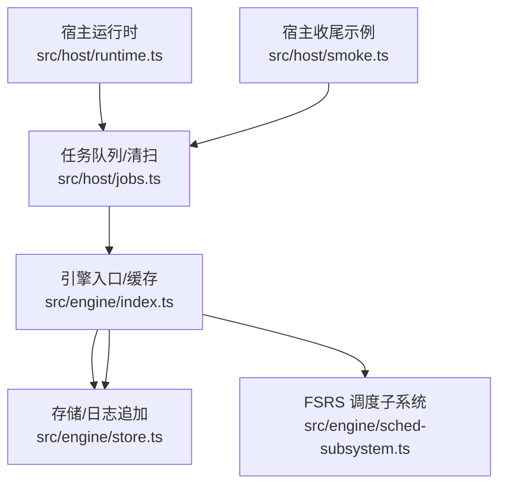
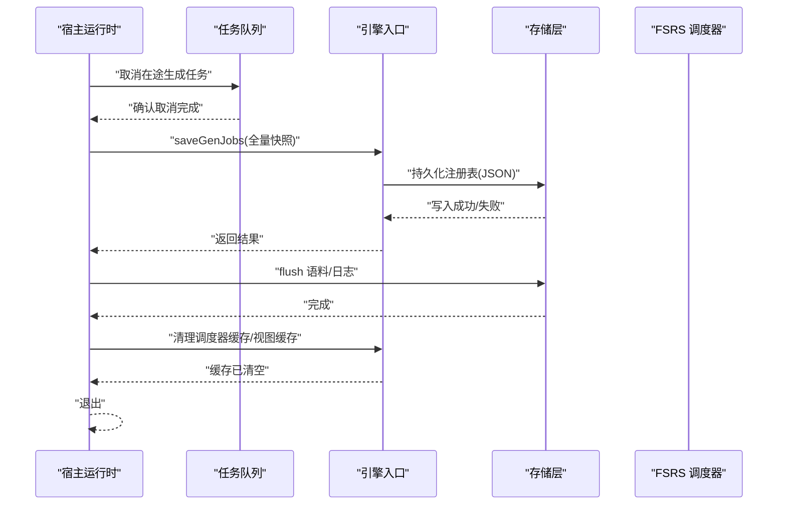
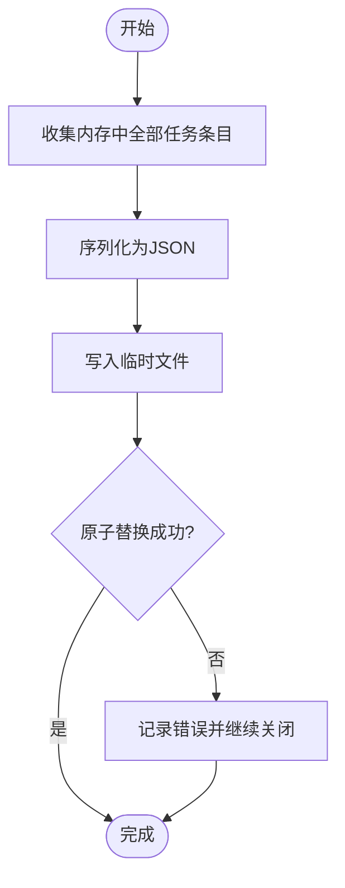
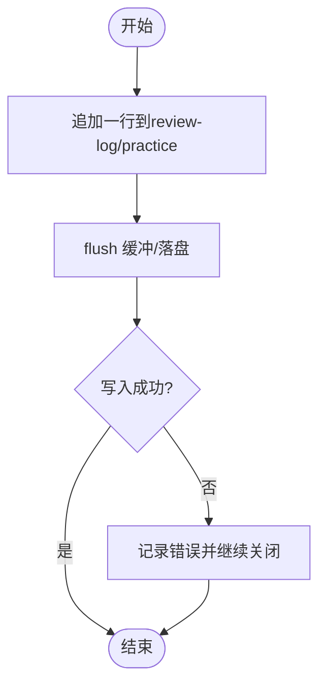
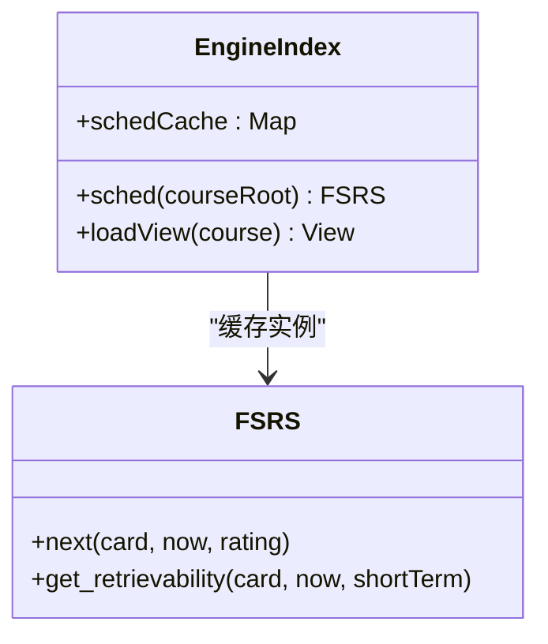
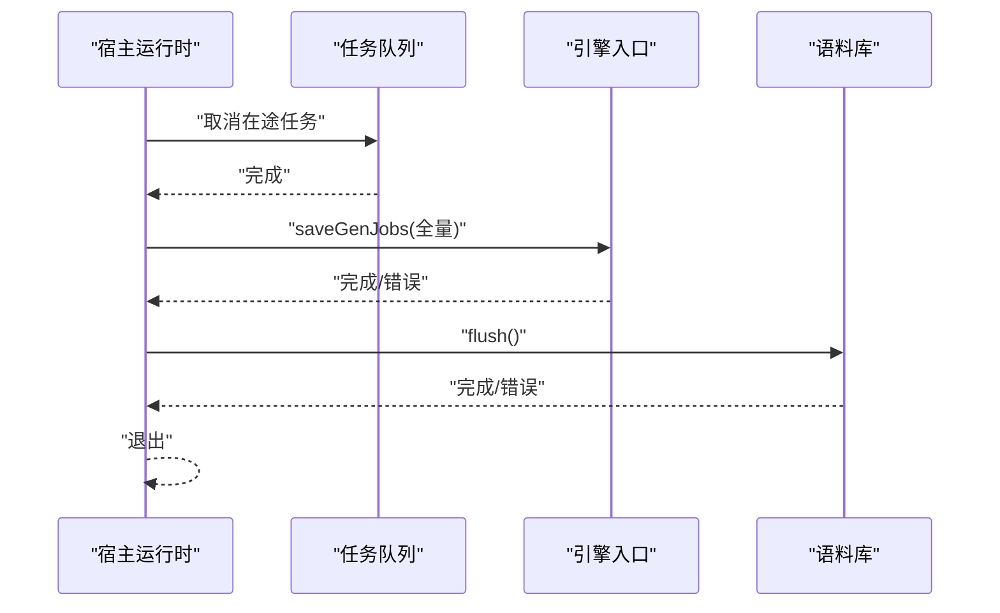
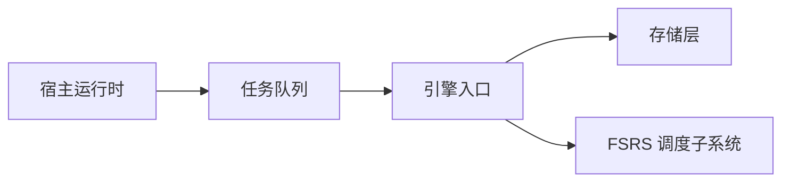

# 优雅关闭流程

<cite>
**本文引用的文件**
- [src/engine/index.ts](file://src/engine/index.ts)
- [src/host/runtime.ts](file://src/host/runtime.ts)
- [src/host/jobs.ts](file://src/host/jobs.ts)
- [src/engine/store.ts](file://src/engine/store.ts)
- [src/engine/sched-subsystem.ts](file://src/engine/sched-subsystem.ts)
- [src/host/smoke.ts](file://src/host/smoke.ts)
</cite>

## 目录
1. [简介](#简介)
2. [项目结构](#项目结构)
3. [核心组件](#核心组件)
4. [架构总览](#架构总览)
5. [详细组件分析](#详细组件分析)
6. [依赖关系分析](#依赖关系分析)
7. [性能考量](#性能考量)
8. [故障排查指南](#故障排查指南)
9. [结论](#结论)
10. [附录](#附录)

## 简介
本文件聚焦 LearnHub 引擎的“优雅关闭”流程，围绕以下目标展开：
- 资源释放顺序与数据持久化策略
- 生成任务注册表的保存机制（saveGenJobs），包括 JSON 文件的原子写入与错误处理
- 会话数据的持久化策略（练习记录、复习日志等追加型数据）
- 缓存清理机制（FSRS 调度器缓存、视图缓存等）
- 异常处理策略（关闭过程中的错误捕获与恢复）
- 与宿主运行时的集成（生命周期钩子调用与状态同步）
- 关闭流程的监控与调试方法（日志记录与错误追踪）

## 项目结构
与优雅关闭直接相关的代码主要分布在：
- 引擎入口与调度器缓存：src/engine/index.ts
- 宿主运行时与任务队列：src/host/runtime.ts、src/host/jobs.ts
- 存储与日志追加：src/engine/store.ts
- FSRS 参数与调度子系统：src/engine/sched-subsystem.ts
- 宿主侧收尾示例（取消在途任务、flush 语料）：src/host/smoke.ts

图表来源
- [src/host/runtime.ts](file://src/host/runtime.ts)
- [src/host/jobs.ts](file://src/host/jobs.ts)
- [src/engine/index.ts](file://src/engine/index.ts)
- [src/engine/store.ts](file://src/engine/store.ts)
- [src/engine/sched-subsystem.ts](file://src/engine/sched-subsystem.ts)
- [src/host/smoke.ts](file://src/host/smoke.ts)

章节来源
- [src/host/runtime.ts](file://src/host/runtime.ts)
- [src/host/jobs.ts](file://src/host/jobs.ts)
- [src/engine/index.ts](file://src/engine/index.ts)
- [src/engine/store.ts](file://src/engine/store.ts)
- [src/engine/sched-subsystem.ts](file://src/engine/sched-subsystem.ts)
- [src/host/smoke.ts](file://src/host/smoke.ts)

## 核心组件
- 宿主运行时（HostRuntime）：负责生命周期管理、任务队列协调、与引擎交互。
- 任务队列与注册表（jobs.ts）：维护生成任务注册表，提供入队、执行、清扫、持久化能力。
- 引擎入口（engine/index.ts）：持有 FSRS 调度器缓存、视图加载接口、以及 saveGenJobs 对外暴露点。
- 存储层（store.ts）：提供练习记录与复习日志的追加写入与读取。
- FSRS 调度子系统（sched-subsystem.ts）：封装调度器实例与参数优化/沉淀。
- 宿主收尾示例（smoke.ts）：演示关闭前取消在途任务、flush 语料并清理临时目录。

章节来源
- [src/host/runtime.ts](file://src/host/runtime.ts)
- [src/host/jobs.ts](file://src/host/jobs.ts)
- [src/engine/index.ts](file://src/engine/index.ts)
- [src/engine/store.ts](file://src/engine/store.ts)
- [src/engine/sched-subsystem.ts](file://src/engine/sched-subsystem.ts)
- [src/host/smoke.ts](file://src/host/smoke.ts)

## 架构总览
优雅关闭的整体时序如下：
1. 宿主触发关闭（例如进程信号或显式 API）。
2. 停止接受新任务，取消在途任务（如生成任务）。
3. 持久化关键状态（生成任务注册表、必要中间态）。
4. 刷新/落盘外部系统（如语料库 flush）。
5. 清理引擎内部缓存（FSRS 调度器缓存、视图缓存等）。
6. 释放资源并退出。

图表来源
- [src/host/runtime.ts](file://src/host/runtime.ts)
- [src/host/jobs.ts](file://src/host/jobs.ts)
- [src/engine/index.ts](file://src/engine/index.ts)
- [src/engine/store.ts](file://src/engine/store.ts)
- [src/engine/sched-subsystem.ts](file://src/engine/sched-subsystem.ts)

## 详细组件分析

### 生成任务注册表的保存机制（saveGenJobs）
- 职责：将内存中的生成任务注册表以 JSON 形式持久化到磁盘，供重启后恢复与面板展示。
- 调用点：任务状态变更、清扫、执行前后等关键路径均会触发持久化。
- 原子写入与错误处理：
  - 通过引擎暴露的 saveGenJobs 接口进行落盘；若底层写入失败，上层应记录错误并继续关闭流程，避免阻塞退出。
  - 建议采用“先写临时文件再原子替换”的策略，确保读侧不会读到半写文件。
- 与宿主协作：
  - 宿主在关闭时主动触发一次全量保存，确保最终一致性。
  - 若检测到注册表损坏（broken），清扫逻辑会跳过以避免二次破坏。

图表来源
- [src/engine/index.ts](file://src/engine/index.ts)
- [src/host/jobs.ts](file://src/host/jobs.ts)

章节来源
- [src/engine/index.ts:725-735](file://src/engine/index.ts#L725-L735)
- [src/host/jobs.ts:282-290](file://src/host/jobs.ts#L282-L290)
- [src/host/jobs.ts:397-417](file://src/host/jobs.ts#L397-L417)

### 会话数据的持久化策略（练习记录、复习日志等）
- 追加型数据模型：
  - 练习记录与复习日志采用 JSON Lines（追加写入），保证高吞吐与崩溃恢复友好。
  - 每次推进 FSRS 卡或记录学习行为时，都会追加一行，包含时间戳、课程/节点/题目、评分、预测保留率等字段。
- 关闭期策略：
  - 关闭前尽量 flush 所有缓冲输出，确保最近的数据行落盘。
  - 若写入失败，记录错误并继续关闭，不阻断退出。
- 读侧容错：
  - 读取时遇到缺失文件或坏行，按契约降级为“空态/报出 Broken”，不影响其他功能。

图表来源
- [src/engine/store.ts:124-147](file://src/engine/store.ts#L124-L147)

章节来源
- [src/engine/store.ts:124-147](file://src/engine/store.ts#L124-L147)
- [src/engine/data-check.ts:760-783](file://src/engine/data-check.ts#L760-L783)

### 缓存清理机制（FSRS 调度器缓存、视图缓存等）
- FSRS 调度器缓存：
  - 引擎维护 per-course 的 FSRS 实例缓存，减少重复构造成本。
  - 关闭时应清空该缓存，避免残留引用导致资源泄漏。
- 视图缓存：
  - 引擎加载视图（graph/content 等）可能产生缓存；关闭时需释放这些视图对象。
- 清理顺序：
  - 先停止任务与写入，再清理缓存，最后释放文件系统句柄。

图表来源
- [src/engine/index.ts:198-210](file://src/engine/index.ts#L198-L210)

章节来源
- [src/engine/index.ts:198-210](file://src/engine/index.ts#L198-L210)
- [src/engine/sched-subsystem.ts:333-361](file://src/engine/sched-subsystem.ts#L333-L361)

### 异常处理策略（关闭过程中的错误捕获与恢复）
- 原则：
  - 关闭过程不应因单个失败而中断整体退出；所有 I/O 操作需 try/catch 并记录错误。
  - 对关键路径（注册表保存、日志 flush）优先保障幂等与可重试。
- 具体实践：
  - 生成任务注册表保存失败：记录错误并继续关闭。
  - 语料库 flush 失败：忽略错误并继续（示例中 .catch(() => undefined)）。
  - 扫描/清扫过程中发现 broken 状态：跳过并留痕，延后到修复后重启处理。

章节来源
- [src/host/smoke.ts:372-383](file://src/host/smoke.ts#L372-L383)
- [src/host/jobs.ts:397-417](file://src/host/jobs.ts#L397-L417)

### 与宿主运行时的集成（生命周期钩子与状态同步）
- 生命周期钩子：
  - 宿主在关闭时调用引擎的保存接口（saveGenJobs），确保状态一致。
  - 宿主在关闭前取消在途任务，防止后台写盘与目录删除竞争。
- 状态同步：
  - 任务队列在状态变更后立即持久化，宿主关闭时再做一次全量保存，形成双重保险。
  - 语料库 flush 在关闭前执行，确保采集到的语料落盘。

图表来源
- [src/host/smoke.ts:372-383](file://src/host/smoke.ts#L372-L383)
- [src/host/jobs.ts:282-290](file://src/host/jobs.ts#L282-L290)
- [src/engine/index.ts:725-735](file://src/engine/index.ts#L725-L735)

章节来源
- [src/host/smoke.ts:372-383](file://src/host/smoke.ts#L372-L383)
- [src/host/jobs.ts:282-290](file://src/host/jobs.ts#L282-L290)
- [src/engine/index.ts:725-735](file://src/engine/index.ts#L725-L735)

## 依赖关系分析
- 宿主运行时依赖任务队列进行任务管理与持久化。
- 任务队列依赖引擎入口保存注册表。
- 引擎入口依赖存储层进行日志追加。
- FSRS 调度子系统被引擎入口缓存与复用。

图表来源
- [src/host/runtime.ts](file://src/host/runtime.ts)
- [src/host/jobs.ts](file://src/host/jobs.ts)
- [src/engine/index.ts](file://src/engine/index.ts)
- [src/engine/store.ts](file://src/engine/store.ts)
- [src/engine/sched-subsystem.ts](file://src/engine/sched-subsystem.ts)

章节来源
- [src/host/runtime.ts](file://src/host/runtime.ts)
- [src/host/jobs.ts](file://src/host/jobs.ts)
- [src/engine/index.ts](file://src/engine/index.ts)
- [src/engine/store.ts](file://src/engine/store.ts)
- [src/engine/sched-subsystem.ts](file://src/engine/sched-subsystem.ts)

## 性能考量
- 注册表保存：
  - 使用批量快照与原子替换，降低锁竞争与读侧不一致风险。
  - 避免在高频路径上频繁落盘；关闭阶段集中保存。
- 日志追加：
  - JSON Lines 追加写入具备良好吞吐；关闭前 flush 可减少数据丢失窗口。
- 缓存清理：
  - 及时释放 FSRS 与视图缓存，避免内存泄漏与句柄占用。
- 并发控制：
  - 取消在途任务后再删除目录，避免 ENOTEMPTY 竞争。

[本节为通用指导，无需特定文件引用]

## 故障排查指南
- 常见问题定位：
  - 注册表未更新：检查 saveGenJobs 调用链与底层写入是否成功。
  - 日志丢失：确认关闭前是否执行了 flush；检查 appendFile 是否抛出异常。
  - 缓存未释放：观察进程退出后是否存在句柄占用；检查 schedCache 与视图缓存清理逻辑。
- 日志与追踪：
  - 关注宿主与引擎的错误日志，特别是 .catch 分支与 runLog 输出。
  - 在关键路径添加耗时与错误码埋点，便于复现问题。

章节来源
- [src/host/smoke.ts:372-383](file://src/host/smoke.ts#L372-L383)
- [src/host/jobs.ts:397-417](file://src/host/jobs.ts#L397-L417)
- [src/engine/store.ts:124-147](file://src/engine/store.ts#L124-L147)

## 结论
LearnHub 的优雅关闭流程通过“停止任务→持久化状态→刷新外部系统→清理缓存→退出”的顺序，确保数据一致性与资源安全释放。生成任务注册表采用 JSON 原子写入，会话数据采用追加型日志，FSRS 与视图缓存得到妥善清理。异常处理遵循“失败不阻断退出”的原则，并通过宿主与引擎的协作实现可靠的状态同步。建议在关键路径增加更细粒度的日志与指标，以提升可观测性。

[本节为总结，无需特定文件引用]

## 附录
- 相关 ADR 与设计决策可参考仓库 docs/adr 目录，理解关闭流程背后的权衡。
- 测试用例覆盖关闭场景的行为断言，可作为回归验证依据。

[本节为补充信息，无需特定文件引用]