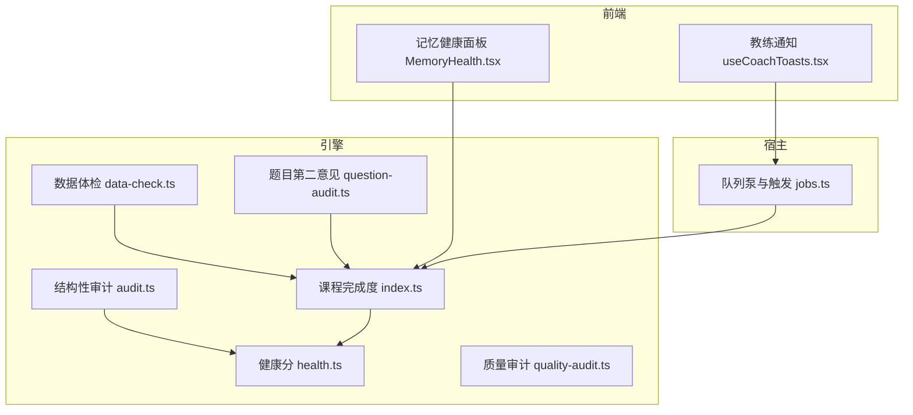
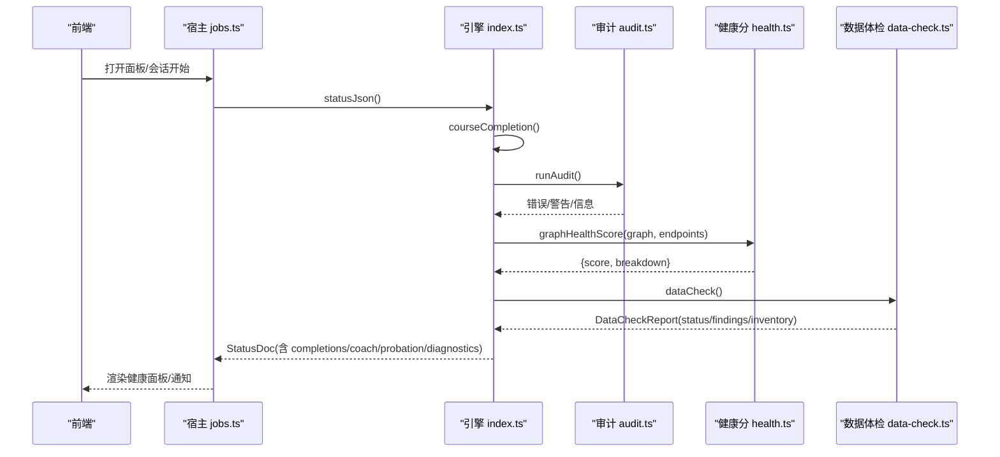
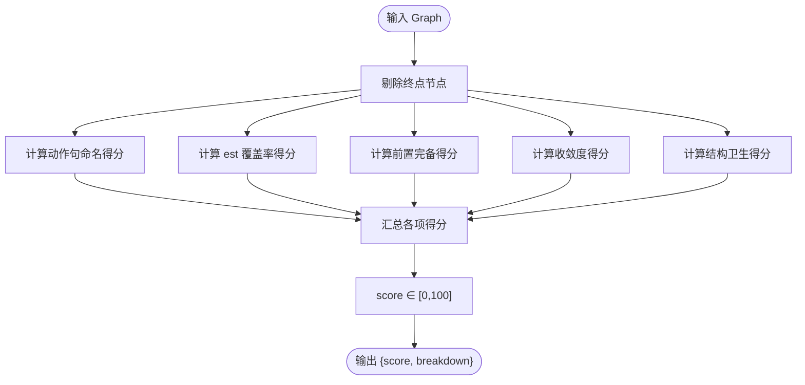
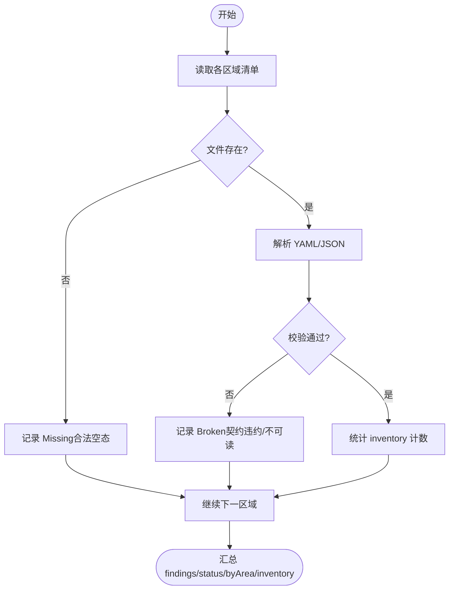
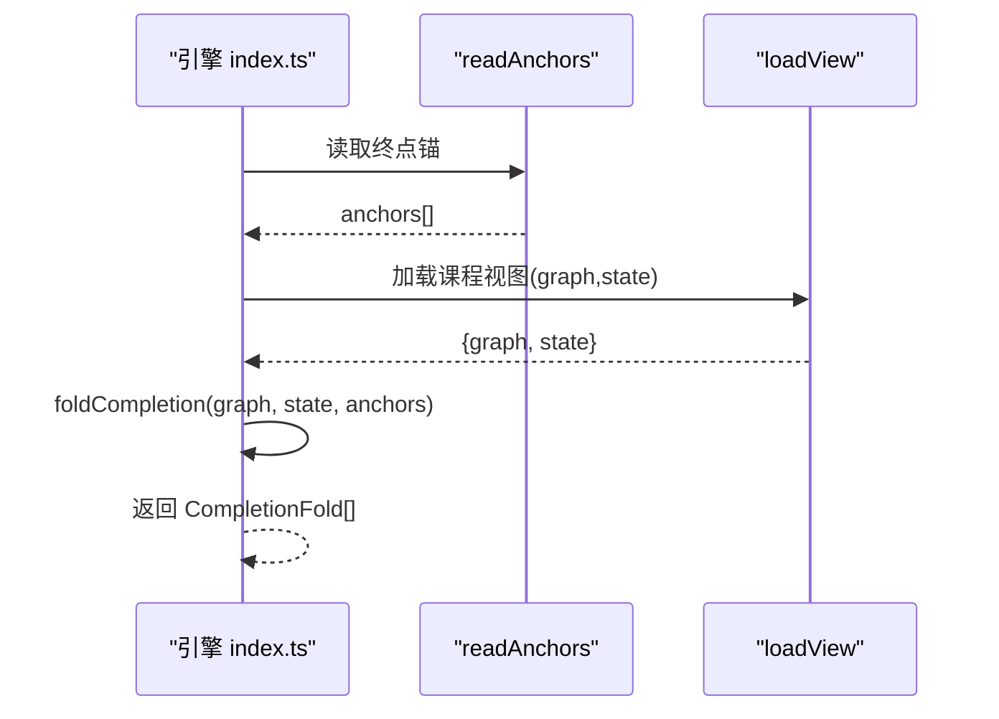
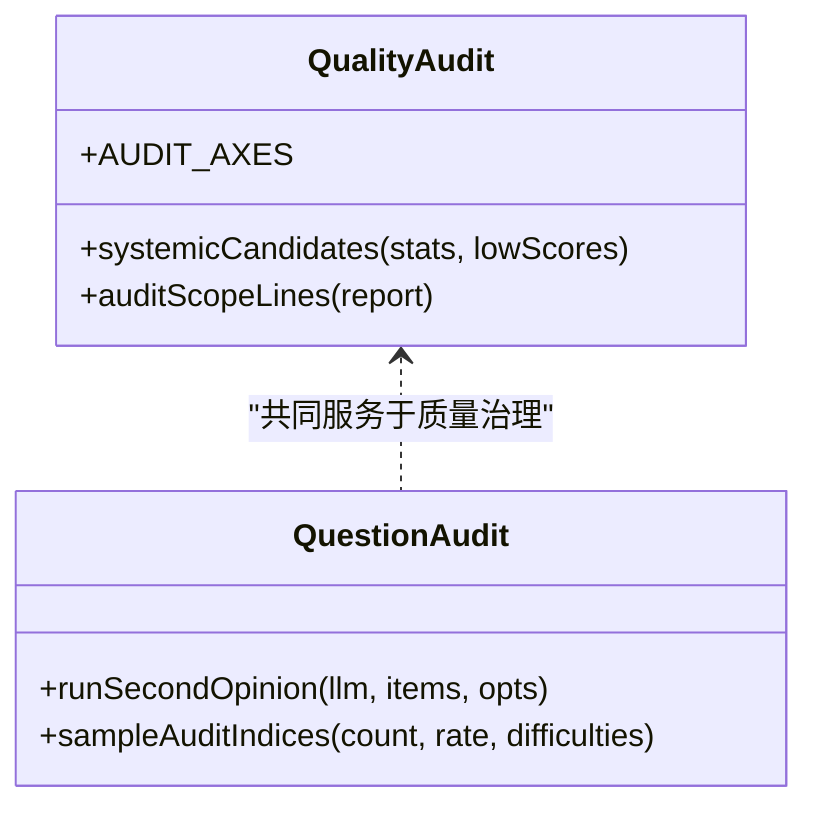
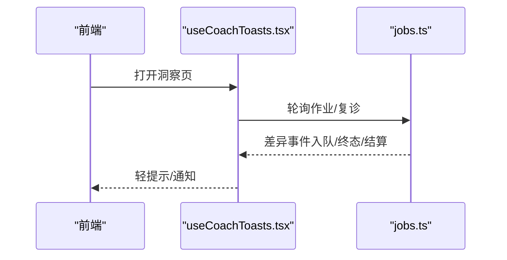
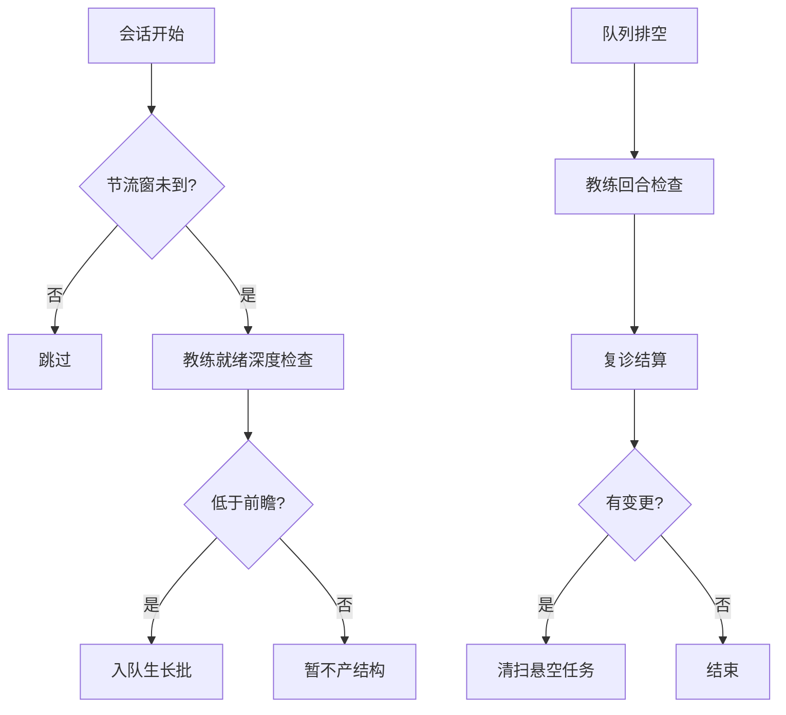
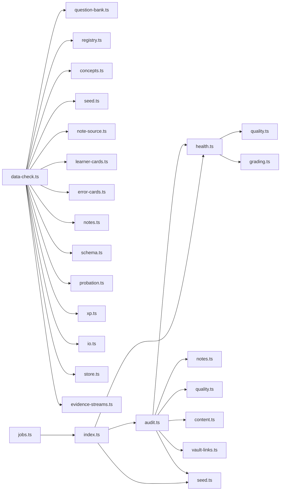

# 健康检查机制

<cite>
**本文引用的文件**
- [health.ts](file://src/engine/health.ts)
- [data-check.ts](file://src/engine/data-check.ts)
- [audit.ts](file://src/engine/audit.ts)
- [question-audit.ts](file://src/engine/question-audit.ts)
- [quality-audit.ts](file://src/engine/quality-audit.ts)
- [index.ts](file://src/engine/index.ts)
- [jobs.ts](file://src/host/jobs.ts)
- [MemoryHealth.tsx](file://ui/src/pages/InsightPage/MemoryHealth.tsx)
- [useCoachToasts.tsx](file://ui/src/useCoachToasts.tsx)
- [health.test.ts](file://tests/health.test.ts)
- [endpoint-surfaces.test.ts](file://tests/endpoint-surfaces.test.ts)
</cite>

## 目录
1. [简介](#简介)
2. [项目结构](#项目结构)
3. [核心组件](#核心组件)
4. [架构总览](#架构总览)
5. [详细组件分析](#详细组件分析)
6. [依赖关系分析](#依赖关系分析)
7. [性能考量](#性能考量)
8. [故障排查指南](#故障排查指南)
9. [结论](#结论)
10. [附录](#附录)

## 简介
本文件系统化说明 LearnHub 引擎的健康检查机制，覆盖图谱健康分计算、数据体检（Missing/Broken 检测与报告）、课程完成度检查（锚点验证与终点状态评估）、质量审计（题目质量与内容完整性）、监控指标与告警、自动化执行与定期扫描，以及常见问题诊断与修复建议。目标是让非专业读者也能理解并据此维护系统健康。

## 项目结构
健康检查相关能力分布在引擎层、宿主调度层与前端展示层：
- 引擎层：健康分计算、结构性审计、数据体检、质量审计、题目第二意见门、课程完成度折叠等。
- 宿主层：生成队列空闲触发教练回合与复诊结算，形成“自动巡检 + 自动修复”的闭环。
- 前端层：记忆健康面板、教练通知轮询，提供可视化与交互入口。

图表来源
- [health.ts:53-104](file://src/engine/health.ts#L53-L104)
- [audit.ts:35-315](file://src/engine/audit.ts#L35-L315)
- [data-check.ts:33-131](file://src/engine/data-check.ts#L33-L131)
- [question-audit.ts:168-279](file://src/engine/question-audit.ts#L168-L279)
- [index.ts:527-558](file://src/engine/index.ts#L527-L558)
- [jobs.ts:696-739](file://src/host/jobs.ts#L696-L739)
- [MemoryHealth.tsx:138-168](file://ui/src/pages/InsightPage/MemoryHealth.tsx#L138-L168)
- [useCoachToasts.tsx:1-13](file://ui/src/useCoachToasts.tsx#L1-L13)

章节来源
- [health.ts:53-104](file://src/engine/health.ts#L53-L104)
- [data-check.ts:33-131](file://src/engine/data-check.ts#L33-L131)
- [audit.ts:35-315](file://src/engine/audit.ts#L35-L315)
- [index.ts:527-558](file://src/engine/index.ts#L527-L558)
- [jobs.ts:696-739](file://src/host/jobs.ts#L696-L739)

## 核心组件
- 图谱健康分 graphHealthScore：将教学语义上的“站得住”压缩为 0–100 分数，包含动作句命名、est 覆盖率、前置完备性、收敛度、结构卫生五项，每项 0–20。支持剔除终点节点，避免方向标记干扰评分。
- 数据体检 dataCheck：只读盘点学习者数据，按区域分类 Missing/Broken/Archived/Hint，产出结构化报告与库存清单，不修改 Vault。
- 课程完成度 courseCompletion：基于终点锚集合逐终点评估完成态（最后台阶 + 收尾 sealed），零终点返回空数组（合法空态）。
- 质量审计 quality-audit：对图质量面进行抽样审计，输出系统性候选与低分件引用，辅助人审决策。
- 题目第二意见 question-audit：出题时独立解题并与答案键对账，不一致则回灌修复一轮，仍不一致弃题，保障题目质量。
- 结构性审计 audit：检查重名、未定义前置、环、enc 断边、frontmatter schema、深度异常、冗余边、连通分量、别名、先验喂料分流等，并写入审计报告。

章节来源
- [health.ts:53-104](file://src/engine/health.ts#L53-L104)
- [data-check.ts:33-131](file://src/engine/data-check.ts#L33-L131)
- [index.ts:527-558](file://src/engine/index.ts#L527-L558)
- [quality-audit.ts:50-124](file://src/engine/quality-audit.ts#L50-L124)
- [question-audit.ts:168-279](file://src/engine/question-audit.ts#L168-L279)
- [audit.ts:35-315](file://src/engine/audit.ts#L35-L315)

## 架构总览
健康检查在“读侧可观测、写侧受门禁”的原则下运行：
- 读侧：健康分、数据体检、完成度折叠、质量审计、题目第二意见均为只读或最小副作用，用于发现与提示。
- 写侧：生成队列空闲触发教练回合与复诊结算，自动推进修复；Broken 档拒绝写回，避免破坏现场。

图表来源
- [index.ts:527-558](file://src/engine/index.ts#L527-L558)
- [audit.ts:35-315](file://src/engine/audit.ts#L35-L315)
- [health.ts:53-104](file://src/engine/health.ts#L53-L104)
- [data-check.ts:33-131](file://src/engine/data-check.ts#L33-L131)
- [jobs.ts:696-739](file://src/host/jobs.ts#L696-L739)

## 详细组件分析

### 图谱健康分 graphHealthScore
- 设计目标：给出可优化的质量基线，不设置阈值、不参与完成判据；仅作为教练与审计参考。
- 指标构成（每项 0–20）：
  - 动作句命名比例：节点名是否以动词性字眼为主。
  - est 覆盖率：有估计时间的节点占比（排除终点）。
  - 前置完备性：空降节点越少越好（排除终点）。
  - 收敛度：非根节点平均 pre 数线性映射到 0–20（存在环或无内点则为 0）。
  - 结构卫生：别名包含命名、多连通分量、不可达根扣分（按规模容忍）。
- 终点豁免：通过 endpoints 参数剔除终点节点，避免方向标记影响健康分。
- 复杂度：主要开销在别名包含检测 O(N^2)，N 为节点数；其余为线性扫描。

图表来源
- [health.ts:53-104](file://src/engine/health.ts#L53-L104)

章节来源
- [health.ts:53-104](file://src/engine/health.ts#L53-L104)
- [endpoint-surfaces.test.ts:109-125](file://tests/endpoint-surfaces.test.ts#L109-L125)
- [health.test.ts:22-30](file://tests/health.test.ts#L22-L30)

### 数据体检 dataCheck
- 职责边界：只读盘点，不修复、不清理、不写入 Vault；Missing 是合法空状态，Broken 表示对象存在但无法解析或未通过契约。
- 覆盖范围：注册表、图、笔记、题库、笔记源镜像、我的卡、错误卡、概念登记表、终点锚、存档区、边实验账本、提案注册表、生成任务注册表、追加流水等。
- 报告结构：status（ok/missing/broken）、counts、byArea、inventory（各区域计数）、findings（定位与原因）。
- 关键规则：
  - 笔记源镜像：注册表条目 × 源清单双向对账，单边缺失 = Broken；源文件缺失报 Missing（合法状态，卡池挂起）。
  - 追加流水：中段坏行 → Broken finding；撕裂尾行 → hint finding；文件缺失 → Missing 合法空态。
  - 边实验账本：过期未决为 hint，不进 status；行为流水损坏时 overdue 降级为 0。

图表来源
- [data-check.ts:33-131](file://src/engine/data-check.ts#L33-L131)
- [data-check.ts:371-467](file://src/engine/data-check.ts#L371-L467)
- [data-check.ts:746-787](file://src/engine/data-check.ts#L746-L787)
- [data-check.ts:795-806](file://src/engine/data-check.ts#L795-L806)

章节来源
- [data-check.ts:33-131](file://src/engine/data-check.ts#L33-L131)
- [data-check.ts:371-467](file://src/engine/data-check.ts#L371-L467)
- [data-check.ts:746-787](file://src/engine/data-check.ts#L746-L787)
- [data-check.ts:795-806](file://src/engine/data-check.ts#L795-L806)

### 课程完成度检查 courseCompletion
- 输入：课程根路径；读取终点锚集合（可为空）。
- 逻辑：逐终点折叠完成态，依据“最后台阶（终点.pre 集全部 ≥ 阈值）+ 该终点已收尾 sealed”；零终点返回空数组（合法空态）。
- 集成：statusJson 中为每门课程附加 completions，供前端展示与决策。

图表来源
- [index.ts:527-558](file://src/engine/index.ts#L527-L558)

章节来源
- [index.ts:527-558](file://src/engine/index.ts#L527-L558)

### 质量审计机制
- 图质量面审计：对“教练回合裁决质量”和“种子·终点资格”两类审计轴进行抽样，输出审计声明、系统性候选与低分件引用，便于人审蒸馏新票或改量规。
- 题目质量审计（第二意见门）：客观题抽样独立解题，与答案键确定性对账；不一致则回灌修复一轮，仍不一致弃题；不可解析保守放行。

图表来源
- [quality-audit.ts:50-124](file://src/engine/quality-audit.ts#L50-L124)
- [question-audit.ts:168-279](file://src/engine/question-audit.ts#L168-L279)

章节来源
- [quality-audit.ts:50-124](file://src/engine/quality-audit.ts#L50-L124)
- [question-audit.ts:168-279](file://src/engine/question-audit.ts#L168-L279)

### 健康状态的监控指标与告警
- 记忆健康面板：每日负载预报（逾期、未来天数分布）、记忆状态分布、校准与遗忘率等，来自 sched2.memoryHealth。
- 教练通知：轮询生成任务与复诊结算变化，弹出“系统在我的课程上动了手”的通知，支持重试与回放。
- 队列空闲钩子：生成队列排空后触发教练回合就绪深度检查与复诊结算，失败仅留日志，不阻塞泵。

图表来源
- [MemoryHealth.tsx:138-168](file://ui/src/pages/InsightPage/MemoryHealth.tsx#L138-L168)
- [useCoachToasts.tsx:1-13](file://ui/src/useCoachToasts.tsx#L1-L13)
- [jobs.ts:696-739](file://src/host/jobs.ts#L696-L739)

章节来源
- [MemoryHealth.tsx:138-168](file://ui/src/pages/InsightPage/MemoryHealth.tsx#L138-L168)
- [useCoachToasts.tsx:1-13](file://ui/src/useCoachToasts.tsx#L1-L13)
- [jobs.ts:696-739](file://src/host/jobs.ts#L696-L739)

### 健康检查的自动化执行与定期扫描
- 触发点：
  - 会话开始节流窗口（30 分钟）触发教练回合就绪深度检查。
  - 生成队列排空触发教练回合与复诊结算。
  - 面板打开/agent 会话开工统一入口。
- 执行策略：
  - 教练回合低于前瞻的课程自动入队生长批（阻尼防循环）。
  - 复诊到期自动结算（proven/自动剪除），失败仅留日志。
  - 任务档 Broken 期间拒绝写回，避免覆盖现场。

图表来源
- [jobs.ts:528-544](file://src/host/jobs.ts#L528-L544)
- [jobs.ts:696-739](file://src/host/jobs.ts#L696-L739)

章节来源
- [jobs.ts:528-544](file://src/host/jobs.ts#L528-L544)
- [jobs.ts:696-739](file://src/host/jobs.ts#L696-L739)

## 依赖关系分析
- 健康分依赖图结构与质量工具：floatNodes、clamp01、Graph 字段。
- 数据体检依赖各子系统校验器：question-bank、registry、concepts、seed、note-source、learner-cards、error-cards、notes、schema、probation、xp、io、store、evidence-streams、dates、paths。
- 结构性审计依赖 notes、types、graph、health、quality、content、vault-links、seed、dates。
- 课程完成度依赖 seed.readAnchors、engine.loadView、foldCompletion。
- 题目第二意见依赖 grading.evaluateAllo、prompt-render、prompts/quiz。
- 宿主队列依赖 generation-jobs、llm、runtime、corpus。

图表来源
- [health.ts:53-104](file://src/engine/health.ts#L53-L104)
- [data-check.ts:33-131](file://src/engine/data-check.ts#L33-L131)
- [audit.ts:35-315](file://src/engine/audit.ts#L35-L315)
- [index.ts:527-558](file://src/engine/index.ts#L527-L558)
- [jobs.ts:696-739](file://src/host/jobs.ts#L696-L739)

章节来源
- [health.ts:53-104](file://src/engine/health.ts#L53-L104)
- [data-check.ts:33-131](file://src/engine/data-check.ts#L33-L131)
- [audit.ts:35-315](file://src/engine/audit.ts#L35-L315)
- [index.ts:527-558](file://src/engine/index.ts#L527-L558)
- [jobs.ts:696-739](file://src/host/jobs.ts#L696-L739)

## 性能考量
- 健康分：别名包含检测 O(N^2)，在大图中可能成为瓶颈；可通过限制采样或分批处理优化。
- 数据体检：遍历大量 Markdown/YAML/JSONL 文件，IO 密集；建议并行化与缓存（如只读指纹）。
- 结构性审计：enc 背书与 vault 链接先验需读取正文与缓存，注意批量读取与短路。
- 题目第二意见：LLM 调用成本高，采用等距抽样与高难度加权，控制样本量；修复轮再审计进一步增加成本，需配置合理 rate。
- 队列空闲触发：教练回合与复诊结算为 fire-and-forget，失败不阻塞泵，保证吞吐。

[本节为通用指导，无需具体文件引用]

## 故障排查指南
- 图谱健康分偏低：
  - 检查动作句命名比例是否过低（节点名缺乏动词性）。
  - 检查 est 覆盖率与分布压缩（p10-p90 ≤ 10 分钟提示）。
  - 检查空降节点与收敛度（pre 过少或环导致收敛度为 0）。
  - 检查结构卫生（别名包含、多连通分量、无根）。
- 数据体检发现 Broken：
  - 根据 area 与 reason 定位文件与问题类型（YAML/JSON 解析失败、契约违约、镜像不一致等）。
  - 笔记源镜像不一致：核对注册表与源清单，使用 relink 或重新注册。
  - 追加流水撕裂尾行：hint 级别，不影响 status；中段坏行需修复流文件。
- 课程完成度无读数：
  - 确认是否存在终点锚；零终点为合法空态。
  - 若锚存在但悬空（终点不在图内），需修复锚或图。
- 题目质量不合格：
  - 第二意见门拦截的题目查看 rejected 原因；修复轮失败则弃题。
  - 调整抽样率或题型范围，避免开放题参与对账。
- 自动化未触发：
  - 检查队列是否处于 broken 态（写回闸拒绝）。
  - 检查节流窗与会话开始触发点；确认 coachTrigger 与 settleRechecks 调用成功。

章节来源
- [health.ts:37-47](file://src/engine/health.ts#L37-L47)
- [data-check.ts:371-467](file://src/engine/data-check.ts#L371-L467)
- [data-check.ts:746-787](file://src/engine/data-check.ts#L746-L787)
- [data-check.ts:795-806](file://src/engine/data-check.ts#L795-L806)
- [index.ts:527-558](file://src/engine/index.ts#L527-L558)
- [question-audit.ts:168-279](file://src/engine/question-audit.ts#L168-L279)
- [jobs.ts:696-739](file://src/host/jobs.ts#L696-L739)

## 结论
LearnHub 的健康检查机制以“读侧可见、写侧受控”为核心原则，通过健康分、数据体检、完成度折叠、质量审计与题目第二意见门，构建多层次的质量保障体系。宿主层的队列空闲触发与复诊结算实现自动化巡检与修复闭环，前端面板与通知提供可视化与交互入口。遵循本指南可有效识别与修复健康问题，提升系统稳定性与内容质量。

[本节为总结，无需具体文件引用]

## 附录
- 健康分五维明细与含义见 health.ts 注释与实现。
- 数据体检区域与原因码见 data-check.ts 类型定义与扫描函数。
- 结构性审计错误/警告/信息编码见 audit.ts 注释与实现。
- 题目第二意见门配置与流程见 question-audit.ts。
- 课程完成度折叠逻辑与终点锚语义见 index.ts 与 seed.ts。

[本节为索引，无需具体文件引用]