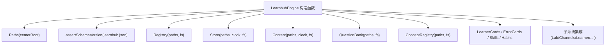
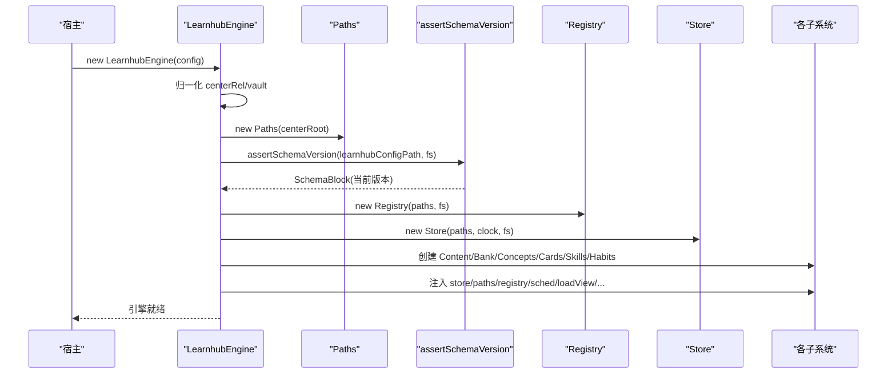
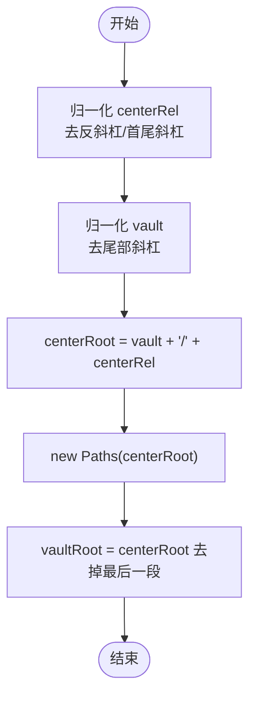
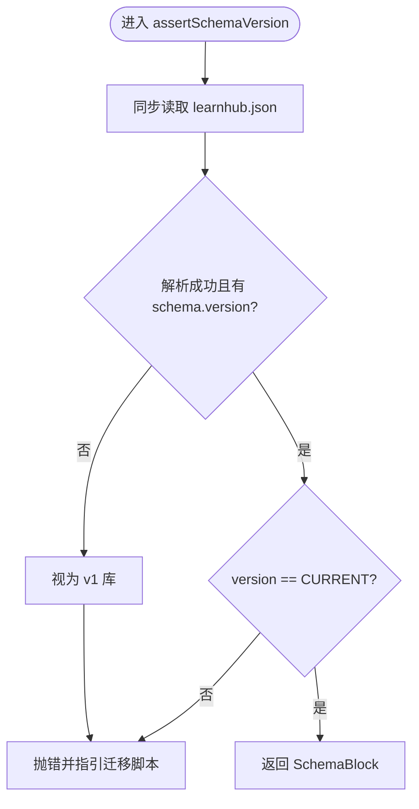
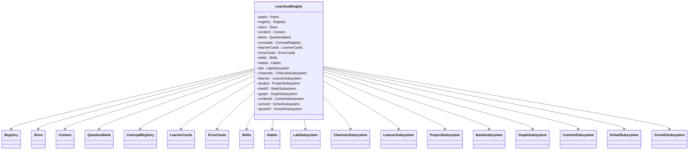
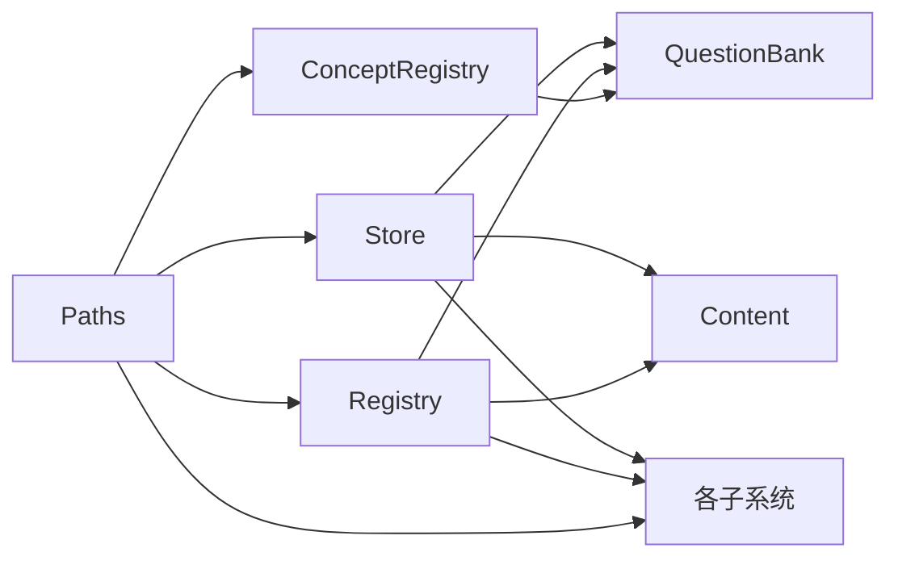

# 引擎初始化流程

<cite>
**本文引用的文件**
- [src/engine/index.ts](file://src/engine/index.ts)
- [src/engine/paths.ts](file://src/engine/paths.ts)
- [src/engine/schema.ts](file://src/engine/schema.ts)
- [src/engine/registry.ts](file://src/engine/registry.ts)
- [src/engine/store.ts](file://src/engine/store.ts)
- [src/engine/content.ts](file://src/engine/content.ts)
- [src/engine/question-bank.ts](file://src/engine/question-bank.ts)
- [src/engine/concepts.ts](file://src/engine/concepts.ts)
- [tests/host-runtime.test.ts](file://tests/host-runtime.test.ts)
- [tests/schema-cutover.test.ts](file://tests/schema-cutover.test.ts)
</cite>

## 目录
1. [简介](#简介)
2. [项目结构](#项目结构)
3. [核心组件](#核心组件)
4. [架构总览](#架构总览)
5. [详细组件分析](#详细组件分析)
6. [依赖关系分析](#依赖关系分析)
7. [性能考量](#性能考量)
8. [故障排查指南](#故障排查指南)
9. [结论](#结论)
10. [附录](#附录)

## 简介
本文件聚焦 LearnHub 引擎的初始化流程，围绕 LearnhubEngine 构造函数的完整执行过程展开：从配置参数校验、路径解析（vault 根目录与 centerRel）、schema 版本硬门检查，到各子系统实例化顺序与依赖注入机制。重点说明 Paths 对象的创建与 vaultRoot/centerRoot 规范化处理；解释 assertSchemaVersion 如何确保数据兼容性；梳理 Registry、Store、Content、QuestionBank、ConceptRegistry、LearnerCards、ErrorCards、Skills、Habits 等核心组件的构建顺序与相互依赖；并通过测试用例展示关键步骤与错误处理行为。

## 项目结构
LearnHub 引擎以门面类 LearnhubEngine 为中心，集中装配并暴露统一能力。初始化阶段主要涉及以下模块：
- 路径与配置：Paths 负责学习中心与课程级路径派生；EngineConfig 提供 vault、centerRel、时钟、随机源与存储端口。
- 版本门：schema.ts 提供 CURRENT_SCHEMA_VERSION 与 assertSchemaVersion，启动时同步读取 learnhub.json 进行版本硬门。
- 子系统装配：在构造函数中按严格顺序创建 Registry、Store、Content、QuestionBank、ConceptRegistry、LearnerCards、ErrorCards、Skills、Habits，以及若干子系统（Lab、Channels、Learner、Project、Bank、Graph、ContentSubsystem、SchedSubsystem、GrowthSubsystem）。
- 依赖注入：通过窄面接口将 store、paths、registry、sched、learningDay、loadView、enabledCourses、loadPrompt 等能力注入到各子系统，避免循环依赖并保持边界清晰。

图表来源
- [src/engine/index.ts:212-398](file://src/engine/index.ts#L212-L398)
- [src/engine/paths.ts:26-37](file://src/engine/paths.ts#L26-L37)
- [src/engine/schema.ts:63-79](file://src/engine/schema.ts#L63-L79)

章节来源
- [src/engine/index.ts:133-196](file://src/engine/index.ts#L133-L196)
- [src/engine/paths.ts:1-37](file://src/engine/paths.ts#L1-L37)
- [src/engine/schema.ts:1-79](file://src/engine/schema.ts#L1-L79)

## 核心组件
- LearnhubEngine：门面入口，持有 paths、store、registry、content、bank、concepts、learnerCards、errorCards、skills、habits 及多个子系统，并提供推荐、状态、诊断等方法。
- Paths：学习中心统一定位器，提供 vaultRoot、centerRoot 与大量课程/中心级路径访问器。
- Store：明文运行态存储，管理 journal/practice/review-log/proposals/snapshots/pin 等持久化。
- Registry：课程注册表加载与校验，支持启用课程过滤与 CLI 选择语义。
- Content：内容管线，生成队列、上下文包、提示词模板、质检门等。
- QuestionBank：题库读写与 schema 校验，题目归档、勘误、难度建议等。
- ConceptRegistry：概念登记表，受控词表与引用解析、合并与冲突检测。

章节来源
- [src/engine/index.ts:149-196](file://src/engine/index.ts#L149-L196)
- [src/engine/paths.ts:26-198](file://src/engine/paths.ts#L26-L198)
- [src/engine/store.ts:46-206](file://src/engine/store.ts#L46-L206)
- [src/engine/registry.ts:77-154](file://src/engine/registry.ts#L77-L154)
- [src/engine/content.ts:51-80](file://src/engine/content.ts#L51-L80)
- [src/engine/question-bank.ts:264-318](file://src/engine/question-bank.ts#L264-L318)
- [src/engine/concepts.ts:284-335](file://src/engine/concepts.ts#L284-L335)

## 架构总览
下图展示了 LearnhubEngine 构造过程中的关键步骤与依赖关系：配置归一化、路径计算、schema 版本硬门、基础子系统创建、子系统间依赖注入。

图表来源
- [src/engine/index.ts:212-398](file://src/engine/index.ts#L212-L398)
- [src/engine/schema.ts:63-79](file://src/engine/schema.ts#L63-L79)
- [src/engine/paths.ts:26-37](file://src/engine/paths.ts#L26-L37)

## 详细组件分析

### 配置参数验证与路径解析
- 输入 EngineConfig 包含 vault（必填绝对路径）、centerRel（缺省“学习中心”）、clock/rng/fs 端口。
- 路径归一化：
  - centerRel 去除反斜杠与首尾斜杠，保证跨平台一致性。
  - vault 去除尾部斜杠，作为 vault 根。
  - centerRoot = vault + "/" + centerRel。
- Paths 对象：
  - constructor 接收 centerRoot。
  - vaultRoot 通过剥离 centerRoot 最后一段得到，用于定位中心外个人笔记基面。
  - 所有课程级路径由 courseRoot(root) 派生，中心级路径由 centerRoot 派生。

图表来源
- [src/engine/index.ts:212-224](file://src/engine/index.ts#L212-L224)
- [src/engine/paths.ts:26-37](file://src/engine/paths.ts#L26-L37)

章节来源
- [src/engine/index.ts:133-147](file://src/engine/index.ts#L133-L147)
- [src/engine/index.ts:212-224](file://src/engine/index.ts#L212-L224)
- [src/engine/paths.ts:26-37](file://src/engine/paths.ts#L26-L37)

### schema 版本硬门检查
- 目标：确保 learnhub.json 的 schema.version 等于 CURRENT_SCHEMA_VERSION，否则拒载。
- 实现要点：
  - 同步读取 learnhubConfigPath（learnhub.json），解析 schema 块。
  - 缺失文件或损坏视为史前库（v1），同样拒绝。
  - 报错信息指引一次性迁移脚本 scripts/migrate-v2.mjs。
- 测试覆盖：
  - 新库出生会写入 schema version=3。
  - 旧版或缺失版本均抛错，且错误文案指向迁移脚本。

图表来源
- [src/engine/schema.ts:63-79](file://src/engine/schema.ts#L63-L79)
- [tests/host-runtime.test.ts:121-141](file://tests/host-runtime.test.ts#L121-L141)
- [tests/schema-cutover.test.ts:51-81](file://tests/schema-cutover.test.ts#L51-L81)

章节来源
- [src/engine/schema.ts:1-79](file://src/engine/schema.ts#L1-L79)
- [tests/host-runtime.test.ts:121-141](file://tests/host-runtime.test.ts#L121-L141)
- [tests/schema-cutover.test.ts:51-81](file://tests/schema-cutover.test.ts#L51-L81)

### 子系统初始化顺序与依赖注入
- 基础子系统创建顺序（构造函数内）：
  1) Registry：课程注册表加载与校验。
  2) Store：运行态存储（journal/practice/review-log/proposals/snapshots/pins）。
  3) Content：内容管线（队列、上下文包、提示词、质检门）。
  4) QuestionBank：题库读写与校验。
  5) ConceptRegistry：概念登记表。
  6) LearnerCards/ErrorCards/Skills/Habits：学习者产出、错误卡、技能、习惯。
  7) NoteSourceManifest/AnkiMirror：笔记源清单与 Anki 镜像。
  8) GraphProposals/Projects/Sessions：提案、项目、会话。
  9) 子系统聚合层：Lab、Channels、Learner、Project、Bank、Graph、ContentSubsystem、SchedSubsystem、GrowthSubsystem，通过窄面注入共享依赖。
- 依赖注入模式：
  - 每个子系统通过构造参数获取所需能力（如 store、paths、registry、sched、learningDay、loadView、enabledCourses、loadPrompt、scanCourseBanks 等）。
  - 使用函数式回调（如 sched(courseRoot) => this.sched(courseRoot)）延迟获取调度器，避免重复实例化。
  - 通过窄面接口减少耦合，避免环依赖（例如 question-bank 被 note-source 反向 type-import，值依赖留在原地）。

图表来源
- [src/engine/index.ts:149-398](file://src/engine/index.ts#L149-L398)

章节来源
- [src/engine/index.ts:212-398](file://src/engine/index.ts#L212-L398)

### 关键步骤与错误处理示例
- 配置与路径：
  - 若 centerRel 或 vault 格式异常，会在归一化后形成错误的 centerRoot，后续路径全部基于此，因此务必保证输入正确。
- schema 版本：
  - 若 learnhub.json 缺失或版本不匹配，构造函数立即抛错，阻止任何读盘操作，确保数据一致性。
- 子系统装配：
  - Registry 缺失为合法空态（无课程），但 Broken 则抛错；Store 对 JSONL 中段损坏采用 Broken 策略，防止静默降级。
  - QuestionBank 对 YAML 与 schema 校验失败抛出 Broken，保障题库质量。
  - ConceptRegistry 对名字联合唯一性进行校验，冲突时报错。

章节来源
- [src/engine/registry.ts:80-102](file://src/engine/registry.ts#L80-L102)
- [src/engine/store.ts:172-206](file://src/engine/store.ts#L172-L206)
- [src/engine/question-bank.ts:275-318](file://src/engine/question-bank.ts#L275-L318)
- [src/engine/concepts.ts:112-138](file://src/engine/concepts.ts#L112-L138)

## 依赖关系分析
- 低层依赖：
  - Paths 仅依赖文件系统抽象 VaultFs，提供稳定路径派生。
  - Store 依赖 Paths、Clock、VaultFs，管理追加型流水与原子写。
  - Registry/ConceptRegistry 依赖 Paths/VaultFs/YAML 解析与契约校验。
- 中层依赖：
  - Content/QuestionBank 依赖 Store、Paths、YAML、复杂逻辑（复杂度、提示词、质检门）。
- 高层依赖：
  - 各子系统通过窄面接口组合，避免直接耦合具体实现，便于替换与测试。

图表来源
- [src/engine/store.ts:46-206](file://src/engine/store.ts#L46-L206)
- [src/engine/registry.ts:77-154](file://src/engine/registry.ts#L77-L154)
- [src/engine/concepts.ts:284-335](file://src/engine/concepts.ts#L284-L335)
- [src/engine/index.ts:242-398](file://src/engine/index.ts#L242-L398)

章节来源
- [src/engine/store.ts:46-206](file://src/engine/store.ts#L46-L206)
- [src/engine/registry.ts:77-154](file://src/engine/registry.ts#L77-L154)
- [src/engine/concepts.ts:284-335](file://src/engine/concepts.ts#L284-L335)
- [src/engine/index.ts:242-398](file://src/engine/index.ts#L242-L398)

## 性能考量
- 调度器缓存：LearnhubEngine 内部维护 FSRS 调度器缓存（按 courseRoot 键），避免每次答题重建与读盘成本。
- 路径计算：Paths 提供 getter 派生路径，避免重复字符串拼接；vaultRoot/centerRoot 规范化一次完成。
- 文件 IO：Store 对追加型日志使用 appendFile，非追加文件使用 atomicWrite（临时文件+rename）保证原子性。
- 子系统懒加载：sched 通过回调延迟获取，减少不必要初始化。

章节来源
- [src/engine/index.ts:198-210](file://src/engine/index.ts#L198-L210)
- [src/engine/store.ts:51-64](file://src/engine/store.ts#L51-L64)
- [src/engine/store.ts:204-206](file://src/engine/store.ts#L204-L206)

## 故障排查指南
- schema 版本不匹配：
  - 现象：构造函数抛错，提示 learnhub.json 版本与引擎期望不一致。
  - 处理：运行一次性迁移脚本 scripts/migrate-v2.mjs 更新版本戳并归档旧库。
- 注册表 Broken：
  - 现象：YAML 无法解析或契约校验失败。
  - 处理：修复课程注册表 YAML，确保 courses 列表与条目字段合法。
- 题库 Broken：
  - 现象：YAML 无法解析或 schema 校验失败。
  - 处理：修复题库 YAML，确保 node/questions 结构与题型约束。
- 概念登记表冲突：
  - 现象：名字联合唯一性冲突。
  - 处理：合并重复条目或修正别名，确保每个名字只属一个条目。

章节来源
- [src/engine/schema.ts:63-79](file://src/engine/schema.ts#L63-L79)
- [src/engine/registry.ts:80-102](file://src/engine/registry.ts#L80-L102)
- [src/engine/question-bank.ts:275-318](file://src/engine/question-bank.ts#L275-L318)
- [src/engine/concepts.ts:112-138](file://src/engine/concepts.ts#L112-L138)

## 结论
LearnhubEngine 的初始化流程通过严格的配置归一化、路径解析与 schema 版本硬门，确保数据兼容性与系统稳定性。子系统按明确顺序创建并通过窄面接口进行依赖注入，形成清晰的边界与可测试性。该设计既保证了运行时性能（如调度器缓存），又提供了强大的错误处理与故障恢复能力（Broken 策略与迁移脚本指引）。

## 附录
- 关键代码片段路径（供快速定位）：
  - 构造函数主体与子系统装配：[src/engine/index.ts:212-398](file://src/engine/index.ts#L212-L398)
  - 路径派生与 vaultRoot/centerRoot：[src/engine/paths.ts:26-37](file://src/engine/paths.ts#L26-L37)
  - schema 版本硬门：[src/engine/schema.ts:63-79](file://src/engine/schema.ts#L63-L79)
  - 注册表加载与校验：[src/engine/registry.ts:80-102](file://src/engine/registry.ts#L80-L102)
  - 存储层追加与原子写：[src/engine/store.ts:51-64](file://src/engine/store.ts#L51-L64), [src/engine/store.ts:204-206](file://src/engine/store.ts#L204-L206)
  - 题库 schema 校验：[src/engine/question-bank.ts:275-318](file://src/engine/question-bank.ts#L275-L318)
  - 概念登记表校验与合并：[src/engine/concepts.ts:112-138](file://src/engine/concepts.ts#L112-L138), [src/engine/concepts.ts:284-335](file://src/engine/concepts.ts#L284-L335)
- 测试用例参考：
  - 部署校验与版本戳写入：[tests/host-runtime.test.ts:121-141](file://tests/host-runtime.test.ts#L121-L141)
  - 版本硬门与迁移指引：[tests/schema-cutover.test.ts:51-81](file://tests/schema-cutover.test.ts#L51-L81)