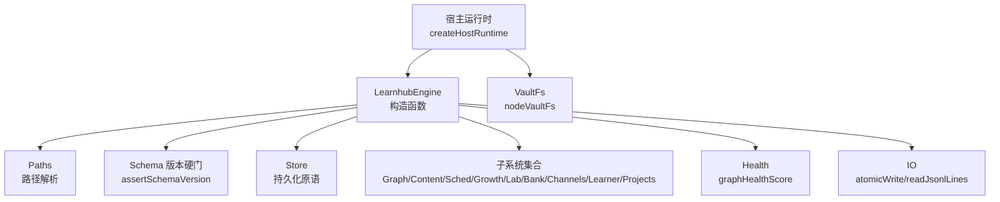
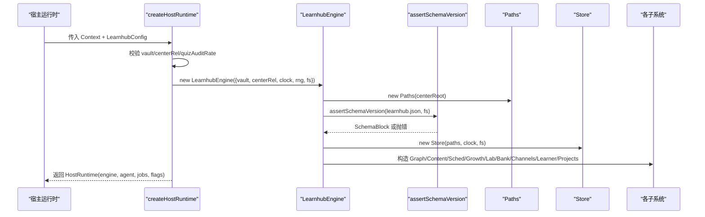
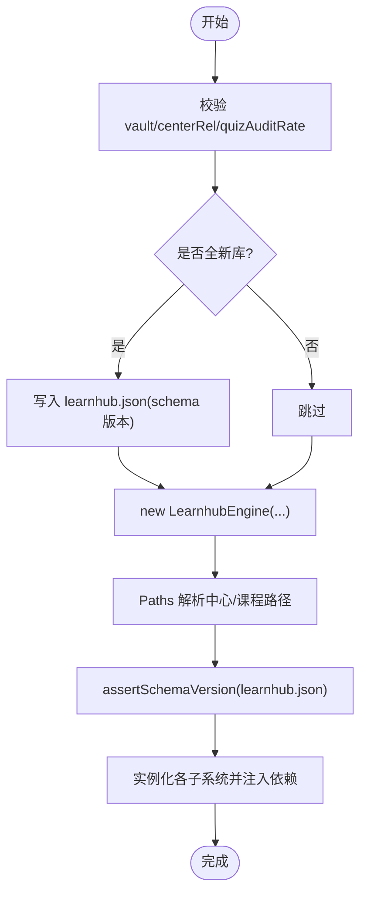
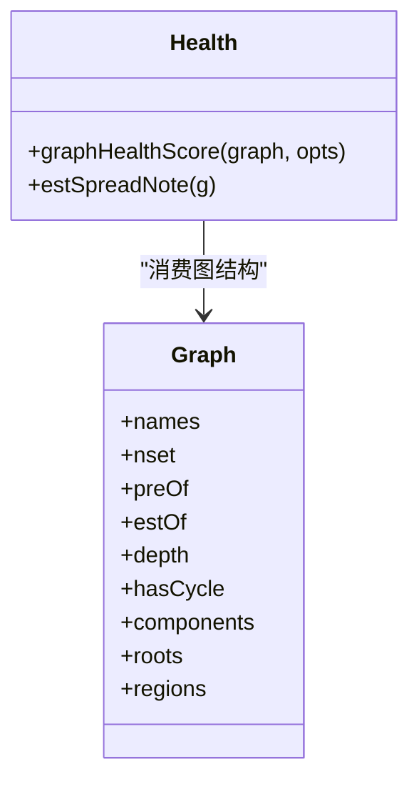
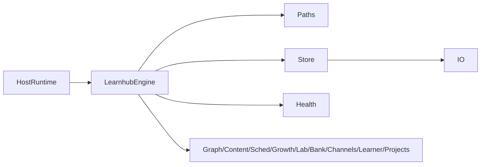

# 生命周期管理

<cite>
**本文引用的文件**
- [src/engine/index.ts](file://src/engine/index.ts)
- [src/host/runtime.ts](file://src/host/runtime.ts)
- [src/engine/health.ts](file://src/engine/health.ts)
- [src/engine/store.ts](file://src/engine/store.ts)
- [src/engine/schema.ts](file://src/engine/schema.ts)
- [src/engine/paths.ts](file://src/engine/paths.ts)
- [src/engine/io.ts](file://src/engine/io.ts)
- [src/host/vault-fs.ts](file://src/host/vault-fs.ts)
- [src/host/jobs.ts](file://src/host/jobs.ts)
</cite>

## 目录
1. [简介](#简介)
2. [项目结构](#项目结构)
3. [核心组件](#核心组件)
4. [架构总览](#架构总览)
5. [详细组件分析](#详细组件分析)
6. [依赖关系分析](#依赖关系分析)
7. [性能考量](#性能考量)
8. [故障排查指南](#故障排查指南)
9. [结论](#结论)
10. [附录](#附录)

## 简介
本文面向 LearnHub 引擎的生命周期管理，系统性说明从宿主装配到引擎启动、资源管理、健康检查、优雅关闭与错误恢复的完整流程。重点覆盖：
- 启动流程：配置校验、路径解析、schema 版本硬门、子系统实例化与依赖注入
- 资源管理：文件句柄、内存缓存、连接池（FSRS 调度器）策略
- 健康检查：graphHealthScore 指标与健康状态监控
- 生命周期事件钩子：在关键阶段插入自定义逻辑
- 错误处理与恢复：Broken/Missing 语义、原子写、任务队列恢复

## 项目结构
LearnHub 引擎由“宿主运行时”与“引擎门面”组成：
- 宿主运行时负责装配 VaultFs、时钟/随机源、AgentSeam 等外部适配，并创建 LearnhubEngine
- 引擎门面 LearnhubEngine 负责 schema 版本硬门、路径解析、各子系统构造与依赖注入
- Store 提供 JSONL/JSON 持久化原语；Paths 统一定义所有中心级/课程级路径
- Health 模块提供图谱健康分计算；IO 提供原子写与 JSONL 读取

图表来源
- [src/host/runtime.ts:138-192](file://src/host/runtime.ts#L138-L192)
- [src/engine/index.ts:212-398](file://src/engine/index.ts#L212-L398)
- [src/engine/schema.ts:63-79](file://src/engine/schema.ts#L63-L79)
- [src/engine/paths.ts:26-197](file://src/engine/paths.ts#L26-L197)
- [src/engine/store.ts:46-47](file://src/engine/store.ts#L46-L47)
- [src/engine/io.ts:34-39](file://src/engine/io.ts#L34-L39)
- [src/host/vault-fs.ts:11-24](file://src/host/vault-fs.ts#L11-L24)

章节来源
- [src/host/runtime.ts:138-192](file://src/host/runtime.ts#L138-L192)
- [src/engine/index.ts:212-398](file://src/engine/index.ts#L212-L398)
- [src/engine/schema.ts:63-79](file://src/engine/schema.ts#L63-L79)
- [src/engine/paths.ts:26-197](file://src/engine/paths.ts#L26-L197)
- [src/engine/store.ts:46-47](file://src/engine/store.ts#L46-L47)
- [src/engine/io.ts:34-39](file://src/engine/io.ts#L34-L39)
- [src/host/vault-fs.ts:11-24](file://src/host/vault-fs.ts#L11-L24)

## 核心组件
- LearnhubEngine：引擎门面，负责启动期硬门、路径解析、子系统装配与依赖注入
- Store：明文运行态存储，统一 JSONL/JSON 读写与原子写
- Paths：学习中心与课程级路径定义
- Health：图谱健康分计算（动作命名、est 覆盖率、前置完备、收敛度、结构卫生）
- IO：原子写、JSONL 只读原语
- VaultFs：文件系统适配层，将 node:fs 暴露为可测试端口

章节来源
- [src/engine/index.ts:149-398](file://src/engine/index.ts#L149-L398)
- [src/engine/store.ts:46-47](file://src/engine/store.ts#L46-L47)
- [src/engine/paths.ts:26-197](file://src/engine/paths.ts#L26-L197)
- [src/engine/health.ts:53-104](file://src/engine/health.ts#L53-L104)
- [src/engine/io.ts:34-39](file://src/engine/io.ts#L34-L39)
- [src/host/vault-fs.ts:11-24](file://src/host/vault-fs.ts#L11-L24)

## 架构总览
下图展示宿主装配与引擎启动的关键调用序列：

图表来源
- [src/host/runtime.ts:138-192](file://src/host/runtime.ts#L138-L192)
- [src/engine/index.ts:212-398](file://src/engine/index.ts#L212-L398)
- [src/engine/schema.ts:63-79](file://src/engine/schema.ts#L63-L79)

章节来源
- [src/host/runtime.ts:138-192](file://src/host/runtime.ts#L138-L192)
- [src/engine/index.ts:212-398](file://src/engine/index.ts#L212-L398)
- [src/engine/schema.ts:63-79](file://src/engine/schema.ts#L63-L79)

## 详细组件分析

### 启动流程：配置验证、路径解析、schema 检查、子系统实例化与依赖注入
- 配置验证
  - 宿主 createHostRuntime 校验 vault 存在、centerRel 存在、quizAuditRate 范围
  - 首次启动时若 learnhub.json 与课程注册表均不存在，则写入当前 schema 版本
- 路径解析
  - Paths 基于 centerRoot 派生所有中心级与课程级路径，保证一致性与可测试性
- Schema 版本硬门
  - 构造 LearnhubEngine 时同步读取 learnhub.json，非当前主版本直接抛错，阻止旧库使用
- 子系统实例化与依赖注入
  - 引擎构造中依次实例化 Registry、Store、Content、QuestionBank、ConceptRegistry、LearnerCards、ErrorCards、Skills、Habits、NoteSourceManifest、AnkiMirror、Sessions
  - 通过对象字面量向各子系统注入共享依赖（store、paths、registry、sched、learningDay、loadView、enabledCourses、loadPrompt 等），形成强内聚弱耦合的装配边界
  - 生成任务注册表与队列标志在宿主侧维护，engine 提供 save/load 接口

图表来源
- [src/host/runtime.ts:138-192](file://src/host/runtime.ts#L138-L192)
- [src/engine/index.ts:212-398](file://src/engine/index.ts#L212-L398)
- [src/engine/schema.ts:63-79](file://src/engine/schema.ts#L63-L79)

章节来源
- [src/host/runtime.ts:138-192](file://src/host/runtime.ts#L138-L192)
- [src/engine/index.ts:212-398](file://src/engine/index.ts#L212-L398)
- [src/engine/schema.ts:63-79](file://src/engine/schema.ts#L63-L79)

### 资源管理机制：文件句柄、内存缓存、连接池
- 文件句柄
  - 所有写操作走 atomicWrite：先写临时文件再 rename，避免部分写入导致损坏
  - JSONL 追加采用 appendFile，读侧 readJsonlLinesReport 对撕裂尾行豁免，中段损坏抛出 Broken
  - 配置与清单类文件（proposals、pin、experiments、genJobs）采用原子写全量替换
- 内存缓存
  - schedCache：按 courseRoot 缓存 FSRS 调度器实例，避免重复构建与磁盘读取
  - 视图加载 loadView：每次现读图与 frontmatter，保证最新且轻量
- 连接池
  - 无显式数据库连接池；FSRS 作为“连接”被缓存复用
  - VaultFs 抽象了文件系统访问，便于测试与未来扩展

章节来源
- [src/engine/io.ts:34-39](file://src/engine/io.ts#L34-L39)
- [src/engine/io.ts:71-101](file://src/engine/io.ts#L71-L101)
- [src/engine/store.ts:172-206](file://src/engine/store.ts#L172-L206)
- [src/engine/index.ts:198-210](file://src/engine/index.ts#L198-L210)
- [src/engine/index.ts:410-417](file://src/engine/index.ts#L410-L417)

### 健康检查机制：graphHealthScore 与健康状态监控
- graphHealthScore 五项指标（每项 0-20，总分 0-100）：
  - 动作命名比例：节点名包含动作词的比例
  - est 覆盖率：带估计时间的节点占比
  - 前置完备：空降节点越少越好
  - 收敛度：非根节点平均前置数（≥2 满分）
  - 结构卫生：别名包含、多连通分量、无根等扣分项
- 终点豁免：终点节点不参与健康分计算（方向标记不计入缺陷）
- 使用场景：rebuild/seedAuditFor 等入口输出健康分，辅助教练与审计

图表来源
- [src/engine/health.ts:53-104](file://src/engine/health.ts#L53-L104)

章节来源
- [src/engine/health.ts:53-104](file://src/engine/health.ts#L53-L104)
- [src/engine/index.ts:636-647](file://src/engine/index.ts#L636-L647)

### 生命周期事件钩子：在关键阶段插入自定义逻辑
- 队列空闲钩子：当生成泵排空时触发教练回合就绪深度检查与复诊结算
- 任务终态钩子：任务进入终态时记录 finishedAt，用于保留期清理
- 建议插入点：
  - 队列空闲：适合执行周期性健康检查、数据归档、指标上报
  - 任务失败/成功：适合记录审计日志、触发下游通知
  - 重启恢复：适合恢复暂停标志、修复遗留 running 任务

章节来源
- [src/host/jobs.ts:713-735](file://src/host/jobs.ts#L713-L735)

### 优雅关闭机制：数据持久化、资源释放与错误恢复
- 数据持久化
  - 生成任务注册表每次变更全量落盘，重启后读入并恢复状态
  - Broken 期间拒绝写回，防止覆盖坏档
- 资源释放
  - 无长连接需显式关闭；FSRS 缓存随进程结束释放
  - 日志写入失败不影响主流程
- 错误恢复
  - 任务残留 running 在恢复时标为失败
  - 生成任务档损坏时置位 genQueueBroken，清扫与写回闸跳过，等待修复重启

章节来源
- [src/host/runtime.ts:155-162](file://src/host/runtime.ts#L155-L162)
- [src/host/jobs.ts:397-408](file://src/host/jobs.ts#L397-L408)

### 错误处理策略与故障恢复
- Missing vs Broken
  - Missing：文件缺失视为合法空态（如 proposals、pin、experiments）
  - Broken：文件存在但 JSON 损坏/形状违约，抛出明确错误，要求修复或删除
- 原子写保障
  - atomicWrite 确保整文件要么完整要么不存在，避免半写
- 任务队列恢复
  - 恢复侧按保留期清理终态任务，队列空闲触发教练回合与复诊结算
- 日志与可观测性
  - runLog 记录每次引擎调用摘要，失败也留痕

章节来源
- [src/engine/store.ts:172-206](file://src/engine/store.ts#L172-L206)
- [src/engine/io.ts:71-101](file://src/engine/io.ts#L71-L101)
- [src/host/runtime.ts:217-253](file://src/host/runtime.ts#L217-L253)
- [src/host/jobs.ts:397-408](file://src/host/jobs.ts#L397-L408)

## 依赖关系分析
- 宿主运行时依赖引擎门面与 AgentSeam，注入 VaultFs、Clock、Rng
- 引擎门面依赖 Paths、Store、各子系统，并通过依赖注入解耦
- Store 依赖 IO 原语与 Paths，零领域依赖叶子
- Health 依赖 Graph 结构与质量工具，纯函数无副作用

图表来源
- [src/host/runtime.ts:138-192](file://src/host/runtime.ts#L138-L192)
- [src/engine/index.ts:212-398](file://src/engine/index.ts#L212-L398)
- [src/engine/store.ts:46-47](file://src/engine/store.ts#L46-L47)
- [src/engine/io.ts:34-39](file://src/engine/io.ts#L34-L39)

章节来源
- [src/host/runtime.ts:138-192](file://src/host/runtime.ts#L138-L192)
- [src/engine/index.ts:212-398](file://src/engine/index.ts#L212-L398)
- [src/engine/store.ts:46-47](file://src/engine/store.ts#L46-L47)
- [src/engine/io.ts:34-39](file://src/engine/io.ts#L34-L39)

## 性能考量
- 启动期同步硬门仅读取小 JSON，成本可控
- FSRS 调度器按课程缓存，避免重复构建与磁盘读取
- 视图加载每次现读，保证一致性且负载小
- JSONL 追加写高效，读侧惰性解析，撕裂尾行豁免减少异常开销
- 原子写引入额外 I/O，但保障数据完整性，权衡合理

[本节为通用指导，不直接分析具体文件]

## 故障排查指南
- schema 版本不匹配
  - 现象：启动抛错提示迁移脚本
  - 处理：运行一次性迁移脚本，更新 learnhub.json 版本
- 任务注册表损坏
  - 现象：genQueueBroken 置位，写回闸拒绝
  - 处理：修复或删除损坏文件后重启宿主
- JSONL 中段损坏
  - 现象：readJsonlLinesReport 抛出 Broken，带路径与行号
  - 处理：修复或删除对应行后重试
- 健康分偏低
  - 现象：graphHealthScore 分数低，breakdown 显示问题项
  - 处理：根据指标优化节点命名、补充 est、完善前置、消除环与孤岛

章节来源
- [src/engine/schema.ts:63-79](file://src/engine/schema.ts#L63-L79)
- [src/host/jobs.ts:397-408](file://src/host/jobs.ts#L397-L408)
- [src/engine/io.ts:71-101](file://src/engine/io.ts#L71-L101)
- [src/engine/health.ts:53-104](file://src/engine/health.ts#L53-L104)

## 结论
LearnHub 引擎通过严格的启动硬门、清晰的依赖注入、健壮的持久化原语与完善的健康检查，构建了高可靠的生命周期管理。结合队列空闲钩子与任务恢复机制，系统在异常情况下仍能保持可观测与可恢复。推荐在生产环境中：
- 定期关注 graphHealthScore 与 breakdowm 指标
- 利用队列空闲钩子执行周期性维护
- 严格遵循 Missing/Broken 语义，及时处理损坏数据
- 借助原子写与 JSONL 追加，保障数据一致性与可追溯性

[本节为总结性内容，不直接分析具体文件]

## 附录
- 关键路径定义参考 Paths 模块
- 持久化原语参考 Store 与 IO 模块
- 健康指标参考 Health 模块
- 宿主装配参考 runtime.ts

[本节为索引性内容，不直接分析具体文件]