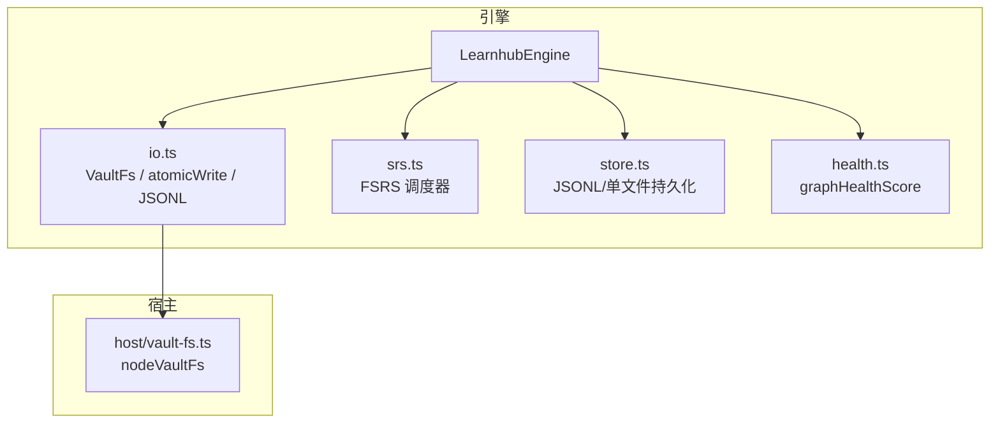
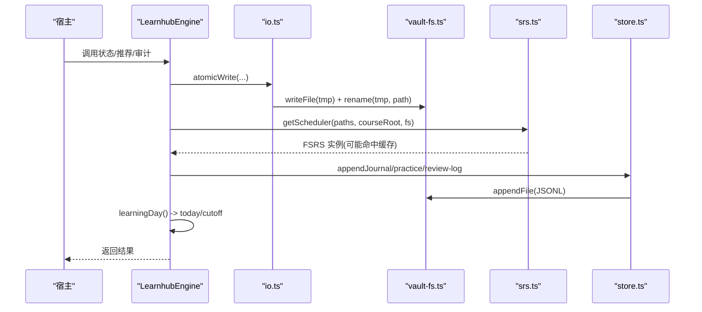
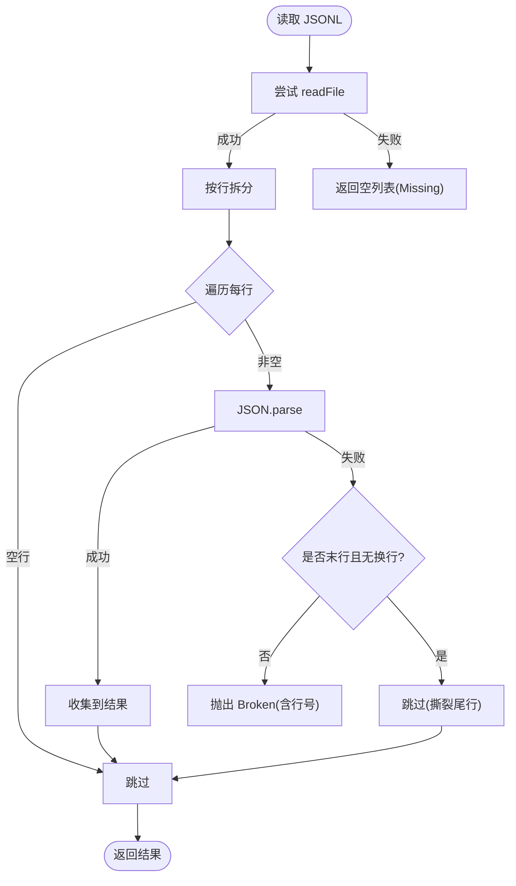
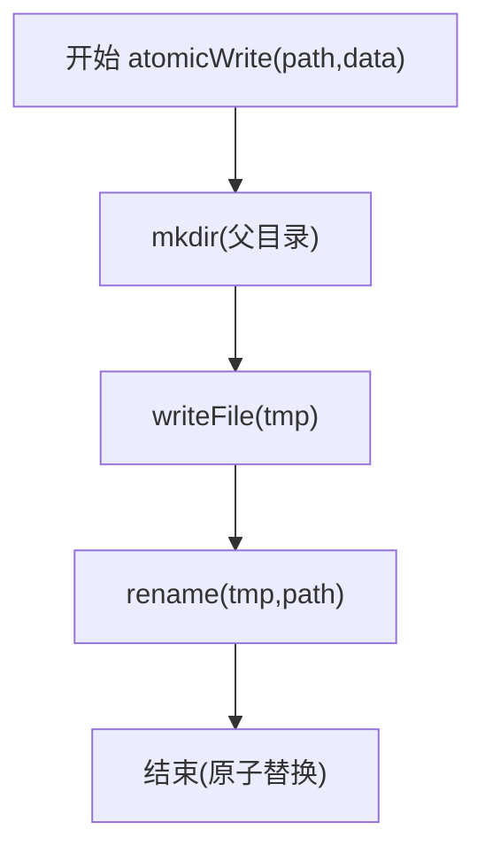
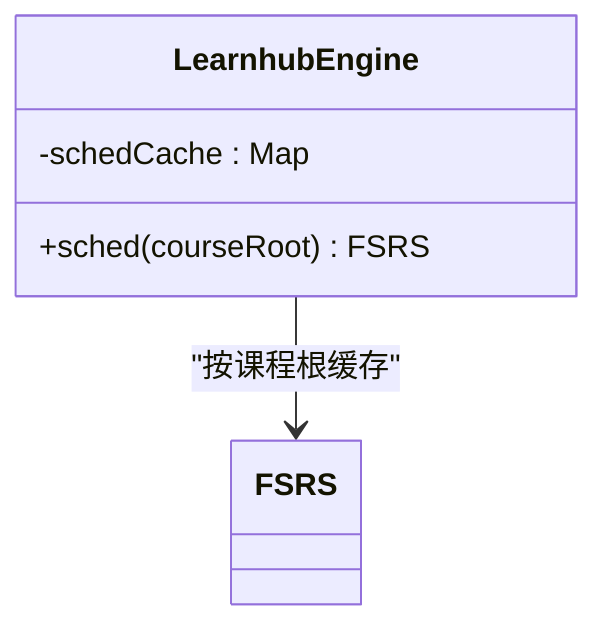
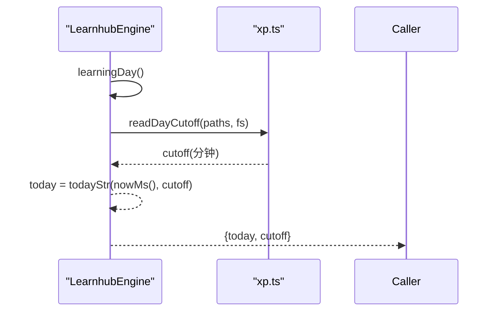
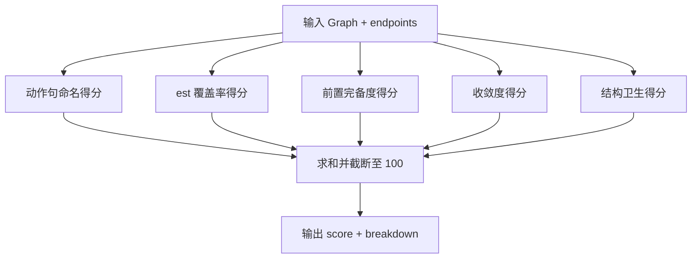
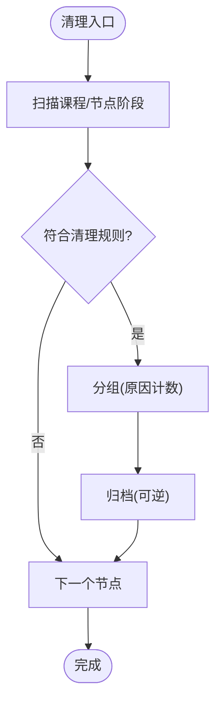
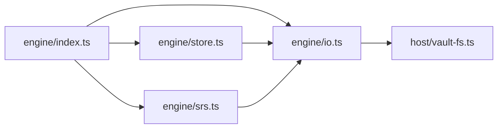

# 资源管理机制

<cite>
**本文引用的文件**
- [src/engine/index.ts](file://src/engine/index.ts)
- [src/engine/io.ts](file://src/engine/io.ts)
- [src/host/vault-fs.ts](file://src/host/vault-fs.ts)
- [src/engine/health.ts](file://src/engine/health.ts)
- [src/engine/srs.ts](file://src/engine/srs.ts)
- [src/engine/store.ts](file://src/engine/store.ts)
- [src/engine/xp.ts](file://src/engine/xp.ts)
- [src/engine/sched-subsystem.ts](file://src/engine/sched-subsystem.ts)
- [src/engine/content-subsystem.ts](file://src/engine/content-subsystem.ts)
- [src/engine/question-bank.ts](file://src/engine/question-bank.ts)
- [src/engine/bank-cleanup.ts](file://src/engine/bank-cleanup.ts)
</cite>

## 目录
1. [简介](#简介)
2. [项目结构](#项目结构)
3. [核心组件](#核心组件)
4. [架构总览](#架构总览)
5. [详细组件分析](#详细组件分析)
6. [依赖关系分析](#依赖关系分析)
7. [性能考量](#性能考量)
8. [故障排查指南](#故障排查指南)
9. [结论](#结论)
10. [附录](#附录)

## 简介
本文件聚焦 LearnHub 引擎的资源管理机制，覆盖以下主题：
- 文件系统抽象与统一接口（VaultFs）
- 原子写入机制（atomicWrite）与数据一致性保证
- 内存缓存策略（schedCache 调度器缓存）及其失效机制
- 学习日计算（learningDay）与日界（cutoff）对资源与统计的影响
- 错误处理与恢复（读取失败、权限问题、锁冲突、JSONL 撕裂尾行等）
- 健康检查与健康分（graphHealthScore）
- 资源清理策略（题库归档、内容重置、沉淀层保护）

## 项目结构
LearnHub 将“存储适配”与“领域逻辑”解耦：
- 引擎侧通过 VaultFs 端口访问文件系统，不直接依赖 node:fs
- 宿主提供 nodeVaultFs 实现，封装真实 IO
- 引擎内部使用 atomicWrite、readJsonlLines 等原语保障一致性与健壮性
- 调度器实例按课程根进行内存缓存，减少重复构造成本
- 健康分基于图结构指标评估质量，辅助治理

图表来源
- [src/engine/index.ts:133-210](file://src/engine/index.ts#L133-L210)
- [src/engine/io.ts:9-39](file://src/engine/io.ts#L9-L39)
- [src/host/vault-fs.ts:1-25](file://src/host/vault-fs.ts#L1-L25)
- [src/engine/srs.ts:29-61](file://src/engine/srs.ts#L29-L61)
- [src/engine/store.ts:1-12](file://src/engine/store.ts#L1-L12)
- [src/engine/health.ts:49-104](file://src/engine/health.ts#L49-L104)

章节来源
- [src/engine/index.ts:133-210](file://src/engine/index.ts#L133-L210)
- [src/engine/io.ts:9-39](file://src/engine/io.ts#L9-L39)
- [src/host/vault-fs.ts:1-25](file://src/host/vault-fs.ts#L1-L25)

## 核心组件
- VaultFs 抽象层：定义统一的读/写/枚举/统计接口，屏蔽底层实现差异
- 原子写入 atomicWrite：临时文件 + rename 的原子替换，避免部分写入导致的数据损坏
- JSONL 只读原语：readJsonlLines/readJsonlLinesReport，容错撕裂尾行并报告断裂位置
- 调度器缓存 schedCache：按课程根缓存 FSRS 实例，参数写回后失效
- 学习日 learningDay：结合 cutoff 计算“今天”，影响 XP 归属、推荐、审计等
- 健康分 graphHealthScore：从图结构维度给出 0-100 评分，用于治理与提示
- Store：集中管理 JSONL 日志与关键单文件的读写，统一错误语义（Missing/Broken）

章节来源
- [src/engine/io.ts:9-39](file://src/engine/io.ts#L9-L39)
- [src/engine/io.ts:56-103](file://src/engine/io.ts#L56-L103)
- [src/engine/index.ts:198-210](file://src/engine/index.ts#L198-L210)
- [src/engine/index.ts:400-406](file://src/engine/index.ts#L400-L406)
- [src/engine/health.ts:49-104](file://src/engine/health.ts#L49-L104)
- [src/engine/store.ts:1-12](file://src/engine/store.ts#L1-L12)

## 架构总览
引擎以门面 LearnhubEngine 为中心，装配各子系统并通过 VaultFs 访问存储。所有落盘路径走 atomicWrite；所有 JSONL 读走 readJsonlLinesReport；调度器按课程根缓存；学习日由 learningDay 统一计算。

图表来源
- [src/engine/index.ts:198-210](file://src/engine/index.ts#L198-L210)
- [src/engine/index.ts:400-406](file://src/engine/index.ts#L400-L406)
- [src/engine/io.ts:30-39](file://src/engine/io.ts#L30-L39)
- [src/engine/srs.ts:29-61](file://src/engine/srs.ts#L29-L61)
- [src/engine/store.ts:51-64](file://src/engine/store.ts#L51-L64)

## 详细组件分析

### VaultFs 抽象层与错误处理
- 设计要点
  - 统一读/写/枚举/统计接口，所有引擎代码仅依赖此端口
  - 宿主实现 nodeVaultFs 封装 node:fs，便于测试与替换
- 错误处理
  - 读失败时区分 Missing（合法空态）与 Broken（需修复），如 proposals/pin/experiments 等
  - JSONL 中段损坏抛 Broken；末行无换行且解析失败视为撕裂尾行，跳过并记录行号
  - 配置读取失败回退为空对象，键级缺省由消费方处理

图表来源
- [src/engine/io.ts:56-103](file://src/engine/io.ts#L56-L103)
- [src/engine/store.ts:168-202](file://src/engine/store.ts#L168-L202)
- [src/engine/store.ts:297-321](file://src/engine/store.ts#L297-L321)
- [src/engine/store.ts:386-420](file://src/engine/store.ts#L386-L420)

章节来源
- [src/engine/io.ts:9-39](file://src/engine/io.ts#L9-L39)
- [src/engine/io.ts:56-103](file://src/engine/io.ts#L56-L103)
- [src/host/vault-fs.ts:1-25](file://src/host/vault-fs.ts#L1-L25)
- [src/engine/store.ts:168-202](file://src/engine/store.ts#L168-L202)

### 原子写入 atomicWrite 与数据一致性
- 实现原理
  - 先创建目标目录（递归）
  - 写入临时文件 tmp（包含进程 ID 与时间戳）
  - 原子 rename(tmp, path) 完成替换
- 一致性保证
  - 避免部分写入导致的半写文件
  - 多进程并发安全：tmp 名唯一，rename 在多数文件系统上是原子的
- 使用场景
  - 生成任务注册表、提案清单、快照、实验定义、Anki 同步文档等

图表来源
- [src/engine/io.ts:30-39](file://src/engine/io.ts#L30-L39)
- [src/engine/store.ts:204-206](file://src/engine/store.ts#L204-L206)
- [src/engine/store.ts:291-293](file://src/engine/store.ts#L291-L293)
- [src/engine/store.ts:417-420](file://src/engine/store.ts#L417-L420)

章节来源
- [src/engine/io.ts:30-39](file://src/engine/io.ts#L30-L39)
- [src/engine/store.ts:204-206](file://src/engine/store.ts#L204-L206)

### 调度器缓存 schedCache 与失效机制
- 缓存策略
  - 以课程根为键缓存 FSRS 实例（null 表示默认参数）
  - 首次获取时通过 getScheduler 构造并缓存
- 失效时机
  - 优化器写回参数后应显式失效对应缓存（确保后续调度使用新参数）
- 收益
  - 避免每次答题都重建 FSRS 实例与读取参数文件

图表来源
- [src/engine/index.ts:198-210](file://src/engine/index.ts#L198-L210)
- [src/engine/srs.ts:29-61](file://src/engine/srs.ts#L29-L61)

章节来源
- [src/engine/index.ts:198-210](file://src/engine/index.ts#L198-L210)
- [src/engine/srs.ts:29-61](file://src/engine/srs.ts#L29-L61)

### 学习日计算 learningDay 与日界 cutoff
- 计算方式
  - 读取 learnhub.json 中的 daily_xp_goal/day_cutoff
  - 根据 cutoff 将本地时间映射到“学习日”字符串
- 影响范围
  - 推荐、审计、XP 聚合、会话统计等均基于同一 today/cutoff
- 配置写入
  - writeDayCutoff 校验格式、归一化并原子写回

图表来源
- [src/engine/index.ts:400-406](file://src/engine/index.ts#L400-L406)
- [src/engine/xp.ts:113-120](file://src/engine/xp.ts#L113-L120)

章节来源
- [src/engine/index.ts:400-406](file://src/engine/index.ts#L400-L406)
- [src/engine/xp.ts:113-120](file://src/engine/xp.ts#L113-L120)

### 健康检查与健康分 graphHealthScore
- 指标构成（每项 0-20，总分 0-100）
  - 动作句命名比例
  - est 覆盖率
  - 前置完备度（浮点节点越少越好）
  - 收敛度（平均前置数）
  - 结构卫生（别名包含、连通分量、根缺失扣分）
- 用途
  - 审计/教练面板展示质量基线，辅助治理与提示
- 终点豁免
  - 终点不计入分母与前置完备度计算

图表来源
- [src/engine/health.ts:49-104](file://src/engine/health.ts#L49-L104)

章节来源
- [src/engine/health.ts:49-104](file://src/engine/health.ts#L49-L104)

### 资源清理策略
- 题库一键清理
  - 规则：跳过节点的未归档题；已完成节点的休眠题（从未调度）
  - 预览分组 → 确认归档（reason=cleanup），可逆
- 内容重置
  - 笔记回 draft，相关目录移入 .trash，沉淀层不受影响
- 删除课程
  - 注册表移除 + 课程目录移入 .trash（不物理删除）

图表来源
- [src/engine/bank-cleanup.ts:1-28](file://src/engine/bank-cleanup.ts#L1-L28)
- [src/engine/question-bank.ts:908-950](file://src/engine/question-bank.ts#L908-L950)
- [src/engine/content-subsystem.ts:262-286](file://src/engine/content-subsystem.ts#L262-L286)

章节来源
- [src/engine/bank-cleanup.ts:1-28](file://src/engine/bank-cleanup.ts#L1-L28)
- [src/engine/question-bank.ts:908-950](file://src/engine/question-bank.ts#L908-L950)
- [src/engine/content-subsystem.ts:262-286](file://src/engine/content-subsystem.ts#L262-L286)

## 依赖关系分析
- 耦合与内聚
  - engine/index.ts 作为门面，组装各子系统，降低跨模块耦合
  - io.ts 作为叶子模块，零领域依赖，被 store/graph 等回引但不反向依赖
- 外部依赖
  - ts-fsrs 提供 FSRS 调度能力
  - node:fs 仅在 host/vault-fs.ts 中暴露
- 潜在环风险
  - 通过窄面注入与类型 re-export 避免循环依赖

图表来源
- [src/engine/index.ts:133-210](file://src/engine/index.ts#L133-L210)
- [src/engine/io.ts:9-39](file://src/engine/io.ts#L9-L39)
- [src/engine/store.ts:1-12](file://src/engine/store.ts#L1-L12)
- [src/engine/srs.ts:29-61](file://src/engine/srs.ts#L29-L61)

章节来源
- [src/engine/index.ts:133-210](file://src/engine/index.ts#L133-L210)
- [src/engine/io.ts:9-39](file://src/engine/io.ts#L9-L39)
- [src/engine/store.ts:1-12](file://src/engine/store.ts#L1-L12)

## 性能考量
- 调度器缓存
  - 按课程根缓存 FSRS 实例，避免重复构造与参数读取
- 原子写入
  - 临时文件 + rename 减少 I/O 开销与竞争条件
- JSONL 只读
  - 流式读取与撕裂尾行豁免，提升鲁棒性与吞吐
- 健康分计算
  - 纯结构指标，O(n) 复杂度，适合频繁查询

[本节为通用指导，不直接分析具体文件]

## 故障排查指南
- 文件读取失败
  - Missing：文件不存在视为空态（如 JSONL 缺失、pin 缺失）
  - Broken：JSON 非法、字段违约、pair 悬空等，需修复或删除后重试
- 权限/锁冲突
  - 若出现 ENOENT 以外的读取错误，通常视为 Broken，需检查权限或锁定
- JSONL 撕裂尾行
  - 末行无换行且解析失败会被跳过，dataCheck 会报告撕裂行号以便定位
- 建议步骤
  - 查看报错信息中的路径与行号
  - 修复或删除损坏条目后重启宿主
  - 对关键文件（proposals/pin/experiments）优先恢复

章节来源
- [src/engine/store.ts:168-202](file://src/engine/store.ts#L168-L202)
- [src/engine/store.ts:297-321](file://src/engine/store.ts#L297-L321)
- [src/engine/store.ts:386-420](file://src/engine/store.ts#L386-L420)
- [src/engine/io.ts:56-103](file://src/engine/io.ts#L56-L103)

## 结论
LearnHub 引擎通过 VaultFs 抽象、atomicWrite 原子写入、JSONL 稳健读取、schedCache 缓存与 learningDay 统一口径，构建了高内聚、低耦合、强一致性的资源管理体系。健康分与清理策略为长期治理提供了量化依据与自动化手段。遵循 Missing/Broken 的错误语义，可在复杂运行环境中保持系统稳定与可恢复性。

[本节为总结，不直接分析具体文件]

## 附录
- 关键路径参考
  - 原子写入：见 io.ts 的 atomicWrite 实现
  - JSONL 读取：见 io.ts 的 readJsonlLinesReport
  - 调度器缓存：见 index.ts 的 schedCache 与 sched 方法
  - 学习日：见 index.ts 的 learningDay 与 xp.ts 的 cutoff 读写
  - 健康分：见 health.ts 的 graphHealthScore
  - 清理策略：见 bank-cleanup.ts 与 question-bank.ts 的清理入口

[本节为索引，不直接分析具体文件]