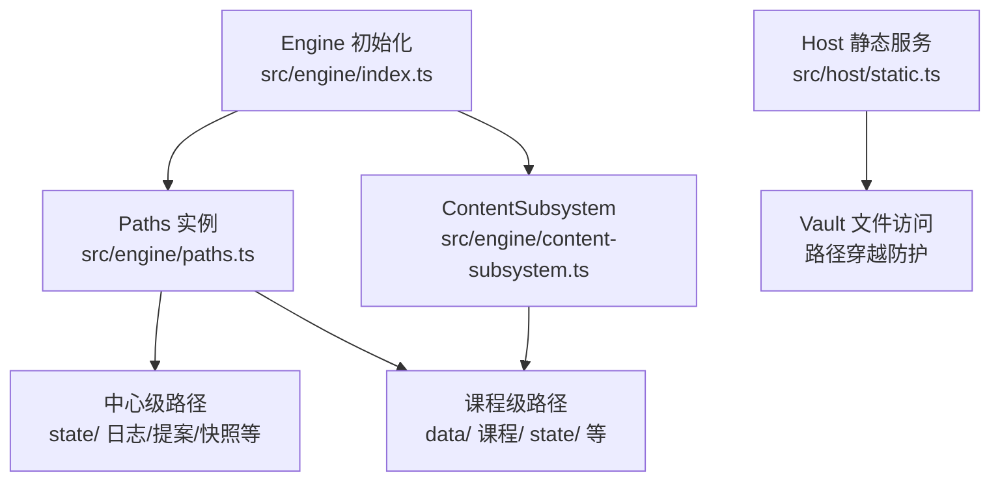
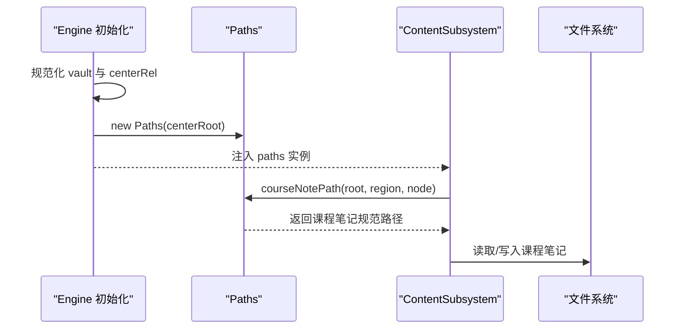
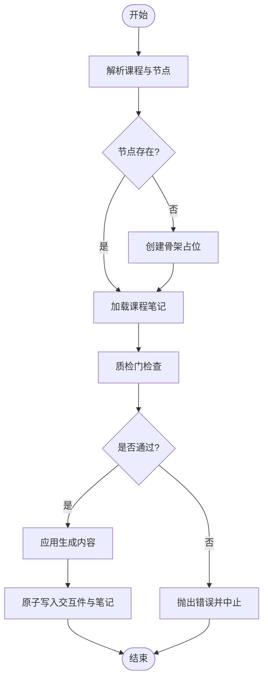
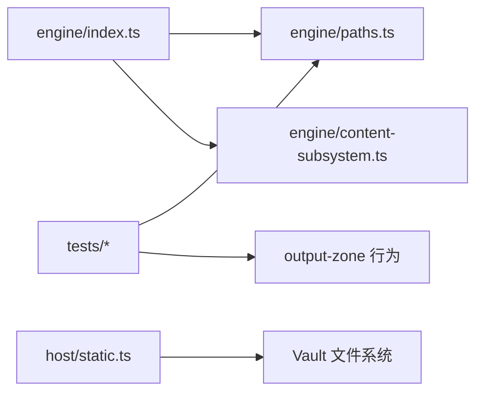

# 路径解析系统

<cite>
**本文引用的文件**
- [paths.ts](file://src/engine/paths.ts)
- [index.ts](file://src/engine/index.ts)
- [content-subsystem.ts](file://src/engine/content-subsystem.ts)
- [static.ts](file://src/host/static.ts)
- [output-zone.test.ts](file://tests/output-zone.test.ts)
- [jsonl-contract.test.ts](file://tests/jsonl-contract.test.ts)
</cite>

## 目录
1. [简介](#简介)
2. [项目结构](#项目结构)
3. [核心组件](#核心组件)
4. [架构总览](#架构总览)
5. [详细组件分析](#详细组件分析)
6. [依赖关系分析](#依赖关系分析)
7. [性能考量](#性能考量)
8. [故障排查指南](#故障排查指南)
9. [结论](#结论)
10. [附录：路径示例与跨平台处理](#附录：路径示例与跨平台处理)

## 简介
本文件系统性说明 LearnHub 的路径解析子系统，聚焦 Paths 类的实现原理、中心级与课程级路径的构建规则、安全策略（路径遍历防护与权限边界）、以及跨平台路径差异的处理方式。文档同时给出典型调用流程与示例，帮助读者理解路径解析如何与文件系统操作集成，并保证学习中心与个人笔记之间的读写边界清晰可控。

## 项目结构
LearnHub 将“学习中心”作为引擎可管理的根域，所有状态与产物均围绕该根派生。路径解析由 engine/paths.ts 提供统一抽象，engine/index.ts 在引擎初始化时构造 Paths 实例并注入到各子系统；host/static.ts 在 Web 层对 vault 资源访问进行路径校验；测试用例覆盖输出区与注册豁免区的行为约束。

图表来源
- [index.ts:213-224](file://src/engine/index.ts#L213-L224)
- [paths.ts:26-197](file://src/engine/paths.ts#L26-L197)
- [content-subsystem.ts:187-228](file://src/engine/content-subsystem.ts#L187-L228)
- [static.ts:62-80](file://src/host/static.ts#L62-L80)

章节来源
- [index.ts:213-224](file://src/engine/index.ts#L213-L224)
- [paths.ts:26-197](file://src/engine/paths.ts#L26-L197)

## 核心组件
- Paths 类：唯一负责路径计算的中心化组件，所有路径均由构造注入的 centerRoot 派生，无全局可变状态。
- safeFilename：将 Windows 非法字符与正斜杠替换为全角字符，确保节点名到文件名的安全映射。
- 中心级路径：注册表、会话、state 流水、提案、快照、仪表盘、Anki 镜像、沉淀层等。
- 课程级路径：课程根、数据区、课程正文区、状态区、题库、概念登记表、罗盘等。
- 项目区路径：项目工作区、里程碑、日志、回执、执行事件流等。
- 输出区路径：学习产物输出区（我的产出），按 kind 分类存放，受白名单与注册豁免控制。

章节来源
- [paths.ts:9-24](file://src/engine/paths.ts#L9-L24)
- [paths.ts:26-197](file://src/engine/paths.ts#L26-L197)

## 架构总览
Paths 类通过 centerRoot 派生出两类路径：
- 中心级：位于学习中心根下，用于引擎内部状态、日志、提案、快照、配置等。
- 课程级：位于学习中心/<root>/，用于课程数据、正文、状态、题库等。

初始化流程中，engine/index.ts 将 vault 根与中心相对路径规范化后拼接得到 centerRoot，并创建 Paths 实例。随后各子系统通过 paths 成员获取所需路径，避免直接拼接字符串导致的漂移与不一致。

图表来源
- [index.ts:213-224](file://src/engine/index.ts#L213-L224)
- [paths.ts:171-174](file://src/engine/paths.ts#L171-L174)
- [content-subsystem.ts:187-228](file://src/engine/content-subsystem.ts#L187-L228)

## 详细组件分析

### Paths 类与路径生成方法
- vaultRoot：从 centerRoot 剥离最后一段，得到 vault 根（中心外个人笔记的定位基面）。
- centerRelOf(vaultRoot)：计算中心目录相对 vault 根的 posix 路径，供检索与扫描使用。
- 中心级路径：registryPath、sessionDir、centerStateDir、journalPath、practicePath、reviewLogPath、proposalsPath、proposalDir、snapshotDir、dashboardPath、recoveryStatePath、runLogPath、promptDir、corpusDir、qualityReviewDir、learnhubConfigPath、vaultLinksPath、genJobsPath、pinPath、adviceDismissPath、bandLogPath、eArchivePath、experimentsPath、receiptLogPath、gradingFailurePath、erratumLogPath、habitRepeatLogPath、skillsDir、habitsDir、noteSourceDir、noteSourceManifestPath、noteSourcePoolDir、learnerCardsDir、errorCardsDir、ankiMirrorPath、trashDir、archiveDir、sedimentDir、sedimentPath、learnerProfilePath、sedimentLegacyDir。
- 课程级路径：courseRoot、conceptRegistryPath、bankDir、dataDir、courseDir、statusPath、readyPath、reportPath、courseStateDir、queuePath、fsrsParamsPath、courseNotePath。
- 项目区路径：projectsDir、projectDir、projectNotePath、projectMilestoneDir、projectMilestonePath、outputDir、outputKindDir、projectLogPath、projectReceiptDir、projectSnapshotPath、projectRecallPath、projectExecPath。
- 其他：compassPath、snapshotPath、proposalArtifactPath、overlayPath、probationLedgerPath、anchorPath。

这些方法均以 centerRoot 或 courseRoot 为基础，结合固定目录名与安全文件名，生成稳定、可预测的路径。

章节来源
- [paths.ts:33-197](file://src/engine/paths.ts#L33-L197)

### 安全考虑：路径遍历防护与权限控制
- 文件名安全化：safeFilename 将 Windows 非法字符与正斜杠替换为全角字符，避免非法文件名与目录穿越风险。
- 输出区白名单与注册豁免：输出区（我的产出）下的产物可被注册为复习源，但仅限特定 kind 与路径；中心内常规路径拒绝注册，防止误写个人笔记。
- 静态服务路径校验：serveVaultFile 对请求路径进行规范化与穿越检查（拒绝包含 .. 的路径），仅允许白名单扩展名的媒体文件访问。
- 零写入纪律：多处注释强调“个人笔记零写入”，如笔记源镜像区、输出区只出链不改写个人文件，确保引擎不会越权修改用户笔记。

章节来源
- [paths.ts:9-24](file://src/engine/paths.ts#L9-L24)
- [output-zone.test.ts:24-57](file://tests/output-zone.test.ts#L24-L57)
- [static.ts:62-80](file://src/host/static.ts#L62-L80)

### 路径解析与文件系统操作的集成
- ContentSubsystem 通过 paths.courseNotePath 定位课程笔记，并在质检门通过后进行落盘或更新 frontmatter。
- 生成管线中的交互件文件目标路径由 courseRoot 拼接相对路径，原子写入。
- 审计与报告路径通过 paths 提供的 courseStateDir 与 reportPath 等，确保审计结果落在约定位置。
- 项目执行事件流与回执镜像通过 projectExecPath、projectReceiptDir 等，保持项目域数据的独立性与一致性。

章节来源
- [content-subsystem.ts:187-228](file://src/engine/content-subsystem.ts#L187-L228)
- [paths.ts:151-197](file://src/engine/paths.ts#L151-L197)

### 复杂逻辑流程图：课程笔记生成与落盘

图表来源
- [content-subsystem.ts:192-228](file://src/engine/content-subsystem.ts#L192-L228)

## 依赖关系分析
- Engine 初始化依赖 Paths 提供统一路径，避免散落的字符串拼接。
- ContentSubsystem 依赖 Paths 的课程级路径，确保笔记与状态文件位置一致。
- Host 静态服务依赖 vaultRoot 与路径穿越防护，保障外部访问安全。
- 测试用例验证输出区与注册豁免区的行为，确保路径解析与权限控制符合预期。

图表来源
- [index.ts:213-224](file://src/engine/index.ts#L213-L224)
- [paths.ts:26-197](file://src/engine/paths.ts#L26-L197)
- [static.ts:62-80](file://src/host/static.ts#L62-L80)
- [output-zone.test.ts:24-57](file://tests/output-zone.test.ts#L24-L57)

章节来源
- [index.ts:213-224](file://src/engine/index.ts#L213-L224)
- [paths.ts:26-197](file://src/engine/paths.ts#L26-L197)
- [static.ts:62-80](file://src/host/static.ts#L62-L80)
- [output-zone.test.ts:24-57](file://tests/output-zone.test.ts#L24-L57)

## 性能考量
- 路径计算均为纯函数式 getter/method，无 I/O 开销，适合高频调用。
- safeFilename 使用字符映射，时间复杂度 O(n)，n 为节点名长度，开销极小。
- 中心级与课程级路径集中管理，减少重复拼接与潜在错误，提升可维护性与可读性。
- 静态服务路径校验在请求入口处完成，避免后续不必要的 I/O 与安全风险。

[本节为通用性能讨论，无需具体文件引用]

## 故障排查指南
- 路径穿越错误：若出现“path traversal rejected”，检查请求参数是否包含 ..，并确保路径已规范化。
- 输出区注册失败：确认 kind 在白名单内，且路径位于“我的产出”或项目日志豁免区。
- 课程笔记无法读取：核对 courseNotePath 的参数（root、regionName、nodeName）是否正确，注意 safeFilename 的影响。
- 状态文件缺失：检查 centerStateDir 与 courseStateDir 是否存在，确认 schema 版本与 learnhub.json 配置正确。

章节来源
- [static.ts:62-80](file://src/host/static.ts#L62-L80)
- [output-zone.test.ts:24-57](file://tests/output-zone.test.ts#L24-L57)
- [paths.ts:151-197](file://src/engine/paths.ts#L151-L197)

## 结论
Paths 类为 LearnHub 提供了统一、安全、可预测的路径解析能力，通过 centerRoot 派生中心级与课程级路径，结合 safeFilename 与严格的权限控制，确保引擎与文件系统操作的边界清晰。配合 ContentSubsystem 与 Host 静态服务，实现了从生成管线到外部访问的全链路路径安全与一致性。

[本节为总结性内容，无需具体文件引用]

## 附录：路径示例与跨平台处理
- 路径规范化：
  - 反斜杠归一为正斜杠，去除尾部多余分隔符，确保跨平台一致性。
  - 中心相对路径通过 centerRelOf 计算，便于检索与扫描。
- 示例：
  - 课程笔记路径：courseNotePath("math", "基础", "一元一次方程") → 学习中心/math/课程/基础/一元一次方程.md
  - 课程数据目录：dataDir("math") → 学习中心/math/data
  - 课程状态目录：courseStateDir("math") → 学习中心/math/state
  - 输出区路径：outputKindDir("讲解稿") → 学习中心/我的产出/讲解稿
- 安全示例：
  - 请求路径包含 .. 将被拒绝，防止路径穿越。
  - 输出区注册仅限白名单 kind，避免误写个人笔记。

章节来源
- [paths.ts:33-197](file://src/engine/paths.ts#L33-L197)
- [static.ts:62-80](file://src/host/static.ts#L62-L80)
- [output-zone.test.ts:24-57](file://tests/output-zone.test.ts#L24-L57)