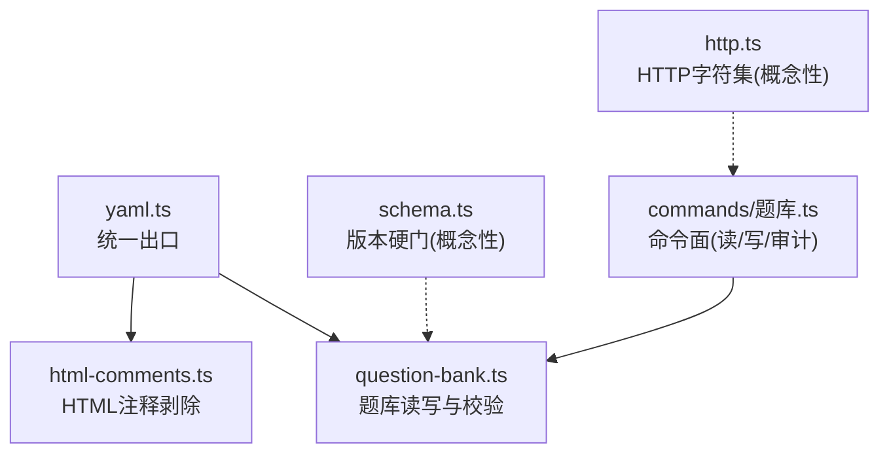
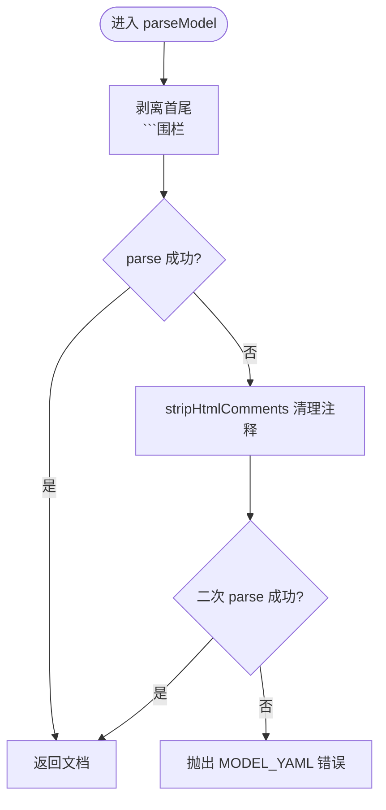
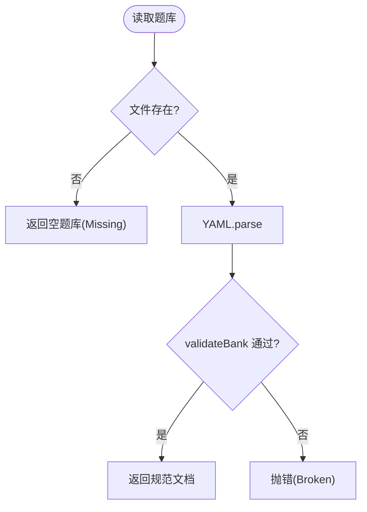
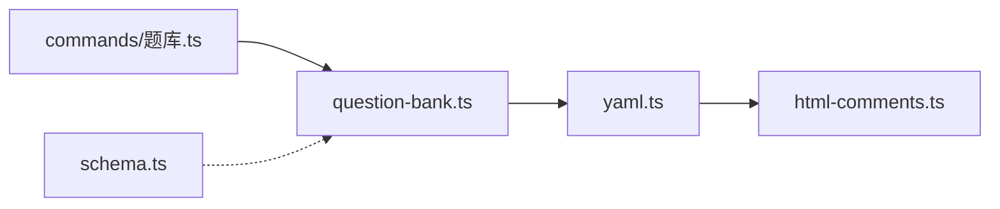

# YAML数据处理

<cite>
**本文引用的文件**
- [src/engine/yaml.ts](file://src/engine/yaml.ts)
- [src/engine/html-comments.ts](file://src/engine/html-comments.ts)
- [src/engine/question-bank.ts](file://src/engine/question-bank.ts)
- [tests/model-yaml.test.ts](file://tests/model-yaml.test.ts)
- [tests/question-hygiene.test.ts](file://tests/question-hygiene.test.ts)
- [src/engine/schema.ts](file://src/engine/schema.ts)
- [src/commands/题库.ts](file://src/commands/题库.ts)
- [src/host/http.ts](file://src/host/http.ts)
</cite>

## 目录
1. [简介](#简介)
2. [项目结构](#项目结构)
3. [核心组件](#核心组件)
4. [架构总览](#架构总览)
5. [详细组件分析](#详细组件分析)
6. [依赖关系分析](#依赖关系分析)
7. [性能考量](#性能考量)
8. [故障排查指南](#故障排查指南)
9. [结论](#结论)
10. [附录：API使用示例与最佳实践](#附录api使用示例与最佳实践)

## 简介
本模块为引擎内统一的 YAML 处理层，负责 YAML 的序列化、反序列化、模型输出容错解析、以及面向业务的数据校验与错误恢复。其目标是：
- 提供稳定一致的 YAML 读写接口（parse/stringify）
- 对模型/Agent 输出的 YAML 进行“围栏剥离 + HTML 注释容忍”的健壮解析
- 将 YAML 数据转换为领域数据结构并执行模式检查、字段验证与完整性校验
- 在写入时保证原子落盘与编码一致性，避免损坏
- 提供清晰的错误码与可诊断的错误信息，便于上层修复与回灌重试

## 项目结构
YAML 能力集中在单一出口模块，其他子系统通过统一入口消费，确保行为一致、易于维护与测试。



图表来源
- [src/engine/yaml.ts:1-54](file://src/engine/yaml.ts#L1-L54)
- [src/engine/html-comments.ts:1-53](file://src/engine/html-comments.ts#L1-L53)
- [src/engine/question-bank.ts:120-319](file://src/engine/question-bank.ts#L120-L319)
- [src/engine/schema.ts:1-79](file://src/engine/schema.ts#L1-L79)
- [src/commands/题库.ts:123-317](file://src/commands/题库.ts#L123-L317)
- [src/host/http.ts:19-28](file://src/host/http.ts#L19-L28)

章节来源
- [src/engine/yaml.ts:1-54](file://src/engine/yaml.ts#L1-L54)
- [src/engine/question-bank.ts:120-319](file://src/engine/question-bank.ts#L120-L319)

## 核心组件
- YAML 统一出口（parse / parseModel / stringify）
  - 固定序列化选项：不排序键、行宽 120、禁用别名重复对象，兼容旧引擎产出风格，利于 diff
  - 模型输出专用解析：先尝试去除 markdown 代码围栏；失败后尝试剥除 HTML 注释再解析；最终失败抛出带稳定码 MODEL_YAML 的人话化错误
- HTML 注释剥除器（引号感知、跨行支持）
  - 仅在忠实解析失败时触发，合法输出零影响
- 题库读写与校验（validateBank）
  - 严格的结构与字段校验（题型、答案形态、必填项、取值范围等）
  - 读取侧缺失即 Missing（空库），存在但契约坏则 Broken（抛错）
  - 写入前全量校验，通过后原子落盘
- 版本与兼容性（schema 主版本硬门）
  - 启动期强制当前 schema 版本，旧库走一次性迁移脚本，引擎不保留兼容分支

章节来源
- [src/engine/yaml.ts:1-54](file://src/engine/yaml.ts#L1-L54)
- [src/engine/html-comments.ts:1-53](file://src/engine/html-comments.ts#L1-L53)
- [src/engine/question-bank.ts:120-319](file://src/engine/question-bank.ts#L120-L319)
- [src/engine/schema.ts:1-79](file://src/engine/schema.ts#L1-L79)

## 架构总览
下图展示从“模型/用户输入”到“持久化存储”的完整流程，包括解析、校验、修复与落盘。

```mermaid
sequenceDiagram
participant U as "调用方"
participant Y as "YAML 统一出口"
participant H as "HTML注释剥除"
participant V as "validateBank"
participant FS as "文件系统"
U->>Y : 传入YAML文本
alt 模型输出
Y->>Y : 剥离
```围栏
    Y->>Y: 尝试parse
    Y-->>U: 成功则返回文档
    Y->>H: 失败则剥HTML注释
    H-->>Y: 返回清理后文本
    Y->>Y: 再次parse
    Y-->>U: 成功返回或抛MODEL_YAML
  else 手写文件
    Y->>Y: 直接parse
  end
  U->>V: 传入文档做schema校验
  V-->>U: errors或spec
  opt 校验通过
    U->>FS: atomicWrite(stringify(doc))
    FS-->>U: 落盘完成
  else 校验失败
    U-->>U: 抛出结构化错误
  end
```

图表来源
- [src/engine/yaml.ts:20-53](file://src/engine/yaml.ts#L20-L53)
- [src/engine/html-comments.ts:10-52](file://src/engine/html-comments.ts#L10-L52)
- [src/engine/question-bank.ts:295-317](file://src/engine/question-bank.ts#L295-L317)

## 详细组件分析

### YAML 统一出口（parse / parseModel / stringify）
- 设计要点
  - parse：透传底层 yaml.parse，用于手写文件（注册表、题库、图数据、笔记）
  - parseModel：面向模型/Agent 输出，具备围栏剥离与 HTML 注释容忍；失败时抛出带 code=MODEL_YAML 的错误，便于上层分流修复轮
  - stringify：固定 lineWidth=120、aliasDuplicateObjects=false，保持与旧引擎一致的 diff 友好输出
- 复杂度与边界
  - 时间复杂度 O(n)，n 为输入文本长度；注释剥除仅发生在首次解析失败后
  - 引号感知：单引号内的 <!-- 不被视为注释起点，避免误删
- 错误处理
  - 解析失败：优先尝试注释剥除；仍失败则抛出稳定码错误，保留原始定位信息



图表来源
- [src/engine/yaml.ts:20-53](file://src/engine/yaml.ts#L20-L53)
- [src/engine/html-comments.ts:10-52](file://src/engine/html-comments.ts#L10-L52)

章节来源
- [src/engine/yaml.ts:1-54](file://src/engine/yaml.ts#L1-L54)
- [tests/model-yaml.test.ts:1-89](file://tests/model-yaml.test.ts#L1-L89)

### HTML 注释剥除器（stripHtmlComments）
- 功能特性
  - 引号感知：单双引号计数配对，不在引号内才识别注释起点
  - 跨行支持：找到闭合标记或串尾截断
  - 可选 matching：按注释内容过滤保留/删除（当前 parseModel 全剥）
- 适用场景
  - 模型输出中混入机器块注释（如 enc_candidates）导致 YAML 非法时，作为兜底修复路径

章节来源
- [src/engine/html-comments.ts:1-53](file://src/engine/html-comments.ts#L1-L53)

### 题库读写与校验（QuestionBank / validateBank）
- 读取流程
  - 文件不存在：返回空题库（Missing）
  - 文件存在：YAML.parse → validateBank → 若 errors 则抛错（Broken）
- 写入流程
  - 接收 YAML 文本 → YAML.parseModel → validateBank → 通过后 atomicWrite(YAML.stringify(doc))
- 校验规则（节选）
  - node 非空、questions 非空且每项为映射
  - kind 必须在允许集合内
  - 各题型答案形态约束（单选字母、多选至少两个正确项、数值型答案与 tol、匹配题左右列一一对应等）
  - invokes 必须为字符串（缺席/空串合法）
- 错误分类
  - Missing：合法缺失（如题库文件不存在）
  - Broken：存在但 YAML 或契约不合法（抛错）



图表来源
- [src/engine/question-bank.ts:275-319](file://src/engine/question-bank.ts#L275-L319)

章节来源
- [src/engine/question-bank.ts:120-319](file://src/engine/question-bank.ts#L120-L319)

### 版本与兼容性（Schema 主版本硬门）
- 策略
  - 启动期同步读取 learnhub.json 中的 schema.version，非当前版本即拒绝加载，指引运行一次性迁移脚本
  - breaks 字段为纯档案，引擎不消费；formats 记录子格式版本，破坏性变更仍走主版本断裂
- 意义
  - 避免隐式兼容导致的退化；保证所有数据以统一契约被消费

章节来源
- [src/engine/schema.ts:1-79](file://src/engine/schema.ts#L1-L79)

## 依赖关系分析
- 耦合度
  - yaml.ts 仅依赖 html-comments.ts 与底层 yaml 包，职责单一、内聚度高
  - question-bank.ts 依赖 yaml.ts 与自身校验逻辑，形成“解析→校验→落盘”的清晰链路
- 外部依赖
  - 底层 yaml 解析库（parse/stringify）
  - 文件系统抽象（VaultFs）与原子写入（atomicWrite）
- 潜在循环
  - 无循环依赖；yaml.ts 不反向依赖业务模块



图表来源
- [src/engine/yaml.ts:1-54](file://src/engine/yaml.ts#L1-L54)
- [src/engine/question-bank.ts:120-319](file://src/engine/question-bank.ts#L120-L319)
- [src/commands/题库.ts:123-317](file://src/commands/题库.ts#L123-L317)
- [src/engine/schema.ts:1-79](file://src/engine/schema.ts#L1-L79)

章节来源
- [src/engine/yaml.ts:1-54](file://src/engine/yaml.ts#L1-L54)
- [src/engine/question-bank.ts:120-319](file://src/engine/question-bank.ts#L120-L319)

## 性能考量
- 解析路径优化
  - parseModel 仅在首次解析失败后才进行注释剥除，避免对合法输入的额外开销
- 序列化稳定性
  - 固定行宽与不排序键，减少无关 diff，提升协作效率
- I/O 安全
  - 原子写入避免部分写入导致的中间态损坏
- 建议
  - 对超大 YAML 文档可考虑流式处理或分片校验（当前实现适合课程级/节点级文档规模）

[本节为通用指导，无需特定文件引用]

## 故障排查指南
- 常见错误与定位
  - 模型输出不是合法 YAML：检查是否包含未闭合围栏或 HTML 注释；确认 onTolerated 回调是否被触发
  - 题库 Broken：查看 validateBank 返回的错误列表，逐项修正题型与答案形态
  - 转义损坏（YAML 双引号吃掉 LaTeX 反斜杠）：使用修复工具链在入库前修复并统计修复次数
- 恢复策略
  - 解析失败：自动尝试注释剥除；仍失败则抛错，由上层触发修复轮（如大纲/种子生成回灌）
  - 校验失败：根据错误提示修正后再写入；必要时回退到上一快照
- 参考用例
  - 模型 YAML 解析边界与留痕：见测试覆盖
  - 转义修复与检测：见题目卫生测试

章节来源
- [tests/model-yaml.test.ts:1-89](file://tests/model-yaml.test.ts#L1-L89)
- [tests/question-hygiene.test.ts:1-31](file://tests/question-hygiene.test.ts#L1-L31)
- [src/engine/question-bank.ts:295-319](file://src/engine/question-bank.ts#L295-L319)

## 结论
本模块通过“统一出口 + 强校验 + 原子落盘”的设计，提供了稳健的 YAML 处理能力：既能容忍模型输出的噪声，又能严格保障数据契约；配合版本硬门与修复轮机制，实现了高可靠的数据流转与演进。

[本节为总结性内容，无需特定文件引用]

## 附录：API使用示例与最佳实践

- 序列化与反序列化
  - 解析手写文件：使用 YAML.parse(text)
  - 解析模型输出：使用 YAML.parseModel(text, { onTolerated })
  - 序列化输出：使用 YAML.stringify(value)
  - 参考路径
    - [src/engine/yaml.ts:20-53](file://src/engine/yaml.ts#L20-L53)

- 题库读写（含校验）
  - 读取：load(courseRoot, node) → 缺失返回空库，存在但契约坏抛错
  - 保存：save(courseRoot, yamlText, expectedNode) → 解析+校验+原子写入
  - 追加/更新：addQuestion / updateQuestion 等均在写入前全量校验
  - 参考路径
    - [src/engine/question-bank.ts:275-319](file://src/engine/question-bank.ts#L275-L319)
    - [src/engine/question-bank.ts:337-355](file://src/engine/question-bank.ts#L337-L355)

- 命令面集成
  - 读/写/审计题库：通过 commands/题库.ts 暴露的能力，结合 validateBank 门禁
  - 参考路径
    - [src/commands/题库.ts:123-317](file://src/commands/题库.ts#L123-L317)

- 字符集与编码
  - HTTP 响应默认 UTF-8；YAML 文件读写遵循平台/文件系统约定，建议在宿主层统一以 UTF-8 处理
  - 参考路径
    - [src/host/http.ts:19-28](file://src/host/http.ts#L19-L28)

- 复杂数据结构与多版本兼容
  - 复杂嵌套结构：通过 stringify 固定宽度与键序，保证 diff 友好
  - 版本兼容：启动期 schema 版本硬门，旧库走迁移脚本，引擎不保留兼容分支
  - 参考路径
    - [src/engine/yaml.ts:51-53](file://src/engine/yaml.ts#L51-L53)
    - [src/engine/schema.ts:1-79](file://src/engine/schema.ts#L1-L79)

- 最佳实践
  - 始终通过 validateBank 校验后再落盘
  - 对模型输出一律使用 parseModel，利用 onTolerated 记录容忍事件
  - 遇到 Broken 立即中止并上报，避免静默降级
  - 使用原子写入，避免并发竞争导致的部分写入

[本节为操作指南，无需特定文件引用]