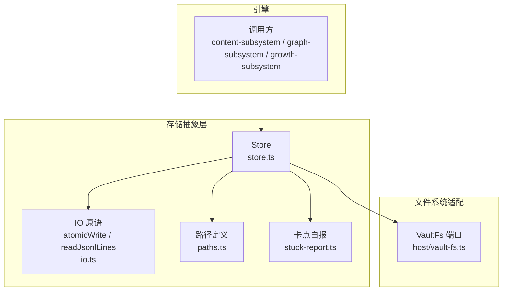
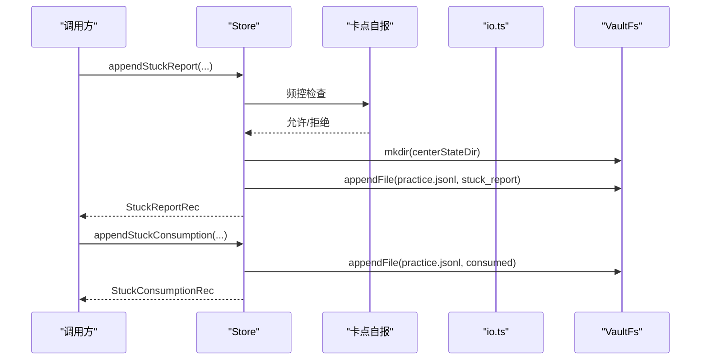
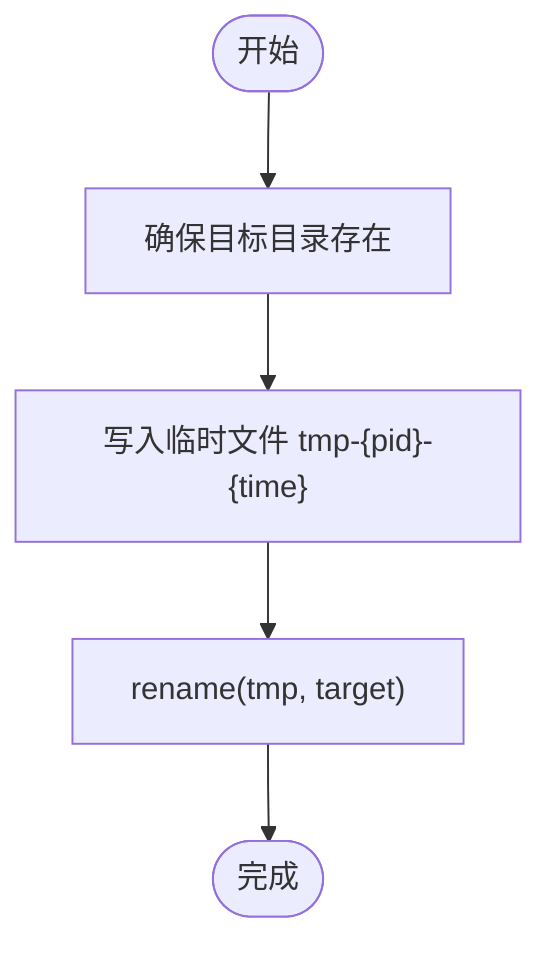
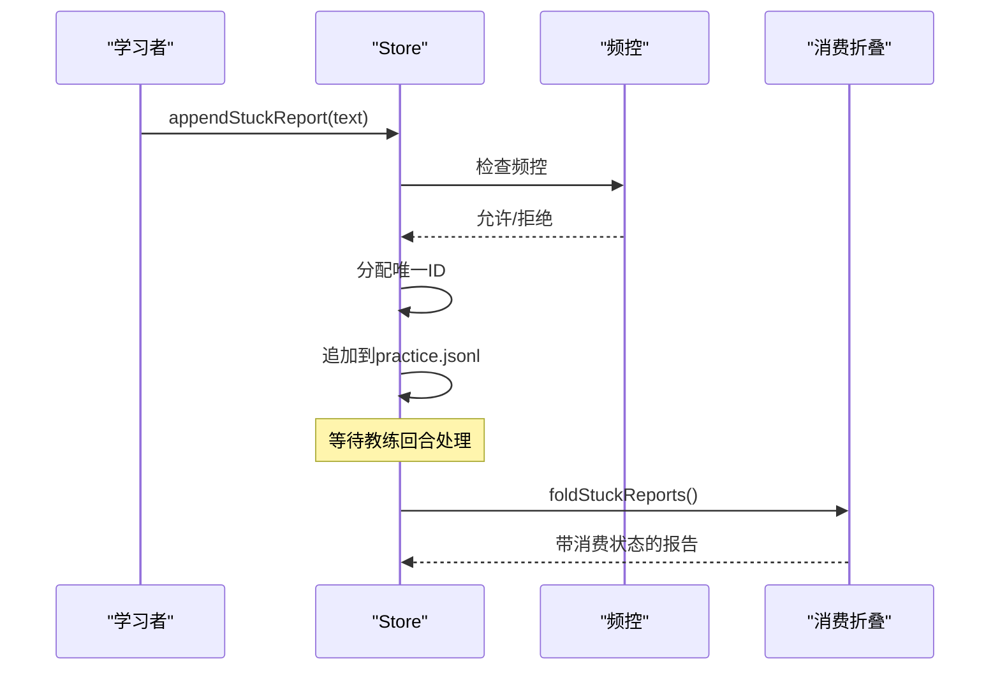
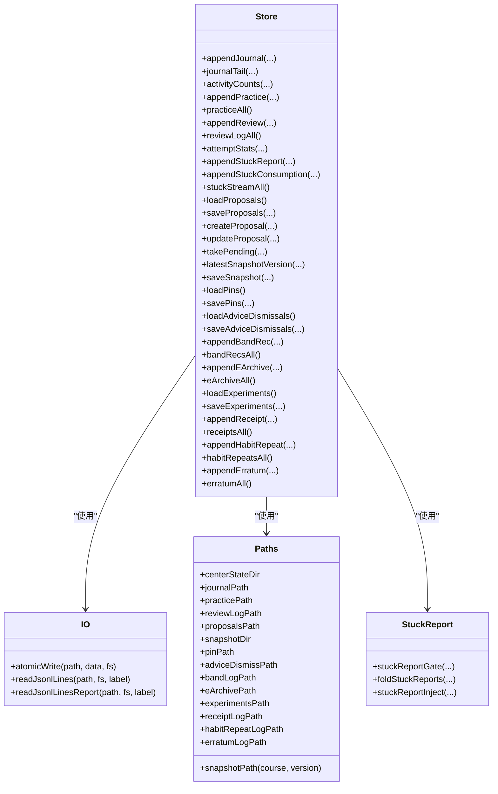

# 存储抽象层

<cite>
**本文引用的文件**
- [store.ts](file://src/engine/store.ts)
- [io.ts](file://src/engine/io.ts)
- [paths.ts](file://src/engine/paths.ts)
- [types.ts](file://src/engine/types.ts)
- [stuck-report.ts](file://src/engine/stuck-report.ts)
- [growth-subsystem.ts](file://src/engine/growth-subsystem.ts)
- [vault.ts](file://tests/helpers/vault.ts)
</cite>

## 更新摘要
**变更内容**
- 新增卡点自报（Stuck Reports）存储功能，包括追加、消费标记和流式读取方法
- 新增消费折叠机制，支持将卡点自报与消费标记合并处理
- 新增频控机制，限制同一节点每日自报数量和全课程每日总量
- 扩展实践流水类型，支持多种记录类型的统一存储
- 增强并发控制，确保卡点自报ID分配的线程安全

## 目录
1. [简介](#简介)
2. [项目结构](#项目结构)
3. [核心组件](#核心组件)
4. [架构总览](#架构总览)
5. [详细组件分析](#详细组件分析)
6. [依赖关系分析](#依赖关系分析)
7. [性能考量](#性能考量)
8. [故障排查指南](#故障排查指南)
9. [结论](#结论)
10. [附录：API 使用示例与最佳实践](#附录api-使用示例与最佳实践)

## 简介
本文件面向 Store 类及其相关存储抽象层，系统性说明其设计模式、职责边界、数据持久化策略、事务与并发控制机制、原子写入实现、错误处理与一致性保证（Missing/Broken），并提供基于仓库代码的 API 使用指引。Store 将"日志型追加"和"整文件原子替换"两类存储模型统一封装，向上提供一致的数据访问接口，向下通过 VaultFs 端口屏蔽文件系统差异。**最新更新**：新增卡点自报系统，支持学习者学习过程中的困难反馈收集和教练回合处理。

## 项目结构
- 存储入口与领域方法集中在 store.ts；通用 IO 原语（原子写、JSONL 只读）在 io.ts；路径定义在 paths.ts；类型契约在 types.ts；卡点自报逻辑在 stuck-report.ts；测试夹具在 tests/helpers/vault.ts。
- 存储布局遵循"中心 state 区"约定：journal/practice/review-log 等 JSONL 追加；proposals/snapshots/pins/experiments 等整文件原子写。
- **新增**：卡点自报系统与 practice 流水共享同一文件，通过不同的 kind 字段区分不同类型记录。

**图表来源**
- [store.ts:46-539](file://src/engine/store.ts#L46-L539)
- [io.ts:30-103](file://src/engine/io.ts#L30-L103)
- [paths.ts:26-198](file://src/engine/paths.ts#L26-L198)
- [stuck-report.ts:1-84](file://src/engine/stuck-report.ts#L1-L84)

章节来源
- [store.ts:1-539](file://src/engine/store.ts#L1-L539)
- [io.ts:1-103](file://src/engine/io.ts#L1-L103)
- [paths.ts:1-198](file://src/engine/paths.ts#L1-L198)
- [stuck-report.ts:1-84](file://src/engine/stuck-report.ts#L1-L84)

## 核心组件
- Store：统一的存储门面，按数据类型划分读写方法，负责数据归一化、校验、落盘与读取。
- VaultFs：文件系统端口，engine 侧唯一 IO 通道，屏蔽 node:fs 细节。
- 原子写 atomicWrite：临时文件 + rename 的原子替换，保障整文件写入的原子性。
- JSONL 只读 readJsonlLines/readJsonlLinesReport：健壮解析，区分 Missing（缺失=空态）与 Broken（中段损坏=抛错）。
- Paths：学习中心与课程级路径集中管理，避免硬编码。
- **新增**：卡点自报系统，包含频控、消费折叠和注入块生成等功能。

章节来源
- [store.ts:46-539](file://src/engine/store.ts#L46-L539)
- [io.ts:9-103](file://src/engine/io.ts#L9-L103)
- [paths.ts:26-198](file://src/engine/paths.ts#L26-L198)
- [stuck-report.ts:1-84](file://src/engine/stuck-report.ts#L1-L84)

## 架构总览
Store 采用"门面+适配器"模式：
- 门面：Store 暴露稳定的领域方法（appendJournal、appendPractice、loadProposals、saveSnapshot 等）。
- 适配器：VaultFs 由宿主注入（nodeVaultFs），使 engine 零直接依赖 node:fs。
- 原语：io.ts 提供跨模块复用的原子写与 JSONL 只读能力。
- 路径：paths.ts 提供稳定、可组合的路径构造器。
- **新增**：卡点自报子系统，提供完整的自报收集、处理和消费流程。

**图表来源**
- [store.ts:141-181](file://src/engine/store.ts#L141-L181)
- [stuck-report.ts:26-50](file://src/engine/stuck-report.ts#L26-L50)
- [io.ts:34-39](file://src/engine/io.ts#L34-L39)

章节来源
- [store.ts:46-539](file://src/engine/store.ts#L46-L539)
- [io.ts:30-103](file://src/engine/io.ts#L30-L103)
- [stuck-report.ts:1-84](file://src/engine/stuck-report.ts#L1-L84)

## 详细组件分析

### 数据持久化策略
- 日志型追加（JSONL）：journal、practice、review-log、band-log、e-archive、receipts、habit-repeats、erratum 等。追加语义简单可靠，适合高吞吐流水。
- 整文件原子替换：proposals、snapshots、pins、advice-dismiss、experiments 等。通过 atomicWrite 实现临时文件 + rename，确保读侧要么读到旧版本，要么读到新版本，不会出现半写状态。
- **新增**：卡点自报系统与 practice 流水共享同一文件，通过 kind 字段区分不同记录类型，实现统一管理和高效查询。

章节来源
- [store.ts:51-164](file://src/engine/store.ts#L51-L164)
- [store.ts:204-206](file://src/engine/store.ts#L204-L206)
- [store.ts:291-293](file://src/engine/store.ts#L291-L293)
- [store.ts:318-321](file://src/engine/store.ts#L318-L321)
- [store.ts:417-420](file://src/engine/store.ts#L417-L420)
- [store.ts:141-181](file://src/engine/store.ts#L141-L181)
- [io.ts:34-39](file://src/engine/io.ts#L34-L39)

### 事务处理与并发控制
- 无显式数据库事务：系统以"追加不可变日志 + 整文件原子替换"的组合实现最终一致性与崩溃恢复。
- 并发安全：
  - JSONL 追加：每次写入一行并以换行结尾，进程中断最多导致末行撕裂，readJsonlLines 对撕裂尾行豁免，不会污染已解析数据。
  - 整文件更新：atomicWrite 先写 tmp 再 rename，读侧不会看到部分写入。
  - **新增**：卡点自报 ID 分配通过模块级 Promise 链串行化，防止并发请求产生重复 ID。
- 复合操作：上层业务（如 proposals apply）通过顺序调用多个 Store 方法并配合 pairApplyBlock 守卫，实现"同进同退"的业务级事务语义。

章节来源
- [io.ts:65-103](file://src/engine/io.ts#L65-L103)
- [store.ts:257-276](file://src/engine/store.ts#L257-L276)
- [store.ts:30-30](file://src/engine/store.ts#L30-L30)
- [store.ts:141-146](file://src/engine/store.ts#L141-L146)

### 原子写入机制（临时文件 + rename）
- 流程：创建目标目录 → 写入 tmp 文件（含 PID 与时间戳）→ rename 到目标路径。
- 优势：跨平台原子替换；避免中间态被读取；失败回滚天然安全。
- 约束：仅适用于整文件替换场景；JSONL 追加不采用此方式。

**图表来源**
- [io.ts:34-39](file://src/engine/io.ts#L34-L39)

章节来源
- [io.ts:30-39](file://src/engine/io.ts#L30-L39)

### 错误处理与数据一致性（Missing 与 Broken）
- Missing（合法空态）：文件不存在时返回空数组或空对象，不视为错误。例如 reviewLogAll、loadPins、loadAdviceDismissals、loadExperiments、bandRecsAll、erratumAll 等。
- Broken（损坏）：文件存在但内容非法（非 JSON、非数组、字段违约、pair 悬空等），立即抛出错误，包含路径与位置信息，便于修复。例如 loadProposals、loadPins、loadAdviceDismissals、loadExperiments。
- JSONL 中段损坏：readJsonlLinesReport 会抛出 Broken 错误；撕裂尾行（末行无换行且非法）会被跳过，避免进程中断导致的脏数据。
- **新增**：卡点自报频控失败时抛出明确错误，包含具体原因（同节点超限、总量超限等）。

章节来源
- [store.ts:145-149](file://src/engine/store.ts#L145-L149)
- [store.ts:168-202](file://src/engine/store.ts#L168-L202)
- [store.ts:297-316](file://src/engine/store.ts#L297-L316)
- [store.ts:323-348](file://src/engine/store.ts#L323-L348)
- [store.ts:386-420](file://src/engine/store.ts#L386-L420)
- [store.ts:141-181](file://src/engine/store.ts#L141-L181)
- [stuck-report.ts:26-50](file://src/engine/stuck-report.ts#L26-L50)
- [io.ts:65-103](file://src/engine/io.ts#L65-L103)

### 卡点自报系统（新增功能）
- **追加自报**：`appendStuckReport` 方法，自动分配唯一 ID（格式：`ts|node` + 碰撞后缀），确保并发安全。
- **消费标记**：`appendStuckConsumption` 方法，记录已消费的自报 ID 列表，支持幂等操作。
- **流式读取**：`stuckStreamAll` 方法，读取所有卡点自报和消费标记行。
- **频控机制**：限制同一节点每学习日 1 条 + 全课程每日总量上限。
- **消费折叠**：`foldStuckReports` 函数，将报告行与消费标记合并，生成带消费状态的视图。
- **注入块生成**：`stuckReportInject` 函数，为教练回合生成待消费自报的文本块。

**图表来源**
- [store.ts:141-181](file://src/engine/store.ts#L141-L181)
- [stuck-report.ts:26-84](file://src/engine/stuck-report.ts#L26-L84)

章节来源
- [store.ts:141-181](file://src/engine/store.ts#L141-L181)
- [stuck-report.ts:1-84](file://src/engine/stuck-report.ts#L1-L84)
- [growth-subsystem.ts:382-415](file://src/engine/growth-subsystem.ts#L382-L415)

### 提案（proposals）与联动守卫
- 最小形状契约：id、status、artifact、pair 等字段校验。
- 加载与保存：loadProposals 严格校验；saveProposals 原子写。
- 创建与更新：createProposal 自增 id，支持 artifact 工厂函数；updateProposal 局部更新。
- 取待处理：takePending 支持按 kind 最新或指定 pid。
- 同源双提案守卫：pairApplyBlock 防止单边生效，确保计划与种子簇等同源产物同时生效或同时拒绝。

章节来源
- [store.ts:28-44](file://src/engine/store.ts#L28-L44)
- [store.ts:168-237](file://src/engine/store.ts#L168-L237)
- [store.ts:239-276](file://src/engine/store.ts#L239-L276)

### 快照（snapshots）
- latestSnapshotVersion：扫描 snapshots 目录，匹配 course-vN.json 命名规则，返回最大版本号。
- saveSnapshot：原子写快照文件，用于图/配置等关键状态的版本化存档。

章节来源
- [store.ts:278-293](file://src/engine/store.ts#L278-L293)
- [paths.ts:147-149](file://src/engine/paths.ts#L147-L149)

### 其他数据类型的存储方案
- journal：追加一条记录，支持可选 ts；最近 N 条查询与计数；按日聚合 activityCounts。
- practice：追加作答记录；全量读取；结合勘误净值得出 attemptStats。
- review-log：追加复习日志；全量读取；用于记忆健康与参数优化。
- pins/advice-dismiss：今日 pin 与忽略清单；原子写；缺失为空态。
- band-log/e-archive/receipts/habit-repeats/erratum：均为 JSONL 追加；读取走 readJsonlLines。
- experiments：实验定义；整文件原子写；加载时做最小契约校验。

章节来源
- [store.ts:49-164](file://src/engine/store.ts#L49-L164)
- [store.ts:295-348](file://src/engine/store.ts#L295-L348)
- [store.ts:350-471](file://src/engine/store.ts#L350-L471)

## 依赖关系分析
- Store 依赖：
  - io.ts：atomicWrite、readJsonlLines/readJsonlLinesReport。
  - paths.ts：所有文件路径。
  - types.ts：各记录类型（JournalRec、PracticeRec、ReviewRec、ProposalRec、ExperimentDef、StuckReportRec、StuckConsumptionRec 等）。
  - clock.ts：时间戳生成。
  - grading.ts：netPracticeRecs（从题库域导出，避免循环依赖）。
  - **新增**：stuck-report.ts：卡点自报频控、消费折叠和注入块生成。
- 外部依赖：VaultFs 由宿主注入，engine 内不直接引入 node:fs。

**图表来源**
- [store.ts:46-539](file://src/engine/store.ts#L46-L539)
- [stuck-report.ts:1-84](file://src/engine/stuck-report.ts#L1-L84)
- [io.ts:30-103](file://src/engine/io.ts#L30-L103)
- [paths.ts:26-198](file://src/engine/paths.ts#L26-L198)

章节来源
- [store.ts:46-539](file://src/engine/store.ts#L46-L539)
- [stuck-report.ts:1-84](file://src/engine/stuck-report.ts#L1-L84)
- [io.ts:30-103](file://src/engine/io.ts#L30-L103)
- [paths.ts:26-198](file://src/engine/paths.ts#L26-L198)

## 性能考量
- JSONL 追加：O(1) 写入，适合高频事件；读取为 O(N)，但多数消费场景为增量或有限窗口。
- 整文件原子写：内存中构建完整 JSON 后一次写入，适合中小规模配置/清单；超大文档需评估内存与 I/O 成本。
- 聚合计算：activityCounts 并行读取 journal 与 practice，减少 I/O 往返。
- **新增**：卡点自报频控在内存中进行，避免不必要的磁盘 I/O；消费折叠在读取时进行，保持写入性能。
- 建议：
  - 对超大数据集考虑分片或索引（当前仓库未实现，按需演进）。
  - 批量写入尽量合并为单次 atomicWrite，减少磁盘抖动。
  - 读取大文件时注意内存占用，必要时流式处理（当前 readJsonlLines 一次性 split，适合中等体量）。

[本节为通用指导，不直接分析具体文件]

## 故障排查指南
- 常见错误定位：
  - proposals 损坏：检查 proposals.json 是否为合法数组，逐条字段是否符合契约，pair 是否悬空。
  - JSONL 中段损坏：readJsonlLinesReport 会报 Broken，定位到具体行号；确认写入端是否异常中断。
  - 撕裂尾行：readJsonlLines 会跳过末行撕裂，不影响历史数据；检查写入端是否保证"整行+\n"。
  - **新增**：卡点自报频控失败：检查是否超过同节点每日上限（1条）或全课程每日总量上限（5条）。
- 恢复步骤：
  - Missing：无需修复，读侧自动返回空态。
  - Broken：根据错误信息定位文件与行号，修复或删除后重试。
  - 快照/配置：若损坏，删除后由上层重建默认值（如 learnhub.json 配置项有缺省逻辑）。
  - **新增**：卡点自报重复 ID：系统会自动添加序号后缀（#2、#3...），无需手动干预。

章节来源
- [store.ts:168-202](file://src/engine/store.ts#L168-L202)
- [store.ts:297-316](file://src/engine/store.ts#L297-L316)
- [store.ts:323-348](file://src/engine/store.ts#L323-L348)
- [store.ts:386-420](file://src/engine/store.ts#L386-L420)
- [store.ts:141-181](file://src/engine/store.ts#L141-L181)
- [stuck-report.ts:26-50](file://src/engine/stuck-report.ts#L26-L50)
- [io.ts:65-103](file://src/engine/io.ts#L65-L103)

## 结论
Store 通过清晰的职责划分与稳健的 IO 原语，实现了高可靠的学习中心数据存储。其设计以"追加不可变日志 + 整文件原子替换"为核心，辅以严格的 Missing/Broken 语义与路径抽象，既保证了数据一致性，又提供了良好的扩展性。**最新更新**：新增的卡点自报系统为学习者提供了表达学习困难的渠道，通过频控机制防止滥用，通过消费标记机制确保问题得到及时处理。上层业务可通过 Store API 进行安全、可审计的数据操作，并在需要时借助 pairApplyBlock 等守卫实现复杂事务语义。

[本节为总结，不直接分析具体文件]

## 附录：API 使用示例与最佳实践
以下示例基于仓库中的实际方法与测试夹具，展示如何正确使用 Store API。为避免泄露实现细节，仅提供调用路径与行为说明。

- 写入日志
  - 写入 journal：调用 appendJournal，传入 course/node/kind 等字段，ts 可选；内部确保目录存在并追加一行。
  - 写入 practice：调用 appendPractice，记录作答、耗时、XP 等；内部标准化字段并追加。
  - 写入 review-log：调用 appendReview，记录 FSRS 推进事件；内部保留稳定性/难度前态与预测。
  - **新增**：写入卡点自报：调用 appendStuckReport，传入 course/node/text；内部进行频控检查并分配唯一 ID。
  - **新增**：写入消费标记：调用 appendStuckConsumption，传入 course/targets[]；记录已消费的自报 ID。
  - 参考路径
    - [store.ts:51-64](file://src/engine/store.ts#L51-L64)
    - [store.ts:100-116](file://src/engine/store.ts#L100-L116)
    - [store.ts:125-143](file://src/engine/store.ts#L125-L143)
    - [store.ts:141-181](file://src/engine/store.ts#L141-L181)

- 读取日志
  - journalTail/journalCount：按课程过滤与限制条数读取最近日志。
  - practiceAll：全量读取作答记录（量级小可接受）。
  - reviewLogAll：全量读取复习日志，遵循 Missing/Broken 语义。
  - **新增**：stuckStreamAll：读取所有卡点自报和消费标记行，供上层进行消费折叠处理。
  - 参考路径
    - [store.ts:66-76](file://src/engine/store.ts#L66-L76)
    - [store.ts:118-121](file://src/engine/store.ts#L118-L121)
    - [store.ts:145-149](file://src/engine/store.ts#L145-L149)
    - [store.ts:177-181](file://src/engine/store.ts#L177-L181)

- 卡点自报工作流（新增）
  - 提交自报：调用 appendStuckReport，内部进行频控检查（同节点每日1条，全课程每日5条）。
  - 获取待消费：调用 stuckStreamAll 获取原始数据，使用 foldStuckReports 进行消费折叠。
  - 标记消费：调用 appendStuckConsumption，记录已消费的自报 ID 列表。
  - 生成注入块：使用 stuckReportInject 为教练回合生成待消费自报的文本块。
  - 参考路径
    - [store.ts:141-181](file://src/engine/store.ts#L141-L181)
    - [stuck-report.ts:26-84](file://src/engine/stuck-report.ts#L26-L84)
    - [growth-subsystem.ts:382-415](file://src/engine/growth-subsystem.ts#L382-L415)

- 提案工作流
  - 创建提案：createProposal(kind, course, summary, artifact|fn, opts.pair?)，返回自增 id。
  - 读取/保存：loadProposals 严格校验；saveProposals 原子写。
  - 取待处理：takePending(kind, pid?) 获取 pending 提案。
  - 联动守卫：pairApplyBlock(prop, proposals, {pairApply?}) 防止单边生效。
  - 参考路径
    - [store.ts:168-237](file://src/engine/store.ts#L168-L237)
    - [store.ts:239-276](file://src/engine/store.ts#L239-L276)

- 快照与配置
  - 快照：latestSnapshotVersion(course) 查询最新版本；saveSnapshot(course, version, doc) 原子写。
  - 今日 pin：loadPins/savePins 原子写；缺失为空态。
  - 忽略清单：loadAdviceDismissals/saveAdviceDismissals 原子写。
  - 实验定义：loadExperiments/saveExperiments 原子写并校验契约。
  - 参考路径
    - [store.ts:278-293](file://src/engine/store.ts#L278-L293)
    - [store.ts:295-321](file://src/engine/store.ts#L295-L321)
    - [store.ts:323-348](file://src/engine/store.ts#L323-L348)
    - [store.ts:386-420](file://src/engine/store.ts#L386-L420)

- 其他流水
  - 难度带会话：appendBandRec/bandRecsAll。
  - E 档案：appendEArchive/eArchiveAll。
  - 回执：appendReceipt/receiptsAll。
  - 习惯重复：appendHabitRepeat/habitRepeatsAll。
  - 勘误冲正：appendErratum/erratumAll。
  - 参考路径
    - [store.ts:350-362](file://src/engine/store.ts#L350-L362)
    - [store.ts:364-384](file://src/engine/store.ts#L364-L384)
    - [store.ts:422-448](file://src/engine/store.ts#L422-L448)
    - [store.ts:450-471](file://src/engine/store.ts#L450-L471)

- 批量操作与事务提交
  - 日志型数据天然支持批量追加（多次 append* 调用）。
  - 整文件数据通过 atomicWrite 实现"读侧可见即完整"，建议在应用层组织多步操作为单一事务语义（如 proposals apply 前后的一致性检查）。
  - **新增**：卡点自报消费标记支持批量标记多个自报 ID，提高处理效率。
  - 参考路径
    - [io.ts:34-39](file://src/engine/io.ts#L34-L39)
    - [store.ts:257-276](file://src/engine/store.ts#L257-L276)
    - [store.ts:165-174](file://src/engine/store.ts#L165-L174)

- 数据验证
  - 提案最小形状：proposalShapeErrors 校验 id/status/artifact/pair。
  - 实验定义契约：loadExperiments 校验 arms/assignment/status/id。
  - **新增**：卡点自报频控：stuckReportGate 校验同节点和总量限制。
  - 参考路径
    - [store.ts:28-44](file://src/engine/store.ts#L28-L44)
    - [store.ts:386-420](file://src/engine/store.ts#L386-L420)
    - [stuck-report.ts:26-50](file://src/engine/stuck-report.ts#L26-L50)

- 测试与集成
  - 使用 withVault 构造临时 vault 与 LearnhubEngine，并通过 engine.store 进行断言。
  - **新增**：卡点自报测试覆盖频控、消费折叠、注入块生成等场景。
  - 参考路径
    - [vault.ts:87-156](file://tests/helpers/vault.ts#L87-L156)
    - [tests/stuck-report.test.ts:1-314](file://tests/stuck-report.test.ts#L1-L314)

章节来源
- [store.ts:46-539](file://src/engine/store.ts#L46-L539)
- [stuck-report.ts:1-84](file://src/engine/stuck-report.ts#L1-L84)
- [io.ts:30-103](file://src/engine/io.ts#L30-L103)
- [vault.ts:87-156](file://tests/helpers/vault.ts#L87-L156)
- [tests/stuck-report.test.ts:1-314](file://tests/stuck-report.test.ts#L1-L314)