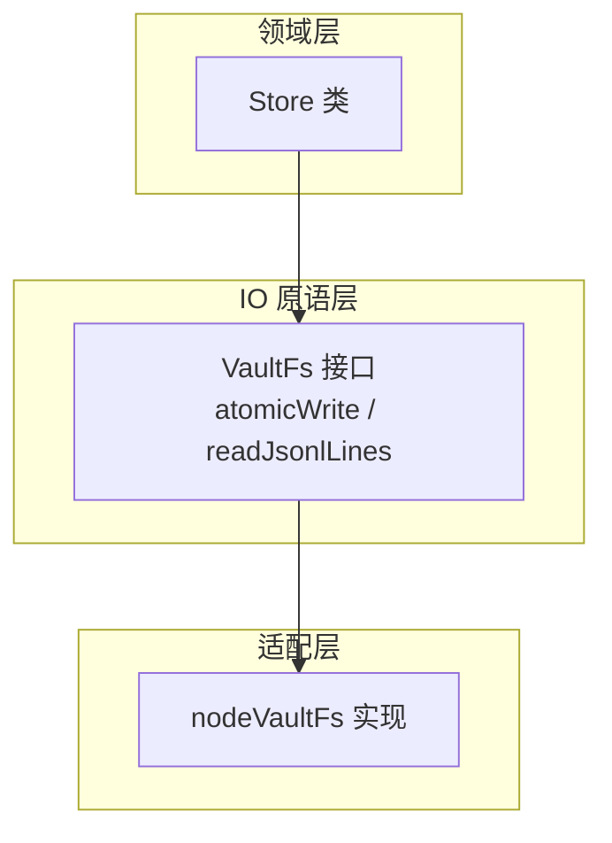
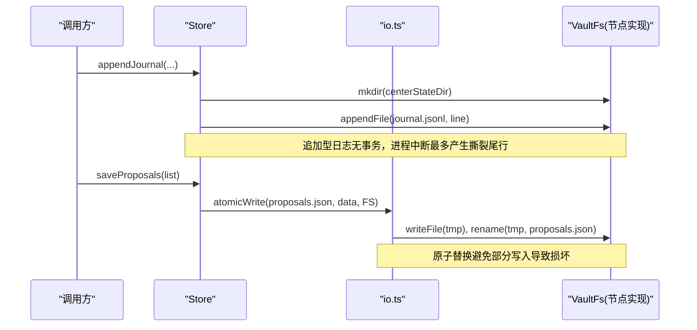
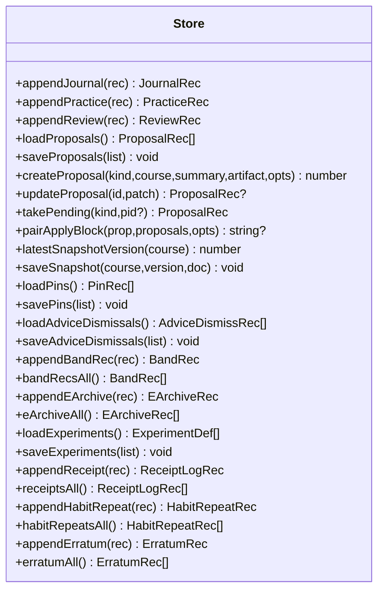
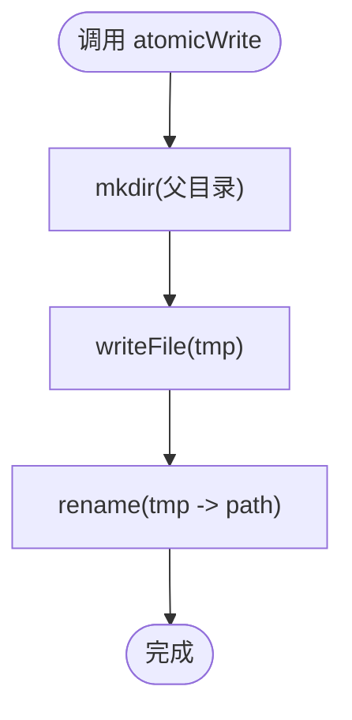
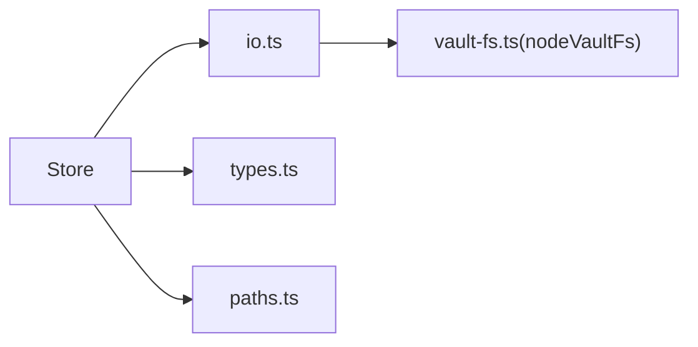
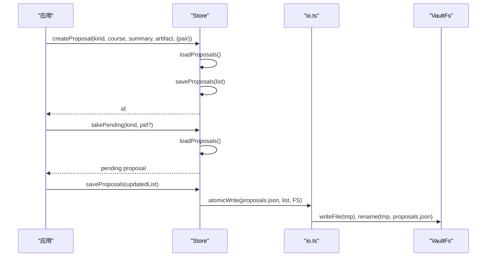

# 引擎存储系统

<cite>
**本文引用的文件**
- [src/engine/store.ts](file://src/engine/store.ts)
- [src/engine/io.ts](file://src/engine/io.ts)
- [src/host/vault-fs.ts](file://src/host/vault-fs.ts)
- [src/engine/yaml.ts](file://src/engine/yaml.ts)
- [src/engine/paths.ts](file://src/engine/paths.ts)
- [src/engine/types.ts](file://src/engine/types.ts)
</cite>

## 目录
1. [简介](#简介)
2. [项目结构](#项目结构)
3. [核心组件](#核心组件)
4. [架构总览](#架构总览)
5. [详细组件分析](#详细组件分析)
6. [依赖关系分析](#依赖关系分析)
7. [性能与缓存](#性能与缓存)
8. [故障排查指南](#故障排查指南)
9. [结论](#结论)
10. [附录：API 使用示例](#附录api-使用示例)

## 简介
本文件系统性说明 LearnHub 引擎的存储子系统，围绕以下目标展开：
- Store 类的设计模式与实现原理：数据持久化策略、事务性语义与并发控制。
- VaultFs 抽象接口设计：文件读写、目录操作与原子写入机制。
- YAML 数据处理模块：序列化、反序列化与数据验证。
- 存储层缓存策略、性能优化与错误处理机制。
- 基于存储 API 的具体用法：批量操作、事务提交与数据一致性保证。

## 项目结构
存储子系统由三层组成：
- 领域层（Store）：面向业务的数据存取门面，封装日志、提案、快照、配置等持久化逻辑。
- IO 原语层（io.ts）：定义 VaultFs 端口、原子写、JSONL 只读等通用能力，零领域依赖。
- 适配层（host/vault-fs.ts）：将 Node.js fs 能力适配为 VaultFs 接口，屏蔽平台差异。

图表来源
- [src/engine/store.ts:46-478](file://src/engine/store.ts#L46-L478)
- [src/engine/io.ts:11-103](file://src/engine/io.ts#L11-L103)
- [src/host/vault-fs.ts:11-24](file://src/host/vault-fs.ts#L11-L24)

章节来源
- [src/engine/store.ts:1-479](file://src/engine/store.ts#L1-L479)
- [src/engine/io.ts:1-103](file://src/engine/io.ts#L1-L103)
- [src/host/vault-fs.ts:1-25](file://src/host/vault-fs.ts#L1-L25)
- [src/engine/paths.ts:26-198](file://src/engine/paths.ts#L26-L198)

## 核心组件
- Store：提供 journal/practice/review-log 追加、proposals 清单管理、snapshot 版本管理、pin/实验/回执/勘误等持久化能力；统一通过 VaultFs 与 atomicWrite 完成落盘。
- VaultFs：engine 侧唯一文件系统端口，屏蔽 node:fs 细节，确保 engine 零直接依赖宿主。
- io.ts：提供 atomicWrite（临时文件 + rename）、readJsonlLines（健壮 JSONL 读取，撕裂尾行豁免）、readLearnhubConfig/writeLearnhubConfig（配置原子读写）。
- yaml.ts：YAML 解析/序列化的统一出口，含对模型输出的宽容解析与 HTML 注释剥离。
- paths.ts：学习中心路径集中管理，所有 state 文件位置可追溯。

章节来源
- [src/engine/store.ts:46-478](file://src/engine/store.ts#L46-L478)
- [src/engine/io.ts:11-103](file://src/engine/io.ts#L11-L103)
- [src/engine/yaml.ts:1-54](file://src/engine/yaml.ts#L1-L54)
- [src/engine/paths.ts:26-198](file://src/engine/paths.ts#L26-L198)

## 架构总览
存储子系统采用“领域门面 + 通用 IO 原语 + 适配器”的分层设计，确保：
- 低耦合：Store 不直接依赖 node:fs，仅通过 VaultFs 端口交互。
- 高内聚：JSONL 读取、原子写、配置读写集中在 io.ts。
- 可替换：适配层可被替换为 R2 或其他后端，不影响上层。

图表来源
- [src/engine/store.ts:51-64](file://src/engine/store.ts#L51-L64)
- [src/engine/store.ts:204-206](file://src/engine/store.ts#L204-L206)
- [src/engine/io.ts:34-39](file://src/engine/io.ts#L34-L39)

## 详细组件分析

### Store 类：设计模式与实现原理
- 职责边界
  - 日志类（journal/practice/review-log/band/e-archive/receipt/habit-repeat/erratum）：追加写入 JSONL，读侧通过 readJsonlLines 容错。
  - 清单类（proposals/pins/advice-dismiss/experiments）：整文件 JSON，原子写；读时进行最小形状校验，失败即 Broken。
  - 快照类（snapshots）：按课程+版本号原子写；查询最新版本遍历目录匹配命名。
- 数据持久化策略
  - 追加型：appendFile 一次写一行，配合撕裂尾行豁免，保证崩溃恢复后仍可读取。
  - 覆盖型：atomicWrite 先写 tmp 再 rename，保证原子性。
- 事务处理与并发控制
  - 无显式数据库事务；以“原子写 + 幂等/只增”原则保障一致性。
  - 提案 pairApplyBlock 提供同源双提案的联合生效守卫，防止单边生效破坏图引用。
  - 并发安全：Node.js 单线程事件循环 + 原子 rename 规避竞态；多进程场景下建议外部锁或队列。
- 错误处理
  - Missing：文件不存在视为空集合（如 proposals、pins、experiments）。
  - Broken：文件存在但格式/契约不符，抛出明确错误并附带路径与行号/条目索引。
  - 撕裂尾行：JSONL 末行缺失换行且非法时跳过，避免阻塞消费。

图表来源
- [src/engine/store.ts:46-478](file://src/engine/store.ts#L46-L478)

章节来源
- [src/engine/store.ts:46-478](file://src/engine/store.ts#L46-L478)

### VaultFs 抽象接口：文件读写、目录操作与原子写入
- 接口设计要点
  - 读恒 utf8 文本；mkdir 递归创建；readdirTypes 返回类型投影。
  - 暴露 statIsFile/statMtimeMs 用于特定场景（如 mtime 排序截断）。
- 原子写入机制
  - atomicWrite：先 mkdir 父目录，写临时文件（含 PID+时间戳），再 rename 到目标路径，保证原子性。
- 节点实现
  - nodeVaultFs：封装 node:fs 与 node:fs/promises，作为默认实现注入到引擎。

图表来源
- [src/engine/io.ts:34-39](file://src/engine/io.ts#L34-L39)
- [src/host/vault-fs.ts:11-24](file://src/host/vault-fs.ts#L11-L24)

章节来源
- [src/engine/io.ts:11-103](file://src/engine/io.ts#L11-L103)
- [src/host/vault-fs.ts:1-25](file://src/host/vault-fs.ts#L1-L25)

### YAML 数据处理模块：序列化、反序列化与数据验证
- 统一入口：yaml.ts 是引擎唯一从 yaml 包取数的地方，确保输出格式一致（allowUnicode、不排序键、宽度 120）。
- 模型输出宽容解析：
  - parseModel：自动去除 markdown 代码围栏；若解析失败，尝试剥离 HTML 注释后再解析，并回调 onTolerated 记录容忍行为。
  - 失败时抛出带 code=MODEL_YAML 的错误，便于宿主识别与修复轮分流。
- 用途：注册表、题库、图数据、笔记等 YAML 文件的解析与序列化。

章节来源
- [src/engine/yaml.ts:1-54](file://src/engine/yaml.ts#L1-L54)

### 路径与数据布局
- 学习中心路径集中管理于 Paths，涵盖 centerRoot、state 子目录、课程级目录、项目区等。
- 关键文件：
  - journal.jsonl、practice.jsonl、review-log.jsonl：追加型日志。
  - proposals.json、今日pin.json、难度建议忽略.json、实验.json：整文件 JSON，原子写。
  - snapshots/<course>-v<N>.json：快照文件。

章节来源
- [src/engine/paths.ts:26-198](file://src/engine/paths.ts#L26-L198)

## 依赖关系分析
- Store 依赖
  - io.ts：VaultFs 端口、atomicWrite、readJsonlLines。
  - types.ts：各类记录类型（JournalRec、PracticeRec、ReviewRec、ProposalRec 等）。
  - paths.ts：所有文件路径。
  - dates.ts/clock.ts：时间戳生成。
- 适配层解耦
  - host/vault-fs.ts 提供 nodeVaultFs，EngineConfig 在构造时注入，engine 内部不直接 import node:fs。

图表来源
- [src/engine/store.ts:11-22](file://src/engine/store.ts#L11-L22)
- [src/engine/io.ts:11-28](file://src/engine/io.ts#L11-L28)
- [src/host/vault-fs.ts:1-25](file://src/host/vault-fs.ts#L1-L25)

章节来源
- [src/engine/store.ts:1-479](file://src/engine/store.ts#L1-L479)
- [src/engine/io.ts:1-103](file://src/engine/io.ts#L1-L103)
- [src/host/vault-fs.ts:1-25](file://src/host/vault-fs.ts#L1-L25)

## 性能与缓存
- 追加型日志（JSONL）
  - 写入：appendFile 一次写一行，I/O 开销小，适合高频写入。
  - 读取：readJsonlLines 流式解析，撕裂尾行豁免，避免崩溃导致的不可读。
- 覆盖型文件（JSON）
  - 原子写：atomicWrite 减少竞争窗口，避免部分写入造成的损坏。
- 缓存策略
  - 当前实现未内置内存缓存；读侧按需加载。对于大文件（如 review-log）建议调用方自行做分页/增量读取。
- 并发控制
  - 单进程内无锁；跨进程需外部协调（如文件锁或消息队列）。
- 性能建议
  - 批量写入：合并多次 append 为单次写入（谨慎，可能影响日志粒度）。
  - 读取优化：对热点日志（如 journal/practice）可在应用层做短期缓存与去重。

[本节为通用指导，不直接分析具体文件]

## 故障排查指南
- 常见错误分类
  - Missing：文件不存在，返回空集合（如 proposals、pins、experiments）。
  - Broken：文件存在但格式/契约不符，抛出错误并包含路径与行号/条目索引。
  - 撕裂尾行：JSONL 末行缺失换行且非法时跳过，不会报错。
- 定位方法
  - 查看错误信息中的标签（如 [proposals]、[pin]、[nof1]）与路径。
  - 检查对应 JSONL 是否出现非 JSON 行或末尾无换行。
- 修复建议
  - 删除损坏文件或修正内容后重试。
  - 对 JSONL，确保每次写入都追加完整行并以换行结尾。

章节来源
- [src/engine/store.ts:172-206](file://src/engine/store.ts#L172-L206)
- [src/engine/store.ts:299-321](file://src/engine/store.ts#L299-L321)
- [src/engine/store.ts:390-420](file://src/engine/store.ts#L390-L420)
- [src/engine/io.ts:71-102](file://src/engine/io.ts#L71-L102)

## 结论
LearnHub 存储子系统通过清晰的层次划分与严格的契约校验，实现了：
- 高可靠：原子写 + 撕裂尾行豁免 + Broken 快速失败。
- 高内聚：JSONL 读取与原子写集中在 io.ts。
- 可扩展：VaultFs 抽象使存储后端可替换。
- 易维护：路径集中管理，错误信息明确，便于定位与修复。

[本节为总结，不直接分析具体文件]

## 附录：API 使用示例
以下为典型使用流程（以路径引用代替代码片段）：

- 写入日志（journal/practice/review-log）
  - 参考：[src/engine/store.ts:51-64](file://src/engine/store.ts#L51-L64)、[src/engine/store.ts:101-116](file://src/engine/store.ts#L101-L116)、[src/engine/store.ts:127-143](file://src/engine/store.ts#L127-L143)
- 读取日志（JSONL）
  - 参考：[src/engine/io.ts:71-102](file://src/engine/io.ts#L71-L102)
- 原子写清单（proposals/pins/experiments）
  - 参考：[src/engine/store.ts:204-206](file://src/engine/store.ts#L204-L206)、[src/engine/store.ts:318-321](file://src/engine/store.ts#L318-L321)、[src/engine/store.ts:417-420](file://src/engine/store.ts#L417-L420)
- 提案生命周期（创建/更新/领取/守卫）
  - 参考：[src/engine/store.ts:213-228](file://src/engine/store.ts#L213-L228)、[src/engine/store.ts:230-237](file://src/engine/store.ts#L230-L237)、[src/engine/store.ts:240-255](file://src/engine/store.ts#L240-L255)、[src/engine/store.ts:262-276](file://src/engine/store.ts#L262-L276)
- 快照管理（保存/查询版本）
  - 参考：[src/engine/store.ts:280-293](file://src/engine/store.ts#L280-L293)
- YAML 解析（模型输出宽容解析）
  - 参考：[src/engine/yaml.ts:20-53](file://src/engine/yaml.ts#L20-L53)

图表来源
- [src/engine/store.ts:213-228](file://src/engine/store.ts#L213-L228)
- [src/engine/store.ts:240-255](file://src/engine/store.ts#L240-L255)
- [src/engine/store.ts:204-206](file://src/engine/store.ts#L204-L206)
- [src/engine/io.ts:34-39](file://src/engine/io.ts#L34-L39)