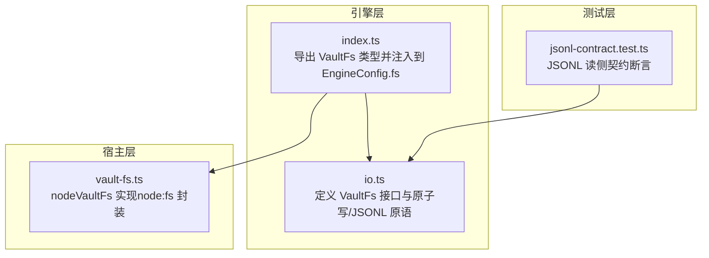
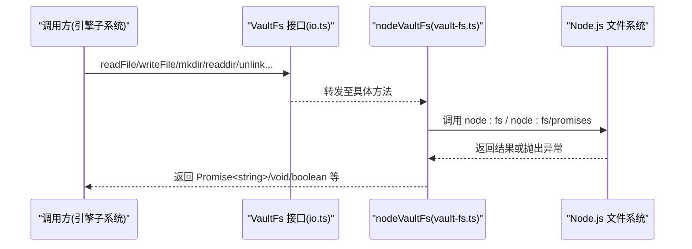
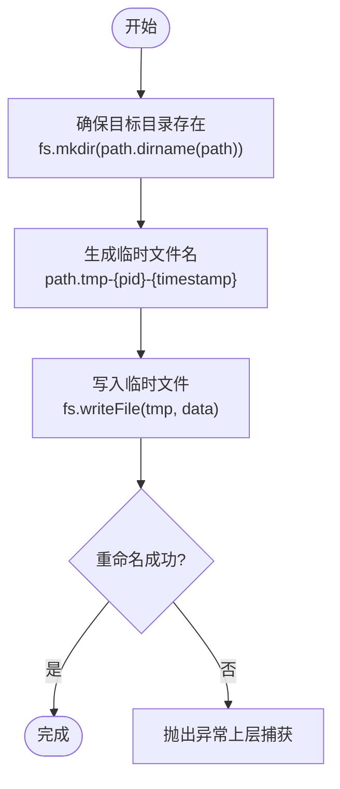
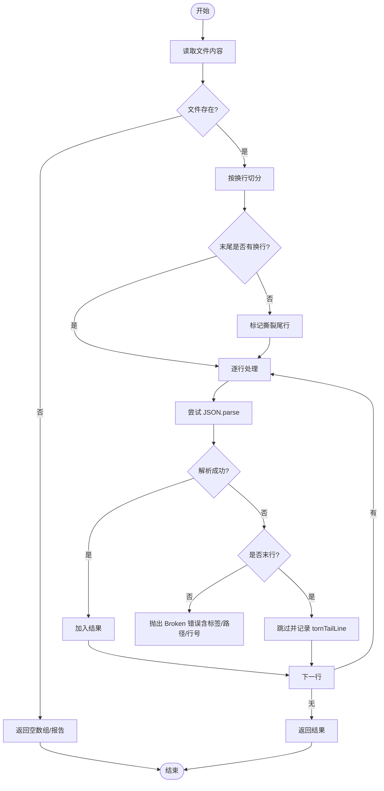
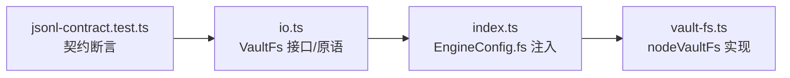

# 文件系统适配器

<cite>
**本文引用的文件**
- [src/engine/io.ts](file://src/engine/io.ts)
- [src/host/vault-fs.ts](file://src/host/vault-fs.ts)
- [src/engine/index.ts](file://src/engine/index.ts)
- [tests/jsonl-contract.test.ts](file://tests/jsonl-contract.test.ts)
</cite>

## 目录
1. [简介](#简介)
2. [项目结构](#项目结构)
3. [核心组件](#核心组件)
4. [架构总览](#架构总览)
5. [详细组件分析](#详细组件分析)
6. [依赖关系分析](#依赖关系分析)
7. [性能考量](#性能考量)
8. [故障排查指南](#故障排查指南)
9. [结论](#结论)
10. [附录：使用示例与最佳实践](#附录使用示例与最佳实践)

## 简介
本文件围绕 VaultFs 文件系统适配器的抽象接口设计与实现，系统性说明其职责边界、数据流与异常处理策略。重点覆盖：
- VaultFs 抽象接口的理念与能力集（读/写/目录/路径元信息）
- 原子写入 atomicWrite 的完整流程（临时文件、内容写入、原子替换）
- JSONL 读取 readJsonlLines/readJsonlLinesReport 的行解析、错误与容错机制
- 文件系统操作的异常处理策略（缺失、权限、格式错误等）
- 基于 VaultFs 的典型操作示例（创建、读取、写入、删除）

该设计将引擎与具体存储实现解耦：引擎侧仅依赖 VaultFs 端口，宿主侧提供 node:fs 的具体实现，从而在 R2 层形成“应用→适配器”的存储边界，便于测试与可移植性。

## 项目结构
VaultFs 相关代码主要分布在以下位置：
- 抽象与通用 IO 原语：src/engine/io.ts
- 宿主端 Node.js 实现：src/host/vault-fs.ts
- 引擎门面导出与装配入口：src/engine/index.ts
- JSONL 行为契约与回归用例：tests/jsonl-contract.test.ts

图表来源
- [src/engine/io.ts:11-28](file://src/engine/io.ts#L11-L28)
- [src/host/vault-fs.ts:11-24](file://src/host/vault-fs.ts#L11-L24)
- [src/engine/index.ts:134-147](file://src/engine/index.ts#L134-L147)
- [tests/jsonl-contract.test.ts:20-67](file://tests/jsonl-contract.test.ts#L20-L67)

章节来源
- [src/engine/io.ts:1-103](file://src/engine/io.ts#L1-L103)
- [src/host/vault-fs.ts:1-25](file://src/host/vault-fs.ts#L1-L25)
- [src/engine/index.ts:134-147](file://src/engine/index.ts#L134-L147)
- [tests/jsonl-contract.test.ts:1-127](file://tests/jsonl-contract.test.ts#L1-L127)

## 核心组件
- VaultFs 接口：定义引擎侧统一的文件系统访问面，包括异步/同步读、存在性检查、目录创建与列举、追加/写入/重命名/删除、以及 stat 元信息（是否文件、修改时间）。所有方法语义明确：读恒为 UTF-8 文本；mkdir 递归；readdirTypes 返回带目录标记的结构化列表。
- 原子写入 atomicWrite：通过“先写临时文件再 rename”的方式保证落盘原子性，避免部分写入导致的数据损坏。
- JSONL 读取：readJsonlLines 与 readJsonlLinesReport 提供健壮的只读解析，支持缺失文件、空行跳过、撕裂尾行豁免与中段损坏报错。
- 宿主实现 nodeVaultFs：对 node:fs 与 node:fs/promises 的薄封装，确保引擎零直接依赖 node:fs。

章节来源
- [src/engine/io.ts:11-28](file://src/engine/io.ts#L11-L28)
- [src/engine/io.ts:34-39](file://src/engine/io.ts#L34-L39)
- [src/engine/io.ts:71-102](file://src/engine/io.ts#L71-L102)
- [src/host/vault-fs.ts:11-24](file://src/host/vault-fs.ts#L11-L24)

## 架构总览
VaultFs 作为“端口”，由引擎消费、宿主实现。EngineConfig.fs 注入后，引擎各子系统通过统一的 fs 实例进行文件操作，屏蔽底层差异。

图表来源
- [src/engine/io.ts:11-28](file://src/engine/io.ts#L11-L28)
- [src/host/vault-fs.ts:11-24](file://src/host/vault-fs.ts#L11-L24)

章节来源
- [src/engine/index.ts:134-147](file://src/engine/index.ts#L134-L147)
- [src/host/vault-fs.ts:1-25](file://src/host/vault-fs.ts#L1-L25)

## 详细组件分析

### VaultFs 抽象接口设计
- 设计理念
  - 单一事实源：引擎内所有落盘/读盘必须经过 VaultFs，禁止直引 node:fs，确保可测试性与环境无关。
  - 最小必要面：仅提供被消费方实际使用的能力，如 statIsFile/statMtimeMs 仅用于特定场景（如先验排序），避免过度暴露。
  - 语义固化：读恒 UTF-8、mkdir 递归、readdirTypes 结构化返回，降低调用方心智负担。
- 关键能力
  - 读：readFile/readFileSync（同步仅用于构造期硬门）
  - 写：writeFile/appendFile（配合 atomicWrite 保障原子性）
  - 目录：mkdir/readdir/readdirTypes
  - 元信息：exists/statIsFile/statMtimeMs
  - 管理：rename/unlink

章节来源
- [src/engine/io.ts:11-28](file://src/engine/io.ts#L11-L28)
- [src/host/vault-fs.ts:11-24](file://src/host/vault-fs.ts#L11-L24)

### 原子写入 atomicWrite 流程
atomicWrite 通过“临时文件 + 原子重命名”实现不可分割的写操作，避免并发或崩溃导致的部分写入。

图表来源
- [src/engine/io.ts:34-39](file://src/engine/io.ts#L34-L39)

要点
- 临时文件名包含进程 ID 与时间戳，避免冲突。
- 重命名在大多数文件系统上是原子操作，保证切换瞬间可见性。
- 若目录不存在，会先创建父目录，确保写入前环境就绪。

章节来源
- [src/engine/io.ts:34-39](file://src/engine/io.ts#L34-L39)

### JSONL 读取：readJsonlLines 与 readJsonlLinesReport
- 行为约定
  - 缺失文件：视为合法空态，返回 []。
  - 空行：跳过。
  - 撕裂尾行：末行不以换行结尾且非法 JSON，视为进程中断残留，跳过并记录 tornTailLine。
  - 中段损坏：非末行的非法 JSON，抛出错误，消息包含标签、路径与行号。
- 详报模式
  - readJsonlLinesReport 返回 { lines, tornTailLine }，供审计/诊断使用。
  - readJsonlLines 是静默投影，仅返回有效行数组。

图表来源
- [src/engine/io.ts:71-102](file://src/engine/io.ts#L71-L102)

章节来源
- [src/engine/io.ts:56-102](file://src/engine/io.ts#L56-L102)
- [tests/jsonl-contract.test.ts:20-67](file://tests/jsonl-contract.test.ts#L20-L67)

### 宿主实现 nodeVaultFs
- 职责：将引擎的 VaultFs 调用映射到 node:fs 与 node:fs/promises。
- 关键点
  - 读统一为 UTF-8 文本。
  - mkdir 使用递归创建。
  - readdirTypes 返回 name 与 directory 布尔值，便于上层快速判断。
  - 所有异步方法返回 Promise，保持与接口一致。

章节来源
- [src/host/vault-fs.ts:11-24](file://src/host/vault-fs.ts#L11-L24)

### 异常处理策略
- 文件不存在
  - readJsonlLines：缺失视为空态，返回 []。
  - 其他读写：由底层抛出异常，调用方需捕获并处理（例如重试、降级或上报）。
- 权限错误
  - 由底层抛出异常，建议调用方捕获并转换为业务错误（如“无写入权限”提示）。
- 格式错误（JSONL）
  - 中段损坏：抛出包含标签、路径与行号的错误，便于定位修复。
  - 撕裂尾行：仅在末行发生，跳过并记录 tornTailLine，不中断整体读取。
- 原子写入失败
  - 若 writeFile 或 rename 失败，会向上抛出异常，调用方应捕获并回滚或重试。

章节来源
- [src/engine/io.ts:71-102](file://src/engine/io.ts#L71-L102)
- [tests/jsonl-contract.test.ts:32-58](file://tests/jsonl-contract.test.ts#L32-L58)

## 依赖关系分析
- 耦合与内聚
  - io.ts 是纯函数与类型定义，零领域依赖，内聚度高。
  - vault-fs.ts 仅依赖 node:fs，职责单一。
  - index.ts 将 fs 注入到 EngineConfig，形成装配点。
- 外部依赖
  - 宿主实现依赖 node:fs/node:fs/promises。
  - 测试依赖 Node test runner 与 fixtures。
- 潜在循环
  - 通过类型 re-export 与端口注入避免环依赖。

图表来源
- [src/engine/io.ts:11-28](file://src/engine/io.ts#L11-L28)
- [src/engine/index.ts:134-147](file://src/engine/index.ts#L134-L147)
- [src/host/vault-fs.ts:11-24](file://src/host/vault-fs.ts#L11-L24)
- [tests/jsonl-contract.test.ts:20-67](file://tests/jsonl-contract.test.ts#L20-L67)

章节来源
- [src/engine/index.ts:134-147](file://src/engine/index.ts#L134-L147)
- [src/engine/io.ts:1-103](file://src/engine/io.ts#L1-L103)
- [src/host/vault-fs.ts:1-25](file://src/host/vault-fs.ts#L1-L25)
- [tests/jsonl-contract.test.ts:1-127](file://tests/jsonl-contract.test.ts#L1-L127)

## 性能考量
- 原子写入
  - 临时文件写入与重命名通常为 O(n) 写 + O(1) 重命名，适合高可靠场景。
  - 大文件写入时注意磁盘 I/O 峰值与空间占用（临时文件与目标文件同时存在）。
- JSONL 读取
  - 全量加载到内存并按行解析，适合中等规模流水；超大文件应考虑流式解析。
  - 撕裂尾行豁免减少不必要失败，提升鲁棒性。
- 目录操作
  - mkdir 递归创建开销较小；readdirTypes 比多次 stat 更高效。

[本节为通用指导，不直接分析具体文件]

## 故障排查指南
- JSONL 读取报错
  - 现象：抛出包含“Broken”的错误，附带标签、路径与行号。
  - 原因：非末行的非法 JSON 行。
  - 处理：定位指定行修复或删除，或使用 readJsonlLinesReport 获取 tornTailLine 辅助诊断。
- 文件缺失
  - 现象：readJsonlLines 返回空数组。
  - 原因：尚未产生或已被清理。
  - 处理：按需初始化或忽略为空。
- 写入失败
  - 现象：atomicWrite 抛出异常。
  - 原因：权限不足、磁盘满、路径无效等。
  - 处理：捕获异常并给出明确错误提示，必要时重试或降级。
- 目录不存在
  - 现象：写入时报错。
  - 原因：父目录未创建。
  - 处理：atomicWrite 已自动创建父目录；若仍失败，检查权限与路径合法性。

章节来源
- [src/engine/io.ts:71-102](file://src/engine/io.ts#L71-L102)
- [tests/jsonl-contract.test.ts:32-67](file://tests/jsonl-contract.test.ts#L32-L67)

## 结论
VaultFs 以清晰的端口抽象将引擎与存储实现解耦，结合 atomicWrite 与健壮的 JSONL 读取原语，提供了高可靠、易测试、可扩展的文件系统适配方案。通过宿主实现 nodeVaultFs，引擎可在不同环境中保持一致行为，同时便于单元测试与集成测试。

[本节为总结，不直接分析具体文件]

## 附录：使用示例与最佳实践
以下为基于 VaultFs 的常见操作示例（以伪代码形式描述，实际调用请参照对应源码路径）：

- 创建目录
  - 调用：fs.mkdir("学习中心/state")
  - 参考：[src/host/vault-fs.ts:15](file://src/host/vault-fs.ts#L15)
- 写入文件（推荐原子写）
  - 调用：atomicWrite("学习中心/state/practice.jsonl", content, fs)
  - 参考：[src/engine/io.ts:34-39](file://src/engine/io.ts#L34-L39)
- 读取文件
  - 调用：await fs.readFile("学习中心/state/practice.jsonl")
  - 参考：[src/host/vault-fs.ts:12](file://src/host/vault-fs.ts#L12)
- 读取 JSONL（静默模式）
  - 调用：const rows = await readJsonlLines("学习中心/state/practice.jsonl", fs, "practice")
  - 参考：[src/engine/io.ts:100-102](file://src/engine/io.ts#L100-L102)
- 读取 JSONL（带详报）
  - 调用：const report = await readJsonlLinesReport("学习中心/state/practice.jsonl", fs, "practice")
  - 参考：[src/engine/io.ts:71-96](file://src/engine/io.ts#L71-L96)
- 列出目录与类型
  - 调用：await fs.readdir("学习中心/state")
  - 调用：await fs.readdirTypes("学习中心/state")
  - 参考：[src/host/vault-fs.ts:16-17](file://src/host/vault-fs.ts#L16-L17)
- 删除文件
  - 调用：await fs.unlink("学习中心/state/practice.jsonl")
  - 参考：[src/host/vault-fs.ts:21](file://src/host/vault-fs.ts#L21)
- 重命名文件
  - 调用：await fs.rename("旧路径", "新路径")
  - 参考：[src/host/vault-fs.ts:20](file://src/host/vault-fs.ts#L20)

最佳实践
- 始终通过 atomicWrite 进行重要数据的写操作，避免部分写入。
- 读取 JSONL 优先使用 readJsonlLines/readJsonlLinesReport，不要自行 split("\n") 解析。
- 对缺失文件采用“空态”语义，避免不必要的错误分支。
- 捕获并转译底层异常，向调用方提供清晰、可操作的错误信息。
- 在测试中通过注入自定义 VaultFs 实现，验证边界条件与异常路径。

章节来源
- [src/host/vault-fs.ts:12-21](file://src/host/vault-fs.ts#L12-L21)
- [src/engine/io.ts:34-39](file://src/engine/io.ts#L34-L39)
- [src/engine/io.ts:71-102](file://src/engine/io.ts#L71-L102)