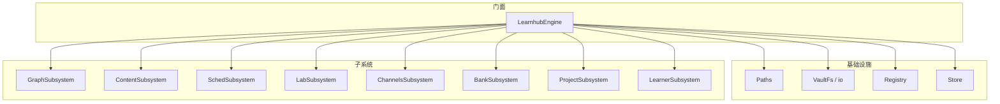
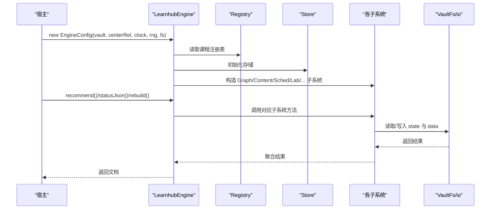
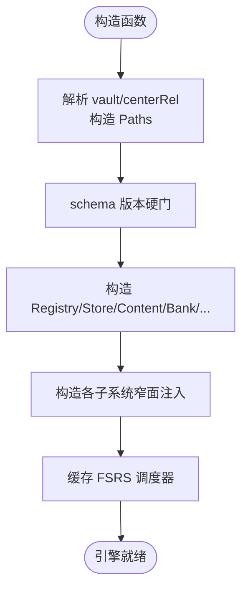
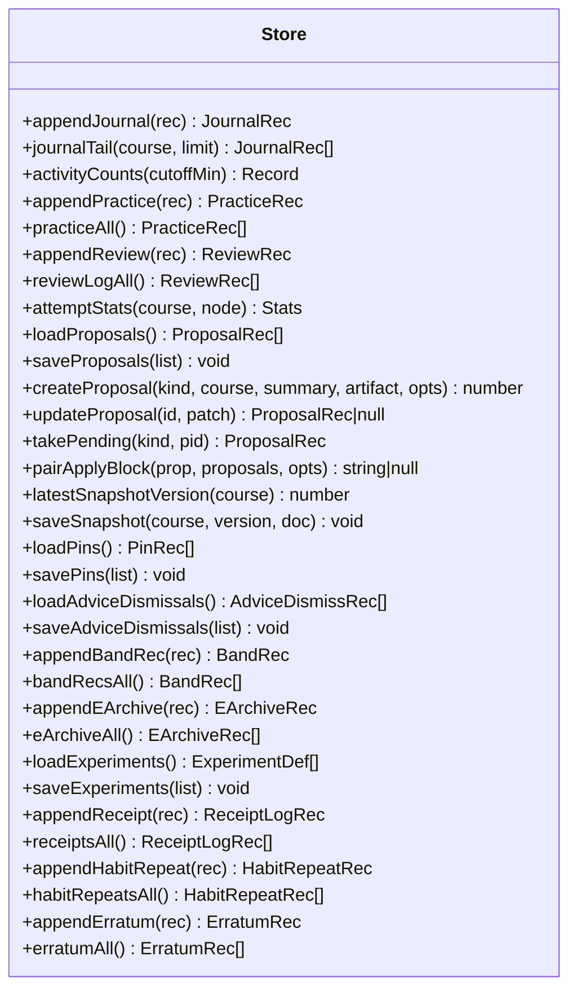
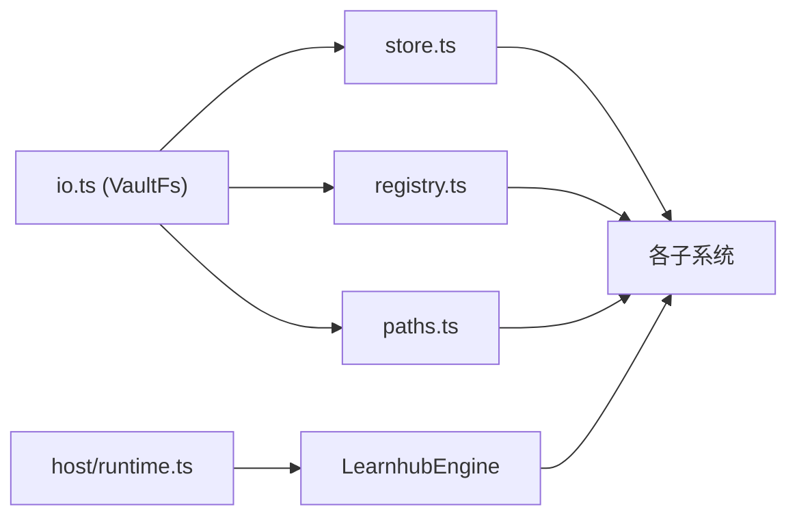

# 引擎核心

<cite>
**本文引用的文件**
- [src/engine/index.ts](file://src/engine/index.ts)
- [src/engine/store.ts](file://src/engine/store.ts)
- [src/engine/params.ts](file://src/engine/params.ts)
- [src/engine/types.ts](file://src/engine/types.ts)
- [src/engine/registry.ts](file://src/engine/registry.ts)
- [src/engine/paths.ts](file://src/engine/paths.ts)
- [src/engine/io.ts](file://src/engine/io.ts)
- [src/engine/sched-subsystem.ts](file://src/engine/sched-subsystem.ts)
- [src/engine/graph-subsystem.ts](file://src/engine/graph-subsystem.ts)
- [src/engine/content-subsystem.ts](file://src/engine/content-subsystem.ts)
- [src/engine/health.ts](file://src/engine/health.ts)
- [src/engine/sessions.ts](file://src/engine/sessions.ts)
- [src/host/runtime.ts](file://src/host/runtime.ts)
</cite>

## 目录
1. [简介](#简介)
2. [项目结构](#项目结构)
3. [核心组件](#核心组件)
4. [架构总览](#架构总览)
5. [详细组件分析](#详细组件分析)
6. [依赖关系分析](#依赖关系分析)
7. [性能考量](#性能考量)
8. [故障排查指南](#故障排查指南)
9. [结论](#结论)
10. [附录：API 使用示例与扩展点](#附录api-使用示例与扩展点)

## 简介
LearnHub 引擎核心以 LearnhubEngine 为统一门面，负责初始化、生命周期管理、子系统协调与数据访问收口。引擎采用“课程笔记 frontmatter 是调度状态唯一事实源；data/*.yaml 是图结构唯一事实源；state/ 仅承载追加型流水与人审产物”的数据主权策略，并通过 Store、Registry、Paths、VaultFs 等抽象实现可测试、可扩展的运行时。

## 项目结构
- 门面与装配：LearnhubEngine（index.ts）集中构造各子系统与领域对象，暴露对外 API。
- 存储与 IO：Store（store.ts）封装 JSONL/JSON 追加与原子写；io.ts 提供 VaultFs 端口与通用原语。
- 路径与配置：Paths（paths.ts）统一定义中心级与课程级路径；params.ts 集中可调参数。
- 类型契约：types.ts 定义共享数据结构（阶段、FSRS、提案、实验等）。
- 注册表：Registry（registry.ts）维护课程与笔记源清单，严格校验并 fail loud。
- 子系统：GraphSubsystem、ContentSubsystem、SchedSubsystem、GrowthSubsystem、LabSubsystem、ChannelsSubsystem、BankSubsystem、ProjectSubsystem、LearnerSubsystem 等按域拆分，通过窄面注入回引门面。
- 宿主集成：host/runtime.ts 装配 EngineConfig（vault、centerRel、clock、rng、fs），将引擎挂载到宿主运行期。

图表来源
- [src/engine/index.ts:149-398](file://src/engine/index.ts#L149-L398)
- [src/engine/paths.ts:26-198](file://src/engine/paths.ts#L26-L198)
- [src/engine/io.ts:9-28](file://src/engine/io.ts#L9-L28)
- [src/engine/registry.ts:77-153](file://src/engine/registry.ts#L77-L153)
- [src/engine/store.ts:46-479](file://src/engine/store.ts#L46-L479)

章节来源
- [src/engine/index.ts:1-859](file://src/engine/index.ts#L1-L859)
- [src/engine/paths.ts:1-198](file://src/engine/paths.ts#L1-L198)
- [src/engine/io.ts:1-103](file://src/engine/io.ts#L1-L103)
- [src/engine/registry.ts:1-154](file://src/engine/registry.ts#L1-L154)
- [src/engine/store.ts:1-479](file://src/engine/store.ts#L1-L479)

## 核心组件
- LearnhubEngine：统一入口，负责构造所有子系统、缓存 FSRS 调度器、暴露学习日计算、视图加载、推荐、审计、生成任务持久化等能力。
- Store：明文运行态存储，统一 JSONL 追加与 JSON 原子写，提案、快照、日志、回执、勘误等全量存取。
- Registry：课程与笔记源注册表，严格校验，fail loud。
- Paths：学习中心与课程根路径的统一派生，避免散落字符串拼接。
- VaultFs/io：引擎侧唯一 IO 通道，原子写、JSONL 只读、learnhub.json 读写。
- 子系统：按域拆分，通过窄面注入回引门面，解耦耦合。

章节来源
- [src/engine/index.ts:133-398](file://src/engine/index.ts#L133-L398)
- [src/engine/store.ts:46-479](file://src/engine/store.ts#L46-L479)
- [src/engine/registry.ts:77-153](file://src/engine/registry.ts#L77-L153)
- [src/engine/paths.ts:26-198](file://src/engine/paths.ts#L26-L198)
- [src/engine/io.ts:9-103](file://src/engine/io.ts#L9-L103)

## 架构总览
引擎采用“门面 + 领域子系统 + 基础设施抽象”的分层架构。门面不直接操作文件系统，而是通过 Store/VaultFs 完成数据访问；子系统之间通过窄面注入相互调用，避免环依赖；所有外部依赖（时钟、随机源、文件系统）通过 EngineConfig 注入，便于测试与替换。

图表来源
- [src/engine/index.ts:212-398](file://src/engine/index.ts#L212-L398)
- [src/engine/store.ts:46-479](file://src/engine/store.ts#L46-L479)
- [src/engine/io.ts:34-103](file://src/engine/io.ts#L34-L103)

## 详细组件分析

### LearnhubEngine 主引擎
- 初始化流程
  - 解析 vault 与 centerRel，构造 Paths。
  - 执行 schema 版本硬门（assertSchemaVersion），非当前主版本拒载。
  - 构造 Registry、Store、Content、QuestionBank、ConceptRegistry、LearnerCards、ErrorCards、Skills、Habits、NoteSourceManifest、AnkiMirror、Projects、Sessions。
  - 构造各子系统（Lab、Channels、Learner、Project、Bank、Graph、Content、Sched、Growth），通过窄面注入回引门面方法（如 loadView、learningDay、ensureNote、sched 等）。
  - 缓存 FSRS 调度器实例（按 courseRoot 键），减少重复构建成本。
- 生命周期管理
  - 学习日计算：readDayCutoff + todayStr，统一“今日”口径。
  - 视图加载：loadView 组合 GraphStore 与 stateMap，返回 graph/state/broken。
  - 节点定位：locateNode 支持“课程/节点”或全局唯一命中。
  - Broken 前置门：assertNoteOk 在节点操作前检查笔记有效性。
  - 占位笔记：ensureNote 在无笔记时创建默认 frontmatter，避免空档。
- 核心服务协调
  - 推荐与状态：recommend/statusJson 聚合 Learner、Sched、Growth、Lab 等子系统输出。
  - 审计与重建：rebuild 执行 runAudit 并写就绪清单。
  - 生成任务：saveGenJobs/loadGenJobs 原子读写，Broken 上抛。
  - 上下文包：discussionPack/errorExplainPack 组装节点元信息、正文、题库摘要、图位置等。

图表来源
- [src/engine/index.ts:212-398](file://src/engine/index.ts#L212-L398)

章节来源
- [src/engine/index.ts:133-859](file://src/engine/index.ts#L133-L859)

### 引擎存储机制（Store）
- 设计要点
  - JSONL 追加：journal/practice/review-log/e-archive/receipts/habit-repeats/erratum 等只增不改。
  - JSON 原子写：proposals/pins/experiments/gen-jobs 等整档替换，临时文件 + rename。
  - 缺失与损坏处理：Missing 合法空态 vs Broken 报出，遵循 ADR-0053。
  - 提案联动守卫：pairApplyBlock 防止同源双提案单边生效。
- 关键能力
  - 活动统计：activityCounts 聚合 journal+practice 按日计数。
  - 作答统计：attemptStats 结合勘误冲正 netPracticeRecs。
  - 快照：latestSnapshotVersion/saveSnapshot。
  - 建议忽略：adviceDismissPath 原子读写。
  - 难度带会话：bandLogPath 追加记录。
  - 实验定义：experimentsPath 原子写，最小形状校验。

图表来源
- [src/engine/store.ts:46-479](file://src/engine/store.ts#L46-L479)

章节来源
- [src/engine/store.ts:1-479](file://src/engine/store.ts#L1-L479)

### 参数配置系统（params.ts）
- 集中可调参数：期望保留率、R_gate、mastered 稳定性阈值、复习占比、新节点预算、日均容量、过载因子、软重启间隔、恢复模式清偿率、扫描初始稳定/难度、FSRS 难度中性值等。
- XP 时间账本：题型 XP 基础、乱猜惩罚、满分奖励、节点/里程碑缺省定价、每日目标缺省、日界缺省、streak 宽容天数。
- Mastery 交叉 2×2：高低分界、入档样本下限、升/降档阈值。
- Self-Calibration：过信阈值、JOL 抽查加强密度。
- 复诊与插入调速：复诊期范围、达标降幅/回升、样本下限、三率滚动窗、闸门阈值、旁支上限与韧性放宽。

章节来源
- [src/engine/params.ts:1-59](file://src/engine/params.ts#L1-L59)

### 类型定义（types.ts）
- 阶段机：unseen/ready/learning/review/mastered/skipped。
- 内容状态：draft/reviewed/flagged。
- 节清单：SectionManifest（id/title/type/status/version/tier/points）。
- FSRS 块：stability/difficulty/due/last_review/reps/lapses。
- 笔记 frontmatter：Fm（node/stage/fsrs/mastery/practice_ema/content/practice）。
- 图节点/块/区：GNode/GBlock/GRegion（含 teaches/assumes/misconceptions）。
- 注册表条目：CourseEntry/NoteSourceEntry。
- E 档案：EArchiveRec（kind/verdict/tags/advice/excerpt）。
- 流水条目：JournalRec/PracticeRec/ReviewRec（含 rating_source/exec_source/exp）。
- 提案：PROPOSAL_KINDS/ProposalRec（含 pair 联动）。
- 勘误冲正：ErratumRec（target_ts/verdict/xp/correct/revision/reason）。
- N-of-1 实验：NOF1_VARIABLE_WHITELIST/ExperimentDef。
- 学习者卡：LearnerCardKind。
- 渐退档：FadingTier。
- 笔记源伪课程：NOTE_SOURCE_COURSE。
- Vault 先验检索审计：VaultPriorAudit（terms/expanded/scanned/matched/scanTruncated/hitsTrimmed/zeroHit/hitPaths/expansionError）。

章节来源
- [src/engine/types.ts:1-369](file://src/engine/types.ts#L1-L369)

### 子系统协调
- GraphSubsystem：图分析、Vault 链接先验、图探索、提案门禁包装、enc 覆盖层回填。
- ContentSubsystem：内容管线、笔记 resolve/反馈区、课程工作区与题库树、Vault 先验注入段、上下文包。
- SchedSubsystem：节点跳过/完成确认、XP 时间账本、记忆健康仪表盘、FSRS 参数优化器、沉淀层。
- GrowthSubsystem：教练回合感知、生长批受理、边实验账本与复诊、Self-Calibration 画像。
- LabSubsystem：N-of-1 实验、挑战点恒温器、沙盘、睡眠耦合建议。
- ChannelsSubsystem：C1 笔记复习源、Anki 通道、漂移治理、排除清单。
- BankSubsystem：错误对比卡、学习面板题目管理、B2 回流、一键清理、勘误冲正。
- ProjectSubsystem：项目计划/里程碑、执行事件流、目标反编译。

章节来源
- [src/engine/graph-subsystem.ts:1-200](file://src/engine/graph-subsystem.ts#L1-L200)
- [src/engine/content-subsystem.ts:1-200](file://src/engine/content-subsystem.ts#L1-L200)
- [src/engine/sched-subsystem.ts:1-200](file://src/engine/sched-subsystem.ts#L1-L200)

## 依赖关系分析
- 低层依赖：io.ts 零领域依赖，仅依赖内置模块与 npm 类型；VaultFs 作为应用层端口，实现住 host/vault-fs.ts。
- 中层依赖：Store/Registry/Paths 被各子系统引用，但子系统间通过窄面注入避免环。
- 高层依赖：LearnhubEngine 聚合所有子系统，暴露统一 API；host/runtime 装配 EngineConfig 并路由工具调用。

图表来源
- [src/engine/io.ts:9-28](file://src/engine/io.ts#L9-L28)
- [src/engine/store.ts:46-479](file://src/engine/store.ts#L46-L479)
- [src/engine/registry.ts:77-153](file://src/engine/registry.ts#L77-L153)
- [src/engine/index.ts:212-398](file://src/engine/index.ts#L212-L398)
- [src/host/runtime.ts:23-41](file://src/host/runtime.ts#L23-L41)

章节来源
- [src/engine/index.ts:212-398](file://src/engine/index.ts#L212-L398)
- [src/host/runtime.ts:23-41](file://src/host/runtime.ts#L23-L41)

## 性能考量
- FSRS 调度器缓存：按 courseRoot 缓存实例，避免每次答一题重建与读盘开销。
- 原子写：临时文件 + rename 保证一致性，减少锁竞争。
- JSONL 只读：readJsonlLinesReport 对撕裂尾行豁免，提升鲁棒性。
- 活动统计：Promise.all 并行读取 journal 与 practice，降低 I/O 延迟。
- 健康分：graphHealthScore 基于图结构快速计算，辅助优化方向。

章节来源
- [src/engine/index.ts:198-210](file://src/engine/index.ts#L198-L210)
- [src/engine/io.ts:34-103](file://src/engine/io.ts#L34-L103)
- [src/engine/store.ts:78-96](file://src/engine/store.ts#L78-L96)
- [src/engine/health.ts:53-104](file://src/engine/health.ts#L53-L104)

## 故障排查指南
- 注册表 Broken：YAML 无法解析或条目不合契约，抛出明确错误并提示修复或删除。
- 提案文件 Broken：JSON 非法或非数组，逐条形状校验失败会标注位置与原因。
- JSONL 中段损坏：readJsonlLinesReport 抛出 Broken，撕裂尾行豁免。
- 生成任务 Broken：gen-jobs 不可读或非法 JSON，上抛并提示修复或删除后重启。
- 节点 Broken：assertNoteOk 在节点操作前检查，携带位置与原因。
- 健康分偏低：graphHealthScore 分解项提示动作句比例、est 覆盖率、前置完备、收敛度、结构卫生。

章节来源
- [src/engine/registry.ts:80-102](file://src/engine/registry.ts#L80-L102)
- [src/engine/store.ts:172-206](file://src/engine/store.ts#L172-L206)
- [src/engine/io.ts:71-103](file://src/engine/io.ts#L71-L103)
- [src/engine/index.ts:444-463](file://src/engine/index.ts#L444-L463)
- [src/engine/health.ts:53-104](file://src/engine/health.ts#L53-L104)

## 结论
LearnhubEngine 通过清晰的分层与窄面注入，实现了高内聚、低耦合的学习引擎核心。Store 与 VaultFs 抽象确保数据一致性与可测试性；子系统按域拆分，便于扩展与维护；参数集中、类型契约明确，支撑复杂的学习科学逻辑。配合宿主运行时，引擎可灵活适配不同部署环境。

## 附录：API 使用示例与扩展点

### 引擎初始化与基本用法
- 构造 EngineConfig：vault、centerRel、clock、rng、fs（由宿主提供）。
- 常用方法：
  - statusJson：获取课程状态、教练回合、终点完成读数等。
  - recommend(limit)：生成今日推荐事件。
  - rebuild(courseKey?)：审计并写就绪清单。
  - saveGenJobs/loadGenJobs：生成任务持久化。
  - discussionPack/errorExplainPack：AI 讨论与讲解上下文包。

章节来源
- [src/engine/index.ts:212-398](file://src/engine/index.ts#L212-L398)
- [src/engine/index.ts:534-569](file://src/engine/index.ts#L534-L569)
- [src/engine/index.ts:597-612](file://src/engine/index.ts#L597-L612)
- [src/engine/index.ts:724-753](file://src/engine/index.ts#L724-L753)
- [src/engine/index.ts:755-800](file://src/engine/index.ts#L755-L800)

### 扩展点开发指南
- 自定义服务：通过窄面注入到子系统（例如 ContentDeps/SchedDeps/GraphDeps），在不修改既有模块的前提下扩展行为。
- 中间件式回调：onPrior/onTolerated/usageSink 等注记回调用于观测与审计，不改变主流程返回值。
- 宿主集成：host/runtime.ts 装配 EngineConfig，并将引擎方法绑定到工具路由，支持 engine.sub.method 形式调用。

章节来源
- [src/engine/content-subsystem.ts:39-78](file://src/engine/content-subsystem.ts#L39-L78)
- [src/engine/sched-subsystem.ts:43-63](file://src/engine/sched-subsystem.ts#L43-L63)
- [src/engine/graph-subsystem.ts:28-51](file://src/engine/graph-subsystem.ts#L28-L51)
- [src/host/runtime.ts:205-228](file://src/host/runtime.ts#L205-L228)

### 错误处理策略
- Fail loud：注册表、提案、JSONL 中段损坏均抛出明确错误，避免静默降级。
- Missing 合法空态：文件缺失返回 [] 或 null，适用于配置与可选数据。
- 撕裂尾行豁免：JSONL 末行无换行且非法视为进程中断残留，跳过并记录行号。

章节来源
- [src/engine/registry.ts:80-102](file://src/engine/registry.ts#L80-L102)
- [src/engine/store.ts:172-206](file://src/engine/store.ts#L172-L206)
- [src/engine/io.ts:71-103](file://src/engine/io.ts#L71-L103)

### 日志记录与性能监控
- 运行日志：host/runtime.ts 记录每次引擎调用的工具名与输出摘要。
- 健康分：graphHealthScore 提供可优化的质量基线，辅助教练与审计。
- 活动统计：Store.activityCounts 聚合 journal/practice 按日计数，支撑打卡与热力图。

章节来源
- [src/host/runtime.ts:217-228](file://src/host/runtime.ts#L217-L228)
- [src/engine/health.ts:53-104](file://src/engine/health.ts#L53-L104)
- [src/engine/store.ts:78-96](file://src/engine/store.ts#L78-L96)