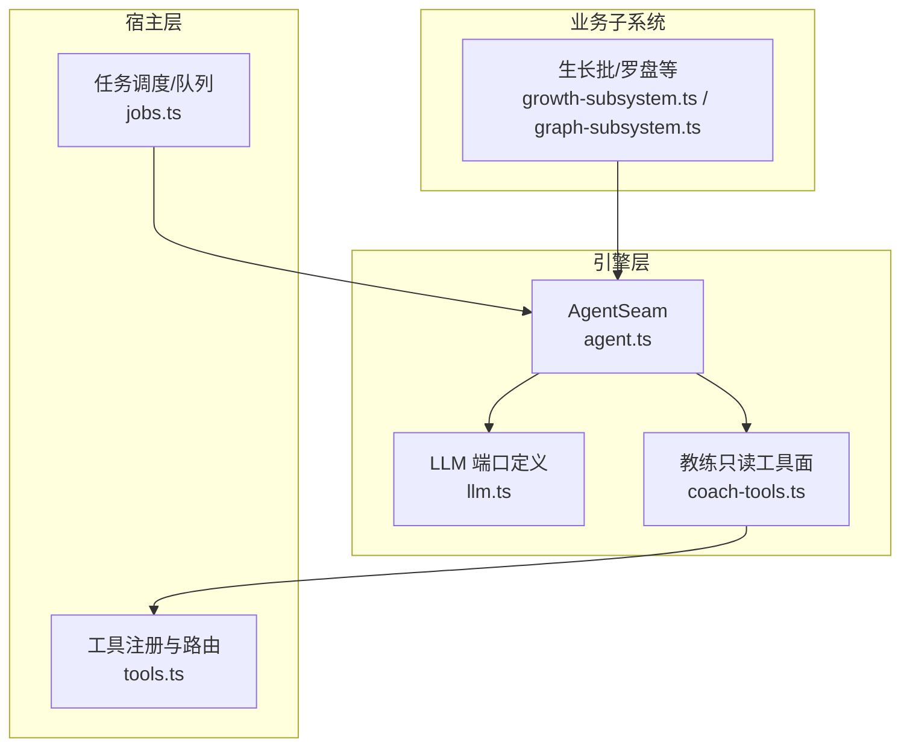
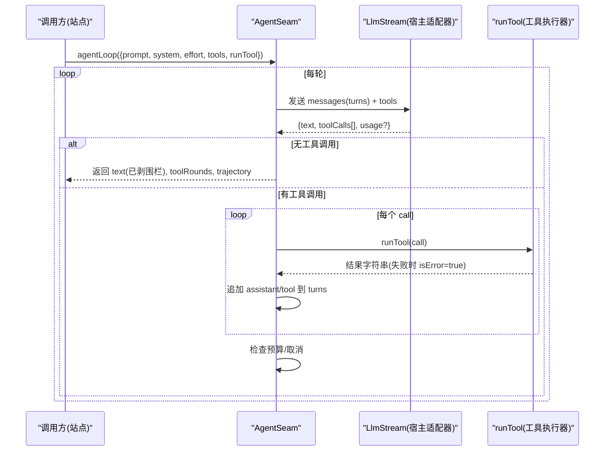
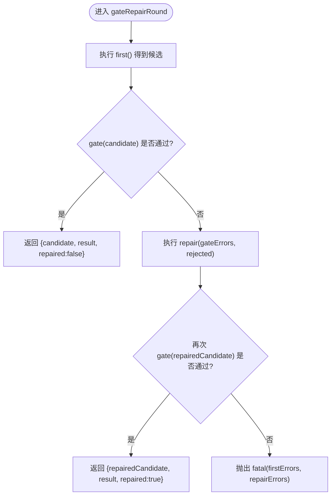

# Agent 缝机制

<cite>
**本文引用的文件**
- [agent.ts](file://src/engine/agent.ts)
- [llm.ts](file://src/engine/llm.ts)
- [coach-tools.ts](file://src/engine/coach-tools.ts)
- [tools.ts](file://src/host/tools.ts)
- [agent-seam.test.ts](file://tests/agent-seam.test.ts)
- [growth-subsystem.ts](file://src/engine/growth-subsystem.ts)
- [graph-subsystem.ts](file://src/engine/graph-subsystem.ts)
- [jobs.ts](file://src/host/jobs.ts)
</cite>

## 目录
1. [简介](#简介)
2. [项目结构](#项目结构)
3. [核心组件](#核心组件)
4. [架构总览](#架构总览)
5. [详细组件分析](#详细组件分析)
6. [依赖关系分析](#依赖关系分析)
7. [性能与预算控制](#性能与预算控制)
8. [故障处理指南](#故障处理指南)
9. [结论](#结论)
10. [附录：实现示例与最佳实践](#附录实现示例与最佳实践)

## 简介
本文件系统性说明 AgentSeam 缝机制的设计与实现，覆盖三类能力：
- complete() 单发模式：一次补全调用，自动剥围栏、记录观测日志。
- agentLoop() 工具回路模式：有界多轮迭代，模型可请求白名单内工具，执行结果回灌继续；预算封顶防自激循环。
- gateRepairRound() 门错修复轮：首轮产出经门校验，失败则回灌“门错误 + 被拒候选原文”重产恰一次，仍败抛两轮死因。

同时解释工具调用协议（LlmToolSpec/LlmToolCall/runTool）、预算控制（AGENT_LOOP_MAX_TOOL_ROUNDS 与取消检查）、错误处理策略（门错误回灌、修复轮流程、死因抛出），并提供自定义工具、配置工具白名单、处理工具调用结果的实践指引。

## 项目结构
AgentSeam 位于引擎层，消费宿主提供的 LLM 端口（补全与流式回路），并通过 runTool 注入具体工具实现。教练只读工具面提供一组只读视图工具，作为 agentLoop 的典型白名单示例。



图表来源
- [agent.ts:85-186](file://src/engine/agent.ts#L85-L186)
- [llm.ts:50-82](file://src/engine/llm.ts#L50-L82)
- [coach-tools.ts:236-304](file://src/engine/coach-tools.ts#L236-L304)
- [tools.ts:102-125](file://src/host/tools.ts#L102-L125)
- [growth-subsystem.ts:548-560](file://src/engine/growth-subsystem.ts#L548-L560)
- [graph-subsystem.ts:500-510](file://src/engine/graph-subsystem.ts#L500-L510)
- [jobs.ts:1020-1035](file://src/host/jobs.ts#L1020-L1035)

章节来源
- [agent.ts:1-227](file://src/engine/agent.ts#L1-L227)
- [llm.ts:1-83](file://src/engine/llm.ts#L1-L83)
- [coach-tools.ts:1-305](file://src/engine/coach-tools.ts#L1-L305)
- [tools.ts:1-126](file://src/host/tools.ts#L1-L126)

## 核心组件
- AgentSeam：统一入口，封装 complete()/repair()/agentLoop()/gateRepairRound()，负责后处理、观测、预算与取消传导。
- LLM 端口：LlmComplete（补全）与 LlmStream（回路），以及工具协议 LlmToolSpec/LlmToolCall/LlmLoopTurn。
- 工具面：coachToolset 提供 tools（白名单规格）与 runTool（执行器），仅读视图，白名单外拒绝。
- 宿主装配：registerTools 将命令/通道注册为工具，供外部 agent 调用；生成任务通过 jobs 驱动 agentLoop。

章节来源
- [agent.ts:85-221](file://src/engine/agent.ts#L85-L221)
- [llm.ts:29-82](file://src/engine/llm.ts#L29-L82)
- [coach-tools.ts:236-304](file://src/engine/coach-tools.ts#L236-L304)
- [tools.ts:102-125](file://src/host/tools.ts#L102-L125)

## 架构总览
AgentSeam 是应用层对 LLM 的“唯一调用面”，屏蔽了适配器细节（超时、重试、降级、温度等）。工具回路在 agentLoop 中维护消息历史 turns，按轮次推进，直到助手不再请求工具或触发预算/取消。门错修复轮以 GateRepairSpec 描述“首产→门→修复→死因”的闭环。



图表来源
- [agent.ts:128-186](file://src/engine/agent.ts#L128-L186)
- [llm.ts:70-82](file://src/engine/llm.ts#L70-L82)
- [coach-tools.ts:253-297](file://src/engine/coach-tools.ts#L253-L297)

## 详细组件分析

### AgentSeam 类设计
- 单发模式 complete()：调用底层 LlmComplete，自动 stripFences，记录 onCall 观测（站/模式/档/序号/字数/耗时/usage）。
- 修复模式 repair()：同传输，观测标记为 repair。
- 工具回路 agentLoop()：
  - 要求注入 LlmStream，否则 fail loud。
  - 维护 turns 历史，逐轮发送 messages 与 tools。
  - 若助手返回 toolCalls，则逐一执行 runTool，将结果以 tool 消息回灌，并记录轨迹。
  - 预算上限 AGENT_LOOP_MAX_TOOL_ROUNDS，超过即中止。
  - 支持 isCancelled 回调，每轮底层调用前与每次工具执行后检查，取消即抛错中止。
- 门错修复轮 gateRepairRound()：
  - first() 产出 → gate() 校验 → 未过则以“门错误 + 被拒候选原文”调用 repair() 重产恰一次。
  - 修复轮仍失败或自身抛错，则 fatal(firstErrors, repairDeath) 抛出两轮死因。
  - 受理式门的 result 随最终产物返回。



图表来源
- [agent.ts:103-120](file://src/engine/agent.ts#L103-L120)

章节来源
- [agent.ts:93-120](file://src/engine/agent.ts#L93-L120)
- [agent.ts:122-186](file://src/engine/agent.ts#L122-L186)
- [agent.ts:188-221](file://src/engine/agent.ts#L188-L221)

### 工具调用协议
- LlmToolSpec：工具规范，包含 name/description/parameters（JSON Schema 直通 provider tools 字段）。
- LlmToolCall：一次工具调用，id/name/arguments（原始 JSON 串）。
- LlmLoopTurn：一轮对话消息，user/assistant/tool 三种角色，tool 消息携带 callId/text/isError。
- runTool：执行器接口，接收 LlmToolCall，返回字符串结果；异常会被缝捕获并以 isError=true 回灌。

章节来源
- [llm.ts:50-82](file://src/engine/llm.ts#L50-L82)
- [agent.ts:128-186](file://src/engine/agent.ts#L128-L186)

### 工具白名单与执行器（教练只读工具面）
- 白名单七件：graph_view/node_card/concept_registry/behavior_digest/bank_overview/compass_read/endpoint_anchor。
- coachToolSpecs() 生成 LlmToolSpec[]，coachToolExecutor() 实现 runTool，白名单外调用直接报错（isError 回灌）。
- 所有工具均为只读视图，零写侧、零队列触点，避免递归自激。

章节来源
- [coach-tools.ts:30-45](file://src/engine/coach-tools.ts#L30-L45)
- [coach-tools.ts:236-297](file://src/engine/coach-tools.ts#L236-L297)

### 宿主工具注册与接入
- registerTools 遍历 COMMAND_LIST，将 channel=agent 的命令注册为工具，名称/描述/schema 由注册表决定。
- 生成路径通过 resolveEngineEntry + run 包装执行；例外 handler 走 tool-handlers。
- 工具输出统一文本渲染，便于模型消费。

章节来源
- [tools.ts:102-125](file://src/host/tools.ts#L102-L125)

### 典型使用场景
- 教练生长：通过 growth-subsystem 组装 coachToolset，传入 agentLoop，进行裁决前的证据自查。
- 目标反编译/计划草案/里程碑草案：通过 graph-subsystem/jobs 调用 gateRepairRound，实现门错修复。

章节来源
- [growth-subsystem.ts:548-560](file://src/engine/growth-subsystem.ts#L548-L560)
- [graph-subsystem.ts:500-510](file://src/engine/graph-subsystem.ts#L500-L510)
- [jobs.ts:1020-1035](file://src/host/jobs.ts#L1020-L1035)

## 依赖关系分析
- AgentSeam 依赖 LlmComplete/LlmStream（纯类型解耦），实现由宿主适配器注入。
- 工具执行器通过 runTool 注入，与 AgentSeam 解耦；白名单由站点自行声明。
- 观测面 onCall 由宿主注入，用于运行日志/控制台输出。
- 时钟 clock 用于耗时测量与 startedAt，测试可替换固定时钟。

```mermaid
classDiagram
class AgentSeam {
+complete(station, prompt, opts) Promise<string>
+repair(station, prompt, opts) Promise<string>
+agentLoop(req) Promise<{text, toolRounds, trajectory}>
+gateRepairRound(station, spec) Promise<{candidate, result, repaired}>
}
class LlmComplete {
<<interface>>
}
class LlmStream {
<<interface>>
}
class CoachToolset {
+tools : LlmToolSpec[]
+runTool(call) : Promise<string>
}
AgentSeam --> LlmComplete : "消费"
AgentSeam --> LlmStream : "消费"
AgentSeam --> CoachToolset : "注入 runTool"
```

图表来源
- [agent.ts:85-186](file://src/engine/agent.ts#L85-L186)
- [llm.ts:29-82](file://src/engine/llm.ts#L29-L82)
- [coach-tools.ts:236-304](file://src/engine/coach-tools.ts#L236-L304)

章节来源
- [agent.ts:85-221](file://src/engine/agent.ts#L85-L221)
- [llm.ts:29-82](file://src/engine/llm.ts#L29-L82)
- [coach-tools.ts:236-304](file://src/engine/coach-tools.ts#L236-L304)

## 性能与预算控制
- 预算封顶：AGENT_LOOP_MAX_TOOL_ROUNDS = 6，第 K+1 轮若仍请求工具则 fail loud，防止自激循环。
- 取消检查：isCancelled 在每轮底层调用前与每次工具执行后检查，取消即抛错中止，丢弃已产结果。
- 观测面：onCall 记录每轮调用（站/模式/档/序号/字数/耗时/usage），便于监控与诊断。
- 后处理：stripFences 剥离数据类代码围栏（markdown/yaml/json），正文类标签不剥离。

章节来源
- [agent.ts:37-37](file://src/engine/agent.ts#L37-L37)
- [agent.ts:128-186](file://src/engine/agent.ts#L128-L186)
- [agent.ts:188-221](file://src/engine/agent.ts#L188-L221)
- [agent.ts:31-34](file://src/engine/agent.ts#L31-L34)

## 故障处理指南
- 门错误回灌：gateRepairRound 首轮失败时，将“门错误原文 + 被拒候选原文”回灌至 repair() 重产恰一次。
- 修复轮失败：若修复轮自身抛错或仍失败，fatal(firstErrors, repairDeath) 抛出两轮死因，便于定位。
- 程序性错误：门内抛错视为程序性失败，原样冒泡，不进修复轮。
- 工具执行失败：runTool 抛错会被缝捕获，以 isError=true 回灌，模型可见。
- 预算耗尽：K≤6 轮后仍在请求工具，fail loud 中止回路。
- 端口缺位：agentLoop 需要 LlmStream，缺失则 fail loud 提示适配器缺位。

章节来源
- [agent.ts:103-120](file://src/engine/agent.ts#L103-L120)
- [agent.ts:128-186](file://src/engine/agent.ts#L128-L186)
- [agent-seam.test.ts:90-162](file://tests/agent-seam.test.ts#L90-L162)
- [agent-seam.test.ts:199-235](file://tests/agent-seam.test.ts#L199-L235)

## 结论
AgentSeam 将 LLM 交互抽象为稳定、可观测、可控的统一接口，通过 complete/loop/repair 三态覆盖常见生成场景，并以 gateRepairRound 提供标准化的门错修复流程。工具调用协议与白名单机制确保只读安全与可扩展性，预算与取消控制保障稳定性与资源效率。结合宿主工具注册与观测面，形成从调用到落盘的完整链路。

## 附录：实现示例与最佳实践

### 自定义工具（只读视图）
- 定义工具规范：name/description/parameters（JSON Schema）。
- 实现 runTool：解析 arguments（JSON），执行业务逻辑，返回字符串；参数非法或白名单外调用应抛错（isError 回灌）。
- 将工具加入站点 tools 白名单，并在 agentLoop 中传入。

参考路径
- [coach-tools.ts:236-297](file://src/engine/coach-tools.ts#L236-L297)
- [agent.ts:128-186](file://src/engine/agent.ts#L128-L186)

### 配置工具白名单
- 站点按需声明 tools: LlmToolSpec[]，仅允许白名单内工具被模型调用。
- 白名单外调用由 runTool 拒绝，并以 isError=true 回灌，模型可见。

参考路径
- [coach-tools.ts:236-248](file://src/engine/coach-tools.ts#L236-L248)
- [agent.ts:128-186](file://src/engine/agent.ts#L128-L186)

### 处理工具调用结果
- 在 runTool 中捕获异常，返回错误信息；AgentSeam 会将其标记为 isError 并回灌。
- 利用 trajectory 记录每轮工具调用摘要，便于调试与审计。

参考路径
- [agent.ts:172-183](file://src/engine/agent.ts#L172-L183)
- [coach-tools.ts:253-297](file://src/engine/coach-tools.ts#L253-L297)

### 使用门错修复轮
- 实现 GateRepairSpec：first() 产出、gate() 校验、repair() 回灌重产、fatal() 构造死因。
- 适用于种子起草、教练生长、里程碑草案等需要“一次修复机会”的场景。

参考路径
- [agent.ts:103-120](file://src/engine/agent.ts#L103-L120)
- [graph-subsystem.ts:500-510](file://src/engine/graph-subsystem.ts#L500-L510)
- [jobs.ts:1020-1035](file://src/host/jobs.ts#L1020-L1035)

### 预算与取消
- 保持 AGENT_LOOP_MAX_TOOL_ROUNDS 不变，避免提高天花板；如需调整需全局评估。
- 在 agentLoop 传入 isCancelled 回调，确保生成页取消旗标能中断后续轮次。

参考路径
- [agent.ts:37-37](file://src/engine/agent.ts#L37-L37)
- [agent.ts:128-186](file://src/engine/agent.ts#L128-L186)