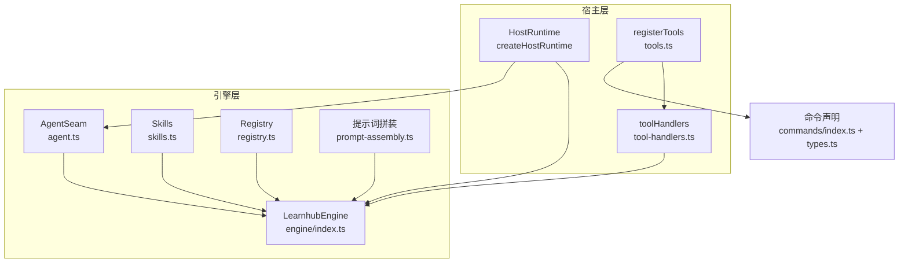
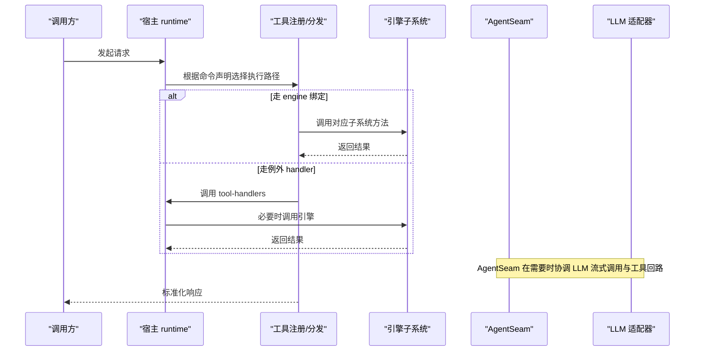
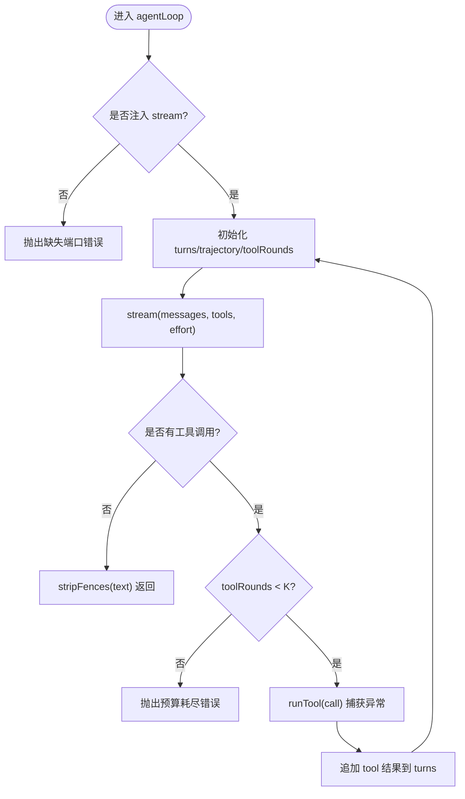
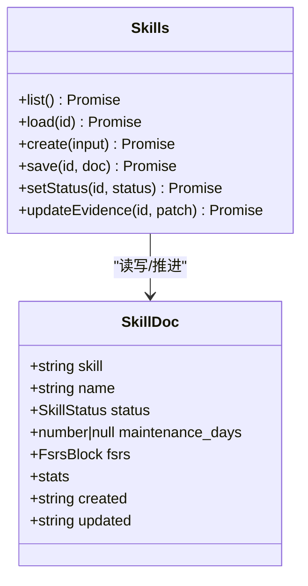
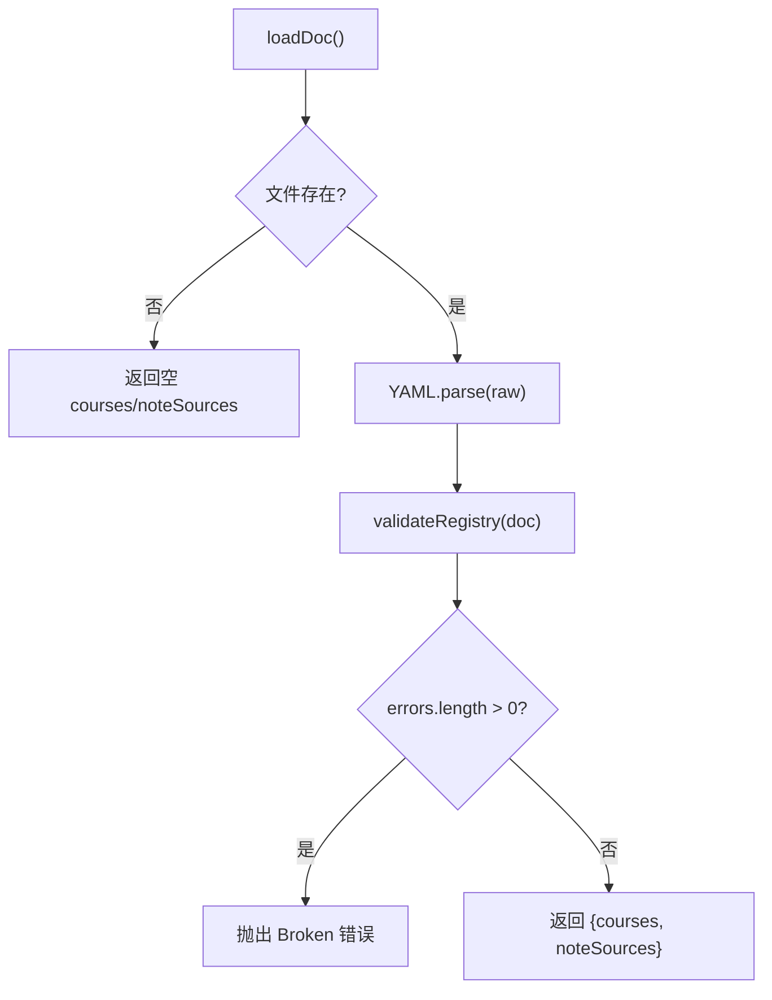
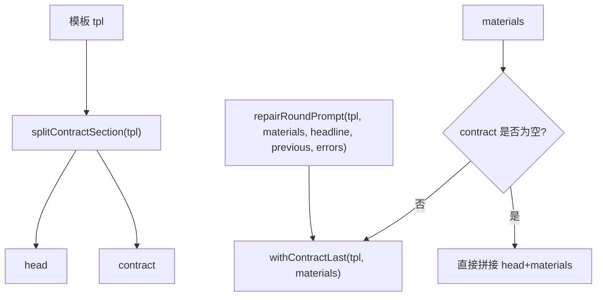
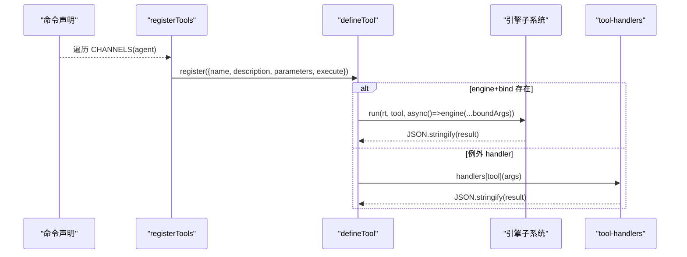
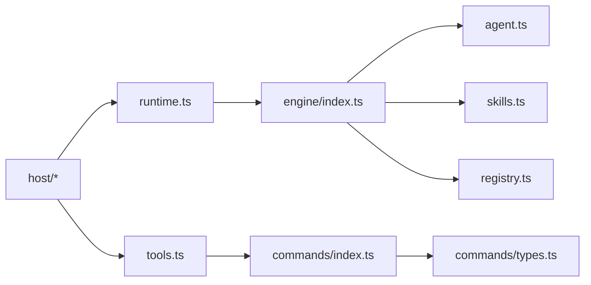

# 扩展机制

<cite>
**本文引用的文件**
- [agent.ts](file://src/engine/agent.ts)
- [skills.ts](file://src/engine/skills.ts)
- [registry.ts](file://src/engine/registry.ts)
- [prompt-assembly.ts](file://src/engine/prompt-assembly.ts)
- [tools.ts](file://src/host/tools.ts)
- [tool-handlers.ts](file://src/host/tool-handlers.ts)
- [types.ts](file://src/commands/types.ts)
- [index.ts](file://src/commands/index.ts)
- [runtime.ts](file://src/host/runtime.ts)
- [index.ts](file://src/engine/index.ts)
</cite>

## 目录
1. [简介](#简介)
2. [项目结构](#项目结构)
3. [核心组件](#核心组件)
4. [架构总览](#架构总览)
5. [详细组件分析](#详细组件分析)
6. [依赖关系分析](#依赖关系分析)
7. [性能考量](#性能考量)
8. [故障排查指南](#故障排查指南)
9. [结论](#结论)
10. [附录：自定义扩展开发示例](#附录自定义扩展开发示例)

## 简介
本文件面向 LearnHub 引擎的扩展机制，系统性说明以下能力：
- AgentSeam 设计模式：统一 LLM 调用缝、工具回路预算与门错修复轮。
- Skills 系统：技能条目定义、执行事件调度与结果聚合（FSRS 复用、维持节拍、XP 入账）。
- Registry 注册表：课程与笔记源注册、服务发现与版本控制语义。
- 提示词模板系统：契约段后置拼装、变量替换与上下文注入。
- 工具注册与调用协议：命令声明驱动的工具面装配、参数 schema 投影与执行路径分派。
- 错误处理机制：fail loud 策略、观测记录与可恢复流程。

## 项目结构
LearnHub 将“引擎能力”与“宿主适配”解耦：
- 引擎层（engine）提供 AgentSeam、Skills、Registry、提示词拼装等核心能力。
- 宿主层（host）负责运行时装配、工具注册、LLM 适配器接入与任务队列。
- 命令声明（commands）是“单一事实源”，同时驱动 agent 工具面与面板路由。

图表来源
- [runtime.ts:138-193](file://src/host/runtime.ts#L138-L193)
- [tools.ts:102-125](file://src/host/tools.ts#L102-L125)
- [tool-handlers.ts:23-287](file://src/host/tool-handlers.ts#L23-L287)
- [agent.ts:85-221](file://src/engine/agent.ts#L85-L221)
- [skills.ts:169-244](file://src/engine/skills.ts#L169-L244)
- [registry.ts:77-153](file://src/engine/registry.ts#L77-L153)
- [prompt-assembly.ts:14-42](file://src/engine/prompt-assembly.ts#L14-L42)
- [index.ts:149-184](file://src/engine/index.ts#L149-L184)

章节来源
- [runtime.ts:138-193](file://src/host/runtime.ts#L138-L193)
- [tools.ts:102-125](file://src/host/tools.ts#L102-L125)
- [tool-handlers.ts:23-287](file://src/host/tool-handlers.ts#L23-L287)
- [agent.ts:85-221](file://src/engine/agent.ts#L85-L221)
- [skills.ts:169-244](file://src/engine/skills.ts#L169-L244)
- [registry.ts:77-153](file://src/engine/registry.ts#L77-L153)
- [prompt-assembly.ts:14-42](file://src/engine/prompt-assembly.ts#L14-L42)
- [index.ts:149-184](file://src/engine/index.ts#L149-L184)

## 核心组件
- AgentSeam：统一 LLM 调用缝，封装 complete/repair/agentLoop，内置调用观测与预算控制。
- Skills：技能条目与执行事件调度，复用 FSRS，支持维持节拍与 XP 入账。
- Registry：课程与笔记源注册表，提供加载、校验、解析与启用过滤。
- 提示词拼装：契约段后置拼装、修复轮提示词构造，确保“输出契约”靠近生成点。
- 工具注册与调用：命令声明驱动工具注册，schema 投影到 SDK，执行走 engine 或 handler。

章节来源
- [agent.ts:85-221](file://src/engine/agent.ts#L85-L221)
- [skills.ts:169-244](file://src/engine/skills.ts#L169-L244)
- [registry.ts:77-153](file://src/engine/registry.ts#L77-L153)
- [prompt-assembly.ts:14-42](file://src/engine/prompt-assembly.ts#L14-L42)
- [tools.ts:72-125](file://src/host/tools.ts#L72-L125)

## 架构总览
LearnHub 通过“命令声明”作为唯一入口，将 agent 工具面与面板路由统一装配；引擎内部以子系统方式组织能力，并通过 AgentSeam 暴露统一的 LLM 调用与工具回路能力。

图表来源
- [tools.ts:102-125](file://src/host/tools.ts#L102-L125)
- [tool-handlers.ts:23-287](file://src/host/tool-handlers.ts#L23-L287)
- [runtime.ts:138-193](file://src/host/runtime.ts#L138-L193)
- [agent.ts:122-186](file://src/engine/agent.ts#L122-L186)

## 详细组件分析

### AgentSeam 设计模式
- 目标：为所有站点提供一致的 LLM 调用与工具回路能力，屏蔽底层实现差异。
- 关键能力：
  - complete/repair：单发补全与门错修复轮，自动剥离代码围栏并记录观测数据。
  - agentLoop：有界工具回路（K≤6），按白名单执行工具，轨迹记录与取消传导。
  - gateRepairRound：首轮产出→门校验→失败回灌 repair 一次→仍败抛死因。
  - 观测面：onCall 回调记录 station/mode/effort/callNo/字符数/耗时/token 用量。
- 错误处理：
  - 工具执行异常捕获为文本结果并标记 isError。
  - 预算耗尽抛出明确错误中止回路。
  - 观测面故障不阻断主流程。

图表来源
- [agent.ts:122-186](file://src/engine/agent.ts#L122-L186)
- [agent.ts:188-221](file://src/engine/agent.ts#L188-L221)

章节来源
- [agent.ts:85-221](file://src/engine/agent.ts#L85-L221)

### Skills 系统
- 技能条目（SkillDoc）：id/name/status/maintenance_days/fsrs/stats/时间戳。
- 执行事件：source=auto/self/ai，rating∈[1,4]，kind=acquisition/maintenance。
- 维护节拍：maintenance_days 默认 30，范围 clamp 7–365；due 取 FSRS due 与维护帽较早者。
- 证据映射：accuracy 与 self_help 映射为 1–4 评分，无 accuracy 必须退化为自评。
- 生命周期：list/load/create/save/updateEvidence/setStatus；Missing/Broken 严格区分。

图表来源
- [skills.ts:51-65](file://src/engine/skills.ts#L51-L65)
- [skills.ts:169-244](file://src/engine/skills.ts#L169-L244)

章节来源
- [skills.ts:35-105](file://src/engine/skills.ts#L35-L105)
- [skills.ts:123-150](file://src/engine/skills.ts#L123-L150)
- [skills.ts:169-244](file://src/engine/skills.ts#L169-L244)

### Registry 注册表
- 职责：课程与笔记源注册表的读取、校验、写入与解析。
- 校验规则：name/root/id 非空且唯一；enabled/tags 类型约束；note_sources 域独立校验。
- 服务发现：get/resolve/enabled 提供精确匹配、唯一启用选择与多课程冲突提示。
- 版本控制：通过 schema 版本与 fail loud 策略保证数据一致性。

图表来源
- [registry.ts:21-75](file://src/engine/registry.ts#L21-L75)
- [registry.ts:81-102](file://src/engine/registry.ts#L81-L102)
- [registry.ts:124-153](file://src/engine/registry.ts#L124-L153)

章节来源
- [registry.ts:21-75](file://src/engine/registry.ts#L21-L75)
- [registry.ts:77-153](file://src/engine/registry.ts#L77-L153)

### 提示词模板系统
- 契约段后置：splitContractSection 提取最后一个“## 输出…”至末尾作为契约段；withContractLast 将材料置于 head 之后、契约之前，确保模型最后读到“只输出 X”。
- 修复轮提示词：repairRoundPrompt 将上一次输出与校验清单拼接于材料后，契约段仍置尾。
- 上下文注入：调用方可传入 materials（上下文包/正文/任务块/修复反馈），由拼装函数统一组合。

图表来源
- [prompt-assembly.ts:14-42](file://src/engine/prompt-assembly.ts#L14-L42)

章节来源
- [prompt-assembly.ts:1-42](file://src/engine/prompt-assembly.ts#L1-42)

### 工具注册与调用协议
- 命令声明：CommandSpec 集中描述 id/summary/args/engine/channels/bind/phase/output，作为 agent 与 panel 的共同事实源。
- 工具注册：registerTools 遍历 COMMAND_LIST，对 agent 通道使用 defineTool 注册，parameters 由 sdkParameters 从 args 投影。
- 执行路径：若声明了 engine+bind，则通过 resolveEngineEntry 调用引擎子系统；否则走 tool-handlers 中的例外 handler。
- 参数契约：ParamSpec 支持 read 取值语义（trimmed/text/raw/fallback/finite/query），并在下发前剥除投递层扩展键。

图表来源
- [tools.ts:72-125](file://src/host/tools.ts#L72-L125)
- [tool-handlers.ts:23-287](file://src/host/tool-handlers.ts#L23-L287)
- [types.ts:76-128](file://src/commands/types.ts#L76-L128)
- [index.ts:25-72](file://src/commands/index.ts#L25-L72)

章节来源
- [tools.ts:72-125](file://src/host/tools.ts#L72-L125)
- [tool-handlers.ts:23-287](file://src/host/tool-handlers.ts#L23-L287)
- [types.ts:76-128](file://src/commands/types.ts#L76-L128)
- [index.ts:25-72](file://src/commands/index.ts#L25-L72)

## 依赖关系分析
- 耦合度：
  - host 仅通过 runtime 与 commands 装配，避免深耦合引擎内部模块。
  - engine 通过门面（index.ts）对外暴露能力，限制 host 直引子模块。
- 外部依赖：
  - LLM 适配器通过 AgentSeamPorts 注入，保持引擎与 provider 解耦。
  - VaultFs 抽象文件系统，测试可替换为内存实现。
- 循环依赖：
  - prompt-assembly.ts 零依赖，被 content/seed 共用，避免环。
  - commands/types.ts 仅 type import，供 UI 与 host 共享类型。

图表来源
- [runtime.ts:138-193](file://src/host/runtime.ts#L138-L193)
- [index.ts:149-184](file://src/engine/index.ts#L149-L184)
- [tools.ts:102-125](file://src/host/tools.ts#L102-L125)
- [index.ts:25-72](file://src/commands/index.ts#L25-L72)
- [types.ts:76-128](file://src/commands/types.ts#L76-L128)

章节来源
- [runtime.ts:138-193](file://src/host/runtime.ts#L138-L193)
- [index.ts:149-184](file://src/engine/index.ts#L149-L184)
- [tools.ts:102-125](file://src/host/tools.ts#L102-L125)
- [index.ts:25-72](file://src/commands/index.ts#L25-L72)
- [types.ts:76-128](file://src/commands/types.ts#L76-L128)

## 性能考量
- 工具回路预算：K≤6 轮，防止自激循环与过度消耗。
- 观测开销：onCall 回调异步落盘，失败静默，不影响主流程。
- 提示词拼装：契约段后置减少模型注意力分散，提高指令遵循率。
- 注册表读写：atomicWrite 保障一致性；loadDoc 缓存与错误快速失败。
- Skills 推进：复用 FSRS 数学内核，避免重复计算；维护节拍降低低频接触成本。

## 故障排查指南
- AgentSeam 工具回路报错：
  - 检查是否注入 LlmStream；未注入会抛出缺失端口错误。
  - 若工具调用频繁导致预算耗尽，审查工具白名单与逻辑复杂度。
  - 查看 onCall 记录定位具体站点的调用次数与耗时。
- Skills 数据问题：
  - Missing：技能不存在需先创建；Broken：YAML 解析失败或字段非法，依据错误信息修正。
  - maintenance_days 超出范围会被拒绝，需调整至 7–365 或关闭传 null。
- Registry 数据问题：
  - 课程名/根路径重复或 enabled 类型错误会导致 Broken；按错误清单逐项修复。
  - 多课程启用时需显式指定课程，否则会抛出歧义错误。
- 提示词契约失效：
  - 确认模板包含“## 输出…”段落；若无契约段，withContractLast 不会追加契约。
  - 修复轮提示词应包含上一次输出与校验清单，确保模型能针对性修正。

章节来源
- [agent.ts:122-186](file://src/engine/agent.ts#L122-L186)
- [agent.ts:188-221](file://src/engine/agent.ts#L188-L221)
- [skills.ts:123-150](file://src/engine/skills.ts#L123-L150)
- [skills.ts:196-207](file://src/engine/skills.ts#L196-L207)
- [registry.ts:81-102](file://src/engine/registry.ts#L81-L102)
- [registry.ts:137-153](file://src/engine/registry.ts#L137-L153)
- [prompt-assembly.ts:14-42](file://src/engine/prompt-assembly.ts#L14-L42)

## 结论
LearnHub 的扩展机制以“命令声明”为中心，结合 AgentSeam 的统一 LLM 调用、Skills 的可扩展学习 lane、Registry 的中心化服务发现与提示词契约后置拼装，形成高内聚、低耦合、可观测、可恢复的扩展体系。通过 fail loud 与严格校验，确保扩展行为可预测、可审计、可演进。

## 附录：自定义扩展开发示例
以下为开发自定义扩展的步骤指引（不含具体代码内容，仅提供路径参考）：

- 新增工具函数（引擎子系统方法）
  - 在引擎子系统添加方法，并通过 LearnhubEngine 门面导出。
  - 参考路径：[engine/index.ts:149-184](file://src/engine/index.ts#L149-L184)

- 声明命令与工具
  - 在 commands 域文件中新增 command 声明，填写 id/summary/args/engine/channels/bind。
  - 参考路径：[commands/types.ts:76-128](file://src/commands/types.ts#L76-L128)、[commands/index.ts:25-72](file://src/commands/index.ts#L25-L72)

- 注册工具与执行路径
  - 若走 engine 绑定：确保 engine 字段指向有效方法，bind 顺序与 args 键一致。
  - 若走例外 handler：在 tool-handlers 中添加对应 handler 逻辑。
  - 参考路径：[tools.ts:102-125](file://src/host/tools.ts#L102-L125)、[tool-handlers.ts:23-287](file://src/host/tool-handlers.ts#L23-L287)

- 使用 AgentSeam 进行 LLM 调用
  - 在站点中通过 AgentSeam.complete/repair/agentLoop 调用 LLM，并设置 station/effort/tools。
  - 参考路径：[agent.ts:93-120](file://src/engine/agent.ts#L93-L120)、[agent.ts:122-186](file://src/engine/agent.ts#L122-L186)

- 构建提示词与契约
  - 使用 withContractLast 与 repairRoundPrompt 组装最终提示词，确保契约段置尾。
  - 参考路径：[prompt-assembly.ts:14-42](file://src/engine/prompt-assembly.ts#L14-L42)

- 注册与发现服务（Registry）
  - 如需新增课程或笔记源，编辑注册表并通过 Registry.load/get/resolve 访问。
  - 参考路径：[registry.ts:77-153](file://src/engine/registry.ts#L77-L153)

- 技能扩展（Skills）
  - 创建技能条目、记录执行事件、推进 FSRS 状态并写回。
  - 参考路径：[skills.ts:169-244](file://src/engine/skills.ts#L169-L244)