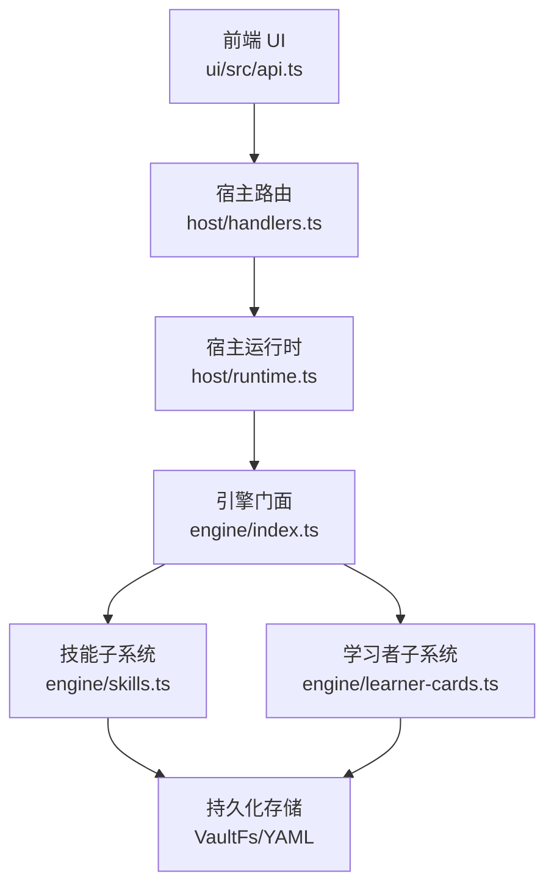
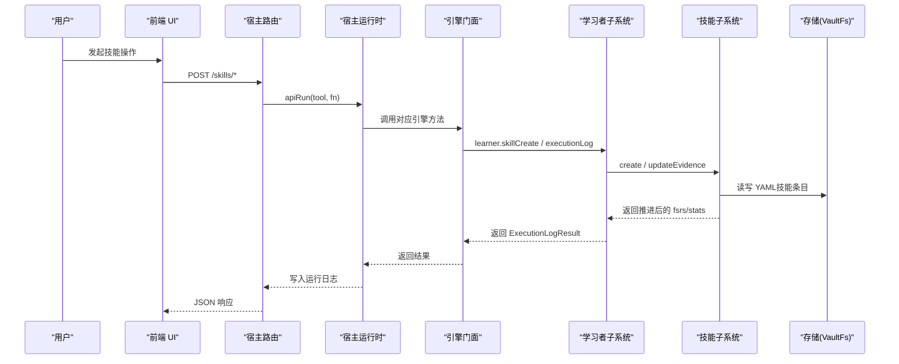
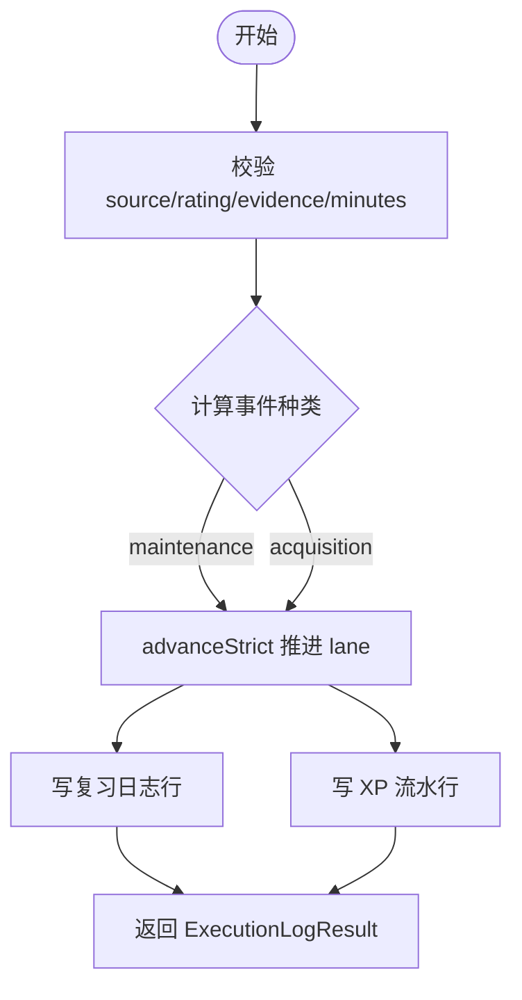
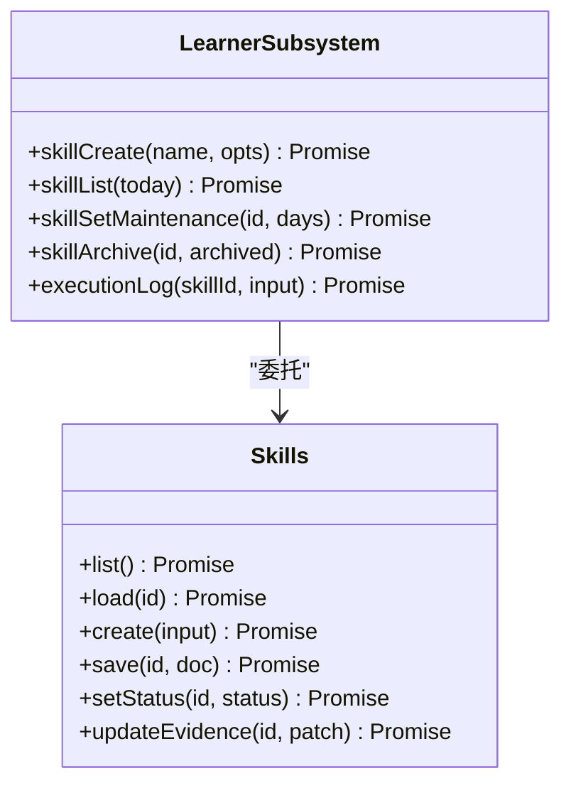
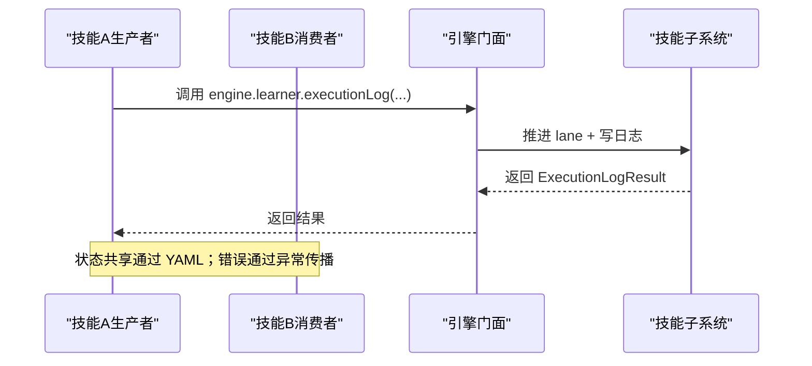
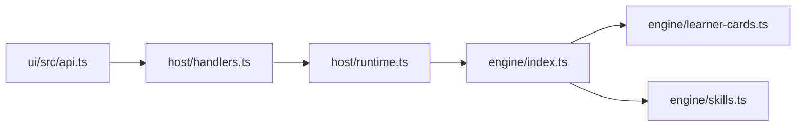

# 技能系统

<cite>
**本文引用的文件**
- [skills.ts](file://src/engine/skills.ts)
- [learner-cards.ts](file://src/engine/learner-cards.ts)
- [index.ts](file://src/engine/index.ts)
- [runtime.ts](file://src/host/runtime.ts)
- [handlers.ts](file://src/host/handlers.ts)
- [api.ts](file://ui/src/api.ts)
- [SKILL.md（learnhub-study）](file://skills/learnhub-study/SKILL.md)
- [SKILL.md（learnhub-graph-optimize）](file://skills/learnhub-graph-optimize/SKILL.md)
- [CONTEXT.md](file://CONTEXT.md)
- [0045-command-registry-and-channel-discipline.md](file://docs/adr/0045-command-registry-and-channel-discipline.md)
- [0047-architecture-gates-and-ratchet-timing.md](file://docs/adr/0047-architecture-gates-and-ratchet-timing.md)
</cite>

## 目录
1. [简介](#简介)
2. [项目结构](#项目结构)
3. [核心组件](#核心组件)
4. [架构总览](#架构总览)
5. [详细组件分析](#详细组件分析)
6. [依赖关系分析](#依赖关系分析)
7. [性能考量](#性能考量)
8. [故障排查指南](#故障排查指南)
9. [结论](#结论)
10. [附录：自定义技能开发示例](#附录自定义技能开发示例)

## 简介
本文件系统化阐述 LearnHub 的“技能系统”（无界实践区），围绕以下目标展开：
- 技能定义格式、执行环境隔离与结果聚合机制
- 技能生命周期管理：注册、加载、执行、卸载
- 技能间通信协议：数据传递、状态共享、错误传播
- 安全模型：权限控制、资源限制、执行沙箱
- 自定义技能开发：接口实现、配置文件编写、调试方法

该系统的核心是“技能条目 + 执行事件 + 调度 lane”。每个技能拥有独立的 FSRS 调度块，与题目 FSRS 并行但互不干扰；执行事件按来源（auto/self/ai）推进 lane，并产出复习日志与 XP 流水。维持节拍上限确保久置技能低频复活。

## 项目结构
技能系统主要分布在引擎层与宿主层：
- 引擎层：技能条目与执行事件的核心逻辑（skills.ts）、学习者子系统对外暴露的技能 API（learner-cards.ts）、门面装配（index.ts）
- 宿主层：运行时装配（runtime.ts）、HTTP 路由处理（handlers.ts）
- 前端：UI 调用封装（api.ts）
- 技能说明文档：各技能的 SKILL.md（如 learnhub-study、learnhub-graph-optimize）
- 设计约定：CONTEXT.md、ADR 系列

图表来源
- [runtime.ts:138-193](file://src/host/runtime.ts#L138-L193)
- [index.ts:149-184](file://src/engine/index.ts#L149-L184)
- [skills.ts:169-243](file://src/engine/skills.ts#L169-L243)
- [learner-cards.ts:1070-1176](file://src/engine/learner-cards.ts#L1070-L1176)

章节来源
- [runtime.ts:138-193](file://src/host/runtime.ts#L138-L193)
- [index.ts:149-184](file://src/engine/index.ts#L149-L184)
- [skills.ts:169-243](file://src/engine/skills.ts#L169-L243)
- [learner-cards.ts:1070-1176](file://src/engine/learner-cards.ts#L1070-L1176)

## 核心组件
- 技能条目（SkillDoc）：描述技能元数据、维护节拍、FSRS 调度块与统计信息
- 执行事件（ExecutionEvent）：一次真实执行 + 表现评级（1-4 整数）+ 来源（auto/self/ai）
- 调度 lane：基于 FSRS 的独立推进通道，支持维持节拍上限
- 结果聚合：复习日志行（rating_source='execution'）、XP 流水（kind='xp_execution'）、streak 口径
- 管理器（Skills 类）：提供 list/load/create/save/updateEvidence 等能力
- 学习者子系统（LearnerSubsystem）：对外暴露 skillCreate/skillList/skillSetMaintenance/skillArchive/executionLog 等入口

章节来源
- [skills.ts:51-65](file://src/engine/skills.ts#L51-L65)
- [skills.ts:152-167](file://src/engine/skills.ts#L152-L167)
- [skills.ts:169-243](file://src/engine/skills.ts#L169-L243)
- [learner-cards.ts:1070-1176](file://src/engine/learner-cards.ts#L1070-L1176)

## 架构总览
技能系统采用“门面 + 子系统”的分层架构：
- 门面（LearnhubEngine）统一装配各子系统，对外暴露稳定接口
- 学习者子系统（LearnerSubsystem）作为技能域的统一入口，屏蔽内部细节
- 技能子系统（Skills）负责技能条目的 CRUD 与 lane 推进
- 宿主运行时（HostRuntime）负责配置注入、任务表、运行日志等横切关注点
- 路由层（handlers.ts）将 HTTP 请求映射到引擎方法，并通过 apiRun 记录运行日志

图表来源
- [handlers.ts:300-308](file://src/host/handlers.ts#L300-L308)
- [runtime.ts:234-253](file://src/host/runtime.ts#L234-L253)
- [index.ts:149-184](file://src/engine/index.ts#L149-L184)
- [learner-cards.ts:1070-1176](file://src/engine/learner-cards.ts#L1070-L1176)
- [skills.ts:169-243](file://src/engine/skills.ts#L169-L243)

## 详细组件分析

### 技能条目与执行事件
- 技能条目字段：skill/name/status/maintenance_days/fsrs/stats/created/updated
- 执行事件来源：auto/self/ai；auto 必须携带可观测证据（accuracy/self_help）进行确定性映射
- 事件种类：acquisition（习得）或 maintenance（维持）；由维持帽与 FSRS due 共同决定
- 推进内核：复用 advanceStrict，一 lane 一学习日一次推进门
- 结果落盘：复习日志（ReviewRec，rating_source='execution'）、XP 流水（journal kind='xp_execution'）

图表来源
- [learner-cards.ts:1116-1176](file://src/engine/learner-cards.ts#L1116-L1176)
- [skills.ts:82-105](file://src/engine/skills.ts#L82-L105)
- [skills.ts:107-121](file://src/engine/skills.ts#L107-L121)

章节来源
- [skills.ts:51-65](file://src/engine/skills.ts#L51-L65)
- [skills.ts:82-105](file://src/engine/skills.ts#L82-L105)
- [skills.ts:107-121](file://src/engine/skills.ts#L107-L121)
- [learner-cards.ts:1116-1176](file://src/engine/learner-cards.ts#L1116-L1176)

### 技能生命周期管理
- 注册（创建）：skillCreate → Skills.create → atomicWrite 写入 YAML
- 加载：skillList/load → Skills.list/load → validateSkillDoc
- 执行：executionLog → advanceStrict → updateEvidence → 写复习日志与 XP
- 卸载（归档/恢复）：skillArchive → setStatus('archived'|'active')

图表来源
- [skills.ts:169-243](file://src/engine/skills.ts#L169-L243)
- [learner-cards.ts:1070-1176](file://src/engine/learner-cards.ts#L1070-L1176)

章节来源
- [skills.ts:169-243](file://src/engine/skills.ts#L169-L243)
- [learner-cards.ts:1070-1176](file://src/engine/learner-cards.ts#L1070-L1176)

### 技能间通信协议
- 数据传递：通过 engine 门面方法参数与返回值进行结构化传递（如 ExecutionLogResult）
- 状态共享：技能条目 YAML 为权威状态源；lane 状态（fsrs/stats）由 Skills.updateEvidence 整体替换
- 错误传播：fail loud 策略，非法输入直接抛错（如 source 枚举、minutes 范围、maintenance_days 边界）
- 工具/路由契约：命令注册表约束工具面与面板面一致性（ADR-0045）

图表来源
- [index.ts:149-184](file://src/engine/index.ts#L149-L184)
- [learner-cards.ts:1116-1176](file://src/engine/learner-cards.ts#L1116-L1176)
- [0045-command-registry-and-channel-discipline.md:82-94](file://docs/adr/0045-command-registry-and-channel-discipline.md#L82-L94)

章节来源
- [0045-command-registry-and-channel-discipline.md:82-94](file://docs/adr/0045-command-registry-and-channel-discipline.md#L82-L94)
- [learner-cards.ts:1116-1176](file://src/engine/learner-cards.ts#L1116-L1176)

### 安全模型
- 权限控制：路由与命令注册表约束访问面；未授权路径无法绕过门面直写数据
- 资源限制：minutes 上限（1–1440）、maintenance_days 边界（7–365）、队列与生成任务状态旗标
- 执行沙箱：技能条目与题目 FSRS 隔离；不进入复习队列、无 mastery、不进题目门禁
- 审计与日志：运行日志（runLog）记录每次引擎调用输出摘要；失败也留痕

章节来源
- [runtime.ts:217-253](file://src/host/runtime.ts#L217-L253)
- [learner-cards.ts:1116-1176](file://src/engine/learner-cards.ts#L1116-L1176)
- [CONTEXT.md:267-273](file://CONTEXT.md#L267-L273)

## 依赖关系分析
- 门面（LearnhubEngine）装配 LearnerSubsystem、Skills、Habits 等子系统
- 宿主运行时（HostRuntime）注入 vault、centerRel、jobs、flags、quizAuditRate
- 路由层（handlers.ts）将 /skills/* 映射到引擎方法，并通过 apiRun 记录日志
- 前端（ui/src/api.ts）提供 skills 相关 HTTP 调用封装

图表来源
- [api.ts:264-274](file://ui/src/api.ts#L264-L274)
- [handlers.ts:300-308](file://src/host/handlers.ts#L300-L308)
- [runtime.ts:138-193](file://src/host/runtime.ts#L138-L193)
- [index.ts:149-184](file://src/engine/index.ts#L149-L184)

章节来源
- [api.ts:264-274](file://ui/src/api.ts#L264-L274)
- [handlers.ts:300-308](file://src/host/handlers.ts#L300-L308)
- [runtime.ts:138-193](file://src/host/runtime.ts#L138-L193)
- [index.ts:149-184](file://src/engine/index.ts#L149-L184)

## 性能考量
- 推进内核复用：advanceStrict 保证一 lane 一学习日一次推进，避免重复计算
- 维持节拍上限：默认 30 天，可调/可关，平衡低频接触与间隔增长
- 日志截断：运行日志输出截断上限（LOG_LIMIT=1500），避免大输出阻塞
- 批量操作：技能清单 list 跳过 broken 文件，不阻塞整体读取

[本节为通用指导，无需特定文件引用]

## 故障排查指南
- Missing/Broken 纪律：技能文件缺失 = 合法空态；存在但坏 = Broken 抛出（validateSkillDoc）
- 参数守卫：source/rating/minutes/maintenance_days 非法值 fail loud
- 运行日志：apiRun 捕获失败并记录；查看“运行日志.md”定位问题
- 路由契约：遵循 ADR-0045/0047 的命令注册表与守卫消息契约

章节来源
- [skills.ts:123-150](file://src/engine/skills.ts#L123-L150)
- [learner-cards.ts:1116-1176](file://src/engine/learner-cards.ts#L1116-L1176)
- [runtime.ts:217-253](file://src/host/runtime.ts#L217-L253)
- [0047-architecture-gates-and-ratchet-timing.md:74-80](file://docs/adr/0047-architecture-gates-and-ratchet-timing.md#L74-L80)

## 结论
LearnHub 技能系统以“技能条目 + 执行事件 + 调度 lane”为核心，实现了与题目 FSRS 并行但隔离的持续技能管理。通过严格的参数守卫、维持节拍上限、结果聚合与运行日志，系统在可用性、可观测性与安全性之间取得平衡。开发者可通过学习者子系统提供的 API 快速集成自定义技能，并利用 SKILL.md 文档规范行为。

[本节为总结性内容，无需特定文件引用]

## 附录：自定义技能开发示例
- 技能接口实现：通过 engine.learner.skillCreate 创建技能条目，使用 engine.learner.executionLog 记录执行事件
- 配置文件编写：技能条目 YAML 包含 name/status/maintenance_days/fsrs/stats 等字段
- 调试方法：查看运行日志（runLog）、检查技能清单（skillList）与 broken 列表、验证维护节拍（skillSetMaintenance）

章节来源
- [learner-cards.ts:1070-1176](file://src/engine/learner-cards.ts#L1070-L1176)
- [skills.ts:169-243](file://src/engine/skills.ts#L169-L243)
- [SKILL.md（learnhub-study）:1-34](file://skills/learnhub-study/SKILL.md#L1-L34)
- [SKILL.md（learnhub-graph-optimize）:1-37](file://skills/learnhub-graph-optimize/SKILL.md#L1-L37)