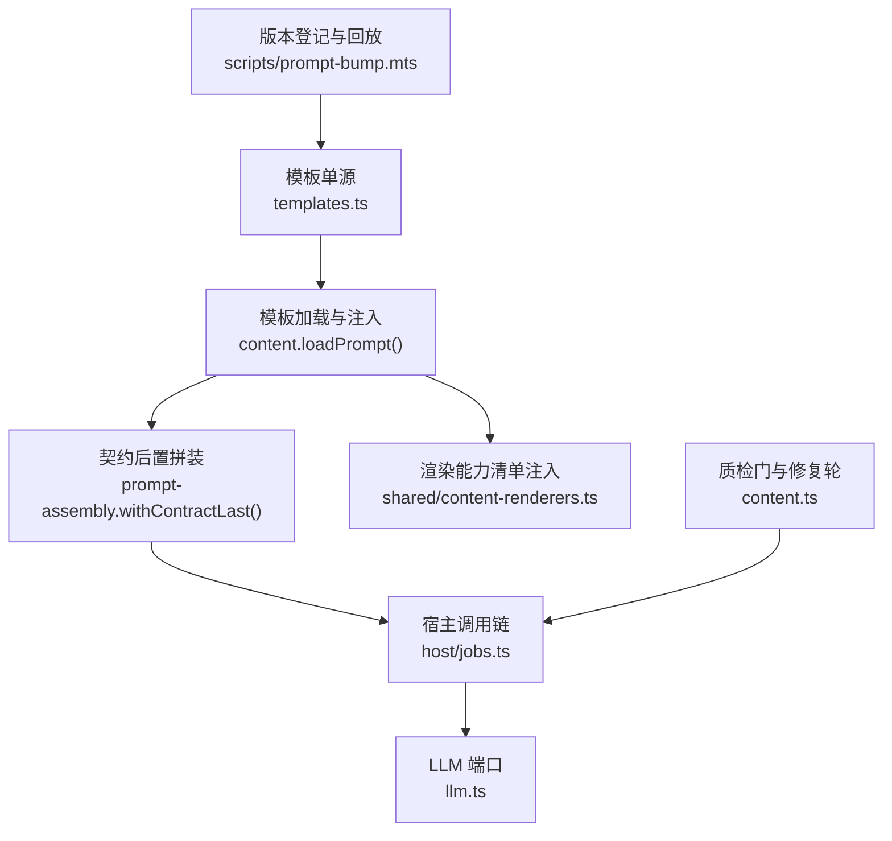
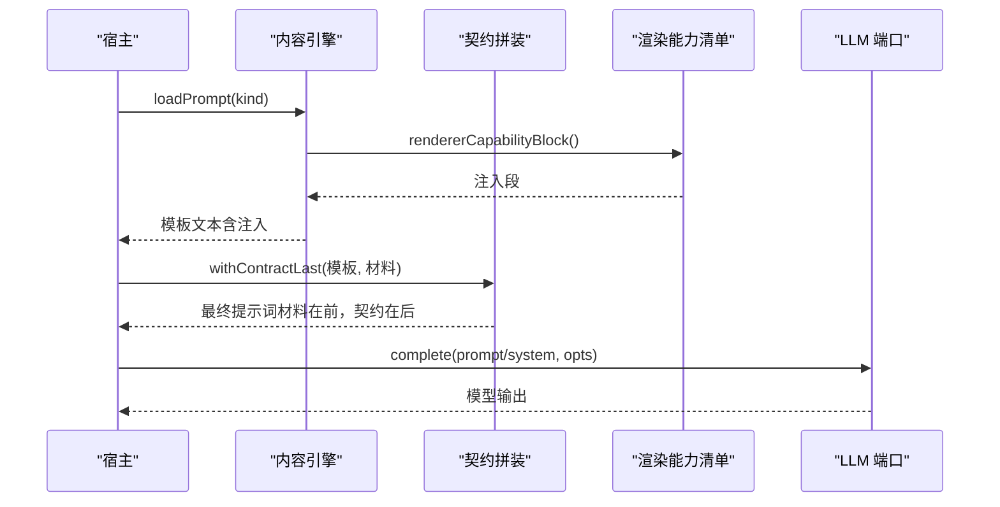
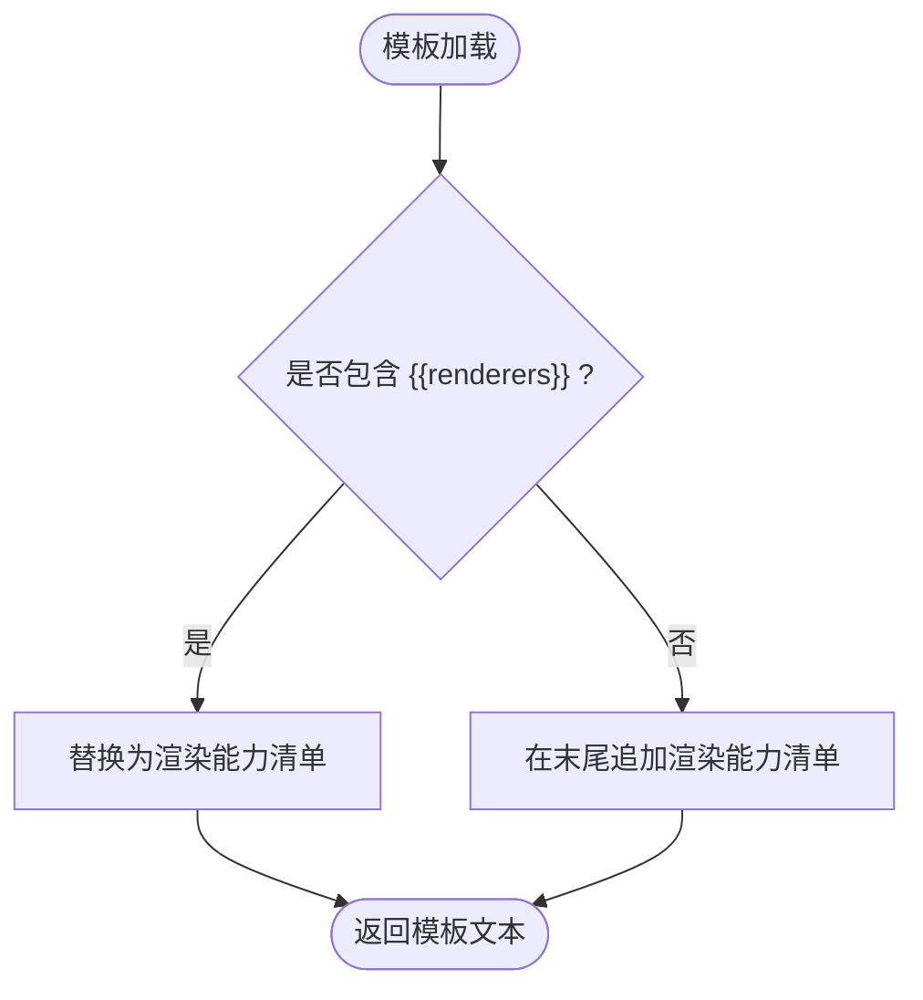
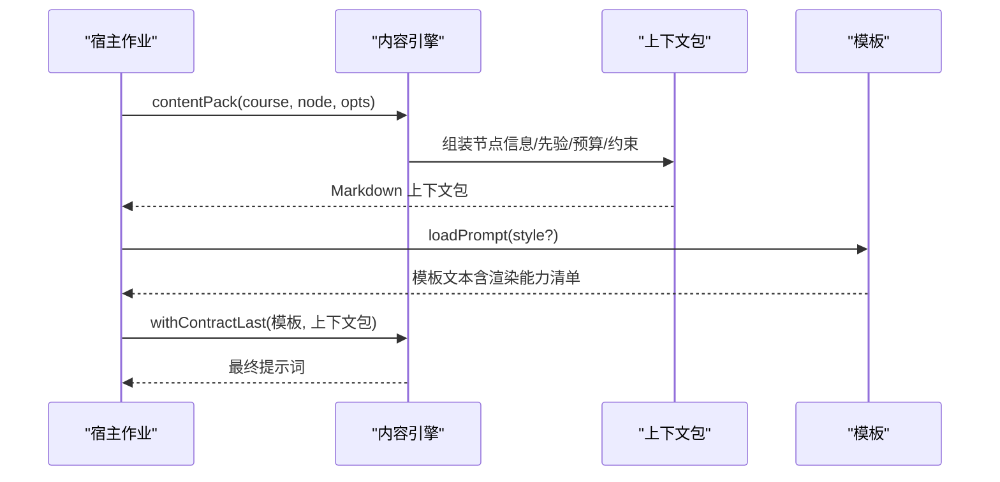
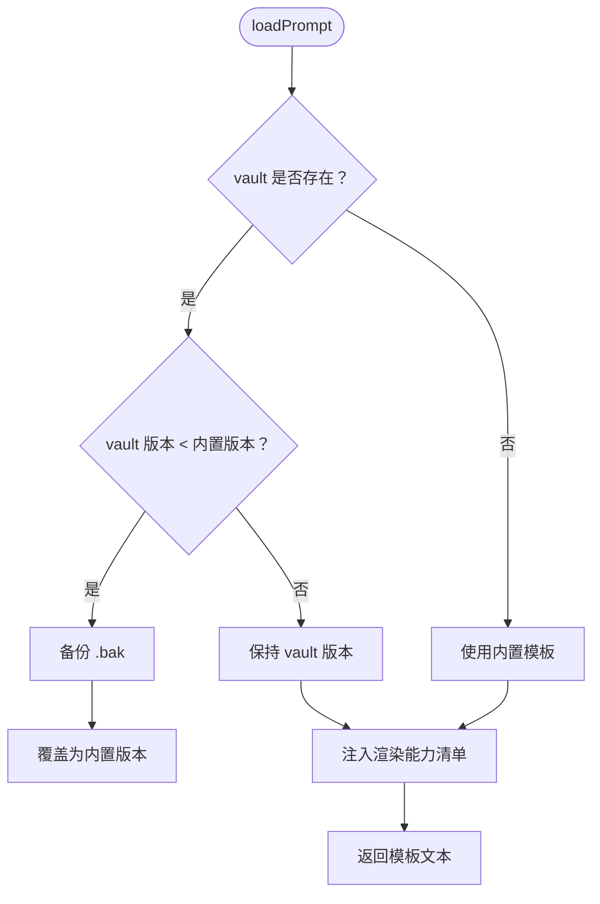
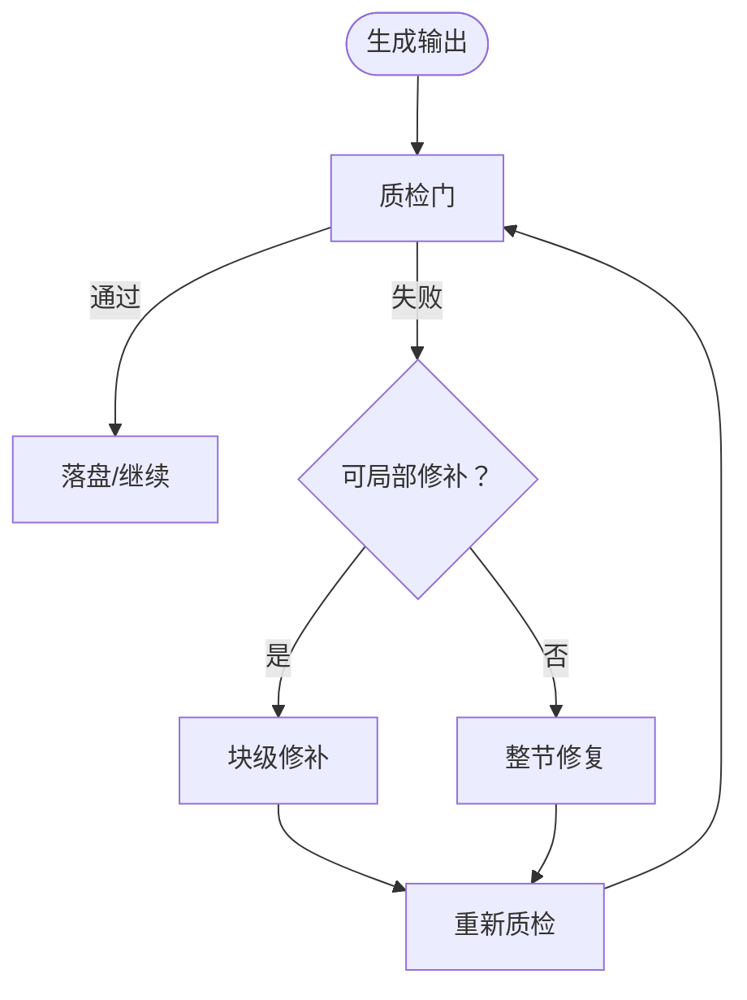
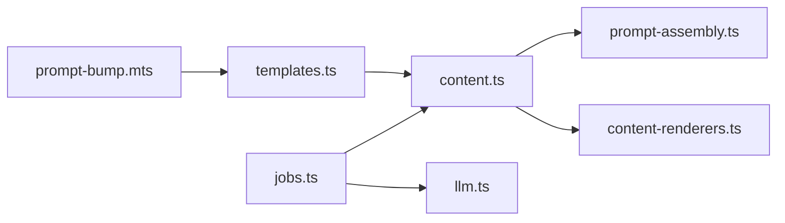

# 提示词模板系统

<cite>
**本文引用的文件**
- [src/engine/prompts/templates.ts](file://src/engine/prompts/templates.ts)
- [src/engine/prompts/host.ts](file://src/engine/prompts/host.ts)
- [src/engine/content.ts](file://src/engine/content.ts)
- [src/engine/prompt-assembly.ts](file://src/engine/prompt-assembly.ts)
- [shared/content-renderers.ts](file://shared/content-renderers.ts)
- [scripts/prompt-bump.mts](file://scripts/prompt-bump.mts)
- [src/engine/llm.ts](file://src/engine/llm.ts)
- [src/host/jobs.ts](file://src/host/jobs.ts)
- [tests/output-contract.test.ts](file://tests/output-contract.test.ts)
- [tests/host-runtime.test.ts](file://tests/host-runtime.test.ts)
</cite>

## 目录
1. [简介](#简介)
2. [项目结构](#项目结构)
3. [核心组件](#核心组件)
4. [架构总览](#架构总览)
5. [详细组件分析](#详细组件分析)
6. [依赖关系分析](#依赖关系分析)
7. [性能考量](#性能考量)
8. [故障排查指南](#故障排查指南)
9. [结论](#结论)
10. [附录](#附录)

## 简介
本文件系统化说明 LearnHub 的提示词模板系统，覆盖模板渲染引擎（变量替换、条件逻辑与循环结构）、上下文注入机制（动态参数绑定、环境变量访问、运行时数据注入）、模板版本管理（向后兼容、迁移策略、废弃标记）、模板调试工具（语法检查、输出预览、性能分析），并提供创建与管理提示词模板的实践路径。

## 项目结构
提示词模板系统围绕“单源模板 + 装配器 + 质检门 + 版本登记”展开：
- 模板单源：集中定义各生成站的提示词文本与版本标记。
- 装配器：负责将“材料 + 契约段”按规则拼接，确保“只输出 X”指令位于末尾。
- 上下文注入：在加载模板时注入渲染能力清单；在生成管线中组装上下文包。
- 版本管理：通过模板头注释标记版本，配合登记脚本进行变更门禁与回放回归。
- 调试与质检：内置多项静态/结构校验，结合语料回放与评审对照保障质量。

图表来源
- [src/engine/prompts/templates.ts:17-602](file://src/engine/prompts/templates.ts#L17-L602)
- [src/engine/content.ts:334-352](file://src/engine/content.ts#L334-L352)
- [src/engine/prompt-assembly.ts:14-29](file://src/engine/prompt-assembly.ts#L14-L29)
- [shared/content-renderers.ts:97-108](file://shared/content-renderers.ts#L97-L108)
- [scripts/prompt-bump.mts:51-62](file://scripts/prompt-bump.mts#L51-L62)
- [src/host/jobs.ts:814-836](file://src/host/jobs.ts#L814-L836)
- [src/engine/llm.ts:25-45](file://src/engine/llm.ts#L25-L45)

章节来源
- [src/engine/prompts/templates.ts:17-602](file://src/engine/prompts/templates.ts#L17-L602)
- [src/engine/content.ts:334-352](file://src/engine/content.ts#L334-L352)
- [src/engine/prompt-assembly.ts:14-29](file://src/engine/prompt-assembly.ts#L14-L29)
- [shared/content-renderers.ts:97-108](file://shared/content-renderers.ts#L97-L108)
- [scripts/prompt-bump.mts:51-62](file://scripts/prompt-bump.mts#L51-L62)
- [src/host/jobs.ts:814-836](file://src/host/jobs.ts#L814-L836)
- [src/engine/llm.ts:25-45](file://src/engine/llm.ts#L25-L45)

## 核心组件
- 模板单源与键集：所有生成站模板集中在单一常量对象中，键即站点名，值即模板文本。每条模板首行带有版本标记，用于版本管理与升级策略。
- 模板加载与注入：加载时读取 vault 快照或内置模板，若存在占位符则注入渲染能力清单；缺失占位符时自动追加，保证兼容性。
- 契约后置拼装：将模板拆分为“角色/立场/约束”与“输出契约段”，并将“材料”置于契约段之前，确保模型最后读到“只输出 X”。
- 上下文包：为每个节点生成结构化 Markdown 上下文包，包含目标节点、前置摘要、后继预告、领域边界、禁止概念、规范约束、复杂度档案等。
- 质检门与修复轮：对正文进行超纲引用、别名一致性、可视化块合法性、节形状、预测门结构等多维校验，并支持局部块级修补与整节修复。
- 版本登记与回放：通过脚本扫描提交历史中的模板版本变化，要求同提交登记预期输出增量；提供离线回放与评审对照，保障模板变更不破坏既有产出契约。

章节来源
- [src/engine/prompts/templates.ts:17-602](file://src/engine/prompts/templates.ts#L17-L602)
- [src/engine/content.ts:334-352](file://src/engine/content.ts#L334-L352)
- [src/engine/prompt-assembly.ts:14-29](file://src/engine/prompt-assembly.ts#L14-L29)
- [src/engine/content.ts:148-277](file://src/engine/content.ts#L148-L277)
- [src/engine/content.ts:412-587](file://src/engine/content.ts#L412-L587)
- [scripts/prompt-bump.mts:51-62](file://scripts/prompt-bump.mts#L51-L62)

## 架构总览
下图展示从模板到最终 LLM 调用的完整链路，包括变量注入、契约拼装与质检门。

图表来源
- [src/engine/content.ts:334-352](file://src/engine/content.ts#L334-L352)
- [shared/content-renderers.ts:97-108](file://shared/content-renderers.ts#L97-L108)
- [src/engine/prompt-assembly.ts:14-29](file://src/engine/prompt-assembly.ts#L14-L29)
- [src/engine/llm.ts:25-45](file://src/engine/llm.ts#L25-L45)

## 详细组件分析

### 模板渲染引擎
- 变量替换：模板使用 `{{renderers}}` 作为占位符，由加载流程替换为渲染能力清单；其他模板文本不含 `${}` 插值，避免误判缺失变量。
- 条件逻辑：模板内以自然语言描述条件分支（如“若附有某段则…否则…”），由模型遵循；系统侧通过上下文包注入相关段落实现条件控制。
- 循环结构：模板不直接表达循环；循环由生成管线在多次调用中实现（例如逐节生成、批量出题）。

图表来源
- [src/engine/content.ts:334-352](file://src/engine/content.ts#L334-L352)
- [shared/content-renderers.ts:97-108](file://shared/content-renderers.ts#L97-L108)

章节来源
- [src/engine/prompts/templates.ts:17-602](file://src/engine/prompts/templates.ts#L17-L602)
- [src/engine/content.ts:334-352](file://src/engine/content.ts#L334-L352)
- [shared/content-renderers.ts:97-108](file://shared/content-renderers.ts#L97-L108)

### 上下文注入机制
- 动态参数绑定：通过 `contextPack` 生成上下文包，包含目标节点、前置摘要、后继预告、领域边界、禁止概念、规范约束、复杂度档案、误解先验、前置档位等。
- 环境变量访问：模板本身不直接读取环境变量；环境差异通过宿主层注入上下文包或配置项体现。
- 运行时数据注入：在生成阶段，宿主将任务元数据（如难度档、风格变体）与上下文包一起传入，驱动模板行为。

图表来源
- [src/engine/content.ts:148-277](file://src/engine/content.ts#L148-L277)
- [src/engine/content.ts:334-352](file://src/engine/content.ts#L334-L352)
- [src/host/jobs.ts:814-836](file://src/host/jobs.ts#L814-L836)

章节来源
- [src/engine/content.ts:148-277](file://src/engine/content.ts#L148-L277)
- [src/host/jobs.ts:814-836](file://src/host/jobs.ts#L814-L836)

### 模板版本管理
- 向后兼容：vault 快照缺少版本标记或版本低于内置模板时，自动覆盖升级并保留 `.bak` 备份；旧模板缺 `{{renderers}}` 时自动追加，不改用户文件。
- 迁移策略：通过登记脚本扫描提交历史，要求新版本必须伴随登记条目（version/date/changeType/expectedDelta），并提供回放与评审对照。
- 废弃标记：退役模板不再被读取（如整课版“课程生成*”），可在文档与测试中清理遗留引用。

图表来源
- [src/engine/content.ts:334-352](file://src/engine/content.ts#L334-L352)
- [scripts/prompt-bump.mts:51-62](file://scripts/prompt-bump.mts#L51-L62)

章节来源
- [src/engine/content.ts:334-352](file://src/engine/content.ts#L334-L352)
- [scripts/prompt-bump.mts:51-62](file://scripts/prompt-bump.mts#L51-L62)

### 模板调试工具
- 语法检查：质检门对可视化块（plot/chart/svg）、预测门块、代码块语言等进行结构校验，失败时给出定位与修复建议。
- 输出预览：通过语料回放与评审对照，验证模板变更不会破坏解析契约与质量均值。
- 性能分析：LLM 端口记录 token 用量与思考档，便于评估不同站点的成本与深度。

图表来源
- [src/engine/content.ts:412-587](file://src/engine/content.ts#L412-L587)
- [src/engine/content.ts:642-736](file://src/engine/content.ts#L642-L736)
- [src/engine/llm.ts:17-23](file://src/engine/llm.ts#L17-L23)

章节来源
- [src/engine/content.ts:412-587](file://src/engine/content.ts#L412-L587)
- [src/engine/content.ts:642-736](file://src/engine/content.ts#L642-L736)
- [src/engine/llm.ts:17-23](file://src/engine/llm.ts#L17-L23)

### 实践示例：创建与管理提示词模板
- 模板编写：在模板单源中添加新键值对，首行添加版本标记，明确“只输出 X”的契约段。
- 变量定义：如需注入渲染能力清单，保留 `{{renderers}}`；其他变量通过上下文包注入。
- 渲染调用：宿主在生成作业中调用 `loadPrompt` 与 `withContractLast`，将材料与契约段正确拼装后送入 LLM。

章节来源
- [src/engine/prompts/templates.ts:17-602](file://src/engine/prompts/templates.ts#L17-L602)
- [src/engine/content.ts:334-352](file://src/engine/content.ts#L334-L352)
- [src/host/jobs.ts:814-836](file://src/host/jobs.ts#L814-L836)

## 依赖关系分析
- 模块耦合：模板单源与内容引擎强耦合（键集一致），装配器零依赖且可被多处复用；渲染能力清单共享于 UI 与引擎。
- 外部依赖：LLM 端口抽象了宿主适配，使引擎可测且不依赖具体模型实现。
- 潜在环：装配器与内容引擎之间通过函数解耦，避免循环导入；模板单源仅暴露常量。

图表来源
- [src/engine/prompts/templates.ts:17-602](file://src/engine/prompts/templates.ts#L17-L602)
- [src/engine/content.ts:334-352](file://src/engine/content.ts#L334-L352)
- [src/engine/prompt-assembly.ts:14-29](file://src/engine/prompt-assembly.ts#L14-L29)
- [shared/content-renderers.ts:97-108](file://shared/content-renderers.ts#L97-L108)
- [src/host/jobs.ts:814-836](file://src/host/jobs.ts#L814-L836)
- [src/engine/llm.ts:25-45](file://src/engine/llm.ts#L25-L45)
- [scripts/prompt-bump.mts:51-62](file://scripts/prompt-bump.mts#L51-L62)

章节来源
- [src/engine/prompts/templates.ts:17-602](file://src/engine/prompts/templates.ts#L17-L602)
- [src/engine/content.ts:334-352](file://src/engine/content.ts#L334-L352)
- [src/engine/prompt-assembly.ts:14-29](file://src/engine/prompt-assembly.ts#L14-L29)
- [shared/content-renderers.ts:97-108](file://shared/content-renderers.ts#L97-L108)
- [src/host/jobs.ts:814-836](file://src/host/jobs.ts#L814-L836)
- [src/engine/llm.ts:25-45](file://src/engine/llm.ts#L25-L45)
- [scripts/prompt-bump.mts:51-62](file://scripts/prompt-bump.mts#L51-L62)

## 性能考量
- 模板加载开销：仅一次读取与字符串替换，成本极低。
- 上下文包大小：按节点复杂度与预算裁剪，避免过长导致模型响应延迟。
- LLM 调用成本：通过语义思考档与 token 计量优化调用策略，减少不必要的高成本调用。

[本节提供通用指导，无需特定文件分析]

## 故障排查指南
- 未知提示词类型：加载时报错并列出内置类型，需在 vault 自建同名文件或修正键名。
- 契约段位置错误：测试会断言“只输出 X”必须位于末段，否则需调整模板结构。
- 解析回归：语料回放发现基线通过但回放失败，需检查模板变更是否破坏解析契约。
- 队列执行异常：生成任务排队与泵机制可通过测试复现与断言。

章节来源
- [src/engine/content.ts:334-352](file://src/engine/content.ts#L334-L352)
- [tests/output-contract.test.ts:359-370](file://tests/output-contract.test.ts#L359-L370)
- [scripts/prompt-bump.mts:187-239](file://scripts/prompt-bump.mts#L187-L239)
- [tests/host-runtime.test.ts:237-262](file://tests/host-runtime.test.ts#L237-L262)

## 结论
LearnHub 的提示词模板系统以“单源模板 + 契约后置 + 上下文注入 + 版本登记”为核心，实现了高可控、可回滚、可观测的生成流水线。通过严格的质检门与回放机制，模板变更既能快速迭代又不至于破坏既有契约。未来可进一步扩展渲染能力清单与上下文包字段，以满足更丰富的教学场景。

[本节总结性内容，无需特定文件分析]

## 附录
- 关键术语
  - 模板键：生成站名称，对应一条模板文本。
  - 契约段：模板末段的“只输出 X”指令区域。
  - 上下文包：为节点生成的结构化 Markdown 材料。
  - 质检门：对输出进行结构与格式校验的规则集合。
  - 回放：用历史语料重跑解析面，检测回归。

[本节为概念说明，无需特定文件分析]