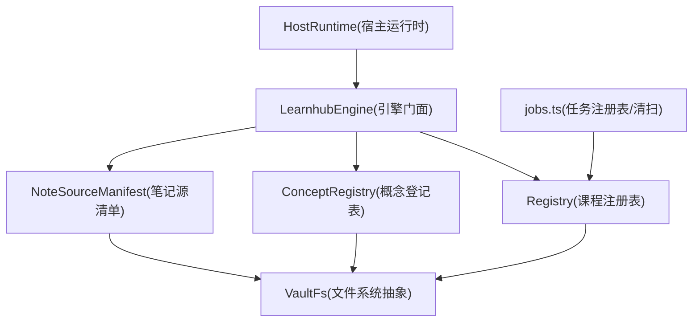
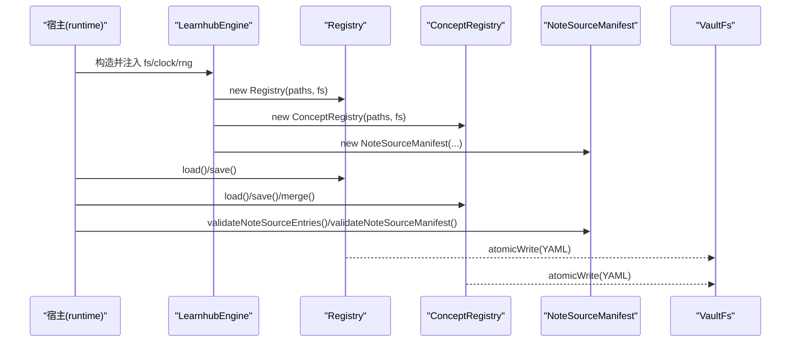
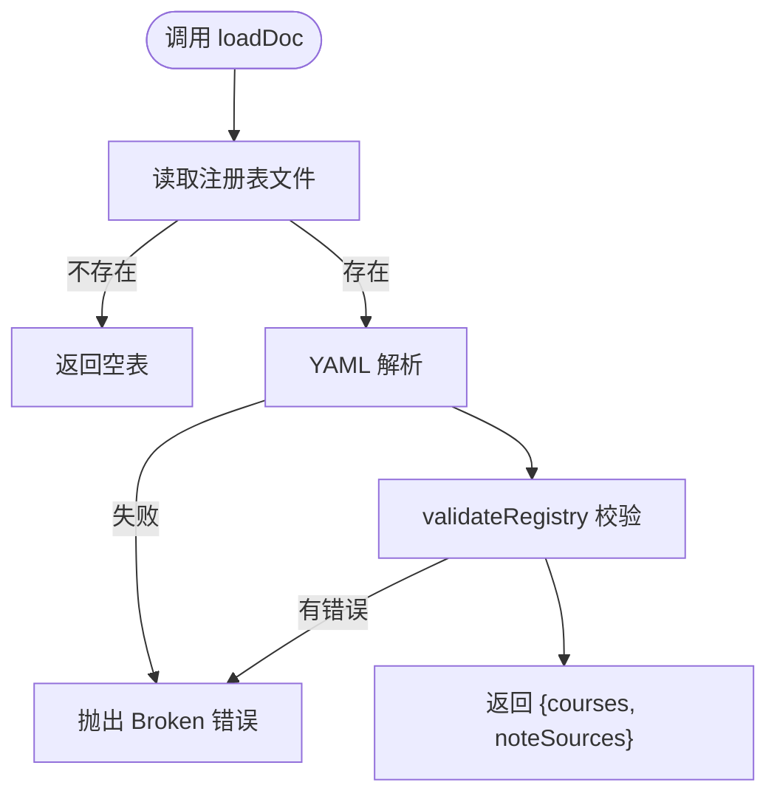
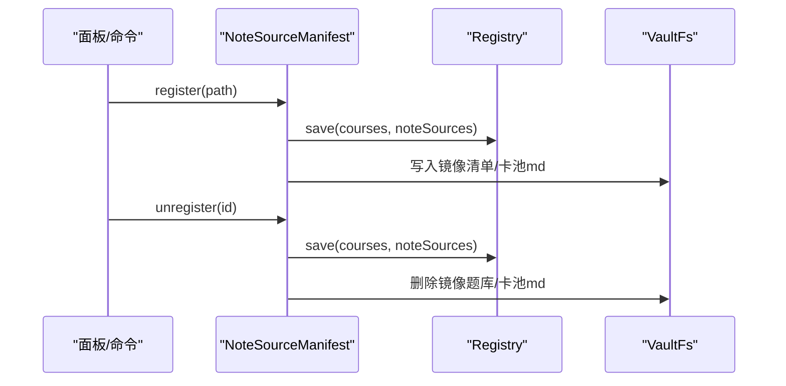
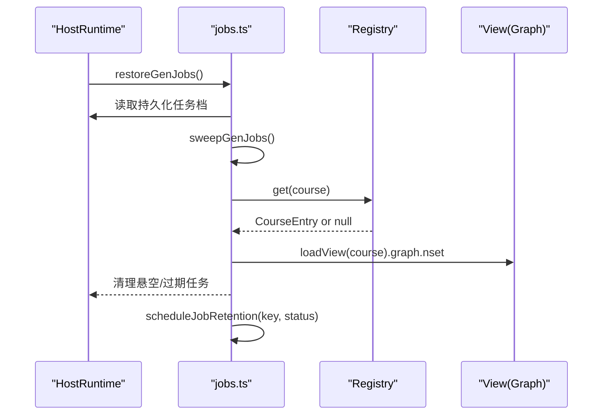
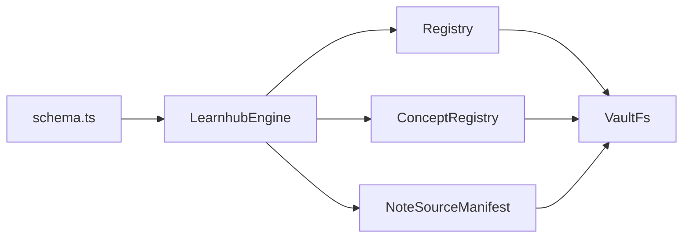

# 注册表机制

<cite>
**本文引用的文件**
- [src/engine/registry.ts](file://src/engine/registry.ts)
- [src/engine/types.ts](file://src/engine/types.ts)
- [src/engine/concepts.ts](file://src/engine/concepts.ts)
- [src/engine/note-source.ts](file://src/engine/note-source.ts)
- [src/engine/index.ts](file://src/engine/index.ts)
- [src/host/jobs.ts](file://src/host/jobs.ts)
- [src/host/runtime.ts](file://src/host/runtime.ts)
- [src/engine/schema.ts](file://src/engine/schema.ts)
- [src/engine/data-check.ts](file://src/engine/data-check.ts)
- [tests/concept-registry.test.ts](file://tests/concept-registry.test.ts)
- [tests/host-runtime.test.ts](file://tests/host-runtime.test.ts)
- [docs/adr/0010-c1-note-source-mirror-readonly.md](file://docs/adr/0010-c1-note-source-mirror-readonly.md)
</cite>

## 目录
1. [简介](#简介)
2. [项目结构](#项目结构)
3. [核心组件](#核心组件)
4. [架构总览](#架构总览)
5. [详细组件分析](#详细组件分析)
6. [依赖关系分析](#依赖关系分析)
7. [性能考量](#性能考量)
8. [故障排查指南](#故障排查指南)
9. [结论](#结论)
10. [附录：使用示例与最佳实践](#附录使用示例与最佳实践)

## 简介
本文件系统性阐述 LearnHub 的“注册表机制”，围绕课程注册表、概念登记表与笔记源注册身份三大支柱，解释服务发现（按名称/标识精确查找）、依赖管理（概念引用与题目 invokes 校验）与版本控制（schema 硬门与断裂迁移）。文档覆盖注册表的核心操作（读、写、更新、注销）、依赖解析算法（循环依赖检测、版本兼容性与冲突解决策略）、服务生命周期（初始化、启动、停止、资源清理），并提供可操作的代码级路径指引，帮助读者在工程中正确使用注册表进行服务管理。

## 项目结构
LearnHub 将“注册表”能力拆分为三个层次：
- 课程注册表：中心级清单，维护课程条目与可选的笔记源登记域。
- 概念登记表：每课程一份受控词表，提供概念别名、定义与易混对，支撑概念引用解析与冲突检测。
- 笔记源注册身份：课程注册表的 note_sources 域 + 镜像区源清单，用于个人笔记复习源的只读注册与漂移检测。



图表来源
- [src/engine/index.ts:149-188](file://src/engine/index.ts#L149-L188)
- [src/engine/registry.ts:77-153](file://src/engine/registry.ts#L77-L153)
- [src/engine/concepts.ts:284-335](file://src/engine/concepts.ts#L284-L335)
- [src/engine/note-source.ts:1-63](file://src/engine/note-source.ts#L1-L63)
- [src/host/jobs.ts:394-417](file://src/host/jobs.ts#L394-L417)

章节来源
- [src/engine/index.ts:149-188](file://src/engine/index.ts#L149-L188)
- [src/engine/registry.ts:77-153](file://src/engine/registry.ts#L77-L153)
- [src/engine/concepts.ts:284-335](file://src/engine/concepts.ts#L284-L335)
- [src/engine/note-source.ts:1-63](file://src/engine/note-source.ts#L1-L63)
- [src/host/jobs.ts:394-417](file://src/host/jobs.ts#L394-L417)

## 核心组件
- 课程注册表 Registry
  - 职责：加载/保存课程清单与笔记源域；按 name/id 精确查找；筛选启用中的课程；CLI 语义化解析。
  - 契约：courses 列表必填；name/root 非空且唯一；id 可选但唯一；enabled/tags 类型约束严格；note_sources 域遵循独立校验。
  - 关键方法：load/loadDoc/save/get/enabled/resolve。
- 概念登记表 ConceptRegistry
  - 职责：每课程受控词表；名字联合唯一；别名解析；合并（from→into）；冲突检测。
  - 关键函数：validateConceptRegistry/mergeConceptEntries/resolveConcept/namesOf/mintConflicts。
- 笔记源 NoteSourceManifest
  - 职责：注册表 note_sources 域校验；镜像区源清单校验；指纹漂移检测；状态分类与提示。
  - 关键函数：validateNoteSourceEntries/validateNoteSourceManifest/classifySource/sourceHint/fingerprintOf。

章节来源
- [src/engine/registry.ts:21-153](file://src/engine/registry.ts#L21-L153)
- [src/engine/concepts.ts:114-200](file://src/engine/concepts.ts#L114-L200)
- [src/engine/concepts.ts:284-335](file://src/engine/concepts.ts#L284-L335)
- [src/engine/note-source.ts:98-167](file://src/engine/note-source.ts#L98-L167)
- [src/engine/types.ts:109-114](file://src/engine/types.ts#L109-L114)

## 架构总览
注册表机制贯穿“数据契约 → 读写封装 → 消费侧校验 → 生命周期管理”全链路：
- 数据契约：YAML/JSON 结构由 validate* 系列函数严格校验，缺失为 Missing（合法空态），损坏为 Broken（fail loud）。
- 读写封装：Registry/ConceptRegistry/NoteSourceManifest 通过 VaultFs 原子写入，避免并发写破坏。
- 消费侧校验：概念引用、题目 invokes、笔记源指纹等均在消费点做精确匹配与漂移检测。
- 生命周期：引擎门面装配各注册表；宿主 runtime 组织队列与恢复；任务注册表清扫联动课程/节点存在性。



图表来源
- [src/engine/index.ts:149-188](file://src/engine/index.ts#L149-L188)
- [src/engine/registry.ts:77-153](file://src/engine/registry.ts#L77-L153)
- [src/engine/concepts.ts:284-335](file://src/engine/concepts.ts#L284-L335)
- [src/engine/note-source.ts:98-167](file://src/engine/note-source.ts#L98-L167)

## 详细组件分析

### 课程注册表 Registry
- 设计要点
  - 读取：loadDoc 先读文件，再 YAML 解析，再 validateRegistry；缺失返回空表，损坏抛错。
  - 写入：save 全量落盘，noteSources 省略时保留现值，避免写方越界覆盖。
  - 查询：get 按 name/id 精确匹配；enabled 过滤启用中；resolve 实现 CLI 选择语义（显式指定或唯一启用课程）。
- 数据流
  - 读：fs.readFile → YAML.parse → validateRegistry → {courses, noteSources}
  - 写：atomicWrite → 持久化 courses 与可选 note_sources
- 错误处理
  - ENOENT → 空表
  - YAML 解析失败 → Broken
  - 契约校验失败 → 列出所有错误行



图表来源
- [src/engine/registry.ts:81-102](file://src/engine/registry.ts#L81-L102)
- [src/engine/registry.ts:117-122](file://src/engine/registry.ts#L117-L122)
- [src/engine/registry.ts:124-152](file://src/engine/registry.ts#L124-L152)

章节来源
- [src/engine/registry.ts:21-153](file://src/engine/registry.ts#L21-L153)

### 概念登记表 ConceptRegistry
- 设计要点
  - 名字联合唯一：canonical ∪ aliases 全局唯一；重复即 Broken。
  - 解析：resolveConcept 精确匹配 canonical 或别名，永不模糊。
  - 合并：merge(from→into)，旧地址经别名续解析，保证历史引用存活。
  - 冲突检测：mintConflicts 在提案阶段拦截与既有登记的冲突。
- 依赖管理
  - 概念引用校验：conceptReferenceErrors 指出未在册引用。
  - 题目 invokes 校验：invokesUnregistered 确保题目标注的概念已登记。

```mermaid
classDiagram
class ConceptRegistry {
+load(root) Promise~ConceptEntry[]~
+save(root, entries) Promise~void~
+merge(root, from, into) Promise~{into, names}~
}
class Concepts {
+validateConceptRegistry(raw)
+resolveConcept(entries, name)
+namesOf(entries) Set~string~
+mintConflicts(mints, existing) string[]
+conceptReferenceErrors(refs, known) string[]
+invokesUnregistered(q, known) string?
}
ConceptRegistry --> Concepts : "调用校验/解析/合并"
```

图表来源
- [src/engine/concepts.ts:114-200](file://src/engine/concepts.ts#L114-L200)
- [src/engine/concepts.ts:284-335](file://src/engine/concepts.ts#L284-L335)

章节来源
- [src/engine/concepts.ts:114-200](file://src/engine/concepts.ts#L114-L200)
- [src/engine/concepts.ts:284-335](file://src/engine/concepts.ts#L284-L335)
- [tests/concept-registry.test.ts:125-151](file://tests/concept-registry.test.ts#L125-L151)

### 笔记源注册身份 NoteSourceManifest
- 设计要点
  - 只读镜像：对用户笔记零写入；派生物落学习中心镜像区。
  - 漂移检测：fingerprintOf 计算正文指纹；classifySource 判定 ok/missing/drifted/inconsistent。
  - 注册表域：validateNoteSourceEntries 校验 id/path/created 等字段；validateNoteSourceManifest 校验镜像清单。
- 生命周期
  - 注册：写入课程注册表 note_sources 域；生成镜像清单与卡池 md。
  - 重连：路径变更时更新 path，保持卡池与调度。
  - 解除注册：移除注册表项与镜像题库、卡池 md，用户笔记不受影响。



图表来源
- [src/engine/note-source.ts:98-167](file://src/engine/note-source.ts#L98-L167)
- [src/engine/registry.ts:117-122](file://src/engine/registry.ts#L117-L122)
- [docs/adr/0010-c1-note-source-mirror-readonly.md:1-8](file://docs/adr/0010-c1-note-source-mirror-readonly.md#L1-L8)

章节来源
- [src/engine/note-source.ts:1-63](file://src/engine/note-source.ts#L1-L63)
- [src/engine/note-source.ts:98-167](file://src/engine/note-source.ts#L98-L167)
- [docs/adr/0010-c1-note-source-mirror-readonly.md:1-8](file://docs/adr/0010-c1-note-source-mirror-readonly.md#L1-L8)

### 服务生命周期管理（初始化、启动、停止、资源清理）
- 初始化
  - LearnhubEngine 构造时装配 Registry、ConceptRegistry、NoteSourceManifest 等，统一注入 VaultFs/Clock/Rng。
- 启动
  - 宿主 runtime 创建后，恢复生成任务注册表，执行清扫（sweepGenJobs），补挂保留期定时器。
- 运行
  - 队列泵根据任务状态推进；任务终态进入 scheduleJobRetention 记录 finishedAt 并定时出册。
- 停止/清理
  - 进程退出或任务完成：保留期过后从内存 Map 删除；若任务档 broken，跳过清扫避免写回闸触发。



图表来源
- [src/host/jobs.ts:378-417](file://src/host/jobs.ts#L378-L417)
- [src/host/jobs.ts:1178-1219](file://src/host/jobs.ts#L1178-L1219)
- [src/engine/index.ts:149-188](file://src/engine/index.ts#L149-L188)

章节来源
- [src/host/jobs.ts:378-417](file://src/host/jobs.ts#L378-L417)
- [src/host/jobs.ts:1178-1219](file://src/host/jobs.ts#L1178-L1219)
- [src/engine/index.ts:149-188](file://src/engine/index.ts#L149-L188)

## 依赖关系分析
- 耦合与内聚
  - Registry/ConceptRegistry/NoteSourceManifest 均依赖 VaultFs 与 YAML，内聚于各自领域；通过 LearnhubEngine 聚合，降低宿主直接耦合。
- 外部依赖
  - 文件系统：VaultFs 抽象 node:fs，便于测试替换。
  - 配置与版本：schema.ts 提供 schema.version 硬门，确保库版本一致。
- 循环依赖
  - 通过门面 re-export 与纯类型导出，避免 host↔engine 循环；import-rules 测试保障无环。



图表来源
- [src/engine/index.ts:149-188](file://src/engine/index.ts#L149-L188)
- [src/engine/schema.ts:60-79](file://src/engine/schema.ts#L60-L79)

章节来源
- [src/engine/index.ts:149-188](file://src/engine/index.ts#L149-L188)
- [src/engine/schema.ts:60-79](file://src/engine/schema.ts#L60-L79)

## 性能考量
- 读取优化
  - 课程注册表读取保序，避免排序开销；enabled 过滤在内存中进行。
  - 概念解析使用 ownerMap 与 Set 去重，时间复杂度 O(n)。
- 写入优化
  - atomicWrite 原子落盘，减少并发写竞争；noteSources 省略时不覆写，降低不必要 IO。
- 扫描与截断
  - 笔记源指纹计算轻量（sha256 前缀）；最大文件数限制防止超大 vault 拖垮入口。
- 任务恢复
  - 保留期定时器 unref，避免阻塞进程退出；恢复侧按剩余时长补挂，避免重复计时。

[本节为通用性能讨论，无需具体文件分析]

## 故障排查指南
- 注册表 Broken
  - 症状：YAML 无法解析或契约校验失败；错误信息包含具体字段与位置。
  - 处理：修正 YAML 结构与字段类型；确保 name/root/id 唯一；enabled/tags 类型正确。
- 概念登记表 Broken
  - 症状：canonical/aliases 重复或缺失；未知字段报错。
  - 处理：合并重复概念；删除未知字段；使用 merge 进行人审合并。
- 笔记源漂移/缺失
  - 症状：sourceHint 提示 missing/drifted/inconsistent。
  - 处理：重新注册/重连路径；归档旧题或重新出题。
- 任务注册表清扫
  - 症状：任务档 broken 导致清扫跳过；恢复后需一键恢复队列。
  - 处理：修复任务档后重启；使用 resumeQueue 恢复排队任务。

章节来源
- [src/engine/registry.ts:81-102](file://src/engine/registry.ts#L81-L102)
- [src/engine/concepts.ts:114-200](file://src/engine/concepts.ts#L114-L200)
- [src/engine/note-source.ts:64-79](file://src/engine/note-source.ts#L64-L79)
- [src/host/jobs.ts:394-417](file://src/host/jobs.ts#L394-L417)
- [tests/host-runtime.test.ts:212-234](file://tests/host-runtime.test.ts#L212-L234)

## 结论
LearnHub 的注册表机制以“契约先行、精确解析、原子落盘、生命周期可控”为核心原则，通过课程注册表、概念登记表与笔记源注册身份三件套，实现了稳定的服务发现、可靠的依赖管理与严格的版本控制。配合宿主 runtime 的任务恢复与清扫，系统在高可用与可观测性方面具备良好基础。建议在生产环境中严格遵循契约校验与最小权限写入，结合测试与回归基线保障稳定性。

[本节为总结，无需具体文件分析]

## 附录：使用示例与最佳实践
- 服务定义（课程）
  - 在课程注册表中添加课程条目，确保 name/root 非空且唯一；可选 id/tags/enabled。
  - 参考路径：[src/engine/registry.ts:21-75](file://src/engine/registry.ts#L21-L75)
- 依赖声明（概念）
  - 在概念登记表中声明 canonical/aliases/definition/confusable；确保名字联合唯一。
  - 参考路径：[src/engine/concepts.ts:19-28](file://src/engine/concepts.ts#L19-L28)
- 运行时查询
  - 使用 Registry.get(name/id) 获取课程；Registry.enabled() 获取启用中课程；Registry.resolve(key?) 实现 CLI 选择。
  - 参考路径：[src/engine/registry.ts:124-152](file://src/engine/registry.ts#L124-L152)
- 笔记源注册/注销
  - 注册：写入 note_sources 域，生成镜像清单与卡池 md；注销：移除注册与镜像。
  - 参考路径：[src/engine/note-source.ts:98-167](file://src/engine/note-source.ts#L98-L167), [src/engine/registry.ts:117-122](file://src/engine/registry.ts#L117-L122)
- 版本控制
  - 通过 schema.version 硬门确保库版本一致；旧库整体迁移至存档。
  - 参考路径：[src/engine/schema.ts:60-79](file://src/engine/schema.ts#L60-L79)

章节来源
- [src/engine/registry.ts:21-152](file://src/engine/registry.ts#L21-L152)
- [src/engine/concepts.ts:19-28](file://src/engine/concepts.ts#L19-L28)
- [src/engine/note-source.ts:98-167](file://src/engine/note-source.ts#L98-L167)
- [src/engine/schema.ts:60-79](file://src/engine/schema.ts#L60-L79)