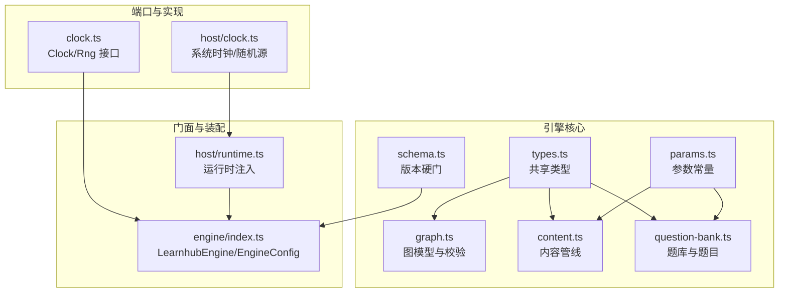
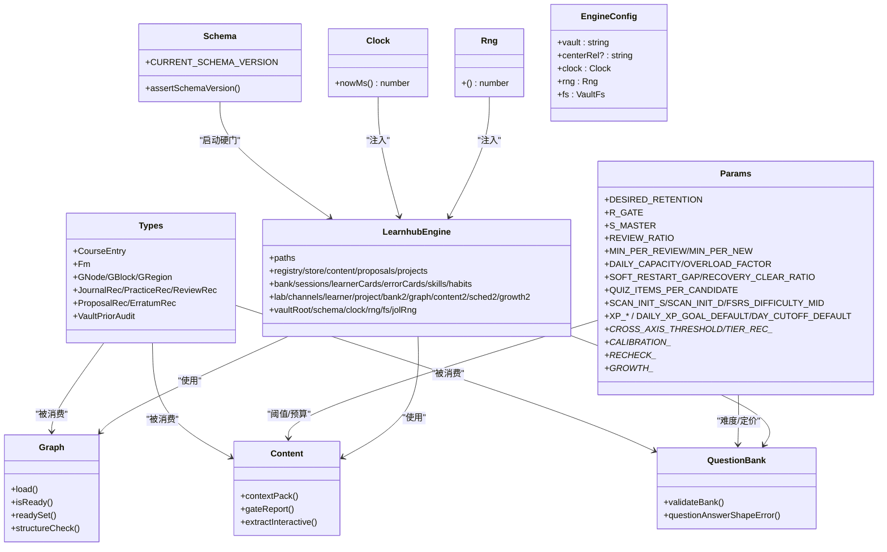
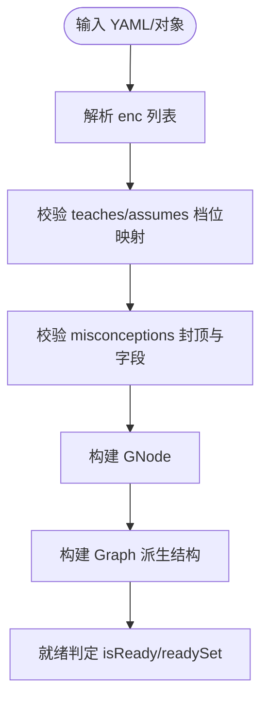
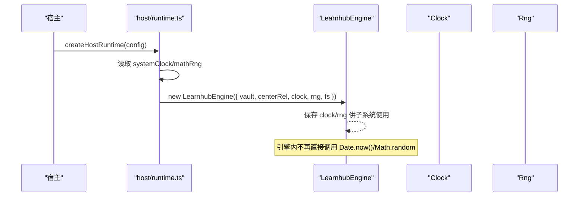
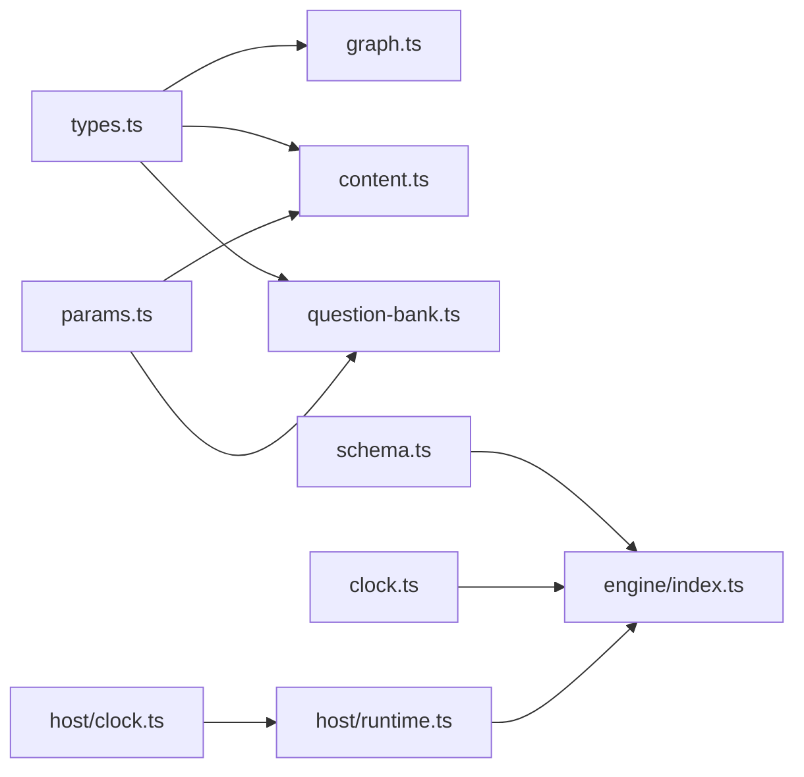

# 类型定义与接口

<cite>
**本文引用的文件**
- [src/engine/types.ts](file://src/engine/types.ts)
- [src/engine/clock.ts](file://src/engine/clock.ts)
- [src/host/clock.ts](file://src/host/clock.ts)
- [src/engine/params.ts](file://src/engine/params.ts)
- [src/engine/graph.ts](file://src/engine/graph.ts)
- [src/engine/content.ts](file://src/engine/content.ts)
- [src/engine/schema.ts](file://src/engine/schema.ts)
- [src/engine/question-bank.ts](file://src/engine/question-bank.ts)
- [src/engine/index.ts](file://src/engine/index.ts)
- [src/host/runtime.ts](file://src/host/runtime.ts)
</cite>

## 目录
1. [简介](#简介)
2. [项目结构](#项目结构)
3. [核心组件](#核心组件)
4. [架构总览](#架构总览)
5. [详细组件分析](#详细组件分析)
6. [依赖关系分析](#依赖关系分析)
7. [性能考量](#性能考量)
8. [故障排查指南](#故障排查指南)
9. [结论](#结论)
10. [附录：类型安全编程示例](#附录类型安全编程示例)

## 简介
本文件聚焦 LearnHub 引擎的类型系统与接口契约，系统性解释核心数据类型（如 CourseEntry、Fm、Graph、Question 等）的设计意图与约束，阐明 Clock 与 Rng 端口抽象如何统一时间获取与随机数来源，并说明 EngineParams（参数常量表）在调度与行为控制中的作用。同时给出类型系统在引擎中的角色：类型安全、接口契约与向后兼容性保障，并提供可操作的类型安全编程实践指引。

## 项目结构
围绕类型与接口的关键位置如下：
- 中立词汇层（共享形状）：types.ts 集中定义跨模块共享的数据模型与枚举常量。
- 端口抽象与实现：clock.ts 定义 Clock/Rng；host/clock.ts 提供系统时钟与 Math.random 适配。
- 图与内容：graph.ts 承载概念图模型与解析校验；content.ts 消费 Fm、Graph 等类型进行内容管线处理。
- 题库与题目：question-bank.ts 定义 BankQuestion 及题库校验规则。
- 配置与参数：params.ts 集中可调参数；schema.ts 管理 schema 版本硬门。
- 门面与装配：engine/index.ts 暴露 EngineConfig、LearnhubEngine 与类型导出；host/runtime.ts 完成运行时注入（systemClock、mathRng）。

图表来源
- [src/engine/types.ts:1-369](file://src/engine/types.ts#L1-L369)
- [src/engine/graph.ts:1-514](file://src/engine/graph.ts#L1-L514)
- [src/engine/content.ts:1-800](file://src/engine/content.ts#L1-L800)
- [src/engine/question-bank.ts:1-200](file://src/engine/question-bank.ts#L1-L200)
- [src/engine/params.ts:1-59](file://src/engine/params.ts#L1-L59)
- [src/engine/schema.ts:1-80](file://src/engine/schema.ts#L1-L80)
- [src/engine/clock.ts:1-20](file://src/engine/clock.ts#L1-L20)
- [src/host/clock.ts:1-13](file://src/host/clock.ts#L1-L13)
- [src/engine/index.ts:133-196](file://src/engine/index.ts#L133-L196)
- [src/host/runtime.ts:138-193](file://src/host/runtime.ts#L138-L193)

章节来源
- [src/engine/types.ts:1-369](file://src/engine/types.ts#L1-L369)
- [src/engine/graph.ts:1-514](file://src/engine/graph.ts#L1-L514)
- [src/engine/content.ts:1-800](file://src/engine/content.ts#L1-L800)
- [src/engine/question-bank.ts:1-200](file://src/engine/question-bank.ts#L1-L200)
- [src/engine/params.ts:1-59](file://src/engine/params.ts#L1-L59)
- [src/engine/schema.ts:1-80](file://src/engine/schema.ts#L1-L80)
- [src/engine/clock.ts:1-20](file://src/engine/clock.ts#L1-L20)
- [src/host/clock.ts:1-13](file://src/host/clock.ts#L1-L13)
- [src/engine/index.ts:133-196](file://src/engine/index.ts#L133-L196)
- [src/host/runtime.ts:138-193](file://src/host/runtime.ts#L138-L193)

## 核心组件
- 共享类型（types.ts）：定义课程注册项、笔记 frontmatter、图节点/块/区、练习/复习/日志流水、提案、误解、实验、检索审计等核心数据结构与枚举。
- 图模型（graph.ts）：对 data/*.yaml 的强校验与派生结构（邻接表、拓扑序、可达集、连通分量、就绪判定），保证图结构的正确性与一致性。
- 内容管线（content.ts）：基于 Graph/Fm 生成上下文包、质检门禁、修复轮与交互件提取，确保正文质量与规范一致。
- 题库与题目（question-bank.ts）：定义 BankQuestion 与题库文档结构，提供严格的写入侧答案形态门禁与 schema 校验。
- 参数常量（params.ts）：FSRS 期望保留率、难度中性值、XP 定价、复诊阈值、三率闸门等唯一出处，驱动调度与策略。
- 版本硬门（schema.ts）：启动时强制当前 schema 主版本，旧库拒绝加载并指引迁移脚本，保障向后兼容断裂语义。
- 端口抽象（clock.ts）：Clock/Rng 将“读当前时间”和“随机数”从引擎内剥离到适配器，便于测试与替换。
- 门面与装配（index.ts、runtime.ts）：LearnhubEngine 暴露子系统能力；EngineConfig 要求注入 clock/rng/fs；host/runtime 注入 systemClock/mathRng。

章节来源
- [src/engine/types.ts:1-369](file://src/engine/types.ts#L1-L369)
- [src/engine/graph.ts:1-514](file://src/engine/graph.ts#L1-L514)
- [src/engine/content.ts:1-800](file://src/engine/content.ts#L1-L800)
- [src/engine/question-bank.ts:1-200](file://src/engine/question-bank.ts#L1-L200)
- [src/engine/params.ts:1-59](file://src/engine/params.ts#L1-L59)
- [src/engine/schema.ts:1-80](file://src/engine/schema.ts#L1-L80)
- [src/engine/clock.ts:1-20](file://src/engine/clock.ts#L1-L20)
- [src/engine/index.ts:133-196](file://src/engine/index.ts#L133-L196)
- [src/host/runtime.ts:138-193](file://src/host/runtime.ts#L138-L193)

## 架构总览
下图展示类型与接口在引擎中的协作关系：types 作为中立词汇层被 graph/content/question-bank 等消费；params 为策略与阈值提供单一事实源；schema 在启动时执行版本硬门；clock/rng 通过 host 适配注入 engine；engine/index 聚合子系统对外暴露；host/runtime 负责装配。

图表来源
- [src/engine/types.ts:1-369](file://src/engine/types.ts#L1-L369)
- [src/engine/graph.ts:1-514](file://src/engine/graph.ts#L1-L514)
- [src/engine/content.ts:1-800](file://src/engine/content.ts#L1-L800)
- [src/engine/question-bank.ts:1-200](file://src/engine/question-bank.ts#L1-L200)
- [src/engine/params.ts:1-59](file://src/engine/params.ts#L1-L59)
- [src/engine/schema.ts:1-80](file://src/engine/schema.ts#L1-L80)
- [src/engine/clock.ts:1-20](file://src/engine/clock.ts#L1-L20)
- [src/engine/index.ts:133-196](file://src/engine/index.ts#L133-L196)

## 详细组件分析

### 核心实体：Fm、CourseEntry、GNode/GBlock/GRegion、Question
- Fm（课程笔记 frontmatter）
  - 字段包含 node、stage、fsrs、practice、content（version/status/sections/tier）等，是调度状态的事实源之一。
  - mastery 键退役，掌握度由 srs.masteryOfFm 纯派生，不落盘，避免双写不一致。
  - practice_ema 用于练习证据 EMA，参与掌握度口径 B 计算。
- CourseEntry（课程注册条目）
  - id/name/root/enabled/tags，用于课程发现与启用开关。
- GNode/GBlock/GRegion（概念图）
  - GNode 含 name/pre/opt/note/enc/est/type/bloom/difficulty/teaches/assumes/misconceptions。
  - parseNode/parseEnc/parseConceptFields 提供严格校验与警告收集。
  - Graph 构造派生邻接表、拓扑序、深度、可达集、传递约简边、连通分量与就绪判定。
- Question（题库）
  - BankQuestion 定义 id/kind/q/answer/options/explanation/difficulty/uses/tags/tol/section/invokes/fsrs/stats 等。
  - validateBank 对题型与答案形态做严格校验；multi_choice 至少两个正确项。

图表来源
- [src/engine/graph.ts:35-173](file://src/engine/graph.ts#L35-L173)
- [src/engine/graph.ts:175-196](file://src/engine/graph.ts#L175-L196)
- [src/engine/graph.ts:278-443](file://src/engine/graph.ts#L278-L443)

章节来源
- [src/engine/types.ts:40-114](file://src/engine/types.ts#L40-L114)
- [src/engine/graph.ts:35-173](file://src/engine/graph.ts#L35-L173)
- [src/engine/graph.ts:175-196](file://src/engine/graph.ts#L175-L196)
- [src/engine/graph.ts:278-443](file://src/engine/graph.ts#L278-L443)
- [src/engine/question-bank.ts:82-111](file://src/engine/question-bank.ts#L82-L111)
- [src/engine/question-bank.ts:139-200](file://src/engine/question-bank.ts#L139-L200)

### 端口抽象：Clock 与 Rng
- Clock 仅暴露 nowMs() 返回 Unix 毫秒时间戳；日历语义归 dates.ts 纯函数。
- Rng 为 () => number，[0,1) 均匀分布，便于测试注入定长随机流。
- 宿主实现：systemClock 调用 Date.now()；mathRng 即 Math.random。
- 引擎通过 EngineConfig 注入，避免引擎内部直读系统时钟或随机源。

图表来源
- [src/engine/clock.ts:11-19](file://src/engine/clock.ts#L11-L19)
- [src/host/clock.ts:8-12](file://src/host/clock.ts#L8-L12)
- [src/engine/index.ts:133-147](file://src/engine/index.ts#L133-L147)
- [src/host/runtime.ts:163-182](file://src/host/runtime.ts#L163-L182)

章节来源
- [src/engine/clock.ts:1-20](file://src/engine/clock.ts#L1-L20)
- [src/host/clock.ts:1-13](file://src/host/clock.ts#L1-L13)
- [src/engine/index.ts:133-147](file://src/engine/index.ts#L133-L147)
- [src/host/runtime.ts:163-182](file://src/host/runtime.ts#L163-L182)

### 配置参数：EngineParams（参数常量表）
- FSRS 相关：DESIRED_RETENTION、R_GATE、S_MASTER、FSRS_DIFFICULTY_MID、SCAN_INIT_S/SCAN_INIT_D。
- 任务预算：REVIEW_RATIO、MIN_PER_REVIEW、MIN_PER_NEW、DAILY_CAPACITY、OVERLOAD_FACTOR。
- 恢复与重启：SOFT_RESTART_GAP、RECOVERY_CLEAR_RATIO。
- XP 账本：XP_BASE、XP_GUESS_SECONDS/PENALTY、XP_PERFECT_BONUS、XP_PER_NODE/MILESTONE_DEFAULT、DAILY_XP_GOAL_DEFAULT、DAY_CUTOFF_DEFAULT、XP_STREAK_GRACE_DAYS。
- Mastery 交叉与推荐：CROSS_AXIS_THRESHOLD、TIER_REC_MIN_EVENTS、TIER_REC_PROMOTE_SCORE、TIER_REC_DEMOTE_SCORE。
- Self-Calibration：CALIBRATION_OVERCONF_THRESHOLD、CALIBRATION_BOOST_SAMPLE_RATE。
- 复诊与插入调速：RECHECK_DAYS_DEFAULT/MIN/MAX、RECHECK_CONCENTRATION_DROP、RECHECK_RETENTION_RECOVER、RECHECK_RETENTION_MIN_SAMPLES。
- 三率与韧性分闸门：GROWTH_RATES_WINDOW_DAYS、GROWTH_RATE_MIN_SAMPLE、GROWTH_RECHECK_PASS_FLOOR、GROWTH_INSERT_RATE_CAP、GROWTH_SIDEBRANCH_CAP/SIDE_BRANCH_CAP_RESILIENT、GROWTH_RESILIENCE_HIGH。
- 作用：所有策略与阈值的唯一出处，确保调度、生成、教练与优化器行为一致且可审计。

章节来源
- [src/engine/params.ts:1-59](file://src/engine/params.ts#L1-L59)

### 类型系统在引擎中的作用
- 类型安全：通过严格 TS 与 schema 校验（graph.ts、question-bank.ts），在编译期与运行期双重拦截非法数据。
- 接口契约：Clock/Rng/VaultFs/LearnhubEngine 等接口明确职责边界，宿主与引擎解耦，测试可注入假实现。
- 向后兼容：schema.ts 以 CURRENT_SCHEMA_VERSION 执行硬门，旧库不静默降级，需一次性迁移；types.ts 中退役字段（如 Fm.mastery）只读保留，新逻辑走派生。
- 扩展性：新增类型应优先放入 types.ts 中立词汇层，避免环依赖；行为实现放在对应子系统。

章节来源
- [src/engine/schema.ts:1-80](file://src/engine/schema.ts#L1-L80)
- [src/engine/types.ts:1-369](file://src/engine/types.ts#L1-L369)
- [src/engine/graph.ts:1-514](file://src/engine/graph.ts#L1-L514)
- [src/engine/question-bank.ts:1-200](file://src/engine/question-bank.ts#L1-L200)

## 依赖关系分析
- 耦合与内聚：types.ts 作为中立层被多模块消费，graph/content/question-bank 各自专注领域逻辑；params.ts 提供全局常量，降低散乱魔法数字。
- 直接/间接依赖：engine/index.ts 聚合各子系统；host/runtime.ts 装配运行时；host/clock.ts 提供端口实现。
- 循环风险：types.ts 刻意保持零导入，避免与 question-bank/note-source 形成环；复杂类型（如 VaultPriorAudit）驻中立层。
- 外部依赖：ts-fsrs（FSRS 调度）、YAML 解析、文件系统抽象（VaultFs）。

图表来源
- [src/engine/types.ts:1-369](file://src/engine/types.ts#L1-L369)
- [src/engine/graph.ts:1-514](file://src/engine/graph.ts#L1-L514)
- [src/engine/content.ts:1-800](file://src/engine/content.ts#L1-L800)
- [src/engine/question-bank.ts:1-200](file://src/engine/question-bank.ts#L1-L200)
- [src/engine/params.ts:1-59](file://src/engine/params.ts#L1-L59)
- [src/engine/schema.ts:1-80](file://src/engine/schema.ts#L1-L80)
- [src/engine/clock.ts:1-20](file://src/engine/clock.ts#L1-L20)
- [src/host/clock.ts:1-13](file://src/host/clock.ts#L1-L13)
- [src/engine/index.ts:133-196](file://src/engine/index.ts#L133-L196)
- [src/host/runtime.ts:138-193](file://src/host/runtime.ts#L138-L193)

章节来源
- [src/engine/types.ts:1-369](file://src/engine/types.ts#L1-L369)
- [src/engine/graph.ts:1-514](file://src/engine/graph.ts#L1-L514)
- [src/engine/content.ts:1-800](file://src/engine/content.ts#L1-L800)
- [src/engine/question-bank.ts:1-200](file://src/engine/question-bank.ts#L1-L200)
- [src/engine/params.ts:1-59](file://src/engine/params.ts#L1-L59)
- [src/engine/schema.ts:1-80](file://src/engine/schema.ts#L1-L80)
- [src/engine/clock.ts:1-20](file://src/engine/clock.ts#L1-L20)
- [src/host/clock.ts:1-13](file://src/host/clock.ts#L1-L13)
- [src/engine/index.ts:133-196](file://src/engine/index.ts#L133-L196)
- [src/host/runtime.ts:138-193](file://src/host/runtime.ts#L138-L193)

## 性能考量
- 图构建复杂度：Graph 构造包含拓扑排序与可达集计算，整体近似 O(V+E)，适合课程规模；冗余边传递约简减少渲染与调度开销。
- 参数访问：params.ts 为常量表，O(1) 读取，避免重复计算；FSRS 参数缓存与基线对比减少重建成本。
- 内容质检：checkSectionShape/checkVisualBlocks 等采用正则与计数，注意大段文本时的性能；可视化块数量上限限制渲染压力。
- I/O 抽象：VaultFs 统一读写，原子写入保障一致性；批量操作建议合并以减少磁盘 IO。

## 故障排查指南
- 图结构错误：
  - 重名节点、断边、环检测：structureCheck 会返回错误列表；parseNode/parseEnc/parseConceptFields 抛出 SchemaError 并附带位置信息。
  - 误解封顶越界：misconceptionCapErrors 检查全课程同一概念误解条数上限。
- 题库问题：
  - validateBank 报错定位 questions.n 字段；multi_choice 至少两个正确项；numeric 答案必须数值。
  - 答案形态错误：questionAnswerShapeError 提供具体原因。
- 内容质量问题：
  - checkSectionShape/checkPredictBlocks/checkVisualBlocks/checkMermaidQuotes 等门禁返回 findings/warns；修复轮支持块级局部修补。
- 版本硬门：
  - assertSchemaVersion 非当前版本抛错并提示迁移脚本；fresh 库自动盖戳。

章节来源
- [src/engine/graph.ts:445-481](file://src/engine/graph.ts#L445-L481)
- [src/engine/question-bank.ts:139-200](file://src/engine/question-bank.ts#L139-L200)
- [src/engine/content.ts:412-488](file://src/engine/content.ts#L412-L488)
- [src/engine/content.ts:757-788](file://src/engine/content.ts#L757-L788)
- [src/engine/schema.ts:59-79](file://src/engine/schema.ts#L59-L79)

## 结论
LearnHub 的类型系统与接口设计以中立词汇层为核心，结合严格的 schema 校验与参数常量表，实现了类型安全、清晰契约与可控的向后兼容。Clock/Rng 端口抽象使引擎与宿主解耦，便于测试与替换。Graph/Content/QuestionBank 等子系统在类型约束下稳定演进，配合 schema 版本硬门与迁移流程，确保长期可维护性。

## 附录：类型安全编程示例
以下示例以“路径引用”形式展示如何在工程中正确使用类型定义进行类型安全的编程实践（不直接粘贴代码内容）：

- 类型推断与接口实现
  - 使用 Fm 类型标注笔记 frontmatter，确保 stage/fsrs/practice/content 字段完整与合法。
    - 参考路径：[src/engine/types.ts:40-61](file://src/engine/types.ts#L40-L61)
  - 实现自定义 Rng 用于测试确定性输出，满足 () => number 接口。
    - 参考路径：[src/engine/clock.ts:17-19](file://src/engine/clock.ts#L17-L19)
  - 通过 EngineConfig 注入 Clock/Rng/VaultFs，避免引擎内部直读系统资源。
    - 参考路径：[src/engine/index.ts:133-147](file://src/engine/index.ts#L133-L147)

- 接口契约与验证
  - 使用 parseNode/parseEnc/parseConceptFields 对图数据进行受理前校验，捕获未知字段与非法值。
    - 参考路径：[src/engine/graph.ts:129-173](file://src/engine/graph.ts#L129-L173)
  - 使用 validateBank 对题库文档进行 schema 校验，确保题型与答案形态合规。
    - 参考路径：[src/engine/question-bank.ts:139-200](file://src/engine/question-bank.ts#L139-L200)

- 类型扩展与向后兼容
  - 新增字段优先放入 types.ts 中立层，保持零导入以避免环依赖。
    - 参考路径：[src/engine/types.ts:1-10](file://src/engine/types.ts#L1-L10)
  - 对退役字段（如 Fm.mastery）保留只读兼容，新逻辑走派生（masteryOfFm）。
    - 参考路径：[src/engine/types.ts:45-50](file://src/engine/types.ts#L45-L50)

- 参数化行为控制
  - 通过 params.ts 调整 FSRS 期望保留率、难度中性值、XP 定价与复诊阈值，确保调度与生成策略一致。
    - 参考路径：[src/engine/params.ts:4-59](file://src/engine/params.ts#L4-L59)

- 运行时装配
  - 在 host/runtime.ts 中注入 systemClock 与 mathRng，确保引擎获得真实时间与随机源。
    - 参考路径：[src/host/runtime.ts:163-182](file://src/host/runtime.ts#L163-L182)