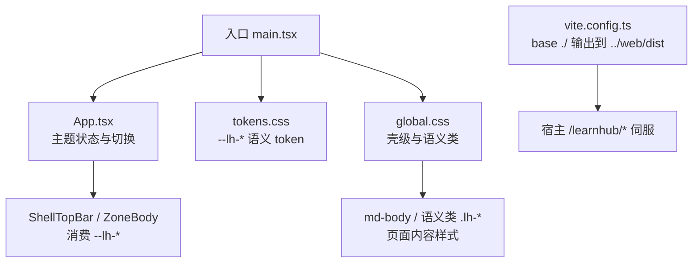
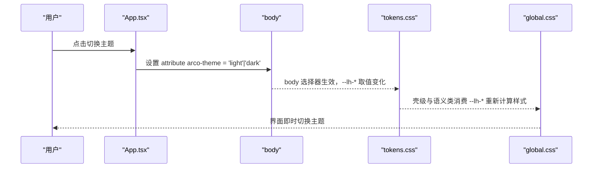
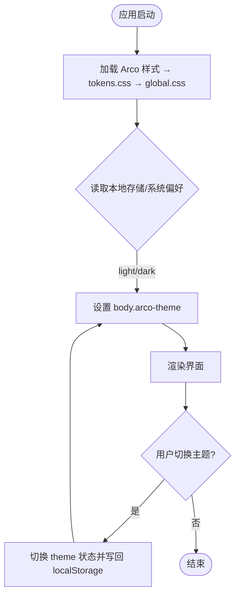
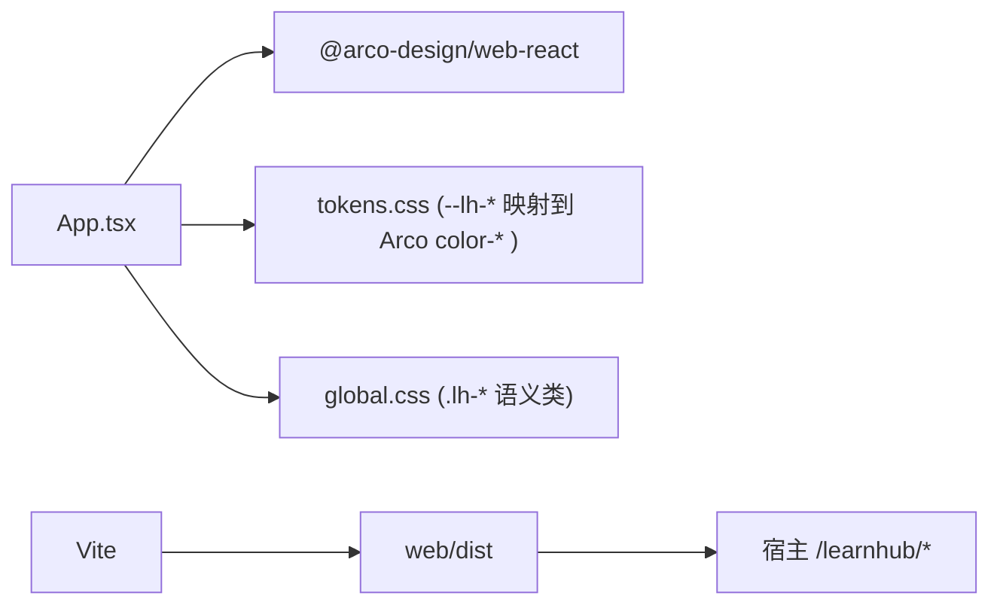

# 主题定制

<cite>
**本文引用的文件**
- [ui/src/main.tsx](file://ui/src/main.tsx)
- [ui/src/App.tsx](file://ui/src/App.tsx)
- [ui/src/tokens.css](file://ui/src/tokens.css)
- [ui/src/global.css](file://ui/src/global.css)
- [ui/vite.config.ts](file://ui/vite.config.ts)
- [package.json](file://package.json)
- [tests/ui-budget.test.ts](file://tests/ui-budget.test.ts)
</cite>

## 目录
1. [简介](#简介)
2. [项目结构](#项目结构)
3. [核心组件](#核心组件)
4. [架构总览](#架构总览)
5. [详细组件分析](#详细组件分析)
6. [依赖分析](#依赖分析)
7. [性能考虑](#性能考虑)
8. [故障排查指南](#故障排查指南)
9. [结论](#结论)
10. [附录](#附录)

## 简介
本指南面向需要为 Learnhub 面板进行主题定制的开发者，系统性说明主题系统的架构、变量体系、CSS 变量的定义与使用规范、主题的加载与动态切换机制、响应式与多设备适配策略、打包与性能优化方法，以及完整的主题开发示例与发布流程。同时提供兼容性检查清单与测试方法，帮助你在不破坏现有视觉纪律的前提下完成高质量的主题定制。

## 项目结构
Learnhub 的面板 UI 位于 ui 子工程，采用 Vite + React 构建，主题系统由三层构成：
- 设计 Token 层：集中声明间距、字号、圆角、动效与语义色别名（--lh-*），并通过 body[arco-theme='dark'] 实现亮/暗主题切换。
- 全局样式层：壳级规则与页面内容排版规则，严格消费 --lh-*，禁止硬编码色值。
- 语义类层：以 .lh-* 命名的工具类与业务类，将静态样式从内联 style 迁移至 class，便于主题化与维护。

**图示来源**
- [ui/src/main.tsx:1-16](file://ui/src/main.tsx#L1-L16)
- [ui/src/App.tsx:119-128](file://ui/src/App.tsx#L119-L128)
- [ui/src/tokens.css:1-63](file://ui/src/tokens.css#L1-L63)
- [ui/src/global.css:1-42](file://ui/src/global.css#L1-L42)
- [ui/vite.config.ts:1-15](file://ui/vite.config.ts#L1-L15)

**章节来源**
- [ui/src/main.tsx:1-16](file://ui/src/main.tsx#L1-L16)
- [ui/src/App.tsx:119-128](file://ui/src/App.tsx#L119-L128)
- [ui/src/tokens.css:1-63](file://ui/src/tokens.css#L1-L63)
- [ui/src/global.css:1-42](file://ui/src/global.css#L1-L42)
- [ui/vite.config.ts:1-15](file://ui/vite.config.ts#L1-L15)

## 核心组件
- 主题入口与注入
  - 在入口文件中按顺序引入 Arco 基础样式、自定义 tokens、全局样式，确保 --lh-* 在渲染前可用。
  - 通过 ConfigProvider 注入中文语言包，避免额外 locale 体积。
- 主题状态与切换
  - App 组件维护 theme 状态，默认跟随系统偏好或本地存储；切换时将 arco-theme 属性写入 body，并持久化到 localStorage。
  - 顶部栏提供切换按钮，触发 setTheme 更新。
- 设计 Token 层
  - 在 body 上声明 --lh-* 语义别名，映射到 Arco 的 color-* 变量；暗色模式通过 body[arco-theme='dark'] 覆盖阴影等缺失项。
  - 所有壳级样式只消费 --lh-*，禁止直接写死色值。
- 全局样式与语义类
  - global.css 中壳级规则仅消费 --lh-*；语义类层统一使用 .lh-* 命名，将静态样式从内联 style 迁移至 class，提升可主题化能力。
  - md-body 等阅读排版规则保持可读性，必要时保留少量兜底字面量。

**章节来源**
- [ui/src/main.tsx:1-16](file://ui/src/main.tsx#L1-L16)
- [ui/src/App.tsx:119-128](file://ui/src/App.tsx#L119-L128)
- [ui/src/tokens.css:1-63](file://ui/src/tokens.css#L1-L63)
- [ui/src/global.css:1-42](file://ui/src/global.css#L1-L42)
- [ui/src/global.css:196-398](file://ui/src/global.css#L196-L398)

## 架构总览
主题系统遵循“Token 驱动 + 语义类 + 壳级约束”的分层架构：
- 变量层：--lh-* 作为唯一主题源，映射到 Arco 调色板变量，保证亮/暗主题自动切换。
- 样式层：壳级规则与页面内容规则均消费 --lh-*；静态样式走 .lh-* 语义类，内联 style 仅允许动态值。
- 运行时：App 管理 theme 状态，切换时修改 body.arco-theme，浏览器 CSS 引擎即时重绘。
- 构建与部署：Vite 构建产物输出到 web/dist，宿主通过 /learnhub/* 伺服，资源引用相对路径。

**图示来源**
- [ui/src/App.tsx:119-128](file://ui/src/App.tsx#L119-L128)
- [ui/src/tokens.css:16-63](file://ui/src/tokens.css#L16-L63)
- [ui/src/global.css:1-42](file://ui/src/global.css#L1-L42)

## 详细组件分析

### 主题变量体系与使用规范
- 变量范围与命名
  - 间距：--lh-space-1 ~ --lh-space-8
  - 字号：--lh-font-2xs ~ --lh-font-xl
  - 圆角：--lh-radius-sm/md/lg/card
  - 动效：--lh-motion-fast, --lh-motion
  - 语义面：--lh-bg/surface/surface-muted/border/border-faint/text/text-muted/accent/shadow
- 使用规范
  - 壳级样式与组件只能消费 --lh-*，禁止硬编码色值。
  - 页面内容排版（如 md-body）尽量消费 --lh-*；仅在必要处保留兜底字面量。
  - 新增样式优先使用 .lh-* 语义类，避免内联 style 中的静态值。
- 执法与校验
  - tests/ui-budget.test.ts 对壳级文件进行扫描，禁止 hex/rgb/rgba 硬编码与非法内联 style。
  - 语义类层要求静态样式一律走 class，内联 style 仅允许动态值。

**章节来源**
- [ui/src/tokens.css:1-63](file://ui/src/tokens.css#L1-L63)
- [ui/src/global.css:1-42](file://ui/src/global.css#L1-L42)
- [ui/src/global.css:196-398](file://ui/src/global.css#L196-L398)
- [tests/ui-budget.test.ts:45-111](file://tests/ui-budget.test.ts#L45-L111)

### 主题加载机制与动态切换
- 加载顺序
  - 入口先引入 Arco 基础样式，再引入 tokens.css 与 global.css，确保 --lh-* 在渲染前可用。
- 切换逻辑
  - App 组件读取 localStorage 或系统偏好初始化 theme；切换时写入 body.arco-theme，并持久化。
  - 顶部栏提供切换入口，调用 setTheme 更新状态。
- 运行时影响
  - body.arco-theme 改变后，tokens.css 中 body[arco-theme='dark'] 块生效，--lh-* 取值随之变化，全局样式即时重绘。

**图示来源**
- [ui/src/main.tsx:1-16](file://ui/src/main.tsx#L1-L16)
- [ui/src/App.tsx:119-128](file://ui/src/App.tsx#L119-L128)

**章节来源**
- [ui/src/main.tsx:1-16](file://ui/src/main.tsx#L1-L16)
- [ui/src/App.tsx:119-128](file://ui/src/App.tsx#L119-L128)

### 响应式设计与多设备适配
- 布局与间距
  - 使用 --lh-space-* 控制间距，配合 flex/grid 与语义类（如 .lh-flex/.lh-grid/.lh-gap-*）实现自适应布局。
- 字体与可读性
  - 使用 --lh-font-* 控制字号阶梯；正文阅读区域（md-body）固定行高与限宽，保障多设备可读性。
- 视口与容器
  - 针对图表与画布容器使用视口高度计算（如 calc(100vh - ...)），避免在小屏下塌陷。
- 媒体与滚动
  - 图片与代码块支持横向滚动，公式与图表区域不限宽，确保复杂内容在多设备上正确展示。

**章节来源**
- [ui/src/global.css:126-185](file://ui/src/global.css#L126-L185)
- [ui/src/global.css:237-363](file://ui/src/global.css#L237-L363)

### 主题的性能优化与打包策略
- 构建配置
  - Vite 配置 base 为 './'，产物输出到 ../web/dist，供宿主 /learnhub/* 伺服，资源引用相对路径，减少跨域与路径问题。
  - chunkSizeWarningLimit 限制分包大小，避免首屏过大。
- 主题切换性能
  - 通过 CSS 变量与 body 属性切换主题，无需重建 DOM，仅触发样式重计算，性能开销低。
- 资源与依赖
  - 入口按需引入 Arco 中文语言包，避免全量 locale 体积。
  - 第三方库（ECharts、Mermaid、KaTeX 等）按需引入，减少打包体积。

**章节来源**
- [ui/vite.config.ts:1-15](file://ui/vite.config.ts#L1-L15)
- [ui/src/main.tsx:1-16](file://ui/src/main.tsx#L1-L16)
- [ui/package.json:12-28](file://ui/package.json#L12-L28)

### 完整的主题开发示例与发布流程
- 开发步骤
  1. 在 tokens.css 中扩展或覆盖 --lh-* 语义变量，确保亮/暗主题一致可用。
  2. 在 global.css 中使用 .lh-* 语义类组织样式，避免内联 style 中的静态值。
  3. 在 App 中通过顶部栏切换主题，验证 localStorage 持久化与系统偏好跟随。
  4. 运行 Vite 构建，检查产物是否输出到 web/dist，并在宿主环境中预览。
- 发布流程
  1. 执行根目录构建脚本，生成 lib 与 web 产物。
  2. 提交变更，确保测试门（视觉纪律、路由、类型）全部通过。
  3. 在宿主环境部署 web/dist，验证 /learnhub/* 访问正常。

**章节来源**
- [ui/src/tokens.css:1-63](file://ui/src/tokens.css#L1-L63)
- [ui/src/global.css:196-398](file://ui/src/global.css#L196-L398)
- [ui/src/App.tsx:119-128](file://ui/src/App.tsx#L119-L128)
- [package.json:38-47](file://package.json#L38-L47)
- [ui/vite.config.ts:1-15](file://ui/vite.config.ts#L1-L15)

### 主题兼容性检查与测试方法
- 视觉纪律门
  - 壳级文件禁止硬编码色值与非法内联 style；新增样式需通过 tests/ui-budget.test.ts 的扫描。
- 语义类对账
  - 静态样式必须迁移至 .lh-* 语义类；内联 style 仅允许动态值。
- 主题切换测试
  - 验证 body.arco-theme 切换后，--lh-* 取值变化，界面即时刷新。
  - 验证 localStorage 持久化与系统偏好跟随。
- 构建与部署测试
  - 验证 Vite 构建产物输出到 web/dist，宿主 /learnhub/* 访问正常。
  - 验证资源引用相对路径，无跨域或路径错误。

**章节来源**
- [tests/ui-budget.test.ts:45-111](file://tests/ui-budget.test.ts#L45-L111)
- [ui/src/global.css:196-398](file://ui/src/global.css#L196-L398)
- [ui/src/App.tsx:119-128](file://ui/src/App.tsx#L119-L128)
- [ui/vite.config.ts:1-15](file://ui/vite.config.ts#L1-L15)

## 依赖分析
- 前端依赖
  - React、Arco Design、ECharts、Mermaid、KaTeX 等用于 UI 与可视化。
  - Vite 作为构建工具，React 插件用于 JSX 转译。
- 主题相关依赖
  - Arco Design 提供 color-* 变量，主题通过 body.arco-theme 切换。
  - 自定义 --lh-* 语义变量映射到 Arco 变量，形成主题抽象层。
- 构建与部署
  - Vite 构建产物输出到 web/dist，宿主通过 /learnhub/* 伺服。

**图示来源**
- [ui/src/App.tsx:1-12](file://ui/src/App.tsx#L1-L12)
- [ui/src/tokens.css:1-63](file://ui/src/tokens.css#L1-L63)
- [ui/src/global.css:196-398](file://ui/src/global.css#L196-L398)
- [ui/vite.config.ts:1-15](file://ui/vite.config.ts#L1-L15)

**章节来源**
- [ui/package.json:12-28](file://ui/package.json#L12-L28)
- [ui/vite.config.ts:1-15](file://ui/vite.config.ts#L1-L15)

## 性能考虑
- 主题切换性能
  - 通过 CSS 变量与 body 属性切换主题，避免 DOM 重建，仅触发样式重计算。
- 构建体积优化
  - 按需引入 Arco 中文语言包，避免全量 locale。
  - 合理分包与限制 chunk 大小，提升首屏加载速度。
- 运行时优化
  - 使用语义类替代内联 style，减少 JS 计算与样式抖动。
  - 媒体与图表区域支持横向滚动，避免小屏下的布局崩溃。

## 故障排查指南
- 主题未生效
  - 检查入口文件引入顺序：Arco 样式 → tokens.css → global.css。
  - 确认 body.arco-theme 是否正确设置，localStorage 是否被污染。
- 样式错乱
  - 检查是否使用了硬编码色值或非法内联 style，应改为 --lh-* 或 .lh-* 语义类。
  - 使用 tests/ui-budget.test.ts 扫描壳级文件，定位违规点。
- 构建失败
  - 检查 Vite 配置 base 与 outDir，确保产物输出到 web/dist。
  - 验证资源引用是否为相对路径，避免跨域或路径错误。

**章节来源**
- [ui/src/main.tsx:1-16](file://ui/src/main.tsx#L1-L16)
- [ui/src/App.tsx:119-128](file://ui/src/App.tsx#L119-L128)
- [tests/ui-budget.test.ts:45-111](file://tests/ui-budget.test.ts#L45-L111)
- [ui/vite.config.ts:1-15](file://ui/vite.config.ts#L1-L15)

## 结论
Learnhub 的主题系统通过分层架构与严格的视觉纪律，实现了可维护、可扩展且高性能的主题定制能力。开发者只需遵循 --lh-* 语义变量与 .lh-* 语义类的规范，即可在不破坏现有样式的前提下完成主题定制。结合自动化测试与构建流程，确保主题变更的稳定性和兼容性。

## 附录
- 快速开始
  - 在 tokens.css 中扩展 --lh-* 变量，在 global.css 中使用 .lh-* 语义类组织样式。
  - 通过 App 顶部栏切换主题，验证效果。
- 参考文件
  - 主题入口与切换：ui/src/main.tsx、ui/src/App.tsx
  - 设计 Token 层：ui/src/tokens.css
  - 全局样式与语义类：ui/src/global.css
  - 构建配置：ui/vite.config.ts
  - 测试与执法：tests/ui-budget.test.ts