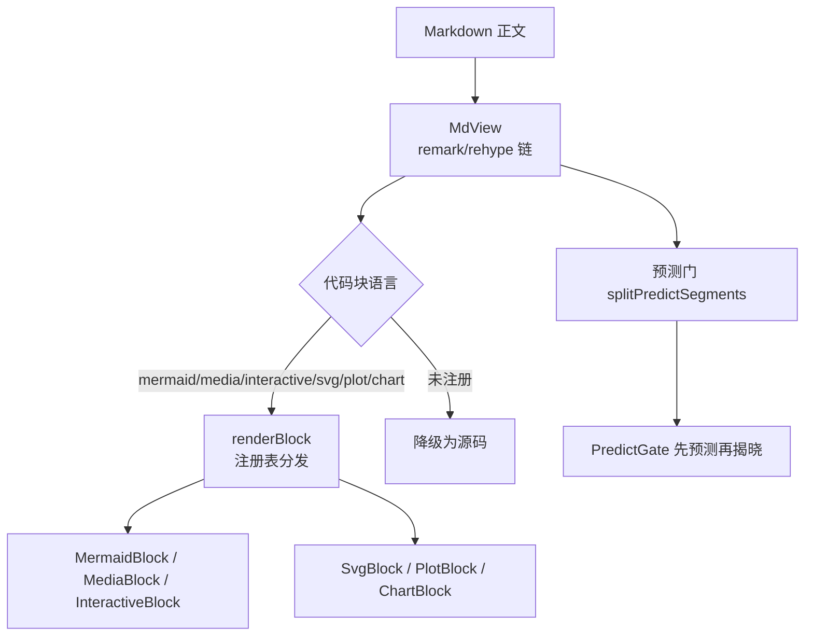
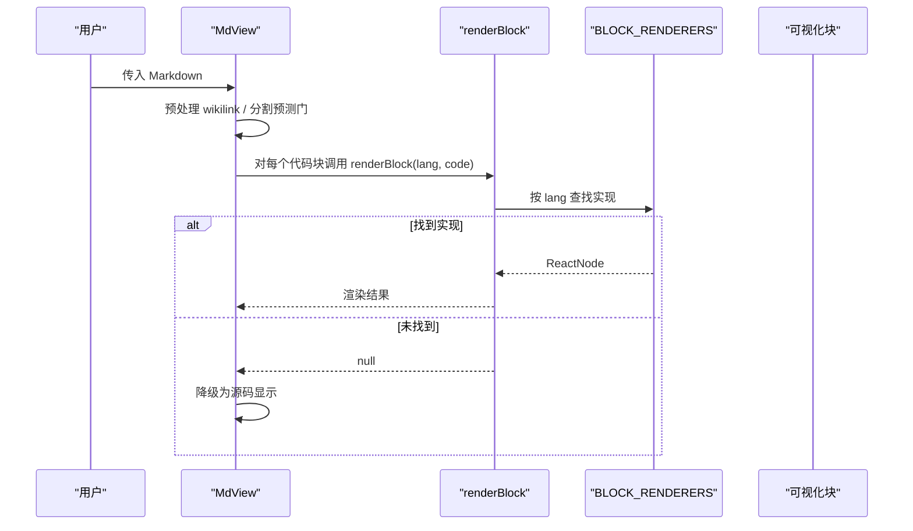
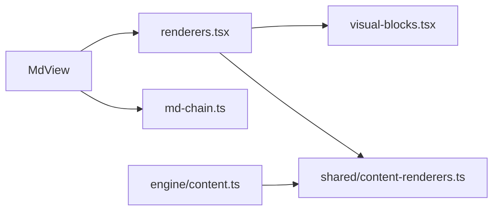

# 内容渲染器

<cite>
**本文引用的文件**
- [shared/content-renderers.ts](file://shared/content-renderers.ts)
- [ui/src/components/renderers.tsx](file://ui/src/components/renderers.tsx)
- [ui/src/components/visual-blocks.tsx](file://ui/src/components/visual-blocks.tsx)
- [ui/src/components/MdView.tsx](file://ui/src/components/MdView.tsx)
- [ui/src/lib/md-chain.ts](file://ui/src/lib/md-chain.ts)
- [src/engine/content.ts](file://src/engine/content.ts)
- [ui/src/lib/settle-context.ts](file://ui/src/lib/settle-context.ts)
</cite>

## 目录
1. [简介](#简介)
2. [项目结构](#项目结构)
3. [核心组件](#核心组件)
4. [架构总览](#架构总览)
5. [详细组件分析](#详细组件分析)
6. [依赖关系分析](#依赖关系分析)
7. [性能与缓存](#性能与缓存)
8. [故障排查](#故障排查)
9. [结论](#结论)
10. [附录：常见内容类型实现要点](#附录：常见内容类型实现要点)

## 简介
本指南面向需要扩展或维护“内容渲染器”的开发者，系统阐述渲染器的接口规范、注册机制、优先级管理、样式与主题支持、性能优化与缓存策略，以及常见内容类型的实现要点与测试调试方法。该渲染体系以“单一事实源”为核心：共享清单定义支持的代码块语言与节类型，UI 侧按清单提供具体实现，引擎侧将清单注入提示词并做一致性校验，从而保证生成侧与展示侧的长期一致。

## 项目结构
- 共享清单（零依赖）：定义所有受支持的代码块语言、节类型、预测门解析等，作为 UI 与引擎的共同契约。
- UI 渲染层：基于 react-markdown 的 Markdown 渲染链，按代码块语言分发到具体渲染器；未注册语言降级为源码显示。
- 可视化块：对 SVG、函数图像/坐标几何、数据图表等复杂内容进行安全清洗、按需加载与渲染。
- 引擎集成：在生成上下文与质检环节引用共享清单，确保模型产出格式与面板能力一致。

**图示来源**
- [ui/src/components/MdView.tsx:28-84](file://ui/src/components/MdView.tsx#L28-L84)
- [ui/src/components/renderers.tsx:140-155](file://ui/src/components/renderers.tsx#L140-L155)
- [shared/content-renderers.ts:179-196](file://shared/content-renderers.ts#L179-L196)

**章节来源**
- [shared/content-renderers.ts:1-116](file://shared/content-renderers.ts#L1-L116)
- [ui/src/components/renderers.tsx:1-166](file://ui/src/components/renderers.tsx#L1-L166)
- [ui/src/components/MdView.tsx:1-103](file://ui/src/components/MdView.tsx#L1-L103)
- [ui/src/lib/md-chain.ts:1-16](file://ui/src/lib/md-chain.ts#L1-L16)

## 核心组件
- 共享清单与类型
  - RendererSpec：描述一种代码块语言的标签、说明与示例，用于提示词注入与一致性校验。
  - SECTION_TYPES：节类型菜单与创作要求，供生成侧与解析侧共用。
  - INTERACTIVE_TYPES：交互件类型枚举，统一 widget-config 与提示词。
  - parseSectionTitle：解析“前缀：标题”为节类型与清理后的标题。
  - rendererCapabilityBlock：生成“面板支持的渲染格式”段落，注入提示词。
  - PLAIN_CODE_LANGS：通用编程语言集合，用于 gateReport 中的告警归类。
  - 预测门相关：predictBlockRe、parsePredictBlock、splitPredictSegments。

- UI 渲染注册表
  - BLOCK_RENDERERS：按 lang 映射到 ReactNode 的渲染器数组。
  - renderBlock(lang, code)：查找匹配渲染器并返回节点，未命中返回 null（由 MdView 降级）。
  - verifyRendererCoverage()：构建期断言 shared 清单中的每种语言都有对应 UI 实现（math 除外，走 remark-math）。

- 可视化块实现
  - SvgBlock：DOMPurify 白名单清洗后内联渲染。
  - PlotBlock：JSON spec → mathjs 求值 → Mafs 坐标系绘制。
  - ChartBlock：ECharts option 解析守卫 + 按需注册 series → CanvasRenderer 渲染。

- Markdown 渲染链
  - REMARK_PLUGINS/REHYPE_PLUGINS：GFM、数学公式与 KaTeX。
  - MD_HTML_POLICY：skipHtml 丢弃裸 HTML，避免机器注释泄露。
  - MdCode：代码块分发入口，调用 renderBlock，未命中回退源码。

**章节来源**
- [shared/content-renderers.ts:10-116](file://shared/content-renderers.ts#L10-L116)
- [shared/content-renderers.ts:117-196](file://shared/content-renderers.ts#L117-L196)
- [ui/src/components/renderers.tsx:135-166](file://ui/src/components/renderers.tsx#L135-L166)
- [ui/src/components/visual-blocks.tsx:20-296](file://ui/src/components/visual-blocks.tsx#L20-L296)
- [ui/src/lib/md-chain.ts:1-16](file://ui/src/lib/md-chain.ts#L1-L16)
- [ui/src/components/MdView.tsx:28-58](file://ui/src/components/MdView.tsx#L28-L58)

## 架构总览
渲染体系围绕“单一事实源”展开：
- 共享清单是唯一的权威来源，同时被 UI 与引擎消费。
- UI 通过注册表将语言标记映射到 React 组件。
- 引擎在生成提示词中注入“面板支持的渲染格式”，并在质检时拒绝未注册语言。
- 预测门在正文中插入“先预测再揭晓”的阅读体验，解析与渲染共用同一套解析器。

**图示来源**
- [ui/src/components/MdView.tsx:28-84](file://ui/src/components/MdView.tsx#L28-L84)
- [ui/src/components/renderers.tsx:140-155](file://ui/src/components/renderers.tsx#L140-L155)

## 详细组件分析

### 接口规范与实现要求
- 新增一种代码块语言需完成两件事：
  1) 在共享清单中添加一项 RendererSpec（lang、label、hint、example），以便提示词注入与一致性校验。
  2) 在 UI 注册表中添加对应的渲染器实现（lang → ReactNode），否则构建期会报错。
- 数学公式不在此注册表中，而是通过 remark-math/rehype-katex 处理行内与独立公式。
- 未注册的 lang 一律降级为源码显示，保证页面健壮性。

**章节来源**
- [shared/content-renderers.ts:10-67](file://shared/content-renderers.ts#L10-L67)
- [ui/src/components/renderers.tsx:140-166](file://ui/src/components/renderers.tsx#L140-L166)
- [ui/src/components/MdView.tsx:28-35](file://ui/src/components/MdView.tsx#L28-L35)

### 不同内容类型的渲染策略与转换规则
- mermaid：动态导入 mermaid，根据 arco-theme 选择主题，失败降级源码。
- media：每行一个 vault 相对路径，按扩展名选择 video/audio，并通过 /learnhub/api/file 路由播放。
- interactive：sandbox iframe 加载 vault 相对 HTML，postMessage 协议上报完成与标注；在练习结算上下文中可上报成绩。
- svg：DOMPurify 白名单清洗后内联渲染，禁止脚本与外部资源。
- plot：JSON spec 声明数学对象（函数/参数曲线/点/向量/线段/圆/多边形/标签），使用 mathjs 求值与 Mafs 坐标系渲染。
- chart：标准 ECharts option，限制 series 类型并禁止外部 URL，按需注册图表组件与 CanvasRenderer。

**章节来源**
- [ui/src/components/renderers.tsx:17-149](file://ui/src/components/renderers.tsx#L17-L149)
- [ui/src/components/visual-blocks.tsx:20-296](file://ui/src/components/visual-blocks.tsx#L20-L296)
- [ui/src/lib/settle-context.ts:1-8](file://ui/src/lib/settle-context.ts#L1-L8)

### 注册机制与优先级管理
- 注册表顺序即优先级：renderBlock 使用 find 匹配第一个相同 lang 的渲染器。
- 建议保持 lang 唯一且语义明确；如需覆盖行为，调整 BLOCK_RENDERERS 顺序或在实现内部做分支。
- 构建期 verifyRendererCoverage 强制 shared 清单与 UI 实现一一对应（math 例外）。

**章节来源**
- [ui/src/components/renderers.tsx:140-166](file://ui/src/components/renderers.tsx#L140-L166)

### 样式定制与主题支持
- Mermaid：跟随 arco-theme 切换 dark/default 主题。
- ECharts：检测 arco-theme 决定是否启用 dark 主题，背景透明化适配容器。
- 全局 CSS：MdView 与可视化块使用语义类名（如 md-mermaid、md-svg、md-plot、md-chart），便于主题与布局定制。
- 图片与媒体：Obsidian 嵌入语法 ![[path]] 会被预处理为面板文件路由 URL，统一通过 /learnhub/api/file 访问。

**章节来源**
- [ui/src/components/renderers.tsx:17-64](file://ui/src/components/renderers.tsx#L17-L64)
- [ui/src/components/visual-blocks.tsx:23-37](file://ui/src/components/visual-blocks.tsx#L23-L37)
- [ui/src/components/visual-blocks.tsx:256-295](file://ui/src/components/visual-blocks.tsx#L256-L295)
- [ui/src/components/MdView.tsx:37-44](file://ui/src/components/MdView.tsx#L37-L44)

### 性能优化与缓存策略
- 懒加载重依赖：Mermaid、Mafs、ECharts 均通过动态 import 延迟加载，减少首屏体积。
- 计算缓存：PlotBlock 使用 useMemo 缓存 JSON 解析与编译结果；ChartBlock 使用 useMemo 缓存 option。
- 资源释放：ECharts 实例在卸载时 dispose，ResizeObserver 在卸载时断开，避免内存泄漏。
- 安全与容错：SVG 白名单清洗、chart option 白名单与外链拦截，失败统一降级源码显示。

**章节来源**
- [ui/src/components/renderers.tsx:17-41](file://ui/src/components/renderers.tsx#L17-L41)
- [ui/src/components/visual-blocks.tsx:143-232](file://ui/src/components/visual-blocks.tsx#L143-L232)
- [ui/src/components/visual-blocks.tsx:256-295](file://ui/src/components/visual-blocks.tsx#L256-L295)

### 引擎集成与一致性保障
- 提示词注入：rendererCapabilityBlock 将“面板支持的渲染格式”注入生成提示词，约束模型仅使用已支持格式。
- 节类型与视觉块预算：content.ts 维护 SECTION_VISUAL_LANGS，限制单节富内容块数量。
- 未注册语言告警：PLAIN_CODE_LANGS 用于 gateReport 中对未知代码块进行归类告警。
- 预测门：引擎与 UI 共用 predictBlockRe、parsePredictBlock、splitPredictSegments，保证生成与阅读体验一致。

**章节来源**
- [shared/content-renderers.ts:97-116](file://shared/content-renderers.ts#L97-L116)
- [shared/content-renderers.ts:117-196](file://shared/content-renderers.ts#L117-L196)
- [src/engine/content.ts:22-34](file://src/engine/content.ts#L22-L34)

## 依赖关系分析
- MdView 依赖 md-chain 配置（remark/rehype 插件与 skipHtml 策略）。
- MdView 通过 renderBlock 调用 UI 注册表，未命中则降级源码。
- visual-blocks 提供 svg/plot/chart 的具体实现，依赖 DOMPurify、mathjs、Mafs、ECharts。
- shared/content-renderers 被 UI 与引擎共同消费，形成跨层契约。

**图示来源**
- [ui/src/components/MdView.tsx:10-22](file://ui/src/components/MdView.tsx#L10-L22)
- [ui/src/components/renderers.tsx:12-16](file://ui/src/components/renderers.tsx#L12-L16)
- [ui/src/components/visual-blocks.tsx:8-13](file://ui/src/components/visual-blocks.tsx#L8-L13)
- [src/engine/content.ts:22-23](file://src/engine/content.ts#L22-L23)

**章节来源**
- [ui/src/components/MdView.tsx:10-22](file://ui/src/components/MdView.tsx#L10-L22)
- [ui/src/components/renderers.tsx:12-16](file://ui/src/components/renderers.tsx#L12-L16)
- [ui/src/components/visual-blocks.tsx:8-13](file://ui/src/components/visual-blocks.tsx#L8-L13)
- [src/engine/content.ts:22-34](file://src/engine/content.ts#L22-L34)

## 性能与缓存
- 首屏体积控制：通过动态 import 延迟加载第三方库（mermaid、mafs、echarts）。
- 渲染成本优化：对 JSON 解析与编译结果使用 useMemo 缓存；图表实例在卸载时正确释放。
- 安全优先：SVG 白名单清洗、chart option 白名单与外链拦截，避免恶意输入导致性能或安全问题。
- 降级策略：任何解析/渲染失败都回退到源码显示，保证用户体验稳定。

[本节为通用指导，无需特定文件引用]

## 故障排查
- 构建期错误：若 shared 清单新增了语言但 UI 未实现，verifyRendererCoverage 会抛出错误，快速定位缺失实现。
- 运行时降级：未注册语言或解析失败会降级为源码显示，便于调试原始输入。
- 交互件成绩上报：仅在练习结算上下文（SettleContext）存在且带 score 时才上报；无上下文只亮徽标。
- 预测门异常：非法预测门块降级源码显示，避免页面崩溃；可通过检查 predictBlockRe 与 parsePredictBlock 定位问题。

**章节来源**
- [ui/src/components/renderers.tsx:157-166](file://ui/src/components/renderers.tsx#L157-L166)
- [ui/src/components/renderers.tsx:71-133](file://ui/src/components/renderers.tsx#L71-L133)
- [ui/src/lib/settle-context.ts:1-8](file://ui/src/lib/settle-context.ts#L1-L8)
- [shared/content-renderers.ts:149-196](file://shared/content-renderers.ts#L149-L196)

## 结论
该渲染体系以共享清单为单一事实源，实现了 UI 与引擎的一致性；通过注册表分发、严格的安全清洗与降级策略，保证了可扩展性与健壮性；借助懒加载与缓存优化，兼顾了性能与体验。新增内容类型只需在共享清单与 UI 注册表两端同步扩展，即可自动获得提示词注入、一致性校验与渲染能力。

[本节为总结性内容，无需特定文件引用]

## 附录：常见内容类型实现要点
- mermaid
  - 动态导入 mermaid，根据主题初始化，失败降级源码。
  - 参考路径：[ui/src/components/renderers.tsx:17-41](file://ui/src/components/renderers.tsx#L17-L41)
- media
  - 每行一个 vault 相对路径，按扩展名选择 video/audio，通过 /learnhub/api/file 播放。
  - 参考路径：[ui/src/components/renderers.tsx:43-64](file://ui/src/components/renderers.tsx#L43-L64)
- interactive
  - sandbox iframe 加载 HTML，postMessage 协议上报完成与标注；在练习结算上下文中上报成绩。
  - 参考路径：[ui/src/components/renderers.tsx:66-133](file://ui/src/components/renderers.tsx#L66-L133)
- svg
  - DOMPurify 白名单清洗后内联渲染，禁止脚本与外部资源。
  - 参考路径：[ui/src/components/visual-blocks.tsx:20-37](file://ui/src/components/visual-blocks.tsx#L20-L37)
- plot
  - JSON spec 声明数学对象，mathjs 求值，Mafs 坐标系渲染；失败降级源码。
  - 参考路径：[ui/src/components/visual-blocks.tsx:39-232](file://ui/src/components/visual-blocks.tsx#L39-L232)
- chart
  - ECharts option 解析守卫（series 白名单、禁外链），按需注册图表组件与 CanvasRenderer。
  - 参考路径：[ui/src/components/visual-blocks.tsx:234-296](file://ui/src/components/visual-blocks.tsx#L234-L296)

**章节来源**
- [ui/src/components/renderers.tsx:17-149](file://ui/src/components/renderers.tsx#L17-L149)
- [ui/src/components/visual-blocks.tsx:20-296](file://ui/src/components/visual-blocks.tsx#L20-L296)