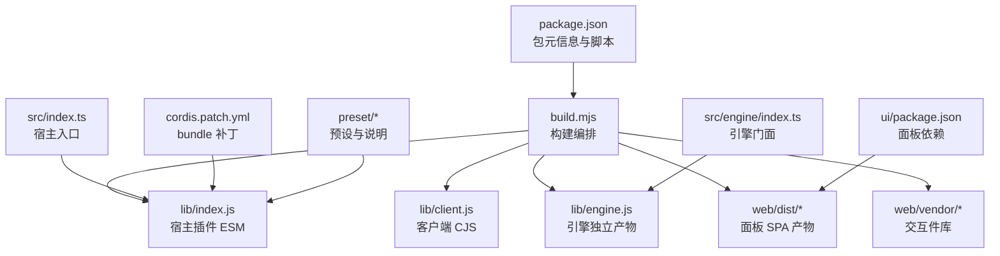
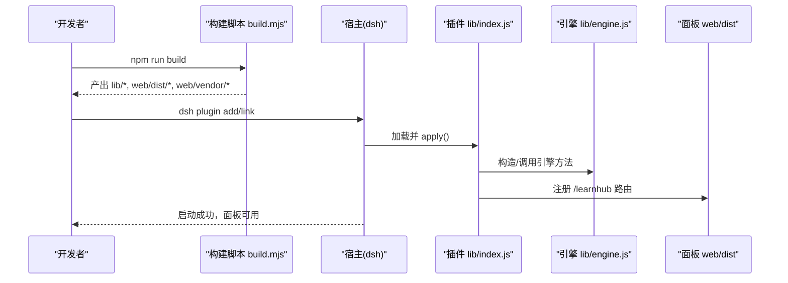
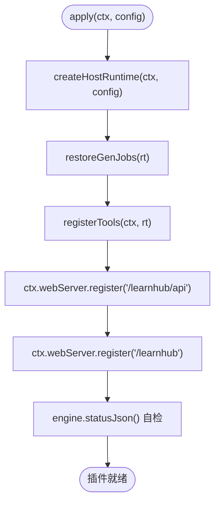
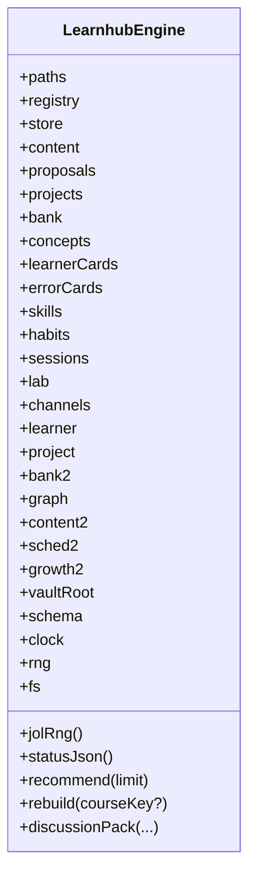
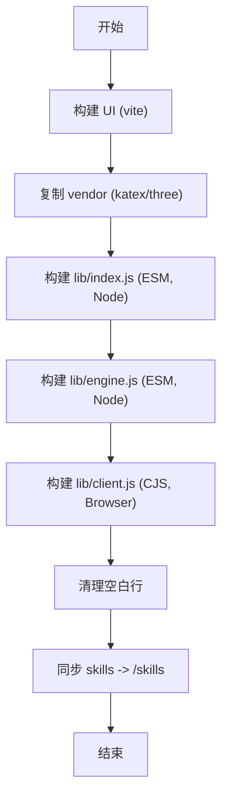
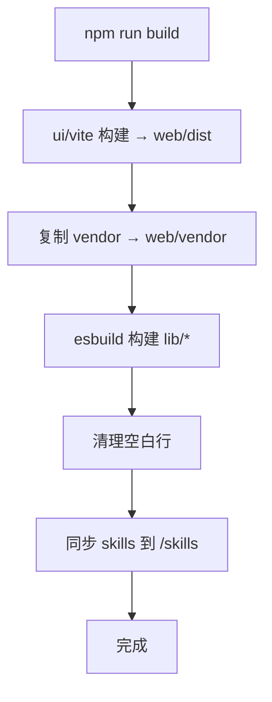
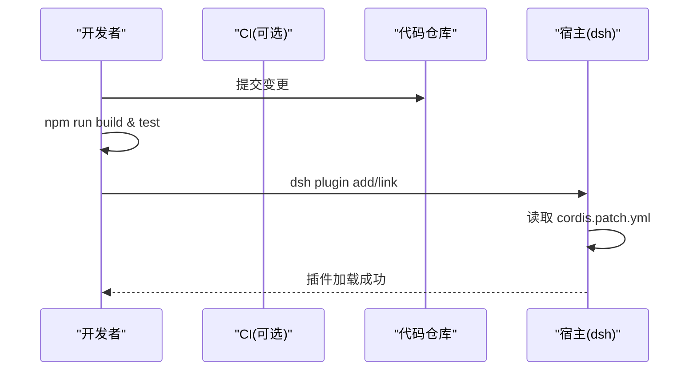
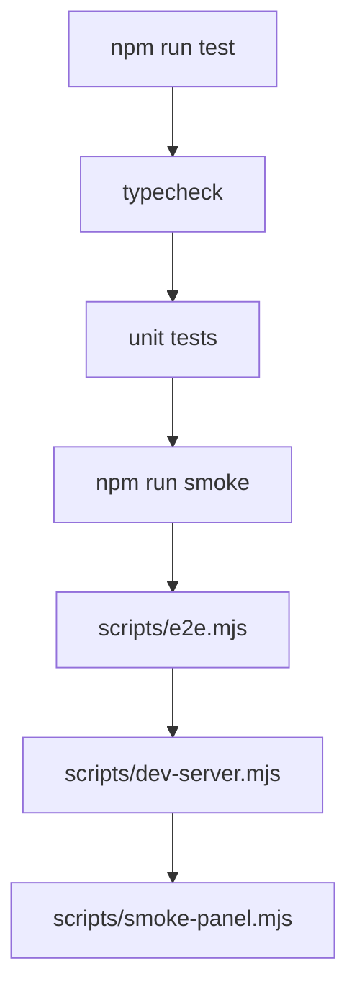

# 扩展包发布

<cite>
**本文引用的文件**
- [package.json](file://package.json)
- [build.mjs](file://build.mjs)
- [cordis.patch.yml](file://cordis.patch.yml)
- [src/index.ts](file://src/index.ts)
- [src/engine/index.ts](file://src/engine/index.ts)
- [ui/package.json](file://ui/package.json)
- [tsconfig.json](file://tsconfig.json)
- [README.md](file://README.md)
- [scripts/gen-smoke.mjs](file://scripts/gen-smoke.mjs)
- [scripts/spike.mjs](file://scripts/spike.mjs)
- [preset/learnhub/preset.yml](file://preset/learnhub/preset.yml)
- [preset/learnhub/user-root-composition.yml](file://preset/learnhub/user-root-composition.yml)
</cite>

## 目录
1. [简介](#简介)
2. [项目结构](#项目结构)
3. [核心组件](#核心组件)
4. [架构总览](#架构总览)
5. [详细组件分析](#详细组件分析)
6. [依赖与版本管理](#依赖与版本管理)
7. [构建与打包流程](#构建与打包流程)
8. [签名验证与安全审查](#签名验证与安全审查)
9. [发布流程与分发渠道](#发布流程与分发渠道)
10. [开发与测试工作流](#开发与测试工作流)
11. [维护与更新策略](#维护与更新策略)
12. [故障排查指南](#故障排查指南)
13. [结论](#结论)

## 简介
本指南面向“学习中心 Learnhub”插件（dsh-learnhub）的扩展包发布与维护。内容覆盖：包的目录结构与配置规范、版本管理与依赖声明、构建与打包流程、签名验证与安全检查、发布流程与分发渠道，以及完整的开发—测试—发布—维护闭环实践。读者无需深入源码即可按步骤完成本地构建、冒烟验证、打包产物校验与宿主安装部署。

## 项目结构
该扩展包采用“宿主插件 + 引擎门面 + 面板 SPA + 技能与预设”的分层组织方式：
- src/index.ts：宿主侧插件入口，装配工具面、HTTP 路由与面板静态资源服务。
- src/engine/index.ts：TS 引擎门面，统一数据访问与子系统聚合，对外暴露稳定接口。
- ui/：Vite + React 面板源码，构建产物输出到 web/dist，由宿主静态伺服。
- scripts/：构建辅助脚本（冒烟、端到端、开发服务器等）。
- cordis.patch.yml：bundle 组合补丁，注入 host 插件与定时提醒能力。
- preset/：用户根占位与描述信息，配合宿主 profile 使用。
- package.json：包元信息、依赖、构建脚本与导出约定。
- tsconfig.json：类型检查与模块解析规则。

**图示来源**
- [package.json:1-83](file://package.json#L1-L83)
- [build.mjs:1-166](file://build.mjs#L1-L166)
- [src/index.ts:1-91](file://src/index.ts#L1-L91)
- [src/engine/index.ts:1-150](file://src/engine/index.ts#L1-L150)
- [ui/package.json:1-48](file://ui/package.json#L1-L48)
- [cordis.patch.yml:1-14](file://cordis.patch.yml#L1-L14)

**章节来源**
- [package.json:1-83](file://package.json#L1-L83)
- [build.mjs:1-166](file://build.mjs#L1-L166)
- [src/index.ts:1-91](file://src/index.ts#L1-L91)
- [src/engine/index.ts:1-150](file://src/engine/index.ts#L1-L150)
- [ui/package.json:1-48](file://ui/package.json#L1-L48)
- [cordis.patch.yml:1-14](file://cordis.patch.yml#L1-L14)
- [README.md:146-186](file://README.md#L146-L186)

## 核心组件
- 宿主插件入口（src/index.ts）：注册 agent 工具、HTTP API 路由与面板页面，装配运行时并自检。
- 引擎门面（src/engine/index.ts）：封装课程、题库、调度、内容管线、项目、会话、质量评审等子系统，提供只读体检、推荐、重建、讨论上下文等能力。
- 构建脚本（build.mjs）：串联 UI 构建、vendor 复制、ESM/CJS 产物生成、空白行清理与技能同步。
- bundle 补丁（cordis.patch.yml）：在宿主 profile 中插入 learnhub 插件与时间/调度能力。
- 面板 UI（ui/）：基于 Vite 构建 SPA，产物由宿主静态伺服。

**章节来源**
- [src/index.ts:1-91](file://src/index.ts#L1-L91)
- [src/engine/index.ts:1-150](file://src/engine/index.ts#L1-L150)
- [build.mjs:18-166](file://build.mjs#L18-L166)
- [cordis.patch.yml:1-14](file://cordis.patch.yml#L1-L14)
- [ui/package.json:1-48](file://ui/package.json#L1-L48)

## 架构总览
下图展示从构建到运行时的关键路径：构建脚本产出 lib 与 web；宿主加载 lib/index.js 后注册工具与路由；面板通过 /learnhub 访问 web/dist；引擎通过 lib/engine.js 被脚本与 UI 复用。

**图示来源**
- [build.mjs:101-166](file://build.mjs#L101-L166)
- [src/index.ts:56-91](file://src/index.ts#L56-L91)
- [README.md:146-186](file://README.md#L146-L186)

## 详细组件分析

### 宿主插件入口（src/index.ts）
- 职责：创建运行时、恢复生成任务、注册工具面、挂载 API 与面板路由、执行加载自检。
- 关键点：通过 Context 注入 webServer、tools、llm；以 effect 形式注册路由；启动时调用 engine.statusJson 做健康检查。

**图示来源**
- [src/index.ts:56-91](file://src/index.ts#L56-L91)

**章节来源**
- [src/index.ts:1-91](file://src/index.ts#L1-L91)

### 引擎门面（src/engine/index.ts）
- 职责：统一数据访问、子系统装配、只读体检、推荐、重建、讨论上下文、生成任务持久化等。
- 关键点：严格 schema 版本硬门；FSRS 参数缓存；多子系统（Graph/Content/Sched/Growth/Lab/Bank/Project/Channels/Learner）通过构造注入协作。

**图示来源**
- [src/engine/index.ts:149-398](file://src/engine/index.ts#L149-L398)

**章节来源**
- [src/engine/index.ts:1-800](file://src/engine/index.ts#L1-L800)

### 构建脚本（build.mjs）
- 职责：构建面板 SPA、复制交互件 vendor、生成 lib/index.js、lib/engine.js、lib/client.js，清理空白行，同步 skills。
- 关键点：
  - 先构建 ui → web/dist，缺失 node_modules 自动补装。
  - vendor 源来自 ui/node_modules，缺文件即失败。
  - 外部依赖排除（@deepseek-ai/*、node:*、@open-spaced-repetition/*）。
  - client 产物包裹 window.__ModuleLoader__.load 握手。
  - 技能随构建复制到 <dshHome>/skills。

**图示来源**
- [build.mjs:18-166](file://build.mjs#L18-L166)

**章节来源**
- [build.mjs:1-166](file://build.mjs#L1-L166)

### Bundle 补丁（cordis.patch.yml）
- 作用：在宿主 profile 中插入 learnhub 插件与 time-context/schedule 能力，使定时提醒与会话级工具生效。
- 注意：机器级 vault 路径由各机器的 cordis.patch.yml 覆盖，仓库内不写死路径。

**章节来源**
- [cordis.patch.yml:1-14](file://cordis.patch.yml#L1-L14)

### 面板 UI（ui/package.json）
- 技术栈：Vite + React + Arco Design + 图表/数学渲染库。
- 构建：npm run build 输出至 web/dist，供宿主静态伺服。

**章节来源**
- [ui/package.json:1-48](file://ui/package.json#L1-L48)

## 依赖与版本管理
- 包名与版本：name、version、license、engines（Node >= 22）。
- 导出约定：exports 指定主入口、客户端入口与 package.json 可引用。
- peerDependencies：声明宿主私有依赖（@deepseek-ai/*），部分可选。
- devDependencies：esbuild、typescript、类型定义等。
- dependencies：运行时依赖（如 ts-fsrs、yaml、native binding）。
- 类型检查：tsconfig 启用 strict，noEmit，仅用于类型门禁。

建议：
- 遵循语义化版本控制（SemVer），变更影响范围决定 bump 级别。
- 对 peerDependencies 保持兼容矩阵，避免破坏宿主环境。
- 在 README 或 CHANGELOG 记录重大变更与迁移指引。

**章节来源**
- [package.json:1-83](file://package.json#L1-L83)
- [tsconfig.json:1-26](file://tsconfig.json#L1-L26)

## 构建与打包流程
- 一键构建：npm run build
  - 构建面板 SPA（ui → web/dist），必要时自动 npm install。
  - 复制交互件 vendor（katex/three）到 web/vendor。
  - 生成 lib/index.js（宿主插件）、lib/engine.js（引擎）、lib/client.js（客户端）。
  - 清理空白行并通过 whitespace 门禁。
  - 同步 skills 到 <dshHome>/skills。
- 产物说明：
  - lib：宿主与引擎产物，供 dsh 宿主加载。
  - web：面板静态资源与 vendor 库。
  - cordis.patch.yml：bundle 补丁，随包分发。
- 类型检查：npm run typecheck（含 arch-baseline 与 UI 类型扫描）。
- 检查语法：npm run check（node --check 产物）。

**图示来源**
- [build.mjs:18-166](file://build.mjs#L18-L166)
- [README.md:173-186](file://README.md#L173-L186)

**章节来源**
- [build.mjs:1-166](file://build.mjs#L1-L166)
- [README.md:173-186](file://README.md#L173-L186)

## 签名验证与安全审查
当前仓库未包含代码签名或二进制签名流程。安全审查建议：
- 依赖审计：定期运行依赖漏洞扫描（如 npm audit），关注高危风险。
- 输入校验：确保所有 HTTP 路由与工具输入经过严格校验（已在引擎与宿主层实现多处门禁）。
- CSP 与同源限制：面板与交互件通过 vendor 目录与 CSP 策略限制外链，避免注入风险。
- 最小权限：peerDependencies 按需声明，减少攻击面。
- 供应链安全：锁定依赖版本（package-lock.json），CI 中复现构建。

注：若需强制签名验证，可在 CI 中集成签名与校验步骤，并在发布前执行。

[本节为通用安全建议，不直接分析具体文件]

## 发布流程与分发渠道
- 本地构建与验证：
  - npm install && npm run build
  - npm run check
  - 冒烟测试：npm run smoke（连接宿主进程，跑通全管线并输出报告）
- 宿主安装：
  - 通过 dsh plugin 将 link 指向本仓库，profile 中 bundles 已包含 cordis.patch.yml。
  - 重启宿主以加载新构建产物。
- 分发渠道：
  - 私有分发：通过 git 仓库 + dsh profile link 方式分发（当前模式）。
  - 公共分发：如需上架公共市场，应补充包签名、完整性校验与版本索引（当前仓库未内置）。

**图示来源**
- [README.md:146-199](file://README.md#L146-L199)
- [cordis.patch.yml:1-14](file://cordis.patch.yml#L1-L14)

**章节来源**
- [README.md:146-199](file://README.md#L146-L199)
- [cordis.patch.yml:1-14](file://cordis.patch.yml#L1-L14)

## 开发与测试工作流
- 类型检查：npm run typecheck（arch-baseline + UI 类型扫描）
- 单元测试：npm run test（并行执行 tests/*.test.ts）
- 冒烟测试：npm run smoke（POST /learnhub/api/smoke，分钟级等待，输出成功率/失败码/token 消耗/产物断言）
- 端到端：scripts/e2e.mjs（临时 vault 上跑完整链路，零写入真实 vault）
- 开发服务器：scripts/dev-server.mjs（直调引擎 + web/dist，无模型 seam）
- 面板冒烟：scripts/smoke-panel.mjs（301/资产/API 形状）

**图示来源**
- [package.json:38-48](file://package.json#L38-L48)
- [scripts/gen-smoke.mjs:1-22](file://scripts/gen-smoke.mjs#L1-L22)
- [scripts/spike.mjs:53-79](file://scripts/spike.mjs#L53-L79)
- [README.md:202-214](file://README.md#L202-L214)

**章节来源**
- [package.json:38-48](file://package.json#L38-L48)
- [scripts/gen-smoke.mjs:1-22](file://scripts/gen-smoke.mjs#L1-L22)
- [scripts/spike.mjs:53-79](file://scripts/spike.mjs#L53-L79)
- [README.md:202-214](file://README.md#L202-L214)

## 维护与更新策略
- 版本升级：遵循 SemVer，变更影响范围决定 major/minor/patch。
- 兼容性：保持 peerDependencies 兼容矩阵，避免破坏宿主环境。
- 提示词与模板：变更需同步登记 PROMPT_CHANGELOG（仓库内已有过门机制），确保契约一致。
- 数据迁移：schema 版本硬门要求旧库迁移后再加载，迁移脚本见 README 指引。
- 技能与预设：skills 随构建同步；preset 存根指向本机 clone 路径，位置变化需更新 URL。
- 监控与回滚：发布前冒烟与 e2e 全绿；出现问题快速回滚至上一稳定版本。

**章节来源**
- [README.md:157-199](file://README.md#L157-L199)
- [preset/learnhub/user-root-composition.yml:1-9](file://preset/learnhub/user-root-composition.yml#L1-L9)
- [preset/learnhub/preset.yml:1-3](file://preset/learnhub/preset.yml#L1-L3)

## 故障排查指南
- 构建失败：
  - ui/node_modules 缺失：构建脚本会自动安装；若仍失败，检查网络与镜像源。
  - vendor 源缺失：确保 ui/node_modules 存在 katex/three 对应文件。
  - 空白行门禁：构建脚本会清理，若仍失败，检查是否引入非等价空白。
- 宿主加载失败：
  - peer 依赖缺失：确保 dsh monorepo 的 @deepseek-ai/* 可通过 junction 链接。
  - 路径问题：cordis.patch.yml 中的 vault 路径需在各机器 profile 中正确覆盖。
- 冒烟/端到端失败：
  - 宿主未启动或端口占用：确认 dsh 宿主运行且端口可用。
  - 超时：smoke 默认等待较长，检查宿主日志与模型配额。
- 面板无法访问：
  - web/dist 未构建：重新运行 npm run build。
  - 静态资源 404：检查 vendor 复制与路由前缀。

**章节来源**
- [build.mjs:23-77](file://build.mjs#L23-L77)
- [README.md:173-199](file://README.md#L173-L199)
- [scripts/gen-smoke.mjs:1-22](file://scripts/gen-smoke.mjs#L1-L22)

## 结论
本指南提供了 dsh-learnhub 扩展包的完整发布与维护流程。通过规范的目录结构、严格的构建与类型门禁、完善的冒烟与端到端测试、以及清晰的宿主安装与分发方式，可确保插件在生产环境的稳定性与可维护性。建议在 CI 中固化上述流程，并逐步引入依赖审计与签名校验，进一步提升安全性与可信度。