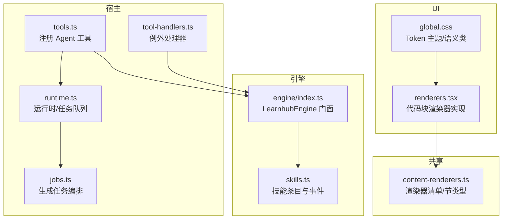
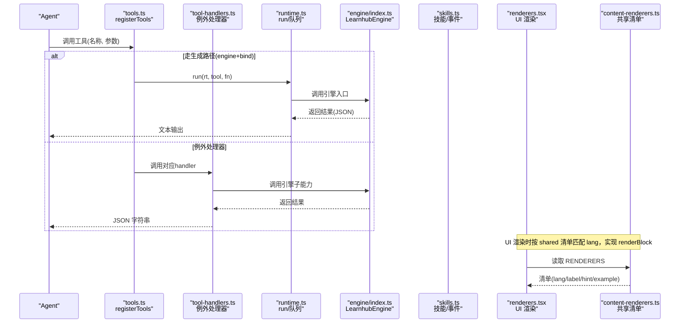
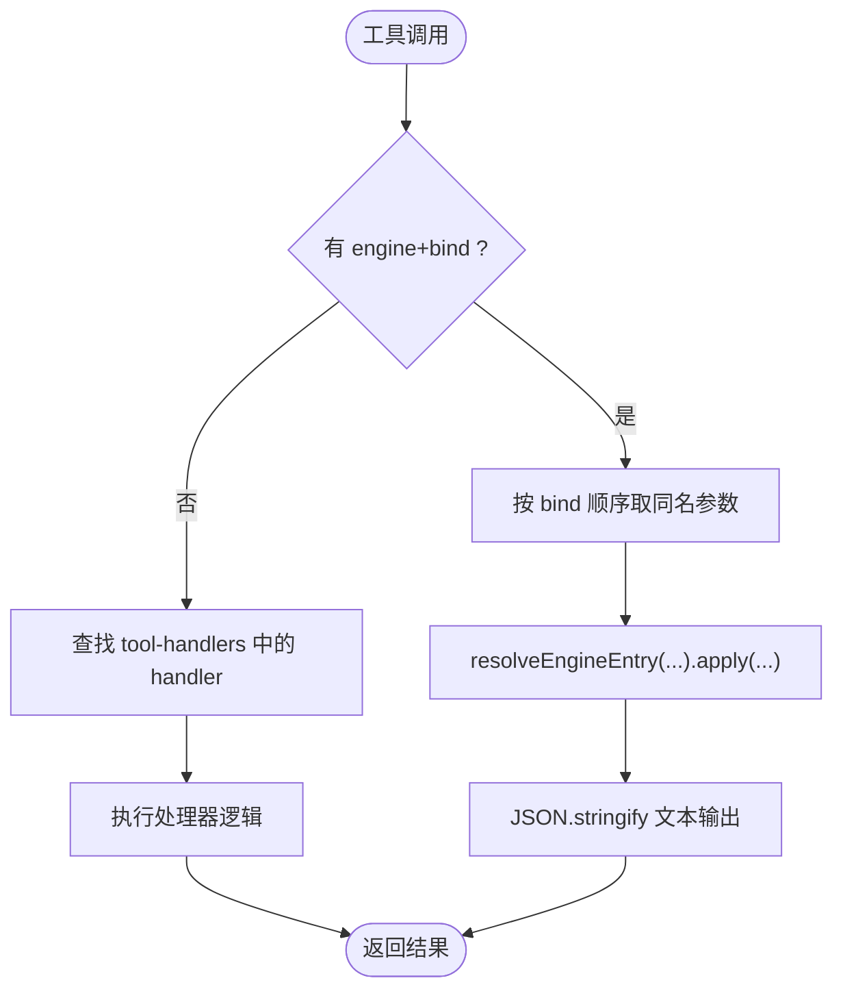
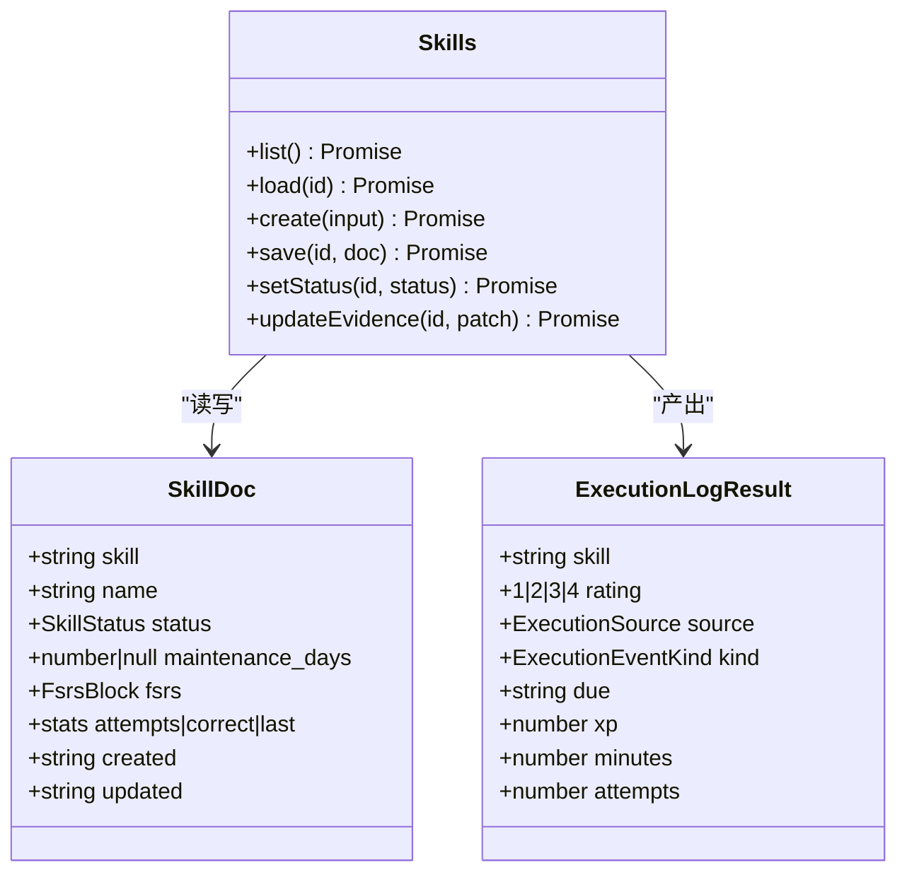
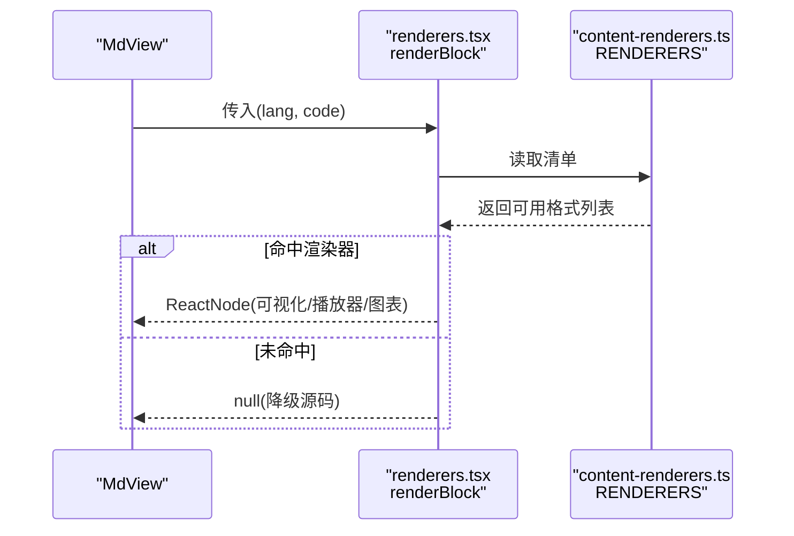
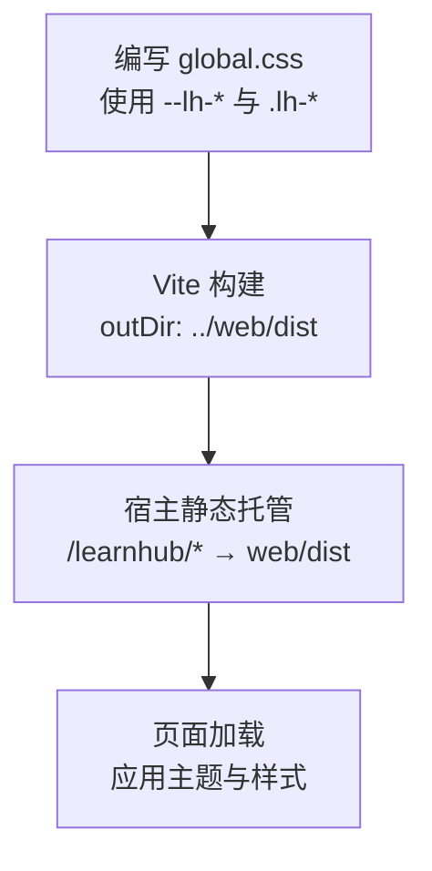
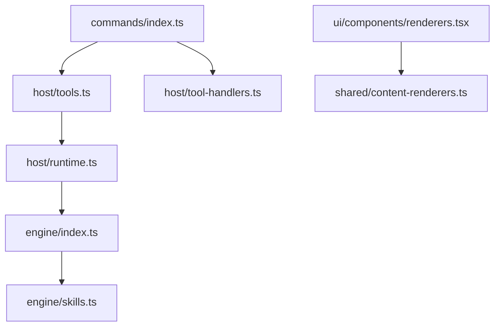

# 扩展开发

<cite>
**本文引用的文件**
- [src/host/tools.ts](file://src/host/tools.ts)
- [src/host/tool-handlers.ts](file://src/host/tool-handlers.ts)
- [src/commands/index.ts](file://src/commands/index.ts)
- [src/engine/skills.ts](file://src/engine/skills.ts)
- [shared/content-renderers.ts](file://shared/content-renderers.ts)
- [ui/src/components/renderers.tsx](file://ui/src/components/renderers.tsx)
- [ui/src/global.css](file://ui/src/global.css)
- [src/engine/index.ts](file://src/engine/index.ts)
- [src/host/runtime.ts](file://src/host/runtime.ts)
- [src/host/jobs.ts](file://src/host/jobs.ts)
- [ui/vite.config.ts](file://ui/vite.config.ts)
- [preset/learnhub/preset.yml](file://preset/learnhub/preset.yml)
</cite>

## 目录
1. [简介](#简介)
2. [项目结构](#项目结构)
3. [核心组件](#核心组件)
4. [架构总览](#架构总览)
5. [详细组件分析](#详细组件分析)
6. [依赖关系分析](#依赖关系分析)
7. [性能考虑](#性能考虑)
8. [故障排查指南](#故障排查指南)
9. [结论](#结论)
10. [附录：扩展开发与发布清单](#附录：扩展开发与发布清单)

## 简介
本指南面向希望为学习平台进行扩展开发的工程师与内容创作者，围绕插件系统的架构与扩展点设计，系统讲解以下主题：
- 自定义 Agent 工具的开发流程（工具定义、参数处理、错误处理）
- 技能系统的实现机制（技能注册、执行上下文、结果处理）
- 内容渲染器的开发方法（新增格式、显示逻辑、与引擎提示词同步）
- 主题定制与样式覆盖方案（Token 驱动、语义类、构建产物部署）
- 扩展包的发布与分发机制（面板构建、宿主装配、配置注入）
- 最佳实践与性能优化建议
- 具体示例与模板代码路径指引

## 项目结构
仓库采用“宿主-引擎-UI-共享”的分层组织方式：
- 宿主层（host）：暴露工具面与 HTTP 路由，负责装配命令表、调度生成任务、桥接外部服务。
- 引擎层（engine）：提供领域能力门面（LearnhubEngine），封装数据访问、子系统与业务规则。
- UI 层（ui）：React/Vite 前端，按 shared 清单实现代码块渲染器，消费 Token 主题。
- 共享层（shared）：跨端共享的渲染器清单与节类型规范，保证引擎提示词与 UI 渲染一致。

**图表来源**
- [src/host/tools.ts:101-125](file://src/host/tools.ts#L101-L125)
- [src/host/tool-handlers.ts:23-287](file://src/host/tool-handlers.ts#L23-L287)
- [src/engine/index.ts:149-398](file://src/engine/index.ts#L149-L398)
- [src/engine/skills.ts:169-244](file://src/engine/skills.ts#L169-L244)
- [shared/content-renderers.ts:24-67](file://shared/content-renderers.ts#L24-L67)
- [ui/src/components/renderers.tsx:140-155](file://ui/src/components/renderers.tsx#L140-L155)
- [ui/src/global.css:1-20](file://ui/src/global.css#L1-L20)

**章节来源**
- [src/host/tools.ts:1-126](file://src/host/tools.ts#L1-L126)
- [src/host/tool-handlers.ts:1-288](file://src/host/tool-handlers.ts#L1-L288)
- [src/commands/index.ts:1-72](file://src/commands/index.ts#L1-L72)
- [shared/content-renderers.ts:1-197](file://shared/content-renderers.ts#L1-L197)
- [ui/src/components/renderers.tsx:1-166](file://ui/src/components/renderers.tsx#L1-L166)
- [ui/src/global.css:1-200](file://ui/src/global.css#L1-L200)
- [src/engine/index.ts:1-800](file://src/engine/index.ts#L1-L800)

## 核心组件
- 命令注册表与双通道适配：通过单一命令表将 agent 通道映射到工具面，panel 通道映射到 HTTP 路由，确保名称、描述、schema 与输出类型一致。
- 工具面注册与例外处理器：声明式工具由注册表驱动；形状复杂或需实参换算的工具走例外 handler。
- 技能系统：技能条目持久化、维护节拍与 FSRS 推进、执行事件落账与 XP 结算。
- 内容渲染器：shared 清单作为唯一事实源，UI 按 lang 分发渲染，未注册降级源码显示。
- 主题与样式：Token 驱动的 CSS 变量与语义类，构建产物由 Vite 输出至宿主静态目录。

**章节来源**
- [src/commands/index.ts:25-72](file://src/commands/index.ts#L25-L72)
- [src/host/tools.ts:72-125](file://src/host/tools.ts#L72-L125)
- [src/host/tool-handlers.ts:23-287](file://src/host/tool-handlers.ts#L23-L287)
- [src/engine/skills.ts:35-244](file://src/engine/skills.ts#L35-L244)
- [shared/content-renderers.ts:24-197](file://shared/content-renderers.ts#L24-L197)
- [ui/src/components/renderers.tsx:140-166](file://ui/src/components/renderers.tsx#L140-L166)
- [ui/src/global.css:1-200](file://ui/src/global.css#L1-L200)

## 架构总览
下图展示从 Agent 调用到引擎执行的完整链路，以及 UI 渲染器与共享清单的同步机制。

**图表来源**
- [src/host/tools.ts:101-125](file://src/host/tools.ts#L101-L125)
- [src/host/tool-handlers.ts:23-287](file://src/host/tool-handlers.ts#L23-L287)
- [src/engine/index.ts:149-398](file://src/engine/index.ts#L149-L398)
- [src/engine/skills.ts:169-244](file://src/engine/skills.ts#L169-L244)
- [ui/src/components/renderers.tsx:140-166](file://ui/src/components/renderers.tsx#L140-L166)
- [shared/content-renderers.ts:24-67](file://shared/content-renderers.ts#L24-L67)

## 详细组件分析

### 自定义 Agent 工具开发流程
- 工具定义：在命令域文件中声明命令 id、摘要、参数 schema、agent 通道与可选 engine/bind。
- 参数投影：通过 sdkParameters 将内部 args 转换为 defineTool 的 parameters，并做白名单过滤。
- 执行路径：
  - 生成路径：存在 engine 与 bind 时，按 bind 顺序取同名键，调用 resolveEngineEntry 并包装为 JSON 文本输出。
  - 例外路径：无 engine/bind 时，交由 tool-handlers 中对应 handler 处理（如需要实参换算、形状加工）。
- 错误处理：参数校验失败直接抛错；引擎侧 Broken/Missing 统一以明确错误信息上抛；长任务通过 jobs 队列异步完成并等待终态。

**图表来源**
- [src/host/tools.ts:72-125](file://src/host/tools.ts#L72-L125)
- [src/host/tool-handlers.ts:23-287](file://src/host/tool-handlers.ts#L23-L287)

**章节来源**
- [src/host/tools.ts:1-126](file://src/host/tools.ts#L1-L126)
- [src/host/tool-handlers.ts:1-288](file://src/host/tool-handlers.ts#L1-L288)
- [src/commands/index.ts:25-72](file://src/commands/index.ts#L25-L72)

### 技能系统：注册、执行上下文与结果处理
- 技能条目：SkillDoc 包含 skill/name/status/maintenance_days/fsrs/stats 等字段，持久化为 YAML。
- 维护节拍：clampMaintenanceDays 对 maintenance_days 做范围钳制；laneDue 计算 due 与维持帽的较小者；laneEventKind 区分 acquisition/maintenance。
- 执行事件：ratingFromEvidence 基于准确率与自主求助次数映射到 1-4 评分；executionLog 写入技能推进与 XP 账本。
- 生命周期：create/load/save/updateEvidence/setStatus 提供完整的 CRUD 与状态管理。

**图表来源**
- [src/engine/skills.ts:51-164](file://src/engine/skills.ts#L51-L164)
- [src/engine/skills.ts:169-244](file://src/engine/skills.ts#L169-L244)

**章节来源**
- [src/engine/skills.ts:1-260](file://src/engine/skills.ts#L1-L260)

### 内容渲染器：新增格式与显示逻辑
- 共享清单：RENDERERS 定义支持的代码块语言、标签、提示与示例；SECTION_TYPES 定义节类型与创作要求。
- UI 实现：BLOCK_RENDERERS 按 lang 分发渲染；未注册 lang 降级源码显示；verifyRendererCoverage 在构建期检查遗漏。
- 交互协议：interactive 块通过 postMessage 上报完成与成绩，SettleContext 控制是否上报练习档案。

**图表来源**
- [shared/content-renderers.ts:24-67](file://shared/content-renderers.ts#L24-L67)
- [ui/src/components/renderers.tsx:140-166](file://ui/src/components/renderers.tsx#L140-L166)

**章节来源**
- [shared/content-renderers.ts:1-197](file://shared/content-renderers.ts#L1-L197)
- [ui/src/components/renderers.tsx:1-166](file://ui/src/components/renderers.tsx#L1-L166)

### 主题定制与样式覆盖
- Token 驱动：全局样式使用 --lh-* 变量，避免硬编码色值；壳级规则仅消费 tokens。
- 语义类：通过 .lh-* 语义类组织布局与排版，动态值保留内联 style，静态样式集中声明。
- 构建部署：Vite 输出到 ../web/dist，宿主以 /learnhub/* 前缀静态资源提供服务。

**图表来源**
- [ui/src/global.css:1-200](file://ui/src/global.css#L1-L200)
- [ui/vite.config.ts:1-14](file://ui/vite.config.ts#L1-L14)

**章节来源**
- [ui/src/global.css:1-200](file://ui/src/global.css#L1-L200)
- [ui/vite.config.ts:1-14](file://ui/vite.config.ts#L1-L14)

### 扩展包发布与分发机制
- 面板构建：Vite 配置将产物输出到 ../web/dist，供宿主静态服务。
- 宿主装配：通过 preset 与用户根组合文件注入 persona、技能库与子代理。
- 命令装配：COMMANDS 聚合各域命令，COMMAND_LIST 用于遍历注册；BY_TOOL/BY_ROUTE 提供索引。

**图表来源**
- [preset/learnhub/preset.yml:1-3](file://preset/learnhub/preset.yml#L1-L3)
- [src/commands/index.ts:25-72](file://src/commands/index.ts#L25-L72)
- [src/host/tools.ts:101-125](file://src/host/tools.ts#L101-L125)

**章节来源**
- [preset/learnhub/preset.yml:1-3](file://preset/learnhub/preset.yml#L1-L3)
- [src/commands/index.ts:1-72](file://src/commands/index.ts#L1-L72)
- [ui/vite.config.ts:1-14](file://ui/vite.config.ts#L1-L14)

## 依赖关系分析
- 命令表是单点装配：所有 agent 工具与 panel 路由均源自 COMMANDS，确保唯一性与一致性。
- 工具面与引擎解耦：tools.ts 通过 runtime.run 与引擎门面交互，不直接耦合内部模块。
- 技能系统与引擎门面的协作：Skills 通过 LearnhubEngine.skills 暴露给宿主工具链。
- UI 与共享清单强绑定：renderers.tsx 必须覆盖 shared 清单中的所有 lang（除 math）。

**图表来源**
- [src/commands/index.ts:25-72](file://src/commands/index.ts#L25-L72)
- [src/host/tools.ts:101-125](file://src/host/tools.ts#L101-L125)
- [src/host/tool-handlers.ts:23-287](file://src/host/tool-handlers.ts#L23-L287)
- [src/engine/index.ts:149-398](file://src/engine/index.ts#L149-L398)
- [src/engine/skills.ts:169-244](file://src/engine/skills.ts#L169-L244)
- [ui/src/components/renderers.tsx:140-166](file://ui/src/components/renderers.tsx#L140-L166)
- [shared/content-renderers.ts:24-67](file://shared/content-renderers.ts#L24-L67)

**章节来源**
- [src/commands/index.ts:1-72](file://src/commands/index.ts#L1-L72)
- [src/host/tools.ts:1-126](file://src/host/tools.ts#L1-L126)
- [src/host/tool-handlers.ts:1-288](file://src/host/tool-handlers.ts#L1-L288)
- [src/engine/index.ts:1-800](file://src/engine/index.ts#L1-L800)
- [src/engine/skills.ts:1-260](file://src/engine/skills.ts#L1-L260)
- [ui/src/components/renderers.tsx:1-166](file://ui/src/components/renderers.tsx#L1-L166)
- [shared/content-renderers.ts:1-197](file://shared/content-renderers.ts#L1-L197)

## 性能考虑
- 参数推断与类型安全：通过 schema 推导参数类型，减少重复手写类型，降低维护成本与运行期校验开销。
- 长任务异步化：生成类操作入队 jobs，避免阻塞工具调用；等待终态后返回结果。
- 渲染器懒加载：Mermaid/ECharts 等重型库按需 import，首屏更快。
- 主题与样式：Token 驱动减少重绘与样式冲突；语义类集中管理便于复用与维护。

[本节为通用指导，无需特定文件引用]

## 故障排查指南
- 工具参数错误：检查 command 的 args schema 与 SDK_KEYS 白名单；非法值会立即抛错。
- 引擎 Broken/Missing：技能条目、笔记、题库等读盘失败会抛出明确错误信息，定位路径与原因。
- 渲染器缺失：构建期 verifyRendererCoverage 会报错提示缺少 UI 实现。
- 生成任务失败：jobs 队列记录任务状态与消息，查询终态并修复。

**章节来源**
- [src/host/tools.ts:72-125](file://src/host/tools.ts#L72-L125)
- [src/engine/skills.ts:123-207](file://src/engine/skills.ts#L123-L207)
- [ui/src/components/renderers.tsx:157-166](file://ui/src/components/renderers.tsx#L157-L166)
- [src/host/tool-handlers.ts:82-99](file://src/host/tool-handlers.ts#L82-L99)

## 结论
本扩展体系以“命令表为中心”的双通道适配为核心，结合共享清单与 Token 主题，形成高内聚、低耦合的可扩展架构。通过声明式工具注册与例外处理器并存的方式，既保证了大规模工具的易维护性，又保留了复杂场景的灵活性。技能系统与内容渲染器分别覆盖了行为扩展与展示扩展的关键点，配合构建与发布流程，可快速交付高质量扩展包。

[本节为总结性内容，无需特定文件引用]

## 附录：扩展开发与发布清单
- 新增 Agent 工具
  - 在命令域文件中声明命令 id、摘要、args schema、agent 通道与 engine/bind（如需）。
  - 若需特殊参数换算或形状加工，在 tool-handlers 中添加对应 handler。
  - 参考路径：[src/commands/index.ts:25-72](file://src/commands/index.ts#L25-L72)、[src/host/tools.ts:72-125](file://src/host/tools.ts#L72-L125)、[src/host/tool-handlers.ts:23-287](file://src/host/tool-handlers.ts#L23-L287)
- 新增技能条目
  - 使用 Skills.create 创建，设置 maintenance_days 与初始状态；通过 updateEvidence 推进 FSRS 与 stats。
  - 参考路径：[src/engine/skills.ts:209-244](file://src/engine/skills.ts#L209-L244)
- 新增内容渲染器
  - 在 shared/content-renderers.ts 的 RENDERERS 添加 lang 项；在 ui/components/renderers.tsx 的 BLOCK_RENDERERS 实现渲染。
  - 参考路径：[shared/content-renderers.ts:24-67](file://shared/content-renderers.ts#L24-L67)、[ui/src/components/renderers.tsx:140-166](file://ui/src/components/renderers.tsx#L140-L166)
- 主题定制
  - 使用 --lh-* 变量与 .lh-* 语义类；修改 global.css；构建产物输出到 ../web/dist。
  - 参考路径：[ui/src/global.css:1-200](file://ui/src/global.css#L1-L200)、[ui/vite.config.ts:1-14](file://ui/vite.config.ts#L1-L14)
- 发布与分发
  - 更新 preset.yml 注入 persona/技能库/子代理；确保命令装配与工具注册生效。
  - 参考路径：[preset/learnhub/preset.yml:1-3](file://preset/learnhub/preset.yml#L1-L3)、[src/commands/index.ts:25-72](file://src/commands/index.ts#L25-L72)

[本节为清单型内容，无需特定文件引用]