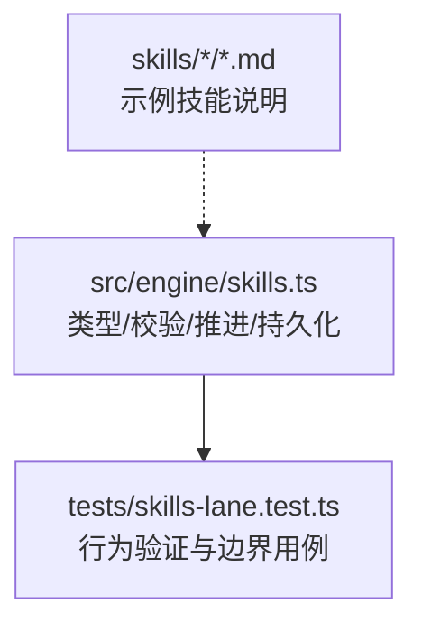
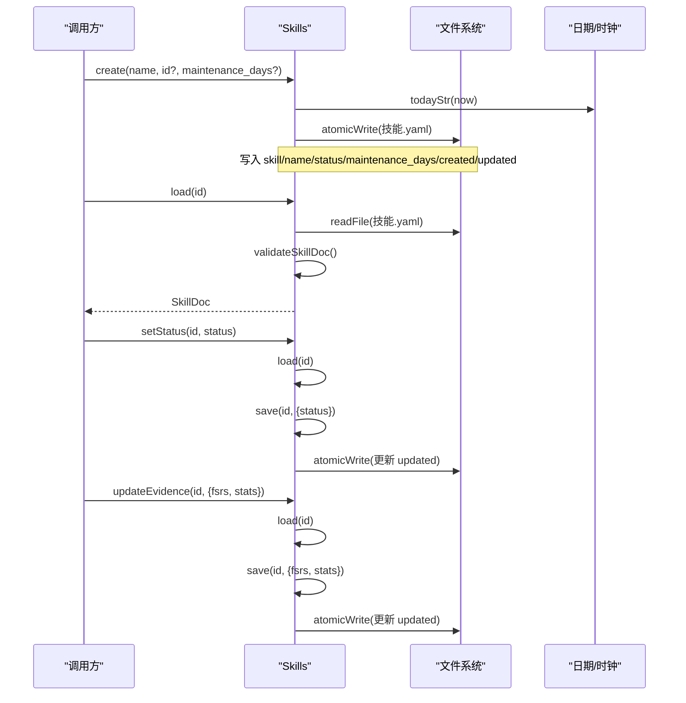
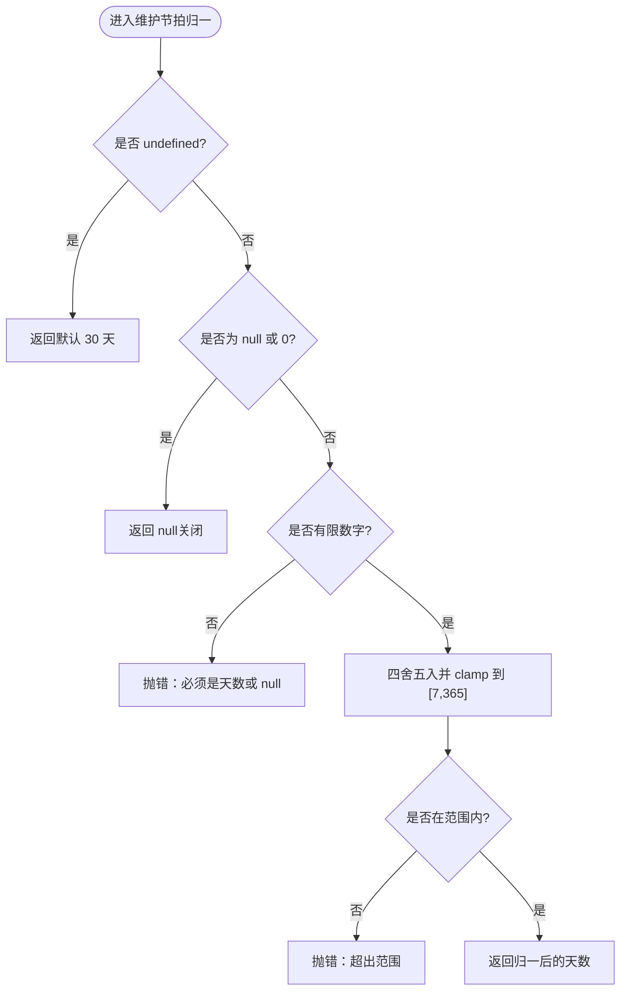
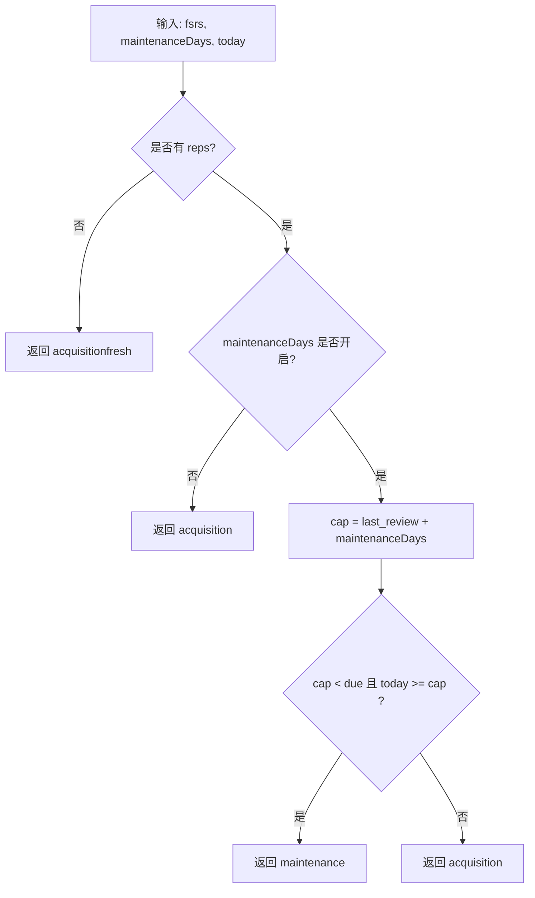
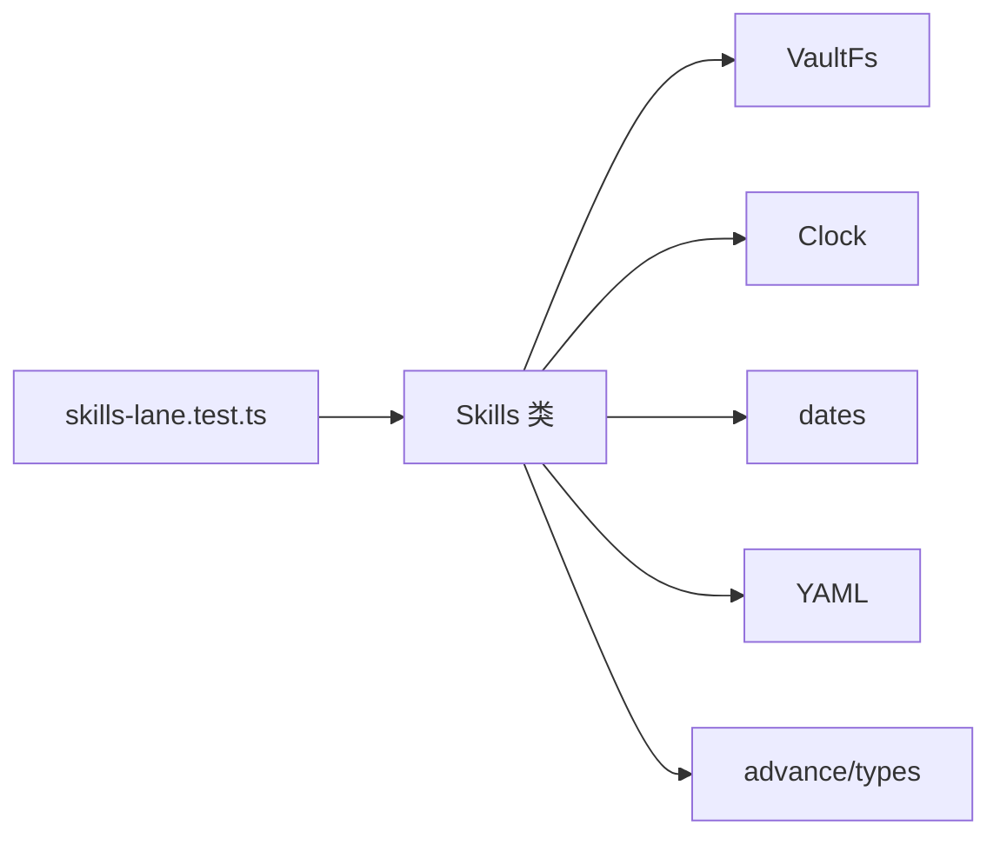

# 技能定义

<cite>
**本文引用的文件**
- [src/engine/skills.ts](file://src/engine/skills.ts)
- [tests/skills-lane.test.ts](file://tests/skills-lane.test.ts)
- [skills/learnhub-graph-optimize/SKILL.md](file://skills/learnhub-graph-optimize/SKILL.md)
- [skills/learnhub-manim/SKILL.md](file://skills/learnhub-manim/SKILL.md)
- [skills/learnhub-study/SKILL.md](file://skills/learnhub-study/SKILL.md)
</cite>

## 目录
1. [简介](#简介)
2. [项目结构](#项目结构)
3. [核心组件](#核心组件)
4. [架构总览](#架构总览)
5. [详细组件分析](#详细组件分析)
6. [依赖关系分析](#依赖关系分析)
7. [性能与行为特性](#性能与行为特性)
8. [故障排查指南](#故障排查指南)
9. [结论](#结论)
10. [附录：YAML 示例与最佳实践](#附录yaml-示例与最佳实践)

## 简介
本文件面向“技能”这一实体，系统性说明技能条目（SkillDoc）的数据结构与字段规范、元数据约束、状态管理（active/archived）、维护节拍（maintenance_days）的配置与默认值处理、以及技能 YAML 文件的组织与命名规范。文档同时给出基于代码的流程图与时序图，帮助读者快速理解技能的调度、到期判定、事件分类与落盘流程。

## 项目结构
技能系统由引擎侧的类型与逻辑实现（src/engine/skills.ts）与测试用例（tests/skills-lane.test.ts）共同构成；示例技能以 SKILL.md 形式存在于 skills 目录下，用于描述该技能的工作流与边界。

图表来源
- [src/engine/skills.ts:1-260](file://src/engine/skills.ts#L1-L260)
- [tests/skills-lane.test.ts:1-249](file://tests/skills-lane.test.ts#L1-L249)

章节来源
- [src/engine/skills.ts:1-260](file://src/engine/skills.ts#L1-L260)
- [tests/skills-lane.test.ts:1-249](file://tests/skills-lane.test.ts#L1-L249)

## 核心组件
- SkillDoc：技能条目的数据结构，承载元数据与调度状态。
- Skills：技能 CRUD、状态切换、证据写回等能力。
- 纯函数：clampMaintenanceDays、laneDue、laneEventKind、ratingFromEvidence，分别负责维护节拍归一、生效到期计算、事件种类判定、可观测证据到评级的映射。
- ExecutionSource/ExecutionEventKind：执行来源与事件种类枚举，用于区分 auto/self/ai 与 acquisition/maintenance。

章节来源
- [src/engine/skills.ts:35-65](file://src/engine/skills.ts#L35-L65)
- [src/engine/skills.ts:67-105](file://src/engine/skills.ts#L67-L105)
- [src/engine/skills.ts:107-121](file://src/engine/skills.ts#L107-L121)
- [src/engine/skills.ts:169-244](file://src/engine/skills.ts#L169-L244)

## 架构总览
技能系统围绕“技能条目 + 执行事件”的 lane 进行独立调度，不复用题目卡、不进复习队列、不写节点 frontmatter。其关键流程如下：

图表来源
- [src/engine/skills.ts:196-244](file://src/engine/skills.ts#L196-L244)

## 详细组件分析

### SkillDoc 数据结构与字段规范
- skill：安全文件名，唯一标识。必填字符串。
- name：人类可读名称。必填字符串。
- status：技能状态，取值 active 或 archived。必填。
- maintenance_days：维持节拍上限（天）。可为 null（关闭），或数字（被 clamp 到 [7,365]）。undefined 时取默认值。
- fsrs：可选，FSRS 区块，记录稳定性、难度、到期日、上次复习时间等。
- stats：可选，统计信息，包含 attempts、correct、last（学习日推进门）。
- created/updated：创建与更新时间戳。必填字符串。

校验规则要点
- 空 skill/name 直接报错。
- status 必须为 active/archived。
- maintenance_days 通过 clamp 归一：undefined→默认；null/0→关闭；非法数值抛错。
- created/updated 必须存在且非空。

章节来源
- [src/engine/skills.ts:51-65](file://src/engine/skills.ts#L51-L65)
- [src/engine/skills.ts:123-150](file://src/engine/skills.ts#L123-L150)

### 技能状态管理（active / archived）
- active：正常参与清单与调度。
- archived：归档标签，仅收纳，不参与后续执行。
- 状态切换通过 setStatus 完成，内部会加载并保存，自动更新 updated 时间戳。
- 已归档的技能在执行日志入口会被拒绝（见测试断言）。

使用场景建议
- 长期不再练习但保留历史数据的技能，先归档再清理。
- 实验性技能在验证期保持 active，稳定后根据策略归档。

章节来源
- [src/engine/skills.ts:35-36](file://src/engine/skills.ts#L35-L36)
- [src/engine/skills.ts:231-237](file://src/engine/skills.ts#L231-L237)
- [tests/skills-lane.test.ts:203-217](file://tests/skills-lane.test.ts#L203-L217)

### 维护节拍（maintenance_days）配置与默认值
- 默认值：未设置时为 30 天。
- 关闭：传 null 或 0，表示关闭维持节拍，此时完全由 FSRS due 驱动。
- 合法范围：[7, 365] 天，超出范围抛错。
- 作用：当「上次事件日 + 维持帽」早于 FSRS due 且已到当天，则视为 maintenance 事件；否则为 acquisition。

图表来源
- [src/engine/skills.ts:67-80](file://src/engine/skills.ts#L67-L80)

章节来源
- [src/engine/skills.ts:45-49](file://src/engine/skills.ts#L45-L49)
- [src/engine/skills.ts:67-80](file://src/engine/skills.ts#L67-L80)
- [tests/skills-lane.test.ts:24-34](file://tests/skills-lane.test.ts#L24-L34)

### 到期判定与事件种类（acquisition vs maintenance）
- 生效到期（laneDue）：比较 FSRS due 与「上次事件日 + 维持帽」，取较早者；若无 fsrs.reps（fresh）则返回 null。
- 事件种类（laneEventKind）：若维护帽严格早于 FSRS due 且今天已到帽，则为 maintenance；其他情况（含 fresh、未到期的提前练习、FSRS due 先到或同日）均为 acquisition。

图表来源
- [src/engine/skills.ts:82-105](file://src/engine/skills.ts#L82-L105)

章节来源
- [src/engine/skills.ts:82-105](file://src/engine/skills.ts#L82-L105)
- [tests/skills-lane.test.ts:46-70](file://tests/skills-lane.test.ts#L46-L70)

### 可观测证据到评级映射（auto 来源）
- 输入：accuracy（0–1 浮点）、self_help（≥0 整数，缺省为 0）。
- 准确率分带：≥0.9→4，≥0.7→3，≥0.4→2，<0.4→1。
- 自主求助超过 1 次每次降一档（最多降至 1）。
- 无 accuracy 时禁止直喂评分，需退回 self 自评档。

章节来源
- [src/engine/skills.ts:107-121](file://src/engine/skills.ts#L107-L121)
- [tests/skills-lane.test.ts:74-85](file://tests/skills-lane.test.ts#L74-L85)

### 技能生命周期与持久化
- 创建：create 接受 name、可选 id、可选 maintenance_days；生成 SkillDoc 并原子写入 YAML。
- 读取：load 解析 YAML 并校验，不存在报 Missing，格式错误报 Broken。
- 保存：save 全量写回并更新 updated。
- 状态切换：setStatus 修改 status 并保存。
- 证据更新：updateEvidence 整体替换 fsrs/stats。

章节来源
- [src/engine/skills.ts:179-244](file://src/engine/skills.ts#L179-L244)

## 依赖关系分析
- Skills 依赖：
  - VaultFs：文件系统抽象，用于读/写技能 YAML。
  - Clock：获取当前时间，用于生成 created/updated 与日期计算。
  - dates：日期加减与格式化。
  - yaml：YAML 序列化/反序列化。
  - advance/types：AdvanceCard/FsrsBlock 等类型投影。
- 测试覆盖：
  - 维护节拍 clamp、到期与事件种类、证据映射、执行日志全链、红线约束（不复用题目卡、不进复习队列、不写练习流水）、归档拒绝等。

图表来源
- [src/engine/skills.ts:26-34](file://src/engine/skills.ts#L26-L34)
- [tests/skills-lane.test.ts:1-20](file://tests/skills-lane.test.ts#L1-L20)

章节来源
- [src/engine/skills.ts:26-34](file://src/engine/skills.ts#L26-L34)
- [tests/skills-lane.test.ts:1-20](file://tests/skills-lane.test.ts#L1-L20)

## 性能与行为特性
- 维护节拍避免低频接触导致的遗忘：通过「上次事件日 + 维持帽」将到期提前，确保定期唤醒。
- 一学习日一次推进：同一技能在同一天内重复提交会被拒绝，防止刷分与无效推进。
- 执行事件不污染题目体系：不复用题目卡、不进复习队列、不写练习作答流水，保证数据域隔离。
- 归档即停止：已归档技能拒绝执行日志写入。

章节来源
- [tests/skills-lane.test.ts:149-181](file://tests/skills-lane.test.ts#L149-L181)
- [tests/skills-lane.test.ts:203-227](file://tests/skills-lane.test.ts#L203-L227)

## 故障排查指南
- Missing：技能文件不存在。请先创建技能条目。
- Broken：YAML 无法解析或字段校验失败。检查 frontmatter 键名与类型，确保 maintenance_days 为数字/null，status 为 active/archived。
- 维护节拍越界：maintenance_days 必须在 [7,365] 或 null；传入 0 等同于关闭。
- 证据映射失败：auto 来源必须提供 0–1 的 accuracy；否则退回 self 自评档。
- 同日重复提交：同一技能每天只能推进一次，等待次日或更换技能。
- 归档后执行：已归档技能不可执行，需先恢复 active。

章节来源
- [src/engine/skills.ts:196-207](file://src/engine/skills.ts#L196-L207)
- [src/engine/skills.ts:123-150](file://src/engine/skills.ts#L123-L150)
- [tests/skills-lane.test.ts:229-248](file://tests/skills-lane.test.ts#L229-L248)

## 结论
技能系统通过清晰的 SkillDoc 结构与严格的校验规则，实现了独立的技能练习通道。维护节拍机制确保低频技能不被遗忘，而 acquisition/maintenance 的事件分类让不同性质的练习得到差异化处理。配合 active/archived 的状态管理，既能灵活启用新技能，又能稳妥地归档历史技能。

## 附录：YAML 示例与最佳实践

### 技能 YAML 字段说明
- 必需字段
  - skill：安全文件名，唯一标识。
  - name：人类可读名称。
  - status：active 或 archived。
  - maintenance_days：数字（7–365）或 null（关闭）；省略时默认 30。
  - created/updated：时间戳字符串。
- 可选字段
  - fsrs：FSRS 区块，记录稳定性、难度、到期日、上次复习时间等。
  - stats：统计信息，包含 attempts、correct、last。

### 完整示例（参考路径）
- 示例技能说明文件（SKILL.md）位于 skills 目录下，可作为技能工作流的参考：
  - [skills/learnhub-graph-optimize/SKILL.md](file://skills/learnhub-graph-optimize/SKILL.md)
  - [skills/learnhub-manim/SKILL.md](file://skills/learnhub-manim/SKILL.md)
  - [skills/learnhub-study/SKILL.md](file://skills/learnhub-study/SKILL.md)

注意：上述文件为技能工作流说明，并非 SkillDoc 的 YAML frontmatter。SkillDoc 的 YAML 由引擎创建与保存，字段遵循前述规范。

### 最佳实践
- 命名与 ID
  - 使用简短、语义化的英文或拼音作为 skill id，避免特殊字符与路径穿越（如 ..）。
  - name 应清晰表达技能领域（如“吉他”“游泳”）。
- 维护节拍
  - 日常高频练习可关闭 maintenance_days（传 null），完全依赖 FSRS due。
  - 低频技能建议设置为 7–30 天，确保定期唤醒。
- 状态管理
  - 活跃期保持 active；长期不练但保留历史的技能建议归档。
- 证据与评分
  - auto 来源需提供 accurate 的可观测证据（accuracy 0–1），必要时附带 self_help 次数。
  - self/ai 来源需明确 rating（1–4 整数）与 minutes（1–1440 分钟）。
- 文件组织
  - 每个技能一个目录，内含 SKILL.md 描述工作流；SkillDoc 的 YAML 由引擎按 id 生成与管理。

章节来源
- [src/engine/skills.ts:51-65](file://src/engine/skills.ts#L51-L65)
- [src/engine/skills.ts:209-222](file://src/engine/skills.ts#L209-L222)
- [skills/learnhub-graph-optimize/SKILL.md:1-37](file://skills/learnhub-graph-optimize/SKILL.md#L1-L37)
- [skills/learnhub-manim/SKILL.md:1-51](file://skills/learnhub-manim/SKILL.md#L1-L51)
- [skills/learnhub-study/SKILL.md:1-34](file://skills/learnhub-study/SKILL.md#L1-L34)