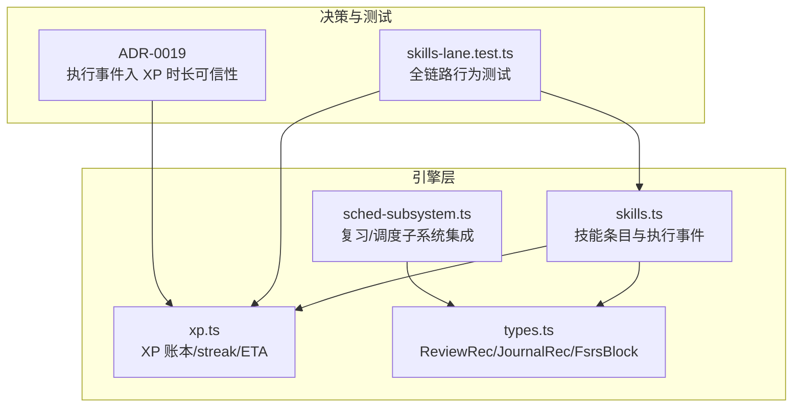
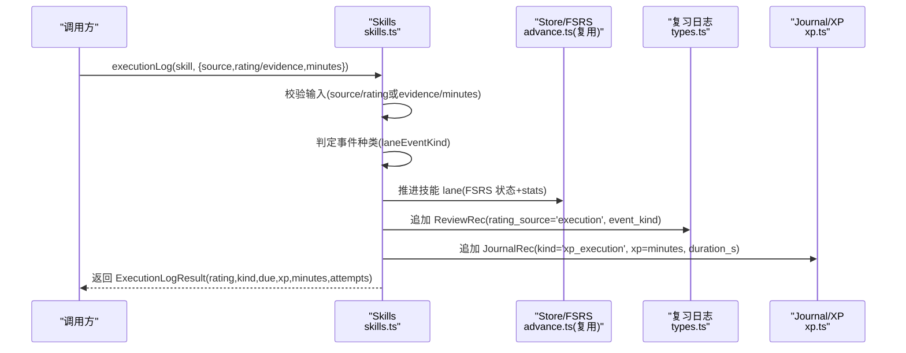
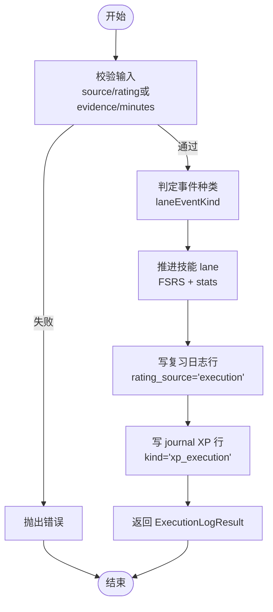
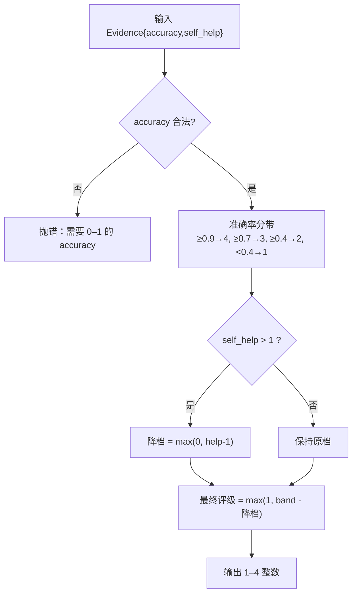
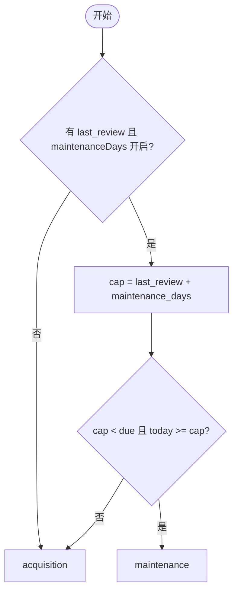
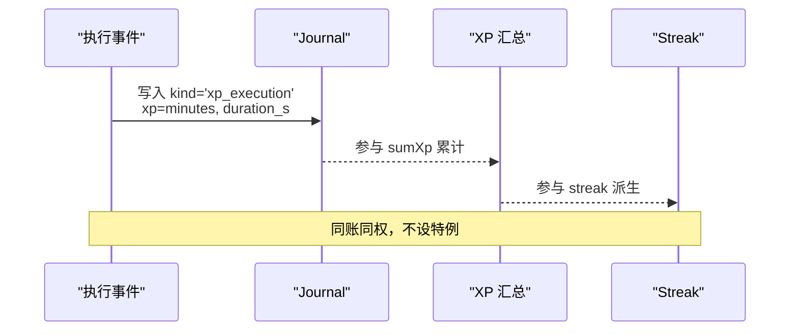
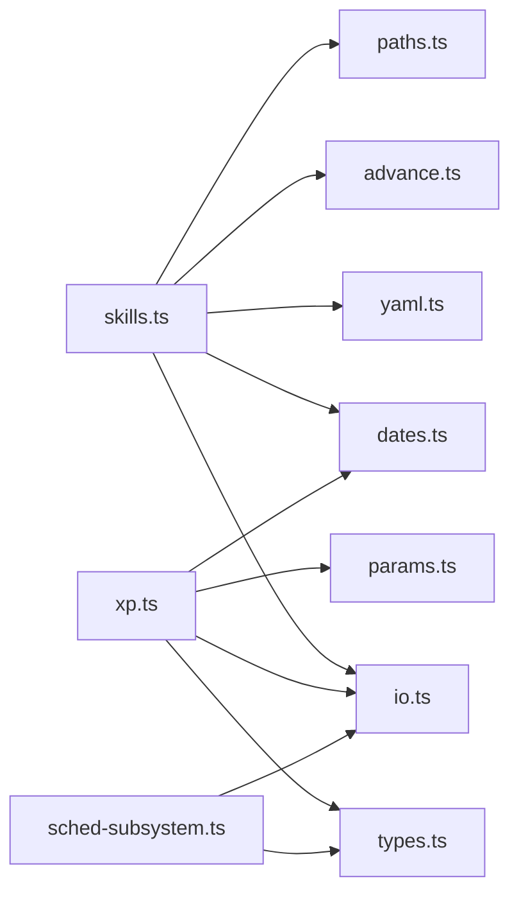

# 技能执行

<cite>
**本文引用的文件**
- [skills.ts](file://src/engine/skills.ts)
- [xp.ts](file://src/engine/xp.ts)
- [types.ts](file://src/engine/types.ts)
- [0019-execution-event-xp-duration-credibility.md](file://docs/adr/0019-execution-event-xp-duration-credibility.md)
- [skills-lane.test.ts](file://tests/skills-lane.test.ts)
- [sched-subsystem.ts](file://src/engine/sched-subsystem.ts)
</cite>

## 目录
1. [简介](#简介)
2. [项目结构](#项目结构)
3. [核心组件](#核心组件)
4. [架构总览](#架构总览)
5. [详细组件分析](#详细组件分析)
6. [依赖关系分析](#依赖关系分析)
7. [性能考量](#性能考量)
8. [故障排查指南](#故障排查指南)
9. [结论](#结论)
10. [附录](#附录)

## 简介
本文件聚焦“技能执行”子系统，系统性说明技能执行事件的生命周期、证据收集与验证、评分映射算法、事件种类判定（acquisition/maintenance）、XP 入账与专注时长记录、完整示例与错误处理方案，以及性能优化与调试技巧。该子系统为无界实践区提供独立于题目 FSRS 的调度 lane，通过执行事件驱动技能条目的维持与习得推进，并将真实专注时长计入 XP 账本与 streak。

## 项目结构
技能执行相关代码主要位于 engine 层：
- 技能条目与执行事件调度通道：skills.ts
- XP 时间账本与 streak/ETA：xp.ts
- 共享类型（ReviewRec/JournalRec/FsrsBlock 等）：types.ts
- ADR 决策文档（执行事件入 XP 的时长可信性判据）：0019-execution-event-xp-duration-credibility.md
- 行为测试覆盖全链路：skills-lane.test.ts
- 复习/调度子系统对 review-log/journal 的写入协同：sched-subsystem.ts

图表来源
- [skills.ts:1-260](file://src/engine/skills.ts#L1-L260)
- [xp.ts:1-184](file://src/engine/xp.ts#L1-L184)
- [types.ts:132-200](file://src/engine/types.ts#L132-L200)
- [sched-subsystem.ts:194-220](file://src/engine/sched-subsystem.ts#L194-L220)
- [0019-execution-event-xp-duration-credibility.md:1-13](file://docs/adr/0019-execution-event-xp-duration-credibility.md#L1-L13)
- [skills-lane.test.ts:1-249](file://tests/skills-lane.test.ts#L1-L249)

章节来源
- [skills.ts:1-260](file://src/engine/skills.ts#L1-L260)
- [xp.ts:1-184](file://src/engine/xp.ts#L1-L184)
- [types.ts:132-200](file://src/engine/types.ts#L132-L200)
- [sched-subsystem.ts:194-220](file://src/engine/sched-subsystem.ts#L194-L220)
- [0019-execution-event-xp-duration-credibility.md:1-13](file://docs/adr/0019-execution-event-xp-duration-credibility.md#L1-L13)
- [skills-lane.test.ts:1-249](file://tests/skills-lane.test.ts#L1-L249)

## 核心组件
- 技能条目与执行事件通道（skills.ts）
  - 维护技能条目状态（SkillDoc），包含 FSRS 块与统计信息；提供创建、加载、保存、归档、更新证据等方法。
  - 定义执行事件来源（ExecutionSource：auto/self/ai）、事件种类（acquisition/maintenance）。
  - 纯函数：维持帽 clamp、lane 生效到期（laneDue）、事件种类判定（laneEventKind）、可观测证据到评级映射（ratingFromEvidence）。
  - 公共拼装：执行事件复习日志身份（executionRowIdentity）、journal XP 行 detail（executionXpDetail）。
- XP 时间账本（xp.ts）
  - 作答 XP 结算、预算制定价、每日目标与日界、streak 计算、ETA 估算。
  - 支持非作答入账（如满分 bonus），执行事件以 kind='xp_execution' 写入 journal。
- 共享类型（types.ts）
  - ReviewRec 新增 rating_source='execution' 与 event_kind/exec_source 字段，用于区分执行事件与题目侧复习事件。
  - JournalRec 支持 duration_s 与 xp 字段，承载执行事件的时长与 XP。
- ADR-0019（0019-execution-event-xp-duration-credibility.md）
  - 明确执行事件按其原生专注时长入 XP 账本，同账同权进 streak，不设反作弊门。
- 行为测试（skills-lane.test.ts）
  - 覆盖纯函数与全链路行为：维持帽 clamp、laneDue/laneEventKind、证据映射、一 lane 一日一次、复习日志行与 journal XP 行、归档拒绝、红线约束等。

章节来源
- [skills.ts:35-164](file://src/engine/skills.ts#L35-L164)
- [xp.ts:20-184](file://src/engine/xp.ts#L20-L184)
- [types.ts:132-200](file://src/engine/types.ts#L132-L200)
- [0019-execution-event-xp-duration-credibility.md:1-13](file://docs/adr/0019-execution-event-xp-duration-credibility.md#L1-L13)
- [skills-lane.test.ts:22-249](file://tests/skills-lane.test.ts#L22-L249)

## 架构总览
技能执行事件从入口契约进入，经证据校验与评分映射，生成复习日志行与 journal XP 行，并推进技能条目的 FSRS 状态与统计计数。事件种类由维持帽与 FSRS due 共同决定，XP 按分钟数入账并参与 streak。

图表来源
- [skills.ts:107-164](file://src/engine/skills.ts#L107-L164)
- [types.ts:168-200](file://src/engine/types.ts#L168-L200)
- [xp.ts:122-184](file://src/engine/xp.ts#L122-L184)
- [skills-lane.test.ts:116-182](file://tests/skills-lane.test.ts#L116-L182)

## 详细组件分析

### 执行事件生命周期与处理流程
- 入口契约
  - 来源枚举：auto/self/ai；auto 必须提供可观测证据（accuracy/self_help），否则拒绝；self/ai 需提供整数评级 [1,4]。
  - 分钟数校验：必须为正整数且在合理范围（测试覆盖 1–1440）。
- 事件种类判定
  - 若存在上次事件且开启维持节拍，计算维持帽日期；当维持帽严格早于 FSRS due 且今天已到帽 → maintenance；其余（含 fresh、未到期的提前练习、FSRS due 先到或同日）→ acquisition。
- 推进与落盘
  - 使用 advance 内核推进技能 lane 的 FSRS 状态与 stats（attempts/correct/last）。
  - 写复习日志行：rating_source='execution'，event_kind=acquisition/maintenance，exec_source=auto/self/ai。
  - 写 journal XP 行：kind='xp_execution'，xp=minutes，duration_s=minutes*60，detail 使用 executionXpDetail 拼装。
- 结果返回
  - 返回 ExecutionLogResult，包含 rating、kind、due、xp、minutes、attempts。

图表来源
- [skills.ts:94-121](file://src/engine/skills.ts#L94-L121)
- [skills.ts:152-164](file://src/engine/skills.ts#L152-L164)
- [types.ts:168-200](file://src/engine/types.ts#L168-L200)
- [xp.ts:122-184](file://src/engine/xp.ts#L122-L184)
- [skills-lane.test.ts:116-182](file://tests/skills-lane.test.ts#L116-L182)

章节来源
- [skills.ts:94-164](file://src/engine/skills.ts#L94-L164)
- [types.ts:168-200](file://src/engine/types.ts#L168-L200)
- [xp.ts:122-184](file://src/engine/xp.ts#L122-L184)
- [skills-lane.test.ts:116-182](file://tests/skills-lane.test.ts#L116-L182)

### 执行证据（ExecutionEvidence）收集与验证机制
- 证据结构
  - accuracy：取值范围 [0,1] 的数值，表示可观测准确率。
  - self_help：自主求助次数，取整后作为降档信号。
- 验证规则
  - auto 来源必须提供 accuracy；若缺失或越界则抛错，强制退化为 self 自评档。
  - self_help 可选，缺省视为 0；非数字或非有限值忽略。
- 降级策略
  - 无可观测判据时，调用方必须改用学习者自评档（source='self' + rating）。

章节来源
- [skills.ts:107-121](file://src/engine/skills.ts#L107-L121)
- [skills-lane.test.ts:72-85](file://tests/skills-lane.test.ts#L72-L85)

### 执行评分映射（ratingFromEvidence）算法逻辑与准确率计算
- 算法步骤
  - 将 accuracy 分带：≥0.9→4，≥0.7→3，≥0.4→2，<0.4→1。
  - 根据 self_help 超过 1 次的部分每次降一档（help-1 次降档），最低不低于 1。
- 复杂度
  - 时间 O(1)，空间 O(1)。
- 准确性
  - 基于可观测证据的确定性映射，避免主观自由分；无 accuracy 时禁止直喂分数。

图表来源
- [skills.ts:113-121](file://src/engine/skills.ts#L113-L121)
- [skills-lane.test.ts:72-85](file://tests/skills-lane.test.ts#L72-L85)

章节来源
- [skills.ts:113-121](file://src/engine/skills.ts#L113-L121)
- [skills-lane.test.ts:72-85](file://tests/skills-lane.test.ts#L72-L85)

### 执行事件种类（acquisition/maintenance）判断规则
- 规则要点
  - 仅当存在上次事件且开启维持节拍时，才可能产生 maintenance。
  - 维持帽 = last_review + maintenance_days；若 cap < fs.due 且 today >= cap → maintenance。
  - 其他情况（fresh、未到期的提前练习、FSRS due 先到或同日）→ acquisition。
- 设计动机
  - 维持性复活确保久置技能低频接触有价值；帽先到的事件记 maintenance，会话内容形态为迷你重做+回放。

图表来源
- [skills.ts:82-105](file://src/engine/skills.ts#L82-L105)
- [skills-lane.test.ts:46-70](file://tests/skills-lane.test.ts#L46-L70)

章节来源
- [skills.ts:82-105](file://src/engine/skills.ts#L82-L105)
- [skills-lane.test.ts:46-70](file://tests/skills-lane.test.ts#L46-L70)

### XP 入账机制与专注时长记录
- 入账原则（ADR-0019）
  - 执行事件按其原生专注时长入账（1 XP ≈ 1 分钟），与节点学习时间同账同权，进 streak 口径。
  - 不设反作弊门；时长具体来源由交付实现定。
- 存储方式
  - journal kind='xp_execution'，xp=minutes，duration_s=minutes*60，detail 使用 executionXpDetail 拼装。
  - 复习日志行 rating_source='execution'，event_kind=acquisition/maintenance，exec_source=auto/self/ai。
- 与 streak/ETA 的关系
  - streak 按日行为聚合，执行事件 XP 与其他 XP 同一派生口径；ETA 基于剩余预算与每日目标计算。

图表来源
- [0019-execution-event-xp-duration-credibility.md:1-13](file://docs/adr/0019-execution-event-xp-duration-credibility.md#L1-L13)
- [xp.ts:122-184](file://src/engine/xp.ts#L122-L184)
- [skills.ts:246-256](file://src/engine/skills.ts#L246-L256)
- [skills-lane.test.ts:135-147](file://tests/skills-lane.test.ts#L135-L147)

章节来源
- [0019-execution-event-xp-duration-credibility.md:1-13](file://docs/adr/0019-execution-event-xp-duration-credibility.md#L1-L13)
- [xp.ts:122-184](file://src/engine/xp.ts#L122-L184)
- [skills.ts:246-256](file://src/engine/skills.ts#L246-L256)
- [skills-lane.test.ts:135-147](file://tests/skills-lane.test.ts#L135-L147)

### 完整的技能执行示例
- 创建技能条目
  - 调用 learner.skillCreate('吉他')，生成 SkillDoc，默认开启维持节拍（可配置）。
- 首次执行（acquisition）
  - 调用 learner.executionLog('吉他', { source:'self', rating:3, minutes:25 })
  - 返回 Acquisition 事件，写入复习日志行与 journal XP 行，today_xp=25，streak=1。
- 自动证据映射（auto）
  - 调用 learner.executionLog('游泳', { source:'auto', evidence:{accuracy:0.92, self_help:2}, minutes:40 })
  - 评级映射为 3（4 带 -1 因求助 2 次），journal 附带 note 留档。
- 维持复活（maintenance）
  - 设置 maintenance_days=7，手工摆 last_review 为 10 天前、due 远未来；执行后事件种类为 maintenance，新 due=今天+7。
- 红线约束
  - 不复用题目卡、不进复习队列、不写练习作答流水；归档后当日仍受一 lane 一日一次限制。

章节来源
- [skills-lane.test.ts:116-227](file://tests/skills-lane.test.ts#L116-L227)

### 错误处理方案
- 输入校验错误
  - source/rating 或 evidence 缺失/非法：抛错提示需自评档或可观测证据。
  - minutes 越界（非正整数或超出 1–1440）：抛错提示范围。
  - accuracy 越界（非 0–1）：抛错提示需自评档。
- 业务规则错误
  - 一 lane 一学习日一次：重复提交抛错。
  - 已归档技能：拒绝执行。
  - Missing/Broken 语义：不存在抛 Missing，YAML 解析失败抛 Broken。
- 调试建议
  - 检查 review-log 中 rating_source='execution' 的行，确认 event_kind/exec_source。
  - 检查 journal 中 kind='xp_execution' 的行，确认 xp/duration_s/detail。
  - 使用 skills.list() 获取 broken 列表定位问题文件。

章节来源
- [skills.ts:123-150](file://src/engine/skills.ts#L123-L150)
- [skills-lane.test.ts:155-181](file://tests/skills-lane.test.ts#L155-L181)
- [skills-lane.test.ts:203-249](file://tests/skills-lane.test.ts#L203-L249)

## 依赖关系分析
- skills.ts 依赖
  - io.ts（原子写）、yaml.ts（YAML 解析）、dates.ts（日期计算）、advance.ts（FSRS 推进内核）、paths.ts（路径）。
- xp.ts 依赖
  - io.ts（配置读写）、params.ts（常量）、dates.ts（日界）、types.ts（PracticeRec/JournalRec）。
- types.ts 提供
  - FsrsBlock、ReviewRec、JournalRec 等共享类型，统一数据契约。
- sched-subsystem.ts 协同
  - 写入复习日志与 journal（如合成首复习、满分 bonus），与执行事件写入保持一致的存储模型。

图表来源
- [skills.ts:26-33](file://src/engine/skills.ts#L26-L33)
- [xp.ts:13-18](file://src/engine/xp.ts#L13-L18)
- [sched-subsystem.ts:194-220](file://src/engine/sched-subsystem.ts#L194-L220)

章节来源
- [skills.ts:26-33](file://src/engine/skills.ts#L26-L33)
- [xp.ts:13-18](file://src/engine/xp.ts#L13-L18)
- [sched-subsystem.ts:194-220](file://src/engine/sched-subsystem.ts#L194-L220)

## 性能考量
- 纯函数优先
  - laneDue、laneEventKind、ratingFromEvidence、clampMaintenanceDays 均为 O(1) 纯函数，无 I/O，适合高频调用。
- 批量操作
  - 技能清单 list() 遍历 YAML 文件，Broken 项不影响其他技能读取，提升鲁棒性。
- 存储写入
  - 使用 atomicWrite 保证一致性；review-log 与 journal 为追加型流水，写入成本低。
- 优化器混训门
  - 执行事件在优化器训练序列中有门槛（≥400 条），避免小样本偏差影响参数估计。

章节来源
- [skills.ts:67-121](file://src/engine/skills.ts#L67-L121)
- [skills.ts:179-194](file://src/engine/skills.ts#L179-L194)
- [skills-lane.test.ts:100-112](file://tests/skills-lane.test.ts#L100-L112)

## 故障排查指南
- 常见问题
  - 无法写入技能条目：检查 paths.skillsDir 是否存在、YAML 格式是否合法。
  - 执行事件被拒：检查 source/rating 或 evidence 是否满足契约；minutes 是否在 1–1440。
  - 一 lane 一日一次：确认今日是否已有执行事件；归档恢复后仍受限制。
  - 维持复活未生效：检查 last_review 与 maintenance_days 设置；确认 cap < due 且 today >= cap。
- 调试步骤
  - 查看 review-log：过滤 rating_source='execution'，核对 event_kind/exec_source。
  - 查看 journal：过滤 kind='xp_execution'，核对 xp/duration_s/detail。
  - 使用 skills.list() 获取 broken 列表，定位问题文件。
  - 使用 xpStatus() 检查 today_xp 与 streak 是否符合预期。

章节来源
- [skills-lane.test.ts:155-249](file://tests/skills-lane.test.ts#L155-L249)
- [sched-subsystem.ts:194-220](file://src/engine/sched-subsystem.ts#L194-L220)

## 结论
技能执行子系统通过独立的调度 lane 与严格的入口契约，实现了执行事件的可观测证据映射、事件种类判定、XP 入账与 streak 参与。其设计遵循 ADR-0019 的时长可信性判据，确保账本诚实与激励一致。纯函数与追加型流水的组合提升了性能与鲁棒性，测试覆盖全链路行为，便于持续演进与扩展。

## 附录
- 关键接口与类型
  - ExecutionSource、ExecutionEventKind、ExecutionEvidence、SkillDoc、FsrsBlock、ReviewRec、JournalRec。
- 参考 ADR
  - ADR-0019：执行事件入 XP 的时长可信性判据。
- 行为测试
  - skills-lane.test.ts：覆盖纯函数与全链路行为，可作为使用示例与断言参考。