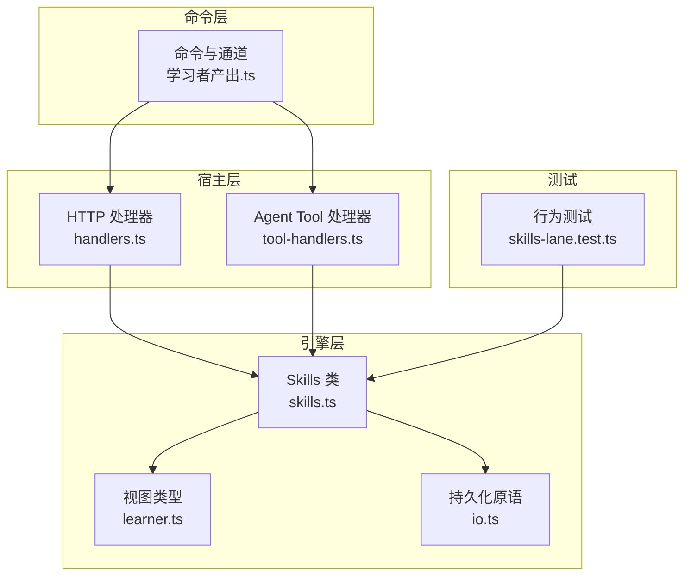
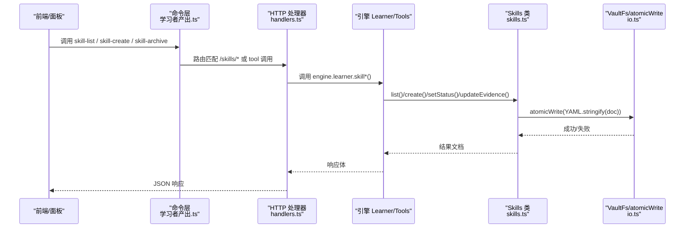
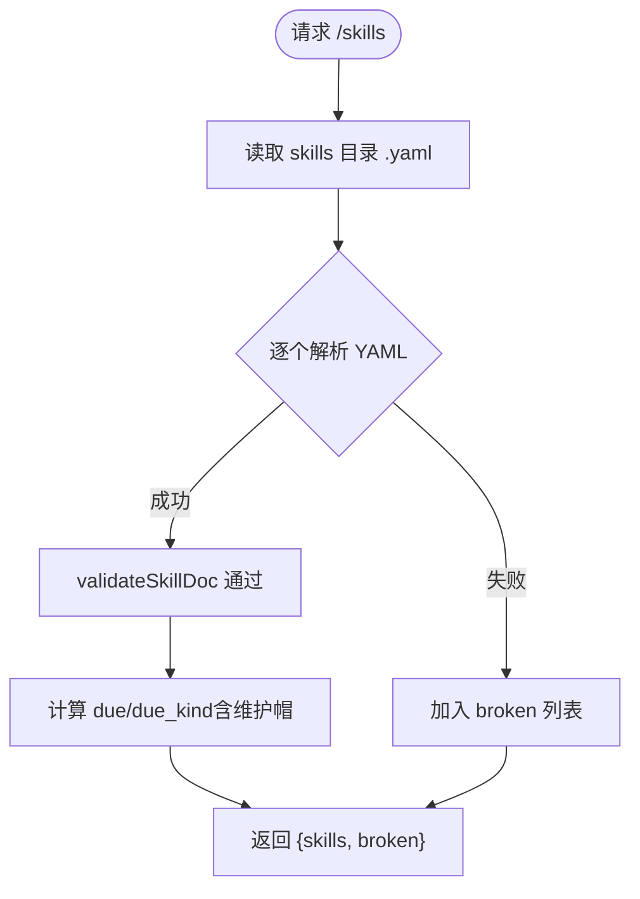
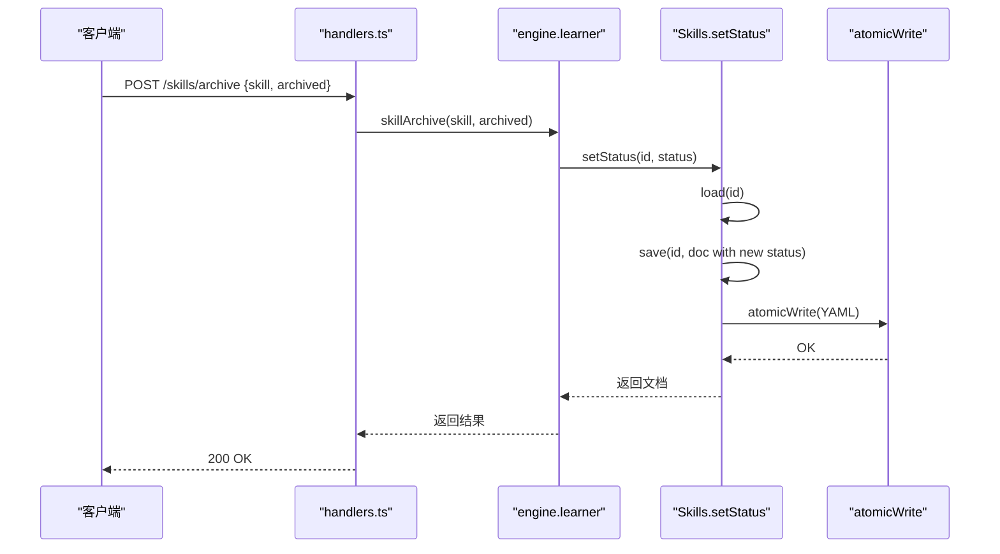
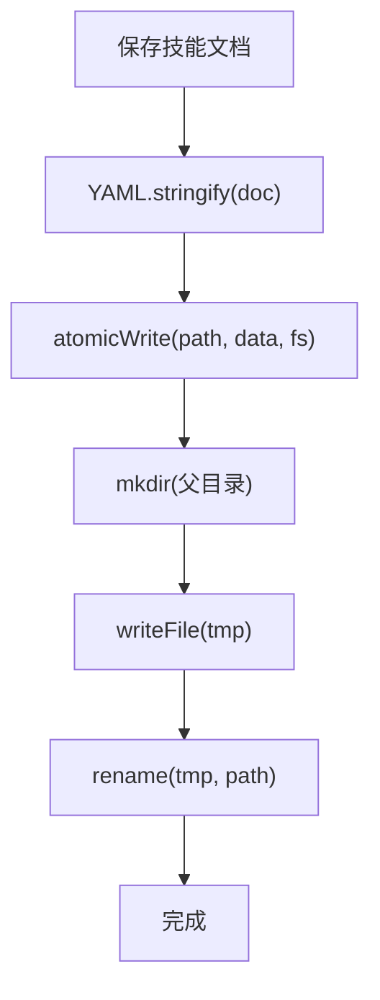
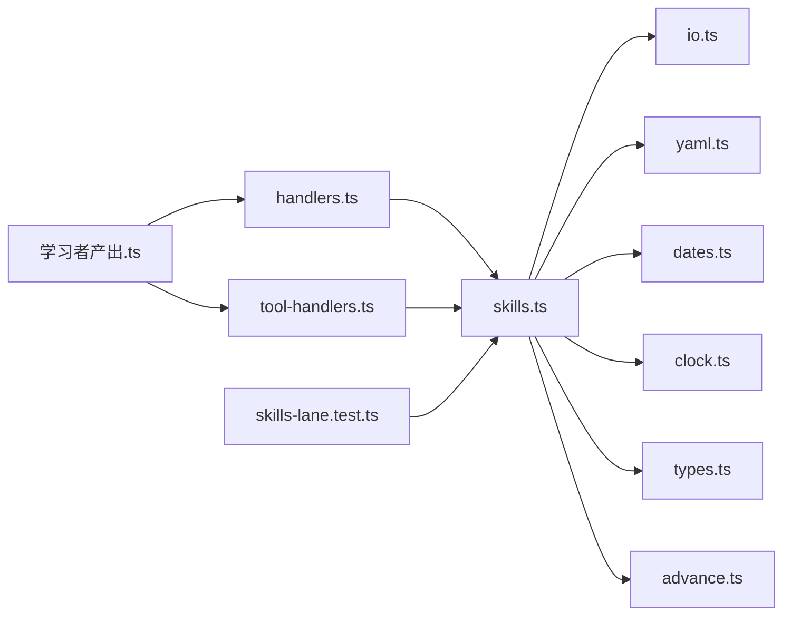

# 技能管理

<cite>
**本文引用的文件**
- [skills.ts](file://src/engine/skills.ts)
- [learner.ts](file://src/engine/views/learner.ts)
- [学习者产出.ts](file://src/commands/学习者产出.ts)
- [handlers.ts](file://src/host/handlers.ts)
- [tool-handlers.ts](file://src/host/tool-handlers.ts)
- [io.ts](file://src/engine/io.ts)
- [skills-lane.test.ts](file://tests/skills-lane.test.ts)
</cite>

## 目录
1. [简介](#简介)
2. [项目结构](#项目结构)
3. [核心组件](#核心组件)
4. [架构总览](#架构总览)
5. [详细组件分析](#详细组件分析)
6. [依赖关系分析](#依赖关系分析)
7. [性能考量](#性能考量)
8. [故障排查指南](#故障排查指南)
9. [结论](#结论)
10. [附录：API 与示例](#附录api-与示例)

## 简介
本文件围绕“技能条目（Skill Entry）”与“执行事件调度 lane”的完整生命周期，系统化说明 Skills 类的核心能力与对外 API，覆盖技能的创建、读取、更新、删除（通过归档实现）、列表查询与过滤、状态变更（归档/恢复）、数据持久化机制与文件系统操作、数据验证规则与错误处理策略，并提供可落地的集成方式与代码级参考路径。

## 项目结构
技能管理相关代码主要分布在以下位置：
- 领域模型与核心类：src/engine/skills.ts
- 视图类型定义（清单返回结构等）：src/engine/views/learner.ts
- 命令与通道声明（agent/tool/panel 路由）：src/commands/学习者产出.ts
- HTTP 处理器（面板路由）：src/host/handlers.ts
- Agent Tool 处理器（工具调用）：src/host/tool-handlers.ts
- 持久化原语（原子写、VaultFs 端口）：src/engine/io.ts
- 行为测试（端到端用例）：tests/skills-lane.test.ts



图表来源
- [skills.ts:169-244](file://src/engine/skills.ts#L169-L244)
- [learner.ts:66-87](file://src/engine/views/learner.ts#L66-L87)
- [学习者产出.ts:595-671](file://src/commands/学习者产出.ts#L595-L671)
- [handlers.ts:299-308](file://src/host/handlers.ts#L299-L308)
- [tool-handlers.ts:193-209](file://src/host/tool-handlers.ts#L193-L209)
- [io.ts:9-39](file://src/engine/io.ts#L9-L39)

章节来源
- [skills.ts:1-260](file://src/engine/skills.ts#L1-L260)
- [learner.ts:66-87](file://src/engine/views/learner.ts#L66-L87)
- [学习者产出.ts:595-671](file://src/commands/学习者产出.ts#L595-L671)
- [handlers.ts:299-308](file://src/host/handlers.ts#L299-L308)
- [tool-handlers.ts:193-209](file://src/host/tool-handlers.ts#L193-L209)
- [io.ts:9-39](file://src/engine/io.ts#L9-L39)

## 核心组件
- Skills 类：提供技能的 CRUD、状态切换、证据推进写回、清单扫描与 Broken 收集。
- 纯函数：维持节拍上限 clamp、lane 到期计算、事件种类判定、证据到评级映射、XP 详情拼装。
- 视图类型：SkillLaneItem/SkillsListDoc 描述清单返回结构。
- 持久化：基于 VaultFs 的原子写入，YAML 序列化存储为 skill/<id>.yaml。
- 命令/通道：skill-create/list/maintenance/archive 以及 execution-log 等入口。
- HTTP/Tool 路由：将外部请求转发至引擎 learner.* 方法。

章节来源
- [skills.ts:35-167](file://src/engine/skills.ts#L35-L167)
- [skills.ts:169-244](file://src/engine/skills.ts#L169-L244)
- [learner.ts:66-87](file://src/engine/views/learner.ts#L66-L87)
- [io.ts:9-39](file://src/engine/io.ts#L9-L39)

## 架构总览
技能管理的调用链从命令层进入宿主层，再落到引擎层的 Skills 类，最终通过 io.ts 进行原子写盘。



图表来源
- [学习者产出.ts:595-671](file://src/commands/学习者产出.ts#L595-L671)
- [handlers.ts:299-308](file://src/host/handlers.ts#L299-L308)
- [skills.ts:169-244](file://src/engine/skills.ts#L169-L244)
- [io.ts:30-39](file://src/engine/io.ts#L30-L39)

## 详细组件分析

### Skills 类与数据模型
- SkillDoc：技能条目文档，包含 id、name、status、maintenance_days、fsrs、stats、created、updated。
- SkillStatus：'active' | 'archived'。
- ExecutionSource：'auto' | 'self' | 'ai'。
- ExecutionEventKind：'acquisition' | 'maintenance'。
- 维护节拍默认值与边界：默认 30 天，范围 7–365；null/0 表示关闭。
- 关键方法：
  - list(): 列出所有技能，解析 YAML 并校验，Broken 单独返回不阻塞。
  - load(id): 读取单个技能，Missing/Broken 语义明确。
  - create(input): 创建技能，校验 name/id，防重名，写入 YAML。
  - save(id, doc): 全量写回，自动更新时间戳。
  - setStatus(id, status): 归档/恢复。
  - updateEvidence(id, patch): 推进后写回 fsrs/stats。

```mermaid
classDiagram
class Skills {
-paths
-clock
-fs
+list() Promise~{skills,broken}~
+load(id) Promise~SkillDoc~
+create(input) Promise~SkillDoc~
+save(id,doc) Promise~void~
+setStatus(id,status) Promise~SkillDoc~
+updateEvidence(id,patch) Promise~void~
}
class SkillDoc {
+string skill
+string name
+SkillStatus status
+number|null maintenance_days
+FsrsBlock? fsrs
+object? stats
+string created
+string updated
}
Skills --> SkillDoc : "读写/创建/更新"
```

图表来源
- [skills.ts:51-65](file://src/engine/skills.ts#L51-L65)
- [skills.ts:169-244](file://src/engine/skills.ts#L169-L244)

章节来源
- [skills.ts:51-65](file://src/engine/skills.ts#L51-L65)
- [skills.ts:169-244](file://src/engine/skills.ts#L169-L244)

### 技能列表查询与过滤
- 列表接口：GET /skills（面板）与 learnhub_skill_list（Agent）。
- 返回结构：SkillsListDoc.skills 为 SkillLaneItem[]，包含 due/due_kind/status/maintenance_days 等。
- 过滤能力：当前实现按 id 排序全量列出；Broken 项单独返回便于前端提示修复。
- 到期计算：due 已折叠维护节拍帽；due_kind 区分 acquisition/maintenance。



图表来源
- [skills.ts:179-194](file://src/engine/skills.ts#L179-L194)
- [learner.ts:66-87](file://src/engine/views/learner.ts#L66-L87)

章节来源
- [skills.ts:179-194](file://src/engine/skills.ts#L179-L194)
- [learner.ts:66-87](file://src/engine/views/learner.ts#L66-L87)

### 技能状态变更（归档/恢复）
- 接口：POST /skills/archive（面板），learnhub_skill_archive（Agent）。
- 逻辑：读取文档 -> 修改 status -> 写回。
- 语义：archived 仅作为收纳标签，不影响历史数据；归档后拒绝新的执行事件（由上层调用方控制）。



图表来源
- [handlers.ts:299-303](file://src/host/handlers.ts#L299-L303)
- [tool-handlers.ts:198-201](file://src/host/tool-handlers.ts#L198-L201)
- [skills.ts:231-237](file://src/engine/skills.ts#L231-L237)

章节来源
- [handlers.ts:299-303](file://src/host/handlers.ts#L299-L303)
- [tool-handlers.ts:198-201](file://src/host/tool-handlers.ts#L198-L201)
- [skills.ts:231-237](file://src/engine/skills.ts#L231-L237)

### 技能数据的持久化机制与文件系统操作
- 存储格式：每个技能一个 YAML 文件，路径由 paths.skillPath(id) 决定。
- 原子写：atomicWrite 使用临时文件 + rename 保证一致性。
- 读侧容错：list 中解析失败的文件计入 broken，不阻塞其他技能。
- 时间戳：每次 save 自动更新 updated。



图表来源
- [io.ts:30-39](file://src/engine/io.ts#L30-L39)
- [skills.ts:224-229](file://src/engine/skills.ts#L224-L229)

章节来源
- [io.ts:30-39](file://src/engine/io.ts#L30-L39)
- [skills.ts:224-229](file://src/engine/skills.ts#L224-L229)

### 数据验证规则与错误处理策略
- 文档校验：validateSkillDoc 强制字段存在与类型正确，非法值 fail loud。
- 维护节拍 clamp：超出 7–365 或非法类型抛错；null/0 表示关闭。
- 证据到评级映射：ratingFromEvidence 要求 accuracy ∈ [0,1]，无 accuracy 时禁止 auto 来源。
- Missing/Broken 纪律：缺失文件视为合法空态；存在但损坏抛出 Broken 并附带原因。
- 一学习日一次推进：同一 lane 在同一天只能推进一次（由上层守卫）。

章节来源
- [skills.ts:67-80](file://src/engine/skills.ts#L67-L80)
- [skills.ts:113-121](file://src/engine/skills.ts#L113-L121)
- [skills.ts:123-150](file://src/engine/skills.ts#L123-L150)
- [skills-lane.test.ts:24-34](file://tests/skills-lane.test.ts#L24-L34)
- [skills-lane.test.ts:74-85](file://tests/skills-lane.test.ts#L74-L85)
- [skills-lane.test.ts:116-182](file://tests/skills-lane.test.ts#L116-L182)

### 执行事件与推进（补充）
- 执行事件：真实练习 + 表现评级（1-4 整数 + 来源枚举），source='auto' 必须带可观测证据。
- 推进内核：复用 advance 内核，lane 与题目 FSRS 并行，不复用题目卡、不进复习队列。
- XP 入账：按原生专注分钟数入账（1 XP ≈ 1 分钟），进 streak 口径。
- 事件种类：根据维护帽与 FSRS due 判定 acquisition/maintenance。

章节来源
- [skills.ts:1-25](file://src/engine/skills.ts#L1-L25)
- [skills.ts:152-167](file://src/engine/skills.ts#L152-L167)
- [skills-lane.test.ts:116-200](file://tests/skills-lane.test.ts#L116-L200)

## 依赖关系分析
- Skills 依赖：
  - VaultFs 与 atomicWrite（io.ts）用于文件 I/O。
  - YAML 序列化（yaml.ts）。
  - 日期工具（dates.ts）用于 todayStr/addDays。
  - Clock 端口（clock.ts）获取当前时间。
  - 类型与 AdvanceCard（types.ts、advance.ts）。
- 命令层依赖：
  - 学习者产出.ts 声明 skill-* 命令及通道。
  - handlers.ts 暴露 /skills/* 路由。
  - tool-handlers.ts 暴露 learnhub_skill_* 工具。
- 测试依赖：
  - skills-lane.test.ts 覆盖纯函数与端到端行为。



图表来源
- [skills.ts:26-33](file://src/engine/skills.ts#L26-L33)
- [学习者产出.ts:595-671](file://src/commands/学习者产出.ts#L595-L671)
- [handlers.ts:299-308](file://src/host/handlers.ts#L299-L308)
- [tool-handlers.ts:193-209](file://src/host/tool-handlers.ts#L193-L209)
- [skills-lane.test.ts:1-20](file://tests/skills-lane.test.ts#L1-L20)

章节来源
- [skills.ts:26-33](file://src/engine/skills.ts#L26-L33)
- [学习者产出.ts:595-671](file://src/commands/学习者产出.ts#L595-L671)
- [handlers.ts:299-308](file://src/host/handlers.ts#L299-L308)
- [tool-handlers.ts:193-209](file://src/host/tool-handlers.ts#L193-L209)
- [skills-lane.test.ts:1-20](file://tests/skills-lane.test.ts#L1-L20)

## 性能考量
- 列表扫描：按文件名排序遍历 .yaml，解析与校验 O(N)，Broken 不阻塞整体。
- 原子写：临时文件 + rename 避免部分写入，减少并发风险。
- 维护节拍 clamp：纯函数快速判断，避免无效配置导致的额外开销。
- 一学习日一次推进：防止重复推进造成不必要的 FSRS 计算与日志膨胀。

[本节为通用指导，无需特定文件引用]

## 故障排查指南
- Missing：加载不存在 id 的技能会报错，需先创建。
- Broken：YAML 解析失败或字段校验失败会抛出 Broken，list 会将该技能放入 broken 列表，便于定位修复。
- 维护节拍非法：超出 7–365 或类型错误会抛错，需修正配置。
- 证据映射失败：auto 来源缺少 accuracy 或数值越界会拒绝，应改用 self/ai 或补齐证据。
- 重复推进：同一天对同一 lane 多次推进会被拒绝。

章节来源
- [skills.ts:196-207](file://src/engine/skills.ts#L196-L207)
- [skills.ts:179-194](file://src/engine/skills.ts#L179-L194)
- [skills.ts:67-80](file://src/engine/skills.ts#L67-L80)
- [skills.ts:113-121](file://src/engine/skills.ts#L113-L121)
- [skills-lane.test.ts:116-182](file://tests/skills-lane.test.ts#L116-L182)

## 结论
Skills 类提供了稳健的技能条目管理能力，结合维护节拍与 FSRS 推进内核，既保证了长期闲置技能的低频复活，又避免了与题目复习队列的耦合。通过严格的输入校验、Broken/Missing 语义与原子写保障，系统具备高可靠性与可观测性。配合命令层与宿主层的多通道接入，技能管理可在面板、Agent 与工具调用中一致工作。

[本节为总结性内容，无需特定文件引用]

## 附录：API 与示例

### 命令与通道
- skill-create：创建技能条目（支持可选 maintenance_days）。
- skill-list：列出技能及其 due/due_kind。
- skill-maintenance：设置维护节拍上限（7–365 或 null 关闭）。
- skill-archive：归档/恢复技能（true/false）。
- execution-log：记录执行事件（source/rating/evidence/minutes/note）。

章节来源
- [学习者产出.ts:595-671](file://src/commands/学习者产出.ts#L595-L671)
- [学习者产出.ts:120-130](file://src/commands/学习者产出.ts#L120-L130)

### HTTP 路由
- GET /skills：技能清单（含 due/due_kind）。
- POST /skills/archive：归档/恢复。
- POST /skills/maintenance：设置维护节拍。

章节来源
- [handlers.ts:299-308](file://src/host/handlers.ts#L299-L308)

### Agent Tool
- learnhub_skill_create / learnhub_skill_list / learnhub_skill_maintenance / learnhub_skill_archive / learnhub_execution_log。

章节来源
- [tool-handlers.ts:193-209](file://src/host/tool-handlers.ts#L193-L209)

### 集成示例（以路径引用代替具体代码）
- 创建技能：参考命令定义与工具调用路径
  - [学习者产出.ts:617-629](file://src/commands/学习者产出.ts#L617-L629)
  - [tool-handlers.ts:193-195](file://src/host/tool-handlers.ts#L193-L195)
- 列出技能：
  - [学习者产出.ts:630-649](file://src/commands/学习者产出.ts#L630-L649)
  - [handlers.ts:299-308](file://src/host/handlers.ts#L299-L308)
- 归档/恢复：
  - [学习者产出.ts:595-616](file://src/commands/学习者产出.ts#L595-L616)
  - [handlers.ts:299-303](file://src/host/handlers.ts#L299-L303)
  - [tool-handlers.ts:198-201](file://src/host/tool-handlers.ts#L198-L201)
- 设置维护节拍：
  - [学习者产出.ts:650-671](file://src/commands/学习者产出.ts#L650-L671)
  - [handlers.ts:304-308](file://src/host/handlers.ts#L304-L308)
  - [tool-handlers.ts:196-197](file://src/host/tool-handlers.ts#L196-L197)
- 记录执行事件：
  - [学习者产出.ts:120-130](file://src/commands/学习者产出.ts#L120-L130)
  - [tool-handlers.ts:202-209](file://src/host/tool-handlers.ts#L202-L209)

### 行为与测试参考
- 纯函数与端到端行为覆盖：
  - [skills-lane.test.ts:24-34](file://tests/skills-lane.test.ts#L24-L34)
  - [skills-lane.test.ts:46-70](file://tests/skills-lane.test.ts#L46-L70)
  - [skills-lane.test.ts:74-85](file://tests/skills-lane.test.ts#L74-L85)
  - [skills-lane.test.ts:116-200](file://tests/skills-lane.test.ts#L116-L200)
  - [skills-lane.test.ts:229-248](file://tests/skills-lane.test.ts#L229-L248)