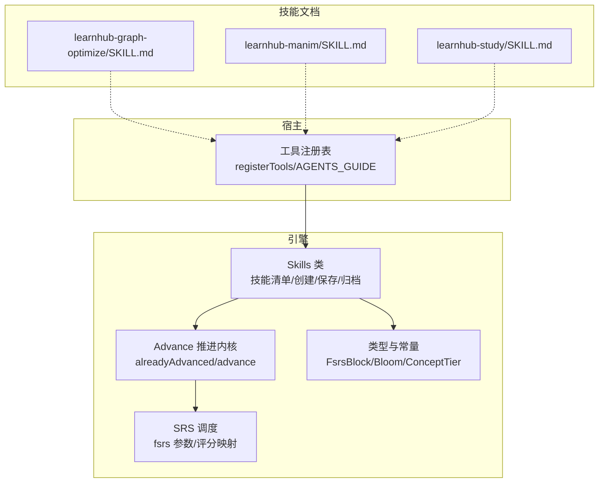
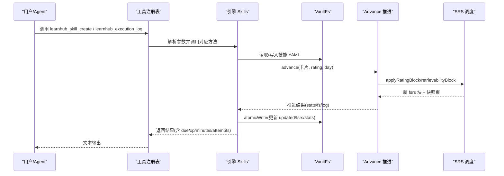
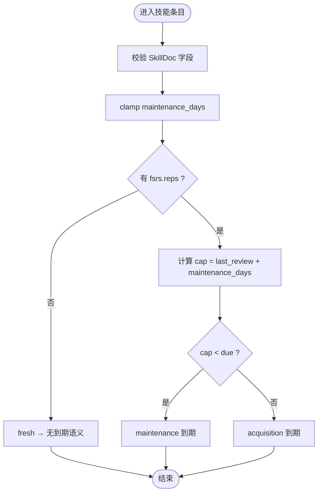
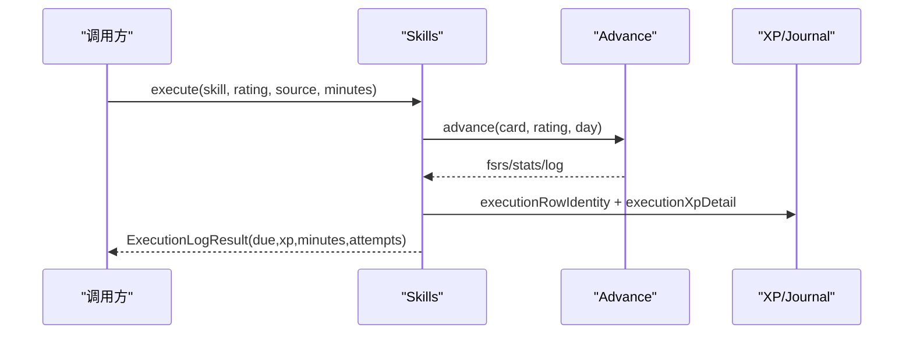
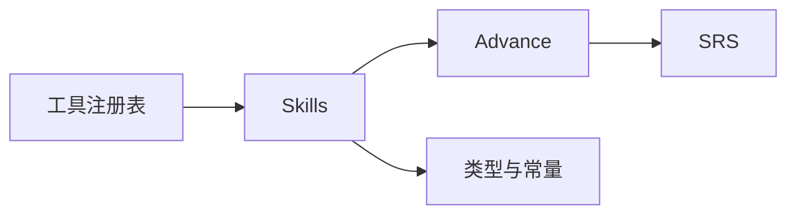

# 技能系统

<cite>
**本文引用的文件**
- [skills.ts](file://src/engine/skills.ts)
- [advance.ts](file://src/engine/advance.ts)
- [srs.ts](file://src/engine/srs.ts)
- [types.ts](file://src/engine/types.ts)
- [tools.ts](file://src/host/tools.ts)
- [SKILL.md（learnhub-graph-optimize）](file://skills/learnhub-graph-optimize/SKILL.md)
- [SKILL.md（learnhub-manim）](file://skills/learnhub-manim/SKILL.md)
- [SKILL.md（learnhub-study）](file://skills/learnhub-study/SKILL.md)
</cite>

## 目录
1. [简介](#简介)
2. [项目结构](#项目结构)
3. [核心组件](#核心组件)
4. [架构总览](#架构总览)
5. [详细组件分析](#详细组件分析)
6. [依赖关系分析](#依赖关系分析)
7. [性能考量](#性能考量)
8. [故障排查指南](#故障排查指南)
9. [结论](#结论)
10. [附录：开发示例与部署流程](#附录开发示例与部署流程)

## 简介
本文件系统性地说明“技能”在工程中的定义、元数据规范、注册机制、生命周期管理、执行上下文与环境准备、输入输出处理与结果格式化、依赖管理与版本控制，以及最佳实践与性能优化建议。技能是“无界实践区”的可排期实践主体（如乐器、运动、编程等），通过独立的调度 lane 与题目 FSRS 并行推进，但不复用题目卡、不进复习队列、无 mastery、不进题目门禁。技能状态以 YAML frontmatter 持久化到学习中心目录，执行事件通过统一通道落账并计入 XP 与 streak。

## 项目结构
技能系统由引擎层（类型、校验、推进内核）、宿主工具面（命令与 agent 工具注册）、以及 skills 目录下的技能文档组成：
- 引擎层：定义技能条目结构、维护节拍、执行证据映射、FSRS 推进、统计写回等。
- 宿主工具面：将引擎能力暴露为 agent 工具（如创建技能、记录执行事件）。
- 技能文档：描述具体技能的用途、工作流、前置依赖与产出格式。



图表来源
- [skills.ts:169-244](file://src/engine/skills.ts#L169-L244)
- [advance.ts:23-74](file://src/engine/advance.ts#L23-L74)
- [srs.ts:21-28](file://src/engine/srs.ts#L21-L28)
- [tools.ts:25-69](file://src/host/tools.ts#L25-L69)

章节来源
- [skills.ts:1-260](file://src/engine/skills.ts#L1-L260)
- [advance.ts:1-107](file://src/engine/advance.ts#L1-L107)
- [tools.ts:1-126](file://src/host/tools.ts#L1-L126)

## 核心组件
- 技能条目 SkillDoc：包含 id、名称、状态、维持节拍上限、FSRS 隔离块、统计信息、创建/更新时间。
- 执行事件：评级 1–4 整数 + 来源枚举（auto/self/ai），区分 acquisition/maintenance 两类。
- 维护节拍：默认 30 天，可关闭；到期取 FSRS due 与维护帽的较早者。
- 推进内核：复用 Advance 与 SRS，保证每日一次推进、快照束与统计合并。
- 宿主工具：提供 learnhub_skill_create、learnhub_execution_log 等 agent 工具。

章节来源
- [skills.ts:51-65](file://src/engine/skills.ts#L51-L65)
- [skills.ts:38-49](file://src/engine/skills.ts#L38-L49)
- [skills.ts:82-105](file://src/engine/skills.ts#L82-L105)
- [advance.ts:23-74](file://src/engine/advance.ts#L23-L74)
- [tools.ts:54-57](file://src/host/tools.ts#L54-L57)

## 架构总览
技能系统围绕“技能条目—执行事件—推进内核—持久化”的主干展开：
- 入口：agent 工具或面板路由调用引擎函数。
- 校验：SkillDoc 与执行证据严格校验，fail loud。
- 推进：Advance 守卫当日已推进，SRS 计算下次 due。
- 持久化：YAML frontmatter 原子写入，updated 时间戳更新。
- 观测：执行日志身份与 XP detail 拼装，便于审计与报表。



图表来源
- [tools.ts:102-125](file://src/host/tools.ts#L102-L125)
- [skills.ts:179-244](file://src/engine/skills.ts#L179-L244)
- [advance.ts:67-74](file://src/engine/advance.ts#L67-L74)
- [srs.ts:21-28](file://src/engine/srs.ts#L21-L28)

## 详细组件分析

### 技能条目与元数据规范
- 字段约束：skill/name/status/maintenance_days/fsrs/stats/created/updated。
- 维护节拍 clamp：undefined→默认 30；null/0→关闭；数字必须在 [7,365]。
- 到期判定：laneDue 取 FSRS due 与维护帽的较早者；首次执行未落地时返回 null。
- 事件种类：maintenance 当维护帽严格早于 FSRS due 且今天已到；否则 acquisition。
- 证据映射：ratingFromEvidence 基于 accuracy 带与 self_help 次数降档，无 accuracy 必须走自评。



图表来源
- [skills.ts:123-150](file://src/engine/skills.ts#L123-L150)
- [skills.ts:82-105](file://src/engine/skills.ts#L82-L105)
- [skills.ts:107-121](file://src/engine/skills.ts#L107-L121)

章节来源
- [skills.ts:51-65](file://src/engine/skills.ts#L51-L65)
- [skills.ts:67-80](file://src/engine/skills.ts#L67-L80)
- [skills.ts:82-105](file://src/engine/skills.ts#L82-L105)
- [skills.ts:107-121](file://src/engine/skills.ts#L107-L121)
- [skills.ts:123-150](file://src/engine/skills.ts#L123-L150)

### 注册机制与生命周期管理
- 清单列出：list() 扫描 skillsDir 下 .yaml，失败项归入 broken 不阻塞。
- 创建条目：create() 校验 name/id，生成初始 doc 并原子写入。
- 保存与归档：save() 更新 updated；setStatus() 切换 active/archived。
- 证据更新：updateEvidence() 整体替换 fsrs/stats（由作答侧调用）。
- Missing/Broken 纪律：缺失=合法空态；存在但坏=抛出 Broken。

```mermaid
classDiagram
class Skills {
-paths : Paths
-clock : Clock
-fs : VaultFs
+list() Promise~{skills,broken}~
+load(id) Promise~SkillDoc~
+create(input) Promise~SkillDoc~
+save(id,doc) Promise~void~
+setStatus(id,status) Promise~SkillDoc~
+updateEvidence(id,patch) Promise~void~
}
```

图表来源
- [skills.ts:169-244](file://src/engine/skills.ts#L169-L244)

章节来源
- [skills.ts:179-244](file://src/engine/skills.ts#L179-L244)

### 执行上下文与环境准备
- 环境依赖：技能文档中明确外部依赖（如 Manim 技能要求 Python≥3.9、Manim、LaTeX、ffmpeg）。
- 自检策略：逐项检查并报告缺失，缺什么补什么，绝不静默跳过。
- 产物路径：按课程根目录组织脚本与媒体文件，确保可重渲与可追溯。
- 正文挂接：在节点正文引用媒体块，并通过内容质检门验证路径合法性。

章节来源
- [SKILL.md（learnhub-manim）:12-44](file://skills/learnhub-manim/SKILL.md#L12-L44)

### 输入输出处理与结果格式化
- 输入契约：执行事件 rating 必须为 1–4 整数；source 必须为 auto/self/ai；auto 来源需通过 ratingFromEvidence 确定性映射。
- 输出契约：ExecutionLogResult 包含 skill/rating/source/kind/due/xp/minutes/attempts。
- 日志身份：executionRowIdentity 固定 course='*', node=skill, qid='exec'。
- XP 明细：executionXpDetail 拼接 source/kind/rating/minutes，用于 journal 与 streak 口径。



图表来源
- [skills.ts:152-164](file://src/engine/skills.ts#L152-L164)
- [skills.ts:246-256](file://src/engine/skills.ts#L246-L256)
- [advance.ts:67-74](file://src/engine/advance.ts#L67-L74)

章节来源
- [skills.ts:152-164](file://src/engine/skills.ts#L152-L164)
- [skills.ts:246-256](file://src/engine/skills.ts#L246-L256)

### 依赖管理与版本控制
- 技能文档作为“资产”随仓库版本管理，变更通过 propose-edit 门禁后 apply 入库，联动笔记与引用自动完成。
- 图谱优化技能强调只产 YAML，过门禁再 apply，避免手工改文件。
- 技能文档自身不直接参与引擎版本控制，但通过变更流程保障一致性。

章节来源
- [SKILL.md（learnhub-graph-optimize）:1-37](file://skills/learnhub-graph-optimize/SKILL.md#L1-L37)

### 最佳实践与性能优化建议
- 证据优先：auto 来源必须使用可观测证据映射，禁止直喂分数。
- 维护节拍合理设置：过低会退化为日常练习，过高会被间隔增长淹没。
- 单次会话聚焦：一个动画/一节讲解只讲一件事，避免冗长与资源膨胀。
- 质量门禁：正文与媒体路径需通过内容质检门，失败如实报告原因。
- 推进守卫：利用 alreadyAdvanced/alreadyScheduledOn 防止同日重复推进。

章节来源
- [skills.ts:107-121](file://src/engine/skills.ts#L107-L121)
- [skills.ts:82-105](file://src/engine/skills.ts#L82-L105)
- [SKILL.md（learnhub-manim）:28-44](file://skills/learnhub-manim/SKILL.md#L28-L44)
- [advance.ts:23-31](file://src/engine/advance.ts#L23-L31)

## 依赖关系分析
- Skills 依赖 VaultFs、Clock、Paths 进行 IO 与时间获取。
- 推进内核 Advance 依赖 SRS 调度与 FsrsBlock。
- 宿主工具通过 COMMAND_LIST 与 registerTools 将引擎能力暴露给 agent。



图表来源
- [tools.ts:102-125](file://src/host/tools.ts#L102-L125)
- [skills.ts:169-244](file://src/engine/skills.ts#L169-L244)
- [advance.ts:67-74](file://src/engine/advance.ts#L67-L74)
- [srs.ts:21-28](file://src/engine/srs.ts#L21-L28)

章节来源
- [tools.ts:102-125](file://src/host/tools.ts#L102-L125)
- [skills.ts:169-244](file://src/engine/skills.ts#L169-L244)
- [advance.ts:67-74](file://src/engine/advance.ts#L67-L74)
- [srs.ts:21-28](file://src/engine/srs.ts#L21-L28)

## 性能考量
- 每日推进守卫：alreadyAdvanced/alreadyScheduledOn 避免重复计算与写盘。
- 维护节拍 clamp：限制范围减少无效调度。
- 证据映射纯函数：ratingFromEvidence 无副作用，易于测试与缓存。
- 原子写盘：atomicWrite 保证数据一致性，避免部分写入。

章节来源
- [advance.ts:23-31](file://src/engine/advance.ts#L23-L31)
- [skills.ts:67-80](file://src/engine/skills.ts#L67-L80)
- [skills.ts:107-121](file://src/engine/skills.ts#L107-L121)

## 故障排查指南
- 技能条目 Broken：YAML 解析失败或字段校验失败，查看 broken 列表与错误消息。
- 执行事件非法：rating 非 1–4 整数或 source 不在枚举内，需修正输入。
- 证据映射失败：accuracy 不在 0–1 范围或缺失，应改用自评档。
- 维护节拍异常：超出 [7,365] 或传入非法值，需调整配置。

章节来源
- [skills.ts:123-150](file://src/engine/skills.ts#L123-L150)
- [skills.ts:179-194](file://src/engine/skills.ts#L179-L194)
- [skills.ts:107-121](file://src/engine/skills.ts#L107-L121)

## 结论
技能系统通过严格的元数据校验、清晰的执行事件契约、可配置的维护节拍与统一的推进内核，实现了稳定、可观测、可扩展的实践调度。结合宿主工具与技能文档，开发者可以快速构建、部署与维护技能，同时保持与课程图、题库、笔记等子系统的一致性。

## 附录：开发示例与部署流程

### 示例一：创建技能条目并记录执行事件
- 使用 learnhub_skill_create 创建技能条目，指定名称与维护节拍。
- 使用 learnhub_execution_log 记录执行事件，提供 rating、source、minutes。
- 引擎返回 due、xp、minutes、attempts，便于后续追踪。

章节来源
- [tools.ts:54-57](file://src/host/tools.ts#L54-L57)
- [skills.ts:209-244](file://src/engine/skills.ts#L209-L244)

### 示例二：Manim 动画技能工作流
- 前置自检：检查 Python、Manim、LaTeX、ffmpeg 是否就绪。
- 创作与渲染：编写场景脚本，渲染 MP4，移入课程媒体目录。
- 挂进正文：添加媒体引用块，运行内容质检门，汇报变更。

章节来源
- [SKILL.md（learnhub-manim）:12-44](file://skills/learnhub-manim/SKILL.md#L12-L44)

### 示例三：图谱优化技能工作流
- 分析：调用 learnhub_graph_analyze 获取健康分与建议。
- 产出 EditProposal YAML：定义增删改操作。
- 提交门禁：learnhub_graph_propose 进行结构检查。
- 人工确认后 apply：learnhub_graph_apply 生效并联动笔记与引用。

章节来源
- [SKILL.md（learnhub-graph-optimize）:10-37](file://skills/learnhub-graph-optimize/SKILL.md#L10-L37)

### 部署流程要点
- 技能文档纳入版本控制，变更走 propose-edit 门禁。
- 引擎能力通过工具注册表暴露，agent 可直接调用。
- 产物（脚本、媒体）按课程根目录组织，便于重渲与审计。
- 所有变更通过内容质检门与数据体检，确保一致性与完整性。

章节来源
- [SKILL.md（learnhub-graph-optimize）:10-37](file://skills/learnhub-graph-optimize/SKILL.md#L10-L37)
- [tools.ts:102-125](file://src/host/tools.ts#L102-L125)