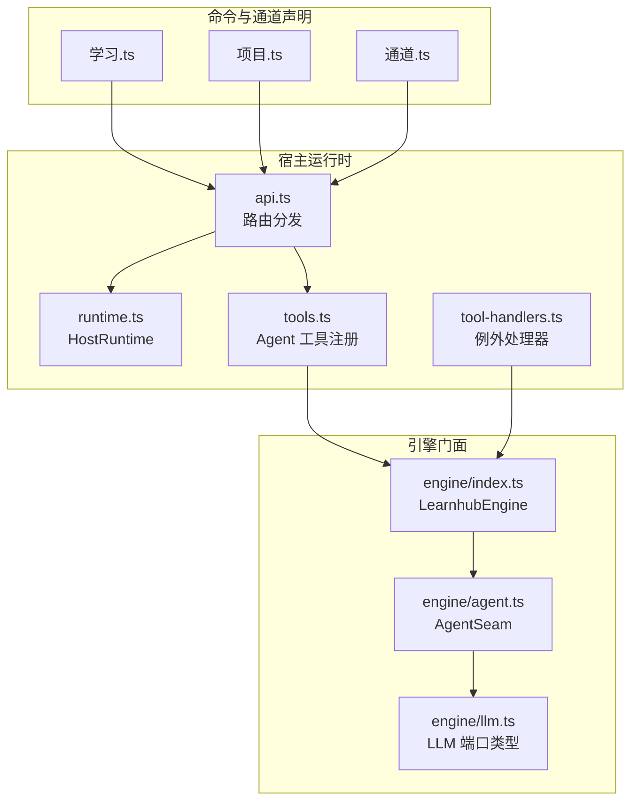
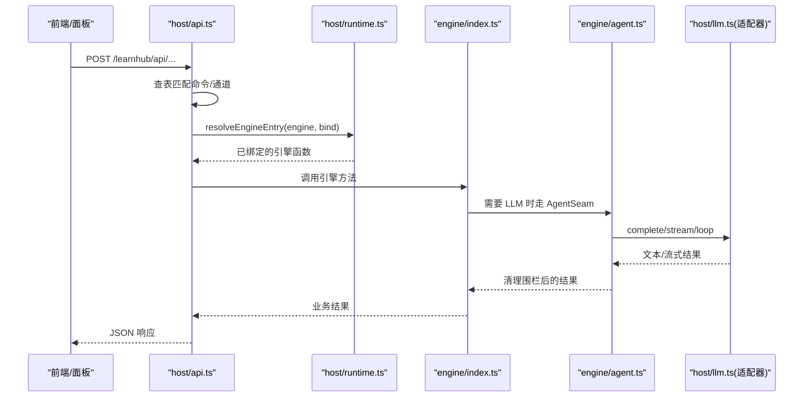
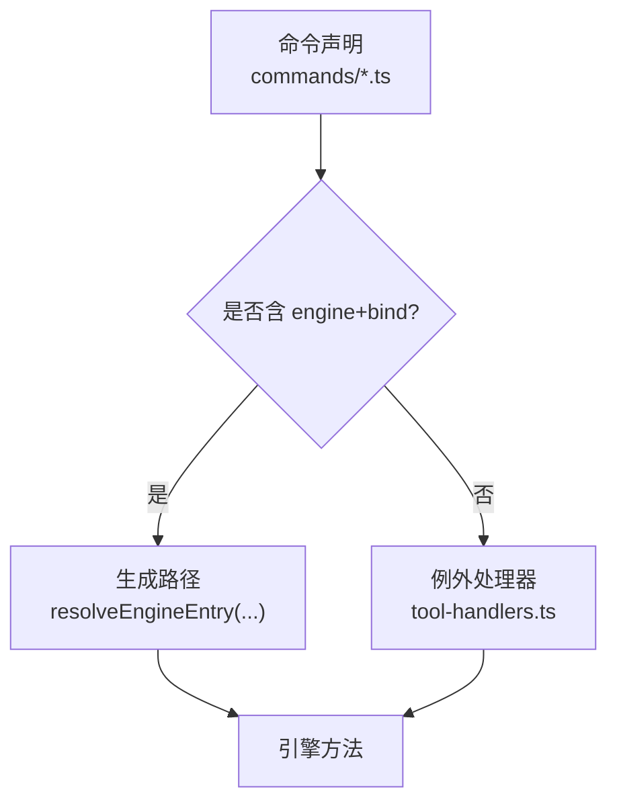
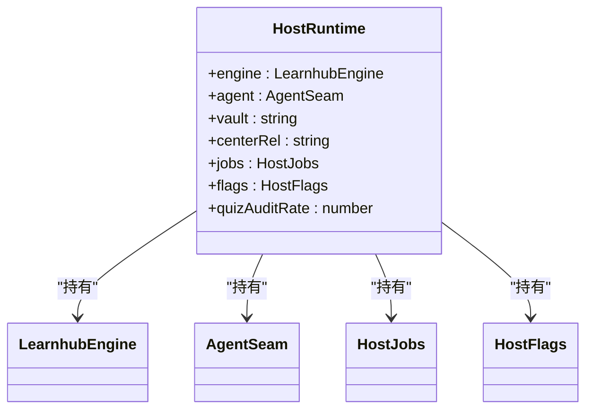
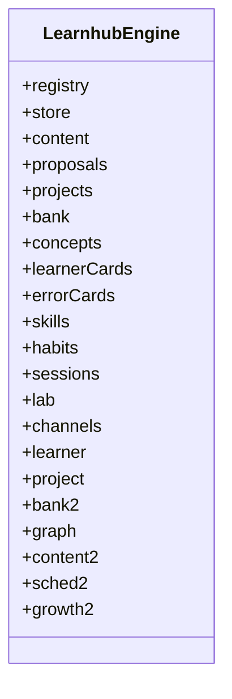
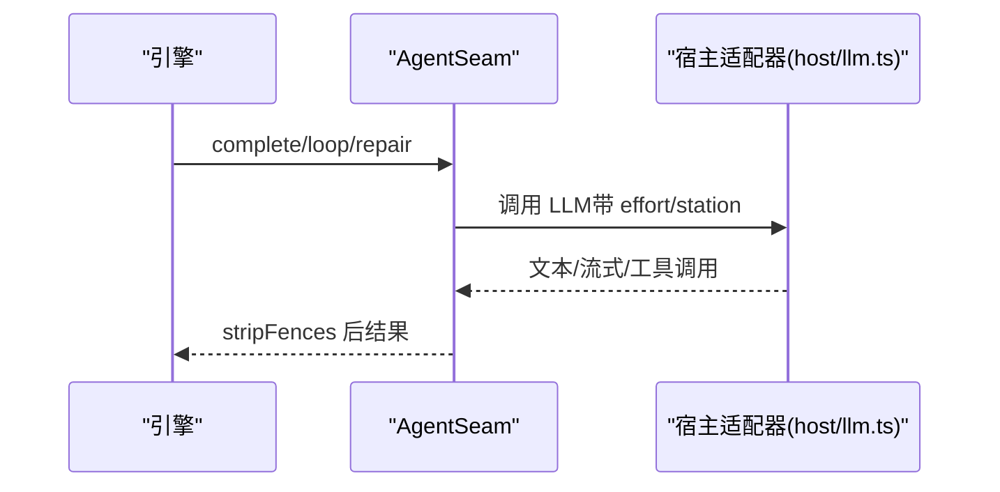
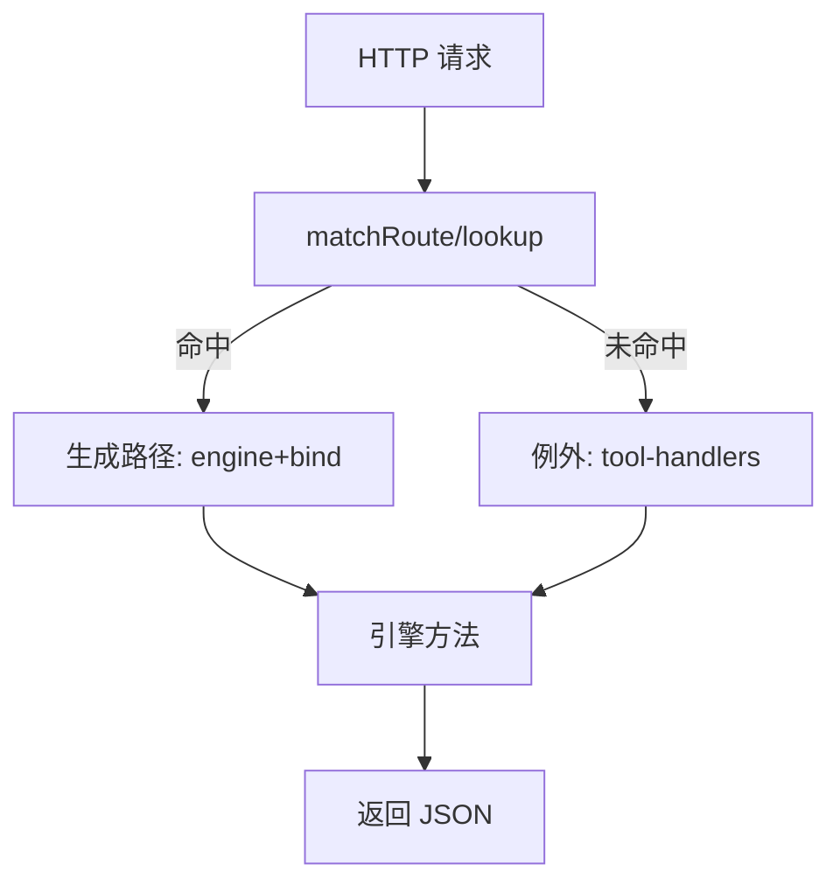
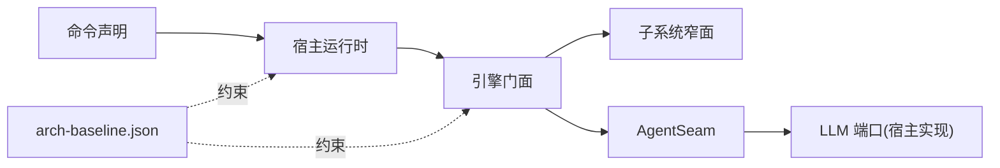

# 插件系统架构

<cite>
**本文引用的文件**
- [src/host/runtime.ts](file://src/host/runtime.ts)
- [src/host/api.ts](file://src/host/api.ts)
- [src/host/tools.ts](file://src/host/tools.ts)
- [src/host/tool-handlers.ts](file://src/host/tool-handlers.ts)
- [src/engine/index.ts](file://src/engine/index.ts)
- [src/engine/agent.ts](file://src/engine/agent.ts)
- [src/engine/llm.ts](file://src/engine/llm.ts)
- [src/commands/学习.ts](file://src/commands/学习.ts)
- [src/commands/项目.ts](file://src/commands/项目.ts)
- [src/commands/通道.ts](file://src/commands/通道.ts)
- [scripts/arch-baseline.json](file://scripts/arch-baseline.json)
</cite>

## 目录
1. [简介](#简介)
2. [项目结构](#项目结构)
3. [核心组件](#核心组件)
4. [架构总览](#架构总览)
5. [详细组件分析](#详细组件分析)
6. [依赖关系分析](#依赖关系分析)
7. [性能考虑](#性能考虑)
8. [故障排查指南](#故障排查指南)
9. [结论](#结论)
10. [附录：插件开发与配置模板](#附录：插件开发与配置模板)

## 简介
本文件系统性阐述 LearnHub 的“插件化”能力与架构。LearnHub 通过“命令注册表 + 通道声明 + 宿主运行时 + 引擎门面 + Agent 缝”的组合，将外部可插拔能力（如 AI 工具、HTTP 路由、面板入口）以声明式方式接入，并以严格的装配门与基线机制保障稳定演进。本文聚焦以下主题：
- 插件生命周期：初始化、启动、运行、销毁
- 通信机制：事件总线、消息传递、状态同步
- 依赖注入与资源管理
- 安全沙箱与执行隔离
- 最佳实践与性能优化
- 开发示例与配置模板

## 项目结构
LearnHub 的插件体系由四层构成：
- 命令与通道声明层：在 commands/* 中以声明式描述“工具/路由 → 引擎方法”的映射
- 宿主运行时层：组装 HostRuntime，提供 engine、agent、jobs、flags 等运行时上下文
- 引擎门面层：LearnhubEngine 作为唯一数据访问与业务编排入口，内部按子系统划分窄面
- Agent 与 LLM 缝：统一封装与 LLM 的交互，支持单发、回路、修复轮等模式

**图表来源**
- [src/host/runtime.ts:118-193](file://src/host/runtime.ts#L118-L193)
- [src/host/api.ts:48-83](file://src/host/api.ts#L48-L83)
- [src/host/tools.ts:101-125](file://src/host/tools.ts#L101-L125)
- [src/host/tool-handlers.ts:23-286](file://src/host/tool-handlers.ts#L23-L286)
- [src/engine/index.ts:149-398](file://src/engine/index.ts#L149-L398)
- [src/engine/agent.ts:85-221](file://src/engine/agent.ts#L85-L221)
- [src/engine/llm.ts:1-27](file://src/engine/llm.ts#L1-L27)

**章节来源**
- [src/host/runtime.ts:118-193](file://src/host/runtime.ts#L118-L193)
- [src/host/api.ts:48-83](file://src/host/api.ts#L48-L83)
- [src/host/tools.ts:101-125](file://src/host/tools.ts#L101-L125)
- [src/host/tool-handlers.ts:23-286](file://src/host/tool-handlers.ts#L23-L286)
- [src/engine/index.ts:149-398](file://src/engine/index.ts#L149-L398)
- [src/engine/agent.ts:85-221](file://src/engine/agent.ts#L85-L221)
- [src/engine/llm.ts:1-27](file://src/engine/llm.ts#L1-L27)

## 核心组件
- 命令与通道声明：以 JSON Schema 描述参数，绑定到 agent 工具或 panel HTTP 路由，并指向引擎方法
- 宿主运行时：集中承载可变态（engine、agent、jobs、flags），提供 resolveEngineEntry、run、apiRun 等通用能力
- 引擎门面：聚合各子系统（Graph/Content/Sched/Growth/Lab/Projects/Bank/Channels/Learner 等），对外暴露稳定接口
- Agent 缝：统一 complete/stream/loop/gateRepairRound，内置预算控制、调用日志、围栏清理
- LLM 端口：纯类型定义，实现由宿主注入，测试可替换为回放

**章节来源**
- [src/commands/学习.ts:353-397](file://src/commands/学习.ts#L353-L397)
- [src/commands/项目.ts:94-368](file://src/commands/项目.ts#L94-L368)
- [src/commands/通道.ts:1-15](file://src/commands/通道.ts#L1-L15)
- [src/host/runtime.ts:118-193](file://src/host/runtime.ts#L118-L193)
- [src/engine/index.ts:149-398](file://src/engine/index.ts#L149-L398)
- [src/engine/agent.ts:85-221](file://src/engine/agent.ts#L85-L221)
- [src/engine/llm.ts:1-27](file://src/engine/llm.ts#L1-L27)

## 架构总览
LearnHub 的“插件”本质是“声明式能力”：通过命令注册表把外部调用（agent 工具、panel 路由）映射到引擎方法；宿主运行时负责装配与调度；引擎门面保证数据访问收敛；Agent 缝统一 LLM 交互。

**图表来源**
- [src/host/api.ts:48-83](file://src/host/api.ts#L48-L83)
- [src/host/runtime.ts:204-237](file://src/host/runtime.ts#L204-L237)
- [src/engine/index.ts:149-398](file://src/engine/index.ts#L149-L398)
- [src/engine/agent.ts:93-200](file://src/engine/agent.ts#L93-L200)

## 详细组件分析

### 命令与通道声明（插件契约）
- 每个命令声明包含 id、args(JSON Schema)、domain、channels（agent 工具或 panel 路由）、engine（目标引擎方法）
- 同一命令可同时暴露给 agent 和 panel，bind 指定参数绑定顺序
- 生成路径（engine + bind）优先；无法生成的例外由 tool-handlers 处理

**图表来源**
- [src/commands/学习.ts:353-397](file://src/commands/学习.ts#L353-L397)
- [src/commands/项目.ts:94-368](file://src/commands/项目.ts#L94-L368)
- [src/host/tools.ts:101-125](file://src/host/tools.ts#L101-L125)
- [src/host/tool-handlers.ts:23-286](file://src/host/tool-handlers.ts#L23-L286)

**章节来源**
- [src/commands/学习.ts:353-397](file://src/commands/学习.ts#L353-L397)
- [src/commands/项目.ts:94-368](file://src/commands/项目.ts#L94-L368)
- [src/commands/通道.ts:1-15](file://src/commands/通道.ts#L1-L15)
- [src/host/tools.ts:101-125](file://src/host/tools.ts#L101-L125)
- [src/host/tool-handlers.ts:23-286](file://src/host/tool-handlers.ts#L23-L286)

### 宿主运行时（插件装配与生命周期）
- createHostRuntime：校验部署路径、构造 LearnhubEngine、AgentSeam、语料捕获器、任务注册表与标志位
- resolveEngineEntry：字符串查表返回已绑定方法的引擎入口
- run/apiRun：统一包装引擎调用与运行日志记录
- 生命周期：
  - 初始化：createHostRuntime 完成所有装配
  - 启动：registerTools 注册 agent 工具；路由表生效
  - 运行：handleApi 分发请求；jobs 管理后台任务
  - 销毁：进程退出时由宿主回收（无显式 dispose，但可通过 flags 停止队列）

**图表来源**
- [src/host/runtime.ts:118-193](file://src/host/runtime.ts#L118-L193)

**章节来源**
- [src/host/runtime.ts:135-193](file://src/host/runtime.ts#L135-L193)
- [src/host/runtime.ts:204-237](file://src/host/runtime.ts#L204-L237)

### 引擎门面与子系统（插件能力域）
- LearnhubEngine 聚合多个子系统（graph/content/sched/growth/lab/projects/bank/channels/learner），并通过窄面注入耦合
- 子系统之间通过构造函数注入的依赖进行协作，避免环依赖与全局状态
- 门面方法承担数据访问收敛、视图加载、审计、沉淀层等职责

**图表来源**
- [src/engine/index.ts:149-398](file://src/engine/index.ts#L149-L398)

**章节来源**
- [src/engine/index.ts:149-398](file://src/engine/index.ts#L149-L398)

### Agent 缝与 LLM 端口（插件与 AI 的通信）
- AgentSeam 提供 complete、repair、agentLoop、gateRepairRound 四种模式
- agentLoop 限制工具轮次数（K≤6），支持取消信号与轨迹记录
- LLM 端口为纯类型，宿主注入实现（dsh 适配），测试可注入回放

**图表来源**
- [src/engine/agent.ts:93-200](file://src/engine/agent.ts#L93-L200)
- [src/engine/llm.ts:1-27](file://src/engine/llm.ts#L1-L27)

**章节来源**
- [src/engine/agent.ts:85-221](file://src/engine/agent.ts#L85-L221)
- [src/engine/llm.ts:1-27](file://src/engine/llm.ts#L1-L27)

### HTTP 路由与工具面（插件的暴露面）
- handleApi：根据命令注册表匹配路由，解析参数，调用引擎或转发至 handler
- tools.registerTools：遍历命令注册表，将 agent 通道注册为 dsh 工具
- 例外处理器：对形状复杂或需实参换算的工具单独实现

**图表来源**
- [src/host/api.ts:48-83](file://src/host/api.ts#L48-L83)
- [src/host/tools.ts:101-125](file://src/host/tools.ts#L101-L125)
- [src/host/tool-handlers.ts:23-286](file://src/host/tool-handlers.ts#L23-L286)

**章节来源**
- [src/host/api.ts:48-83](file://src/host/api.ts#L48-L83)
- [src/host/tools.ts:101-125](file://src/host/tools.ts#L101-L125)
- [src/host/tool-handlers.ts:23-286](file://src/host/tool-handlers.ts#L23-L286)

## 依赖关系分析
- 命令→宿主→引擎：通过声明式绑定，降低耦合
- 引擎→子系统：通过窄面注入，明确依赖边界
- 引擎→Agent→LLM：通过端口抽象，解耦具体实现
- 基线与门：arch-baseline.json 约束依赖面宽度、文件大小、类型错误数等，确保架构不腐化

**图表来源**
- [scripts/arch-baseline.json:1-50](file://scripts/arch-baseline.json#L1-L50)
- [scripts/arch-baseline.json:144-228](file://scripts/arch-baseline.json#L144-L228)

**章节来源**
- [scripts/arch-baseline.json:1-50](file://scripts/arch-baseline.json#L1-L50)
- [scripts/arch-baseline.json:144-228](file://scripts/arch-baseline.json#L144-L228)

## 性能考虑
- 会话节流：会话开始触点（status 等）使用节流，避免频繁触发
- 任务队列：生成任务持久化与恢复，支持取消与进度查询
- LLM 调用：语义档（fast/deep）与预算控制（K≤6），减少无效循环
- 日志截断：运行日志输出有上限，避免大对象阻塞
- 缓存：FSRS 调度器实例缓存，减少重复构建成本

[本节为通用指导，无需特定文件引用]

## 故障排查指南
- 路由未命中：检查命令注册表是否正确声明 channel（agent/panel）与 bind
- 参数错误：ParamError 会附带路由信息，便于定位缺失或非法参数
- 引擎入口不存在：resolveEngineEntry 抛出错误，核对 engine 字段与方法名
- 任务失败：查看生成任务注册表与运行日志，确认终态与失败原因
- LLM 超时/中断：检查 agentLoop 取消信号与 stream 适配器行为

**章节来源**
- [src/host/api.ts:48-83](file://src/host/api.ts#L48-L83)
- [src/host/runtime.ts:204-237](file://src/host/runtime.ts#L204-L237)
- [src/engine/agent.ts:122-186](file://src/engine/agent.ts#L122-L186)

## 结论
LearnHub 的插件系统以“声明式命令 + 宿主运行时 + 引擎门面 + Agent 缝”为核心，实现了高内聚、低耦合的可插拔能力扩展。通过严格的装配门与基线机制，保证了系统在持续演进中的稳定性与可维护性。对于插件开发者而言，遵循命令声明规范、利用宿主运行时提供的通用能力、合理使用 Agent 缝与任务队列，即可高效集成新能力。

[本节为总结，无需特定文件引用]

## 附录：插件开发与配置模板

### 新增一个“插件能力”的步骤
- 在 commands/* 中声明命令（id、args、channels、engine）
- 若无法用生成路径覆盖，则在 tool-handlers.ts 中添加例外处理器
- 如需暴露为 HTTP 路由，确保 channels 中 panel 路由正确绑定
- 在引擎门面或子系统中实现对应方法（通过窄面注入）
- 通过 registerTools 自动注册 agent 工具（无需手动维护工具清单）

**章节来源**
- [src/commands/学习.ts:353-397](file://src/commands/学习.ts#L353-L397)
- [src/commands/项目.ts:94-368](file://src/commands/项目.ts#L94-L368)
- [src/host/tools.ts:101-125](file://src/host/tools.ts#L101-L125)
- [src/host/tool-handlers.ts:23-286](file://src/host/tool-handlers.ts#L23-L286)

### 配置模板（命令声明）
- id：唯一标识
- args：JSON Schema（type、required、enum、items、additionalProperties）
- domain：所属领域
- channels：
  - agent：channel=agent，mode=sync，tool=工具名，bind=参数绑定数组
  - panel：channel=panel，route={method,path}，bind=参数绑定数组
- engine：目标引擎方法（可为“子系统.方法”）

**章节来源**
- [src/commands/学习.ts:353-397](file://src/commands/学习.ts#L353-L397)
- [src/commands/项目.ts:94-368](file://src/commands/项目.ts#L94-L368)
- [src/commands/通道.ts:1-15](file://src/commands/通道.ts#L1-L15)

### 最佳实践
- 尽量使用生成路径（engine + bind），减少手写 handler
- 参数校验集中在命令声明（Schema），异常由 ParamError 统一处理
- 长任务入队（生成任务），避免阻塞 HTTP 响应
- 使用 AgentSeam 的 budget 与修复轮，避免无限循环
- 通过 arch-baseline 监控依赖面与规模变化，及时回归

**章节来源**
- [src/host/api.ts:48-83](file://src/host/api.ts#L48-L83)
- [src/engine/agent.ts:122-186](file://src/engine/agent.ts#L122-L186)
- [scripts/arch-baseline.json:1-50](file://scripts/arch-baseline.json#L1-L50)