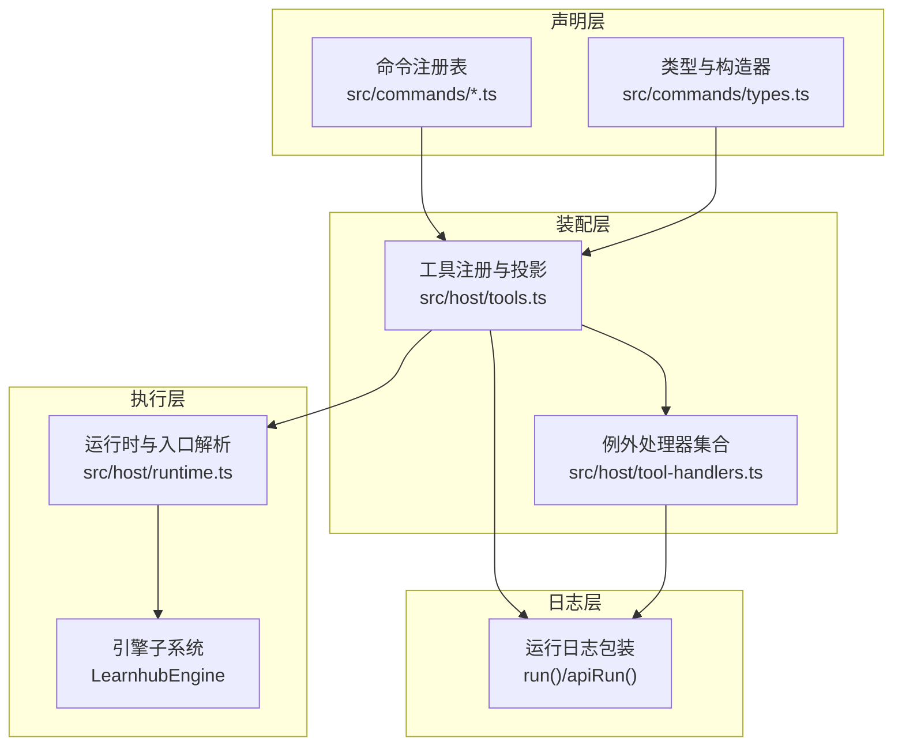
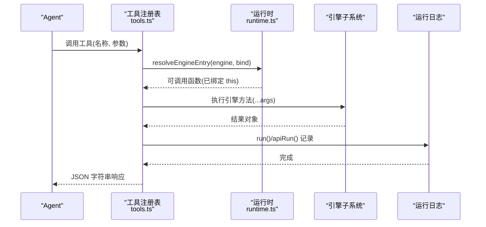
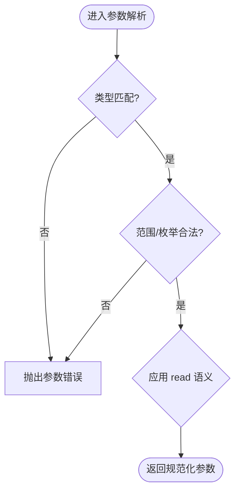
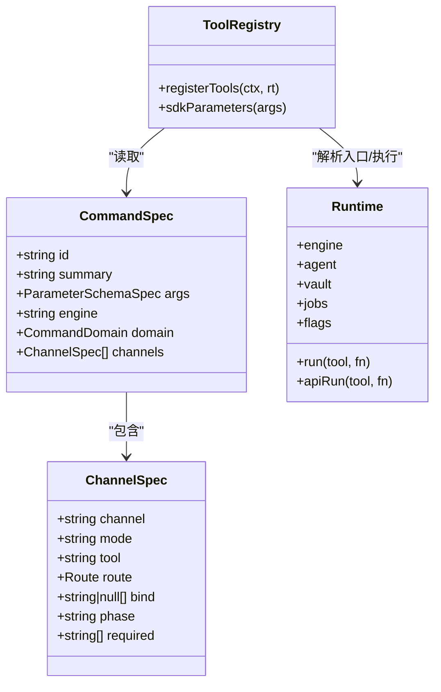
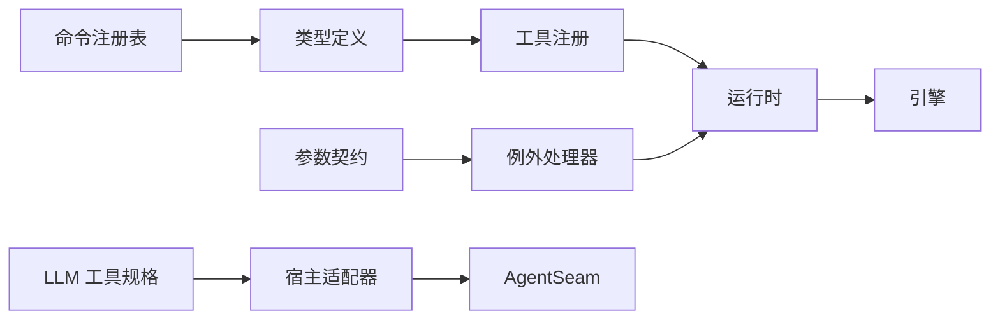

# 工具定义规范

<cite>
**本文引用的文件**
- [src/tool-contracts.ts](file://src/tool-contracts.ts)
- [src/host/tools.ts](file://src/host/tools.ts)
- [src/host/tool-handlers.ts](file://src/host/tool-handlers.ts)
- [src/commands/types.ts](file://src/commands/types.ts)
- [src/commands/index.ts](file://src/commands/index.ts)
- [src/host/runtime.ts](file://src/host/runtime.ts)
- [src/engine/llm.ts](file://src/engine/llm.ts)
- [src/engine/schema.ts](file://src/engine/schema.ts)
- [src/commands/学习.ts](file://src/commands/学习.ts)
- [src/commands/题库.ts](file://src/commands/题库.ts)
</cite>

## 目录
1. [简介](#简介)
2. [项目结构](#项目结构)
3. [核心组件](#核心组件)
4. [架构总览](#架构总览)
5. [详细组件分析](#详细组件分析)
6. [依赖关系分析](#依赖关系分析)
7. [性能考量](#性能考量)
8. [故障排查指南](#故障排查指南)
9. [结论](#结论)
10. [附录：完整示例与最佳实践](#附录完整示例与最佳实践)

## 简介
本规范面向“工具”（Agent 侧可被模型调用的能力）的定义、注册、执行与治理。目标包括：
- 明确工具的元数据定义（名称、描述、参数 schema 等）
- 统一参数验证、返回值格式与错误处理机制
- 说明工具的执行上下文与可用资源访问权限
- 提供从简单查询到复杂业务工具的完整实现模式
- 覆盖工具版本管理与向后兼容性策略

## 项目结构
工具系统由“声明—装配—执行—日志”四层构成：
- 声明层：命令注册表集中定义工具元数据与通道映射（agent/panel），以及参数 schema
- 装配层：将声明转换为 SDK defineTool，并绑定执行路径（生成路径或例外 handler）
- 执行层：通过运行时 runtime 调用引擎子系统方法，封装为 JSON 字符串返回
- 日志层：统一记录每次工具调用的输入输出摘要

图表来源
- [src/commands/index.ts:25-46](file://src/commands/index.ts#L25-L46)
- [src/host/tools.ts:101-125](file://src/host/tools.ts#L101-L125)
- [src/host/runtime.ts:198-238](file://src/host/runtime.ts#L198-L238)

章节来源
- [src/commands/index.ts:25-46](file://src/commands/index.ts#L25-L46)
- [src/host/tools.ts:101-125](file://src/host/tools.ts#L101-L125)
- [src/host/runtime.ts:198-238](file://src/host/runtime.ts#L198-L238)

## 核心组件
- 命令注册表与类型
  - CommandSpec：包含 id、summary、args、engine、domain、channels、output（派生）
  - ChannelSpec：channel=agent|panel；mode=sync|queued；tool/route；bind；phase；required 等
  - ParamSpec：SDK 兼容的 per-property DSL（type/required/description/enum/items/additionalProperties），外加 read 取值语义
- 工具注册与参数投影
  - sdkParameters：将声明中的 args 投影为 SDK 的 parameters（剥离投递层扩展键）
  - registerTools：遍历 COMMAND_LIST，按 agent 通道注册 defineTool，name/description/parameters 逐字不变
- 执行路径
  - 生成路径：engine + bind → resolveEngineEntry → run(rt, tool, fn) → JSON.stringify
  - 例外路径：tool-handlers 中针对形状加工/实参换算的工具，直接调用引擎并包装日志
- 运行时与日志
  - HostRuntime：承载 engine、agent、vault、jobs、flags 等
  - run/apiRun：统一包装引擎调用，落盘运行日志，失败也留痕

章节来源
- [src/commands/types.ts:54-129](file://src/commands/types.ts#L54-L129)
- [src/host/tools.ts:72-125](file://src/host/tools.ts#L72-L125)
- [src/host/tool-handlers.ts:23-287](file://src/host/tool-handlers.ts#L23-L287)
- [src/host/runtime.ts:115-238](file://src/host/runtime.ts#L115-L238)

## 架构总览
工具在宿主侧以“声明驱动”的方式暴露给 Agent。注册阶段仅做“元数据投影”，执行阶段才解析引擎入口并调用。

图表来源
- [src/host/tools.ts:101-125](file://src/host/tools.ts#L101-L125)
- [src/host/runtime.ts:198-238](file://src/host/runtime.ts#L198-L238)

## 详细组件分析

### 参数验证与 Schema 契约
- 参数声明遵循 SDK 的 per-property DSL，确保工具面 schema 与重构前一致（门⑧断言）
- 可选参数采用“缺省值 + 合法值”双形态；缺失即拒绝的参数使用显式校验器（如 requireSkipDirection、rejectId）
- 常见校验器集中在 tool-contracts.ts，例如：
  - questionCount：缺省默认值，给出则必须为正整数
  - applyId/rejectId：正整数约束
  - graphKind：枚举白名单
  - bandPref：可选枚举，非法视为 undefined
- 面板与工具对同一命令可能有不同必填要求，ChannelSpec.required 表达通道级差异

图表来源
- [src/tool-contracts.ts:11-54](file://src/tool-contracts.ts#L11-L54)
- [src/commands/types.ts:54-74](file://src/commands/types.ts#L54-L74)

章节来源
- [src/tool-contracts.ts:11-54](file://src/tool-contracts.ts#L11-L54)
- [src/commands/types.ts:54-74](file://src/commands/types.ts#L54-L74)

### 工具元数据定义
- name：来自 ChannelSpec.tool（agent 通道）
- description：来自 CommandSpec.summary（唯一权威来源）
- parameters：由 sdkParameters 从 CommandSpec.args 投影而来，严格保留 SDK 字段
- output：由 engine 返回类型推导（编译期幻影字段），UI 端据此获得响应类型

章节来源
- [src/host/tools.ts:72-125](file://src/host/tools.ts#L72-L125)
- [src/commands/types.ts:100-129](file://src/commands/types.ts#L100-L129)

### 执行上下文与资源访问权限
- 所有技术层函数通过显式传入 HostRuntime 访问资源，避免模块级隐式状态
- HostRuntime 暴露：
  - engine：引擎门面实例（各子系统方法）
  - agent：统一 LLM 缝（用于站内站点的 AI 调用）
  - corpus：语料捕获器（AI 调用落盘）
  - vault/centerRel：部署路径
  - jobs：生成任务注册表与出题结果表
  - flags：队列暂停、泵并发、会话节流戳等
- 工具执行一律通过 run(rt, tool, fn) 包装，保证日志记录与异常留痕

章节来源
- [src/host/runtime.ts:115-193](file://src/host/runtime.ts#L115-L193)
- [src/host/runtime.ts:217-238](file://src/host/runtime.ts#L217-L238)

### 错误处理机制
- 参数校验失败：在 tool-contracts 中抛错，阻止后续执行
- 引擎调用失败：run/apiRun 捕获异常并写入运行日志，随后原样抛出
- 队列型任务：等待终态后根据 status/message 决定成功或抛错（如出题任务 cancelled/非 done）
- 写操作联动：部分工具在成功后触发副作用（如 afterGraphApply、sweepGenJobs），失败不静默吞掉

章节来源
- [src/host/tool-handlers.ts:59-99](file://src/host/tool-handlers.ts#L59-L99)
- [src/host/runtime.ts:243-253](file://src/host/runtime.ts#L243-L253)

### 工具分类与实现模式
- 生成路径（声明驱动）：
  - 条件：CommandSpec.engine 存在且 ChannelSpec.bind 指定
  - 流程：resolveEngineEntry → boundArgs → 执行引擎方法 → JSON.stringify → run 记录
  - 适用场景：纯透传引擎方法的工具（如 learnhub_question_audit、learnhub_recommend）
- 例外路径（handler 定制）：
  - 条件：需要形状加工或实参换算（如 learnhub_graph_apply、learnhub_question_generate）
  - 流程：tool-handlers 内实现逻辑 → 调用引擎 → JSON.stringify → run 记录
  - 适用场景：复杂分支、队列入队与等待、多步骤联动

图表来源
- [src/commands/types.ts:54-129](file://src/commands/types.ts#L54-L129)
- [src/host/tools.ts:72-125](file://src/host/tools.ts#L72-L125)
- [src/host/runtime.ts:115-238](file://src/host/runtime.ts#L115-L238)

章节来源
- [src/host/tools.ts:72-125](file://src/host/tools.ts#L72-L125)
- [src/host/tool-handlers.ts:23-287](file://src/host/tool-handlers.ts#L23-L287)

### LLM 工具回路集成
- 工具规格 LlmToolSpec：{ name, description, parameters }
- 工具调用 LlmToolCall：{ id, name, arguments }
- 工具回路消息 LlmLoopTurn：user/assistant/tool 三类角色
- 流式接口 LlmStream：支持 tools 白名单、temperature 等

章节来源
- [src/engine/llm.ts:51-82](file://src/engine/llm.ts#L51-L82)

## 依赖关系分析
- 命令注册表（commands/*）→ 类型（types.ts）→ 装配（host/tools.ts）→ 运行时（host/runtime.ts）→ 引擎（LearnhubEngine）
- 例外处理器（host/tool-handlers.ts）→ 运行时 → 引擎
- 参数契约（tool-contracts.ts）→ 例外处理器
- LLM 工具规格（engine/llm.ts）→ 宿主适配器（host/llm.ts）→ AgentSeam

图表来源
- [src/commands/index.ts:25-46](file://src/commands/index.ts#L25-L46)
- [src/host/tools.ts:101-125](file://src/host/tools.ts#L101-L25)
- [src/host/runtime.ts:198-238](file://src/host/runtime.ts#L198-L238)
- [src/tool-contracts.ts:11-54](file://src/tool-contracts.ts#L11-L54)
- [src/engine/llm.ts:51-82](file://src/engine/llm.ts#L51-L82)

章节来源
- [src/commands/index.ts:25-46](file://src/commands/index.ts#L25-L46)
- [src/host/tools.ts:101-125](file://src/host/tools.ts#L101-L125)
- [src/host/runtime.ts:198-238](file://src/host/runtime.ts#L198-L238)
- [src/tool-contracts.ts:11-54](file://src/tool-contracts.ts#L11-L54)
- [src/engine/llm.ts:51-82](file://src/engine/llm.ts#L51-L82)

## 性能考量
- 参数投影与注册仅在启动时进行，运行时开销低
- 生成路径通过 bind 减少重复类型声明，降低维护成本
- 队列型任务（如出题、罗盘重画）异步执行，工具侧同步等待终态，避免阻塞
- 运行日志截断（LOG_LIMIT）防止大输出影响磁盘与 IO

[本节为通用指导，无需特定文件引用]

## 故障排查指南
- 参数错误
  - 现象：调用立即报错，提示非法类型或缺失必填
  - 定位：检查 CommandSpec.args 与 tool-contracts 校验器
  - 参考路径：[参数校验器:11-54](file://src/tool-contracts.ts#L11-L54)
- 引擎入口不存在
  - 现象：resolveEngineEntry 抛错
  - 定位：核对 CommandSpec.engine 是否指向有效子系统方法
  - 参考路径：[入口解析:198-215](file://src/host/runtime.ts#L198-L215)
- 队列任务失败
  - 现象：waitForGenJob 返回非 done 状态
  - 定位：查看 job.status/job.message，必要时清理遗留任务
  - 参考路径：[出题任务等待:82-99](file://src/host/tool-handlers.ts#L82-L99)
- 运行日志
  - 位置：中心状态目录下“运行日志.md”
  - 内容：每次工具调用的时间戳、工具名、输出摘要（失败亦记录）
  - 参考路径：[运行日志:217-231](file://src/host/runtime.ts#L217-L231)

章节来源
- [src/tool-contracts.ts:11-54](file://src/tool-contracts.ts#L11-L54)
- [src/host/runtime.ts:198-231](file://src/host/runtime.ts#L198-L231)
- [src/host/tool-handlers.ts:82-99](file://src/host/tool-handlers.ts#L82-L99)

## 结论
本规范通过“声明驱动 + 运行时解耦”的方式，实现了工具的统一元数据管理、严格的参数契约、清晰的执行路径与完善的日志追踪。新增工具应优先走“生成路径”（engine + bind），仅在需要形状加工或实参换算时进入“例外路径”。参数校验集中在 tool-contracts，错误处理统一经 run/apiRun 落盘，便于排障与审计。

[本节为总结性内容，无需特定文件引用]

## 附录：完整示例与最佳实践

### 示例一：简单查询工具（无引擎直连）
- 场景：获取学习建议（read-only）
- 声明要点：
  - summary：工具描述（唯一权威）
  - args：空或最小必要参数
  - channels.agent：tool 名称
  - engine：对应引擎方法（如 learner.coachAdvice）
- 执行路径：生成路径，JSON 字符串返回
- 参考路径：
  - [命令声明示例:68-87](file://src/commands/学习.ts#L68-L87)
  - [工具注册](file://src/host/tools.ts:101-125)

章节来源
- [src/commands/学习.ts:68-87](file://src/commands/学习.ts#L68-L87)
- [src/host/tools.ts:101-125](file://src/host/tools.ts#L101-L125)

### 示例二：带参数校验的更新工具
- 场景：归档题目（question-archive）
- 声明要点：
  - args：course/node/qid/archived/reason
  - 必填项：course/node/qid/archived
  - read 语义：reason 使用 raw
- 执行路径：生成路径，调用 bank2.questionArchive
- 参考路径：
  - [命令声明示例](file://src/commands/题库.ts:102-120)

章节来源
- [src/commands/题库.ts:102-120](file://src/commands/题库.ts#L102-L120)

### 示例三：复杂业务工具（队列 + 等待 + 联动）
- 场景：自动出题（learnhub_question_generate）
- 流程：
  - 参数校验：questionCount
  - 入队：enqueueQuizGeneration
  - 等待：waitForGenJob
  - 读取结果：quizJobResults
  - 联动：多样性指标随结果返回
- 参考路径：
  - [工具实现](file://src/host/tool-handlers.ts:82-99)
  - [参数校验](file://src/tool-contracts.ts:18-25)

章节来源
- [src/host/tool-handlers.ts:82-99](file://src/host/tool-handlers.ts#L82-L99)
- [src/tool-contracts.ts:18-25](file://src/tool-contracts.ts#L18-L25)

### 示例四：图提案应用（分支 + 联动）
- 场景：apply/reject 图提案
- 流程：
  - 参数校验：graphKind、applyId/rejectId
  - 分支：reject 走拒绝留痕；apply 走应用并触发 afterGraphApply
- 参考路径：
  - [工具实现](file://src/host/tool-handlers.ts:59-71)
  - [参数校验](file://src/tool-contracts.ts:27-48)

章节来源
- [src/host/tool-handlers.ts:59-71](file://src/host/tool-handlers.ts#L59-L71)
- [src/tool-contracts.ts:27-48](file://src/tool-contracts.ts#L27-L48)

### 版本管理与向后兼容
- 数据 schema 版本硬门：CURRENT_SCHEMA_VERSION 当前主版本，旧库拒载并指引迁移脚本
- 断裂策略：宣告式断裂，零兼容代码；旧课程整体存档，迁移脚本追加 breaks 记录
- 工具层面：工具元数据与参数 schema 保持与 SDK 契约一致，避免破坏性变更
- 参考路径：
  - [schema 版本硬门](file://src/engine/schema.ts:1-79)

章节来源
- [src/engine/schema.ts:1-79](file://src/engine/schema.ts#L1-L79)

### 最佳实践清单
- 始终在 CommandSpec.summary 中写明工具用途（唯一权威）
- 参数尽量使用 ParamSpec 的 type/required/description/enum，复杂读法用 read
- 需要强约束的参数使用 tool-contracts 中的校验器
- 能走生成路径就走生成路径，减少手写 handler
- 队列型任务务必等待终态并正确处理 cancelled/failed
- 写操作成功后考虑是否需要联动（如 afterGraphApply、sweepGenJobs）
- 所有工具调用经 run/apiRun 包装，确保运行日志完整

[本节为通用指导，无需特定文件引用]