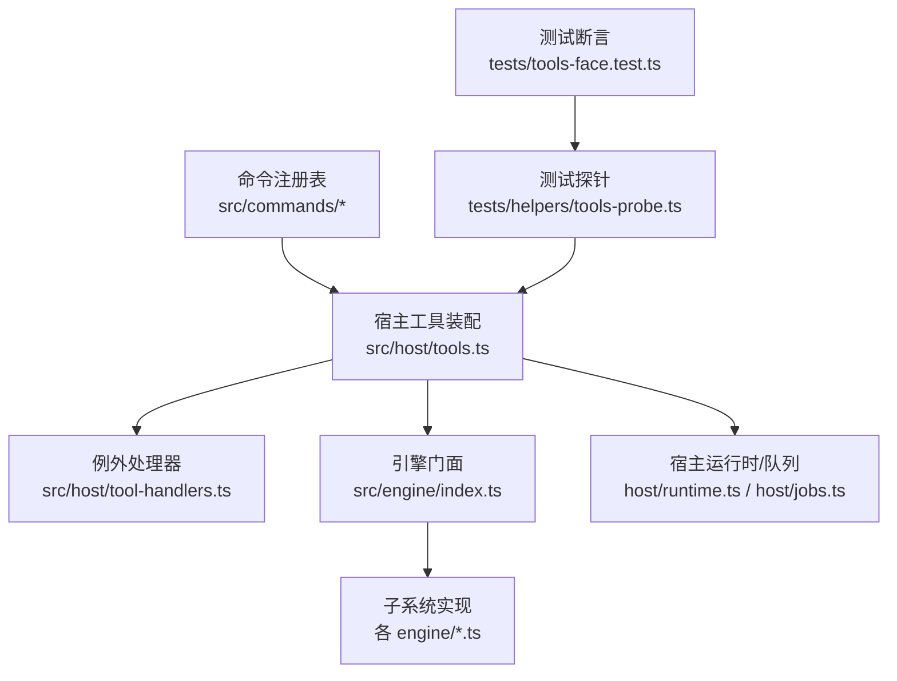
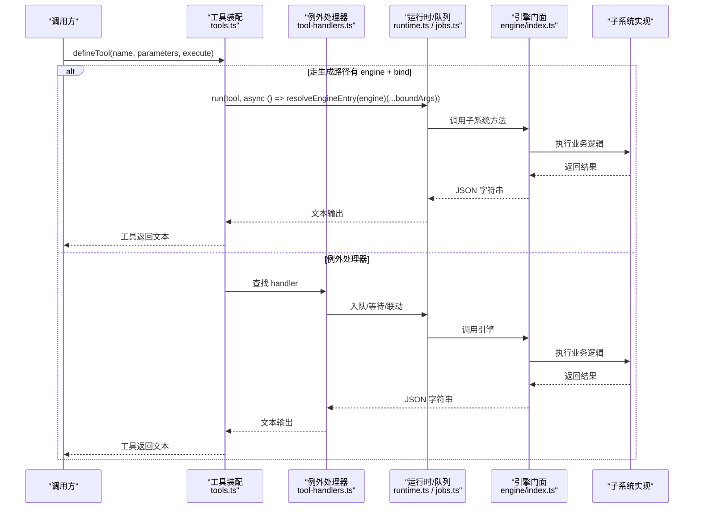
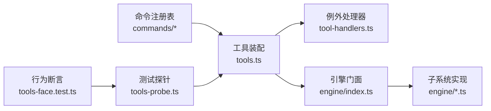

# 工具开发示例

<cite>
**本文引用的文件**
- [src/host/tools.ts](file://src/host/tools.ts)
- [src/host/tool-handlers.ts](file://src/host/tool-handlers.ts)
- [src/commands/index.ts](file://src/commands/index.ts)
- [src/commands/types.ts](file://src/commands/types.ts)
- [src/commands/学习.ts](file://src/commands/学习.ts)
- [src/commands/图谱.ts](file://src/commands/图谱.ts)
- [src/engine/index.ts](file://src/engine/index.ts)
- [src/tool-contracts.ts](file://src/tool-contracts.ts)
- [tests/tools-face.test.ts](file://tests/tools-face.test.ts)
- [tests/helpers/tools-probe.ts](file://tests/helpers/tools-probe.ts)
- [package.json](file://package.json)
- [ui/vite.config.ts](file://ui/vite.config.ts)
</cite>

## 目录
1. [简介](#简介)
2. [项目结构](#项目结构)
3. [核心组件](#核心组件)
4. [架构总览](#架构总览)
5. [详细组件分析](#详细组件分析)
6. [依赖分析](#依赖分析)
7. [性能考虑](#性能考虑)
8. [故障排查指南](#故障排查指南)
9. [结论](#结论)
10. [附录](#附录)

## 简介
本文件面向“从简单到复杂”的工具开发实践，基于仓库中已落地的“命令注册表 + 宿主工具面 + 引擎子系统”的成熟模式，给出可复用的模板与最佳实践。内容覆盖：
- 文件操作、数据处理、API 调用三类工具的完整示例（以仓库内真实工具为蓝本）
- 设计思路、实现细节、使用方法
- 最佳实践与常见陷阱
- 测试与验证（含行为快照回归）
- 部署与分发（构建产物与宿主集成）
- 如何把现有引擎能力封装成自定义工具

## 项目结构
该工程采用“声明驱动”的工具装配方式：在命令注册表中集中声明每个工具的参数、通道（agent/panel）、执行入口（engine 或例外 handler），由宿主统一装配为 agent 工具与面板路由。

**图表来源**
- [src/host/tools.ts:102-125](file://src/host/tools.ts#L102-L125)
- [src/host/tool-handlers.ts:23-286](file://src/host/tool-handlers.ts#L23-L286)
- [src/commands/index.ts:25-71](file://src/commands/index.ts#L25-L71)
- [src/engine/index.ts:149-398](file://src/engine/index.ts#L149-L398)
- [tests/helpers/tools-probe.ts:123-143](file://tests/helpers/tools-probe.ts#L123-L143)
- [tests/tools-face.test.ts:21-35](file://tests/tools-face.test.ts#L21-L35)

**章节来源**
- [src/commands/index.ts:25-71](file://src/commands/index.ts#L25-L71)
- [src/host/tools.ts:102-125](file://src/host/tools.ts#L102-L125)

## 核心组件
- 命令注册表（commands）：单点声明所有工具/路由的参数、描述、通道、绑定与阶段；类型安全地派生出 UI 响应类型。
- 宿主工具装配（tools.ts）：遍历注册表，按是否走生成路径分流到“引擎直调”或“例外 handler”。
- 例外处理器（tool-handlers.ts）：对需要参数换算、形状加工或异步队列化的工具提供具体实现。
- 引擎门面（engine/index.ts）：数据访问与业务逻辑的统一入口，工具不得绕过门面直写数据。
- 参数契约（tool-contracts.ts）：显式参数解析器，保证非法输入不静默改写。
- 测试探针与回归（tests/helpers/tools-probe.ts, tests/tools-face.test.ts）：对 111+ 工具进行确定性探针与快照比对。

**章节来源**
- [src/commands/types.ts:100-128](file://src/commands/types.ts#L100-L128)
- [src/host/tools.ts:72-125](file://src/host/tools.ts#L72-L125)
- [src/host/tool-handlers.ts:1-22](file://src/host/tool-handlers.ts#L1-L22)
- [src/engine/index.ts:1-10](file://src/engine/index.ts#L1-L10)
- [src/tool-contracts.ts:1-55](file://src/tool-contracts.ts#L1-L55)
- [tests/tools-face.test.ts:1-38](file://tests/tools-face.test.ts#L1-L38)

## 架构总览
下图展示一次“通过 agent 工具调用引擎方法”的端到端流程，以及“例外处理器”的分支。

**图表来源**
- [src/host/tools.ts:102-125](file://src/host/tools.ts#L102-L125)
- [src/host/tool-handlers.ts:23-286](file://src/host/tool-handlers.ts#L23-L286)
- [src/engine/index.ts:149-398](file://src/engine/index.ts#L149-L398)

## 详细组件分析

### 示例一：文件操作工具（笔记源扫描与导出）
- 目标：读取 vault 中的笔记链接先验并导出 Anki 卡片（只读/写入分离）。
- 关键步骤
  - 在命令注册表中声明工具（如 learnhub_vault_links_scan、learnhub_anki_export/import/status）。
  - 若需参数换算或队列化，则在 tool-handlers.ts 中实现对应 handler。
  - 通过引擎子系统完成 vault 扫描、Anki 连接与推送。
- 使用要点
  - 仅读扫描不修改个人笔记；导出/导入通过 AnkiConnectClient 与外部系统交互。
  - 错误处理：端口不可达、格式校验失败等应抛出明确错误。
- 最佳实践
  - 所有 I/O 必须经引擎门面，避免绕过文件系统抽象。
  - 对外部 API（如 Anki）使用客户端封装，便于替换与测试。

**章节来源**
- [src/commands/图谱.ts:297-311](file://src/commands/图谱.ts#L297-L311)
- [src/host/tool-handlers.ts:252-263](file://src/host/tool-handlers.ts#L252-L263)
- [src/engine/index.ts:659-668](file://src/engine/index.ts#L659-L668)

### 示例二：数据处理工具（题库体检与清理）
- 目标：盘点违规题目、预览/归档未归档题，零破坏性修复。
- 关键步骤
  - 声明 learnhub_question_audit、learnhub_bank_cleanup。
  - 审计只读扫描题库 YAML，标记违规项；清理分预览与应用两步。
  - 通过引擎子系统读取题库、计算健康度、生成提案或直接应用。
- 使用要点
  - 审计不写入；清理需显式 apply=true 才生效。
  - 参数校验严格（数量、状态枚举等）。
- 最佳实践
  - 将“预览—确认—应用”拆分为两步，降低误操作风险。
  - 报告包含指标（flagged、duplicates、rejected 等），便于追踪。

**章节来源**
- [src/commands/题库.ts:（见命令域）](file://src/commands/题库.ts)
- [src/host/tool-handlers.ts:116-119](file://src/host/tool-handlers.ts#L116-L119)
- [src/engine/index.ts:471-520](file://src/engine/index.ts#L471-L520)

### 示例三：API 调用工具（Anki 状态查询与同步）
- 目标：查询 Anki 状态、导入事件、导出卡片。
- 关键步骤
  - 在 tool-handlers.ts 中构造 AnkiConnectClient(endpoint)，调用引擎 channels 子系统。
  - 支持可选 endpoint，缺省使用 ANKI_ENDPOINT。
- 使用要点
  - 网络异常、认证失败时抛出明确错误。
  - 导入/导出幂等，重复执行不会产生副作用。
- 最佳实践
  - 将 endpoint 作为可选参数，便于多实例切换。
  - 日志记录调用耗时与 token 用量（通过宿主 LLM/语料捕获机制）。

**章节来源**
- [src/host/tool-handlers.ts:258-263](file://src/host/tool-handlers.ts#L258-L263)
- [src/engine/index.ts:74-78](file://src/engine/index.ts#L74-L78)

### 示例四：队列型工具（生成大纲/节重写/出题）
- 目标：将耗时任务入队，立即返回任务键，后续轮询终态。
- 关键步骤
  - 命令注册表中设置 mode=queued 与 phase（outline/sections/quiz 等）。
  - 宿主入队后等待终态，返回 status/message，必要时携带结果摘要。
- 使用要点
  - 取消通过生成页下发，任务取消沿回合传导。
  - 终态非 done 时抛错，cancelled 时返回取消消息。
- 最佳实践
  - 入队前做参数校验，失败尽早拒绝。
  - 结果中附带多样性/去重/拒绝等指标，便于评估质量。

**章节来源**
- [src/commands/学习.ts:231-253](file://src/commands/学习.ts#L231-L253)
- [src/host/tool-handlers.ts:82-99](file://src/host/tool-handlers.ts#L82-L99)

### 示例五：参数契约与健壮性（skip 方向、apply id、kind 白名单）
- 目标：确保工具参数合法，非法输入直接报错，不静默改写。
- 关键步骤
  - 使用 requireSkipDirection、applyId、rejectId、graphKind、bandPref 等解析器。
  - 在 handler 中组合使用，保证边界条件一致。
- 使用要点
  - 缺失必填参数即报错；可选参数省略时使用默认值。
  - 枚举值不在白名单内直接拒绝。
- 最佳实践
  - 将参数校验集中在 tool-contracts.ts，避免散落各处。
  - 错误信息包含收到值与期望范围，便于定位。

**章节来源**
- [src/tool-contracts.ts:11-54](file://src/tool-contracts.ts#L11-L54)
- [src/host/tool-handlers.ts:29-32](file://src/host/tool-handlers.ts#L29-L32)
- [src/host/tool-handlers.ts:59-71](file://src/host/tool-handlers.ts#L59-L71)

### 示例六：集成现有引擎功能到自定义工具
- 目标：将引擎子系统能力封装为 agent 工具，保持类型与契约一致。
- 关键步骤
  - 在 commands/* 中新增命令声明（id、args、summary、channels、engine/bind）。
  - 若无需特殊处理，tools.ts 自动装配为引擎直调；否则在 tool-handlers.ts 补充。
  - 通过 sdkParameters 将 args 投影为 SDK 的 parameters，保持工具面契约不变。
- 使用要点
  - summary 是工具 description 的唯一来源；UI 与 agent 共享。
  - bind 顺序决定引擎实参位置，null 表示传 undefined。
- 最佳实践
  - 优先走生成路径（engine + bind），减少例外处理器维护成本。
  - 输出类型由 engine 返回类型推导，避免手写。

**章节来源**
- [src/commands/index.ts:25-71](file://src/commands/index.ts#L25-L71)
- [src/host/tools.ts:72-125](file://src/host/tools.ts#L72-L125)
- [src/commands/types.ts:100-128](file://src/commands/types.ts#L100-L128)

## 依赖分析
- 低耦合：命令注册表纯声明，无运行时依赖；UI 可通过类型导入获得响应类型。
- 单一事实源：引擎门面集中数据访问，工具不得绕过。
- 可扩展：新增工具只需在注册表声明，必要时补充 handler。
- 可测试：探针与快照确保行为一致性。

**图表来源**
- [src/commands/index.ts:25-71](file://src/commands/index.ts#L25-L71)
- [src/host/tools.ts:102-125](file://src/host/tools.ts#L102-L125)
- [src/host/tool-handlers.ts:23-286](file://src/host/tool-handlers.ts#L23-L286)
- [src/engine/index.ts:149-398](file://src/engine/index.ts#L149-L398)
- [tests/helpers/tools-probe.ts:123-143](file://tests/helpers/tools-probe.ts#L123-L143)
- [tests/tools-face.test.ts:21-35](file://tests/tools-face.test.ts#L21-L35)

**章节来源**
- [src/commands/types.ts:1-15](file://src/commands/types.ts#L1-L15)
- [src/engine/index.ts:1-10](file://src/engine/index.ts#L1-L10)

## 性能考虑
- 队列化长耗时任务：大纲/节重写/出题等通过入队避免阻塞。
- 只读优先：审计/体检类工具不写入，降低副作用。
- 缓存与复用：FSRS 调度器按课程根缓存，避免重复初始化。
- 资源限制：生成任务上限与取消机制，防止资源耗尽。

[本节为通用指导，不直接分析具体文件]

## 故障排查指南
- 参数错误：检查 tool-contracts.ts 中的解析器，确认必填与枚举值。
- 引擎调用失败：查看 handler 中 run/入队/等待终态的逻辑，确认任务状态。
- 外部 API 异常：检查 AnkiConnectClient 配置与网络连通性。
- 行为漂移：运行 tools-face.test.ts，对比快照差异，定位变更点。

**章节来源**
- [src/tool-contracts.ts:11-54](file://src/tool-contracts.ts#L11-L54)
- [src/host/tool-handlers.ts:82-99](file://src/host/tool-handlers.ts#L82-L99)
- [tests/tools-face.test.ts:21-35](file://tests/tools-face.test.ts#L21-L35)

## 结论
本仓库提供了“声明驱动 + 宿主装配 + 引擎门面”的工具开发范式，适合快速扩展文件操作、数据处理与 API 调用类工具。通过严格的参数契约、队列化长任务、只读优先策略与完善的测试回归，确保工具的可维护性与稳定性。新增工具时，优先走生成路径，仅在必要时补充例外处理器，并保持与现有契约一致。

[本节为总结，不直接分析具体文件]

## 附录

### 开发与测试流程
- 新增工具：在 commands/* 中声明 → 若需特殊处理则补充 handler → 运行测试探针与断言。
- 本地调试：通过宿主启动 agent 会话，调用工具观察返回文本与调用序列。
- 回归保障：tests/tools-face.test.ts 要求行为与快照逐字一致。

**章节来源**
- [tests/helpers/tools-probe.ts:123-143](file://tests/helpers/tools-probe.ts#L123-L143)
- [tests/tools-face.test.ts:21-35](file://tests/tools-face.test.ts#L21-L35)

### 构建与部署
- 构建产物：UI 构建输出至 web/dist，被宿主静态伺服。
- 插件打包：package.json 定义 exports 与 files，供 dsh 宿主加载。
- 脚本：build/smoke/spike/quality-review 等脚本用于冒烟、实验与评审。

**章节来源**
- [ui/vite.config.ts:4-14](file://ui/vite.config.ts#L4-L14)
- [package.json:18-47](file://package.json#L18-L47)