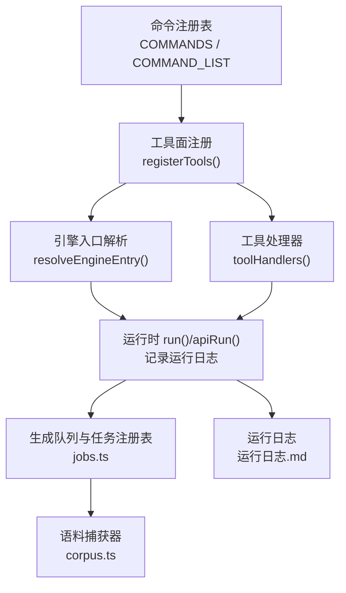
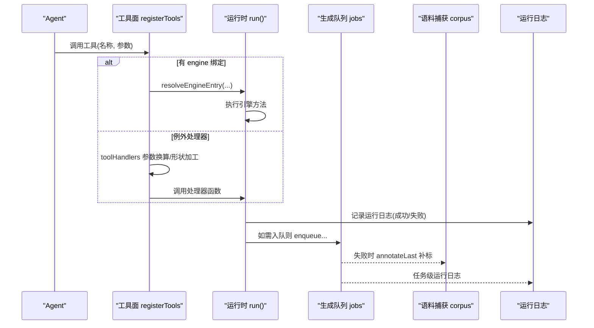
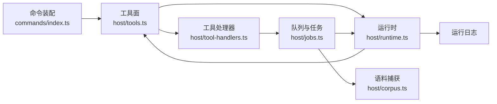
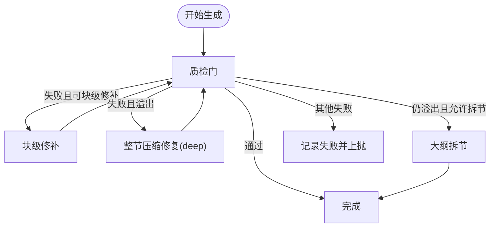

# 工具执行环境

<cite>
**本文引用的文件**
- [src/host/tools.ts](file://src/host/tools.ts)
- [src/host/tool-handlers.ts](file://src/host/tool-handlers.ts)
- [src/host/runtime.ts](file://src/host/runtime.ts)
- [src/host/jobs.ts](file://src/host/jobs.ts)
- [src/host/corpus.ts](file://src/host/corpus.ts)
- [src/commands/index.ts](file://src/commands/index.ts)
- [src/tool-contracts.ts](file://src/tool-contracts.ts)
- [src/engine/project-exec.ts](file://src/engine/project-exec.ts)
</cite>

## 目录
1. [简介](#简介)
2. [项目结构](#项目结构)
3. [核心组件](#核心组件)
4. [架构总览](#架构总览)
5. [详细组件分析](#详细组件分析)
6. [依赖关系分析](#依赖关系分析)
7. [性能与监控](#性能与监控)
8. [预算控制与超时管理](#预算控制与超时管理)
9. [错误处理与异常恢复](#错误处理与异常恢复)
10. [并发控制与资源隔离](#并发控制与资源隔离)
11. [调试与故障排除指南](#调试与故障排除指南)
12. [结论](#结论)

## 简介
本文件面向“工具执行环境”的完整实现，覆盖工具调用的执行上下文、运行时对象、队列与任务注册表、预算与超时、错误与恢复、性能监控与日志、以及并发与资源隔离。目标是让读者在不深入源码的情况下，也能理解工具从调用到落盘的全链路机制，并能在生产环境中定位问题与优化性能。

## 项目结构
围绕工具执行的关键模块集中在宿主层（host）与命令装配（commands），引擎侧提供能力入口与领域逻辑：
- 命令装配与工具面注册：将命令表映射为 agent 工具与面板路由
- 运行时与队列：显式 runtime 承载引擎、agent、语料捕获、任务注册表与标志位；全局单并发泵驱动生成队列
- 工具处理器：对无法走“注册表→引擎入口”路径的工具进行参数换算与形状加工
- 语料捕获：LLM 调用全量落盘，支持失败补标与环形保留
- 运行日志：每次工具调用输出摘要持久化

图表来源
- [src/commands/index.ts:25-46](file://src/commands/index.ts#L25-L46)
- [src/host/tools.ts:102-125](file://src/host/tools.ts#L102-L125)
- [src/host/tool-handlers.ts:23-287](file://src/host/tool-handlers.ts#L23-L287)
- [src/host/runtime.ts:204-238](file://src/host/runtime.ts#L204-L238)
- [src/host/jobs.ts:269-740](file://src/host/jobs.ts#L269-L740)
- [src/host/corpus.ts:186-342](file://src/host/corpus.ts#L186-L342)

章节来源
- [src/commands/index.ts:25-46](file://src/commands/index.ts#L25-L46)
- [src/host/tools.ts:102-125](file://src/host/tools.ts#L102-L125)
- [src/host/tool-handlers.ts:23-287](file://src/host/tool-handlers.ts#L23-L287)
- [src/host/runtime.ts:204-238](file://src/host/runtime.ts#L204-L238)
- [src/host/jobs.ts:269-740](file://src/host/jobs.ts#L269-L740)
- [src/host/corpus.ts:186-342](file://src/host/corpus.ts#L186-L342)

## 核心组件
- 命令装配与工具面：通过命令表统一声明工具名、描述、参数 schema、engine 绑定或 handler 函数，由 registerTools 装配为可被 agent 调用的工具。
- 运行时 runtime：集中承载引擎实例、agent 缝、语料捕获、任务注册表、标志位与配置；所有技术层函数以 runtime 为依赖注入点，便于测试与隔离。
- 生成队列与任务注册表：FIFO 队列 + 全局单并发泵；支持入队、等待终态、取消、保留期清扫、重启恢复。
- 工具处理器：对需要参数换算或形状加工的工具提供专用 handler，不走通用 engine 绑定路径。
- 语料捕获：每个 LLM 调用落盘为独立文件，支持 outcome 三态（ok/tolerated/failed）、环形保留、失败补标、工具调用载荷落档。
- 运行日志：每次工具调用结果摘要写入中心状态目录的运行日志文件，失败也留痕。

章节来源
- [src/host/tools.ts:102-125](file://src/host/tools.ts#L102-L125)
- [src/host/runtime.ts:118-193](file://src/host/runtime.ts#L118-L193)
- [src/host/jobs.ts:269-740](file://src/host/jobs.ts#L269-L740)
- [src/host/tool-handlers.ts:23-287](file://src/host/tool-handlers.ts#L23-L287)
- [src/host/corpus.ts:186-342](file://src/host/corpus.ts#L186-L342)
- [src/host/runtime.ts:217-238](file://src/host/runtime.ts#L217-L238)

## 架构总览
工具调用从命令表出发，经工具面注册进入运行时，再根据是否具备 engine 绑定选择两条路径：
- 注册表驱动路径：resolveEngineEntry 解析引擎入口 → run 包装执行 → 运行日志
- 例外处理器路径：tool-handlers 中针对特定工具做参数换算与形状加工 → run 包装执行 → 运行日志

对于耗时或写多步骤的任务（正文生成、出题、图域任务、生长批等），统一入队 jobs 并通过 pumpGeneration 单并发执行，最终落盘注册表并触发清理与回调。

图表来源
- [src/host/tools.ts:102-125](file://src/host/tools.ts#L102-L125)
- [src/host/tool-handlers.ts:23-287](file://src/host/tool-handlers.ts#L23-L287)
- [src/host/runtime.ts:204-238](file://src/host/runtime.ts#L204-L238)
- [src/host/jobs.ts:269-740](file://src/host/jobs.ts#L269-L740)
- [src/host/corpus.ts:186-342](file://src/host/corpus.ts#L186-L342)

## 详细组件分析

### 工具面与命令装配
- 命令表集中声明工具元数据（id、summary、args、channels、engine/bind 等），并提供按工具名索引的 BY_TOOL 与按路由索引的 BY_ROUTE。
- registerTools 遍历命令列表，为 agent 通道注册 defineTool：
  - 若存在 engine + bind：execute 通过 resolveEngineEntry 解析引擎入口并以 run 包装执行
  - 否则使用 tool-handlers 中的处理器函数
- sdkParameters 将命令 args 投影为 SDK 所需的 parameters 形态，确保工具面 schema 与历史快照一致。

章节来源
- [src/commands/index.ts:25-72](file://src/commands/index.ts#L25-L72)
- [src/host/tools.ts:78-125](file://src/host/tools.ts#L78-L125)

### 运行时与执行包装
- HostRuntime 显式承载引擎、agent、语料捕获、vault/centerRel、任务注册表、标志位与配置（如 quizAuditRate）。
- run/apiRun 是工具执行的唯一出口：
  - run：执行后记录运行日志（文本摘要截断）
  - apiRun：用于面板路由，失败也记录运行日志并原样抛出
- resolveEngineEntry 支持“子系统.方法”的点路径解析，并对类方法进行 bind，保证 this 正确。

章节来源
- [src/host/runtime.ts:118-193](file://src/host/runtime.ts#L118-L193)
- [src/host/runtime.ts:204-238](file://src/host/runtime.ts#L204-L238)

### 生成队列与任务注册表
- 入队：enqueueGeneration、enqueueQuizGeneration、enqueueGraphJob、enqueueGrowthBatch 均会检查队列可写（broken 态拒绝）、重复入队幂等、终点禁止生成等约束。
- 执行泵：pumpGeneration 全局单并发 FIFO，按 phase 分发到不同执行器（内容管线、纯出题、图域任务、生长批）。
- 等待与超时：waitForGenJob 提供同步语义（入队+等待终态+读取结果），默认超时 15 分钟。
- 保留期与清扫：scheduleJobRetention 在终态时设置 finishedAt 并按策略延时删除；sweepGenJobs 清理悬空任务与过期记录。
- 失败与恢复：任务失败时记录失败详情与语料引用；进程重启后恢复 running 为 failed 并继续泵。

章节来源
- [src/host/jobs.ts:269-740](file://src/host/jobs.ts#L269-L740)

### 工具处理器（例外路径）
- 对需要参数换算或形状加工的工具（如 skip 方向、apply id、kind 校验等），在 tool-handlers 中集中处理，避免散落在各处。
- 参数校验集中在 tool-contracts.ts，确保非法输入 fail loud，不静默改写。

章节来源
- [src/host/tool-handlers.ts:23-287](file://src/host/tool-handlers.ts#L23-L287)
- [src/tool-contracts.ts:1-55](file://src/tool-contracts.ts#L1-L55)

### 语料捕获与失败补标
- 每个 LLM 调用落盘为独立文件，包含 frontmatter（时间、站、模式、effort、outcome、code、truncated、durationMs、usage、provider、model、prompt_chars、reply_chars）与提示词、原始输出段，必要时附带工具调用段。
- 环形保留：每站 ok 桶保留最近 25 条，bad/tolerated 桶保留最近 200 条，超限时按文件名前缀修剪。
- 失败补标：在 jobs 的 catch 点调用 failCorpus(rt, station, err)，将最近一条捕获改判 failed+失败码，并返回引用供任务失败详情携带。
- 写盘异步 fire-and-forget，失败静默，不阻塞主流程。

章节来源
- [src/host/corpus.ts:186-342](file://src/host/corpus.ts#L186-L342)
- [src/host/jobs.ts:34-80](file://src/host/jobs.ts#L34-L80)

### 运行日志
- runLog 将每次工具调用的输出摘要追加到中心状态目录的运行日志文件，超过长度截断并标注“已截断”。
- 失败路径通过 apiRun 同样记录失败原因，便于排查。

章节来源
- [src/host/runtime.ts:217-238](file://src/host/runtime.ts#L217-L238)

## 依赖关系分析
- 工具面依赖命令装配与运行时：
  - tools.ts 依赖 commands/index.ts 获取命令列表与参数 schema
  - tools.ts 依赖 runtime.ts 的 resolveEngineEntry 与 run
  - tool-handlers.ts 依赖 runtime.ts 的 run 与 jobs.ts 的入队/等待/清扫
- 队列依赖运行时与引擎：
  - jobs.ts 读写 rt.jobs.genJobs、rt.flags，调用 rt.engine.* 执行具体业务
- 语料捕获依赖 host/llm.ts 的适配器与站点常量 STATIONS
- 运行日志依赖 engine.paths.centerStateDir

图表来源
- [src/commands/index.ts:25-72](file://src/commands/index.ts#L25-L72)
- [src/host/tools.ts:102-125](file://src/host/tools.ts#L102-L125)
- [src/host/tool-handlers.ts:23-287](file://src/host/tool-handlers.ts#L23-L287)
- [src/host/runtime.ts:204-238](file://src/host/runtime.ts#L204-L238)
- [src/host/jobs.ts:269-740](file://src/host/jobs.ts#L269-L740)
- [src/host/corpus.ts:186-342](file://src/host/corpus.ts#L186-L342)

章节来源
- [src/commands/index.ts:25-72](file://src/commands/index.ts#L25-L72)
- [src/host/tools.ts:102-125](file://src/host/tools.ts#L102-L125)
- [src/host/tool-handlers.ts:23-287](file://src/host/tool-handlers.ts#L23-L287)
- [src/host/runtime.ts:204-238](file://src/host/runtime.ts#L204-L238)
- [src/host/jobs.ts:269-740](file://src/host/jobs.ts#L269-L740)
- [src/host/corpus.ts:186-342](file://src/host/corpus.ts#L186-L342)

## 性能与监控
- 性能特征
  - 全局单并发泵：避免并发竞争与锁争用，简化一致性保障
  - 任务注册表持久化：每次变更落盘，支持面板恢复与跨重启可见性
  - 语料捕获环形保留：限制磁盘增长，同时保留足够样本用于质量评审与回归
  - 运行日志截断：避免日志过大影响 IO
- 监控指标
  - 任务状态机：queued/running/cancelling/done/failed/partial，带 message 与 failures
  - 出站调用统计：AgentSeam onCall 打印 durationMs、字符数、token 用量
  - 语料 outcome：ok/tolerated/failed 分布与失败码
  - 运行日志：工具调用次数、失败率、平均响应时长（需外部聚合）

章节来源
- [src/host/jobs.ts:269-740](file://src/host/jobs.ts#L269-L740)
- [src/host/runtime.ts:169-182](file://src/host/runtime.ts#L169-L182)
- [src/host/corpus.ts:27-31](file://src/host/corpus.ts#L27-L31)
- [src/host/runtime.ts:217-238](file://src/host/runtime.ts#L217-L238)

## 预算控制与超时管理
- 字数预算与门禁
  - 节正文生成时，若质检门失败且携带 wordBudget，则尝试块级局部修补；若仍失败且为溢出，则进入整节压缩修复一轮（deep 档）；仍溢出且允许拆节时抛溢出错误交由上层阶梯处理
  - 溢出错误结构化（code=GATE_FAILED，含 sectionId/sectionTitle/wordBudget/wordBlock），便于面板展示与重试
- 超时控制
  - waitForGenJob 默认 15 分钟超时，期间轮询任务注册表直到终态或超时
  - 生成过程支持 isCancelled 回调，可在取消旗标置位时丢弃结果并快速退出
- 队列暂停与 broken 态
  - queuePaused 阻止泵启动；genQueueBroken 期间拒绝一切会全量落盘的写操作（入队、重置、恢复），防止坏档覆盖
  - 任务档损坏时给出明确文案与修复指引

图表来源
- [src/host/jobs.ts:180-248](file://src/host/jobs.ts#L180-L248)
- [src/host/jobs.ts:249-267](file://src/host/jobs.ts#L249-L267)
- [src/host/jobs.ts:355-376](file://src/host/jobs.ts#L355-L376)
- [src/host/jobs.ts:271-278](file://src/host/jobs.ts#L271-L278)

章节来源
- [src/host/jobs.ts:180-248](file://src/host/jobs.ts#L180-L248)
- [src/host/jobs.ts:249-267](file://src/host/jobs.ts#L249-L267)
- [src/host/jobs.ts:355-376](file://src/host/jobs.ts#L355-L376)
- [src/host/jobs.ts:271-278](file://src/host/jobs.ts#L271-L278)

## 错误处理与异常恢复
- 参数校验 fail loud：工具参数缺失或非法直接抛错，不静默降级（如 skipped 方向、question count、apply/reject id、graph kind 等）
- 任务失败补标：jobs 的 catch 点调用 failCorpus，将最近一条捕获改判 failed+失败码，并附加到任务消息
- 运行日志留痕：runLog 记录成功与失败，apiRun 在失败时也记录
- 恢复策略
  - 任务终态保留期：done/failed/cancelled 分别保留不同时长，便于重试与排查
  - 重启恢复：进程重启后，running 记录会被标记为 failed，队列继续泵
  - 队列 broken 态：写回闸拒绝破坏性操作，待修复后恢复
- 项目执行事件流
  - 执行事件追加到 projects/<id>/exec.jsonl，支持节点回流与 2×2 诊断
  - 评级映射与证据聚合用于推荐档位调整（只读建议，不自动改档）

章节来源
- [src/tool-contracts.ts:1-55](file://src/tool-contracts.ts#L1-L55)
- [src/host/jobs.ts:34-80](file://src/host/jobs.ts#L34-L80)
- [src/host/runtime.ts:217-238](file://src/host/runtime.ts#L217-L238)
- [src/host/jobs.ts:378-437](file://src/host/jobs.ts#L378-L437)
- [src/engine/project-exec.ts:41-104](file://src/engine/project-exec.ts#L41-L104)
- [src/engine/project-exec.ts:180-247](file://src/engine/project-exec.ts#L180-L247)

## 并发控制与资源隔离
- 全局单并发泵：pumpGeneration 同一时刻仅执行一个任务，避免并发写冲突与资源争用
- 任务键隔离：以 course/node 作为任务键，同键在途拒绝重复入队；quiz 与内容管线互斥
- 标志位隔离：queuePaused、pumping、genQueueBroken 控制泵行为与写回权限
- 语料捕获串行链：站内 record/annotate 通过串行链保证顺序，避免竞态
- 结果表隔离：quizJobResults 以 key 区分，随任务保留期清理

章节来源
- [src/host/jobs.ts:696-740](file://src/host/jobs.ts#L696-L740)
- [src/host/jobs.ts:288-350](file://src/host/jobs.ts#L288-L350)
- [src/host/corpus.ts:186-204](file://src/host/corpus.ts#L186-L204)
- [src/host/runtime.ts:118-133](file://src/host/runtime.ts#L118-L133)

## 调试与故障排除指南
- 查看运行日志
  - 路径：中心状态目录下的运行日志文件，记录每次工具调用的输出摘要与失败原因
  - 关注：失败条目、截断标记、工具名与时间戳
- 查看生成语料
  - 路径：学习中心 state/生成语料/<站>/，按 ok-/bad- 前缀分类
  - 关注：frontmatter 中的 outcome/code/duration_ms/provider/model，提示词与原始输出段，工具调用段
  - 失败补标：通过 annotateLast 将最近一条捕获改判 failed+失败码，便于定位死因样本
- 查看任务注册表
  - 路径：state/生成任务.json（由引擎保存），包含任务状态、阶段、进度、失败清单、模型等信息
  - 关注：status、phase、failures、message、finishedAt
- 常见故障与处理
  - 队列 broken：出现“任务档损坏”文案时，停止写操作，修复后重启恢复
  - 任务超时：waitForGenJob 超时后，可在生成队列查看后台任务状态
  - 正文溢出：按门禁失败提示进行块级修补或整节压缩，必要时触发拆节
  - 出题失败：查看语料捕获的失败码与提示词，确认先验检索与多样性指标
- 调试技巧
  - 使用 AGENT_GUIDE 中的工具描述与 prompt 模板，快速构造最小复现
  - 在工具处理器中增加临时日志（注意不要泄露敏感信息）
  - 利用 task.message 与 failures 字段定位失败节与原因

章节来源
- [src/host/runtime.ts:217-238](file://src/host/runtime.ts#L217-L238)
- [src/host/corpus.ts:186-342](file://src/host/corpus.ts#L186-L342)
- [src/host/jobs.ts:378-437](file://src/host/jobs.ts#L378-L437)
- [src/host/jobs.ts:180-248](file://src/host/jobs.ts#L180-L248)

## 结论
本项目的工具执行环境以“显式 runtime + 命令装配 + 全局单并发队列 + 语料捕获 + 运行日志”为核心，实现了可观测、可恢复、可测试的执行模型。通过严格的参数校验、失败补标、保留期清扫与 broken 态保护，系统在复杂场景下仍能保持稳定性与可诊断性。对于性能与成本，系统通过 effort 档位、第二意见抽样、字数预算与拆节阶梯等手段进行精细化控制。建议在生产环境中结合运行日志与生成语料进行持续监控与优化，并在队列 broken 或任务失败时优先依据失败详情与语料定位问题。