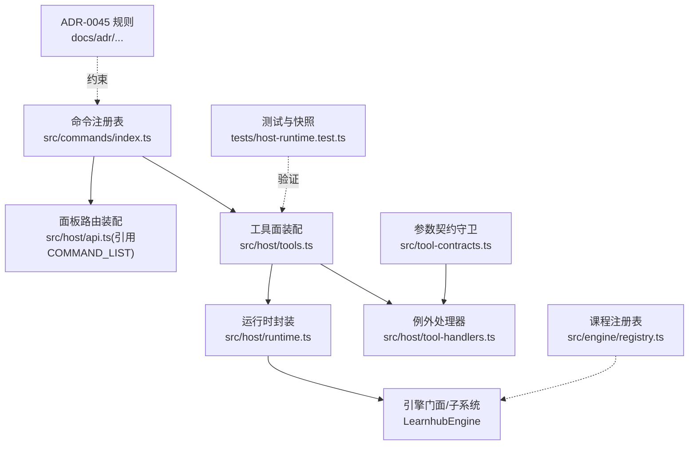
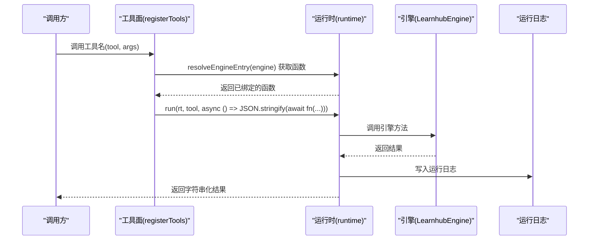
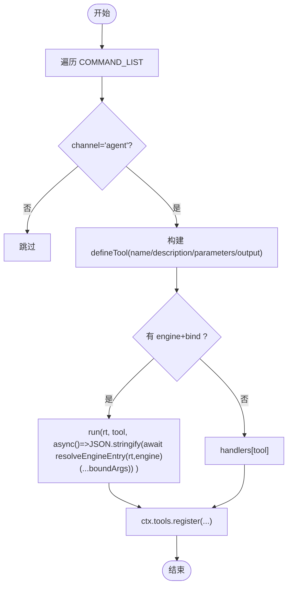
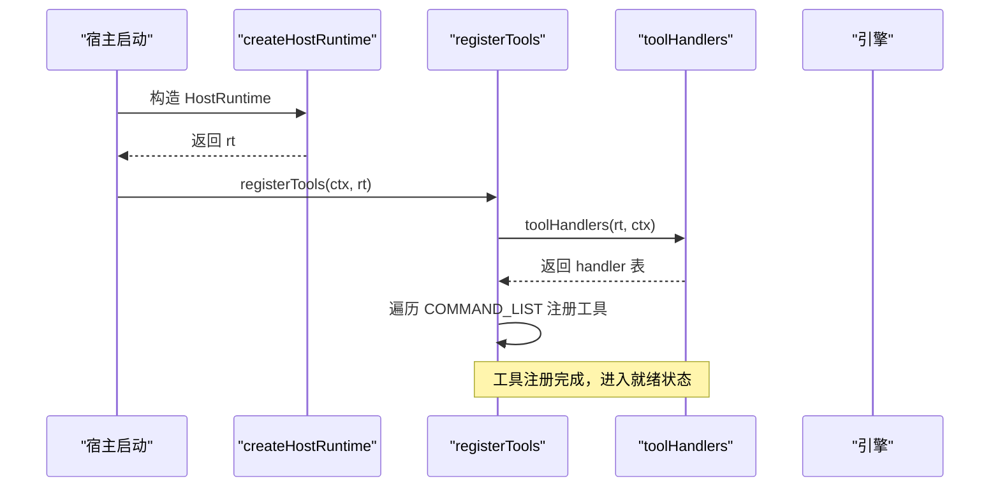
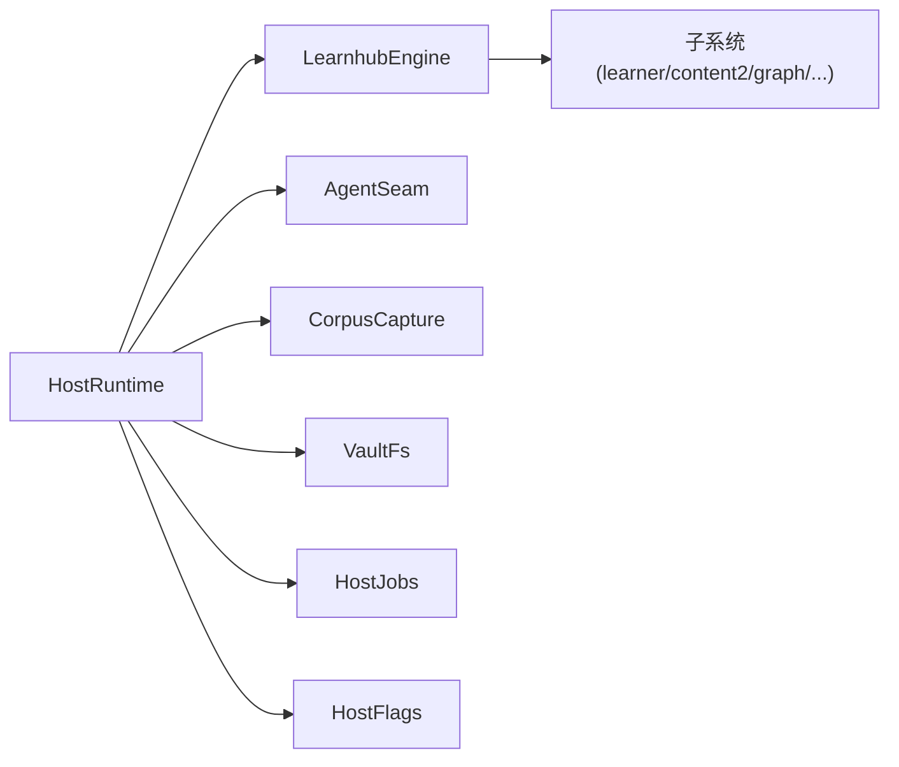
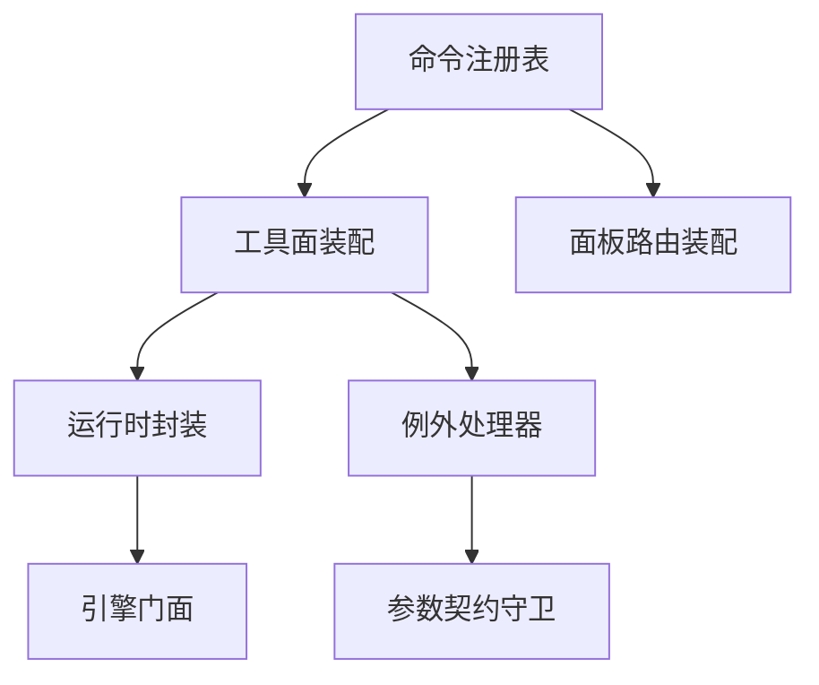

# 工具注册机制

<cite>
**本文引用的文件**
- [src/host/tools.ts](file://src/host/tools.ts)
- [src/host/tool-handlers.ts](file://src/host/tool-handlers.ts)
- [src/commands/index.ts](file://src/commands/index.ts)
- [src/commands/types.ts](file://src/commands/types.ts)
- [src/host/runtime.ts](file://src/host/runtime.ts)
- [src/engine/registry.ts](file://src/engine/registry.ts)
- [src/tool-contracts.ts](file://src/tool-contracts.ts)
- [docs/adr/0045-command-registry-and-channel-discipline.md](file://docs/adr/0045-command-registry-and-channel-discipline.md)
- [tests/host-runtime.test.ts](file://tests/host-runtime.test.ts)
</cite>

## 目录
1. [简介](#简介)
2. [项目结构](#项目结构)
3. [核心组件](#核心组件)
4. [架构总览](#架构总览)
5. [详细组件分析](#详细组件分析)
6. [依赖关系分析](#依赖关系分析)
7. [性能与可扩展性](#性能与可扩展性)
8. [故障排查指南](#故障排查指南)
9. [结论](#结论)
10. [附录：示例与最佳实践](#附录示例与最佳实践)

## 简介
本文件系统性阐述 LearnHub 插件的“工具注册机制”，覆盖动态注册流程、生命周期管理、注册表实现原理与扩展点、权限与访问控制、依赖注入与资源绑定、冲突检测与版本管理策略，并提供静态注册与动态注册的完整示例路径。该机制以“命令注册表”为单一事实源，通过声明式配置驱动 agent 工具面与面板路由面的装配，确保两条通道共享同一引擎入口，并以严格的门（校验）保障行为零漂移。

## 项目结构
围绕工具注册的核心代码分布在以下模块：
- 命令注册表装配与类型定义：src/commands/index.ts、src/commands/types.ts
- 工具面装配与例外处理器：src/host/tools.ts、src/host/tool-handlers.ts
- 运行时与引擎调用封装：src/host/runtime.ts
- 课程注册表（领域数据层）：src/engine/registry.ts
- 参数契约守卫：src/tool-contracts.ts
- 设计决策与规则（ADR）：docs/adr/0045-command-registry-and-channel-discipline.md
- 测试与基线断言：tests/host-runtime.test.ts



图表来源
- [src/commands/index.ts:25-46](file://src/commands/index.ts#L25-L46)
- [src/host/tools.ts:101-125](file://src/host/tools.ts#L101-L125)
- [src/host/tool-handlers.ts:23-287](file://src/host/tool-handlers.ts#L23-L287)
- [src/host/runtime.ts:198-238](file://src/host/runtime.ts#L198-L238)
- [src/engine/registry.ts:77-153](file://src/engine/registry.ts#L77-L153)
- [src/tool-contracts.ts:1-55](file://src/tool-contracts.ts#L1-L55)
- [docs/adr/0045-command-registry-and-channel-discipline.md:82-101](file://docs/adr/0045-command-registry-and-channel-discipline.md#L82-L101)
- [tests/host-runtime.test.ts:1177-1217](file://tests/host-runtime.test.ts#L1177-L1217)

章节来源
- [src/commands/index.ts:25-46](file://src/commands/index.ts#L25-L46)
- [src/host/tools.ts:101-125](file://src/host/tools.ts#L101-L125)
- [src/host/tool-handlers.ts:23-287](file://src/host/tool-handlers.ts#L23-L287)
- [src/host/runtime.ts:198-238](file://src/host/runtime.ts#L198-L238)
- [src/engine/registry.ts:77-153](file://src/engine/registry.ts#L77-L153)
- [src/tool-contracts.ts:1-55](file://src/tool-contracts.ts#L1-L55)
- [docs/adr/0045-command-registry-and-channel-discipline.md:82-101](file://docs/adr/0045-command-registry-and-channel-discipline.md#L82-L101)
- [tests/host-runtime.test.ts:1177-1217](file://tests/host-runtime.test.ts#L1177-L1217)

## 核心组件
- 命令注册表（CommandSpec）：以 id 为主键，声明 args/schema、engine 入口、channels（agent/panel）、domain、output 等；提供 COMMAND_LIST、BY_TOOL、BY_ROUTE 索引。
- 工具面装配器（registerTools）：遍历 COMMAND_LIST，按 channel='agent' 生成 defineTool 并注册到 ctx.tools.register，名称/描述/schema 逐字不变。
- 例外处理器（toolHandlers）：对无法走“生成路径”的工具提供手写 handler，键集合与注册表中无 bind 的 agent 通道一一对应。
- 运行时封装（runtime.run/resolveEngineEntry）：统一执行引擎方法、记录运行日志、解析 engine 字段为可调用函数。
- 参数契约守卫（tool-contracts）：集中处理必填/枚举/范围等参数校验，避免在 handler 中散落重复逻辑。
- 课程注册表（Registry）：读/写课程清单与笔记源，提供 enabled/resolve 等能力，供引擎侧使用。

章节来源
- [src/commands/types.ts:100-128](file://src/commands/types.ts#L100-L128)
- [src/commands/index.ts:25-71](file://src/commands/index.ts#L25-L71)
- [src/host/tools.ts:72-125](file://src/host/tools.ts#L72-L125)
- [src/host/tool-handlers.ts:23-287](file://src/host/tool-handlers.ts#L23-L287)
- [src/host/runtime.ts:198-238](file://src/host/runtime.ts#L198-L238)
- [src/tool-contracts.ts:1-55](file://src/tool-contracts.ts#L1-L55)
- [src/engine/registry.ts:77-153](file://src/engine/registry.ts#L77-L153)

## 架构总览
工具注册采用“声明驱动 + 双通道适配”的架构：
- 声明层：命令注册表集中描述每个工具的元信息、参数 schema、引擎入口、通道模式（同步/队列）、阶段（phase）、bind（位置参数映射）。
- 装配层：工具面装配器根据声明生成 SDK 工具；面板路由装配器根据声明生成 HTTP 路由或调用 handler。
- 执行层：统一通过 runtime.run 包装引擎调用，并记录运行日志；复杂场景由 toolHandlers 提供例外实现。
- 数据层：课程注册表提供课程/笔记源等基础数据，被引擎侧消费。



图表来源
- [src/host/tools.ts:101-125](file://src/host/tools.ts#L101-L125)
- [src/host/runtime.ts:198-238](file://src/host/runtime.ts#L198-L238)

章节来源
- [src/host/tools.ts:101-125](file://src/host/tools.ts#L101-L125)
- [src/host/runtime.ts:198-238](file://src/host/runtime.ts#L198-L238)

## 详细组件分析

### 命令注册表与类型系统
- CommandSpec：id、summary、args、engine、output、domain、channels。
- ChannelSpec：channel('agent'|'panel')、mode('sync'|'queued')、tool/route、phase、bind、required、prefix、log。
- 类型推导：output 从 engine 返回值类型派生，UI 侧通过 CommandOutput<id> 获得响应类型。
- 装配导出：COMMANDS、COMMAND_LIST、BY_TOOL、BY_ROUTE、WIRE_ARGS。

```mermaid
classDiagram
class CommandSpec {
+string id
+string summary
+ParameterSchemaSpec args
+string engine
+any output
+CommandDomain domain
+ChannelSpec[] channels
}
class ChannelSpec {
+string channel
+string mode
+string tool
+{method : string,path : string} route
+string phase
+string|null[] bind
+string[] required
+boolean prefix
+boolean log
}
class ParameterSchemaSpec {
+Record~string,ParamSpec~
}
CommandSpec --> ChannelSpec : "包含"
CommandSpec --> ParameterSchemaSpec : "包含"
```

图表来源
- [src/commands/types.ts:54-128](file://src/commands/types.ts#L54-L128)
- [src/commands/index.ts:25-71](file://src/commands/index.ts#L25-L71)

章节来源
- [src/commands/types.ts:54-128](file://src/commands/types.ts#L54-L128)
- [src/commands/index.ts:25-71](file://src/commands/index.ts#L25-L71)

### 工具面装配与动态注册
- registerTools 遍历 COMMAND_LIST，筛选 channel='agent' 的命令，构造 defineTool 并注册。
- sdkParameters 将 CommandSpec.args 投影为 SDK 的 parameters 形态，剥离投递层扩展键，保持工具面 schema 稳定。
- execute 分支：若存在 engine+bind，则通过 resolveEngineEntry 取函数并用 run 包装；否则回退到 toolHandlers 中的例外 handler。



图表来源
- [src/host/tools.ts:72-125](file://src/host/tools.ts#L72-L125)
- [src/host/runtime.ts:198-215](file://src/host/runtime.ts#L198-L215)

章节来源
- [src/host/tools.ts:72-125](file://src/host/tools.ts#L72-L125)
- [src/host/runtime.ts:198-215](file://src/host/runtime.ts#L198-L215)

### 例外处理器与生命周期
- toolHandlers 工厂函数返回 Record<string, (args)=>Promise<string>>，键为工具名，体内部通过 rt.engine.* 调用引擎方法。
- 生命周期：
  - 启动时：createHostRuntime 构造 HostRuntime（engine、agent、jobs、flags），随后调用 registerTools 完成工具注册。
  - 运行时：每个工具调用经 run 包装，统一记录运行日志；异常在 apiRun 中捕获并记录后抛出。
  - 队列型：phase 指定入队阶段，实际执行在 jobs runner 中，工具仅负责受理与等待终态。



图表来源
- [src/host/runtime.ts:138-193](file://src/host/runtime.ts#L138-L193)
- [src/host/tools.ts:101-125](file://src/host/tools.ts#L101-L125)
- [src/host/tool-handlers.ts:23-287](file://src/host/tool-handlers.ts#L23-L287)

章节来源
- [src/host/runtime.ts:138-193](file://src/host/runtime.ts#L138-L193)
- [src/host/tools.ts:101-125](file://src/host/tools.ts#L101-L125)
- [src/host/tool-handlers.ts:23-287](file://src/host/tool-handlers.ts#L23-L287)

### 权限控制与访问控制
- 当前仓库未实现基于角色的细粒度权限控制；访问控制主要通过“白名单/白名单外的 fail loud”策略体现：
  - 工具白名单：AGENT_GUIDE 限定 agent 工具可见范围，测试断言其工具名均在工具面中。
  - 引擎入口白名单：engine 字段必须指向 LearnhubEngine 上的有效方法；不存在即抛错。
  - 参数守卫：tool-contracts 强制必填/枚举/范围校验，非法输入直接拒绝。
- 建议扩展：
  - 在 ChannelSpec 增加 role/permission 字段，结合宿主上下文进行鉴权。
  - 在 registerTools 中增加权限检查钩子，拦截未授权工具调用。

章节来源
- [src/host/tools.ts:25-69](file://src/host/tools.ts#L25-L69)
- [src/host/runtime.ts:198-215](file://src/host/runtime.ts#L198-L215)
- [src/tool-contracts.ts:1-55](file://src/tool-contracts.ts#L1-L55)
- [tests/host-runtime.test.ts:1195-1213](file://tests/host-runtime.test.ts#L1195-L1213)

### 依赖注入与资源绑定
- 依赖注入：
  - HostRuntime 显式承载 engine、agent、corpus、vault、centerRel、jobs、flags 等，所有技术层函数通过参数接收，便于测试替换。
  - resolveEngineEntry 将 engine 字段（如 'learner.xxx'）解析为可调用函数，并绑定 this，确保类方法可用。
- 资源绑定：
  - llmSeam/llmStreamSeam 通过宿主适配器注入站点与语料捕获。
  - STATIONS 与 corpus 捕获器在工具调用链中贯穿，用于审计与回放。



图表来源
- [src/host/runtime.ts:115-133](file://src/host/runtime.ts#L115-L133)
- [src/host/runtime.ts:198-215](file://src/host/runtime.ts#L198-L215)

章节来源
- [src/host/runtime.ts:115-133](file://src/host/runtime.ts#L115-L133)
- [src/host/runtime.ts:198-215](file://src/host/runtime.ts#L198-L215)

### 冲突检测与版本管理
- 冲突检测：
  - 唯一性门：id、tool 名、(method, path) 在装配表上唯一，测试断言索引未被静默覆盖。
  - 指南投影门：AGENT_GUIDE 中的 tool 必须存在于工具面。
  - 行为快照门：工具面 schema/description 与路由探针快照对比，防止漂移。
- 版本管理：
  - 命令注册表通过 types.ts 的类型系统与 ADR 约束保证向后兼容。
  - 提示词变更通过 PROMPT_CHANGELOG 登记与过门装置管理版本演进。

章节来源
- [docs/adr/0045-command-registry-and-channel-discipline.md:82-101](file://docs/adr/0045-command-registry-and-channel-discipline.md#L82-L101)
- [tests/host-runtime.test.ts:1177-1217](file://tests/host-runtime.test.ts#L1177-L1217)

## 依赖关系分析
- 低耦合高内聚：
  - 命令注册表与两个适配器解耦，通过声明驱动装配。
  - 运行时封装统一了引擎调用与日志记录，降低调用方复杂度。
- 外部依赖：
  - @deepseek-ai/cordis Context 与 @deepseek-ai/dsh-tools defineTool 用于工具注册。
  - 引擎 LearnhubEngine 暴露子系统方法，作为工具执行的最终落点。



图表来源
- [src/commands/index.ts:25-71](file://src/commands/index.ts#L25-L71)
- [src/host/tools.ts:101-125](file://src/host/tools.ts#L101-L125)
- [src/host/runtime.ts:198-238](file://src/host/runtime.ts#L198-L238)
- [src/host/tool-handlers.ts:23-287](file://src/host/tool-handlers.ts#L23-L287)
- [src/tool-contracts.ts:1-55](file://src/tool-contracts.ts#L1-L55)

章节来源
- [src/commands/index.ts:25-71](file://src/commands/index.ts#L25-L71)
- [src/host/tools.ts:101-125](file://src/host/tools.ts#L101-L125)
- [src/host/runtime.ts:198-238](file://src/host/runtime.ts#L198-L238)
- [src/host/tool-handlers.ts:23-287](file://src/host/tool-handlers.ts#L23-L287)
- [src/tool-contracts.ts:1-55](file://src/tool-contracts.ts#L1-L55)

## 性能与可扩展性
- 性能：
  - 工具注册仅在启动时执行一次，后续调用走直连引擎路径，开销极低。
  - 运行日志异步追加，失败不影响主流程。
- 可扩展性：
  - 新增工具只需在命令注册表中添加一条 CommandSpec，无需修改装配逻辑。
  - 队列型工具通过 phase 接入生成队列，支持长耗时任务。
  - 例外处理器允许复杂场景定制，同时保持整体一致性。

## 故障排查指南
- 常见问题：
  - 工具名不在工具面：检查 AGENT_GUIDE 与工具面快照一致性。
  - 引擎入口不存在：确认 engine 字段指向有效方法。
  - 参数校验失败：使用 tool-contracts 提供的守卫函数，避免非法输入。
  - 运行日志缺失：确认 run 包装是否生效，apiRun 捕获异常并记录。
- 定位步骤：
  - 查看 tests/host-runtime.test.ts 中的快照断言，确认工具描述/schema 是否漂移。
  - 检查命令注册表的 id/tool/(method,path) 唯一性。
  - 审查 toolHandlers 中是否有遗漏或多余的手写 handler。

章节来源
- [tests/host-runtime.test.ts:1177-1217](file://tests/host-runtime.test.ts#L1177-L1217)
- [src/host/runtime.ts:217-238](file://src/host/runtime.ts#L217-L238)
- [src/tool-contracts.ts:1-55](file://src/tool-contracts.ts#L1-L55)

## 结论
LearnHub 的工具注册机制以命令注册表为核心，通过声明驱动实现 agent 工具面与面板路由面的统一装配，辅以严格的门与快照断言保障行为零漂移。运行时封装提供统一的执行与日志记录，例外处理器覆盖复杂场景。该设计具备高内聚、低耦合、易扩展的特点，并为未来的权限控制与版本管理预留了清晰的扩展点。

## 附录：示例与最佳实践

### 静态注册示例（声明式）
- 在 src/commands/<域>.ts 中添加一条 command 声明，指定 id、summary、args、engine、channels、domain。
- 确保 engine 字段指向 LearnhubEngine 的有效方法，或留空并登记理由（队列型/按参分派型/无引擎型）。
- 运行测试，确保八道门全部通过。

章节来源
- [src/commands/types.ts:100-128](file://src/commands/types.ts#L100-L128)
- [docs/adr/0045-command-registry-and-channel-discipline.md:82-101](file://docs/adr/0045-command-registry-and-channel-discipline.md#L82-L101)

### 动态注册示例（运行时装配）
- 在 registerTools 中，COMMAND_LIST 已自动装配所有命令，无需手动编写注册循环。
- 对于需要运行时决定的工具名或参数，可通过 toolHandlers 提供例外实现。
- 使用 run 包装引擎调用，确保运行日志记录。

章节来源
- [src/host/tools.ts:101-125](file://src/host/tools.ts#L101-L125)
- [src/host/tool-handlers.ts:23-287](file://src/host/tool-handlers.ts#L23-L287)
- [src/host/runtime.ts:233-238](file://src/host/runtime.ts#L233-L238)

### 权限与访问控制最佳实践
- 使用 AGENT_GUIDE 限制 agent 工具可见范围。
- 在 tool-contracts 中集中处理参数校验，避免在 handler 中散落逻辑。
- 未来可在 ChannelSpec 中增加权限字段，并在 registerTools 中实现鉴权钩子。

章节来源
- [src/host/tools.ts:25-69](file://src/host/tools.ts#L25-L69)
- [src/tool-contracts.ts:1-55](file://src/tool-contracts.ts#L1-L55)

### 冲突检测与版本管理最佳实践
- 遵循八道门规则，确保 id/tool/(method,path) 唯一。
- 使用 PROMPT_CHANGELOG 管理提示词版本变更。
- 通过测试快照断言工具面 schema/description 与路由探针，防止行为漂移。

章节来源
- [docs/adr/0045-command-registry-and-channel-discipline.md:82-101](file://docs/adr/0045-command-registry-and-channel-discipline.md#L82-L101)
- [tests/host-runtime.test.ts:1177-1217](file://tests/host-runtime.test.ts#L1177-L1217)