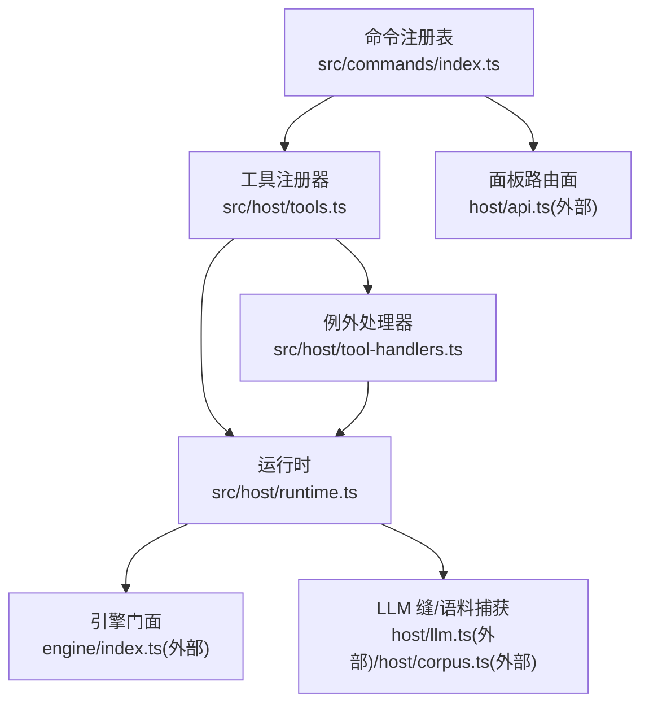
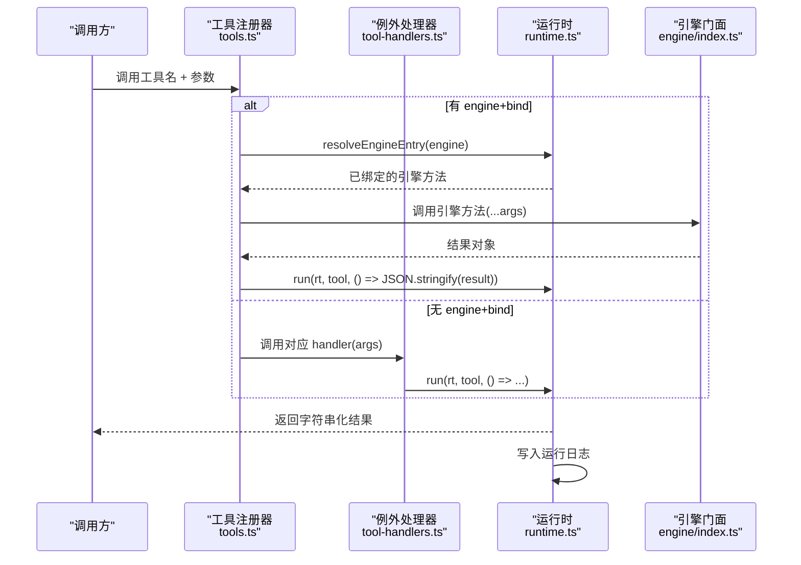
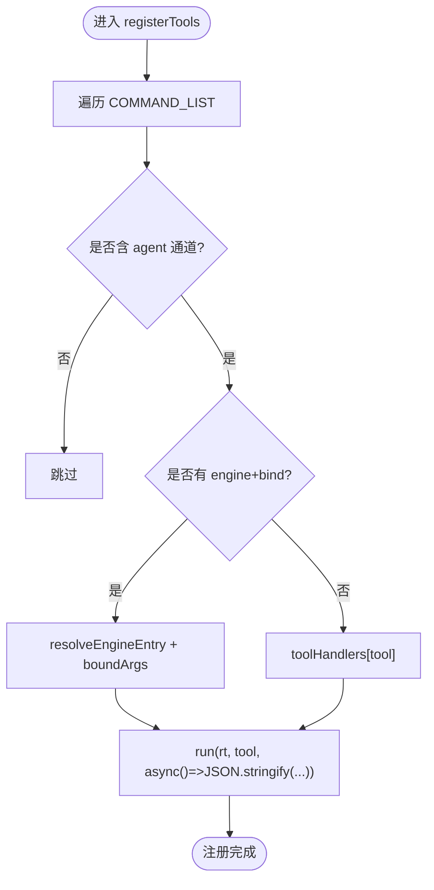
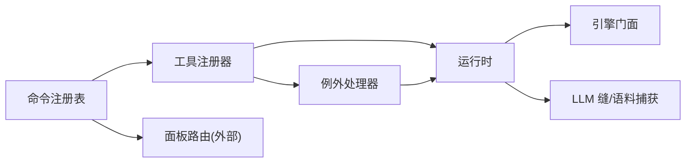

# 自定义工具开发

<cite>
**本文引用的文件**
- [src/host/tools.ts](file://src/host/tools.ts)
- [src/host/tool-handlers.ts](file://src/host/tool-handlers.ts)
- [src/commands/index.ts](file://src/commands/index.ts)
- [src/host/runtime.ts](file://src/host/runtime.ts)
- [src/tool-contracts.ts](file://src/tool-contracts.ts)
- [tests/tools-face.test.ts](file://tests/tools-face.test.ts)
- [tests/helpers/tools-probe.ts](file://tests/helpers/tools-probe.ts)
- [scripts/spike.mjs](file://scripts/spike.mjs)
</cite>

## 目录
1. [简介](#简介)
2. [项目结构](#项目结构)
3. [核心组件](#核心组件)
4. [架构总览](#架构总览)
5. [详细组件分析](#详细组件分析)
6. [依赖关系分析](#依赖关系分析)
7. [性能与可观测性](#性能与可观测性)
8. [故障排查指南](#故障排查指南)
9. [结论](#结论)
10. [附录：从简单到复杂的工具示例](#附录从简单到复杂的工具示例)

## 简介
本指南面向需要在 LearnHub 插件中开发“Agent 工具”的工程师。内容覆盖：
- 工具的注册机制与调用协议
- 工具函数的定义规范（参数验证、返回值格式、错误处理）
- 执行上下文与可用资源访问
- 权限控制与安全考虑
- 测试方法与调试技巧
- 完整的工具开发示例（从简单到复杂）
- 性能监控与日志记录方案

## 项目结构
LearnHub 的工具系统由“声明式命令注册表 + 双适配器（agent 工具面 / panel 路由面）+ 运行时基础设施”组成。关键路径如下：
- 命令注册表：集中声明所有命令（含 agent 通道与 panel 通道），并维护索引
- 工具注册器：将注册表中的 agent 通道映射为 defineTool，生成统一的工具描述与执行入口
- 例外处理器：对无法走“生成路径”的工具提供专用 handler
- 运行时：封装引擎、任务队列、LLM 缝、语料捕获、运行日志等能力

图表来源
- [src/commands/index.ts:25-71](file://src/commands/index.ts#L25-L71)
- [src/host/tools.ts:101-125](file://src/host/tools.ts#L101-L125)
- [src/host/tool-handlers.ts:23-287](file://src/host/tool-handlers.ts#L23-L287)
- [src/host/runtime.ts:138-238](file://src/host/runtime.ts#L138-L238)

章节来源
- [src/commands/index.ts:25-71](file://src/commands/index.ts#L25-L71)
- [src/host/tools.ts:1-126](file://src/host/tools.ts#L1-L126)
- [src/host/tool-handlers.ts:1-288](file://src/host/tool-handlers.ts#L1-L288)
- [src/host/runtime.ts:1-255](file://src/host/runtime.ts#L1-L255)

## 核心组件
- 命令注册表：集中声明命令 id、摘要、参数 schema、输出类型、以及 agent/panel 通道的绑定信息；并提供 BY_TOOL/BY_ROUTE 索引用于装配与校验
- 工具注册器：遍历 COMMAND_LIST，为每个带 agent 通道的命令创建 defineTool；若存在 engine+bind，则走“生成路径”，否则走例外处理器
- 例外处理器：针对需要参数换算或形状加工的工具，提供显式 handler 实现
- 运行时：统一注入 HostRuntime（engine、agent、vault、jobs、flags、corpus 等），并提供 run/runLog 等通用出口

章节来源
- [src/commands/index.ts:25-71](file://src/commands/index.ts#L25-L71)
- [src/host/tools.ts:72-125](file://src/host/tools.ts#L72-L125)
- [src/host/tool-handlers.ts:23-287](file://src/host/tool-handlers.ts#L23-L287)
- [src/host/runtime.ts:115-238](file://src/host/runtime.ts#L115-L238)

## 架构总览
下图展示 Agent 工具从“声明 → 注册 → 执行 → 日志”的完整链路。

图表来源
- [src/host/tools.ts:101-125](file://src/host/tools.ts#L101-L125)
- [src/host/tool-handlers.ts:23-287](file://src/host/tool-handlers.ts#L23-L287)
- [src/host/runtime.ts:198-238](file://src/host/runtime.ts#L198-L238)

## 详细组件分析

### 工具注册机制与调用协议
- 声明驱动：COMMAND_LIST 是单一事实源，包含每个命令的 summary、args、channels（agent 与 panel）、output 等
- 工具投影：sdkParameters 将命令 args 投影为 SDK 的 parameters schema，确保工具面契约稳定
- 执行路径选择：
  - 若 channel 指定了 engine 与 bind：通过 resolveEngineEntry 解析并绑定引擎方法，按 bind 顺序取同名参数传入
  - 否则：查找 toolHandlers 中同名 handler 执行
- 输出统一：所有工具最终通过 run 包装，统一序列化并落盘运行日志

图表来源
- [src/host/tools.ts:101-125](file://src/host/tools.ts#L101-L125)
- [src/host/runtime.ts:198-238](file://src/host/runtime.ts#L198-L238)

章节来源
- [src/host/tools.ts:72-125](file://src/host/tools.ts#L72-L125)
- [src/commands/index.ts:25-71](file://src/commands/index.ts#L25-L71)

### 工具函数定义规范
- 参数验证
  - 必填与可选：由命令 args 的 required 字段表达；SDK 在参数层做基础校验
  - 领域校验：使用 tool-contracts 提供的守卫函数（如 requireSkipDirection、questionCount、applyId、rejectId、graphKind、bandPref）进行强约束，非法值立即抛错
- 返回值格式
  - 工具统一返回字符串（JSON 字符串），便于日志与 UI 消费
  - 对于队列型工具（如出题、重画罗盘），返回状态消息，实际结果通过任务注册表或回调获取
- 错误处理
  - 参数错误：直接抛错，由上层捕获并记录
  - 业务异常：handler 内抛错，run 会记录失败摘要后继续上抛
  - 队列任务失败：jobs 侧补标语料与失败码，任务消息透出

章节来源
- [src/tool-contracts.ts:1-55](file://src/tool-contracts.ts#L1-L55)
- [src/host/tool-handlers.ts:23-287](file://src/host/tool-handlers.ts#L23-L287)
- [src/host/runtime.ts:217-238](file://src/host/runtime.ts#L217-L238)

### 执行上下文与可用资源
- HostRuntime 提供：
  - engine：引擎门面，承载各子系统能力（学习、图谱、题库、项目、实验室、通道、维护等）
  - agent：统一 LLM 缝，支持 complete/stream，携带站/模式/档位/用量等元信息
  - corpus：生成语料捕获器，逐调用落盘，失败可补标
  - vault/centerRel：部署路径与工作区相对路径
  - jobs：生成任务注册表与出题结果缓存
  - flags：队列暂停、泵并发、会话节流戳、任务档损坏标记
- 资源访问纪律
  - 工具只通过 rt.engine.* 访问引擎能力，不直接操作文件系统
  - 写侧操作（如归档、重置课程）需明确语义并通过宿主队列联动清理任务记录

章节来源
- [src/host/runtime.ts:115-193](file://src/host/runtime.ts#L115-L193)
- [src/host/tool-handlers.ts:59-80](file://src/host/tool-handlers.ts#L59-L80)

### 权限控制与安全性
- 白名单与最小权限
  - 教练回路工具仅暴露只读视图（graph_view/node_card/concept_registry/behavior_digest/bank_overview/compass_read/endpoint_anchor），拒绝写侧与队列触点
  - 工具调用在 agent 侧受白名单保护，越权调用会被拒收并以 isError 回灌给模型
- 输入校验
  - 所有工具参数先经 SDK schema 校验，再经 tool-contracts 守卫强化
  - 禁止静默改写非法输入，必须显式报错
- 安全边界
  - 工具不直接访问 OS 凭据或敏感配置；Anki 等外部集成通过 endpoint 参数注入客户端
  - 队列任务取消沿回合传导，避免长时间阻塞

章节来源
- [src/host/tool-handlers.ts:23-287](file://src/host/tool-handlers.ts#L23-L287)
- [src/host/runtime.ts:138-193](file://src/host/runtime.ts#L138-L193)

### 测试方法与调试技巧
- 行为快照回归
  - tools-face 测试用 261 条探针（全参/缺必填）对比历史快照，确保工具面行为零漂移
- 工具探针辅助
  - helpers/tools-probe.ts 提供 runToolProbes 等能力，构造临时 vault 并回放调用序列
- 调试建议
  - 查看运行日志：state 目录下“运行日志.md”，记录每次工具调用的输出摘要
  - 检查任务注册表：队列型工具的状态与失败详情
  - 使用 spike 脚本评估工具通道效果与成本

章节来源
- [tests/tools-face.test.ts:1-38](file://tests/tools-face.test.ts#L1-L38)
- [tests/helpers/tools-probe.ts](file://tests/helpers/tools-probe.ts)
- [src/host/runtime.ts:217-238](file://src/host/runtime.ts#L217-L238)
- [scripts/spike.mjs:53-100](file://scripts/spike.mjs#L53-L100)

## 依赖关系分析
- 低耦合高内聚
  - 命令注册表是单一事实源，工具注册器与面板路由均基于它装配，减少重复
  - 运行时集中管理外部依赖（引擎、LLM、FS、队列），工具与 handler 通过 rt 访问
- 可能的循环风险
  - 工具注册器不应反向 import 引擎内部模块，避免环依赖；通过 runtime.resolveEngineEntry 动态解析
- 外部依赖
  - 引擎门面、LLM 缝、语料捕获、AnkiConnectClient 等均在宿主层适配，工具侧保持简洁

图表来源
- [src/commands/index.ts:25-71](file://src/commands/index.ts#L25-L71)
- [src/host/tools.ts:101-125](file://src/host/tools.ts#L101-L125)
- [src/host/tool-handlers.ts:23-287](file://src/host/tool-handlers.ts#L23-L287)
- [src/host/runtime.ts:138-238](file://src/host/runtime.ts#L138-L238)

章节来源
- [src/host/tools.ts:101-125](file://src/host/tools.ts#L101-L125)
- [src/host/runtime.ts:138-238](file://src/host/runtime.ts#L138-L238)

## 性能与可观测性
- 性能特征
  - 工具执行尽量短小，复杂任务入队（如出题、重画罗盘），避免同步阻塞
  - 队列任务支持取消与进度追踪，面板可观察
- 可观测性
  - 运行日志：每次工具调用输出摘要写入 state/运行日志.md，失败也留痕
  - 语料捕获：LLM 调用逐条落盘，失败可补标，便于离线评审与复算
  - 任务注册表：持久化任务状态，支持恢复与清扫
- 监控指标
  - 可通过 spike 脚本统计交付率、命中率、schema 合规率、token 用量等

章节来源
- [src/host/runtime.ts:163-193](file://src/host/runtime.ts#L163-L193)
- [src/host/runtime.ts:217-238](file://src/host/runtime.ts#L217-L238)
- [scripts/spike.mjs:53-100](file://scripts/spike.mjs#L53-L100)

## 故障排查指南
- 常见错误
  - 参数非法：tool-contracts 守卫抛出明确错误信息，检查命令 args 与传参
  - 引擎入口不存在：resolveEngineEntry 报找不到方法，检查 engine 字段与命名
  - 队列任务失败：查看任务注册表与语料捕获，定位失败站与失败码
- 排查步骤
  - 查看运行日志：确认工具调用链路与输出摘要
  - 检查任务状态：队列型工具需等待终态并读取 message
  - 使用探针回归：运行 tools-face 测试，比对行为快照差异

章节来源
- [src/tool-contracts.ts:1-55](file://src/tool-contracts.ts#L1-L55)
- [src/host/runtime.ts:198-238](file://src/host/runtime.ts#L198-L238)
- [tests/tools-face.test.ts:1-38](file://tests/tools-face.test.ts#L1-L38)

## 结论
LearnHub 的工具系统以“声明驱动 + 双适配器 + 运行时抽象”为核心，实现了：
- 稳定的工具契约与零漂移回归
- 清晰的执行路径选择（生成路径 vs 例外处理器）
- 统一的参数校验、错误处理与日志记录
- 完善的测试与可观测性支撑

遵循本文规范，可高效、安全地开发从简单查询到复杂队列任务的各类工具。

## 附录：从简单到复杂的工具示例

### 简单工具：只读状态查询
- 场景：查询系统状态与 LLM 配置
- 要点：无需 engine+bind，走例外处理器；返回 JSON 字符串；记录运行日志
- 参考路径
  - [learnhub_status handler:25-28](file://src/host/tool-handlers.ts#L25-L28)
  - [run 包装与日志:233-238](file://src/host/runtime.ts#L233-L238)

### 中等工具：题目生成（队列型）
- 场景：为某课程节点生成题目，异步执行并返回任务 key
- 要点：入队出题任务，等待终态；返回状态与结果摘要；失败时补标语料
- 参考路径
  - [learnhub_question_generate handler:82-99](file://src/host/tool-handlers.ts#L82-L99)
  - [队列任务等待与结果读取:82-99](file://src/host/tool-handlers.ts#L82-L99)

### 复杂工具：课程重置与联动清理
- 场景：重置课程并触发后续生成链，同时清理遗留任务
- 要点：写侧操作需联动宿主队列；返回结构化消息；失败需记录日志
- 参考路径
  - [learnhub_course_reset handler:275-278](file://src/host/tool-handlers.ts#L275-L278)
  - [learnhub_course_delete handler:279-283](file://src/host/tool-handlers.ts#L279-L283)

### 新增工具的开发流程
1. 在命令注册表中声明命令（id、summary、args、channels、output）
2. 若走生成路径：填写 engine 与 bind，确保引擎方法存在且可绑定
3. 若需特殊处理：在 tool-handlers.ts 中添加 handler，使用 tool-contracts 做参数校验
4. 通过 run 包装返回，确保日志记录
5. 编写/更新行为探针，运行 tools-face 测试保证零漂移
6. 如需队列任务：使用宿主队列接口，并在 handler 中等待终态或返回任务 key

章节来源
- [src/commands/index.ts:25-71](file://src/commands/index.ts#L25-L71)
- [src/host/tools.ts:101-125](file://src/host/tools.ts#L101-L125)
- [src/host/tool-handlers.ts:23-287](file://src/host/tool-handlers.ts#L23-L287)
- [src/host/runtime.ts:198-238](file://src/host/runtime.ts#L198-L238)
- [tests/tools-face.test.ts:1-38](file://tests/tools-face.test.ts#L1-L38)