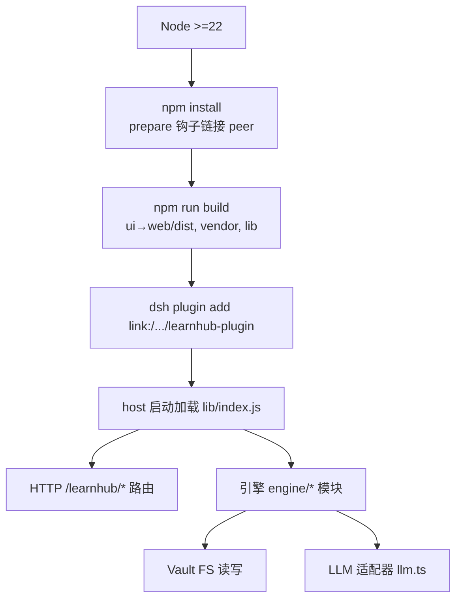
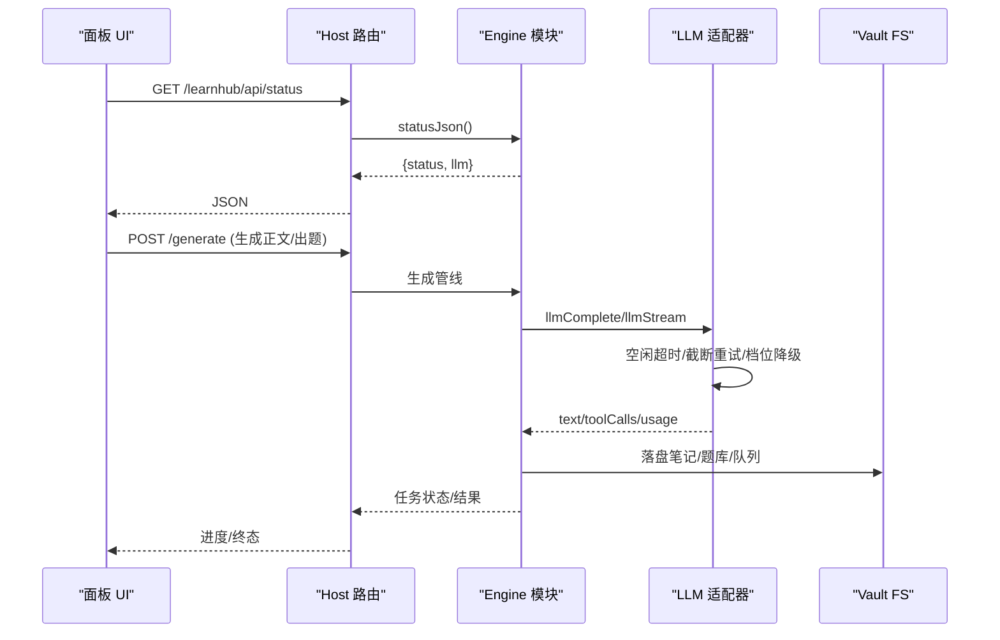
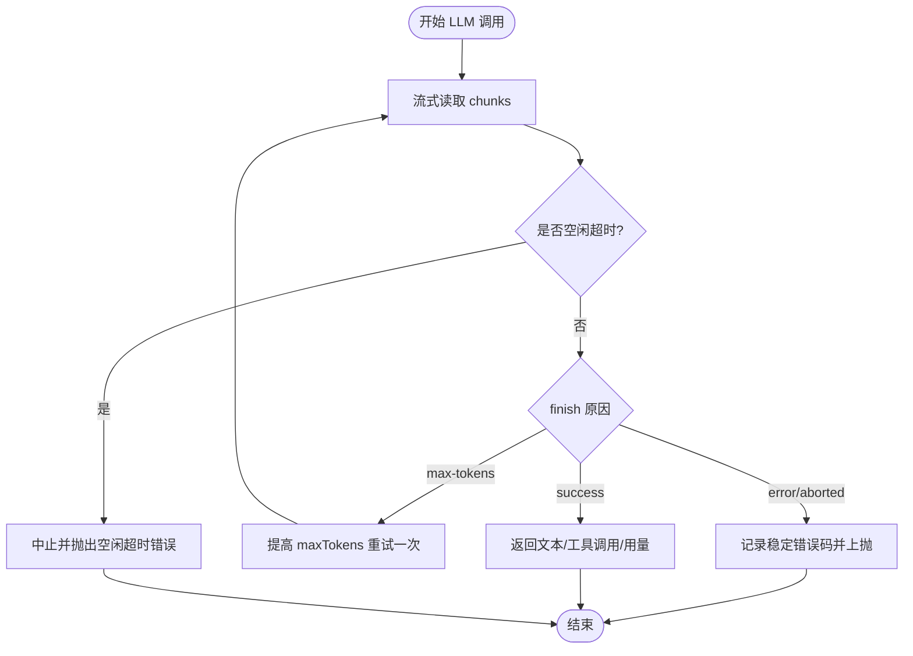
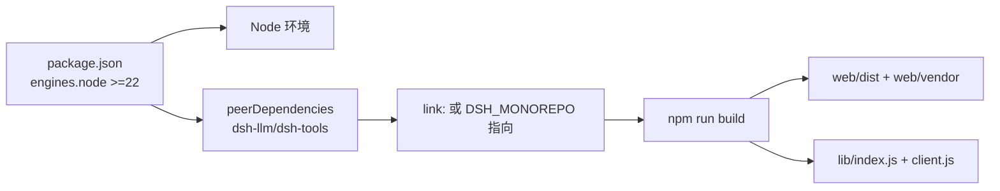

# 常见问题

<cite>
**本文引用的文件**
- [package.json](file://package.json)
- [README.md](file://README.md)
- [src/host/runtime.ts](file://src/host/runtime.ts)
- [src/host/llm.ts](file://src/host/llm.ts)
- [src/host/params.ts](file://src/host/params.ts)
- [src/engine/io.ts](file://src/engine/io.ts)
- [src/engine/error-cards.ts](file://src/engine/error-cards.ts)
- [src/engine/health.ts](file://src/engine/health.ts)
- [ui/vite.config.ts](file://ui/vite.config.ts)
- [scripts/arch-baseline.json](file://scripts/arch-baseline.json)
</cite>

## 目录
1. [简介](#简介)
2. [项目结构](#项目结构)
3. [核心组件](#核心组件)
4. [架构总览](#架构总览)
5. [详细组件分析](#详细组件分析)
6. [依赖关系分析](#依赖关系分析)
7. [性能注意事项](#性能注意事项)
8. [故障排查指南](#故障排查指南)
9. [结论](#结论)
10. [附录](#附录)

## 简介
本文件聚焦安装、配置与运行过程中的常见问题，提供可操作的识别方法与逐步解决步骤。覆盖环境搭建、依赖冲突、权限错误、网络连接失败、配置参数错误、文件格式不兼容、路径设置错误、运行时异常（内存不足、计算超时、LLM调用失败）等场景，并给出预防与最佳实践建议。

## 项目结构
- 宿主插件入口与 HTTP 路由、SPA 服务位于 host 层；引擎逻辑在 engine 层；UI 为 Vite + React SPA；构建产物输出到 web/dist 与 lib。
- Node 版本要求严格（>=22），peer 依赖多为宿主私有包，需通过 monorepo link 或 DSH_MONOREPO 指向本地仓库。
- 机器级配置通过 profile patch 注入 vault 路径、provider/model、思考档等。

**图表来源**
- [package.json:15-17](file://package.json#L15-L17)
- [README.md:146-186](file://README.md#L146-L186)
- [ui/vite.config.ts:4-13](file://ui/vite.config.ts#L4-L13)

**章节来源**
- [package.json:1-83](file://package.json#L1-L83)
- [README.md:146-214](file://README.md#L146-L214)
- [ui/vite.config.ts:1-14](file://ui/vite.config.ts#L1-L14)

## 核心组件
- 宿主 LLM 适配层：统一空闲超时、截断重试、档位降级、语料捕获与稳定错误码上抛。
- 参数守卫：集中处理必填/可选参数校验，统一错误类型与消息格式。
- Vault IO：原子写、JSONL 只读、撕裂尾行豁免、Broken/Missing 语义。
- 错误对比卡：独立 schema 门禁与存储，避免污染题库。
- 图谱健康分：可量化的质量指标，辅助定位图结构问题。

**章节来源**
- [src/host/llm.ts:64-390](file://src/host/llm.ts#L64-L390)
- [src/host/params.ts:1-230](file://src/host/params.ts#L1-L230)
- [src/engine/io.ts:1-103](file://src/engine/io.ts#L1-L103)
- [src/engine/error-cards.ts:1-353](file://src/engine/error-cards.ts#L1-L353)
- [src/engine/health.ts:1-105](file://src/engine/health.ts#L1-L105)

## 架构总览

**图表来源**
- [src/host/handlers.ts:103-126](file://src/host/handlers.ts#L103-L126)
- [src/host/llm.ts:75-104](file://src/host/llm.ts#L75-L104)
- [src/host/llm.ts:281-390](file://src/host/llm.ts#L281-L390)
- [src/engine/io.ts:34-54](file://src/engine/io.ts#L34-L54)

## 详细组件分析

### LLM 调用与网络问题
- 空闲超时：流式请求内每收到一个 chunk 重置计时，超过阈值无新输出则中止并抛出明确错误信息。
- 截断重试：当 finish reason 为 max-tokens 时，提高输出上限并重试一次。
- 档位降级：若当前 effort 不被支持，自动降级为部署默认值并重试一次。
- 稳定错误码：调用失败会携带 provider/model 信息与稳定错误码（如认证/配额/速率限制等），便于快速定位。

**图表来源**
- [src/host/llm.ts:304-390](file://src/host/llm.ts#L304-L390)
- [src/host/llm.ts:281-298](file://src/host/llm.ts#L281-L298)

**章节来源**
- [src/host/llm.ts:64-390](file://src/host/llm.ts#L64-L390)

### 参数校验与配置错误
- 必填参数缺失或类型不符将抛出 ParamError，统一错误消息格式，便于客户端显示与定位。
- 可选参数“省略或合法”：键存在但类型不符即拒绝，避免静默吞错。
- 注册表驱动的参数取值：按声明的 type/read/required 解析，支持 query/body 两种来源。

常见症状与修复：
- 缺少必填参数：检查请求体或查询串是否包含必需字段，确保类型正确。
- 非法可选参数：确认传入值的类型符合声明（字符串/数字/布尔/对象/数组）。
- 路由报错附带路由名：根据错误消息中的路由名定位具体接口。

**章节来源**
- [src/host/params.ts:1-230](file://src/host/params.ts#L1-L230)

### Vault 文件系统与权限问题
- 原子写：先写临时文件再 rename，保证写入一致性。
- JSONL 只读：中段损坏抛 Broken 并提示修复或删除该行；末行撕裂（进程中断残留）被豁免。
- Missing/Broken 语义：文件缺失视为合法空态；存在但损坏则抛 Broken。

常见症状与修复：
- 无法读取文件或目录不存在：检查 vault 根路径是否正确，确认目录存在且可读。
- JSONL 损坏：定位提示的行号，修复或删除非法行后重试。
- 写入失败：检查目标目录权限与磁盘空间，确保可写。

**章节来源**
- [src/engine/io.ts:34-103](file://src/engine/io.ts#L34-L103)

### 错误对比卡与数据格式
- 独立 schema 门禁：选项必须恰好 3 项且互不相同，答案与错法项必须在选项中，控制字符禁止。
- 去重与归档：同一来源题活跃卡重复添加会被拒绝；支持归档/恢复单卡。
- 调度与统计：由作答侧整体替换，避免作者白名单误改派生证据。

常见症状与修复：
- YAML 无法解析：检查语法与缩进，确保顶层为映射。
- 选项数量或内容不合法：修正为恰好 3 项且互不相同，答案与错法项必须是原文之一。
- 重复添加：先归档旧卡再重新生成。

**章节来源**
- [src/engine/error-cards.ts:117-353](file://src/engine/error-cards.ts#L117-L353)

### 图谱健康分与结构问题
- 健康分五项：动作句命名、est 覆盖率、前置完备、收敛度、结构卫生，每项 0-20 分，总分 0-100。
- est 分布压缩提示：当 p10-p90 区间过窄时提示标注缺乏区分度。
- 结构卫生扣分：别名包含命名、多连通分量、不可达节点等。

常见症状与修复：
- 健康分偏低：检查节点命名是否动词化、est 标注是否覆盖充分、前置边是否完整、是否存在环或多连通分量。
- est 分布压缩：扩大 est 取值范围，提升对内容规模的区分度。

**章节来源**
- [src/engine/health.ts:1-105](file://src/engine/health.ts#L1-L105)

## 依赖关系分析
- Node 版本：要求 >=22，低版本会导致构建或运行失败。
- Peer 依赖：@deepseek-ai/dsh-llm、@deepseek-ai/dsh-tools 等为宿主私有包，需通过 monorepo link 或 DSH_MONOREPO 指向本地仓库。
- 构建产物：ui 构建到 web/dist，vendor 库复制到 web/vendor，lib 三产物供宿主加载。

**图表来源**
- [package.json:15-17](file://package.json#L15-L17)
- [package.json:49-69](file://package.json#L49-L69)
- [README.md:18-22](file://README.md#L18-L22)
- [README.md:173-186](file://README.md#L173-L186)

**章节来源**
- [package.json:1-83](file://package.json#L1-L83)
- [README.md:18-22](file://README.md#L18-L22)
- [README.md:173-186](file://README.md#L173-L186)

## 性能注意事项
- LLM 调用采用流式传输与空闲超时，避免长时间阻塞。
- 截断重试机制减少因 max-tokens 导致的输出不完整。
- 思考档分层：机械调用走 fast 档，高复杂度节点的大纲/修复轮升 deep 档，平衡速度与质量。
- 健康分与审计指标帮助识别图结构瓶颈，优化学习路径与内容组织。

[本节为通用指导，无需特定文件引用]

## 故障排查指南

### 安装与环境搭建
- 症状：安装时报 Cannot find package '@deepseek-ai/dsh-llm'。
- 原因：peer 依赖未通过 monorepo link 或 DSH_MONOREPO 指向本地仓库。
- 解决：
  - 确认 Node 版本 >=22。
  - 设置 DSH_MONOREPO 指向 dsh 仓库根目录。
  - 执行 npm install 与 npm run build。
  - 使用 dsh plugin add link:/绝对路径/to/learnhub-plugin 注册插件。

**章节来源**
- [README.md:18-22](file://README.md#L18-L22)
- [README.md:146-155](file://README.md#L146-L155)
- [package.json:15-17](file://package.json#L15-L17)

### 配置参数错误
- 症状：API 返回缺少必填参数或非法可选参数。
- 原因：请求体或查询串字段缺失、类型不符或枚举值不在允许列表。
- 解决：
  - 对照命令/路由的参数声明，补齐必填字段并确保类型正确。
  - 对于枚举参数，仅使用允许的值。
  - 查看错误消息中的路由名，定位具体接口。

**章节来源**
- [src/host/params.ts:1-230](file://src/host/params.ts#L1-L230)

### 路径设置错误
- 症状：启动时报 config.vault 缺失或目录不存在。
- 原因：profile patch 中 vault 路径未配置或路径不正确。
- 解决：
  - 在 cordis.patch.yml 中设置 vault 为绝对路径。
  - 重启宿主以加载新配置。
  - 验证路径存在且可读写。

**章节来源**
- [README.md:157-171](file://README.md#L157-L171)
- [src/host/runtime.ts:24-41](file://src/host/runtime.ts#L24-L41)

### 文件格式不兼容
- 症状：YAML 无法解析或 JSONL 损坏。
- 原因：语法错误、控制字符、撕裂尾行或中段损坏。
- 解决：
  - 修复 YAML 语法与缩进，确保顶层为映射。
  - 删除或修复 JSONL 中非法行，注意末行撕裂可豁免。
  - 避免在内容中引入控制字符。

**章节来源**
- [src/engine/io.ts:71-103](file://src/engine/io.ts#L71-L103)
- [src/engine/error-cards.ts:126-219](file://src/engine/error-cards.ts#L126-L219)

### 权限错误
- 症状：无法读取/写入文件或目录。
- 原因：vault 目录权限不足或磁盘空间不足。
- 解决：
  - 检查操作系统权限，确保进程对 vault 目录有读写权限。
  - 清理磁盘空间或更换可写路径。
  - 使用原子写保障写入一致性，避免部分写入导致的数据损坏。

**章节来源**
- [src/engine/io.ts:34-54](file://src/engine/io.ts#L34-L54)

### 网络连接失败与 LLM 调用失败
- 症状：模型调用失败、空闲超时、截断输出。
- 原因：网络不稳定、认证失败、配额限制、max-tokens 过小。
- 解决：
  - 检查 provider/model 配置是否正确。
  - 查看稳定错误码（如 MISSING_CREDENTIAL、RATE_LIMIT）定位问题。
  - 调整 max-tokens 或切换思考档。
  - 等待网络恢复或降低并发调用。

**章节来源**
- [src/host/llm.ts:304-390](file://src/host/llm.ts#L304-L390)
- [src/host/llm.ts:281-298](file://src/host/llm.ts#L281-L298)

### 运行时异常（内存不足、计算超时）
- 症状：进程崩溃、任务失败、生成队列暂停。
- 原因：内存不足、大文件处理、复杂计算。
- 解决：
  - 增加系统内存或限制并发任务数。
  - 分批处理大文件，避免一次性加载过多数据。
  - 检查健康分与审计指标，优化图结构与内容规模。

[本节为通用指导，无需特定文件引用]

### 预防措施与最佳实践
- 固定 Node 版本与依赖：使用 engines 字段约束 Node 版本，锁定依赖版本。
- 机器级配置隔离：通过 profile patch 管理 vault/provider/model，避免硬编码。
- 数据完整性：使用原子写与 JSONL 只读原语，确保写入一致性与读取鲁棒性。
- 参数校验：集中参数守卫，统一错误消息，便于前端展示与调试。
- 监控与审计：利用健康分与审计指标持续评估图质量与学习路径。

**章节来源**
- [package.json:15-17](file://package.json#L15-L17)
- [src/engine/io.ts:34-103](file://src/engine/io.ts#L34-L103)
- [src/host/params.ts:1-230](file://src/host/params.ts#L1-L230)
- [src/engine/health.ts:1-105](file://src/engine/health.ts#L1-L105)

## 结论
通过集中化的参数校验、稳健的文件 IO、智能的 LLM 适配与可量化的健康分指标，本插件在复杂学习场景中提供了可靠的安装、配置与运行体验。遇到问题时，优先检查环境版本、配置路径、文件格式与网络状态，结合错误码与日志快速定位并解决。遵循最佳实践可有效预防多数常见问题。

[本节为总结，无需特定文件引用]

## 附录
- 构建与部署流程参考 README 的安装与构建章节。
- 架构门基线用于维护代码质量与依赖一致性，可在清理提交中更新基线。

**章节来源**
- [README.md:146-214](file://README.md#L146-L214)
- [scripts/arch-baseline.json:1-50](file://scripts/arch-baseline.json#L1-L50)