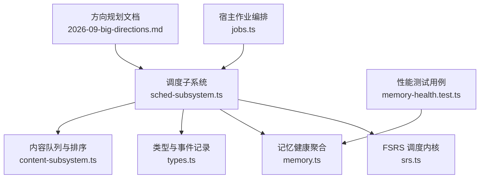
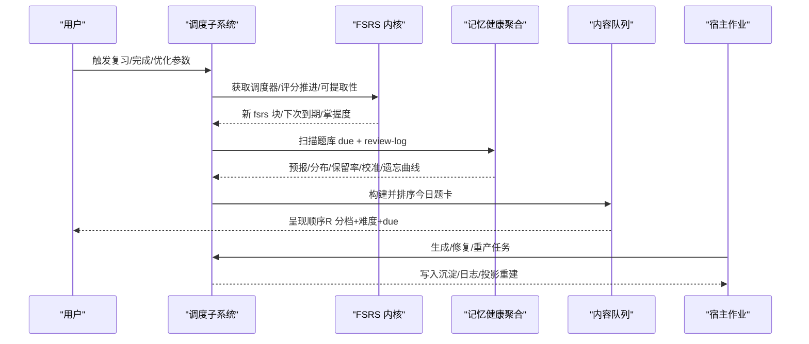
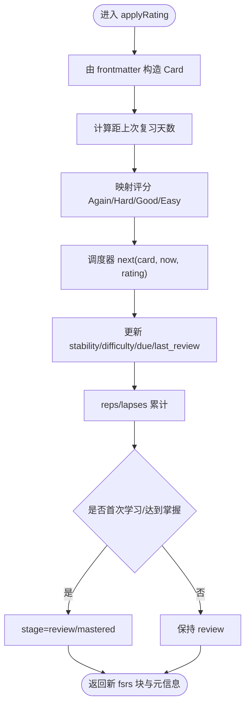
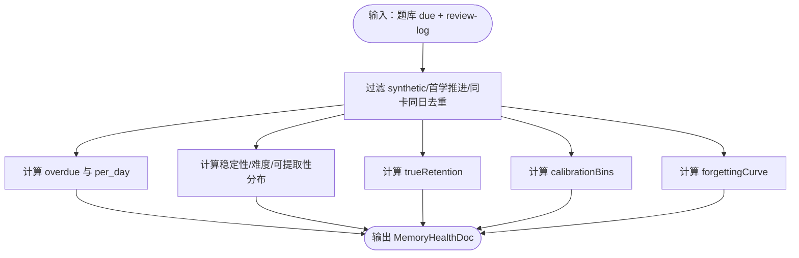
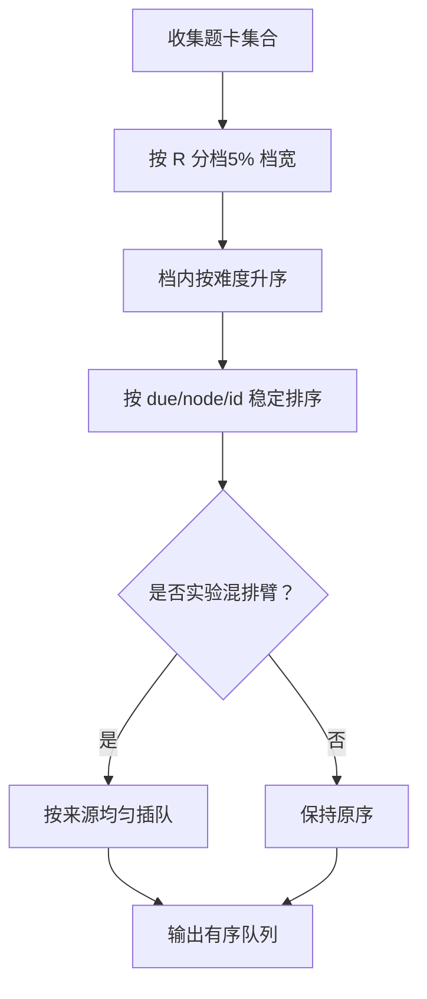
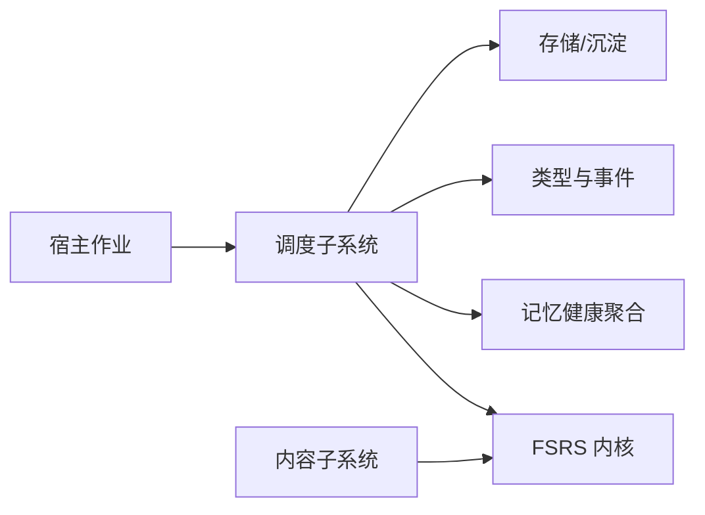

# 性能优化

<cite>
**本文引用的文件**
- [srs.ts](file://src/engine/srs.ts)
- [sched-subsystem.ts](file://src/engine/sched-subsystem.ts)
- [memory.ts](file://src/engine/memory.ts)
- [types.ts](file://src/engine/types.ts)
- [content-subsystem.ts](file://src/engine/content-subsystem.ts)
- [jobs.ts](file://src/host/jobs.ts)
- [memory-health.test.ts](file://tests/memory-health.test.ts)
- [2026-09-big-directions.md](file://docs/research/2026-09-big-directions.md)
- [0071-vault-prior-bm25-and-audit.md](file://docs/adr/0071-vault-prior-bm25-and-audit.md)
</cite>

## 目录
1. [简介](#简介)
2. [项目结构](#项目结构)
3. [核心组件](#核心组件)
4. [架构总览](#架构总览)
5. [详细组件分析](#详细组件分析)
6. [依赖关系分析](#依赖关系分析)
7. [性能考量](#性能考量)
8. [故障排查指南](#故障排查指南)
9. [结论](#结论)
10. [附录](#附录)

## 简介
本指南面向学习平台插件的性能优化，聚焦以下目标：
- 建立可落地的性能监控指标与瓶颈识别方法
- 基于 FSRS 的复习间隔、掌握度阈值等参数调优策略
- 内存使用优化（缓存、GC、大对象）
- CPU 使用率优化（算法复杂度、并行、异步）
- 数据库查询与索引策略
- 负载均衡与扩展性
- 性能测试方法与基准结果解读

## 项目结构
系统围绕“调度子系统”组织，FSRS 调度内核、记忆健康统计、内容队列排序、作业任务编排共同构成性能关键路径。



图表来源
- [sched-subsystem.ts:1-120](file://src/engine/sched-subsystem.ts#L1-L120)
- [srs.ts:1-60](file://src/engine/srs.ts#L1-L60)
- [memory.ts:1-35](file://src/engine/memory.ts#L1-L35)
- [content-subsystem.ts:693-713](file://src/engine/content-subsystem.ts#L693-L713)
- [jobs.ts:835-853](file://src/host/jobs.ts#L835-L853)
- [memory-health.test.ts:84-132](file://tests/memory-health.test.ts#L84-L132)
- [2026-09-big-directions.md:44-85](file://docs/research/2026-09-big-directions.md#L44-L85)

章节来源
- [sched-subsystem.ts:1-120](file://src/engine/sched-subsystem.ts#L1-L120)
- [srs.ts:1-60](file://src/engine/srs.ts#L1-L60)
- [memory.ts:1-35](file://src/engine/memory.ts#L1-L35)
- [content-subsystem.ts:693-713](file://src/engine/content-subsystem.ts#L693-L713)
- [jobs.ts:835-853](file://src/host/jobs.ts#L835-L853)
- [memory-health.test.ts:84-132](file://tests/memory-health.test.ts#L84-L132)
- [2026-09-big-directions.md:44-85](file://docs/research/2026-09-big-directions.md#L44-L85)

## 核心组件
- FSRS 调度内核：提供参数解析、卡片转换、评分推进、可提取性计算、掌握度派生等能力，是复习与练习的核心引擎。
- 调度子系统：封装节点跳过/完成确认、XP 预算对账、记忆健康仪表盘、FSRS 个人参数优化器、沉淀层读写。
- 记忆健康聚合：提供负载预报、状态分布、真实保留率、预测校准、遗忘曲线等纯函数聚合。
- 内容队列排序：按可提取性分档、难度渐进、到期日兜底，支持实验混排。
- 宿主作业编排：生成任务、重试、失败回灌、标注容忍样本等。

章节来源
- [srs.ts:29-61](file://src/engine/srs.ts#L29-L61)
- [sched-subsystem.ts:323-450](file://src/engine/sched-subsystem.ts#L323-L450)
- [memory.ts:17-119](file://src/engine/memory.ts#L17-L119)
- [content-subsystem.ts:693-713](file://src/engine/content-subsystem.ts#L693-L713)
- [jobs.ts:835-853](file://src/host/jobs.ts#L835-L853)

## 架构总览
下图展示从用户操作到调度与统计的关键调用链，以及数据在存储与视图间的流转。



图表来源
- [sched-subsystem.ts:323-450](file://src/engine/sched-subsystem.ts#L323-L450)
- [srs.ts:94-163](file://src/engine/srs.ts#L94-L163)
- [memory.ts:17-119](file://src/engine/memory.ts#L17-L119)
- [content-subsystem.ts:693-713](file://src/engine/content-subsystem.ts#L693-L713)
- [jobs.ts:835-853](file://src/host/jobs.ts#L835-L853)

## 详细组件分析

### FSRS 调度内核（srs.ts）
- 参数解析唯一口径：沉淀正典 → 课程缓存 → 默认；避免多源不一致导致调度偏差。
- 调度器构造：日粒度、无 fuzz、关闭短期步，确保稳定可复现。
- 可提取性计算：基于当前 fsrs 块与日期，供队列排序与健康面板复用。
- 掌握度派生：结合稳定度完成度与练习证据（EMA/正确率），用于 UI 展示与图着色。



图表来源
- [srs.ts:107-141](file://src/engine/srs.ts#L107-L141)
- [srs.ts:165-183](file://src/engine/srs.ts#L165-L183)

章节来源
- [srs.ts:29-61](file://src/engine/srs.ts#L29-L61)
- [srs.ts:94-163](file://src/engine/srs.ts#L94-L163)
- [srs.ts:165-183](file://src/engine/srs.ts#L165-L183)

### 调度子系统（sched-subsystem.ts）
- 记忆健康仪表盘：跨课程扫描题库 due 与 review-log，输出预报、分布、保留率、校准、遗忘曲线。
- FSRS 参数优化器：以真实复习日志为训练集，门槛≥400条；评估 logLoss 优于基线才写回；写回流程包含沉淀正典、课程缓存镜像、调度器缓存失效、学习者档案重建。
- 节点完成/跳过：幂等写入单元，保证 stage 变更、题库归档、XP 对账、生成入队顺序一致。

```mermaid
sequenceDiagram
participant Admin as "管理员/自动化"
participant SS as "调度子系统"
participant OPT as "优化器实现"
participant SED as "沉淀层"
participant STORE as "存储"
Admin->>SS : optimizeFsrsParams()
SS->>SS : 读取 review-log → 训练序列
SS->>OPT : train(sequences)
OPT-->>SS : 新参数 + 评估
SS->>OPT : evaluate(基线参数)
OPT-->>SS : 基线评估
alt 新参数更优
SS->>SED : 写入 fsrs_params 正典
SS->>STORE : 逐课程写缓存镜像
SS->>SS : 清理调度器缓存
SS->>SED : 重建学习者档案投影
SS-->>Admin : {status : 'written', meta}
else 未更优
SS-->>Admin : {status : 'skipped', reason, meta}
end
```

图表来源
- [sched-subsystem.ts:361-450](file://src/engine/sched-subsystem.ts#L361-L450)

章节来源
- [sched-subsystem.ts:323-450](file://src/engine/sched-subsystem.ts#L323-L450)

### 记忆健康聚合（memory.ts）
- 负载预报：逾期存量 + 未来 N 天逐日到期量（窗口外远期不计入逐日）。
- 状态分布：Stability/Difficulty/R 的分桶直方图，口径与 reviewQueue 一致。
- 真实保留率：仅计入 auto/self 且确有旧卡的到期复习，每卡每天取第一条。
- 预测校准：按 r_pred 分箱对照实际通过率。
- 遗忘曲线：按 elapsed_days 分桶的保留率下降曲线。



图表来源
- [memory.ts:17-119](file://src/engine/memory.ts#L17-L119)

章节来源
- [memory.ts:17-119](file://src/engine/memory.ts#L17-L119)
- [memory-health.test.ts:84-132](file://tests/memory-health.test.ts#L84-L132)

### 内容队列排序（content-subsystem.ts）
- 主键排序：按可提取性 R 分档升序（档宽 5%），档内难度由易到难，再因 due/节点/题序兜底保证稳定。
- 实验混排：会话组成实验可在不改变调度前提下打乱呈现顺序。



图表来源
- [content-subsystem.ts:693-713](file://src/engine/content-subsystem.ts#L693-L713)

章节来源
- [content-subsystem.ts:693-713](file://src/engine/content-subsystem.ts#L693-L713)

### 宿主作业编排（jobs.ts）
- 生成任务：大纲/正文生成失败时回灌重产，标注容忍样本，失败/容忍样本必存。
- 深度档位：高复杂度节点提升 deep 档，裁剪上下文包减少 LLM 负载。

章节来源
- [jobs.ts:835-853](file://src/host/jobs.ts#L835-L853)

## 依赖关系分析
- 调度子系统依赖 FSRS 内核、记忆健康聚合、类型定义、存储与沉淀层。
- 内容队列依赖 FSRS 的可提取性计算，确保排序与调度一致。
- 宿主作业与调度子系统通过接口协作，保证生成链路可观测与可恢复。



图表来源
- [sched-subsystem.ts:1-83](file://src/engine/sched-subsystem.ts#L1-L83)
- [srs.ts:1-20](file://src/engine/srs.ts#L1-L20)
- [memory.ts:1-15](file://src/engine/memory.ts#L1-L15)
- [content-subsystem.ts:693-713](file://src/engine/content-subsystem.ts#L693-L713)
- [jobs.ts:835-853](file://src/host/jobs.ts#L835-L853)

章节来源
- [sched-subsystem.ts:1-83](file://src/engine/sched-subsystem.ts#L1-L83)
- [srs.ts:1-20](file://src/engine/srs.ts#L1-L20)
- [memory.ts:1-15](file://src/engine/memory.ts#L1-L15)
- [content-subsystem.ts:693-713](file://src/engine/content-subsystem.ts#L693-L713)
- [jobs.ts:835-853](file://src/host/jobs.ts#L835-L853)

## 性能考量

### 系统性能监控指标与瓶颈识别
- 复习负载预报：逾期数与未来 N 天每日到期量，识别爆发性复习日。
- 记忆状态分布：Stability/Difficulty/R 的直方图，定位过难或过低稳定度的题目集中区。
- 真实保留率与预测校准：对比 r_pred 与实际通过率，发现模型失配或参数不当。
- 遗忘曲线：按间隔分桶的保留率，识别间隔过长导致的遗忘加速。
- 队列排序开销：R 分档+难度排序的时间复杂度近似 O(n log n)，注意批量规模。

章节来源
- [memory.ts:17-119](file://src/engine/memory.ts#L17-L119)
- [memory-health.test.ts:84-132](file://tests/memory-health.test.ts#L84-L132)
- [content-subsystem.ts:693-713](file://src/engine/content-subsystem.ts#L693-L713)

### FSRS 算法调优参数配置与策略
- 参数来源与一致性：沉淀正典优先，课程缓存次之，默认兜底；避免缓存与沉淀分叉。
- 训练门槛与评估：真实复习日志≥400条；logLoss 必须优于基线才写回；元数据记录 trained_at、params_version、reviews、cards、baseline_source、baseline_log_loss、log_loss、rmse_bins、split_log_loss。
- 复习间隔调整：通过优化器自动学习 w 参数，无需手动干预；若需微调，建议先观察遗忘曲线与校准分箱，再触发优化。
- 掌握度阈值设置：掌握度 = 0.7·稳定度完成度 + 0.3·练习证据；稳定度项以 S/(2·S_MASTER) 归一化，达到 2·S_MASTER 渐近满分。

章节来源
- [sched-subsystem.ts:361-450](file://src/engine/sched-subsystem.ts#L361-L450)
- [srs.ts:165-183](file://src/engine/srs.ts#L165-L183)
- [2026-09-big-directions.md:44-85](file://docs/research/2026-09-big-directions.md#L44-L85)

### 内存使用优化技巧
- 数据缓存策略：调度器实例按课程根缓存，参数写回后统一失效，避免重复构造；课程级 fsrs参数.json 作为快速缓存镜像。
- 垃圾回收优化：避免在热路径创建大对象；将 review-log 聚合为只读视图，减少中间拷贝。
- 大对象处理：题库扫描采用流式聚合（Map 计数、Set 去重），控制峰值内存；预报窗口限定 FORECAST_DAYS 防止全量展开。

章节来源
- [sched-subsystem.ts:53-55](file://src/engine/sched-subsystem.ts#L53-L55)
- [sched-subsystem.ts:417-440](file://src/engine/sched-subsystem.ts#L417-L440)
- [memory.ts:17-35](file://src/engine/memory.ts#L17-L35)

### CPU 使用率优化方案
- 算法复杂度优化：队列排序采用 R 分档+难度排序，时间复杂度 O(n log n)；分档宽度 5% 平衡风险与难度梯度。
- 并行计算利用：记忆健康聚合中各面板计算相互独立，可并发执行（如 forecast/stateHistograms/trueRetention/calibrationBins/forgettingCurve）。
- 异步处理：宿主作业生成采用异步流水线，失败回灌与标注容忍样本，避免阻塞主流程。

章节来源
- [content-subsystem.ts:693-713](file://src/engine/content-subsystem.ts#L693-L713)
- [memory.ts:17-119](file://src/engine/memory.ts#L17-L119)
- [jobs.ts:835-853](file://src/host/jobs.ts#L835-L853)

### 数据库查询优化与索引策略
- 查询口径收敛：review-log 过滤 synthetic/首学推进，每卡每天取第一条，减少无效统计。
- 索引建议：按 course/node/qid/ts 建立复合索引，加速 dueReviewFirstPushes 的去重与筛选；按 q.fsrs.due 建立索引以优化负载预报。
- 扫描范围控制：仅扫描启用课程的题库，避免全库扫描；远期 due 不计入逐日预报，降低计算量。

章节来源
- [memory.ts:60-77](file://src/engine/memory.ts#L60-L77)
- [sched-subsystem.ts:323-347](file://src/engine/sched-subsystem.ts#L323-L347)

### 负载均衡与扩展性考虑
- 全局负载均衡：多课程到期日在同一天爆发时，可通过 fuzz 窗口摊平（Anki load balancing 语义），与 XP 每日预算/ETA 联动。
- 扩展性：调度器按课程根隔离，参数写回后统一失效；沉淀层提供学习者级事实源，便于横向扩展与多实例共享。

章节来源
- [2026-09-big-directions.md:70-75](file://docs/research/2026-09-big-directions.md#L70-L75)
- [sched-subsystem.ts:417-440](file://src/engine/sched-subsystem.ts#L417-L440)

### 性能测试方法与基准测试结果分析
- 测试覆盖：记忆健康四面板（预报/分布/保留率/校准/遗忘曲线）与空态断言；与 reviewQueue 扫描口径一致性验证。
- 基准要点：FORECAST_DAYS=30；stability 数量级分桶；difficulty/R 十分位；r_pred 分箱；elapsed_days 分桶。
- 结果解读：rate=null 表示无数据，不造假；远期 due 不计入逐日预报；synthetic 不计入真实保留率。

章节来源
- [memory-health.test.ts:10-75](file://tests/memory-health.test.ts#L10-L75)
- [memory-health.test.ts:84-132](file://tests/memory-health.test.ts#L84-L132)
- [memory.ts:17-119](file://src/engine/memory.ts#L17-L119)

## 故障排查指南
- 参数优化被跳过：检查真实复习日志是否≥400条；确认 logLoss 是否优于基线；查看元数据中的 baseline_source 与 reason。
- 预报异常：确认 due 字段有效；排除远期 due 计入逐日预报；核对学习日 cutoff。
- 保留率为 null：review-log 为空或无到期复习；确保 rating_source 为 auto/self 且有 stability_before。
- 队列排序不稳定：检查 R 分档宽度与难度排序；确认 tiebreak 字段（due/node/id）存在。

章节来源
- [sched-subsystem.ts:361-450](file://src/engine/sched-subsystem.ts#L361-L450)
- [memory.ts:60-119](file://src/engine/memory.ts#L60-L119)
- [content-subsystem.ts:693-713](file://src/engine/content-subsystem.ts#L693-L713)

## 结论
本指南基于代码事实，构建了从监控指标到 FSRS 调优、内存/CPU 优化、查询索引、负载均衡与测试验证的完整性能优化框架。通过沉淀正典与课程缓存的一致性、严格的数据过滤与评估门限、以及可观测的记忆健康仪表盘，系统能够在中小规模下保持稳定、可解释且可持续优化的学习体验。

## 附录
- 检索增强：BM25 式打分（IDF×词频饱和×长度归一+标题加权），用于笔记检索与审计，提升召回质量与效率。

章节来源
- [0071-vault-prior-bm25-and-audit.md:15-23](file://docs/adr/0071-vault-prior-bm25-and-audit.md#L15-L23)