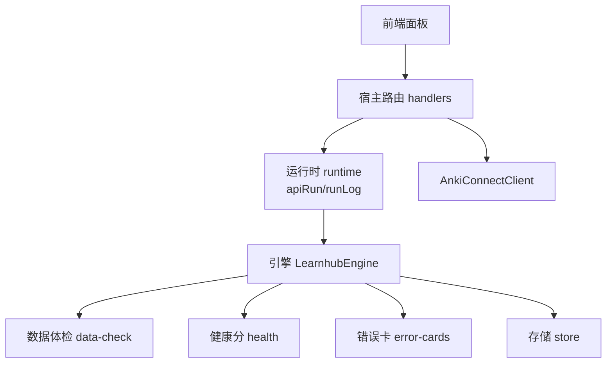
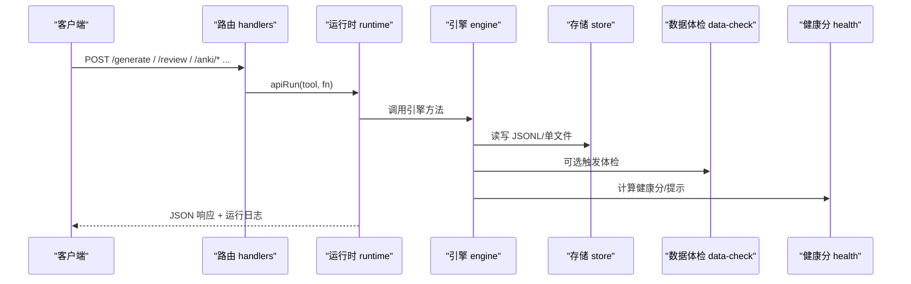
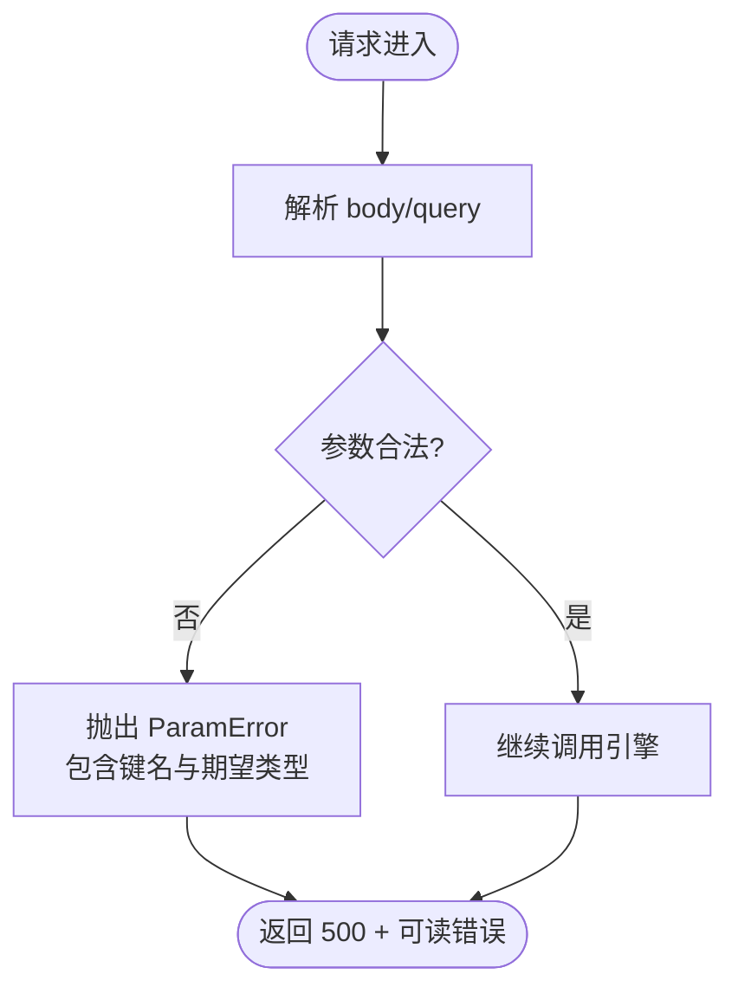
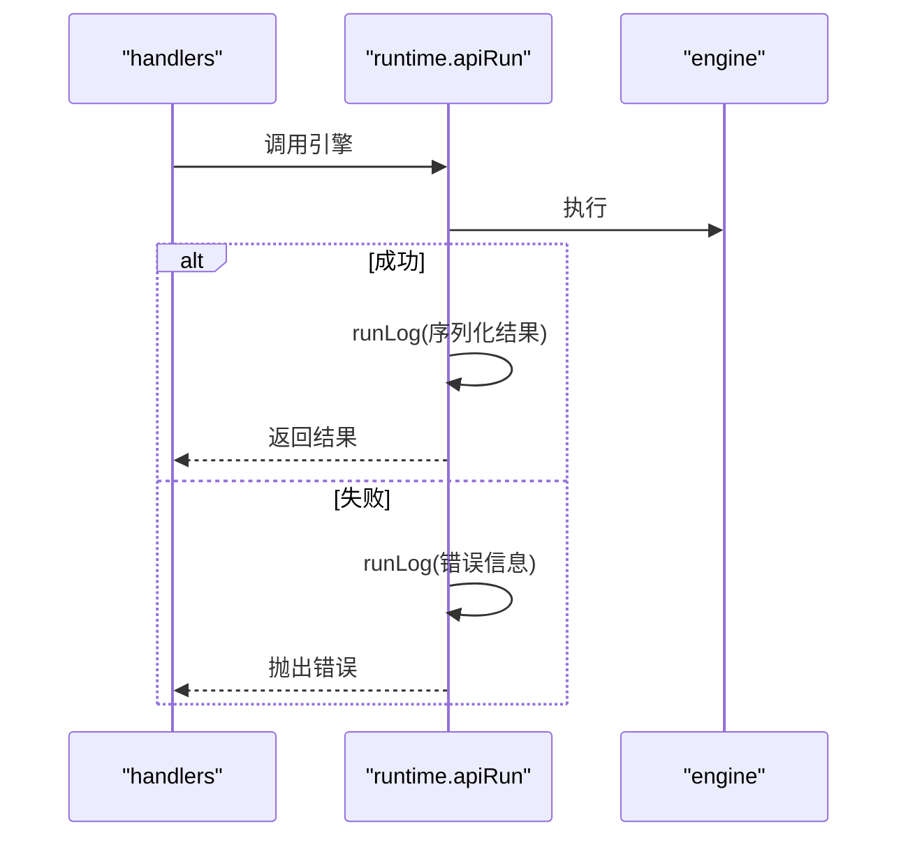
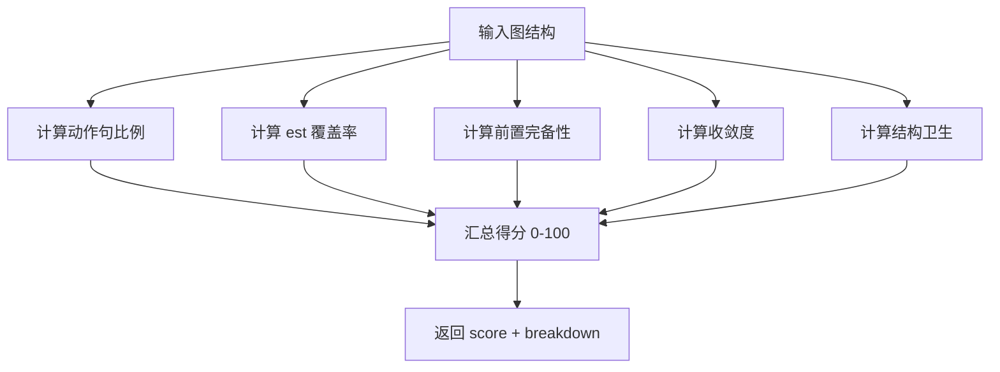
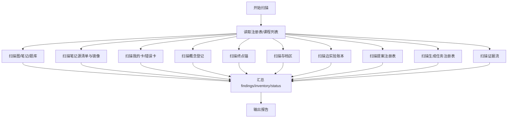
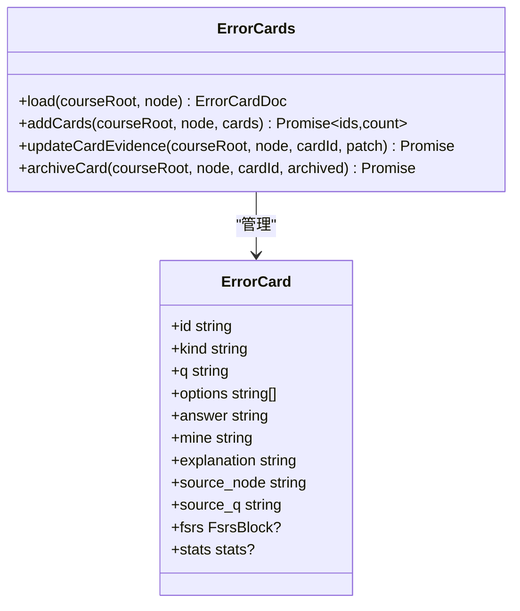
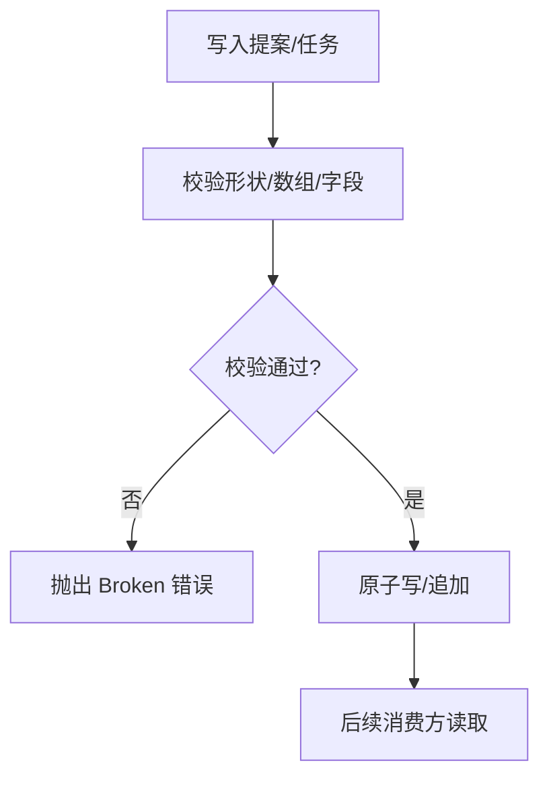

# 故障排除

<cite>
**本文引用的文件**
- [src/engine/health.ts](file://src/engine/health.ts)
- [src/host/handlers.ts](file://src/host/handlers.ts)
- [src/engine/data-check.ts](file://src/engine/data-check.ts)
- [src/host/runtime.ts](file://src/host/runtime.ts)
- [src/engine/error-cards.ts](file://src/engine/error-cards.ts)
- [src/host/params.ts](file://src/host/params.ts)
- [src/engine/store.ts](file://src/engine/store.ts)
- [tests/health.test.ts](file://tests/health.test.ts)
- [tests/data-check.test.ts](file://tests/data-check.test.ts)
- [docs/adr/0081-doctor-merged-into-data-check.md](file://docs/adr/0081-doctor-merged-into-data-check.md)
- [src/commands/维护.ts](file://src/commands/维护.ts)
- [src/engine/index.ts](file://src/engine/index.ts)
</cite>

## 更新摘要
**变更内容**
- 移除了独立的医生端点（GET /doctor）和相关功能，统一使用数据体检系统
- 更新了所有消费者从 engine.doctor() 迁移到 dataCheck() 的说明
- 修正了路由表中的路由数量统计（从127条减少到126条）
- 更新了健康检查与服务状态监控章节，移除了对已删除端点的引用
- 增强了数据一致性检查与修复流程，突出数据体检系统的核心作用

## 目录
1. [简介](#简介)
2. [项目结构](#项目结构)
3. [核心组件](#核心组件)
4. [架构总览](#架构总览)
5. [详细组件分析](#详细组件分析)
6. [依赖关系分析](#依赖关系分析)
7. [性能注意事项](#性能注意事项)
8. [故障排查指南](#故障排查指南)
9. [结论](#结论)
10. [附录](#附录)

## 简介
本指南面向安装、配置、运行与数据一致性等常见问题的定位与修复，覆盖：
- 安装与配置错误（路径、参数）
- 运行时异常（API 路由、参数校验、引擎调用失败）
- 日志分析与调试技巧（运行日志、语料捕获）
- 健康检查与服务状态监控（健康分、队列状态、Anki 通道）
- 数据一致性检查与修复流程（Vault 体检、提案/任务注册表、证据流）
- 性能瓶颈识别与优化建议（生成队列、LLM 调用、FSRS 参数）
- 社区支持与求助渠道
- 具体故障案例与解决步骤

**更新** 移除了独立的医生端点，统一使用数据体检系统进行诊断和故障排查。

## 项目结构
本插件采用"宿主层 + 引擎层"的分层设计：
- 宿主层负责 HTTP 路由、参数校验、任务调度、运行日志与外部集成（如 Anki）。
- 引擎层提供领域能力（图谱、学习、题库、质量审计、健康分、数据体检等）。
- 测试覆盖关键行为与健康指标。

**图表来源**
- [src/host/handlers.ts:101-741](file://src/host/handlers.ts#L101-L741)
- [src/host/runtime.ts:138-253](file://src/host/runtime.ts#L138-L253)
- [src/engine/data-check.ts:1-131](file://src/engine/data-check.ts#L1-L131)
- [src/engine/health.ts:53-104](file://src/engine/health.ts#L53-L104)
- [src/engine/error-cards.ts:223-353](file://src/engine/error-cards.ts#L223-L353)
- [src/engine/store.ts:46-200](file://src/engine/store.ts#L46-L200)

**章节来源**
- [src/host/handlers.ts:101-741](file://src/host/handlers.ts#L101-L741)
- [src/host/runtime.ts:138-253](file://src/host/runtime.ts#L138-L253)

## 核心组件
- 路由与参数校验：统一入口集中处理请求体与查询串，非法或缺失参数抛出 ParamError，便于统一报错与定位。
- 运行时与日志：所有引擎调用通过 apiRun 包裹，成功/失败均记录到运行日志；agent 调用也落盘并输出控制台信息。
- 健康检查：图谱健康分与 est 分布提示，辅助内容质量诊断。
- 数据体检：只读扫描 Vault，分类 Missing/Broken/Archived/Hint，产出报告与库存统计。**更新** 现在作为唯一的诊断入口，替代了原有的医生端点。
- 错误卡域：独立卡组与门禁，支持从作答流水挖掘高频错误模式并生成对比卡。
- 存储与流水：JSONL 追加式写入，提案与任务注册表具备严格契约校验。

**章节来源**
- [src/host/params.ts:1-230](file://src/host/params.ts#L1-L230)
- [src/host/runtime.ts:195-253](file://src/host/runtime.ts#L195-L253)
- [src/engine/health.ts:1-105](file://src/engine/health.ts#L1-L105)
- [src/engine/data-check.ts:1-131](file://src/engine/data-check.ts#L1-L131)
- [src/engine/error-cards.ts:1-120](file://src/engine/error-cards.ts#L1-L120)
- [src/engine/store.ts:1-200](file://src/engine/store.ts#L1-L200)

## 架构总览
下图展示一次典型 API 调用的调用链与日志落点，以及健康/体检在其中的作用。

**图表来源**
- [src/host/handlers.ts:101-741](file://src/host/handlers.ts#L101-L741)
- [src/host/runtime.ts:233-253](file://src/host/runtime.ts#L233-L253)
- [src/engine/data-check.ts:1-131](file://src/engine/data-check.ts#L1-L131)
- [src/engine/health.ts:53-104](file://src/engine/health.ts#L53-L104)
- [src/engine/store.ts:46-200](file://src/engine/store.ts#L46-L200)

## 详细组件分析

### 路由与参数校验（ParamError 统一报错）
- 必填/可选参数守卫集中在 params.ts，缺失或类型不符抛出 ParamError。
- 路由层对非法参数进行显式拒绝，避免静默降级。
- 错误消息中文且可操作，配合路由名便于定位。

**图表来源**
- [src/host/params.ts:32-178](file://src/host/params.ts#L32-L178)
- [src/host/handlers.ts:181-249](file://src/host/handlers.ts#L181-L249)

**章节来源**
- [src/host/params.ts:1-230](file://src/host/params.ts#L1-L230)
- [src/host/handlers.ts:181-249](file://src/host/handlers.ts#L181-L249)

### 运行时与运行日志（apiRun/runLog）
- 所有引擎调用经 apiRun 包裹，成功/失败均记录到运行日志。
- agent 调用通过 runLog 输出摘要，便于追踪 LLM 调用成本与耗时。
- 部署路径与 AI 配置在 createHostRuntime 中 fail loud 校验。

**图表来源**
- [src/host/runtime.ts:217-253](file://src/host/runtime.ts#L217-L253)
- [src/host/runtime.ts:138-193](file://src/host/runtime.ts#L138-L193)

**章节来源**
- [src/host/runtime.ts:138-253](file://src/host/runtime.ts#L138-L253)

### 健康检查（图谱健康分与 est 分布提示）
- graphHealthScore 计算 0–100 的健康分，分解为动作句命名、est 覆盖率、前置完备、收敛度、结构卫生五项。
- estSpreadNote 检测 est 分布压缩问题，给出提示但不改健康分。
- 健康分用于教练与审计的基线参考，不直接作为完成判据。

**图表来源**
- [src/engine/health.ts:53-104](file://src/engine/health.ts#L53-L104)
- [src/engine/health.ts:37-47](file://src/engine/health.ts#L37-L47)

**章节来源**
- [src/engine/health.ts:1-105](file://src/engine/health.ts#L1-L105)
- [tests/health.test.ts:1-64](file://tests/health.test.ts#L1-L64)

### 数据体检（Data Check）
- 只读扫描 Vault，按区域分类 Missing/Broken/Archived/Hint，输出报告与库存统计。
- 覆盖注册表、图、笔记、题库、笔记源、我的卡、错误卡、概念登记、终点锚、存档区、边实验账本、提案、生成任务、证据流等。
- 损坏的流水不阻断扫描，Broken 降级为 finding，保证可见性。
- **更新** 现在作为唯一的诊断入口，替代了原有的 doctor 端点，提供更全面的故障排查能力。

**图表来源**
- [src/engine/data-check.ts:1-131](file://src/engine/data-check.ts#L1-L131)
- [src/engine/data-check.ts:206-800](file://src/engine/data-check.ts#L206-L800)

**章节来源**
- [src/engine/data-check.ts:1-800](file://src/engine/data-check.ts#L1-L800)
- [tests/data-check.test.ts:1-200](file://tests/data-check.test.ts#L1-L200)

### 错误卡域（Error Cards）
- 独立卡组与门禁，支持从 practice 流水挖掘高频错误模式并生成对比卡。
- 卡片 schema 严格校验，确保选项互异、答案与错法项来自选项集。
- 归档/恢复与证据更新走原子写回，避免并发破坏。

**图表来源**
- [src/engine/error-cards.ts:223-353](file://src/engine/error-cards.ts#L223-L353)
- [src/engine/error-cards.ts:27-48](file://src/engine/error-cards.ts#L27-L48)

**章节来源**
- [src/engine/error-cards.ts:1-353](file://src/engine/error-cards.ts#L1-L353)

### 存储与提案/任务注册表（Store）
- JSONL 追加式写入，提案与任务注册表具备严格契约校验。
- 提案 pair 悬空、artifact 缺失会报 Broken，保障联动正确性。
- 生成任务注册表损坏时，host 置 broken 态并拒绝写回，防止覆盖坏档。

**图表来源**
- [src/engine/store.ts:28-44](file://src/engine/store.ts#L28-L44)
- [src/engine/store.ts:168-200](file://src/engine/store.ts#L168-L200)
- [src/host/runtime.ts:105-113](file://src/host/runtime.ts#L105-L113)

**章节来源**
- [src/engine/store.ts:1-200](file://src/engine/store.ts#L1-L200)
- [src/host/runtime.ts:105-113](file://src/host/runtime.ts#L105-L113)

## 依赖关系分析
- 路由依赖运行时与引擎门面，运行时依赖 vault/fs/clock/rng 等端口。
- 数据体检依赖各子模块的校验器（题库、笔记源、概念登记、提案、证据流等）。
- 健康分依赖图结构与质量函数，不依赖学习状态。
- 错误卡域依赖 FSRS 调度块与存储原语。

```mermaid
graph LR
H["handlers"] --> RT["runtime"]
RT --> E["engine"]
E --> DC["data-check"]
E --> HC["health"]
E --> EC["error-cards"]
E --> ST["store"]
```

**图表来源**
- [src/host/handlers.ts:101-741](file://src/host/handlers.ts#L101-L741)
- [src/host/runtime.ts:138-253](file://src/host/runtime.ts#L138-L253)
- [src/engine/data-check.ts:1-131](file://src/engine/data-check.ts#L1-L131)
- [src/engine/health.ts:53-104](file://src/engine/health.ts#L53-L104)
- [src/engine/error-cards.ts:223-353](file://src/engine/error-cards.ts#L223-L353)
- [src/engine/store.ts:46-200](file://src/engine/store.ts#L46-L200)

**章节来源**
- [src/host/handlers.ts:101-741](file://src/host/handlers.ts#L101-L741)
- [src/host/runtime.ts:138-253](file://src/host/runtime.ts#L138-L253)

## 性能注意事项
- 生成队列串行执行，长耗时任务（冒烟、spike、质量评审）需合理超时与重试策略。
- LLM 调用通过 agent 缝记录耗时与字符数，关注高耗时站点与 effort 档位。
- FSRS 参数解析有缓存与正典化，避免重复计算；建议定期评估个人参数优化。
- 数据体检全库扫描可能较重，建议在低峰期或按需触发。

## 故障排查指南

### 安装与配置问题
- 症状：启动时报 config.vault 缺失或目录不存在；学习中心目录不存在。
- 原因：profile patch 未配置 vault 或路径无效。
- 处理：
  - 确认 profile patch 中 id: learnhub 行已设置 vault 绝对路径。
  - 确认 centerRel 指向的学习中心目录存在。
  - 首次启动会在 state/learnhub.json 盖版本戳，若旧库痕迹存在则交版本硬门判定。

**章节来源**
- [src/host/runtime.ts:138-163](file://src/host/runtime.ts#L138-L163)

### 运行时异常（参数校验）
- 症状：API 返回 500，错误消息包含"缺少必填参数"或"非法可选参数"。
- 原因：请求体或查询串缺失/类型不符。
- 处理：
  - 对照路由文档补齐必填参数。
  - 修正可选参数类型（字符串/数字/布尔/对象/数组）。
  - 查看运行日志中的工具名与错误摘要，快速定位路由。

**章节来源**
- [src/host/params.ts:32-178](file://src/host/params.ts#L32-L178)
- [src/host/runtime.ts:233-253](file://src/host/runtime.ts#L233-L253)

### 运行时异常（引擎调用失败）
- 症状：API 调用失败，运行日志记录"调用失败：..."。
- 原因：引擎内部业务错误或下游 I/O 失败。
- 处理：
  - 查看运行日志中的 tool 名称与错误信息。
  - 结合数据体检报告定位 Vault 文件损坏或缺失。
  - 必要时重启宿主以恢复任务注册表状态。

**章节来源**
- [src/host/runtime.ts:233-253](file://src/host/runtime.ts#L233-L253)

### 健康检查与服务状态监控
- 图谱健康分：低于阈值（如 <80）提示内容质量问题，关注动作句命名、est 覆盖率、前置完备、收敛度、结构卫生。
- est 分布压缩：p10-p90 ≤ 10 分钟提示标注区分度不足，需扩大 est 取值范围。
- 服务状态：
  - GET /status 返回引擎状态与 LLM 配置。
  - GET /generate/status 查看生成队列状态。
  - GET /anki/status 查看 Anki 连接与最近推送/回写情况。
- **更新** 移除了 GET /doctor 端点，所有诊断功能统一通过数据体检系统实现。

**章节来源**
- [src/engine/health.ts:37-104](file://src/engine/health.ts#L37-L104)
- [src/host/handlers.ts:101-180](file://src/host/handlers.ts#L101-L180)

### 数据一致性检查与修复流程
- 使用数据体检报告：
  - Missing：合法空态，按提示补全文件或注册。
  - Broken：文件不可读/YAML 解析失败/契约违约，修复或删除后重试。
  - Archived：存档区盘点，核对断裂史。
  - Hint：复诊到期未决、证据流撕裂尾行等，按指引结算或忽略。
- 常见修复：
  - 提案注册表损坏：修复或删除 proposals.json 后重启。
  - 生成任务注册表损坏：修复或删除后重启，broken 期间入队被拒绝。
  - 证据流中段坏行：定位行号修复，或清理坏行后重跑消费。
- **更新** 数据体检现在是唯一的诊断入口，替代了原有的医生端点，提供更全面的数据一致性检查能力。

**章节来源**
- [src/engine/data-check.ts:1-131](file://src/engine/data-check.ts#L1-L131)
- [src/engine/data-check.ts:661-737](file://src/engine/data-check.ts#L661-L737)
- [src/engine/store.ts:168-200](file://src/engine/store.ts#L168-L200)
- [tests/data-check.test.ts:149-192](file://tests/data-check.test.ts#L149-L192)

### 日志分析与调试技巧
- 运行日志：位于中心状态目录，记录每次引擎调用输出摘要与失败信息。
- 语料捕获：agent 调用通过 corpus 捕获，便于离线评审与回溯。
- 调试步骤：
  - 复现问题并记录路由与参数。
  - 查看运行日志中的工具名与错误摘要。
  - 结合数据体检报告定位 Vault 问题。
  - 必要时启用冒烟/质量评审进行端到端验证。

**章节来源**
- [src/host/runtime.ts:217-253](file://src/host/runtime.ts#L217-L253)
- [src/host/handlers.ts:181-249](file://src/host/handlers.ts#L181-L249)

### 性能瓶颈识别与优化建议
- 生成队列：长耗时任务（冒烟、spike、质量评审）需合理超时；观察队列状态与阶段进度。
- LLM 调用：关注 agent 日志中的耗时与字符数，调整 effort 档位或采样率。
- FSRS 参数：定期评估个人参数优化，提升预测保留率与复习负载平衡。
- 数据体检：全库扫描较重，建议在低峰期执行。

**章节来源**
- [src/host/handlers.ts:181-249](file://src/host/handlers.ts#L181-L249)
- [src/host/runtime.ts:170-182](file://src/host/runtime.ts#L170-L182)

### 社区支持与获取帮助
- 查阅 ADR 与设计文档了解决策背景与约束。
- 使用冒烟与质量评审脚本进行端到端验证。
- 提交问题时附上运行日志、数据体检报告与相关路由参数。

### 具体故障案例与解决步骤

#### 案例一：Vault 路径配置错误
- 现象：启动时报 config.vault 缺失或目录不存在。
- 步骤：
  - 检查 profile patch 中 id: learnhub 行的 vault 配置。
  - 确认 centerRel 指向的学习中心目录存在。
  - 首次启动会在 state/learnhub.json 盖版本戳，若旧库痕迹存在则交版本硬门判定。

**章节来源**
- [src/host/runtime.ts:138-163](file://src/host/runtime.ts#L138-L163)

#### 案例二：参数校验失败（ParamError）
- 现象：API 返回 500，错误消息包含"缺少必填参数"或"非法可选参数"。
- 步骤：
  - 对照路由文档补齐必填参数。
  - 修正可选参数类型（字符串/数字/布尔/对象/数组）。
  - 查看运行日志中的工具名与错误摘要，快速定位路由。

**章节来源**
- [src/host/params.ts:32-178](file://src/host/params.ts#L32-L178)
- [src/host/runtime.ts:233-253](file://src/host/runtime.ts#L233-L253)

#### 案例三：数据体检发现 Broken YAML 与 Schema 违约
- 现象：数据体检报告 status=broken，counts.broken>0。
- 步骤：
  - 根据 findings 的 location 与 reason 定位损坏文件。
  - 修复 YAML 格式或修正 schema 违约字段。
  - 重新运行体检确认 status=ok。

**章节来源**
- [tests/data-check.test.ts:113-137](file://tests/data-check.test.ts#L113-L137)
- [src/engine/data-check.ts:206-362](file://src/engine/data-check.ts#L206-L362)

#### 案例四：生成任务注册表损坏
- 现象：数据体检 gen_jobs area 报 broken，detail 提示修复或删除后重启。
- 步骤：
  - 修复或删除 state/生成任务.json。
  - 重启宿主，broken 期间入队被拒绝。
  - 重新入队任务并观察状态。

**章节来源**
- [tests/data-check.test.ts:167-192](file://tests/data-check.test.ts#L167-L192)
- [src/engine/data-check.ts:661-689](file://src/engine/data-check.ts#L661-L689)

#### 案例五：边实验账本复诊扫描读到坏流
- 现象：数据体检 probation_ledger area 报 stream broken，overdue 降级为 0。
- 步骤：
  - 定位 practice/review-log 中的坏行。
  - 修复或清理坏行后重跑复诊结算。
  - 确认 overdue 计数恢复正常。

**章节来源**
- [tests/data-check.test.ts:149-165](file://tests/data-check.test.ts#L149-L165)
- [src/engine/data-check.ts:746-787](file://src/engine/data-check.ts#L746-L787)

#### 案例六：医生端点退役后的诊断迁移
- 现象：尝试访问 GET /doctor 端点返回 404。
- 原因：医生端点已完全移除，统一使用数据体检系统。
- 处理：
  - 使用 engine.dataCheck() 替代 engine.doctor()。
  - 通过数据体检报告获取完整的 Vault 健康状况。
  - 利用 inventory 和 findings 进行详细的故障定位。

**章节来源**
- [docs/adr/0081-doctor-merged-into-data-check.md:1-30](file://docs/adr/0081-doctor-merged-into-data-check.md#L1-L30)
- [src/engine/index.ts:467-468](file://src/engine/index.ts#L467-L468)

## 结论
本指南基于代码实现整理了安装、配置、运行、数据一致性与性能等方面的常见问题与解决方案。通过统一的参数校验、运行日志、健康检查与数据体检，能够快速定位与修复故障。**更新** 随着医生端点的退役，数据体检系统成为唯一的诊断入口，提供了更全面和一致的故障排查能力。建议在日常运维中结合健康分与数据体检报告，持续优化内容与系统稳定性。

## 附录
- 常用命令与接口：
  - GET /status：引擎状态与 LLM 配置。
  - GET /generate/status：生成队列状态。
  - GET /anki/status：Anki 通道状态。
  - POST /smoke：生成冒烟测试。
  - POST /quality-review：离线批量评审。
  - **更新** 移除了 GET /doctor 端点，所有诊断功能通过数据体检系统实现。

**章节来源**
- [src/host/handlers.ts:101-249](file://src/host/handlers.ts#L101-L249)
- [src/commands/维护.ts:71-84](file://src/commands/维护.ts#L71-L84)