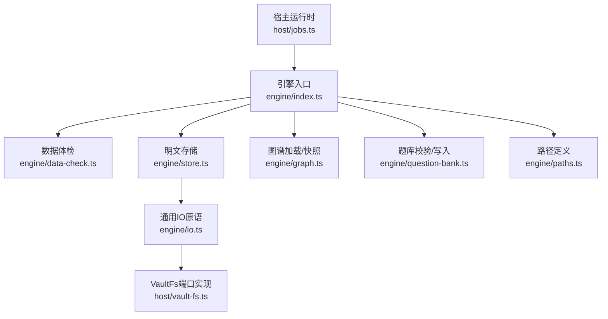
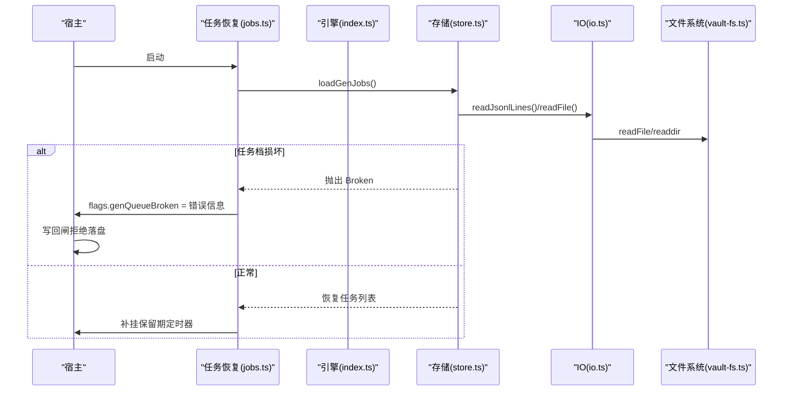
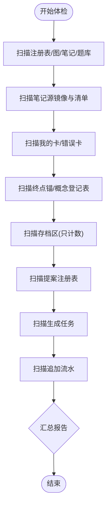
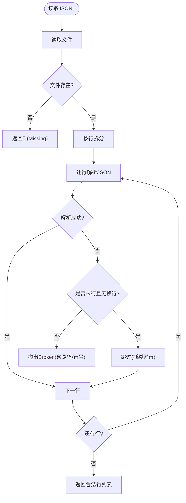
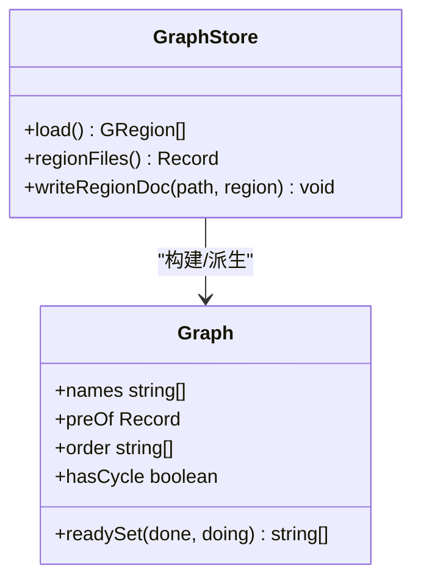
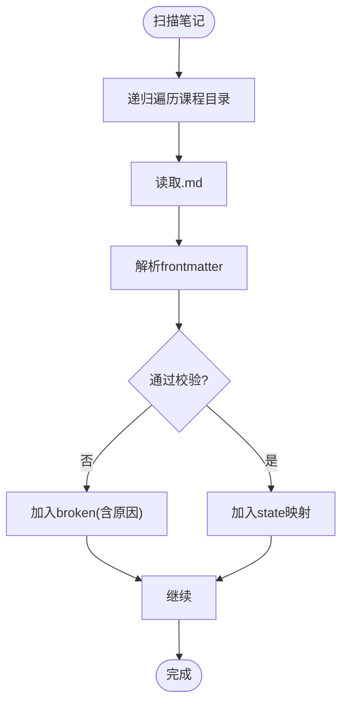
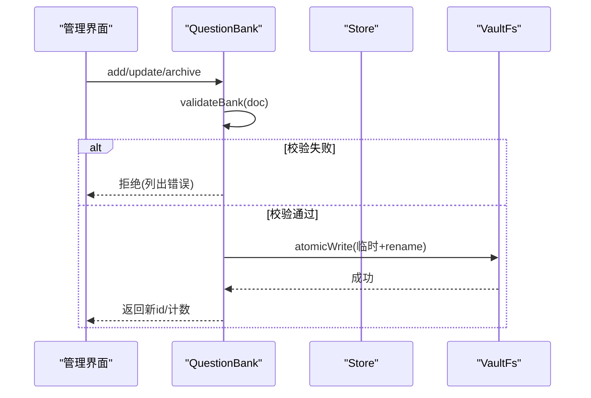
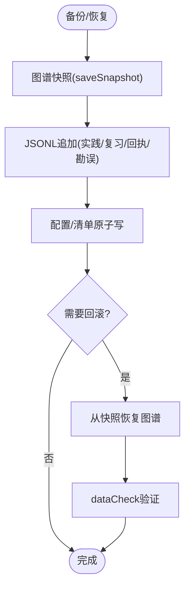
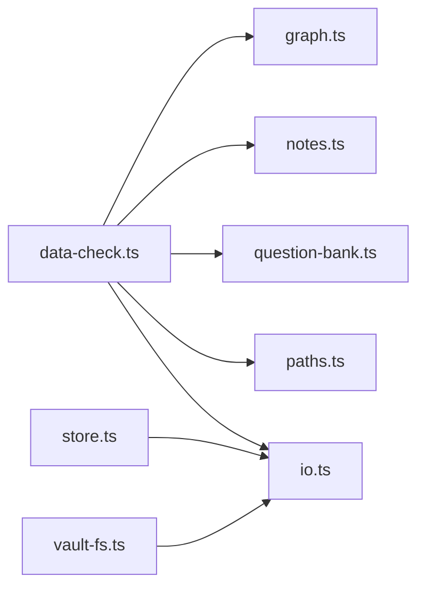

# 数据恢复

<cite>
**本文引用的文件**
- [data-check.ts](file://src/engine/data-check.ts)
- [store.ts](file://src/engine/store.ts)
- [io.ts](file://src/engine/io.ts)
- [notes.ts](file://src/engine/notes.ts)
- [graph.ts](file://src/engine/graph.ts)
- [question-bank.ts](file://src/engine/question-bank.ts)
- [paths.ts](file://src/engine/paths.ts)
- [vault-fs.ts](file://src/host/vault-fs.ts)
- [jobs.ts](file://src/host/jobs.ts)
- [index.ts](file://src/engine/index.ts)
</cite>

## 更新摘要
**所做更改**
- 移除了关于已删除迁移脚本（export-db.mjs 和 migrate-v1.mjs）的引用和说明
- 更新了手动修复工具与脚本章节，反映当前可用的工具状态
- 调整了备份与恢复流程中的旧库导出部分
- 更新了迁移与升级风险控制章节

## 目录
1. [简介](#简介)
2. [项目结构](#项目结构)
3. [核心组件](#核心组件)
4. [架构总览](#架构总览)
5. [详细组件分析](#详细组件分析)
6. [依赖关系分析](#依赖关系分析)
7. [性能考虑](#性能考虑)
8. [故障排查指南](#故障排查指南)
9. [结论](#结论)
10. [附录](#附录)

## 简介
本指南面向学习平台插件的数据恢复与修复，聚焦以下目标：
- 数据一致性检查与验证：图谱完整性、笔记状态、题目数据校验等。
- 备份与恢复流程：全量备份、增量备份、版本回滚。
- 损坏检测与自动修复：损坏类型识别、修复策略选择、修复结果验证。
- 手动修复工具与脚本：使用方式与注意事项。
- 迁移与升级风险控制：断裂归档、版本门、最小化变更。
- 数据丢失预防与灾难恢复计划：可观测性、幂等、原子写、保留期。
- 典型故障案例与修复步骤：基于仓库实现的可执行路径。

## 项目结构
围绕数据恢复的关键代码分布在引擎层（读/写原语、存储、校验）、宿主层（任务恢复、队列保护）与脚本层（导出、迁移存根）。

图表来源
- [jobs.ts:1129-1143](file://src/host/jobs.ts#L1129-L1143)
- [index.ts:467-474](file://src/engine/index.ts#L467-L474)
- [data-check.ts:1-131](file://src/engine/data-check.ts#L1-L131)
- [store.ts:1-10](file://src/engine/store.ts#L1-L10)
- [io.ts:1-103](file://src/engine/io.ts#L1-L103)
- [vault-fs.ts:1-25](file://src/host/vault-fs.ts#L1-L25)
- [graph.ts:1-20](file://src/engine/graph.ts#L1-L20)
- [question-bank.ts:1-22](file://src/engine/question-bank.ts#L1-L22)
- [paths.ts:1-120](file://src/engine/paths.ts#L1-L120)

章节来源
- [jobs.ts:1129-1143](file://src/host/jobs.ts#L1129-L1143)
- [index.ts:467-474](file://src/engine/index.ts#L467-L474)
- [paths.ts:1-120](file://src/engine/paths.ts#L1-L120)

## 核心组件
- 数据体检（只读盘点）：扫描注册表、图、笔记、题库、笔记源镜像、我的卡/错误卡、概念登记表、终点锚、存档区、边实验账本、提案、生成任务、追加流水等，输出 Missing/Broken/Archived/Hint 四类发现。
- 明文存储与原子写：JSONL 追加日志、单文件 JSON 原子替换；提供 readJsonlLines/readJsonlLinesReport 的健壮读取语义（中段坏行=Broken，撕裂尾行豁免）。
- 图谱健康与结构检查：节点 schema、区域文档、环检测、连通分量、就绪判定、健康分。
- 题库校验与写入：按题型严格校验答案形态、选项、数值容差等；支持单题增改、归档/恢复、批量归档。
- 路径与存储适配：统一中心/课程级路径；VaultFs 抽象 node:fs，确保 engine 零直接 IO 依赖。
- 宿主任务恢复：启动时恢复生成任务档，Broken 时置队列 broken 态并拒绝落盘，清扫悬空记录。

章节来源
- [data-check.ts:1-131](file://src/engine/data-check.ts#L1-L131)
- [store.ts:1-10](file://src/engine/store.ts#L1-L10)
- [io.ts:56-103](file://src/engine/io.ts#L56-L103)
- [graph.ts:175-276](file://src/engine/graph.ts#L175-L276)
- [question-bank.ts:139-262](file://src/engine/question-bank.ts#L139-L262)
- [paths.ts:26-120](file://src/engine/paths.ts#L26-L120)
- [vault-fs.ts:11-24](file://src/host/vault-fs.ts#L11-L24)
- [jobs.ts:1129-1143](file://src/host/jobs.ts#L1129-L1143)

## 架构总览
数据恢复贯穿"读侧可见性 + 写侧原子性 + 断点恢复"三要素：
- 读侧：dataCheck 对全库做只读体检；JSONL 读取对中段损坏抛错、尾行撕裂豁免。
- 写侧：atomicWrite 临时文件+rename 原子替换；JSONL 追加一次一行。
- 恢复：宿主启动恢复生成任务档，Broken 则阻断写回但允许其他功能继续。

图表来源
- [jobs.ts:1129-1143](file://src/host/jobs.ts#L1129-L1143)
- [store.ts:168-206](file://src/engine/store.ts#L168-L206)
- [io.ts:71-103](file://src/engine/io.ts#L71-L103)
- [vault-fs.ts:11-24](file://src/host/vault-fs.ts#L11-L24)

## 详细组件分析

### 数据体检（Data Check）
- 范围覆盖：注册表、图、笔记、题库、笔记源镜像、我的卡/错误卡、概念登记表、终点锚、存档区、边实验账本、提案、生成任务、证据流。
- 分类标准：Missing（合法空态）、Broken（对象存在但不可解析或违约）、Archived（显式存档）、Hint（提示级，如过期未决、撕裂尾行）。
- 关键行为：
  - 笔记 frontmatter 缺失/非法 YAML/字段违约束为 Broken。
  - 题库 YAML 解析失败/字段违约束为 Broken；缺失对应节点题库为 Missing。
  - 笔记源清单与注册表双向对账不一致为 Broken；源文件缺失为 Missing。
  - 终点锚悬空（指向不在图的节点）为 Broken。
  - 生成任务注册表非数组/非 JSON 为 Broken。
  - 提案注册表逐条形状校验、pair 悬空、artifact 缺失均为 Broken。
  - 边实验账本到期未决为 Hint。
  - 证据流中段坏行=Broken，撕裂尾行=Hint。

图表来源
- [data-check.ts:206-467](file://src/engine/data-check.ts#L206-L467)
- [data-check.ts:469-611](file://src/engine/data-check.ts#L469-L611)
- [data-check.ts:620-689](file://src/engine/data-check.ts#L620-L689)
- [data-check.ts:696-787](file://src/engine/data-check.ts#L696-L787)
- [data-check.ts:789-800](file://src/engine/data-check.ts#L789-L800)

章节来源
- [data-check.ts:1-131](file://src/engine/data-check.ts#L1-L131)
- [data-check.ts:206-800](file://src/engine/data-check.ts#L206-L800)

### 明文存储与 JSONL 读取
- 原子写：临时文件 + rename 保证整档替换的原子性。
- JSONL 读取：
  - 中段损坏：抛错（Broken），带标签、路径、行号。
  - 撕裂尾行：跳过（进程中断的物理残留），不视为损坏。
  - 缺失：返回空数组（Missing 合法空态）。
- 存储项：journal/practice/review-log 追加；proposals/pins/experiments/receipts/habit-repeats/erratum 等单文件或追加流。

图表来源
- [io.ts:56-103](file://src/engine/io.ts#L56-L103)
- [store.ts:475-478](file://src/engine/store.ts#L475-L478)

章节来源
- [io.ts:30-54](file://src/engine/io.ts#L30-L54)
- [io.ts:56-103](file://src/engine/io.ts#L56-L103)
- [store.ts:47-206](file://src/engine/store.ts#L47-L206)

### 图谱完整性与健康度
- 图谱加载：data/*.yaml 解析为 Region，构造 Graph 计算拓扑序、环检测、可达集、连通分量、就绪集合。
- 结构检查：重名、断边、环引入均报错。
- 健康分：动作句比例、est 覆盖率、前置完备、收敛度、结构卫生五项评分。

图表来源
- [graph.ts:175-276](file://src/engine/graph.ts#L175-L276)
- [graph.ts:278-443](file://src/engine/graph.ts#L278-L443)

章节来源
- [graph.ts:175-443](file://src/engine/graph.ts#L175-L443)

### 笔记状态验证
- frontmatter 解析与校验：node/stage/fsrs/content/practice 等字段强校验；未知顶层键保留。
- 扫描课程笔记：遍历 .md，分类为 state/raw/broken，broken 包含位置与原因。
- 保存/更新：原子写 frontmatter+正文；就地 patch 合并。

图表来源
- [notes.ts:37-53](file://src/engine/notes.ts#L37-L53)
- [notes.ts:88-219](file://src/engine/notes.ts#L88-L219)
- [notes.ts:247-304](file://src/engine/notes.ts#L247-L304)

章节来源
- [notes.ts:37-219](file://src/engine/notes.ts#L37-L219)
- [notes.ts:247-335](file://src/engine/notes.ts#L247-L335)

### 题目数据校验与修复
- 题库 schema 校验：题型、答案形态、选项、数值容差、概念引用等。
- 写入门禁：新增/更新/归档前全量 validateBank 校验，失败不写盘。
- 修复建议：
  - 对违规存量题，先 dataCheck 定位，再走 question-update/archive 修正。
  - 对 AI 判卷失败，走 gradingFailure 留痕与申诉复核/结算通道。

图表来源
- [question-bank.ts:139-262](file://src/engine/question-bank.ts#L139-L262)
- [question-bank.ts:320-453](file://src/engine/question-bank.ts#L320-L453)
- [io.ts:30-39](file://src/engine/io.ts#L30-L39)

章节来源
- [question-bank.ts:139-453](file://src/engine/question-bank.ts#L139-L453)

### 备份与恢复流程
- 全量备份：
  - 图谱快照：GraphStore.snapshotDoc + store.saveSnapshot（按课程版本号）。
  - 配置/清单：learnhub.json、proposals、pin、experiments 等通过 atomicWrite 原子落盘。
- 增量备份：
  - JSONL 追加（journal/practice/review-log/e-archive/receipts/habit-repeats/erratum）天然增量。
- 版本回滚：
  - 图谱回滚：从 snapshots/<course>-v<N>.json 恢复（需结合 apply 流程与审计日志）。
  - 配置回滚：用历史 JSON 原子替换（注意字段兼容）。

图表来源
- [graph.ts:483-486](file://src/engine/graph.ts#L483-L486)
- [store.ts:280-293](file://src/engine/store.ts#L280-L293)
- [store.ts:424-471](file://src/engine/store.ts#L424-L471)

章节来源
- [graph.ts:483-486](file://src/engine/graph.ts#L483-L486)
- [store.ts:280-293](file://src/engine/store.ts#L280-L293)
- [store.ts:424-471](file://src/engine/store.ts#L424-L471)

### 损坏检测与自动修复机制
- 损坏类型识别：
  - 文件不可读/YAML/JSON 解析失败 → Broken。
  - 契约违约（字段非法、关系不一致）→ Broken。
  - 缺失（合法空态）→ Missing。
  - 提示（过期未决、撕裂尾行）→ Hint。
- 修复策略：
  - 自动生成：题库/错误卡生成走 schema 门禁，失败不写盘。
  - 宿主恢复：生成任务档 Broken 时置队列 broken 态，拒绝落盘，清扫悬空记录。
  - 迁移：断裂归档（pre-v1/pre-v2）只增不删，引擎读侧永不读取。
- 修复结果验证：
  - 运行 dataCheck 确认 findings 消除或降级。
  - 对图谱/题库/笔记进行二次校验。

章节来源
- [data-check.ts:1-131](file://src/engine/data-check.ts#L1-L131)
- [data-check.ts:620-689](file://src/engine/data-check.ts#L620-L689)
- [jobs.ts:1129-1143](file://src/host/jobs.ts#L1129-L1143)

### 手动修复工具与脚本
**已更新** 移除了已废弃的迁移脚本引用

当前可用的手动修复工具：
- 数据体检：通过 engine.dataCheck() 接口进行全库数据一致性检查
- 存储操作：使用 Store 类的原子写方法和 JSONL 追加功能
- 题库管理：通过 QuestionBank 类进行题库数据的校验和修改
- 图谱操作：使用 GraphStore 进行图谱数据的加载和快照

注意：之前用于 SQLite 数据库导出的 export-db.mjs 脚本和 v1→v2 迁移脚本 migrate-v1.mjs 已被移除，因为这些一次性迁移任务已完成。

章节来源
- [store.ts:47-206](file://src/engine/store.ts#L47-L206)
- [question-bank.ts:139-453](file://src/engine/question-bank.ts#L139-L453)
- [graph.ts:175-276](file://src/engine/graph.ts#L175-L276)

### 迁移与升级风险控制
- 断裂归档：pre-v1/pre-v2 子目录只增不删，引擎读侧永不读取；dataCheck 以 archived 信息级盘点。
- 版本门：schema 版本硬门（v2），旧库需迁移或归档。
- 最小化变更：所有写操作走 atomicWrite；JSONL 追加避免覆盖。
- 观察面：沉淀层（sediment）与运行日志（runLog）用于审计与回溯。

**已更新** 移除了关于已删除迁移脚本的引用

章节来源
- [paths.ts:108-120](file://src/engine/paths.ts#L108-L120)
- [data-check.ts:620-659](file://src/engine/data-check.ts#L620-L659)

### 数据丢失预防与灾难恢复计划
- 预防：
  - 原子写：整档替换防半写。
  - 追加日志：JSONL 只增不回滚。
  - 快照：图谱按版本保存。
  - 保留期：生成任务终态进入保留期后定时出册。
- 恢复：
  - 启动恢复：restoreGenJobs 恢复任务档，Broken 则阻断写回。
  - 回滚：从快照恢复图谱，配合 apply 与审计日志。

章节来源
- [store.ts:280-293](file://src/engine/store.ts#L280-L293)
- [jobs.ts:1129-1143](file://src/host/jobs.ts#L1129-L1143)

## 依赖关系分析
- engine 层通过 VaultFs 端口与 host 适配器解耦，避免反向依赖。
- dataCheck 依赖 graph/notes/question-bank/registry/concepts/seed/learner-cards/error-cards/note-source/probation/xp/dates/paths/io 等模块，形成多域只读扫描。
- store 依赖 io 的 atomicWrite 与 readJsonlLines，被上层模块（bank、content、growth 等）复用。

图表来源
- [data-check.ts:10-31](file://src/engine/data-check.ts#L10-L31)
- [store.ts:1-26](file://src/engine/store.ts#L1-L26)
- [io.ts:1-28](file://src/engine/io.ts#L1-L28)
- [vault-fs.ts:1-25](file://src/host/vault-fs.ts#L1-L25)

章节来源
- [data-check.ts:10-31](file://src/engine/data-check.ts#L10-L31)
- [store.ts:1-26](file://src/engine/store.ts#L1-L26)
- [io.ts:1-28](file://src/engine/io.ts#L1-L28)

## 性能考虑
- JSONL 追加写入 O(1)，读取按流处理，撕裂尾行豁免减少异常开销。
- dataCheck 全库扫描为只读，适合定期离线运行；对大 vault 建议分批或按需扫描。
- 图谱构建在内存中完成，环检测与可达集计算复杂度与节点/边规模相关，建议在提交前预检。

## 故障排查指南
- 生成任务档损坏：
  - 现象：启动时报 gen-jobs restore failed，队列置 broken，写回闸拒绝落盘。
  - 处置：修复或删除损坏文件后重启；清理悬空记录；必要时重新下发任务。
- JSONL 中段损坏：
  - 现象：读取时报 Broken，带路径与行号。
  - 处置：删除损坏行或整文件重建；再次运行 dataCheck 验证。
- 题库 schema 违约：
  - 现象：写入失败，列出具体错误。
  - 处置：按错误提示修正题干/答案/选项/容差等；再次写入。
- 笔记 frontmatter 损坏：
  - 现象：scanCourseNotes 产出 broken 列表。
  - 处置：修复 frontmatter 或移除无效文件；再次扫描。
- 终点锚悬空：
  - 现象：dataCheck 报 endpoint_anchor_dangling。
  - 处置：通过显式动作修正锚（不直改）；确保终点节点在图内。

章节来源
- [jobs.ts:1129-1143](file://src/host/jobs.ts#L1129-L1143)
- [io.ts:71-103](file://src/engine/io.ts#L71-L103)
- [question-bank.ts:139-262](file://src/engine/question-bank.ts#L139-L262)
- [notes.ts:247-304](file://src/engine/notes.ts#L247-L304)
- [data-check.ts:571-611](file://src/engine/data-check.ts#L571-L611)

## 结论
本系统通过"只读体检 + 原子写 + 断点恢复"的组合，实现了高可靠的数据一致性与可恢复性。dataCheck 提供全库可见性，store/io 保障写安全，宿主恢复确保任务连续性。建议在生产环境定期运行 dataCheck，结合快照与 JSONL 追加，建立完善的备份与回滚策略。

## 附录
- 常用命令与路径：
  - 体检入口：engine.dataCheck()（通过引擎入口暴露）
  - 快照目录：state/snapshots/<课程>-v<N>.json
  - 生成任务档：state/生成任务.json
- 最佳实践：
  - 任何写操作前运行 dataCheck 预检。
  - 重要变更前创建图谱快照。
  - 对 JSONL 文件只做追加，避免覆盖。
  - 对任务档损坏采用"修复/删除 + 重启"的标准流程。