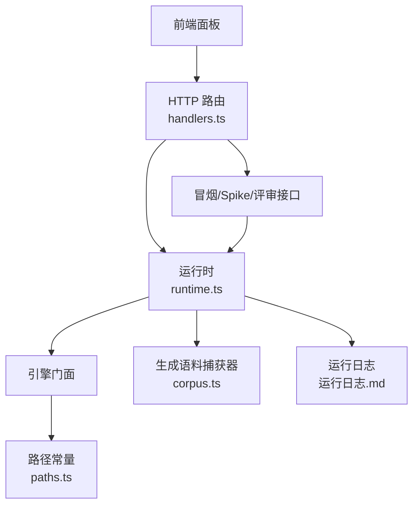
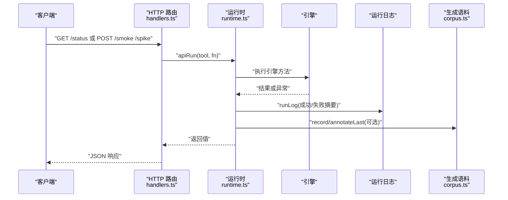
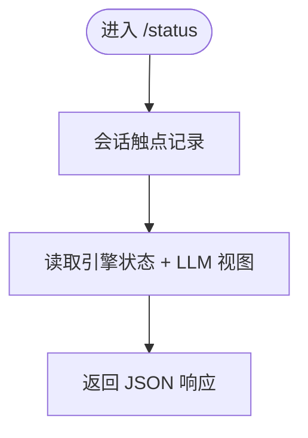
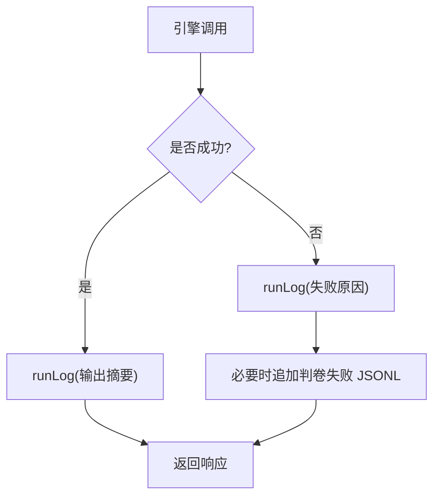
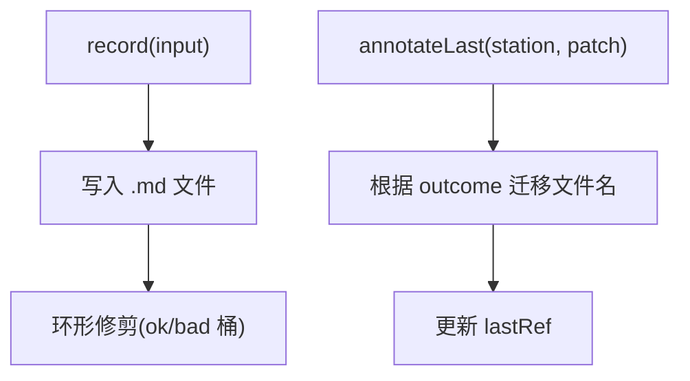
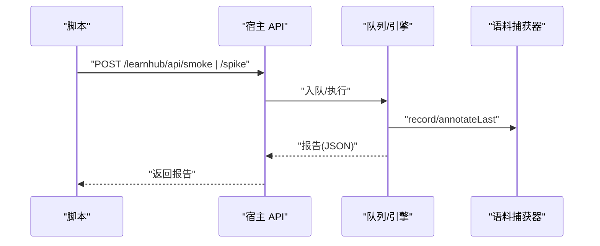
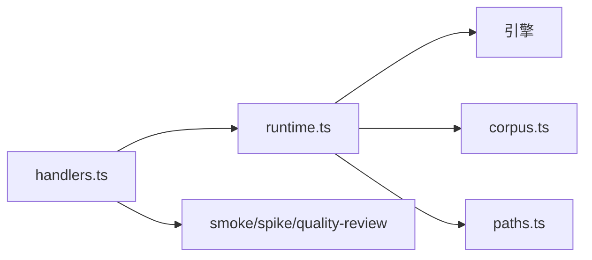

# 调试工具

<cite>
**本文引用的文件**
- [src/host/handlers.ts](file://src/host/handlers.ts)
- [src/host/http.ts](file://src/host/http.ts)
- [src/host/runtime.ts](file://src/host/runtime.ts)
- [src/host/corpus.ts](file://src/host/corpus.ts)
- [src/engine/health.ts](file://src/engine/health.ts)
- [scripts/smoke.mjs](file://scripts/smoke.mjs)
- [scripts/gen-smoke.mjs](file://scripts/gen-smoke.mjs)
- [scripts/spike.mjs](file://scripts/spike.mjs)
- [src/engine/paths.ts](file://src/engine/paths.ts)
</cite>

## 目录
1. [简介](#简介)
2. [项目结构](#项目结构)
3. [核心组件](#核心组件)
4. [架构总览](#架构总览)
5. [详细组件分析](#详细组件分析)
6. [依赖关系分析](#依赖关系分析)
7. [性能与可观测性](#性能与可观测性)
8. [故障排查指南](#故障排查指南)
9. [结论](#结论)
10. [附录：常用命令与接口速查](#附录：常用命令与接口速查)

## 简介
本指南面向学习中心插件的调试与诊断，覆盖以下主题：
- 内置健康检查与系统状态监控（HTTP 接口）
- 运行日志、生成语料、质量评审报告的收集与分析
- 冒烟测试与通道 Spike 实验等性能/稳定性工具
- 调试模式与断点调试实践
- 如何提交高质量故障报告（含必要上下文与复现步骤）

## 项目结构
与调试相关的关键位置：
- 宿主 HTTP 路由与处理器：提供 /status、/smoke、/spike、/quality-review 等诊断接口
- 运行时与日志：统一封装引擎调用、运行日志落盘、失败记录
- 生成语料捕获器：按站归档真实模型调用前后数据，支持补标与环形保留
- 健康分计算：对图谱结构进行量化评估，辅助定位结构性问题
- 脚本工具：只读冒烟、生成冒烟、Spike 协议对比等

**图示来源**
- [src/host/handlers.ts:101-250](file://src/host/handlers.ts#L101-L250)
- [src/host/runtime.ts:138-253](file://src/host/runtime.ts#L138-L253)
- [src/host/corpus.ts:186-342](file://src/host/corpus.ts#L186-L342)
- [src/engine/paths.ts:51-65](file://src/engine/paths.ts#L51-L65)

**章节来源**
- [src/host/handlers.ts:101-250](file://src/host/handlers.ts#L101-L250)
- [src/host/runtime.ts:138-253](file://src/host/runtime.ts#L138-L253)
- [src/host/corpus.ts:186-342](file://src/host/corpus.ts#L186-L342)
- [src/engine/paths.ts:51-65](file://src/engine/paths.ts#L51-L65)

## 核心组件
- 健康检查与状态
  - GET /status：返回引擎状态与当前 LLM 配置视图，便于快速确认服务可用性与模型选择。
  - 图谱健康分：基于动作命名、est 覆盖率、前置完备、收敛度、结构卫生五项指标给出 0–100 分数，帮助识别图质量问题。
- 运行日志
  - 每次引擎调用通过 apiRun/runLog 写入“运行日志.md”，包含时间戳、工具名、输出摘要或失败原因。
- 生成语料
  - 所有 LLM 调用以 Markdown 文件归档，包含 frontmatter（站点、耗时、token、provider/model）、提示词、原始输出与工具调用段；支持 ok/bad/tolerated 三态与环形保留。
- 诊断接口
  - POST /smoke：在临时 vault 跑通全管线并返回结构化报告（成功率、失败码、产物断言）。
  - POST /spike：双臂×多变的工具调用通道对比实验，产出 JSON 报告与语料。
  - POST /quality-review：离线批量评审器，从生成语料抽样并按量规评分，落人读报告到 state/质量评审。

**章节来源**
- [src/host/handlers.ts:101-250](file://src/host/handlers.ts#L101-L250)
- [src/host/runtime.ts:217-253](file://src/host/runtime.ts#L217-L253)
- [src/host/corpus.ts:1-342](file://src/host/corpus.ts#L1-L342)
- [src/engine/health.ts:1-105](file://src/engine/health.ts#L1-L105)

## 架构总览
下面的时序图展示了“请求进入→路由处理→运行日志/语料落盘→返回响应”的完整链路。

**图示来源**
- [src/host/handlers.ts:101-250](file://src/host/handlers.ts#L101-L250)
- [src/host/runtime.ts:217-253](file://src/host/runtime.ts#L217-L253)
- [src/host/corpus.ts:186-342](file://src/host/corpus.ts#L186-L342)

## 详细组件分析

### 健康检查与系统状态
- GET /status
  - 作用：获取引擎状态与当前 LLM 配置（provider/model/思考档），用于快速验证服务可用性与模型透明展示。
  - 行为：调用 sessionStartCheckpoint 记录会话触点，随后读取引擎 statusJson 与 llmView。
- 图谱健康分
  - 作用：将教学语义上可接受的图结构压缩为 0–100 的可优化数字，辅助教练与审计定位问题。
  - 指标：动作句比例、est 覆盖率、前置完备、收敛度、结构卫生（别名包含、连通分量、根缺失等）。

**图示来源**
- [src/host/handlers.ts:101-107](file://src/host/handlers.ts#L101-L107)
- [src/engine/health.ts:1-105](file://src/engine/health.ts#L1-L105)

**章节来源**
- [src/host/handlers.ts:101-107](file://src/host/handlers.ts#L101-L107)
- [src/engine/health.ts:1-105](file://src/engine/health.ts#L1-L105)

### 运行日志与失败追踪
- 运行日志
  - 位置：学习中心 state 目录下的“运行日志.md”。
  - 内容：每次引擎调用的时间戳、工具名、输出摘要或失败原因；失败时也会记录。
  - 截断：单条日志上限 1500 字符，避免过大条目影响可读性。
- 失败追踪
  - 判卷失败留痕：将原始模型输出与题目定位信息追加到 gradingFailurePath（JSONL），失败静默不影响主流程。
  - 任务失败详情：生成任务失败时会携带最近一条语料引用，便于回溯。

**图示来源**
- [src/host/runtime.ts:217-253](file://src/host/runtime.ts#L217-L253)
- [src/engine/content-subsystem.ts:891-903](file://src/engine/content-subsystem.ts#L891-L903)

**章节来源**
- [src/host/runtime.ts:217-253](file://src/host/runtime.ts#L217-L253)
- [src/engine/content-subsystem.ts:891-903](file://src/engine/content-subsystem.ts#L891-L903)

### 生成语料捕获器（Corpus）
- 存储结构
  - 目录：<学习中心>/state/生成语料/<站>/，每个调用一个 Markdown 文件。
  - Frontmatter：ts、station、kind、effort、outcome、code、truncated、duration_ms、usage、provider、model、prompt_chars、reply_chars。
  - 段落：## 提示词、## 原始输出、## 工具调用（当产物在工具参数中时出现）。
- 生命周期
  - record：同步登记 lastRef，异步落盘并环形修剪（ok 桶 25/站，bad 桶 200/站）。
  - annotate/annotateLast：按相对 ref 或站内最近一条补标 outcome/code，并在 ok/bad 桶间迁移文件名。
  - flush：等待全部写盘完成（测试缝）。
- 使用场景
  - 冒烟/评审/回归：作为解析器回归 fixture 源、质量评审抽样池、换模型/供应商时的格式漂移体检标本。

**图示来源**
- [src/host/corpus.ts:186-342](file://src/host/corpus.ts#L186-L342)

**章节来源**
- [src/host/corpus.ts:1-342](file://src/host/corpus.ts#L1-L342)

### 冒烟测试与通道 Spike
- 只读冒烟（scripts/smoke.mjs）
  - 目的：用真实 vault 数据跑一遍引擎读路径，不写任何文件。
  - 用法：node scripts/smoke.mjs <vault 路径>
  - 覆盖：statusJson、xpStatus、promptKinds、recommend、doctor、queueItemsAll、graphAnalyze、coursesTree、lesson/contentPack/discussionPack/questions 等。
- 生成冒烟（scripts/gen-smoke.mjs）
  - 目的：在临时 vault 跑通全管线（种子→大纲→逐节→出题）+ 结构断言，返回结构化报告。
  - 用法：npm run smoke（可通过 --corpus 保留语料供离线评审）。
  - 行为：POST /learnhub/api/smoke，超时默认 20 分钟；报告包含各站成功率、失败码分布、token 消耗与产物断言。
- 通道 Spike（scripts/spike.mjs）
  - 目的：双臂×两站×多变体 N 次（真 provider），产出格式轴、臂级、多样性/内容轴指标与裁决线。
  - 用法：npm run spike（可通过 --runs/--stations/--temperature/--corpus 控制）。
  - 行为：POST /learnhub/api/spike，超时默认 60 分钟；报告 JSON 落盘并可打印表格。

**图示来源**
- [scripts/smoke.mjs:1-65](file://scripts/smoke.mjs#L1-L65)
- [scripts/gen-smoke.mjs:1-156](file://scripts/gen-smoke.mjs#L1-L156)
- [scripts/spike.mjs:1-127](file://scripts/spike.mjs#L1-L127)
- [src/host/handlers.ts:181-250](file://src/host/handlers.ts#L181-L250)
- [src/host/corpus.ts:186-342](file://src/host/corpus.ts#L186-L342)

**章节来源**
- [scripts/smoke.mjs:1-65](file://scripts/smoke.mjs#L1-L65)
- [scripts/gen-smoke.mjs:1-156](file://scripts/gen-smoke.mjs#L1-L156)
- [scripts/spike.mjs:1-127](file://scripts/spike.mjs#L1-L127)
- [src/host/handlers.ts:181-250](file://src/host/handlers.ts#L181-L250)

### 质量评审与离线报告
- POST /quality-review
  - 目的：从生成语料抽样，按质量量规逐维度评分，落人读报告到 state/质量评审。
  - 参数：badQuota、okQuota、repeats、stations、systemic.minSamples、systemic.lowRate、outDir、corpusDir。
  - 行为：同步阻塞整轮（分钟级），严格参数校验，失败时 fail loud。

**章节来源**
- [src/host/handlers.ts:220-250](file://src/host/handlers.ts#L220-L250)

## 依赖关系分析
- 路由层（handlers.ts）依赖运行时（runtime.ts）提供的 apiRun/runLog，以及静态资源与队列能力。
- 运行时（runtime.ts）装配引擎、AgentSeam、语料捕获器，并负责部署路径校验与新鲜库初始化。
- 语料捕获器（corpus.ts）被宿主 LLM 适配器与队列泵使用，用于全量落盘与失败补标。
- 路径常量（paths.ts）集中定义 state 目录与关键文件路径，确保日志、语料、评审报告落点一致。

**图示来源**
- [src/host/handlers.ts:101-250](file://src/host/handlers.ts#L101-L250)
- [src/host/runtime.ts:138-253](file://src/host/runtime.ts#L138-L253)
- [src/host/corpus.ts:186-342](file://src/host/corpus.ts#L186-L342)
- [src/engine/paths.ts:51-65](file://src/engine/paths.ts#L51-L65)

**章节来源**
- [src/host/handlers.ts:101-250](file://src/host/handlers.ts#L101-L250)
- [src/host/runtime.ts:138-253](file://src/host/runtime.ts#L138-L253)
- [src/host/corpus.ts:186-342](file://src/host/corpus.ts#L186-L342)
- [src/engine/paths.ts:51-65](file://src/engine/paths.ts#L51-L65)

## 性能与可观测性
- 可观测性要点
  - 运行日志：查看“运行日志.md”，关注失败条目与调用耗时。
  - 生成语料：查看“state/生成语料/<站>/”，按 outcome 桶筛选 ok/bad，结合 frontmatter 中的 duration_ms、usage、provider/model 定位瓶颈。
  - 质量评审报告：查看“state/质量评审/”，对照量规逐项分析。
- 性能工具
  - 只读冒烟：快速验证读路径可用性，适合 CI 或本地自检。
  - 生成冒烟：端到端验证生成管线，关注各站成功率与失败码。
  - Spike：对比不同变体的交付率、命中率、schema 合规与 token 消耗，辅助协议/提示词优化。

[本节为通用指导，无需特定文件引用]

## 故障排查指南
- 常见问题定位
  - 服务不可用：先 curl GET /learnhub/api/status 确认宿主存活与模型配置。
  - 生成失败：查看“运行日志.md”失败条目；若涉及 LLM 调用失败，打开对应站的生成语料文件，核对 prompt 与 output。
  - 判卷失败：检查 gradingFailurePath 的 JSONL 条目，定位题目与原始输出。
  - 任务失败详情：生成任务失败会附带最近一条语料引用，直接跳转到对应文件。
- 复现与证据
  - 使用只读冒烟或生成冒烟最小化复现；必要时开启 Spike 固定温度/次数采集样本。
  - 保留：运行日志片段、生成语料文件、质量评审报告、错误堆栈与请求参数。
- 提交高质量故障报告
  - 必含：环境信息（vault 路径、centerRel、provider/model）、触发步骤、期望与实际结果、相关日志与语料链接、是否可稳定复现。
  - 建议：附上冒烟/Spik e 报告 JSON 与截图，标注失败站与失败码。

**章节来源**
- [src/host/handlers.ts:101-250](file://src/host/handlers.ts#L101-L250)
- [src/host/runtime.ts:217-253](file://src/host/runtime.ts#L217-L253)
- [src/host/corpus.ts:186-342](file://src/host/corpus.ts#L186-L342)
- [src/engine/content-subsystem.ts:891-903](file://src/engine/content-subsystem.ts#L891-L903)

## 结论
本插件提供了完善的调试与诊断体系：通过 /status 快速健康检查、运行日志与生成语料实现端到端可观测、冒烟与 Spike 保障质量与性能、质量评审驱动持续改进。遵循本指南的流程与工具，可高效定位问题、降低排障成本，并提升发布质量。

[本节为总结，无需特定文件引用]

## 附录：常用命令与接口速查
- 健康检查
  - GET /learnhub/api/status
- 冒烟测试
  - node scripts/smoke.mjs <vault 路径>
  - npm run smoke [--corpus <目录>]
  - POST /learnhub/api/smoke
- 通道 Spike
  - npm run spike [--runs N] [--stations 课程大纲,题目生成] [--temperature T] [--corpus <目录>]
  - POST /learnhub/api/spike
- 质量评审
  - POST /learnhub/api/quality-review
- 日志与语料
  - 运行日志：学习中心 state/运行日志.md
  - 生成语料：学习中心 state/生成语料/<站>/
  - 质量评审报告：学习中心 state/质量评审/

**章节来源**
- [src/host/handlers.ts:101-250](file://src/host/handlers.ts#L101-L250)
- [scripts/smoke.mjs:1-65](file://scripts/smoke.mjs#L1-L65)
- [scripts/gen-smoke.mjs:1-156](file://scripts/gen-smoke.mjs#L1-L156)
- [scripts/spike.mjs:1-127](file://scripts/spike.mjs#L1-L127)
- [src/engine/paths.ts:51-65](file://src/engine/paths.ts#L51-L65)