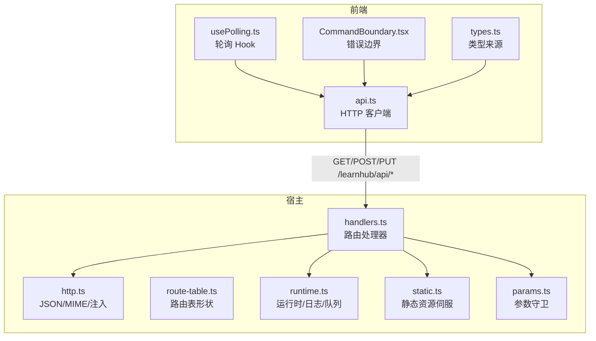
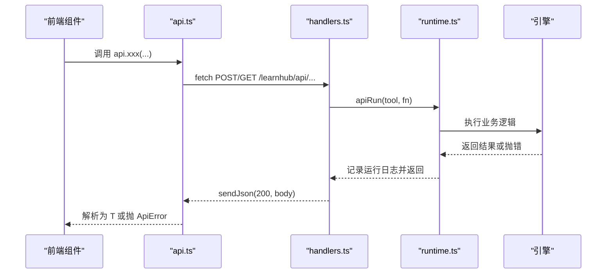
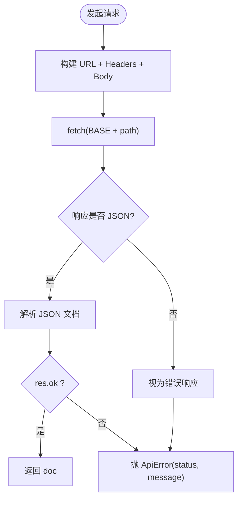
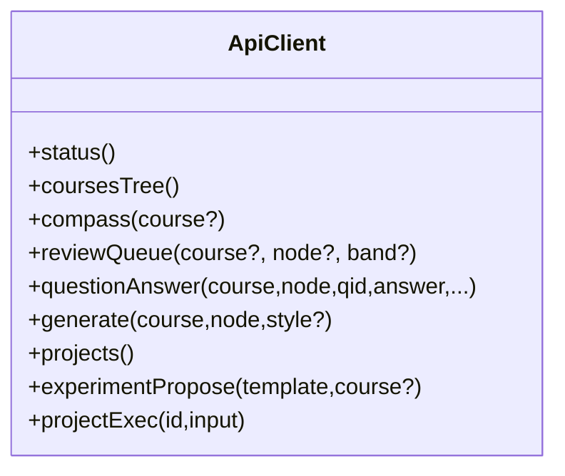
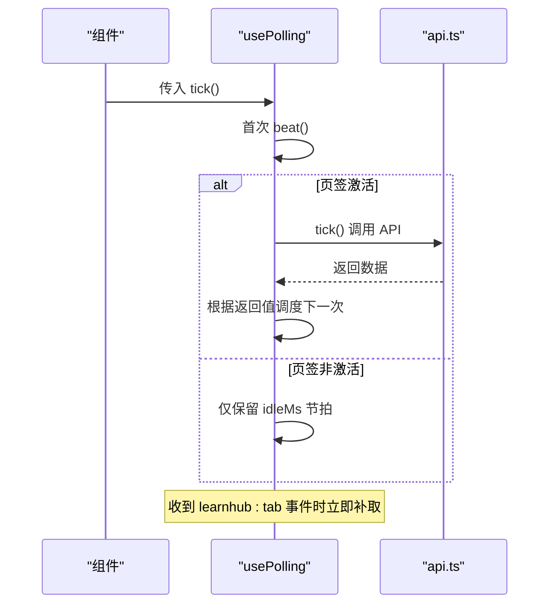
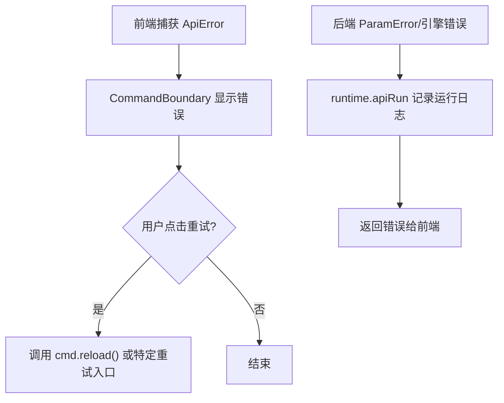
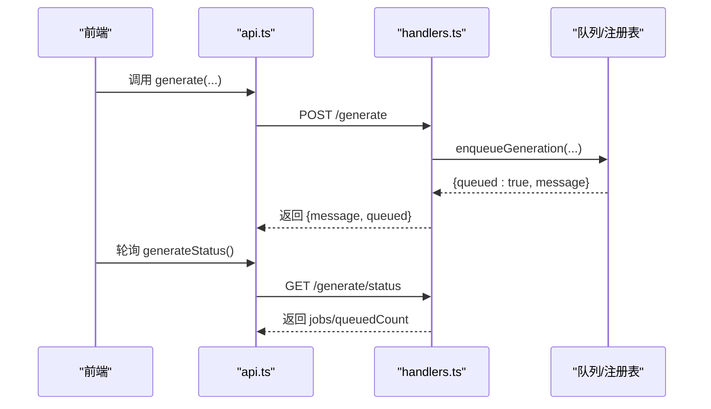
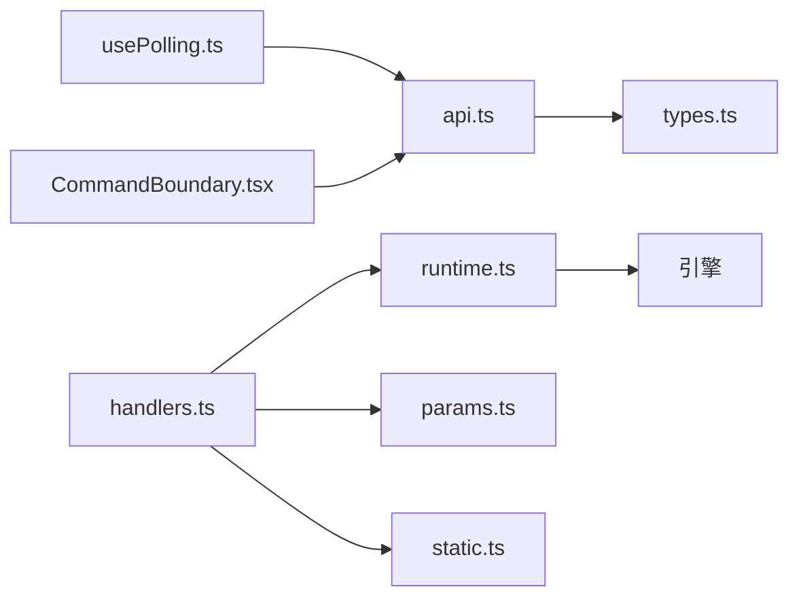

# API 集成层

<cite>
**本文引用的文件**
- [ui/src/api.ts](file://ui/src/api.ts)
- [ui/src/types.ts](file://ui/src/types.ts)
- [ui/src/hooks/usePolling.ts](file://ui/src/hooks/usePolling.ts)
- [ui/src/components/CommandBoundary.tsx](file://ui/src/components/CommandBoundary.tsx)
- [src/host/http.ts](file://src/host/http.ts)
- [src/host/handlers.ts](file://src/host/handlers.ts)
- [src/host/route-table.ts](file://src/host/route-table.ts)
- [src/host/runtime.ts](file://src/host/runtime.ts)
- [src/host/static.ts](file://src/host/static.ts)
- [src/host/params.ts](file://src/host/params.ts)
</cite>

## 目录
1. [简介](#简介)
2. [项目结构](#项目结构)
3. [核心组件](#核心组件)
4. [架构总览](#架构总览)
5. [详细组件分析](#详细组件分析)
6. [依赖关系分析](#依赖关系分析)
7. [性能考量](#性能考量)
8. [故障排除指南](#故障排除指南)
9. [结论](#结论)
10. [附录：使用示例与最佳实践](#附录使用示例与最佳实践)

## 简介
本文件面向 LearnHub 前端 API 集成层，系统性说明前后端通信架构、HTTP 请求封装、错误处理与重试机制、API 客户端设计（方法封装、参数校验、响应处理）、实时数据更新策略（轮询与事件驱动），以及认证与授权流程。同时给出调用最佳实践、加载状态管理与用户体验优化建议，并提供具体使用示例与故障排除指引。

## 项目结构
LearnHub 的前端通过统一的 API 客户端向宿主提供的 /learnhub/api/* 路由发起 HTTP 请求；后端由 Node.js 宿主服务提供静态页面、资源与业务路由，并通过运行时对象访问引擎能力。关键路径如下：
- 前端 API 客户端：封装 fetch、统一错误类型、按领域暴露方法族
- 前端类型定义：集中声明 UI 专用类型与从引擎/宿主派生的响应类型
- 前端轮询 Hook：页签保活、按需节流、切回补取
- 前端错误边界：三态呈现（加载中/内容/失败）与重试入口
- 宿主 HTTP 工具：JSON 读写、MIME 表、KaTeX 注入
- 宿主路由与处理器：统一分发、参数校验、运行日志、队列任务化
- 宿主运行时：装配引擎、Agent 缝、语料捕获、任务注册表与标志位
- 宿主静态资源：SPA 页面、媒体文件、vendored 库、交互件安全伺服

**图表来源**
- [ui/src/api.ts:13-32](file://ui/src/api.ts#L13-L32)
- [src/host/handlers.ts:101-741](file://src/host/handlers.ts#L101-L741)
- [src/host/http.ts:26-55](file://src/host/http.ts#L26-L55)
- [src/host/runtime.ts:233-253](file://src/host/runtime.ts#L233-L253)
- [src/host/static.ts:25-133](file://src/host/static.ts#L25-L133)
- [src/host/params.ts:36-229](file://src/host/params.ts#L36-L229)

**章节来源**
- [ui/src/api.ts:1-370](file://ui/src/api.ts#L1-L370)
- [src/host/handlers.ts:1-742](file://src/host/handlers.ts#L1-L742)
- [src/host/http.ts:1-55](file://src/host/http.ts#L1-L55)
- [src/host/runtime.ts:1-255](file://src/host/runtime.ts#L1-L255)
- [src/host/static.ts:1-134](file://src/host/static.ts#L1-L134)
- [src/host/params.ts:1-230](file://src/host/params.ts#L1-L230)

## 核心组件
- 前端 API 客户端：基于 fetch 的 http 函数统一封装请求与响应解析，抛出 ApiError；按领域暴露大量方法（课程、复习、生成、项目、实验等）。
- 类型系统：UI 本地类型与从引擎/宿主派生的响应类型集中管理，避免手工镜像。
- 轮询 Hook：usePolling 实现页签保活、激活时拉取、非激活降频、切回立即补取。
- 错误边界：CommandBoundary 提供三态渲染与重试入口，统一失败展示。
- 宿主 HTTP 工具：sendJson/readJson/injectKatexIfMathed 等基础能力。
- 路由与处理器：HANDLERS 集中处理所有面板路由，参数校验、运行日志、任务入队。
- 运行时：createHostRuntime 装配引擎、Agent 缝、语料捕获、任务注册表与标志位；apiRun 统一记录运行日志并透传结果。
- 静态资源：panelPageHandler/serveVaultFile/serveVendor/serveInteractive 提供安全的静态资源与服务。
- 参数守卫：need/opt* 系列统一必填/可选语义与错误消息格式。

**章节来源**
- [ui/src/api.ts:13-353](file://ui/src/api.ts#L13-L353)
- [ui/src/types.ts:1-93](file://ui/src/types.ts#L1-L93)
- [ui/src/hooks/usePolling.ts:1-48](file://ui/src/hooks/usePolling.ts#L1-L48)
- [ui/src/components/CommandBoundary.tsx:1-46](file://ui/src/components/CommandBoundary.tsx#L1-L46)
- [src/host/http.ts:26-55](file://src/host/http.ts#L26-L55)
- [src/host/handlers.ts:101-741](file://src/host/handlers.ts#L101-L741)
- [src/host/runtime.ts:138-193](file://src/host/runtime.ts#L138-L193)
- [src/host/runtime.ts:233-253](file://src/host/runtime.ts#L233-L253)
- [src/host/static.ts:25-133](file://src/host/static.ts#L25-L133)
- [src/host/params.ts:36-229](file://src/host/params.ts#L36-L229)

## 架构总览
前后端通过同源 /learnhub/api/* 进行通信。前端 api.ts 将领域方法映射到对应路由；后端 handlers.ts 根据 METHOD + PATH 分派到具体处理器，执行参数校验、引擎调用、任务入队与返回 JSON。运行时 runtime.ts 负责日志与队列状态持久化，确保可恢复与可观测。

**图表来源**
- [ui/src/api.ts:13-32](file://ui/src/api.ts#L13-L32)
- [src/host/handlers.ts:101-741](file://src/host/handlers.ts#L101-L741)
- [src/host/runtime.ts:233-253](file://src/host/runtime.ts#L233-L253)

**章节来源**
- [ui/src/api.ts:13-353](file://ui/src/api.ts#L13-L353)
- [src/host/handlers.ts:101-741](file://src/host/handlers.ts#L101-L741)
- [src/host/runtime.ts:233-253](file://src/host/runtime.ts#L233-L253)

## 详细组件分析

### HTTP 请求封装与错误处理
- 统一 http(method, path, body)：设置 content-type、序列化 body、解析 JSON、对非 ok 响应构造 ApiError（携带 status 与错误消息）。
- 查询串构建 q(params)：过滤 undefined/空值，拼接 URLSearchParams。
- 错误传播：前端 ApiError 被上层捕获用于提示与重试；后端 ParamError 在分发层追加路由信息，便于定位。

**图表来源**
- [ui/src/api.ts:13-41](file://ui/src/api.ts#L13-L41)

**章节来源**
- [ui/src/api.ts:13-41](file://ui/src/api.ts#L13-L41)
- [src/host/params.ts:32-23](file://src/host/params.ts#L32-L23)

### API 客户端设计与方法封装
- 按领域分组的方法族：课程树、图谱、罗盘、推荐、复习队列、问答、错题、笔记源、Anki、FSRS、项目、实验、周复盘、图域命令等。
- 参数验证：前端以强类型约束（ts types），后端通过 params.ts 的 need/opt* 系列严格校验，非法即 fail loud。
- 响应处理：统一返回 Promise<T>，T 来自 types.ts 中从引擎/宿主派生类型，保证类型一致性与单一事实源。

**图表来源**
- [ui/src/api.ts:43-353](file://ui/src/api.ts#L43-L353)
- [ui/src/types.ts:1-93](file://ui/src/types.ts#L1-L93)

**章节来源**
- [ui/src/api.ts:43-353](file://ui/src/api.ts#L43-L353)
- [ui/src/types.ts:1-93](file://ui/src/types.ts#L1-L93)
- [src/host/params.ts:36-229](file://src/host/params.ts#L36-L229)

### 实时数据更新机制
- 轮询策略：usePolling 提供“挂载即取一次”、“激活页签按 intervalMs 调度”、“非激活页签 idleMs 节拍”、“learnhub:tab 切回立即补取”的统一行为。
- 事件监听：通过 window.addEventListener('learnhub:tab', ...) 实现跨组件/页签的即时刷新触发。
- 无 WebSocket：当前实现未包含 WebSocket 连接；如需实时推送，可在现有轮询基础上扩展事件通道或引入服务端推送。

**图表来源**
- [ui/src/hooks/usePolling.ts:15-47](file://ui/src/hooks/usePolling.ts#L15-L47)

**章节来源**
- [ui/src/hooks/usePolling.ts:1-48](file://ui/src/hooks/usePolling.ts#L1-L48)

### 认证与授权流程
- 会话管理：/status 路由在读取状态前调用 sessionStartCheckpoint，作为会话开始触点（带节流），用于读侧感知与会话统计。
- 权限检查：当前路由层未实现显式鉴权；访问控制依赖于部署环境（如插件宿主内联运行）与 vault 路径白名单（如 /file、/interactive 的路径限制）。
- 建议：若需外部访问，应在网关或宿主前置增加鉴权中间件；对写操作可增加 token 校验与角色检查。

**章节来源**
- [src/host/handlers.ts:101-107](file://src/host/handlers.ts#L101-L107)
- [src/host/static.ts:62-133](file://src/host/static.ts#L62-L133)

### 错误处理与重试机制
- 前端错误：ApiError 携带 status 与消息；CommandBoundary 提供三态渲染与重试按钮；useCoachToasts 等组件可将错误转为通知并支持重试跳转。
- 后端错误：ParamError 统一错误消息格式并在分发层附加路由信息；apiRun 记录失败日志后原样抛出；队列任务失败会落盘并可通过生成状态查询。
- 重试策略：前端采用用户触发的重试（CommandBoundary 的 onRetry/reload）；对于长任务（生成/出题/生长批），通过 /generate/status 轮询任务状态，失败时可调用相应恢复接口（如 resume）。

**图表来源**
- [ui/src/api.ts:7-32](file://ui/src/api.ts#L7-L32)
- [ui/src/components/CommandBoundary.tsx:10-45](file://ui/src/components/CommandBoundary.tsx#L10-L45)
- [src/host/runtime.ts:233-253](file://src/host/runtime.ts#L233-L253)
- [src/host/params.ts:32-23](file://src/host/params.ts#L32-L23)

**章节来源**
- [ui/src/api.ts:7-32](file://ui/src/api.ts#L7-L32)
- [ui/src/components/CommandBoundary.tsx:10-45](file://ui/src/components/CommandBoundary.tsx#L10-L45)
- [src/host/runtime.ts:233-253](file://src/host/runtime.ts#L233-L253)
- [src/host/params.ts:32-23](file://src/host/params.ts#L32-L23)

### 任务化与队列机制
- 入队即返回：/generate、/question-generate、/coach/growth、/coach/compass 等路由将耗时任务入队并立即返回，前端通过 /generate/status 轮询进度。
- 队列恢复：/generate/resume 可恢复重启后暂停的队列，防止静默烧 token。
- 任务状态：GenJob 包含 course/node/phase/progress/message/failures 等字段，供前端展示与消费。

**图表来源**
- [src/host/handlers.ts:388-409](file://src/host/handlers.ts#L388-L409)
- [src/host/handlers.ts:167-169](file://src/host/handlers.ts#L167-L169)
- [src/host/runtime.ts:46-97](file://src/host/runtime.ts#L46-L97)

**章节来源**
- [src/host/handlers.ts:388-409](file://src/host/handlers.ts#L388-L409)
- [src/host/handlers.ts:167-169](file://src/host/handlers.ts#L167-L169)
- [src/host/runtime.ts:46-97](file://src/host/runtime.ts#L46-L97)

## 依赖关系分析
- 前端依赖：api.ts 依赖 types.ts 的类型；usePolling 与 CommandBoundary 消费 api.ts 暴露的方法。
- 后端依赖：handlers.ts 依赖 runtime.ts（apiRun/runLog）、params.ts（参数校验）、static.ts（静态资源）、jobs.ts（队列）、llm.ts（LLM 调用）。
- 运行时依赖：runtime.ts 装配引擎、Agent 缝、语料捕获、任务注册表与标志位。

**图表来源**
- [ui/src/api.ts:1-370](file://ui/src/api.ts#L1-L370)
- [ui/src/types.ts:1-93](file://ui/src/types.ts#L1-L93)
- [ui/src/hooks/usePolling.ts:1-48](file://ui/src/hooks/usePolling.ts#L1-L48)
- [ui/src/components/CommandBoundary.tsx:1-46](file://ui/src/components/CommandBoundary.tsx#L1-L46)
- [src/host/handlers.ts:1-742](file://src/host/handlers.ts#L1-L742)
- [src/host/runtime.ts:1-255](file://src/host/runtime.ts#L1-L255)
- [src/host/params.ts:1-230](file://src/host/params.ts#L1-L230)
- [src/host/static.ts:1-134](file://src/host/static.ts#L1-L134)

**章节来源**
- [ui/src/api.ts:1-370](file://ui/src/api.ts#L1-L370)
- [src/host/handlers.ts:1-742](file://src/host/handlers.ts#L1-L742)
- [src/host/runtime.ts:1-255](file://src/host/runtime.ts#L1-L255)

## 性能考量
- 请求合并与去抖：对高频轮询（如 /generate/status）建议使用 usePolling 的 idleMs 降低后台开销。
- 缓存策略：静态资源使用 immutable 缓存；API 响应默认 no-store，避免陈旧数据。
- 任务串行：生成管线全局串行，避免并发冲突；队列恢复需显式触发。
- LLM 调用：通过 Agent 缝与语料捕获记录调用详情，便于审计与调优。

[本节为通用指导，不直接分析具体文件]

## 故障排除指南
- 常见错误
  - 参数缺失或类型不符：后端抛出 ParamError，前端提示“缺少必填参数/非法可选参数”，检查请求体键名与类型。
  - 网络或服务器错误：ApiError.status 指示 HTTP 状态码，结合后端运行日志定位问题。
  - 任务失败：查看 /generate/status 中的 failures 列表，必要时调用恢复接口或重试。
- 排查步骤
  - 确认路由与方法匹配（GET/POST/PUT）。
  - 检查参数是否符合 params.ts 的 need/opt* 语义。
  - 查看运行日志（中心状态目录下的运行日志文件）。
  - 对静态资源 404，检查路径白名单与扩展名。
- 快速修复
  - 修正请求体字段命名与类型。
  - 对长任务失败，调用 /generate/resume 或重新入队。
  - 对静态资源，确保文件存在且扩展名在白名单中。

**章节来源**
- [src/host/params.ts:32-229](file://src/host/params.ts#L32-L229)
- [src/host/runtime.ts:217-231](file://src/host/runtime.ts#L217-L231)
- [src/host/static.ts:62-133](file://src/host/static.ts#L62-L133)

## 结论
LearnHub 的前端 API 集成层通过统一的 http 封装、严格的参数校验、清晰的错误边界与轮询策略，实现了稳定可靠的前后端通信。后端以 handlers 为中心，结合 runtime 的运行日志与队列机制，提供了可观测、可恢复的任务执行模型。建议在需要时扩展认证与实时推送能力，进一步提升安全性与实时性。

[本节为总结，不直接分析具体文件]

## 附录：使用示例与最佳实践
- 基本调用示例
  - 获取状态：调用 api.status()，类型为 StatusWithLlm。
  - 提交答案：调用 api.questionAnswer(course, node, qid, answer, elapsedS, opts)。
  - 生成内容：调用 api.generate(course, node, style)，随后轮询 api.generateStatus()。
- 最佳实践
  - 使用 CommandBoundary 包裹异步数据加载，统一展示加载/失败/内容三态。
  - 使用 usePolling 管理轮询，避免后台浪费与错过边沿。
  - 对写操作做好错误提示与重试入口，提升用户体验。
  - 遵循后端参数契约，避免静默忽略非法参数。
- 故障排除
  - 遇到 4xx/5xx：先检查前端请求体与后端参数校验；再查看运行日志与队列状态。
  - 静态资源 404：检查路径与扩展名白名单。
  - 任务失败：查看 failures，必要时恢复队列或重新入队。

**章节来源**
- [ui/src/api.ts:43-353](file://ui/src/api.ts#L43-L353)
- [ui/src/components/CommandBoundary.tsx:10-45](file://ui/src/components/CommandBoundary.tsx#L10-L45)
- [ui/src/hooks/usePolling.ts:15-47](file://ui/src/hooks/usePolling.ts#L15-L47)
- [src/host/handlers.ts:388-409](file://src/host/handlers.ts#L388-L409)
- [src/host/runtime.ts:217-231](file://src/host/runtime.ts#L217-L231)
- [src/host/static.ts:62-133](file://src/host/static.ts#L62-L133)