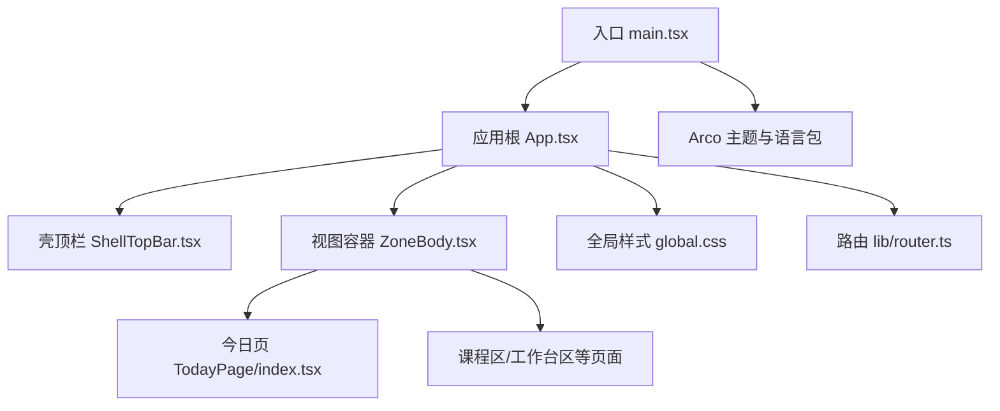
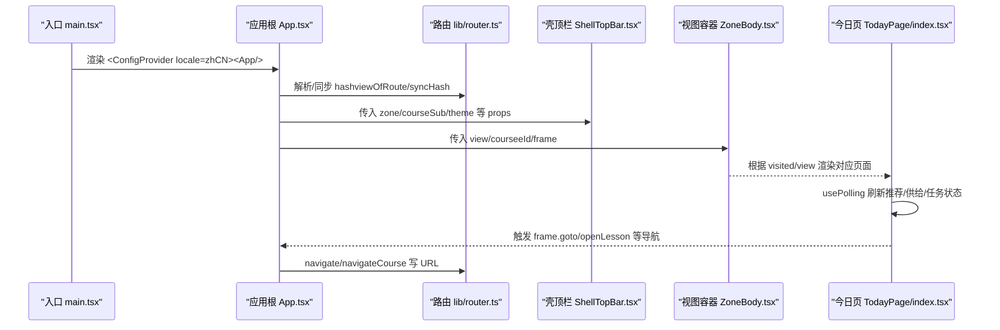
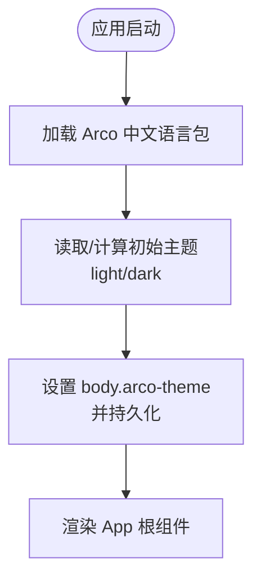
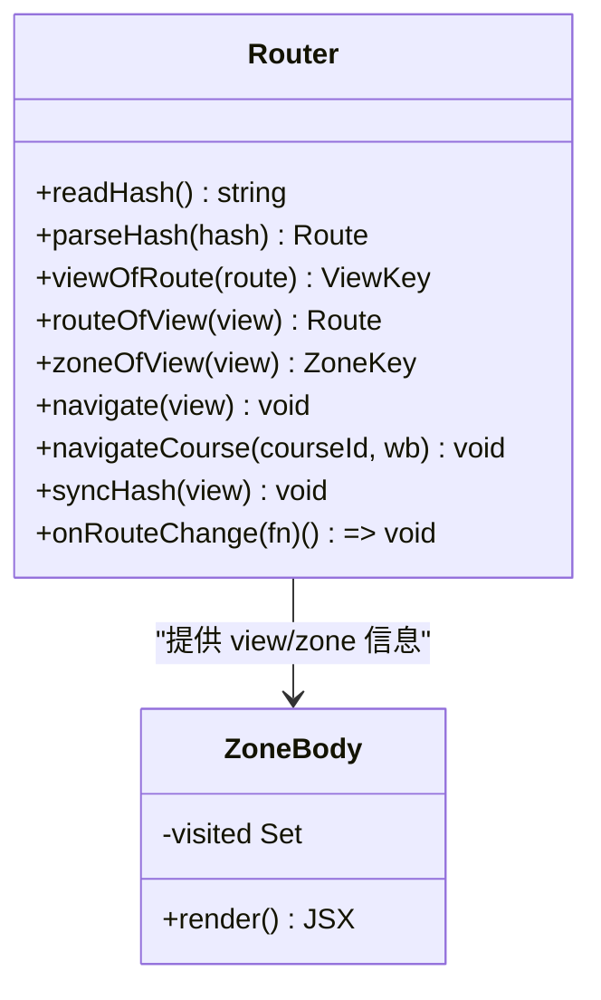
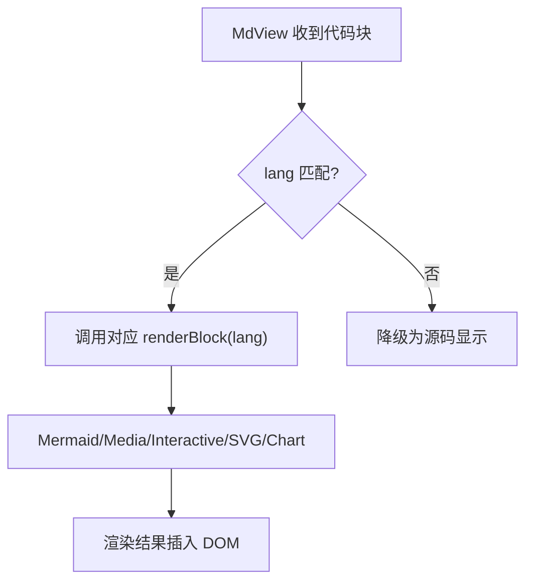
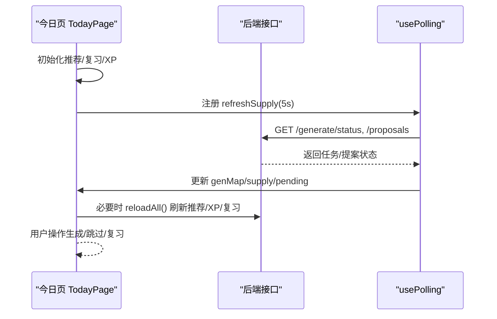
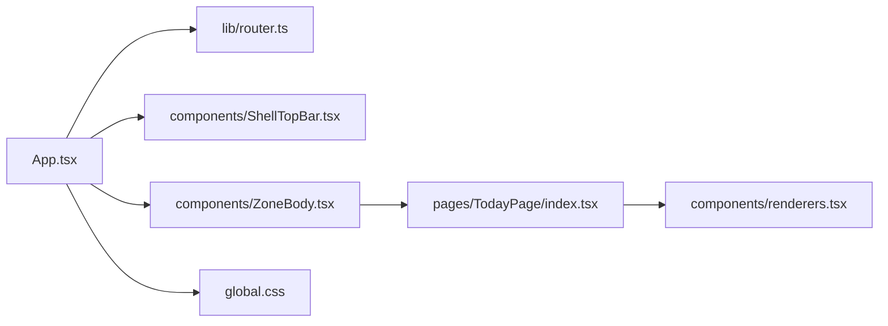

# UI 组件库使用

<cite>
**本文引用的文件**
- [main.tsx](file://ui/src/main.tsx)
- [App.tsx](file://ui/src/App.tsx)
- [package.json](file://ui/package.json)
- [vite.config.ts](file://ui/vite.config.ts)
- [global.css](file://ui/src/global.css)
- [router.ts](file://ui/src/lib/router.ts)
- [ShellTopBar.tsx](file://ui/src/components/ShellTopBar.tsx)
- [ZoneBody.tsx](file://ui/src/components/ZoneBody.tsx)
- [renderers.tsx](file://ui/src/components/renderers.tsx)
- [TodayPage/index.tsx](file://ui/src/pages/TodayPage/index.tsx)
</cite>

## 目录
1. [简介](#简介)
2. [项目结构](#项目结构)
3. [核心组件](#核心组件)
4. [架构总览](#架构总览)
5. [详细组件分析](#详细组件分析)
6. [依赖关系分析](#依赖关系分析)
7. [性能考虑](#性能考虑)
8. [故障排查指南](#故障排查指南)
9. [结论](#结论)
10. [附录](#附录)

## 简介
本文件面向 LearnHub 前端 UI 组件库的使用与集成，围绕基于 Arco Design 的集成规范、主题定制与样式覆盖、自定义组件开发规范、响应式设计与可访问性支持、以及最佳实践（性能优化、内存管理与兼容性）进行系统化说明。文档以仓库中的实际实现为依据，提供代码级图示与引用路径，便于快速定位与落地。

## 项目结构
LearnHub 面板 UI 采用 Vite + React 工程组织，入口在 ui/src/main.tsx，应用根为 App.tsx；页面按功能分区存放于 pages，通用组件位于 components，路由与工具逻辑集中在 lib，全局样式集中于 global.css。构建产物输出到 ../web/dist，并通过 base: './' 适配宿主前缀部署。

图表来源
- [main.tsx:1-16](file://ui/src/main.tsx#L1-L16)
- [App.tsx:1-180](file://ui/src/App.tsx#L1-L180)
- [ShellTopBar.tsx:1-64](file://ui/src/components/ShellTopBar.tsx#L1-L64)
- [ZoneBody.tsx:1-43](file://ui/src/components/ZoneBody.tsx#L1-L43)
- [TodayPage/index.tsx:1-287](file://ui/src/pages/TodayPage/index.tsx#L1-L287)
- [router.ts:1-164](file://ui/src/lib/router.ts#L1-L164)
- [global.css:1-398](file://ui/src/global.css#L1-L398)

章节来源
- [main.tsx:1-16](file://ui/src/main.tsx#L1-L16)
- [vite.config.ts:1-15](file://ui/vite.config.ts#L1-L15)
- [package.json:1-48](file://ui/package.json#L1-L48)

## 核心组件
- 应用壳层：App.tsx 负责初始化数据、主题切换、路由同步、错误态与空态处理，并向下传递 frame 上下文。
- 壳顶栏：ShellTopBar.tsx 提供五区导航、课程区子导航、帮助抽屉入口与主题切换按钮，遵循 Arco Tabs 与 Tooltip。
- 视图容器：ZoneBody.tsx 实现“首访保活”策略，已访问视图常驻 DOM，非激活隐藏，配合 active-tab 信号控制轮询。
- 内容渲染：renderers.tsx 注册代码块渲染器（Mermaid、媒体、交互 iframe、SVG、图表），并与共享清单对账。
- 今日页：TodayPage/index.tsx 聚合推荐流、复习队列、供给快照与生成任务轮询，驱动学习会话与后台任务提示。

章节来源
- [App.tsx:1-180](file://ui/src/App.tsx#L1-L180)
- [ShellTopBar.tsx:1-64](file://ui/src/components/ShellTopBar.tsx#L1-L64)
- [ZoneBody.tsx:1-43](file://ui/src/components/ZoneBody.tsx#L1-L43)
- [renderers.tsx:1-166](file://ui/src/components/renderers.tsx#L1-L166)
- [TodayPage/index.tsx:1-287](file://ui/src/pages/TodayPage/index.tsx#L1-L287)

## 架构总览
下图展示从入口到页面渲染的关键调用链与数据流向，包括主题配置、路由同步、视图保活与轮询刷新。

图表来源
- [main.tsx:1-16](file://ui/src/main.tsx#L1-L16)
- [App.tsx:1-180](file://ui/src/App.tsx#L1-L180)
- [router.ts:1-164](file://ui/src/lib/router.ts#L1-L164)
- [ShellTopBar.tsx:1-64](file://ui/src/components/ShellTopBar.tsx#L1-L64)
- [ZoneBody.tsx:1-43](file://ui/src/components/ZoneBody.tsx#L1-L43)
- [TodayPage/index.tsx:1-287](file://ui/src/pages/TodayPage/index.tsx#L1-L287)

## 详细组件分析

### Arco Design 集成与主题定制
- 语言与主题：入口通过 ConfigProvider 注入中文语言包；App 中维护 light/dark 主题并写入 body.arco-theme，同时持久化至 localStorage。
- 样式覆盖：全局样式集中管理，优先消费 tokens（--lh-*），避免硬编码色值；通过语义类名统一风格。
- 资源与构建：Vite 构建输出到 ../web/dist，base 设为相对路径以适配宿主前缀。

图表来源
- [main.tsx:1-16](file://ui/src/main.tsx#L1-L16)
- [App.tsx:119-128](file://ui/src/App.tsx#L119-L128)
- [vite.config.ts:4-14](file://ui/vite.config.ts#L4-L14)

章节来源
- [main.tsx:1-16](file://ui/src/main.tsx#L1-L16)
- [App.tsx:119-128](file://ui/src/App.tsx#L119-L128)
- [vite.config.ts:1-15](file://ui/vite.config.ts#L1-L15)

### 路由与视图保活
- 路由协议：基于 location.hash 的极简路由，支持区键、课程区三入口与单课工作台参数段；提供 parseHash、navigate、navigateCourse、syncHash、onRouteChange 等能力。
- 视图键：将路由映射为保活/轮询口径的 ViewKey，工作台整体共享一个视图键，分栏切换不改视图键。
- 保活策略：ZoneBody 维护 visited 集合，首次访问后常驻，非激活隐藏，结合 active-tab 信号跳过隐藏视图的轮询。

图表来源
- [router.ts:1-164](file://ui/src/lib/router.ts#L1-L164)
- [ZoneBody.tsx:1-43](file://ui/src/components/ZoneBody.tsx#L1-L43)

章节来源
- [router.ts:1-164](file://ui/src/lib/router.ts#L1-L164)
- [ZoneBody.tsx:1-43](file://ui/src/components/ZoneBody.tsx#L1-L43)

### 内容渲染与扩展点
- 代码块渲染器：按 lang 分发到 Mermaid、媒体、交互 iframe、SVG、图表等渲染器；未注册降级源码显示。
- 交互协议：iframe 通过 postMessage 上报完成与标注，UI 侧在合适时机上报成绩并展示提示。
- 清单对账：与 shared 清单保持一致，构建期校验缺失实现。

图表来源
- [renderers.tsx:1-166](file://ui/src/components/renderers.tsx#L1-L166)

章节来源
- [renderers.tsx:1-166](file://ui/src/components/renderers.tsx#L1-L166)

### 今日页数据流与轮询
- 主数据：推荐流失败视为页面失败；XP/复习横幅/供给/闸门等次要数据失败按空处理。
- 轮询：usePolling 定时刷新供给快照与任务状态，检测活动任务边沿时重拉推荐流。
- 交互：支持快捷生成、跳过节点、挖错卡、定向复习等动作，完成后刷新相关数据。

图表来源
- [TodayPage/index.tsx:36-287](file://ui/src/pages/TodayPage/index.tsx#L36-L287)

章节来源
- [TodayPage/index.tsx:36-287](file://ui/src/pages/TodayPage/index.tsx#L36-L287)

### 响应式设计实现
- 布局与间距：通过语义类名（lh-*）与 CSS 变量（--lh-*）统一管理间距、字号、颜色与圆角，确保在不同尺寸下的一致性。
- 图容器高度：为 React Flow 容器设置视口高度兜底，避免画布塌缩导致 fitView 失效。
- 自适应排版：Markdown 正文限宽、媒体与图表允许横向滚动，保证可读性与可用性。

章节来源
- [global.css:1-398](file://ui/src/global.css#L1-L398)

### 可访问性支持
- 键盘导航：关键交互元素具备 tabindex 与 onKeyDown 处理（如悬浮指示条），支持 Enter 触发跳转。
- 屏幕阅读器：为图标与按钮提供 aria-label，子导航使用 role/tablist 与 role/tab，提升读屏体验。
- 语义化标记：合理使用标题层级、列表、表格与段落，增强结构化信息表达。

章节来源
- [ShellTopBar.tsx:38-59](file://ui/src/components/ShellTopBar.tsx#L38-L59)
- [TodayPage/index.tsx:272-283](file://ui/src/pages/TodayPage/index.tsx#L272-L283)

## 依赖关系分析
- 运行时依赖：React、Arco Design Web React、ECharts、Mermaid、KaTeX、Mafs、MathJS 等用于可视化与数学渲染。
- 构建依赖：Vite、TypeScript、ESLint、Testing Library 等用于开发与测试。
- 模块耦合：App 依赖 router、components、hooks；ZoneBody 聚合页面；TodayPage 聚合业务逻辑与轮询。

图表来源
- [App.tsx:1-180](file://ui/src/App.tsx#L1-L180)
- [router.ts:1-164](file://ui/src/lib/router.ts#L1-L164)
- [ShellTopBar.tsx:1-64](file://ui/src/components/ShellTopBar.tsx#L1-L64)
- [ZoneBody.tsx:1-43](file://ui/src/components/ZoneBody.tsx#L1-L43)
- [TodayPage/index.tsx:1-287](file://ui/src/pages/TodayPage/index.tsx#L1-L287)
- [renderers.tsx:1-166](file://ui/src/components/renderers.tsx#L1-L166)
- [global.css:1-398](file://ui/src/global.css#L1-L398)

章节来源
- [package.json:1-48](file://ui/package.json#L1-L48)

## 性能考虑
- 按需加载与树摇：Arco 图标与组件按需导入，减少打包体积；Mermaid 动态 import 降低首屏开销。
- 视图保活与轮询节流：ZoneBody 保活已访问视图，结合 active-tab 信号让隐藏视图跳过轮询，减少无效请求。
- 数据分层：主数据失败影响页面，次要数据失败降级为空，避免单点故障放大。
- 构建优化：chunkSizeWarningLimit 限制分包大小，base 相对路径减少资源路径问题。

[本节为通用指导，不直接分析具体文件]

## 故障排查指南
- 主题不生效：检查 body.arco-theme 是否正确设置，确认 theme 状态与 localStorage 一致性。
- 路由异常：核对当前 hash 与期望视图是否一致，必要时调用 syncHash 规范化；工作台跳转需使用 navigateCourse。
- 内容渲染失败：确认代码块 lang 是否在共享清单中注册，并在 renderers 中有对应实现；Mermaid 渲染失败会降级源码显示。
- 轮询无更新：检查 usePolling 的 tab 标识与 intervalMs；确认 refreshSupply 回调内网络请求成功且边沿检测正确。

章节来源
- [App.tsx:119-128](file://ui/src/App.tsx#L119-L128)
- [router.ts:134-164](file://ui/src/lib/router.ts#L134-L164)
- [renderers.tsx:17-41](file://ui/src/components/renderers.tsx#L17-L41)
- [TodayPage/index.tsx:74-118](file://ui/src/pages/TodayPage/index.tsx#L74-L118)

## 结论
LearnHub 前端 UI 以 Arco Design 为基础，通过集中化的主题与样式体系、稳健的路由与视图保活机制、可扩展的内容渲染器与严格的清单对账，实现了高可用、易维护的前端面板。遵循本文档的集成规范与最佳实践，可在保证性能与可访问性的前提下高效扩展新组件与页面。

[本节为总结，不直接分析具体文件]

## 附录
- 常用命令与脚本：dev/build/typecheck/lint 见 package.json scripts。
- 构建输出：../web/dist，部署时注意 base 与静态资源路径。
- 类型来源：UI 类型来自引擎视图与命令注册表派生，避免手工镜像。

章节来源
- [package.json:6-11](file://ui/package.json#L6-L11)
- [vite.config.ts:4-14](file://ui/vite.config.ts#L4-L14)