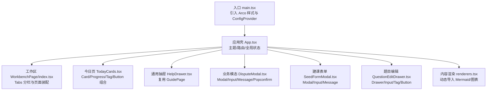
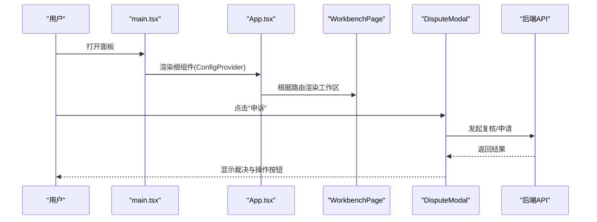
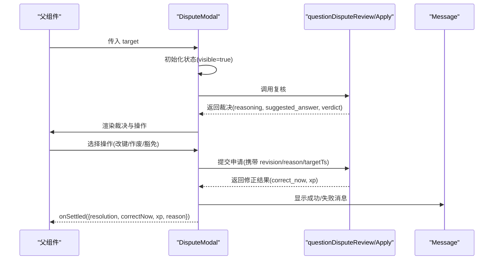
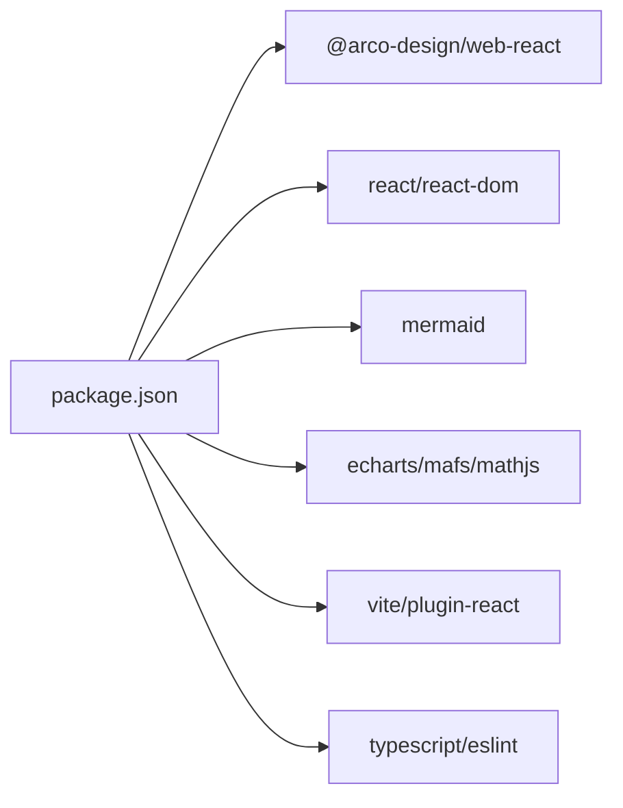

# 基础组件使用

<cite>
**本文引用的文件**
- [ui/package.json](file://ui/package.json)
- [ui/src/main.tsx](file://ui/src/main.tsx)
- [ui/src/App.tsx](file://ui/src/App.tsx)
- [ui/src/components/DisputeModal.tsx](file://ui/src/components/DisputeModal.tsx)
- [ui/src/components/SeedFormModal.tsx](file://ui/src/components/SeedFormModal.tsx)
- [ui/src/components/QuestionEditDrawer.tsx](file://ui/src/components/QuestionEditDrawer.tsx)
- [ui/src/components/HelpDrawer.tsx](file://ui/src/components/HelpDrawer.tsx)
- [ui/src/pages/WorkbenchPage/index.tsx](file://ui/src/pages/WorkbenchPage/index.tsx)
- [ui/src/pages/TodayPage/TodayCards.tsx](file://ui/src/pages/TodayPage/TodayCards.tsx)
- [ui/src/components/renderers.tsx](file://ui/src/components/renderers.tsx)
</cite>

## 目录
1. [简介](#简介)
2. [项目结构](#项目结构)
3. [核心组件](#核心组件)
4. [架构总览](#架构总览)
5. [详细组件分析](#详细组件分析)
6. [依赖分析](#依赖分析)
7. [性能考虑](#性能考虑)
8. [故障排查指南](#故障排查指南)
9. [结论](#结论)
10. [附录](#附录)

## 简介
本文件面向 LearnHub 前端面板，系统化说明 Arco Design 组件库的集成与基础用法，并基于仓库中的实际组件实现，总结自定义业务组件的接口设计、Props 类型定义、事件处理机制与组合模式。文档同时给出可操作的示例路径（以“代码片段路径”形式），帮助读者快速定位到真实实现，理解属性配置、事件绑定与状态管理方式，并提供懒加载、虚拟滚动与内存管理等优化建议。

## 项目结构
LearnHub 的前端位于 ui 子工程，采用 Vite + React 构建，通过 package.json 引入 @arco-design/web-react，并在入口文件中全局注册中文语言包与主题变量。页面级路由与视图由 App 统一编排，各功能模块以抽屉、模态、卡片等复合组件形式组织。

图示来源
- [ui/src/main.tsx:1-16](file://ui/src/main.tsx#L1-L16)
- [ui/src/App.tsx:1-180](file://ui/src/App.tsx#L1-L180)
- [ui/src/pages/WorkbenchPage/index.tsx:1-85](file://ui/src/pages/WorkbenchPage/index.tsx#L1-L85)
- [ui/src/pages/TodayPage/TodayCards.tsx:1-232](file://ui/src/pages/TodayPage/TodayCards.tsx#L1-L232)
- [ui/src/components/HelpDrawer.tsx:1-14](file://ui/src/components/HelpDrawer.tsx#L1-L14)
- [ui/src/components/DisputeModal.tsx:1-210](file://ui/src/components/DisputeModal.tsx#L1-L210)
- [ui/src/components/SeedFormModal.tsx:1-62](file://ui/src/components/SeedFormModal.tsx#L1-L62)
- [ui/src/components/QuestionEditDrawer.tsx:1-103](file://ui/src/components/QuestionEditDrawer.tsx#L1-L103)
- [ui/src/components/renderers.tsx:1-166](file://ui/src/components/renderers.tsx#L1-L166)

章节来源
- [ui/package.json:1-48](file://ui/package.json#L1-L48)
- [ui/src/main.tsx:1-16](file://ui/src/main.tsx#L1-L16)
- [ui/src/App.tsx:1-180](file://ui/src/App.tsx#L1-L180)

## 核心组件
本节聚焦 Arco Design 在 LearnHub 中的常用组件：Button、Input、Table（以 Tabs 替代）、Modal、Drawer、Message、Tag、Progress、Result、Spin、Empty、Typography、Tooltip、Popconfirm、Space、Card。以下按“组件—用途—关键属性/事件—示例路径”的方式说明。

- Button
  - 用途：触发操作、提交表单、确认/取消等。
  - 关键属性/事件：type/status/size/loading/onClick；常与 Popconfirm/Message 配合。
  - 示例路径：[App.tsx:130-175](file://ui/src/App.tsx#L130-L175)、[TodayCards.tsx:64-70](file://ui/src/pages/TodayPage/TodayCards.tsx#L64-L70)、[DisputeModal.tsx:167-173](file://ui/src/components/DisputeModal.tsx#L167-L173)

- Input / Input.TextArea
  - 用途：文本输入、多行备注、搜索过滤。
  - 关键属性/事件：value/onChange/placeholder/autoSize；结合 Message 做即时反馈。
  - 示例路径：[SeedFormModal.tsx:52-54](file://ui/src/components/SeedFormModal.tsx#L52-L54)、[DisputeModal.tsx:122-125](file://ui/src/components/DisputeModal.tsx#L122-L125)、[QuestionEditDrawer.tsx:88-90](file://ui/src/components/QuestionEditDrawer.tsx#L88-L90)

- Table（以 Tabs 承载列表）
  - 用途：工作台分栏、页面切换；复杂表格场景可在后续扩展。
  - 关键属性/事件：activeTab/type/size/onChange；用于切换不同数据视图。
  - 示例路径：[WorkbenchPage/index.tsx:74-76](file://ui/src/pages/WorkbenchPage/index.tsx#L74-L76)

- Modal
  - 用途：弹窗表单、申诉流程、确认对话框。
  - 关键属性/事件：visible/onCancel/onOk/okText/confirmLoading/unmountOnExit/footer。
  - 示例路径：[SeedFormModal.tsx:42-50](file://ui/src/components/SeedFormModal.tsx#L42-L50)、[DisputeModal.tsx:114-120](file://ui/src/components/DisputeModal.tsx#L114-L120)

- Drawer
  - 用途：侧边编辑面板、帮助文档。
  - 关键属性/事件：visible/onCancel/width/footer/title/unmountOnExit。
  - 示例路径：[QuestionEditDrawer.tsx:68-69](file://ui/src/components/QuestionEditDrawer.tsx#L68-L69)、[HelpDrawer.tsx:8-10](file://ui/src/components/HelpDrawer.tsx#L8-L10)

- Message
  - 用途：成功/失败/提示消息，异步操作反馈。
  - 示例路径：[SeedFormModal.tsx:27-35](file://ui/src/components/SeedFormModal.tsx#L27-L35)、[DisputeModal.tsx:95-106](file://ui/src/components/DisputeModal.tsx#L95-L106)、[QuestionEditDrawer.tsx:57-62](file://ui/src/components/QuestionEditDrawer.tsx#L57-L62)

- Tag / Progress / Card / Typography / Tooltip / Popconfirm / Space / Result / Spin / Empty
  - 用途：状态标识、进度展示、信息卡片、排版、二次确认、布局、空态与错误态。
  - 示例路径：[TodayCards.tsx:17-36](file://ui/src/pages/TodayPage/TodayCards.tsx#L17-L36)、[App.tsx:130-175](file://ui/src/App.tsx#L130-L175)、[DisputeModal.tsx:148-153](file://ui/src/components/DisputeModal.tsx#L148-L153)

章节来源
- [ui/src/components/SeedFormModal.tsx:1-62](file://ui/src/components/SeedFormModal.tsx#L1-L62)
- [ui/src/components/DisputeModal.tsx:1-210](file://ui/src/components/DisputeModal.tsx#L1-L210)
- [ui/src/components/QuestionEditDrawer.tsx:1-103](file://ui/src/components/QuestionEditDrawer.tsx#L1-L103)
- [ui/src/pages/WorkbenchPage/index.tsx:1-85](file://ui/src/pages/WorkbenchPage/index.tsx#L1-L85)
- [ui/src/pages/TodayPage/TodayCards.tsx:1-232](file://ui/src/pages/TodayPage/TodayCards.tsx#L1-L232)
- [ui/src/components/HelpDrawer.tsx:1-14](file://ui/src/components/HelpDrawer.tsx#L1-L14)
- [ui/src/App.tsx:1-180](file://ui/src/App.tsx#L1-L180)

## 架构总览
Arco Design 在 LearnHub 中通过入口文件注入样式与国际化，App 作为根容器管理主题与路由，页面级组件以“抽屉/模态/卡片/标签页”等组合形态呈现业务逻辑。内容渲染层通过动态导入与渲染器注册表按需加载第三方库（如 Mermaid）。

图示来源
- [ui/src/main.tsx:1-16](file://ui/src/main.tsx#L1-L16)
- [ui/src/App.tsx:1-180](file://ui/src/App.tsx#L1-L180)
- [ui/src/pages/WorkbenchPage/index.tsx:1-85](file://ui/src/pages/WorkbenchPage/index.tsx#L1-L85)
- [ui/src/components/DisputeModal.tsx:1-210](file://ui/src/components/DisputeModal.tsx#L1-L210)

## 详细组件分析

### 模态框：题目申诉 DisputeModal
- 职责：封装“题目有误”的申诉流程，包含理由输入、AI 复核、裁决展示与后续动作（改键/作废/豁免）。
- Props 与事件
  - target：目标题信息（课程、节点、qid、题型）
  - onClose：关闭回调
  - onSettled：结算后回调（含裁决、XP 净值、理由）
- 状态与流程
  - 可见性控制 visible = !!target
  - 自动触发 runReview 进行 LLM 复核，支持重试与降级（跳过复核直接豁免）
  - 根据 verdict 分支渲染不同操作按钮
- 交互时序

图示来源
- [ui/src/components/DisputeModal.tsx:39-110](file://ui/src/components/DisputeModal.tsx#L39-L110)
- [ui/src/components/DisputeModal.tsx:114-203](file://ui/src/components/DisputeModal.tsx#L114-L203)

章节来源
- [ui/src/components/DisputeModal.tsx:1-210](file://ui/src/components/DisputeModal.tsx#L1-L210)

### 模态框：新建课程 SeedFormModal
- 职责：收集课程名并创建课程，不自动开始生成。
- Props 与事件
  - visible：控制显隐
  - course：预填值（编辑场景）
  - onCancel：关闭
  - onCreated：创建成功后回调
- 关键点
  - 非空校验与 loading 控制
  - 成功后 Message 提示并关闭

章节来源
- [ui/src/components/SeedFormModal.tsx:1-62](file://ui/src/components/SeedFormModal.tsx#L1-L62)

### 抽屉：题目编辑 QuestionEditDrawer
- 职责：单题编辑面板，题库与会话内菜单共用。
- Props 与事件
  - target：最小编辑目标（course/node/qid/kind/q/difficulty/options）
  - onClose：关闭
  - onSaved：保存成功回调
- 关键点
  - 答案留空表示不修改；不同题型对 answer 格式有特定解析
  - 难度选择以 Button 组实现

章节来源
- [ui/src/components/QuestionEditDrawer.tsx:1-103](file://ui/src/components/QuestionEditDrawer.tsx#L1-L103)

### 抽屉：帮助 HelpDrawer
- 职责：将能力指南从独立页签改为抽屉，减少占用。
- 关键点
  - 宽度自适应，footer 为空，内容复用 GuidePage

章节来源
- [ui/src/components/HelpDrawer.tsx:1-14](file://ui/src/components/HelpDrawer.tsx#L1-L14)

### 工作区：WorkbenchPage（Tabs 分栏）
- 职责：单课工作台，首屏为罗盘与图，分栏包括教练台、队列、提案、题库。
- 关键点
  - 使用 Tabs 承载分栏切换，activeTab 与 openCourse 联动
  - 轮询生成任务状态，按 phase 过滤当前课程的任务

章节来源
- [ui/src/pages/WorkbenchPage/index.tsx:1-85](file://ui/src/pages/WorkbenchPage/index.tsx#L1-L85)

### 今日页：TodayCards（Card/Progress/Tag/Tooltip/Popconfirm）
- 职责：XP 账本条、复习横幅、推荐流大卡。
- 关键点
  - Progress 圆形进度展示 XP 完成度
  - Tag 标注类型/状态，Tooltip 提供辅助说明
  - Popconfirm 二次确认危险操作（如重写某节）

章节来源
- [ui/src/pages/TodayPage/TodayCards.tsx:1-232](file://ui/src/pages/TodayPage/TodayCards.tsx#L1-L232)

### 内容渲染：renderers（动态导入与渲染器注册表）
- 职责：按代码块语言分发渲染器，未注册时降级源码显示；Mermaid 动态导入并跟随主题。
- 关键点
  - 动态 import('mermaid') 实现懒加载
  - 渲染器清单与 shared 清单一致性校验

章节来源
- [ui/src/components/renderers.tsx:1-166](file://ui/src/components/renderers.tsx#L1-L166)

## 依赖分析
- 运行时依赖
  - @arco-design/web-react：UI 组件库与样式
  - react/react-dom：框架
  - mermaid：流程图/架构图渲染（懒加载）
  - echarts/mafs/mathjs：可视化与数学计算（按需使用）
- 构建与开发
  - vite/@vitejs/plugin-react：构建与热更新
  - typescript/eslint：类型检查与代码规范

图示来源
- [ui/package.json:1-48](file://ui/package.json#L1-L48)

章节来源
- [ui/package.json:1-48](file://ui/package.json#L1-L48)

## 性能考虑
- 懒加载
  - 使用动态 import 加载重型库（如 mermaid），仅在需要时执行，降低首屏体积与启动时间。
  - 参考路径：[renderers.tsx:22-35](file://ui/src/components/renderers.tsx#L22-L35)
- 虚拟滚动
  - 当列表项较多时，建议使用虚拟化方案（如 react-window/virtual-list）或分页/无限滚动，避免一次性渲染大量 DOM。
  - 当前仓库未内置虚拟滚动，可在列表组件处按需引入。
- 内存管理
  - 使用 unmountOnExit 确保 Modal/Drawer 卸载时清理内部资源，避免残留监听器与定时器。
  - 参考路径：[DisputeModal.tsx:114-120](file://ui/src/components/DisputeModal.tsx#L114-L120)、[QuestionEditDrawer.tsx:68-69](file://ui/src/components/QuestionEditDrawer.tsx#L68-L69)
- 事件与副作用清理
  - 在 useEffect 中返回清理函数，移除 message 监听、定时器与中断标志，防止内存泄漏。
  - 参考路径：[renderers.tsx:82-109](file://ui/src/components/renderers.tsx#L82-L109)
- 主题与样式
  - 通过 ConfigProvider 设置 locale，避免全量 locale 包；主题通过 arco-theme 属性切换，减少重绘成本。
  - 参考路径：[main.tsx:7-15](file://ui/src/main.tsx#L7-L15)、[App.tsx:119-128](file://ui/src/App.tsx#L119-L128)

## 故障排查指南
- 模态/抽屉不关闭或重复触发
  - 检查 visible 是否受控于父组件状态；确认 onClose 正确传递且无竞态。
  - 参考路径：[DisputeModal.tsx:73-83](file://ui/src/components/DisputeModal.tsx#L73-L83)
- 异步操作无反馈
  - 确保 Message.success/error 在 try/catch 分支中调用；loading 状态在 finally 中重置。
  - 参考路径：[SeedFormModal.tsx:26-39](file://ui/src/components/SeedFormModal.tsx#L26-L39)、[DisputeModal.tsx:85-110](file://ui/src/components/DisputeModal.tsx#L85-L110)
- 主题/语言不生效
  - 确认入口已引入 arco.css 与 zh-CN locale；body 上 arco-theme 是否正确设置。
  - 参考路径：[main.tsx:1-15](file://ui/src/main.tsx#L1-L15)、[App.tsx:119-128](file://ui/src/App.tsx#L119-L128)
- 内容渲染失败
  - 检查渲染器是否在 BLOCK_RENDERERS 中注册；未注册时降级源码显示。
  - 参考路径：[renderers.tsx:142-155](file://ui/src/components/renderers.tsx#L142-L155)

章节来源
- [ui/src/components/DisputeModal.tsx:73-110](file://ui/src/components/DisputeModal.tsx#L73-L110)
- [ui/src/components/SeedFormModal.tsx:26-39](file://ui/src/components/SeedFormModal.tsx#L26-L39)
- [ui/src/main.tsx:1-15](file://ui/src/main.tsx#L1-L15)
- [ui/src/App.tsx:119-128](file://ui/src/App.tsx#L119-L128)
- [ui/src/components/renderers.tsx:142-155](file://ui/src/components/renderers.tsx#L142-L155)

## 结论
LearnHub 在前端层面以 Arco Design 为基础，通过 App 统一管理主题与路由，使用 Modal/Drawer/Tabs/Card 等组件构建丰富的业务界面。组件遵循受控状态、明确 Props 与事件契约、以及良好的副作用清理实践。通过动态导入与渲染器注册表，实现了内容的按需加载与可扩展性。建议在大数据列表场景中引入虚拟滚动，进一步优化长列表性能。

## 附录
- 组件使用速查（示例路径）
  - Button：[App.tsx:130-175](file://ui/src/App.tsx#L130-L175)、[TodayCards.tsx:64-70](file://ui/src/pages/TodayPage/TodayCards.tsx#L64-L70)
  - Input：[SeedFormModal.tsx:52-54](file://ui/src/components/SeedFormModal.tsx#L52-L54)、[DisputeModal.tsx:122-125](file://ui/src/components/DisputeModal.tsx#L122-L125)
  - Tabs（替代 Table 的分栏）：[WorkbenchPage/index.tsx:74-76](file://ui/src/pages/WorkbenchPage/index.tsx#L74-L76)
  - Modal：[SeedFormModal.tsx:42-50](file://ui/src/components/SeedFormModal.tsx#L42-L50)、[DisputeModal.tsx:114-120](file://ui/src/components/DisputeModal.tsx#L114-L120)
  - Drawer：[QuestionEditDrawer.tsx:68-69](file://ui/src/components/QuestionEditDrawer.tsx#L68-L69)、[HelpDrawer.tsx:8-10](file://ui/src/components/HelpDrawer.tsx#L8-L10)
  - Message：[SeedFormModal.tsx:27-35](file://ui/src/components/SeedFormModal.tsx#L27-L35)、[DisputeModal.tsx:95-106](file://ui/src/components/DisputeModal.tsx#L95-L106)
  - Tag/Progress/Card/Typography/Tooltip/Popconfirm/Space/Result/Spin/Empty：[TodayCards.tsx:17-36](file://ui/src/pages/TodayPage/TodayCards.tsx#L17-L36)、[App.tsx:130-175](file://ui/src/App.tsx#L130-L175)
- 自定义组件接口设计要点
  - 明确 Props 类型（如 DisputeTarget、QuestionEditTarget）
  - 事件命名清晰（onClose/onSettled/onSaved/onCreated）
  - 受控可见性与 loading 状态
  - 错误处理与降级策略（如 AI 复核不可用时的豁免入口）
- 组合模式与插槽
  - 通过 Space/Direction 组合多个子元素
  - 使用条件渲染与嵌套组件实现复合 UI（如卡片内嵌 Tag/Tooltip/Popconfirm）
- 性能优化清单
  - 懒加载重型库（mermaid）
  - 使用 unmountOnExit 释放资源
  - 清理事件监听与定时器
  - 主题切换避免重绘过多节点
  - 大数据列表引入虚拟滚动