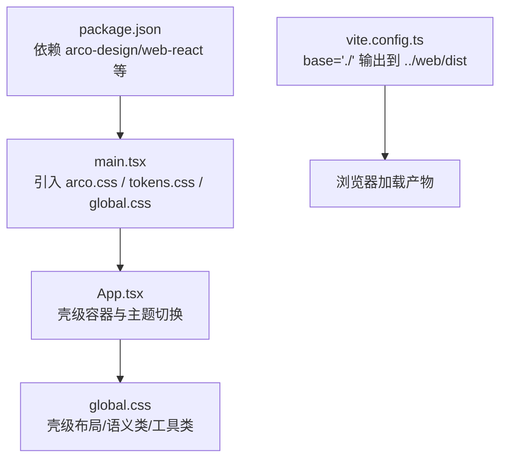
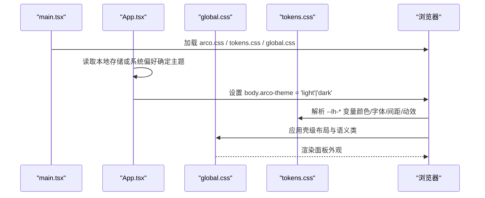
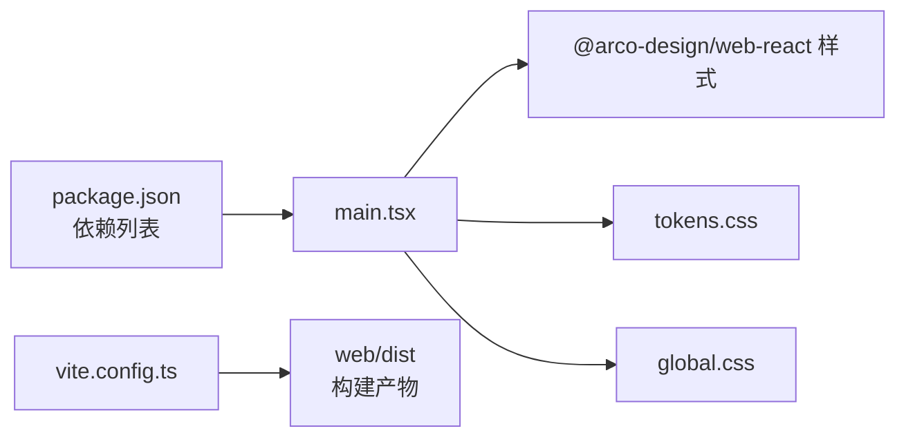

# 样式与主题管理

<cite>
**本文引用的文件**
- [ui/src/global.css](file://ui/src/global.css)
- [ui/src/main.tsx](file://ui/src/main.tsx)
- [ui/src/App.tsx](file://ui/src/App.tsx)
- [ui/vite.config.ts](file://ui/vite.config.ts)
- [ui/package.json](file://ui/package.json)
</cite>

## 目录
1. [简介](#简介)
2. [项目结构](#项目结构)
3. [核心组件](#核心组件)
4. [架构总览](#架构总览)
5. [详细组件分析](#详细组件分析)
6. [依赖关系分析](#依赖关系分析)
7. [性能考量](#性能考量)
8. [故障排查指南](#故障排查指南)
9. [结论](#结论)
10. [附录：样式开发规范与示例](#附录样式开发规范与示例)

## 简介
本文件面向 LearnHub 面板的样式与主题管理，系统性说明全局样式组织、组件样式隔离与复用策略、主题定制方案（颜色系统、字体与间距）、响应式实现方式、样式性能优化以及开发规范。目标是帮助开发者在不破坏现有视觉纪律的前提下，安全地扩展与定制样式。

## 项目结构
LearnHub 面板的前端位于 ui 子工程，采用 Vite + React 构建。样式入口由 main.tsx 引入 Arco Design 基础样式与 tokens 层，再由 App 渲染壳级布局；全局样式集中在 global.css，提供壳级布局、语义类与工具类。构建产物输出到 web/dist，资源以相对路径引用，便于宿主环境托管。

图示来源
- [ui/src/main.tsx:1-16](file://ui/src/main.tsx#L1-L16)
- [ui/src/App.tsx:120-128](file://ui/src/App.tsx#L120-L128)
- [ui/vite.config.ts:4-14](file://ui/vite.config.ts#L4-L14)
- [ui/package.json:12-27](file://ui/package.json#L12-L27)

章节来源
- [ui/src/main.tsx:1-16](file://ui/src/main.tsx#L1-L16)
- [ui/vite.config.ts:4-14](file://ui/vite.config.ts#L4-L14)
- [ui/package.json:12-27](file://ui/package.json#L12-L27)

## 核心组件
- 样式入口与主题初始化
  - main.tsx 统一引入 Arco 样式、tokens 层与全局样式，并配置中文语言包。
  - App.tsx 维护亮/暗主题状态，写入 body 的 arco-theme 属性，持久化至 localStorage，并支持跟随系统偏好。
- 全局样式与语义类
  - global.css 定义壳级布局（app-shell、shell-topbar、app-body）、页面内容排版（md-body）以及大量语义类（lh-*），所有静态样式通过语义类与工具类表达，避免内联样式滥用。
- 构建与资源路径
  - vite.config.ts 设置 base 为相对路径，构建产物输出到 web/dist，确保在宿主前缀下正确加载资源。

章节来源
- [ui/src/main.tsx:1-16](file://ui/src/main.tsx#L1-L16)
- [ui/src/App.tsx:120-128](file://ui/src/App.tsx#L120-L128)
- [ui/src/global.css:1-76](file://ui/src/global.css#L1-L76)
- [ui/vite.config.ts:4-14](file://ui/vite.config.ts#L4-L14)

## 架构总览
面板样式遵循“壳级规则仅消费 tokens”的设计原则：硬编码色值只允许存在于 token 层，组件与页面通过 --lh-* 变量消费主题能力。语义类层（lh-*）承担角色命名与尺度工具，保证样式可复用且易审计。

图示来源
- [ui/src/main.tsx:1-16](file://ui/src/main.tsx#L1-L16)
- [ui/src/App.tsx:120-128](file://ui/src/App.tsx#L120-L128)
- [ui/src/global.css:1-76](file://ui/src/global.css#L1-L76)

## 详细组件分析

### 全局样式与主题层
- 壳级容器
  - app-shell 使用 flex 纵向布局，背景与边框来自 --lh-bg、--lh-border，过渡动画使用 --lh-motion-fast。
  - shell-topbar 包含五区页签、课程子导航与右侧控制区，子导航项使用 --lh-font-md、--lh-text-muted 与 --lh-accent 高亮。
  - app-body 作为主内容区，默认带内边距，特定视图可移除内边距。
- 内容排版
  - md-body 定义阅读型内容的字号、行高、标题层级、代码块、表格、图片与公式容器的排版约束，确保可读性与一致性。
- 语义类与工具类
  - lh-* 语义类按角色命名（如 lh-muted、lh-quote、lh-card），工具类按值命名（如 lh-t-12、lh-gap-8、lh-w-160），全部基于 --lh-* 变量声明，避免硬编码。
  - 注释明确迁移纪律：静态样式一律走语义类，动态值才允许内联。

章节来源
- [ui/src/global.css:1-186](file://ui/src/global.css#L1-L186)
- [ui/src/global.css:196-398](file://ui/src/global.css#L196-L398)

### 主题定制方案
- 颜色系统
  - 通过 --lh-bg、--lh-border、--lh-text、--lh-text-muted、--lh-accent 等变量驱动壳级与组件外观；md-body 中的文本与背景也优先使用 --color-* 系列变量，保持与主题一致。
- 字体规范
  - 字号通过 --lh-font-* 变量（如 --lh-font-xs、--lh-font-sm、--lh-font-lg、--lh-font-xl）与 lh-t-* 工具类组合使用，标题层级与正文形成清晰对比。
- 间距标准
  - 间距通过 --lh-space-* 变量（如 --lh-space-1..6）与 lh-gap-*、lh-mt-*/lh-mb-* 等工具类统一控制，保证布局节奏一致。
- 动效与圆角
  - 过渡时长使用 --lh-motion-fast；圆角使用 --lh-radius-*，卡片与按钮保持一致的视觉语言。

章节来源
- [ui/src/global.css:1-76](file://ui/src/global.css#L1-L76)
- [ui/src/global.css:206-398](file://ui/src/global.css#L206-L398)

### 组件样式隔离与复用策略
- 隔离策略
  - 壳级样式限定在 app-shell、shell-*、app-body 等容器类上，不污染页面内容；内容排版集中在 md-body，避免与业务组件样式耦合。
- 复用策略
  - 语义类（lh-*）承载通用角色样式（提示框、引用、卡片、网格等），工具类（lh-gap-*、lh-w-*、lh-h-*）承载尺寸与布局原子能力，跨组件复用。
- 内联样式纪律
  - 仅保留动态值（如进度条宽度、数据驱动的着色），静态样式必须迁移到语义类，便于审计与主题切换。

章节来源
- [ui/src/global.css:196-398](file://ui/src/global.css#L196-L398)

### 响应式设计实现
- 断点与布局调整
  - 当前全局样式未显式定义媒体查询断点；布局主要依靠 Flexbox/Grid 与自适应网格（如 lh-grid-cards、lh-grid-stats）在不同视口下自动换行与重排。
- 移动端适配
  - 通过 gap、wrap、minmax 等特性实现弹性布局；对于需要固定高度的图表容器（如 dag-wrap），使用视口高度计算确保画布可用。
- 建议
  - 若需更精细的断点控制，可在 global.css 中补充 @media 查询，结合 lh-* 工具类快速调整间距与字号。

章节来源
- [ui/src/global.css:91-132](file://ui/src/global.css#L91-L132)
- [ui/src/global.css:371-377](file://ui/src/global.css#L371-L377)

### 样式性能优化
- CSS 模块化
  - 将主题变量集中到 tokens 层，全局样式集中在 global.css，减少重复声明与选择器复杂度。
- 按需加载
  - main.tsx 仅引入必要的 Arco 语言包与样式；Vite 构建时按模块拆分，避免全量引入。
- 缓存策略
  - 构建产物输出到 web/dist，配合宿主服务器开启静态资源缓存；相对路径 base 确保资源引用稳定。

章节来源
- [ui/src/main.tsx:1-16](file://ui/src/main.tsx#L1-L16)
- [ui/vite.config.ts:4-14](file://ui/vite.config.ts#L4-L14)
- [ui/package.json:12-27](file://ui/package.json#L12-L27)

## 依赖关系分析
- 运行时依赖
  - Arco Design 提供基础 UI 与主题变量；React 负责组件渲染；Markdown/KaTeX/Mermaid 等用于内容渲染。
- 样式依赖链
  - main.tsx → arco.css → tokens.css → global.css → 组件类名（lh-*）。
- 构建依赖
  - Vite 插件 react 处理 JSX/TSX；构建输出到 web/dist，供宿主服务。

图示来源
- [ui/package.json:12-27](file://ui/package.json#L12-L27)
- [ui/src/main.tsx:1-16](file://ui/src/main.tsx#L1-L16)
- [ui/vite.config.ts:4-14](file://ui/vite.config.ts#L4-L14)

章节来源
- [ui/package.json:12-27](file://ui/package.json#L12-L27)
- [ui/src/main.tsx:1-16](file://ui/src/main.tsx#L1-L16)
- [ui/vite.config.ts:4-14](file://ui/vite.config.ts#L4-L14)

## 性能考量
- 选择器与层叠
  - 尽量使用语义类与工具类，避免深层嵌套与复杂选择器，降低重绘压力。
- 变量与主题切换
  - 通过 CSS 变量切换主题，避免整表替换；过渡动画使用 --lh-motion-fast 提升体验。
- 资源体积
  - 仅引入必要语言包与样式；利用 Vite 的模块拆分与 tree-shaking 减少体积。

[本节为通用指导，无需具体文件引用]

## 故障排查指南
- 主题未生效
  - 检查 App.tsx 是否正确设置 body.arco-theme，并确认 localStorage 中 learnhub-theme 的值。
- 样式错乱
  - 确认 global.css 已引入，且壳级容器类（app-shell、shell-topbar、app-body）正确使用。
- 内容排版异常
  - 检查 md-body 是否包裹内容，标题与段落是否符合预期层级；代码块与公式容器是否具备滚动能力。
- 构建后资源 404
  - 核对 vite.config.ts 的 base 与 outDir，确保宿主路由映射到 web/dist。

章节来源
- [ui/src/App.tsx:120-128](file://ui/src/App.tsx#L120-L128)
- [ui/src/global.css:1-76](file://ui/src/global.css#L1-L76)
- [ui/vite.config.ts:4-14](file://ui/vite.config.ts#L4-L14)

## 结论
LearnHub 面板的样式体系以 tokens 层为核心，通过语义类与工具类实现样式隔离与复用；主题切换基于 CSS 变量与 Arco 主题机制，兼顾灵活性与一致性。构建流程简洁，资源路径稳定，便于宿主集成。后续可按需在 global.css 中补充断点与更多语义类，持续完善响应式与可访问性。

[本节为总结，无需具体文件引用]

## 附录：样式开发规范与示例

### 命名约定
- 语义类：lh-角色（如 lh-muted、lh-quote、lh-card）
- 工具类：lh-属性-值（如 lh-t-12、lh-gap-8、lh-w-160）
- 壳级类：app-*、shell-*（如 app-shell、shell-topbar）

章节来源
- [ui/src/global.css:196-398](file://ui/src/global.css#L196-L398)

### 注释标准
- 在关键区域添加注释说明用途与约束（如壳级规则仅消费 tokens、内容排版范围、迁移纪律）。
- 对新增语义类进行等价性核对，确保与迁移前的内联值一致。

章节来源
- [ui/src/global.css:1-10](file://ui/src/global.css#L1-L10)
- [ui/src/global.css:196-204](file://ui/src/global.css#L196-L204)

### 代码审查要点
- 禁止在组件中使用硬编码色值，应使用 --lh-* 或语义类。
- 动态值可使用内联样式，但静态样式必须迁移到语义类。
- 主题切换逻辑不得绕过 App.tsx 的主题设置。

章节来源
- [ui/src/global.css:196-204](file://ui/src/global.css#L196-L204)
- [ui/src/App.tsx:120-128](file://ui/src/App.tsx#L120-L128)

### 主题定制示例（步骤）
- 修改 tokens 层变量（如 --lh-bg、--lh-accent、--lh-font-*、--lh-space-*）以定义新主题。
- 在 App.tsx 中切换 arco-theme，并持久化用户选择。
- 使用 lh-* 语义类与工具类组合布局，确保在新主题下表现一致。

章节来源
- [ui/src/App.tsx:120-128](file://ui/src/App.tsx#L120-L128)
- [ui/src/global.css:1-76](file://ui/src/global.css#L1-L76)
- [ui/src/global.css:206-398](file://ui/src/global.css#L206-L398)

### 响应式布局示例（步骤）
- 使用 lh-grid-cards 或 lh-grid-stats 实现自适应网格。
- 对需要固定高度的图表容器，使用视口高度计算（如 calc(100vh - Npx)）确保画布可用。
- 如需断点控制，可在 global.css 中添加 @media 查询，结合 lh-* 工具类调整间距与字号。

章节来源
- [ui/src/global.css:91-132](file://ui/src/global.css#L91-L132)
- [ui/src/global.css:371-377](file://ui/src/global.css#L371-L377)