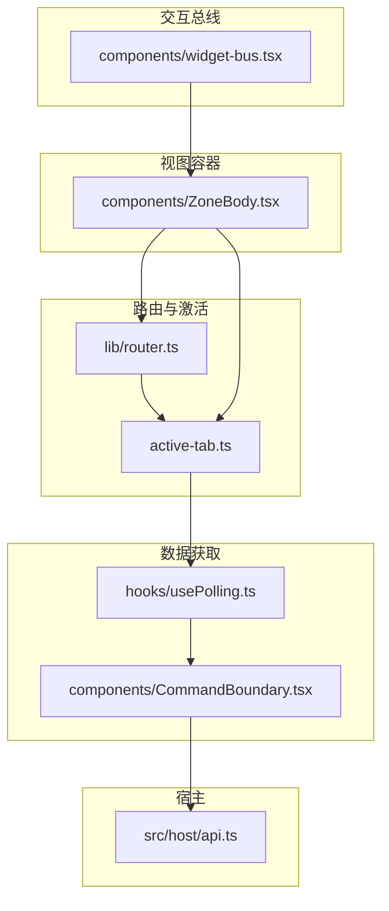
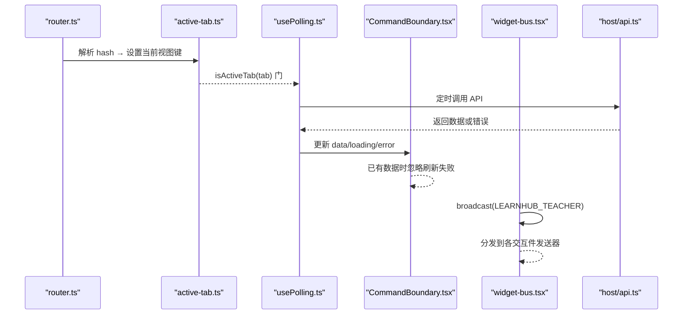
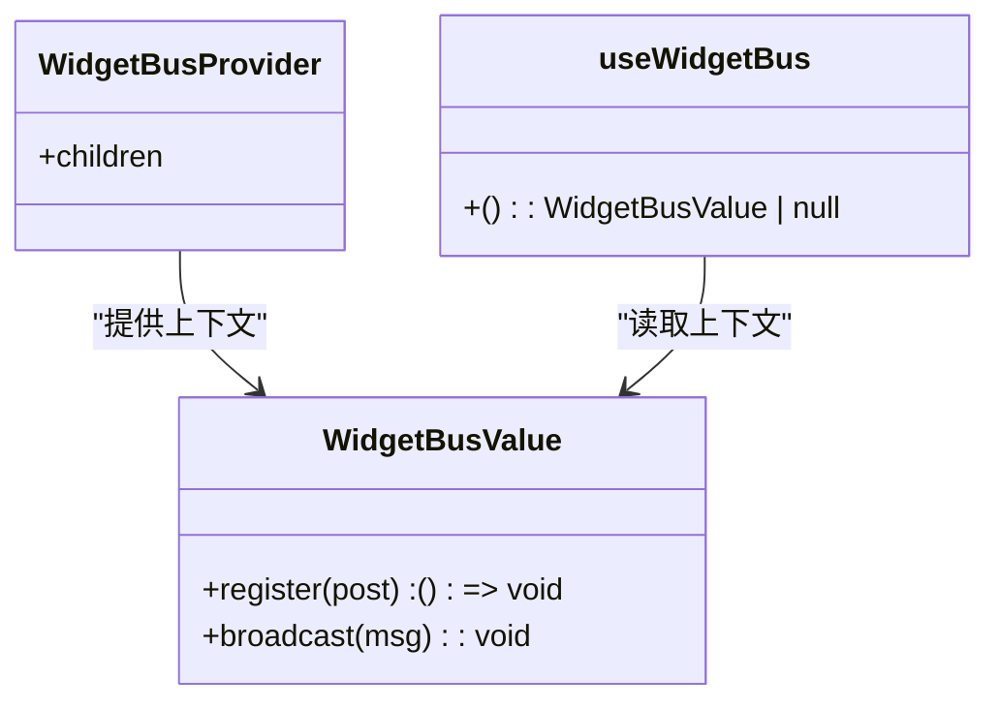
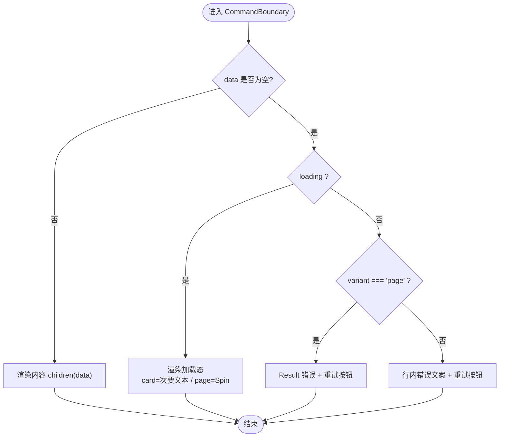
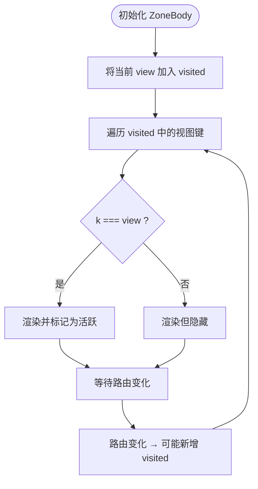
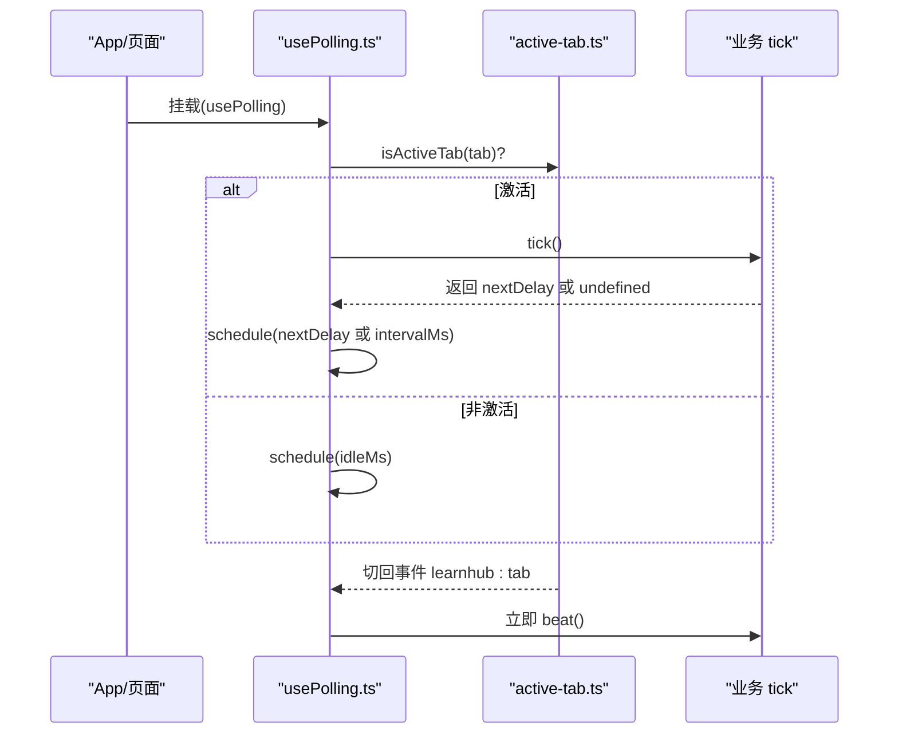
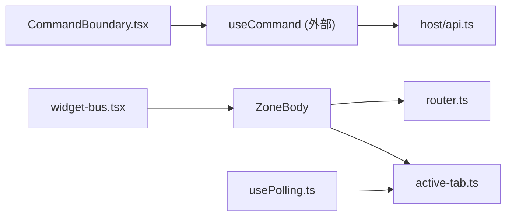

# 组件设计模式

<cite>
**本文引用的文件**
- [ui/src/components/widget-bus.tsx](file://ui/src/components/widget-bus.tsx)
- [ui/src/components/CommandBoundary.tsx](file://ui/src/components/CommandBoundary.tsx)
- [ui/src/components/ZoneBody.tsx](file://ui/src/components/ZoneBody.tsx)
- [ui/src/hooks/usePolling.ts](file://ui/src/hooks/usePolling.ts)
- [ui/src/lib/router.ts](file://ui/src/lib/router.ts)
- [ui/src/active-tab.ts](file://ui/src/active-tab.ts)
- [src/host/api.ts](file://src/host/api.ts)
- [tests/ui-seam-dom.test.ts](file://tests/ui-seam-dom.test.ts)
</cite>

## 目录
1. [简介](#简介)
2. [项目结构](#项目结构)
3. [核心组件](#核心组件)
4. [架构总览](#架构总览)
5. [详细组件分析](#详细组件分析)
6. [依赖关系分析](#依赖关系分析)
7. [性能考虑](#性能考虑)
8. [故障排查指南](#故障排查指南)
9. [结论](#结论)
10. [附录](#附录)

## 简介
本文件聚焦 LearnHub 前端 UI 层的三大组件设计模式：发布订阅（widget-bus）、命令模式（CommandBoundary）与容器模式（ZoneBody）。文档从实现原理、数据流、错误处理、性能与调试实践出发，给出可操作的组合使用方式与扩展建议，帮助读者在复杂交互场景下稳定地组织视图与业务逻辑。

## 项目结构
LearnHub 的 UI 层采用“纯逻辑库 + 钩子 + 页面 + 跨页组件”的分层组织：
- lib/router.ts：路由与视图键的权威定义与解析，提供导航、同步与事件订阅能力。
- active-tab.ts：当前激活视图信号与切回事件广播，配合保活策略。
- hooks/usePolling.ts：统一轮询钩子，封装“激活门 + 节拍调度 + 切回补取”。
- components/CommandBoundary.tsx：三态呈现（加载/失败/内容），收敛请求生命周期展示。
- components/widget-bus.tsx：发布订阅总线，用于向当前视图内的交互件广播动作。
- components/ZoneBody.tsx：视图保活容器，按视图键常驻/隐藏，支撑跨视图状态存续。

图表来源
- [ui/src/lib/router.ts:1-164](file://ui/src/lib/router.ts#L1-L164)
- [ui/src/active-tab.ts:1-38](file://ui/src/active-tab.ts#L1-L38)
- [ui/src/hooks/usePolling.ts:1-48](file://ui/src/hooks/usePolling.ts#L1-L48)
- [ui/src/components/CommandBoundary.tsx:1-46](file://ui/src/components/CommandBoundary.tsx#L1-L46)
- [ui/src/components/ZoneBody.tsx:1-43](file://ui/src/components/ZoneBody.tsx#L1-L43)
- [ui/src/components/widget-bus.tsx:1-50](file://ui/src/components/widget-bus.tsx#L1-L50)
- [src/host/api.ts:21-44](file://src/host/api.ts#L21-L44)

章节来源
- [ui/src/lib/router.ts:1-164](file://ui/src/lib/router.ts#L1-L164)
- [ui/src/active-tab.ts:1-38](file://ui/src/active-tab.ts#L1-L38)
- [ui/src/hooks/usePolling.ts:1-48](file://ui/src/hooks/usePolling.ts#L1-L48)
- [ui/src/components/CommandBoundary.tsx:1-46](file://ui/src/components/CommandBoundary.tsx#L1-L46)
- [ui/src/components/ZoneBody.tsx:1-43](file://ui/src/components/ZoneBody.tsx#L1-L43)
- [ui/src/components/widget-bus.tsx:1-50](file://ui/src/components/widget-bus.tsx#L1-L50)
- [src/host/api.ts:21-44](file://src/host/api.ts#L21-L44)

## 核心组件
- 发布订阅（widget-bus）：通过 React Context 维护一组“发送器”，Provider 挂载后，任意子组件可注册一个 post 函数；broadcast 将统一载荷以固定 type 分发给所有已注册的发送器。适用于跨 iframe 或面板到交互件的指令下发。
- 命令模式（CommandBoundary）：接收一个 Command 对象（含 data/loading/error/reload），根据状态渲染加载、失败或内容；失败时提供重试入口，已有数据时的后台刷新失败不覆盖旧数据，保证“失败不伪装”。
- 容器模式（ZoneBody）：基于 VIEW_KEYS 列表与 visited Set，对首次访问过的视图进行常驻保留，非激活视图仅隐藏；结合 active-tab 与 usePolling，实现“保活 + 按需轮询”。

章节来源
- [ui/src/components/widget-bus.tsx:1-50](file://ui/src/components/widget-bus.tsx#L1-L50)
- [ui/src/components/CommandBoundary.tsx:1-46](file://ui/src/components/CommandBoundary.tsx#L1-L46)
- [ui/src/components/ZoneBody.tsx:1-43](file://ui/src/components/ZoneBody.tsx#L1-L43)

## 架构总览
下图展示了三个模式的协作关系：ZoneBody 负责视图保活与切换；usePolling 在激活时按节拍拉取数据，并将结果交给 CommandBoundary 渲染；widget-bus 提供跨组件的事件通道，供面板侧向交互件广播动作。

图表来源
- [ui/src/lib/router.ts:72-164](file://ui/src/lib/router.ts#L72-L164)
- [ui/src/active-tab.ts:15-38](file://ui/src/active-tab.ts#L15-L38)
- [ui/src/hooks/usePolling.ts:15-48](file://ui/src/hooks/usePolling.ts#L15-L48)
- [ui/src/components/CommandBoundary.tsx:10-46](file://ui/src/components/CommandBoundary.tsx#L10-L46)
- [ui/src/components/widget-bus.tsx:24-49](file://ui/src/components/widget-bus.tsx#L24-L49)
- [src/host/api.ts:21-44](file://src/host/api.ts#L21-L44)

## 详细组件分析

### 发布订阅模式（widget-bus）
- 设计要点
  - 通过 React Context 暴露 register/broadcast 两个方法。
  - register 返回注销函数，确保组件卸载时自动清理。
  - broadcast 将消息包装为固定 type 并遍历已注册发送器逐一投递。
- 典型用法
  - 在 LessonView 等父级提供 WidgetBusProvider。
  - 交互件在挂载时 register 一个 post 函数，卸载时自动注销。
  - 面板侧（如“问 AI 老师”演示按钮）调用 broadcast 下发 highlight/setState/reveal/annotate 等动作。
- 错误处理与健壮性
  - 无 Provider 时 useWidgetBus 返回 null，调用方应做空值保护，避免崩溃。
  - 发送器集合使用 Set，天然去重且 O(1) 增删。
- 性能考量
  - broadcast 为同步遍历，适合少量交互件；若交互件数量增长，可考虑批量合并或节流。
- 调试技巧
  - 在 broadcast 处打点日志，确认消息是否到达。
  - 在 register 返回的注销函数中打点，验证卸载行为。

图表来源
- [ui/src/components/widget-bus.tsx:24-49](file://ui/src/components/widget-bus.tsx#L24-L49)

章节来源
- [ui/src/components/widget-bus.tsx:1-50](file://ui/src/components/widget-bus.tsx#L1-L50)

### 命令模式（CommandBoundary）
- 设计要点
  - 输入 Command<T>（data/loading/error/reload），输出三态渲染：加载中、失败、内容。
  - 支持 page/card 两种变体，分别对应整页 Result 与内联重试文本。
  - 已有数据后的刷新失败不覆盖 data，保持“失败不伪装”。
- 执行流程
  - 调用方通过 useCommand 发起请求，CommandBoundary 消费其状态进行渲染。
  - 失败时提供 onRetry 或默认 reload 重试。
- 错误处理
  - error 为空时显示通用失败文案；page 变体提供重试按钮。
  - 测试覆盖“已有数据后刷新失败仍保留旧数据”的行为契约。
- 性能考量
  - 组件本身轻量，职责单一；复杂页面应将数据获取下沉至 useCommand，边界只关注呈现。
- 调试技巧
  - 在测试中使用“呈现探针”断言可见文本，确保三态语义稳定。
  - 通过 onRetry 手动触发重试，观察网络与状态变化。

图表来源
- [ui/src/components/CommandBoundary.tsx:10-46](file://ui/src/components/CommandBoundary.tsx#L10-L46)
- [tests/ui-seam-dom.test.ts:56-84](file://tests/ui-seam-dom.test.ts#L56-L84)

章节来源
- [ui/src/components/CommandBoundary.tsx:1-46](file://ui/src/components/CommandBoundary.tsx#L1-L46)
- [tests/ui-seam-dom.test.ts:1-84](file://tests/ui-seam-dom.test.ts#L1-L84)

### 容器模式（ZoneBody）
- 设计要点
  - 基于 VIEW_KEYS 列表与 visited Set，首次访问的视图被保留，非激活视图隐藏。
  - 单课工作台整体共享 'courses.course' 视图键，内部分栏切换不改视图键。
  - 与 active-tab 协同：隐藏视图的轮询由 isActiveTab 门跳过，仅保留定时器节拍。
- 数据流
  - ZoneBody 根据当前 view 决定渲染哪个页面；visited 集合保证历史视图不被卸载。
  - 路由变化通过 router 提供的 onRouteChange/syncHash 驱动。
- 错误处理
  - 视图键与路由表一致性由测试门保障；新增视图需同步更新键表与分支。
- 性能考量
  - 避免频繁卸载/挂载带来的状态丢失；隐藏视图仅 CSS 隐藏，减少重建成本。
- 调试技巧
  - 检查 zone-view-active 类名是否正确应用。
  - 通过路由工具函数 navigate/navigateCourse 验证跳转与保活行为。

图表来源
- [ui/src/components/ZoneBody.tsx:21-43](file://ui/src/components/ZoneBody.tsx#L21-L43)
- [ui/src/lib/router.ts:49-121](file://ui/src/lib/router.ts#L49-L121)

章节来源
- [ui/src/components/ZoneBody.tsx:1-43](file://ui/src/components/ZoneBody.tsx#L1-L43)
- [ui/src/lib/router.ts:1-164](file://ui/src/lib/router.ts#L1-L164)

### 轮询与激活门（usePolling + active-tab）
- 设计要点
  - usePolling 封装 setInterval + isActiveTab 门 + learnhub:tab 切回补取 + 卸载清理。
  - tick 返回数字表示自定义延迟，undefined 使用 intervalMs；非激活时使用 idleMs 节拍。
  - active-tab 维护当前视图键，并在切换时广播 learnhub:tab 事件。
- 执行时序
  - 挂载即取一次；激活页签按 tick 返回值调度下一次；非激活页签仅保留节拍；切回立即补取。
- 错误处理
  - 组件卸载时清除定时器与事件监听，防止内存泄漏。
- 性能考量
  - 非激活页签不调用业务 tick，降低后台开销；idleMs 允许更慢的节拍。
- 调试技巧
  - 在 tick 前后打点，观察不同激活状态下的调用频率。
  - 通过 onTabActive 订阅切回事件，验证补取逻辑。

图表来源
- [ui/src/hooks/usePolling.ts:15-48](file://ui/src/hooks/usePolling.ts#L15-L48)
- [ui/src/active-tab.ts:15-38](file://ui/src/active-tab.ts#L15-L38)

章节来源
- [ui/src/hooks/usePolling.ts:1-48](file://ui/src/hooks/usePolling.ts#L1-L48)
- [ui/src/active-tab.ts:1-38](file://ui/src/active-tab.ts#L1-L38)

## 依赖关系分析
- ZoneBody 依赖 router 的 VIEW_KEYS 与路由解析，决定渲染哪些页面以及当前活跃视图。
- usePolling 依赖 active-tab 的 isActiveTab 与 learnhub:tab 事件，控制轮询时机。
- CommandBoundary 依赖 useCommand 的 Command 对象，仅负责三态呈现与重试。
- widget-bus 通过 Context 向下传递，供任意子组件注册发送器并接收广播。
- 宿主 api.ts 提供命令匹配与分发，UI 侧通过 useCommand 调用后端端点。

图表来源
- [ui/src/components/ZoneBody.tsx:21-43](file://ui/src/components/ZoneBody.tsx#L21-L43)
- [ui/src/lib/router.ts:49-121](file://ui/src/lib/router.ts#L49-L121)
- [ui/src/active-tab.ts:15-38](file://ui/src/active-tab.ts#L15-L38)
- [ui/src/hooks/usePolling.ts:15-48](file://ui/src/hooks/usePolling.ts#L15-L48)
- [ui/src/components/CommandBoundary.tsx:10-46](file://ui/src/components/CommandBoundary.tsx#L10-L46)
- [ui/src/components/widget-bus.tsx:24-49](file://ui/src/components/widget-bus.tsx#L24-L49)
- [src/host/api.ts:21-44](file://src/host/api.ts#L21-L44)

章节来源
- [ui/src/components/ZoneBody.tsx:1-43](file://ui/src/components/ZoneBody.tsx#L1-L43)
- [ui/src/lib/router.ts:1-164](file://ui/src/lib/router.ts#L1-L164)
- [ui/src/active-tab.ts:1-38](file://ui/src/active-tab.ts#L1-L38)
- [ui/src/hooks/usePolling.ts:1-48](file://ui/src/hooks/usePolling.ts#L1-L48)
- [ui/src/components/CommandBoundary.tsx:1-46](file://ui/src/components/CommandBoundary.tsx#L1-L46)
- [ui/src/components/widget-bus.tsx:1-50](file://ui/src/components/widget-bus.tsx#L1-L50)
- [src/host/api.ts:21-44](file://src/host/api.ts#L21-L44)

## 性能考虑
- 视图保活：ZoneBody 通过 visited 集合避免重复挂载，减少状态重建成本；隐藏视图仅 CSS 隐藏，适合需要跨视图维持状态的页面（如练习会话）。
- 轮询节流：usePolling 在非激活页签使用 idleMs 降低频率；tick 可返回自定义延迟，针对“任务在途/空闲”等场景动态调整。
- 事件广播：widget-bus 的 broadcast 为同步遍历，交互件数量较多时应考虑批处理或节流，避免主线程阻塞。
- 路由同步：router 的 syncHash 仅在必要时 replaceState，避免多余历史条目与事件风暴。

[本节为通用指导，无需特定文件引用]

## 故障排查指南
- 命令刷新失败未覆盖旧数据
  - 现象：已有数据后刷新失败，界面仍显示旧数据。
  - 原因：CommandBoundary 的三态语义规定“已有数据后的后台刷新失败不进来”。
  - 处理：在调用方决定是否轻提示；可通过 onRetry 手动重试。
  - 参考断言：测试覆盖该行为契约。
  - 章节来源
    - [ui/src/components/CommandBoundary.tsx:10-46](file://ui/src/components/CommandBoundary.tsx#L10-L46)
    - [tests/ui-seam-dom.test.ts:56-84](file://tests/ui-seam-dom.test.ts#L56-L84)

- 轮询在非激活页签仍频繁调用
  - 现象：切换页签后，后台仍在高频拉取。
  - 排查：确认 usePolling 的 tab 参数与 active-tab 的当前视图键一致；检查 isActiveTab 门逻辑。
  - 章节来源
    - [ui/src/hooks/usePolling.ts:15-48](file://ui/src/hooks/usePolling.ts#L15-L48)
    - [ui/src/active-tab.ts:15-38](file://ui/src/active-tab.ts#L15-L38)

- 视图切换后状态丢失
  - 现象：切换回某视图时，之前页面状态消失。
  - 排查：确认 ZoneBody 已将视图加入 visited；检查路由键与 VIEW_KEYS 是否一致。
  - 章节来源
    - [ui/src/components/ZoneBody.tsx:21-43](file://ui/src/components/ZoneBody.tsx#L21-L43)
    - [ui/src/lib/router.ts:49-121](file://ui/src/lib/router.ts#L49-L121)

- 交互件未收到广播
  - 现象：面板侧 broadcast 后，交互件无响应。
  - 排查：确认 WidgetBusProvider 已包裹；交互件是否在挂载时正确 register；卸载时是否被提前注销。
  - 章节来源
    - [ui/src/components/widget-bus.tsx:24-49](file://ui/src/components/widget-bus.tsx#L24-L49)

## 结论
LearnHub 的 UI 层通过 ZoneBody（容器）、CommandBoundary（命令）与 widget-bus（发布订阅）三种模式，构建了清晰、可维护且高性能的前端架构。容器模式保障视图状态与性能；命令模式统一数据获取与呈现；发布订阅模式解耦面板与交互件通信。结合 usePolling 与 active-tab 的轮询门机制，实现了“保活 + 按需拉取”的最佳实践。遵循本文档的模式规范与调试技巧，可在复杂场景中稳定扩展与维护。

## 附录
- 最佳实践清单
  - 使用 ZoneBody 管理视图保活，避免不必要的卸载与重建。
  - 使用 CommandBoundary 统一三态呈现，业务层专注数据获取与状态管理。
  - 使用 widget-bus 进行跨组件通信，注意注册与注销的生命周期。
  - 使用 usePolling 与 active-tab 控制轮询节奏，非激活页签降低频率。
  - 通过 router 的 navigate/navigateCourse 进行程序化跳转，保持 URL 权威。
- 扩展建议
  - 在 widget-bus 上增加消息类型枚举与校验，提升类型安全。
  - 在 CommandBoundary 中增加“加载中骨架屏”的可插拔插槽，便于主题定制。
  - 在 ZoneBody 中引入懒加载策略，进一步减少首屏资源。

[本节为通用指导，无需特定文件引用]