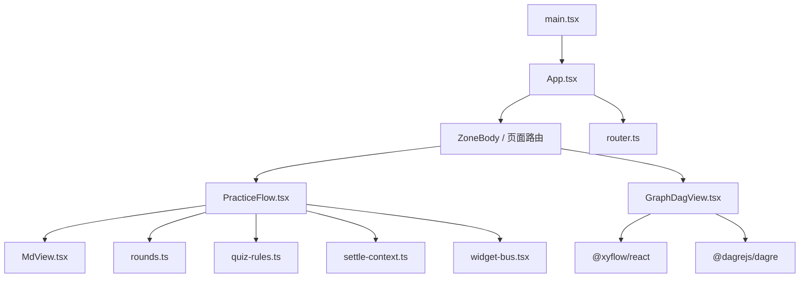
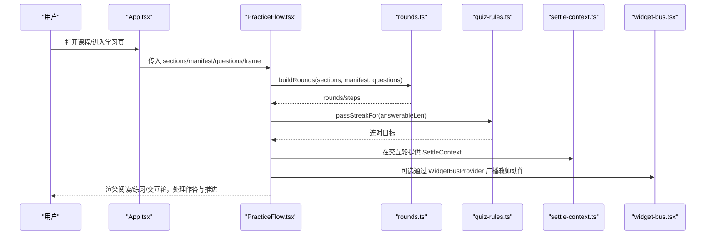
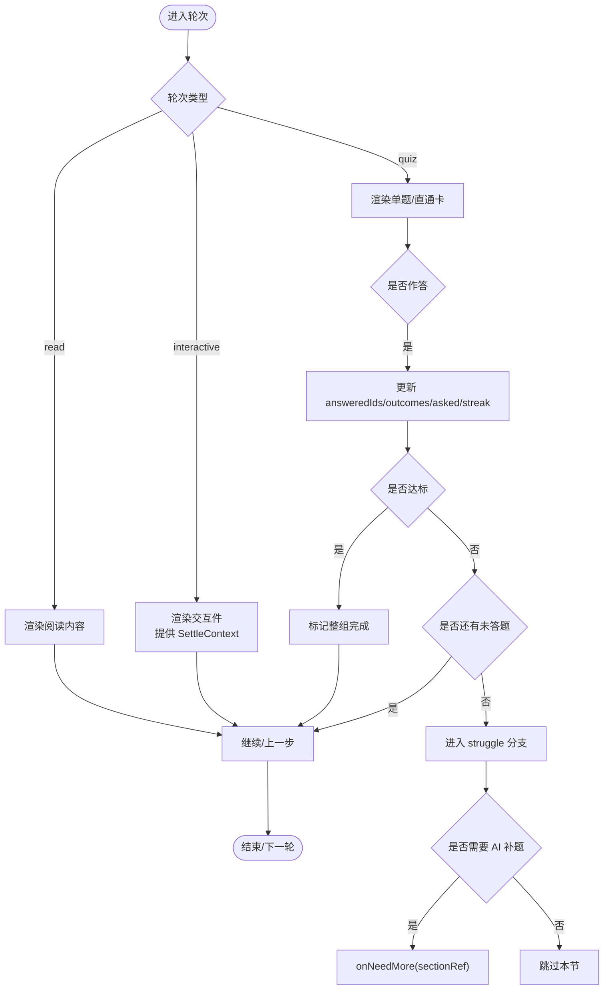
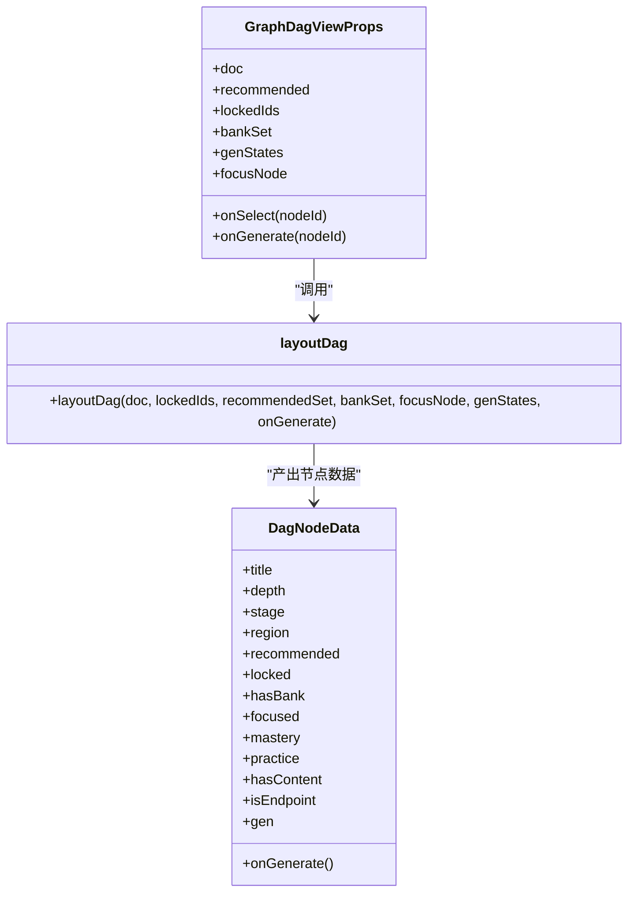
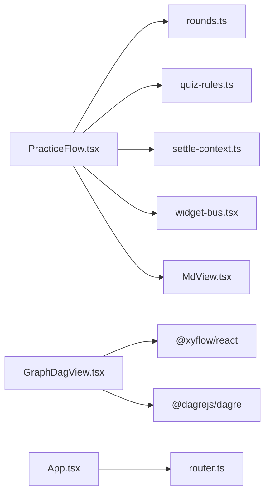

# 自定义组件开发

<cite>
**本文引用的文件**
- [PracticeFlow.tsx](file://ui/src/components/PracticeFlow.tsx)
- [GraphDagView.tsx](file://ui/src/components/GraphDagView.tsx)
- [widget-bus.tsx](file://ui/src/components/widget-bus.tsx)
- [MdView.tsx](file://ui/src/components/MdView.tsx)
- [App.tsx](file://ui/src/App.tsx)
- [main.tsx](file://ui/src/main.tsx)
- [rounds.ts](file://ui/src/lib/rounds.ts)
- [router.ts](file://ui/src/lib/router.ts)
- [quiz-rules.ts](file://ui/src/lib/quiz-rules.ts)
- [settle-context.ts](file://ui/src/lib/settle-context.ts)
- [types.ts](file://ui/src/types.ts)
- [ui-router.test.ts](file://tests/ui-router.test.ts)
- [ui-smoke.test.ts](file://tests/ui-smoke.test.ts)
</cite>

## 目录
1. [简介](#简介)
2. [项目结构](#项目结构)
3. [核心组件](#核心组件)
4. [架构总览](#架构总览)
5. [详细组件分析](#详细组件分析)
6. [依赖关系分析](#依赖关系分析)
7. [性能考量](#性能考量)
8. [故障排查指南](#故障排查指南)
9. [结论](#结论)
10. [附录](#附录)

## 简介
本文件面向 LearnHub 前端 UI 的复杂业务组件开发，聚焦 PracticeFlow（练习会话流）与 GraphDagView（学习图 DAG 视图）两大组件。文档从组件分层、状态管理、数据流设计、通信机制、测试策略到最佳实践进行系统化说明，并提供可追溯的代码级引用与图示，帮助读者快速掌握并复用这些模式。

## 项目结构
LearnHub 的 UI 采用“页面 + 组件 + 工具库”的分层组织：
- 入口与壳：main.tsx 挂载 App；App.tsx 负责全局路由、主题、课程上下文与导航。
- 页面：pages/* 提供各区域页面（如 TodayPage、WorkbenchPage）。
- 组件：components/* 提供通用与业务组件（PracticeFlow、GraphDagView、MdView 等）。
- 工具库：lib/* 提供纯函数与上下文（rounds、router、quiz-rules、settle-context、widget-bus）。
- 类型：types.ts 集中导出引擎与宿主侧类型，避免手工镜像。

图表来源
- [main.tsx:1-16](file://ui/src/main.tsx#L1-L16)
- [App.tsx:47-179](file://ui/src/App.tsx#L47-L179)
- [PracticeFlow.tsx:58-461](file://ui/src/components/PracticeFlow.tsx#L58-L461)
- [GraphDagView.tsx:232-316](file://ui/src/components/GraphDagView.tsx#L232-L316)
- [rounds.ts:44-101](file://ui/src/lib/rounds.ts#L44-L101)
- [router.ts:1-164](file://ui/src/lib/router.ts#L1-L164)

章节来源
- [main.tsx:1-16](file://ui/src/main.tsx#L1-L16)
- [App.tsx:47-179](file://ui/src/App.tsx#L47-L179)

## 核心组件
- PracticeFlow：节序列驱动的练习会话流，支持阅读轮、练习轮、交互轮，内置连对过关、申诉作废、AI 定向补题、直通卡等能力。
- GraphDagView：基于 React Flow + dagre 的学习图可视化，支持五态色板、推荐高亮、锁定虚线、MiniMap、视口裁剪与定位。
- MdView：Markdown 渲染管线，支持公式、代码块分发、预测门分段、Obsidian 图片嵌入。
- widget-bus：跨 iframe 与面板的广播总线，用于“问 AI 老师”动作下发。
- settle-context：为交互件提供结算上下文（课程/节点/节 id），使沙箱 iframe 能上报成绩。

章节来源
- [PracticeFlow.tsx:58-461](file://ui/src/components/PracticeFlow.tsx#L58-L461)
- [GraphDagView.tsx:232-316](file://ui/src/components/GraphDagView.tsx#L232-L316)
- [MdView.tsx:60-103](file://ui/src/components/MdView.tsx#L60-L103)
- [widget-bus.tsx:1-50](file://ui/src/components/widget-bus.tsx#L1-L50)
- [settle-context.ts:1-9](file://ui/src/lib/settle-context.ts#L1-L9)

## 架构总览
UI 采用“顶层 App 统一路由与上下文 → 页面按区渲染 → 复杂业务由组件封装 → 工具库提供纯逻辑与上下文”的分层架构。PracticeFlow 与 GraphDagView 作为复杂业务组件，分别承担“流程编排”和“可视化表达”。

图表来源
- [App.tsx:47-179](file://ui/src/App.tsx#L47-L179)
- [PracticeFlow.tsx:58-461](file://ui/src/components/PracticeFlow.tsx#L58-L461)
- [rounds.ts:44-101](file://ui/src/lib/rounds.ts#L44-L101)
- [quiz-rules.ts:1-19](file://ui/src/lib/quiz-rules.ts#L1-L19)
- [settle-context.ts:1-9](file://ui/src/lib/settle-context.ts#L1-L9)
- [widget-bus.tsx:1-50](file://ui/src/components/widget-bus.tsx#L1-L50)

## 详细组件分析

### PracticeFlow：练习会话流
- 设计要点
  - 节清单驱动：内容节=读+练；练习节=直接练；交互节=交互件轮。旧节点回退标题匹配。
  - 轮次计划：buildRounds 生成 rounds/steps，将阅读与练习成对合并为一步。
  - 连对过关：passStreakFor 根据组内题量动态计算目标，避免小题量死锁。
  - 会话内去重：answeredIds/outcomes 保证每道题只答一次，回看仅展示小结。
  - 申诉作废：ADR-0031 语义下，改判对恢复连对推进；作废/豁免中性处理，退出预算。
  - AI 定向补题：struggle 时触发 onNeedMore，新题经外部题目集刷新自动并入。
  - 直通卡：advancedToday 的题目以“已看”推进，不产连对，组内无可看题则收轮或落 struggle。
- 状态管理
  - 本地状态：roundIdx/qIdx/streak/asked/answered/answeredIds/outcomes/voidedIds/doneRounds/maxReached。
  - 外部变化处理：questions 引用变化时，保持当前轮键位并重定位到首个未作答题，保障体验连贯。
- 数据流
  - 输入：course/node/sections/manifest/questions 及回调 onSettled/onNeedMore/onQuestionsMutated/onPassChange。
  - 输出：渲染步进、提交作答结果、请求补题、通知父级刷新。
- 错误处理
  - 使用 Message.error 与 errorMessage 包装异常提示。
  - 软上限提示：quizSoftCap 时 Popconfirm 二次确认。
- 可访问性
  - Stepper 按钮带 aria-label/title，提升键盘与屏幕阅读器体验。

图表来源
- [PracticeFlow.tsx:169-235](file://ui/src/components/PracticeFlow.tsx#L169-L235)
- [PracticeFlow.tsx:304-453](file://ui/src/components/PracticeFlow.tsx#L304-L453)
- [rounds.ts:44-101](file://ui/src/lib/rounds.ts#L44-L101)
- [quiz-rules.ts:1-19](file://ui/src/lib/quiz-rules.ts#L1-L19)

章节来源
- [PracticeFlow.tsx:58-461](file://ui/src/components/PracticeFlow.tsx#L58-L461)
- [rounds.ts:44-101](file://ui/src/lib/rounds.ts#L44-L101)
- [quiz-rules.ts:1-19](file://ui/src/lib/quiz-rules.ts#L1-L19)

### GraphDagView：学习图 DAG 视图
- 设计要点
  - 数据源：learnhub 引擎 graphAnalyze elements（已是 React Flow 格式）。
  - 布局：dagre BT 分层，前置沉底、目标升至顶层；节点固定宽高，边端点对齐。
  - 视觉：五态色板、推荐星标、锁定虚线、终点方向标记（品红双描边 + “⚑终”）、掌握度底色深浅。
  - 交互：点击节点选中、MiniMap、Controls、视口裁剪（>300 节点开启 onlyRenderVisibleElements）。
  - 生成队列：节点角标“生/队/文”，hover 工具条隐藏于生成中/排队态。
- 状态管理
  - 内部 useMemo 缓存 flowNodes/flowEdges；useCallback 缓存 handleInit/focus；useEffect 监听 focusNode 变化。
- 数据流
  - 输入：doc/recommended/lockedIds/bankSet/genStates/focusNode/onSelect/onGenerate。
  - 输出：节点选择事件、生成入口回调。
- 性能优化
  - 节点数阈值控制视口裁剪；fitView 与 setCenter 组合实现精准定位。
- 可访问性
  - Handle 隐藏但保留语义；tooltip 提供关键元信息（阶段、掌握度、锁定原因、终点说明）。

图表来源
- [GraphDagView.tsx:60-81](file://ui/src/components/GraphDagView.tsx#L60-L81)
- [GraphDagView.tsx:179-230](file://ui/src/components/GraphDagView.tsx#L179-L230)
- [GraphDagView.tsx:232-316](file://ui/src/components/GraphDagView.tsx#L232-L316)

章节来源
- [GraphDagView.tsx:232-316](file://ui/src/components/GraphDagView.tsx#L232-L316)

### MdView：Markdown 渲染管线
- 功能
  - react-markdown + remark-gfm + rehype-katex 公式支持。
  - 代码块按语言分发（mermaid/media），未注册降级源码。
  - Obsidian 图片嵌入预处理为面板文件路由 URL。
  - 预测门分段：splitPredictSegments 切出“先预测再揭晓”的阅读门。
- 可访问性与健壮性
  - 非法预测块降级源码显示，避免页面崩溃。
  - InlineMd 行内场景段落降为 span，保持表单控件布局稳定。

章节来源
- [MdView.tsx:60-103](file://ui/src/components/MdView.tsx#L60-L103)

### widget-bus：交互件消息总线
- 作用
  - 注册 iframe 发送器，面板侧通过 broadcast 向当前视图内全部交互件广播 LEARNHUB_TEACHER 动作（highlight/setState/reveal/annotate）。
  - 无 Provider 时 useWidgetBus 返回 null，交互件照常渲染，仅无广播能力。
- 使用方式
  - 外层 WidgetBusProvider 包裹 Lesson 视图；子组件 useWidgetBus().register/post 注册与广播。

章节来源
- [widget-bus.tsx:1-50](file://ui/src/components/widget-bus.tsx#L1-L50)

### settle-context：交互件结算上下文
- 作用
  - PracticeFlow 在交互节轮提供 course/node/sectionId，供 InteractiveBlock 消费，以便沙箱 iframe 上报 LEARNHUB_COMPLETE 时调 /interactive/settle。
- 使用方式
  - 在交互轮用 SettleContext.Provider 包裹，子组件消费上下文。

章节来源
- [settle-context.ts:1-9](file://ui/src/lib/settle-context.ts#L1-L9)

## 依赖关系分析
- PracticeFlow 依赖
  - rounds.ts：构建轮次与步骤，解耦业务规则。
  - quiz-rules.ts：连对目标与软上限常量。
  - settle-context.ts：交互节结算上下文。
  - widget-bus.tsx：可选的 AI 老师广播能力。
  - MdView.tsx：阅读内容与题干解析。
- GraphDagView 依赖
  - @xyflow/react：React Flow 可视化框架。
  - @dagrejs/dagre：分层布局算法。
- 路由与壳
  - router.ts：hash 路由、视图键映射、规范化与订阅。
  - App.tsx：全局状态、导航、主题、课程上下文。

图表来源
- [PracticeFlow.tsx:58-461](file://ui/src/components/PracticeFlow.tsx#L58-L461)
- [GraphDagView.tsx:232-316](file://ui/src/components/GraphDagView.tsx#L232-L316)
- [App.tsx:47-179](file://ui/src/App.tsx#L47-L179)
- [router.ts:1-164](file://ui/src/lib/router.ts#L1-L164)

章节来源
- [PracticeFlow.tsx:58-461](file://ui/src/components/PracticeFlow.tsx#L58-L461)
- [GraphDagView.tsx:232-316](file://ui/src/components/GraphDagView.tsx#L232-L316)
- [App.tsx:47-179](file://ui/src/App.tsx#L47-L179)
- [router.ts:1-164](file://ui/src/lib/router.ts#L1-L164)

## 性能考量
- PracticeFlow
  - 使用 useMemo 计算 rounds/steps，减少重复计算。
  - 通过 answeredIds/outcomes 避免重复作答与无效重算。
  - 题目集外部变化时，仅当签名变化才重定位，降低抖动。
- GraphDagView
  - 节点数 >300 启用 onlyRenderVisibleElements 视口裁剪，保持大图流畅。
  - useMemo 缓存布局结果；useCallback 缓存回调；fitView + setCenter 精准定位。
- MdView
  - 代码块按语言分发，未命中降级源码，避免昂贵渲染失败。
  - 预测门分段渲染，按需展开，减少首屏压力。
- 路由与壳
  - hash 路由轻量且幂等；syncHash 仅在漂移时写 URL，避免多余历史条目。

[本节为通用指导，不直接分析具体文件]

## 故障排查指南
- PracticeFlow
  - 症状：卡在 struggle 无法前进。检查 passStreakFor 目标是否合理（题量过小导致不可达），核对 MAX_ASK_PER_ROUND 与 voidedIds 影响。
  - 症状：题目刷新后位置错乱。确认 questions 签名变化时的重定位逻辑（gotoRound 与 firstUnanswered）。
  - 症状：申诉后连对异常。核对 handleDisputeSettled 对 outcomes/voidedIds/asked 的修正。
- GraphDagView
  - 症状：节点重叠或边错位。确认节点 width/height 设置与 dagre 配置一致。
  - 症状：大图卡顿。检查 onlyRenderVisibleElements 阈值与节点数量。
  - 症状：定位失效。确认 focusNode 与 setCenter 调用时机（onInit 与 useEffect）。
- 路由
  - 症状：深链跳转异常。检查 parseHash/navigateCourse/syncHash 的规范形与解码逻辑。
  - 症状：保活/轮询门误判。核对 viewOfRoute/zoneOfView 与 active-tab 桥接。
- 测试
  - 冒烟测试失败：查看 ui-smoke.test.ts 冻结表，确保页面/壳组件在 render/exempt/shell 中显式归类。
  - 路由表不一致：运行 ui-router.test.ts 的路由表完整性门，修复缺失或顺序漂移。

章节来源
- [PracticeFlow.tsx:192-297](file://ui/src/components/PracticeFlow.tsx#L192-L297)
- [GraphDagView.tsx:179-230](file://ui/src/components/GraphDagView.tsx#L179-L230)
- [router.ts:72-164](file://ui/src/lib/router.ts#L72-L164)
- [ui-smoke.test.ts:58-135](file://tests/ui-smoke.test.ts#L58-L135)
- [ui-router.test.ts:55-170](file://tests/ui-router.test.ts#L55-L170)

## 结论
PracticeFlow 与 GraphDagView 体现了 LearnHub 复杂业务组件的典型模式：以纯函数模块承载规则（rounds、quiz-rules），以 Context 与 Bus 解耦跨域通信（settle-context、widget-bus），以 React Hooks 管理细粒度状态，结合可视化与布局库实现高效交互。配合严格的测试门禁（冒烟与路由表完整性），可在演进中保持稳定性与可维护性。

[本节为总结，不直接分析具体文件]

## 附录

### 组件通信机制
- 父子组件通信
  - props 传递：PracticeFlow 接收 course/node/sections/manifest/questions 及回调。
  - 回调驱动刷新：onSettled/onQuestionsMutated/onPassChange 通知父级更新统计与状态。
- 兄弟组件通信
  - 通过共享上下文：SettleContext 在 PracticeFlow 的交互轮提供结算上下文，子组件消费。
  - 通过总线：WidgetBusProvider 广播教师动作，所有注册的交互件接收。
- 全局状态管理
  - AppFrame：App.tsx 暴露 status/tree/course/lesson/focusNode/focusJob 及导航方法，供页面与组件消费。
  - 路由权威：router.ts 以 location.hash 为唯一权威，navigate/navigateCourse/syncHash/onRouteChange 提供程序化与订阅能力。

章节来源
- [PracticeFlow.tsx:58-112](file://ui/src/components/PracticeFlow.tsx#L58-L112)
- [settle-context.ts:1-9](file://ui/src/lib/settle-context.ts#L1-L9)
- [widget-bus.tsx:32-49](file://ui/src/components/widget-bus.tsx#L32-L49)
- [App.tsx:17-38](file://ui/src/App.tsx#L17-L38)
- [router.ts:1-164](file://ui/src/lib/router.ts#L1-L164)

### 组件测试策略
- 单元测试
  - 路由：ui-router.test.ts 覆盖 parseHash/navigate/navigateCourse/syncHash/onRouteChange 与视图键往返恒等、参数段工作台、active-tab 桥接与路由表完整性门。
  - 规则：rounds.ts/quiz-rules.ts 零依赖，可直接 node:test 验证。
- 集成测试
  - 冒烟渲染：ui-smoke.test.ts 使用 react-dom/server 静态渲染页面与壳组件，确保导入与首渲染不崩溃，并通过冻结表强制归类。
- 快照测试
  - 本项目未直接使用快照测试；通过冒烟与路由表门禁替代回归保护。

章节来源
- [ui-router.test.ts:1-305](file://tests/ui-router.test.ts#L1-L305)
- [ui-smoke.test.ts:1-147](file://tests/ui-smoke.test.ts#L1-L147)
- [rounds.ts:1-102](file://ui/src/lib/rounds.ts#L1-L102)
- [quiz-rules.ts:1-19](file://ui/src/lib/quiz-rules.ts#L1-L19)

### 组件开发最佳实践
- 错误处理
  - 统一错误提示：errorMessage + Message.error。
  - 软上限与确认：quizSoftCap 时使用 Popconfirm 二次确认，避免误操作。
- 性能优化
  - 纯函数模块：将规则与计算抽离至 lib/*，便于测试与复用。
  - 记忆化：useMemo/useCallback 缓存计算与回调，减少重渲染。
  - 视口裁剪：大图场景启用 onlyRenderVisibleElements。
- 可访问性
  - 语义化标签与属性：aria-label/title、按钮类型明确。
  - 键盘友好：Stepper 按钮可聚焦与操作。
  - 文本可读：Tooltip 提供关键元信息（阶段、掌握度、锁定原因）。

[本节为通用指导，不直接分析具体文件]