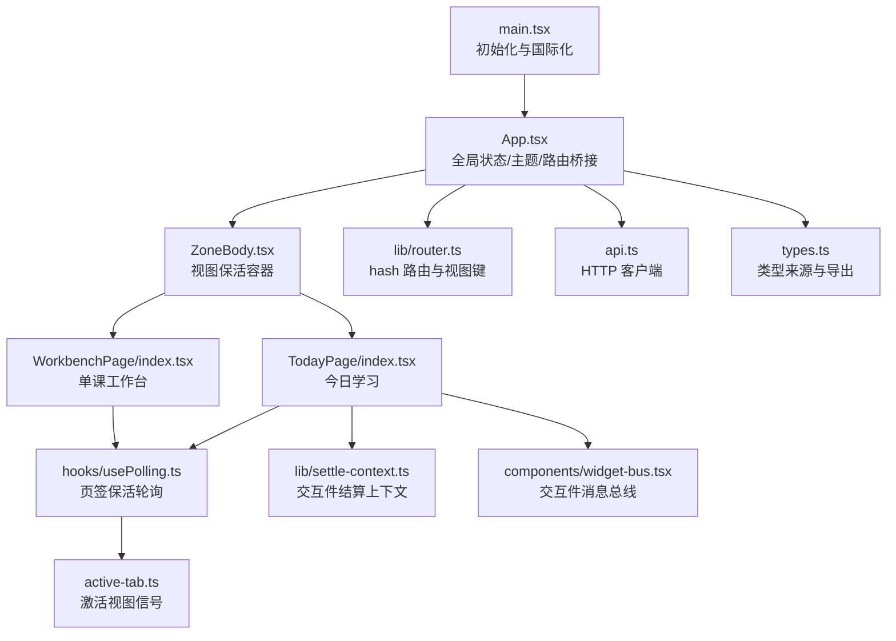
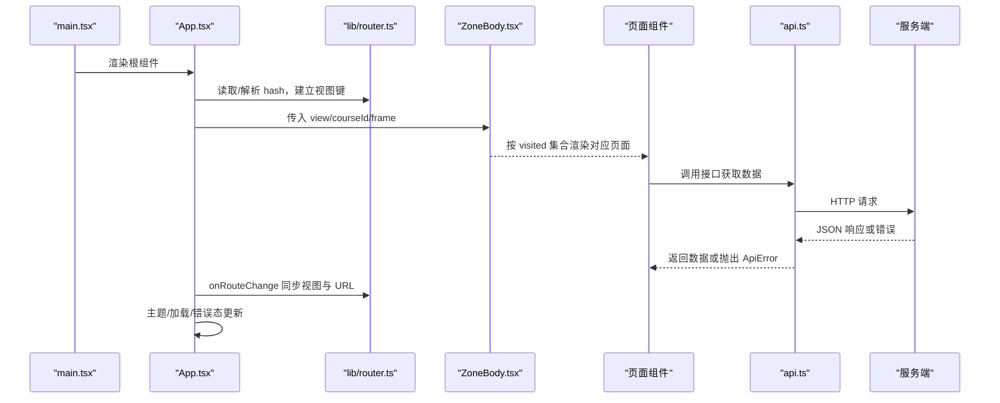
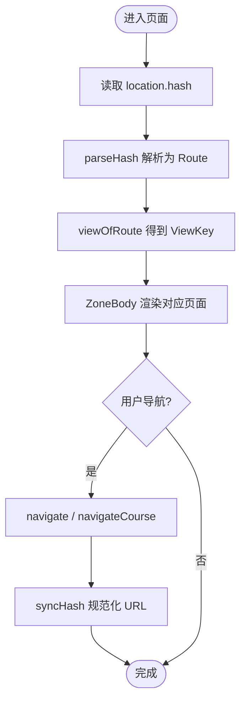
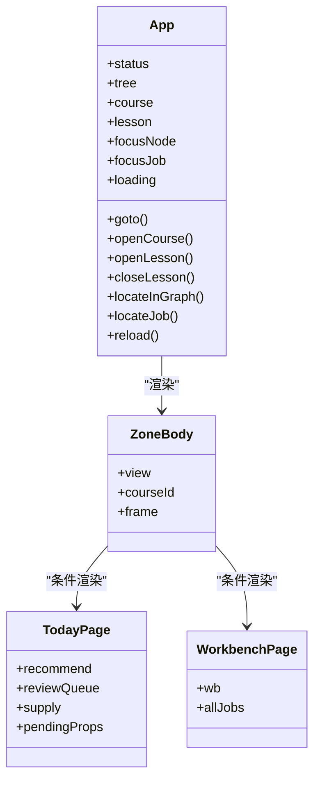
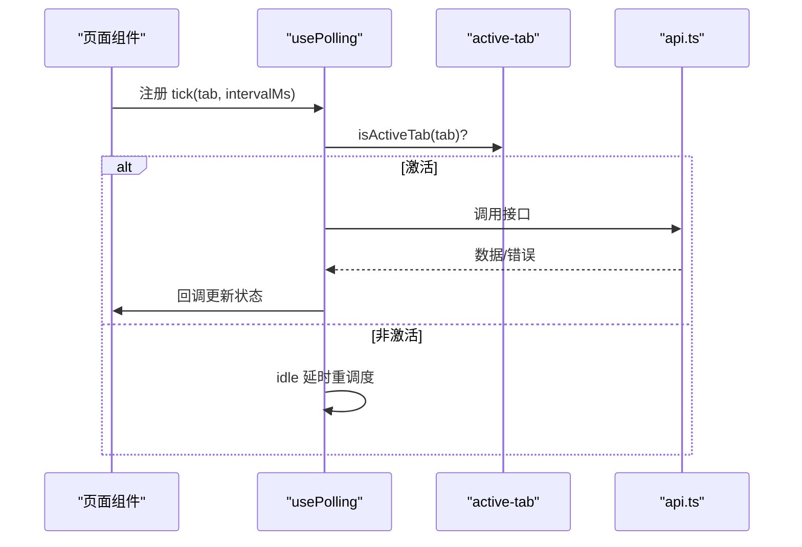
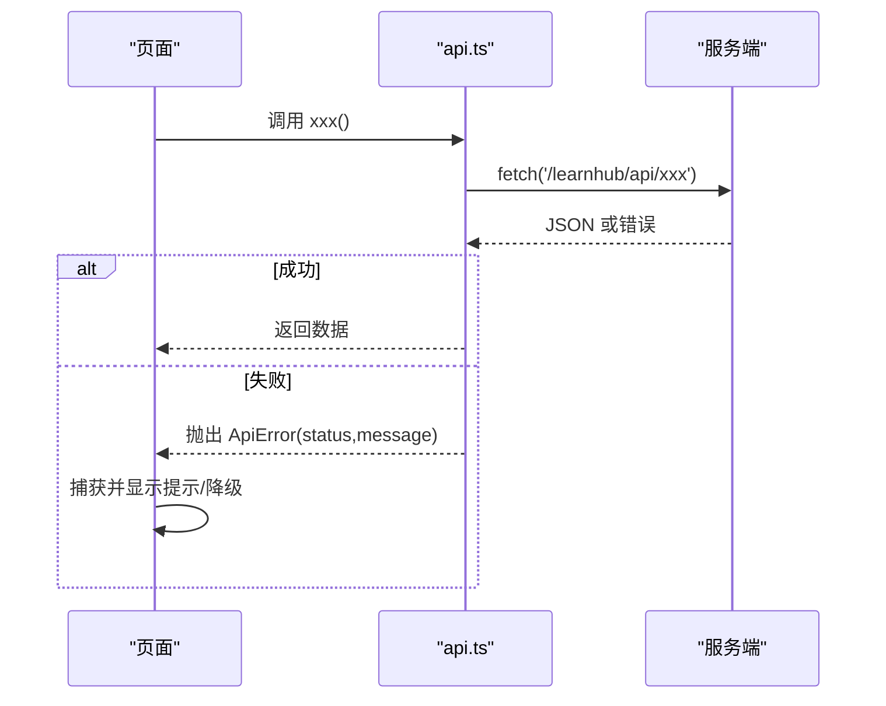
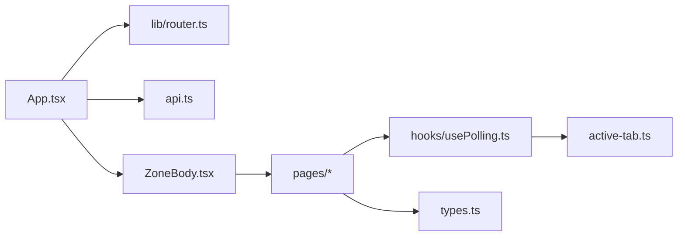

# 前端架构

<cite>
**本文引用的文件**
- [main.tsx](file://ui/src/main.tsx)
- [App.tsx](file://ui/src/App.tsx)
- [router.ts](file://ui/src/lib/router.ts)
- [api.ts](file://ui/src/api.ts)
- [types.ts](file://ui/src/types.ts)
- [ZoneBody.tsx](file://ui/src/components/ZoneBody.tsx)
- [usePolling.ts](file://ui/src/hooks/usePolling.ts)
- [active-tab.ts](file://ui/src/active-tab.ts)
- [settle-context.ts](file://ui/src/lib/settle-context.ts)
- [widget-bus.tsx](file://ui/src/components/widget-bus.tsx)
- [index.tsx（今日）](file://ui/src/pages/TodayPage/index.tsx)
- [index.tsx（工作台）](file://ui/src/pages/WorkbenchPage/index.tsx)
- [package.json](file://ui/package.json)
</cite>

## 目录
1. [简介](#简介)
2. [项目结构](#项目结构)
3. [核心组件](#核心组件)
4. [架构总览](#架构总览)
5. [详细组件分析](#详细组件分析)
6. [依赖关系分析](#依赖关系分析)
7. [性能考虑](#性能考虑)
8. [故障排查指南](#故障排查指南)
9. [结论](#结论)
10. [附录](#附录)

## 简介
本文件面向 LearnHub 前端应用，系统性阐述基于 React + TypeScript 的架构设计：组件层次与职责划分、路由与导航机制、状态管理策略、与后端的通信方式、UI 组件库与自定义组件规范，以及开发最佳实践。文档以代码为依据，提供可视化图示与可操作的排障建议，帮助读者快速理解并高效扩展前端能力。

## 项目结构
前端位于 ui/src 目录，采用“页面-组件-工具”的分层组织：
- 入口与壳：main.tsx 初始化 React 根节点与国际化配置；App.tsx 负责全局状态、主题、路由桥接与顶层布局。
- 路由：lib/router.ts 实现极简 hash 路由，统一视图键、区键与工作台面参数段解析与同步。
- 数据与 API：api.ts 封装所有后端接口调用与错误处理；types.ts 集中类型定义，从引擎与宿主模块派生，避免手工镜像。
- 保活与轮询：components/ZoneBody.tsx 实现视图级 keep-alive；hooks/usePolling.ts 提供页签激活门控的轮询钩子；active-tab.ts 维护当前激活视图信号。
- 页面：pages/* 按业务域组织（今日、课程、工作区、洞察、项目、实践等），通过 ZoneBody 按需挂载。
- 交互与上下文：lib/settle-context.ts 提供交互件成绩结算上下文；components/widget-bus.tsx 提供跨 iframe 的广播总线。

**图表来源**
- [main.tsx:1-16](file://ui/src/main.tsx#L1-L16)
- [App.tsx:1-180](file://ui/src/App.tsx#L1-L180)
- [router.ts:1-164](file://ui/src/lib/router.ts#L1-L164)
- [api.ts:1-370](file://ui/src/api.ts#L1-L370)
- [types.ts:1-93](file://ui/src/types.ts#L1-L93)
- [ZoneBody.tsx:1-43](file://ui/src/components/ZoneBody.tsx#L1-L43)
- [usePolling.ts:1-48](file://ui/src/hooks/usePolling.ts#L1-L48)
- [active-tab.ts:1-38](file://ui/src/active-tab.ts#L1-L38)
- [settle-context.ts:1-9](file://ui/src/lib/settle-context.ts#L1-L9)
- [widget-bus.tsx:1-50](file://ui/src/components/widget-bus.tsx#L1-L50)
- [index.tsx（今日）:1-200](file://ui/src/pages/TodayPage/index.tsx#L1-L200)
- [index.tsx（工作台）:1-85](file://ui/src/pages/WorkbenchPage/index.tsx#L1-L85)

**章节来源**
- [main.tsx:1-16](file://ui/src/main.tsx#L1-L16)
- [App.tsx:1-180](file://ui/src/App.tsx#L1-L180)
- [router.ts:1-164](file://ui/src/lib/router.ts#L1-L164)
- [ZoneBody.tsx:1-43](file://ui/src/components/ZoneBody.tsx#L1-L43)

## 核心组件
- App 壳：维护全局状态（课程树、当前课程、学习视图定位、任务焦点）、加载与致命错误态、主题切换、路由事件回灌与规范化、教练通知跳转。对外暴露 frame 对象供各区域共享。
- 路由系统：以 location.hash 为权威，定义区键、课程区子路由、工作台分栏、视图键及转换函数；提供 navigate/navigateCourse/syncHash/onRouteChange 等程序化与订阅能力。
- 视图保活容器：根据访问历史保留已访问视图实例，隐藏时不卸载，结合 active-tab 与 usePolling 控制后台轮询。
- 轮询钩子：统一 setInterval + isActiveTab 门控，支持切回补取、空闲降频、卸载清理。
- API 客户端：统一 fetch 封装、错误抛出 ApiError、查询参数构建、全部后端端点方法。
- 类型体系：集中 re-export 引擎视图类型，从命令注册表与宿主模块派生响应类型，避免手工镜像。

**章节来源**
- [App.tsx:1-180](file://ui/src/App.tsx#L1-L180)
- [router.ts:1-164](file://ui/src/lib/router.ts#L1-L164)
- [ZoneBody.tsx:1-43](file://ui/src/components/ZoneBody.tsx#L1-L43)
- [usePolling.ts:1-48](file://ui/src/hooks/usePolling.ts#L1-L48)
- [api.ts:1-370](file://ui/src/api.ts#L1-L370)
- [types.ts:1-93](file://ui/src/types.ts#L1-L93)

## 架构总览
下图展示从入口到页面渲染、路由与数据流的关键路径：

**图表来源**
- [main.tsx:1-16](file://ui/src/main.tsx#L1-L16)
- [App.tsx:1-180](file://ui/src/App.tsx#L1-L180)
- [router.ts:1-164](file://ui/src/lib/router.ts#L1-L164)
- [ZoneBody.tsx:1-43](file://ui/src/components/ZoneBody.tsx#L1-L43)
- [api.ts:1-370](file://ui/src/api.ts#L1-L370)

## 详细组件分析

### 路由与导航
- 视图键与区键：五区页签（今日、课程、洞察、项目、实践），课程区含三入口（我的课程、生成队列、提案收件箱），单课工作台以参数段 #/course/<id>/ 表示。
- 解析与同步：parseHash 将 hash 解析为 Route；viewOfRoute/routeOfView 在视图键与路由间转换；syncHash 保证 URL 与视图一致且不产生多余历史条目。
- 程序化导航：navigate 用于非参数化视图；navigateCourse 用于工作台参数段跳转；onRouteChange 订阅 hashchange 并回灌视图。

**图表来源**
- [router.ts:72-164](file://ui/src/lib/router.ts#L72-L164)

**章节来源**
- [router.ts:1-164](file://ui/src/lib/router.ts#L1-L164)
- [App.tsx:47-117](file://ui/src/App.tsx#L47-L117)

### 页面与组件层次
- 顶层：App 提供 frame（状态、导航、课程/学习定位、刷新等）。
- 区域容器：ZoneBody 维护 visited 集合，实现 keep-alive；仅对当前 view 加活动样式。
- 页面组件：
  - 今日：推荐流、复习会话、供给卡、闸门计数、笔记源抽屉、我的卡管理等。
  - 单课工作台：分栏（罗盘与图、教练台、生长与队列、提案、题库），统一轮询生成任务注册表。
- 通用组件：CommandBoundary、HelpDrawer、PracticeFlow、MdView 等（由页面组合使用）。

**图表来源**
- [App.tsx:17-38](file://ui/src/App.tsx#L17-L38)
- [ZoneBody.tsx:21-43](file://ui/src/components/ZoneBody.tsx#L21-L43)
- [index.tsx（今日）:1-200](file://ui/src/pages/TodayPage/index.tsx#L1-L200)
- [index.tsx（工作台）:1-85](file://ui/src/pages/WorkbenchPage/index.tsx#L1-L85)

**章节来源**
- [App.tsx:1-180](file://ui/src/App.tsx#L1-L180)
- [ZoneBody.tsx:1-43](file://ui/src/components/ZoneBody.tsx#L1-L43)
- [index.tsx（今日）:1-200](file://ui/src/pages/TodayPage/index.tsx#L1-L200)
- [index.tsx（工作台）:1-85](file://ui/src/pages/WorkbenchPage/index.tsx#L1-L85)

### 状态管理策略
- 本地状态：页面内 useState 管理短期 UI 状态（如抽屉开关、会话卡片集、供给快照）。
- 全局状态：App 中 status/tree/course/lesson/focusNode/focusJob/loading/fatal 作为跨页面共享的框架态，通过 frame 向下传递。
- 异步状态：通过 api.* 发起请求，使用 useCommand（页面内封装）或手动 setState 管理 loading/error/data；失败时降级为空或提示。
- 轮询与保活：usePolling 结合 active-tab 的 isActiveTab 门控，仅在激活页签执行取数；切回时立即补取；隐藏时仅保留节拍降低开销。
- 上下文与总线：SettleContext 提供交互件结算所需上下文；WidgetBus 提供跨 iframe 的广播通道，用于 AI 老师动作（高亮/揭示/批注等）。

**图表来源**
- [usePolling.ts:1-48](file://ui/src/hooks/usePolling.ts#L1-L48)
- [active-tab.ts:1-38](file://ui/src/active-tab.ts#L1-L38)
- [api.ts:1-370](file://ui/src/api.ts#L1-L370)

**章节来源**
- [App.tsx:47-117](file://ui/src/App.tsx#L47-L117)
- [usePolling.ts:1-48](file://ui/src/hooks/usePolling.ts#L1-L48)
- [active-tab.ts:1-38](file://ui/src/active-tab.ts#L1-L38)
- [settle-context.ts:1-9](file://ui/src/lib/settle-context.ts#L1-L9)
- [widget-bus.tsx:1-50](file://ui/src/components/widget-bus.tsx#L1-L50)

### 与后端的通信机制
- 统一客户端：api.ts 提供 http 封装，自动序列化 body、设置 content-type、解析 JSON、非 2xx 抛 ApiError。
- 端点覆盖：涵盖状态、课程树、图谱、罗盘、推荐、复习队列、问答作答/评分/忘记、申诉复核与应用、难度带日志、教练、节点跳过/置顶/完成、生成队列、Anki 通道、FSRS 优化、记忆健康、周复盘、项目、技能与习惯、实验、沙盘等。
- 实时数据更新：通过 usePolling 周期性拉取生成队列、提案计数、供给快照等；切回事件触发即时补取。
- 错误处理：ApiError 携带 HTTP 状态与消息；页面侧用 errorMessage 提取可读信息并提示；关键主数据失败导致页面失败态，次要数据失败降级为空。

**图表来源**
- [api.ts:13-32](file://ui/src/api.ts#L13-L32)
- [api.ts:43-353](file://ui/src/api.ts#L43-L353)

**章节来源**
- [api.ts:1-370](file://ui/src/api.ts#L1-L370)
- [index.tsx（今日）:74-118](file://ui/src/pages/TodayPage/index.tsx#L74-L118)

### UI 组件库与自定义规范
- UI 库：基于 @arco-design/web-react，提供按钮、空态、结果、Spin、Tabs、Card、Space、Typography 等基础控件；通过 ConfigProvider 注入中文语言包。
- 主题：App 维护 light/dark 主题，写入 arco-theme 属性并持久化至 localStorage。
- 自定义组件：
  - ZoneBody：视图保活容器，按 visited 集合渲染页面。
  - WidgetBus：iframe 与面板间的消息总线，支持注册发送器与广播动作。
  - SettleContext：为 PracticeFlow 与 InteractiveBlock 提供结算上下文。
- 规范：组件职责单一、通过 props/context 传递必要数据；复杂交互通过 Context/Bus 解耦；类型优先，尽量复用 types.ts 中的导出类型。

**章节来源**
- [main.tsx:1-16](file://ui/src/main.tsx#L1-L16)
- [App.tsx:119-128](file://ui/src/App.tsx#L119-L128)
- [ZoneBody.tsx:1-43](file://ui/src/components/ZoneBody.tsx#L1-L43)
- [widget-bus.tsx:1-50](file://ui/src/components/widget-bus.tsx#L1-L50)
- [settle-context.ts:1-9](file://ui/src/lib/settle-context.ts#L1-L9)

### 开发示例与最佳实践
- 新增页面：
  - 在 pages 下创建页面组件，接收 frame 与必要参数。
  - 在 ZoneBody 中添加分支映射，确保 VIEW_KEYS 与路由表一致。
  - 如需轮询，使用 usePolling(tab: ViewKey, intervalMs)。
- 路由跳转：
  - 非参数化视图使用 navigate(viewKey)。
  - 单课工作台使用 navigateCourse(courseId, wb)。
  - 监听路由变化使用 onRouteChange。
- 数据获取：
  - 通过 api.* 调用，注意错误捕获与降级。
  - 主数据失败应置页面失败态；次要数据失败保持空态。
- 类型使用：
  - 优先从 types.ts 导入导出类型，避免重复定义。
  - 响应类型从命令注册表或宿主模块派生，减少手工镜像。

[本节为概念性指导，不直接分析具体文件]

## 依赖关系分析
- 模块耦合：
  - App 依赖 router、api、active-tab、ZoneBody 与各页面。
  - ZoneBody 依赖 router 的 VIEW_KEYS 与各页面组件。
  - 页面组件依赖 api、usePolling、active-tab、types。
- 外部依赖：
  - React/ReactDOM 运行时。
  - Arco Design 组件库与样式。
  - 可视化与数学库（dagre、xyflow、echarts、katex、mathjs、mermaid、mafs）。
  - Markdown 渲染（react-markdown、rehype-katex、remark-gfm、remark-math）。

**图表来源**
- [App.tsx:1-180](file://ui/src/App.tsx#L1-L180)
- [router.ts:1-164](file://ui/src/lib/router.ts#L1-L164)
- [api.ts:1-370](file://ui/src/api.ts#L1-L370)
- [ZoneBody.tsx:1-43](file://ui/src/components/ZoneBody.tsx#L1-L43)
- [usePolling.ts:1-48](file://ui/src/hooks/usePolling.ts#L1-L48)
- [active-tab.ts:1-38](file://ui/src/active-tab.ts#L1-L38)
- [types.ts:1-93](file://ui/src/types.ts#L1-L93)

**章节来源**
- [package.json:1-48](file://ui/package.json#L1-L48)
- [App.tsx:1-180](file://ui/src/App.tsx#L1-L180)
- [ZoneBody.tsx:1-43](file://ui/src/components/ZoneBody.tsx#L1-L43)

## 性能考虑
- 视图保活：ZoneBody 保留已访问视图实例，避免频繁重建；隐藏视图通过 active-tab 门控减少无效请求。
- 轮询节流：usePolling 在非激活页签仅保留定时器节拍，降低网络与 CPU 占用；支持自定义延迟与空闲模式。
- 路由规范化：syncHash 使用 replaceState，避免多余历史条目；工作台参数段独立于视图键，减少不必要的重渲染。
- 资源加载：Arco 语言包按需引入，避免全量 locale；第三方库按需使用（如图谱、图表、数学公式）。

[本节提供通用指导，不直接分析具体文件]

## 故障排查指南
- 加载失败：
  - 检查 App 的 fatal 状态与重试逻辑；确认 api.status/coursesTree 是否可达。
  - 参考：[App.tsx:62-79](file://ui/src/App.tsx#L62-L79)、[App.tsx:130-140](file://ui/src/App.tsx#L130-L140)
- 路由漂移：
  - 若 URL 与视图不一致，检查 syncHash 与 onRouteChange；确认 navigate/navigateCourse 调用是否正确。
  - 参考：[router.ts:145-164](file://ui/src/lib/router.ts#L145-L164)、[App.tsx:102-117](file://ui/src/App.tsx#L102-L117)
- 轮询不生效：
  - 确认 usePolling 的 tab 与 active-tab 的 setActiveTab 同步；检查 isActiveTab 门控与 learnhub:tab 事件。
  - 参考：[usePolling.ts:15-47](file://ui/src/hooks/usePolling.ts#L15-L47)、[active-tab.ts:15-27](file://ui/src/active-tab.ts#L15-L27)
- API 错误：
  - 捕获 ApiError，查看 status 与 message；必要时降级为空数据并提示。
  - 参考：[api.ts:13-32](file://ui/src/api.ts#L13-L32)
- 交互件无结算：
  - 检查 SettleContext 是否提供 course/node/sectionId；确认 LEARNHUB_COMPLETE 事件与 settle 调用。
  - 参考：[settle-context.ts:1-9](file://ui/src/lib/settle-context.ts#L1-L9)

**章节来源**
- [App.tsx:62-140](file://ui/src/App.tsx#L62-L140)
- [router.ts:145-164](file://ui/src/lib/router.ts#L145-L164)
- [usePolling.ts:15-47](file://ui/src/hooks/usePolling.ts#L15-L47)
- [active-tab.ts:15-27](file://ui/src/active-tab.ts#L15-L27)
- [api.ts:13-32](file://ui/src/api.ts#L13-L32)
- [settle-context.ts:1-9](file://ui/src/lib/settle-context.ts#L1-L9)

## 结论
LearnHub 前端以 React + TypeScript 为基础，采用“路由即权威、视图保活、轮询门控、类型集中”的设计，实现了清晰的组件分层与稳定的数据流。通过统一的 API 客户端与错误处理、灵活的轮询与上下文机制，支撑了多业务域的页面与交互。遵循本文档的规范与实践，可高效扩展新功能并保持系统一致性。

## 附录
- 技术栈概览：React 18、TypeScript、Vite、Arco Design、ECharts、Mermaid、KaTeX、MathJS、XYFlow/Dagre 等。
- 脚本与构建：dev/build/typecheck/lint 等命令位于 package.json。

**章节来源**
- [package.json:1-48](file://ui/package.json#L1-L48)