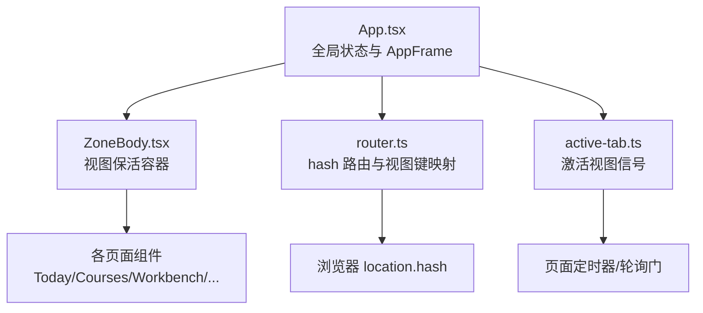
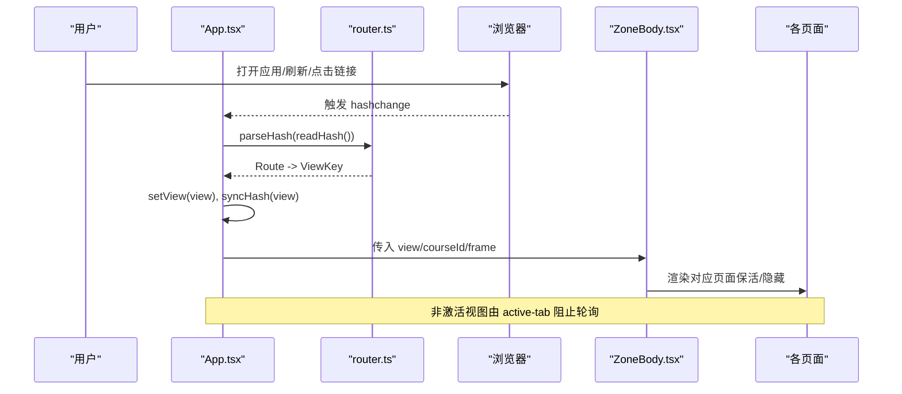
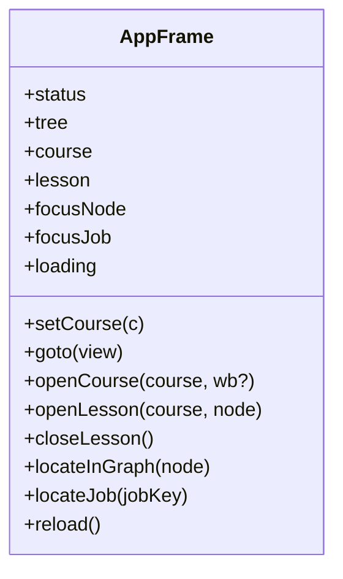
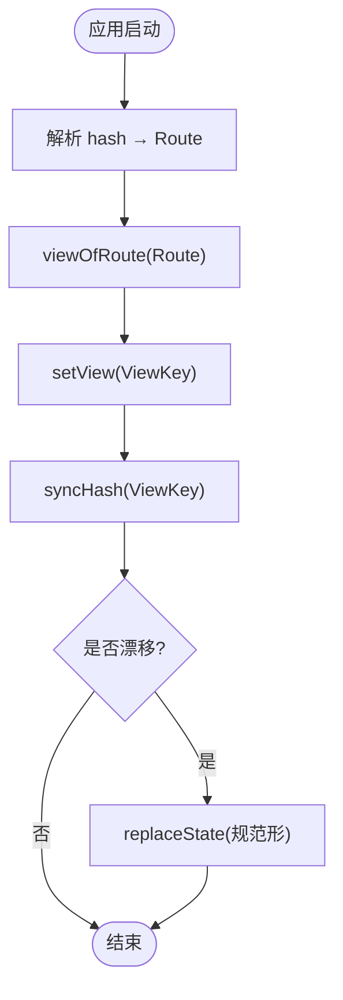
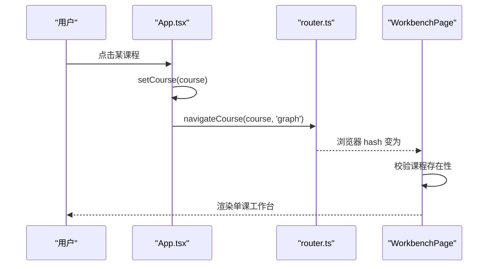
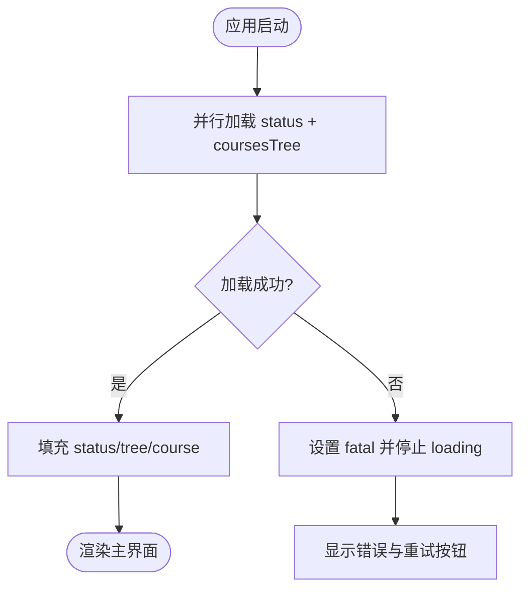
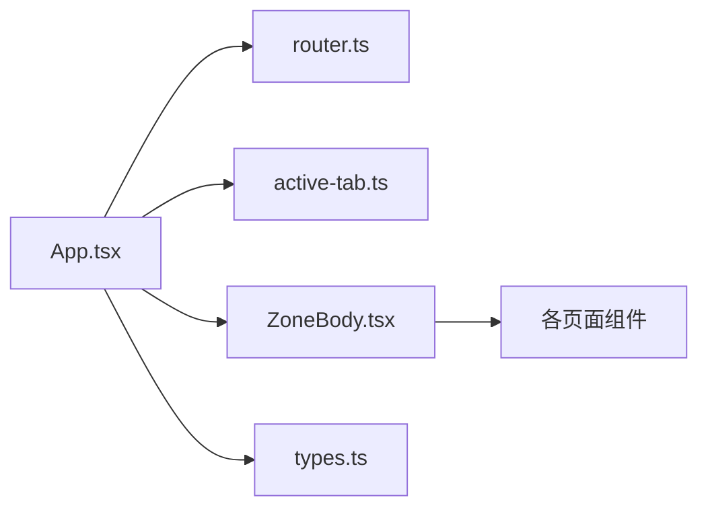

# 全局应用框架状态

<cite>
**本文引用的文件**
- [App.tsx](file://ui/src/App.tsx)
- [router.ts](file://ui/src/lib/router.ts)
- [active-tab.ts](file://ui/src/active-tab.ts)
- [ZoneBody.tsx](file://ui/src/components/ZoneBody.tsx)
- [types.ts](file://ui/src/types.ts)
- [WorkbenchPage/index.tsx](file://ui/src/pages/WorkbenchPage/index.tsx)
- [ui-router.test.ts](file://tests/ui-router.test.ts)
</cite>

## 目录
1. [简介](#简介)
2. [项目结构](#项目结构)
3. [核心组件](#核心组件)
4. [架构总览](#架构总览)
5. [详细组件分析](#详细组件分析)
6. [依赖关系分析](#依赖关系分析)
7. [性能考量](#性能考量)
8. [故障排查指南](#故障排查指南)
9. [结论](#结论)
10. [附录：使用示例与最佳实践](#附录使用示例与最佳实践)

## 简介
本文件面向 LearnHub 的全局应用框架状态，围绕 AppFrame 接口的设计理念与实现细节展开，系统阐述课程信息、学习视图、焦点节点与任务状态的统一管理方式；说明状态生命周期（初始加载、数据同步、错误处理）；解释路由状态与全局状态的同步机制（URL hash 管理与视图切换逻辑）；说明课程上下文管理（当前课程选择、课程树维护、导航状态）；并给出原子性更新与并发安全的考虑、具体使用示例与最佳实践。

## 项目结构
LearnHub 的前端采用 React 单页应用，通过极简的 hash 路由驱动视图切换，App 组件集中维护全局共享状态（AppFrame），并通过 ZoneBody 容器按“已访问视图”保活页面，结合 active-tab 信号控制后台轮询。

图表来源
- [App.tsx:47-179](file://ui/src/App.tsx#L47-L179)
- [ZoneBody.tsx:1-43](file://ui/src/components/ZoneBody.tsx#L1-L43)
- [router.ts:1-164](file://ui/src/lib/router.ts#L1-L164)
- [active-tab.ts:1-38](file://ui/src/active-tab.ts#L1-L38)

章节来源
- [App.tsx:47-179](file://ui/src/App.tsx#L47-L179)
- [ZoneBody.tsx:1-43](file://ui/src/components/ZoneBody.tsx#L1-L43)
- [router.ts:1-164](file://ui/src/lib/router.ts#L1-L164)
- [active-tab.ts:1-38](file://ui/src/active-tab.ts#L1-L38)

## 核心组件
- AppFrame 接口：定义全局共享态与操作入口，包括 status、tree、course、lesson、focusNode、focusJob 以及 setCourse、goto、openCourse、openLesson、closeLesson、locateInGraph、locateJob、reload、loading。
- 路由模块 router.ts：提供 hash 解析、视图键映射、程序化跳转、URL 规范化与路由变化订阅。
- 激活信号 active-tab.ts：维护当前激活视图键，供各页面根据可见性决定是否发起轮询。
- 视图容器 ZoneBody.tsx：基于“已访问视图集合”保活页面，隐藏时不卸载但可跳过取数。
- 类型 types.ts：统一导出引擎视图类型与宿主返回类型，避免 UI 层手工镜像。

章节来源
- [App.tsx:18-38](file://ui/src/App.tsx#L18-L38)
- [router.ts:24-68](file://ui/src/lib/router.ts#L24-L68)
- [active-tab.ts:1-38](file://ui/src/active-tab.ts#L1-L38)
- [ZoneBody.tsx:1-43](file://ui/src/components/ZoneBody.tsx#L1-L43)
- [types.ts:1-93](file://ui/src/types.ts#L1-L93)

## 架构总览
App 作为根组件，负责：
- 初始化：从 URL hash 解析视图键，并行拉取 /status 与 /coursesTree，填充 status 与 tree，并回退到首个可用课程。
- 路由同步：监听 hashchange，将外部导航（前进/后退/手改 hash/旧深链）回灌为渲染态 view 与 courseId；同时用 syncHash 将非法或漂移的 hash 规范化。
- 视图保活：通过 setActiveTab 桥接路由变化到 active-tab，使非激活视图的轮询自动跳过。
- 课程上下文：维护 course、lesson、focusNode、focusJob，并提供 openCourse/openLesson/closeLesson/locateInGraph/locateJob 等统一入口。
- 错误处理：在首次加载失败时设置 fatal，提供重试入口。

图表来源
- [App.tsx:47-117](file://ui/src/App.tsx#L47-L117)
- [router.ts:72-163](file://ui/src/lib/router.ts#L72-L163)
- [ZoneBody.tsx:21-43](file://ui/src/components/ZoneBody.tsx#L21-L43)

## 详细组件分析

### AppFrame 接口与全局状态
- 设计目标：以单一对象对外暴露全局状态与能力，避免跨组件传递大量 props；所有页面通过 frame 访问课程、学习视图、焦点定位与任务定位。
- 字段语义：
  - status：当前系统状态（含 LLM 配置等）。
  - tree：课程树（用于校验课程存在性与导航）。
  - course：当前课程名（单课工作台上下文）。
  - lesson：当前学习视图（课程+节点）。
  - focusNode：图页高亮目标节点。
  - focusJob：生成队列中需要定位的任务 key。
- 方法语义：
  - goto：跳转到指定视图键（非参数化视图）。
  - openCourse：进入单课工作台（写完整参数段 hash，并预置 course）。
  - openLesson/closeLesson：打开/关闭学习视图。
  - locateInGraph：跳到单课工作台的图分栏并高亮节点。
  - locateJob：跳到生成队列并定位任务。
  - reload：重新拉取 status 与 tree。
  - loading：首屏加载标志。

图表来源
- [App.tsx:18-38](file://ui/src/App.tsx#L18-L38)
- [App.tsx:142-157](file://ui/src/App.tsx#L142-L157)

章节来源
- [App.tsx:18-38](file://ui/src/App.tsx#L18-L38)
- [App.tsx:142-157](file://ui/src/App.tsx#L142-L157)

### 路由状态与全局状态同步（URL hash 管理）
- 权威源：location.hash 是导航状态的唯一权威。App 在挂载时从 hash 解析视图键，并在每次视图变化时用 syncHash 规范化 URL。
- 视图键体系：
  - 区键：today、courses、insight、projects、practice。
  - 课程区子路由：home、queue、proposals。
  - 单课工作台：#/course/<id>/<wb>，其中 wb ∈ graph/coach/queue/proposals/bank。
  - 视图键 VIEW_KEYS 包含 courses.course（参数化工作台整体一个视图键）。
- 关键函数：
  - readHash/parseHash：读取与解析 hash。
  - viewOfRoute/routeOfView：视图键与路由的双向映射。
  - navigate/navigateCourse：程序化跳转（前者仅非参数化视图，后者写完整参数段）。
  - syncHash：仅在漂移时 replaceState，避免多余历史条目。
  - onRouteChange：订阅 hashchange，回调视图键。
- 双向同步：
  - 内部跳转 → navigate/navigateCourse → 浏览器 hash 变化 → hashchange → App 回调 setView/syncHash。
  - 外部导航（前进/后退/手改 hash/旧深链）→ hashchange → App 回调 setView/syncHash。

图表来源
- [router.ts:72-163](file://ui/src/lib/router.ts#L72-L163)
- [App.tsx:47-117](file://ui/src/App.tsx#L47-L117)

章节来源
- [router.ts:1-164](file://ui/src/lib/router.ts#L1-L164)
- [App.tsx:47-117](file://ui/src/App.tsx#L47-L117)
- [ui-router.test.ts:104-132](file://tests/ui-router.test.ts#L104-L132)

### 课程上下文管理（当前课程、课程树、导航）
- 课程树维护：App 在首次加载时并行获取 status 与 coursesTree，若当前课程不存在则回退到第一门启用课程。
- 当前课程选择：
  - openCourse 会设置 course 并写入参数段 hash（#/course/<id>/<wb>）。
  - WorkbenchPage 根据 courseId 校验课程是否存在，不存在则提示并引导返回我的课程。
- 导航状态：
  - 单课工作台内部分栏切换通过 navigateCourse 写完整 hash，保证前进/后退在分栏间穿梭。
  - 非参数化视图通过 navigate 跳转，保持 URL 简洁。

图表来源
- [App.tsx:92-96](file://ui/src/App.tsx#L92-L96)
- [router.ts:140-143](file://ui/src/lib/router.ts#L140-L143)
- [WorkbenchPage/index.tsx:54-73](file://ui/src/pages/WorkbenchPage/index.tsx#L54-L73)

章节来源
- [App.tsx:62-96](file://ui/src/App.tsx#L62-L96)
- [WorkbenchPage/index.tsx:54-73](file://ui/src/pages/WorkbenchPage/index.tsx#L54-L73)

### 状态生命周期管理（初始加载、数据同步、错误处理）
- 初始加载：
  - useEffect 调用 reload，Promise.all 并行请求 status 与 coursesTree。
  - 成功：填充 status/tree，修正 course（回退到首个可用课程），清除 fatal，停止 loading。
  - 失败：设置 fatal 消息，保留 loading=false，提供重试按钮。
- 数据同步：
  - 路由变化时通过 onRouteChange 回灌 view 与 courseId，并用 syncHash 规范化 URL。
  - 视图切换时通过 setActiveTab 通知 active-tab，非激活视图跳过轮询。
- 错误处理：
  - 首次加载失败显示 Result 错误界面，支持重试。
  - 单课工作台对无效课程进行守卫，提示并引导返回。

图表来源
- [App.tsx:62-81](file://ui/src/App.tsx#L62-L81)
- [App.tsx:130-139](file://ui/src/App.tsx#L130-L139)

章节来源
- [App.tsx:62-81](file://ui/src/App.tsx#L62-L81)
- [App.tsx:130-139](file://ui/src/App.tsx#L130-L139)

### 视图保活与轮询门
- 保活容器 ZoneBody 维护 visited 集合，已访问过的视图不会卸载，从而保留页内状态（如练习会话）。
- active-tab 维护当前激活视图键，非激活视图的轮询据此跳过，减少不必要网络请求。
- 视图键与路由表严格对齐，测试用例保障一致性。

章节来源
- [ZoneBody.tsx:1-43](file://ui/src/components/ZoneBody.tsx#L1-L43)
- [active-tab.ts:1-38](file://ui/src/active-tab.ts#L1-L38)
- [ui-router.test.ts:104-132](file://tests/ui-router.test.ts#L104-L132)

## 依赖关系分析
- App.tsx 依赖 router.ts 提供路由解析与跳转能力，依赖 active-tab.ts 提供激活信号，依赖 ZoneBody.tsx 渲染视图。
- 各页面组件通过 frame 访问全局状态，形成松耦合的依赖关系。
- 类型 types.ts 集中导出引擎与宿主类型，避免重复定义。

图表来源
- [App.tsx:1-12](file://ui/src/App.tsx#L1-L12)
- [ZoneBody.tsx:8-19](file://ui/src/components/ZoneBody.tsx#L8-L19)
- [types.ts:1-93](file://ui/src/types.ts#L1-L93)

章节来源
- [App.tsx:1-12](file://ui/src/App.tsx#L1-L12)
- [ZoneBody.tsx:8-19](file://ui/src/components/ZoneBody.tsx#L8-L19)
- [types.ts:1-93](file://ui/src/types.ts#L1-L93)

## 性能考量
- 并行加载：status 与 coursesTree 使用 Promise.all 并行请求，缩短首屏时间。
- 视图保活：已访问视图不卸载，避免重复初始化开销。
- 轮询门：非激活视图跳过取数，降低后台负载。
- URL 规范化：仅在漂移时 replaceState，避免无意义历史条目与事件风暴。

[本节为通用性能建议，不直接分析具体代码文件]

## 故障排查指南
- 首屏加载失败：检查 /status 与 /coursesTree 接口可用性；查看 fatal 消息；点击重试。
- 课程不存在：确认课程树中是否存在该课程；WorkbenchPage 会提示并引导返回我的课程。
- 路由异常：检查 hash 是否符合规范；必要时手动修正为规范形（如 #/courses、#/course/<id>/<wb>）。
- 视图未刷新：确认 onRouteChange 是否正确注册；检查 syncHash 是否被调用。

章节来源
- [App.tsx:130-139](file://ui/src/App.tsx#L130-L139)
- [WorkbenchPage/index.tsx:54-73](file://ui/src/pages/WorkbenchPage/index.tsx#L54-L73)
- [router.ts:145-156](file://ui/src/lib/router.ts#L145-L156)

## 结论
LearnHub 的全局应用框架状态以 AppFrame 为核心，结合极简 hash 路由与视图保活机制，实现了课程信息、学习视图、焦点节点与任务状态的统一管理。通过严格的视图键体系与 URL 规范化，保证了路由与全局状态的一致性；通过并行加载与轮询门优化了性能；通过错误处理与课程守卫提升了健壮性。遵循本文的最佳实践，可在扩展新视图或功能时保持一致性与可维护性。

[本节为总结性内容，不直接分析具体代码文件]

## 附录：使用示例与最佳实践

### 使用示例
- 进入单课工作台并高亮节点：
  - 调用 frame.openCourse('数学', 'graph')，然后 frame.locateInGraph('入门')。
- 打开学习视图：
  - 调用 frame.openLesson('数学', '入门')，页面切换到今日视图并聚焦该课程节点。
- 定位生成队列中的任务：
  - 调用 frame.locateJob('数学/节点A')，跳转到生成队列并高亮该任务。
- 程序化跳转（非参数化视图）：
  - 调用 frame.goto('insight')，URL 变为 #/insight。

章节来源
- [App.tsx:92-96](file://ui/src/App.tsx#L92-L96)
- [App.tsx:147-154](file://ui/src/App.tsx#L147-L154)
- [router.ts:136-143](file://ui/src/lib/router.ts#L136-L143)

### 最佳实践
- 始终通过 frame 访问全局状态，避免直接操作 window.location 或分散的状态变量。
- 使用 navigateCourse 进入单课工作台，确保 URL 包含完整参数段。
- 在页面中优先使用 onTabActive 钩子处理切回时的取数逻辑，避免重复请求。
- 遇到课程不存在或路由异常时，提供明确的用户反馈与回退路径。
- 新增视图键时，同步更新 VIEW_KEYS、ZONE_KEYS、COURSE_SUBS 与 WORKBENCH_SUBS，并确保测试覆盖。

[本节为通用指导，不直接分析具体代码文件]