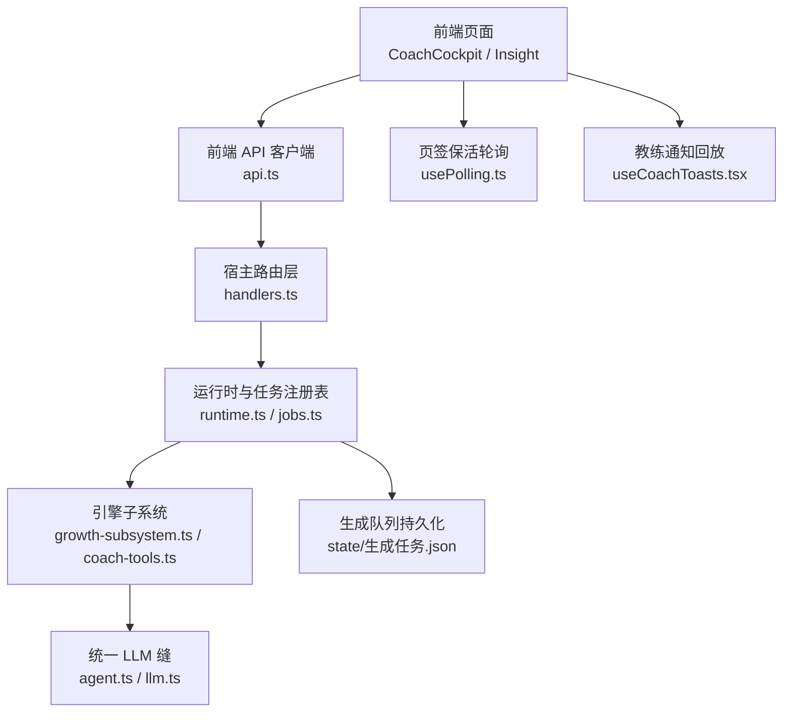
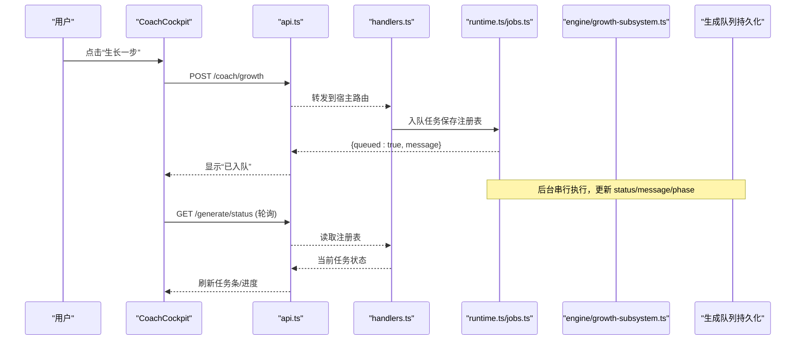
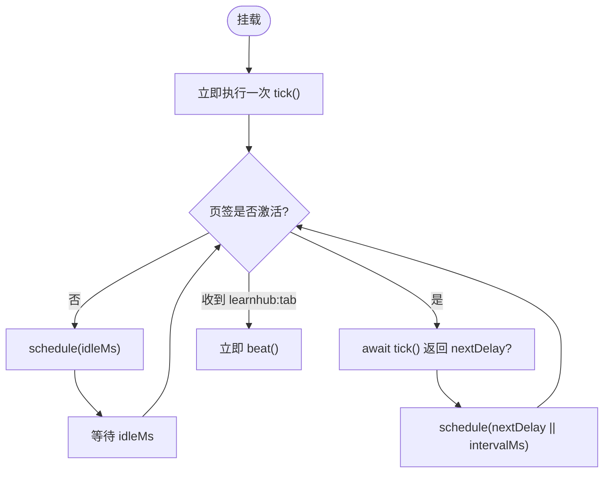
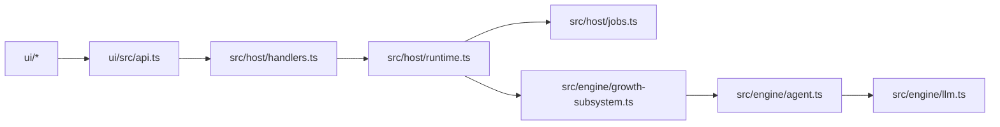

# 异步状态同步

<cite>
**本文引用的文件**
- [usePolling.ts](file://ui/src/hooks/usePolling.ts)
- [api.ts](file://ui/src/api.ts)
- [runtime.ts](file://src/host/runtime.ts)
- [jobs.ts](file://src/host/jobs.ts)
- [handlers.ts](file://src/host/handlers.ts)
- [agent.ts](file://src/engine/agent.ts)
- [llm.ts](file://src/engine/llm.ts)
- [CoachCockpit.tsx](file://ui/src/components/CoachCockpit.tsx)
- [useCoachToasts.tsx](file://ui/src/useCoachToasts.tsx)
- [growth-subsystem.ts](file://src/engine/growth-subsystem.ts)
- [coach-tools.ts](file://src/engine/coach-tools.ts)
- [MemoryHealth.tsx](file://ui/src/pages/InsightPage/MemoryHealth.tsx)
</cite>

## 目录
1. [简介](#简介)
2. [项目结构](#项目结构)
3. [核心组件](#核心组件)
4. [架构总览](#架构总览)
5. [详细组件分析](#详细组件分析)
6. [依赖关系分析](#依赖关系分析)
7. [性能考量](#性能考量)
8. [故障排查指南](#故障排查指南)
9. [结论](#结论)
10. [附录：常见异步场景与最佳实践](#附录：常见异步场景与最佳实践)

## 简介
本文件面向 LearnHub 的“异步状态同步机制”，聚焦前后端数据同步策略（API 调用、轮询与实时更新）、错误处理与重试、教练通知系统（任务生命周期跟踪与消息推送）、轮询优化（智能间隔与条件轮询），以及异步状态管理的最佳实践（避免竞态、防止内存泄漏、性能优化）。文档以代码为依据，提供可视化图示与可追溯的来源定位。

## 项目结构
LearnHub 的前端通过统一的 API 客户端访问宿主提供的 HTTP 接口；后端将长耗时或后台任务入队执行，并通过“生成队列”持久化任务注册表，前端以页签保活轮询拉取最新状态。教练通知系统基于任务终态回放与本地水位记录，实现用户友好的提示与跳转。



**图表来源**
- [api.ts:1-370](file://ui/src/api.ts#L1-L370)
- [handlers.ts:169-188](file://src/host/handlers.ts#L169-L188)
- [runtime.ts:46-133](file://src/host/runtime.ts#L46-L133)
- [jobs.ts:30-51](file://src/host/jobs.ts#L30-L51)
- [agent.ts:89-109](file://src/engine/agent.ts#L89-L109)
- [llm.ts:26-56](file://src/engine/llm.ts#L26-L56)
- [usePolling.ts:1-48](file://ui/src/hooks/usePolling.ts#L1-L48)
- [useCoachToasts.tsx:1-38](file://ui/src/useCoachToasts.tsx#L1-L38)

**章节来源**
- [api.ts:1-370](file://ui/src/api.ts#L1-L370)
- [runtime.ts:46-133](file://src/host/runtime.ts#L46-L133)
- [usePolling.ts:1-48](file://ui/src/hooks/usePolling.ts#L1-L48)

## 核心组件
- 前端 API 客户端：封装所有 /learnhub/api/* 请求，统一错误包装与响应解析。
- 页签保活轮询 Hook：按页签激活状态调度定时拉取，支持自定义延迟与切回补取。
- 宿主运行时与任务注册表：承载 engine、agent、jobs、flags，并负责任务持久化与恢复。
- 生成队列与作业处理：任务入队、执行、失败标注与语料补标。
- 统一 LLM 缝：集中管理站点调用、观测面、修复轮与语义档。
- 教练台与通知：图域命令入口、就绪深度展示、任务条与通知回放。

**章节来源**
- [api.ts:13-32](file://ui/src/api.ts#L13-L32)
- [usePolling.ts:15-47](file://ui/src/hooks/usePolling.ts#L15-L47)
- [runtime.ts:118-133](file://src/host/runtime.ts#L118-L133)
- [jobs.ts:30-51](file://src/host/jobs.ts#L30-L51)
- [agent.ts:89-109](file://src/engine/agent.ts#L89-L109)
- [CoachCockpit.tsx:1-253](file://ui/src/components/CoachCockpit.tsx#L1-L253)
- [useCoachToasts.tsx:1-38](file://ui/src/useCoachToasts.tsx#L1-L38)

## 架构总览
前后端通过 REST 进行状态同步：前端发起操作（如生长一步、罗盘重画）后，后端立即返回“已入队”响应，实际工作由宿主队列串行执行，结果写入任务注册表；前端通过 usePolling 周期性拉取队列状态，并在页签切换时即时补取。LLM 相关调用经统一 agent 缝，带观测与修复轮能力。



**图表来源**
- [CoachCockpit.tsx:153-181](file://ui/src/components/CoachCockpit.tsx#L153-L181)
- [api.ts:314-321](file://ui/src/api.ts#L314-L321)
- [handlers.ts:218-301](file://src/host/handlers.ts#L218-L301)
- [runtime.ts:46-133](file://src/host/runtime.ts#L46-L133)
- [jobs.ts:30-51](file://src/host/jobs.ts#L30-L51)

**章节来源**
- [CoachCockpit.tsx:153-181](file://ui/src/components/CoachCockpit.tsx#L153-L181)
- [api.ts:314-321](file://ui/src/api.ts#L314-L321)
- [handlers.ts:218-301](file://src/host/handlers.ts#L218-L301)
- [runtime.ts:46-133](file://src/host/runtime.ts#L46-L133)
- [jobs.ts:30-51](file://src/host/jobs.ts#L30-L51)

## 详细组件分析

### 前端轮询与页签保活（usePolling）
- 挂载即取一次，激活页签按 tick 返回值决定下一次延迟；非激活页签仅保留节拍，idleMs 后重查。
- 监听 learnhub:tab 事件，切回即立即补取，避免隐藏期间错过边沿状态。
- 使用 ref 持有最新 tick，定时器只按 opts 构建一次，减少重建开销。



**图表来源**
- [usePolling.ts:1-48](file://ui/src/hooks/usePolling.ts#L1-L48)

**章节来源**
- [usePolling.ts:1-48](file://ui/src/hooks/usePolling.ts#L1-L48)

### 前端 API 客户端与错误处理（api.ts）
- 统一 http 封装：非 JSON 响应视为错误；非 2xx 抛出 ApiError，携带 status 与可读消息。
- 所有业务方法集中在 api 对象中，便于测试与替换。
- 错误在 UI 层通过 Message.error + errorMessage 呈现，保证用户友好提示。

**章节来源**
- [api.ts:13-32](file://ui/src/api.ts#L13-L32)
- [MemoryHealth.tsx:80-91](file://ui/src/pages/InsightPage/MemoryHealth.tsx#L80-L91)

### 宿主运行时与任务注册表（runtime.ts）
- runtime 显式承载 engine、agent、jobs、flags，避免模块级隐式状态。
- 任务注册表持久化：每次变更全量落盘，重启后恢复，遗留 running 标为失败。
- 运行日志工具：调用成功/失败均记录，便于审计与排障。

**章节来源**
- [runtime.ts:46-133](file://src/host/runtime.ts#L46-L133)
- [runtime.ts:195-253](file://src/host/runtime.ts#L195-L253)

### 生成队列与作业处理（jobs.ts）
- 稳定失败码提取：优先 err.code，否则 ERROR。
- 语料补标：失败时给最近一条捕获追加 outcome/code，作为死因样本。
- 出题站 seam 转发：贯通 station/kind/effort，缺省模型与语义档。

**章节来源**
- [jobs.ts:30-51](file://src/host/jobs.ts#L30-L51)

### 统一 LLM 缝与修复轮（agent.ts / llm.ts）
- 单发 complete 与 repair 共用传输，观测面标记 mode（complete/repair），便于追踪。
- gateRepairRound：first → gate → 未过则 repair 恰一次 → 仍败抛 fatal；受理产物经 result 返回。
- 调用日志包含 station、mode、effort、prompt/reply 长度、耗时与 token 用量。

```mermaid
classDiagram
class AgentSeam {
+complete(station, prompt, opts) Promise~string~
+repair(station, prompt, opts) Promise~string~
+gateRepairRound(station, spec) Promise~{candidate,result,repaired}~
-callSeq Map~string,number~
}
class LlmComplete {
<<interface>>
+(prompt, system?, opts?) Promise~string~
}
AgentSeam --> LlmComplete : "注入端口"
```

**图表来源**
- [agent.ts:89-109](file://src/engine/agent.ts#L89-L109)
- [llm.ts:26-56](file://src/engine/llm.ts#L26-L56)

**章节来源**
- [agent.ts:89-109](file://src/engine/agent.ts#L89-L109)
- [llm.ts:26-56](file://src/engine/llm.ts#L26-L56)

### 教练通知系统（useCoachToasts.tsx / CoachCockpit.tsx）
- 轻轮询 diff 生成任务注册表与复诊清单，把“系统在我的课程上动了手”浮出。
- 通知回放：localStorage 记录 last-seen 消费水位，面板打开首拍补发“关闭期间完成”的终态任务。
- 按钮分流：提案类产物跳“提案收件箱”，过程性任务跳“生成队列”。
- 教练台展示就绪深度、任务条、失败重试入口。

**章节来源**
- [useCoachToasts.tsx:1-38](file://ui/src/useCoachToasts.tsx#L1-L38)
- [CoachCockpit.tsx:1-253](file://ui/src/components/CoachCockpit.tsx#L1-L253)

### 教练回合与任务生命周期（growth-subsystem.ts / coach-tools.ts）
- coachGrowthBatch：读取锚点与今日学习日，计算就绪检查；若满足且非 force/inject，短路停摆。
- 工具执行器：白名单外调用 fail loud；参数容忍空串；零写侧、零队列触点。
- 轨迹累积：trajectory 逐会话累积工具轨迹，供任务消息消费。

**章节来源**
- [growth-subsystem.ts:619-641](file://src/engine/growth-subsystem.ts#L619-L641)
- [coach-tools.ts:248-276](file://src/engine/coach-tools.ts#L248-L276)

## 依赖关系分析
- 前端依赖：api.ts 暴露所有路由；usePolling 被多处页面复用；useCoachToasts 依赖任务注册表与本地水位。
- 后端依赖：handlers 路由调用 apiRun 包裹引擎调用；runtime 装配 engine/agent/jobs；jobs 负责失败标注与语料补标。
- 耦合点：agent 缝是 LLM 调用的唯一出口；jobs 是任务状态的权威源；usePolling 是前端状态同步的核心节拍器。



**图表来源**
- [api.ts:1-370](file://ui/src/api.ts#L1-L370)
- [handlers.ts:169-188](file://src/host/handlers.ts#L169-L188)
- [runtime.ts:118-133](file://src/host/runtime.ts#L118-L133)
- [jobs.ts:30-51](file://src/host/jobs.ts#L30-L51)
- [growth-subsystem.ts:619-641](file://src/engine/growth-subsystem.ts#L619-L641)
- [agent.ts:89-109](file://src/engine/agent.ts#L89-L109)
- [llm.ts:26-56](file://src/engine/llm.ts#L26-L56)

**章节来源**
- [api.ts:1-370](file://ui/src/api.ts#L1-L370)
- [handlers.ts:169-188](file://src/host/handlers.ts#L169-L188)
- [runtime.ts:118-133](file://src/host/runtime.ts#L118-L133)
- [jobs.ts:30-51](file://src/host/jobs.ts#L30-L51)
- [growth-subsystem.ts:619-641](file://src/engine/growth-subsystem.ts#L619-L641)
- [agent.ts:89-109](file://src/engine/agent.ts#L89-L109)
- [llm.ts:26-56](file://src/engine/llm.ts#L26-L56)

## 性能考量
- 轮询节流：usePolling 在非激活页签仅保留节拍，降低无效请求；tick 返回数字可动态调整下次间隔（例如任务在途 3s、空闲 15s）。
- 单次渲染重建 tick：通过 ref 传递最新函数，定时器只按 opts 建一次，避免频繁重建。
- 任务注册表持久化：每次变更全量落盘，重启恢复，避免状态漂移；但需注意大对象落盘的 I/O 成本。
- LLM 调用观测：agent 缝记录耗时与 token 用量，便于评估成本与瓶颈。

[本节为通用指导，不直接分析具体文件]

## 故障排查指南
- 网络异常与服务器错误：
  - 前端：ApiError 携带 status 与 error 字段；UI 层用 Message.error 展示。
  - 后端：handlers 通过 apiRun 包裹引擎调用，失败记录运行日志并原样抛出。
- 任务失败与重试：
  - jobs 对失败任务进行语料补标（outcome=failed, code），便于定位死因。
  - 教练通知提供“重试”按钮，豁免失败阻尼，重新下发命令。
- 轮询相关问题：
  - 确认 usePolling 是否正确挂载与清理（卸载时清除定时器与事件监听）。
  - 检查页签事件 learnhub:tab 是否触发补取。

**章节来源**
- [api.ts:13-32](file://ui/src/api.ts#L13-L32)
- [runtime.ts:243-253](file://src/host/runtime.ts#L243-L253)
- [jobs.ts:30-51](file://src/host/jobs.ts#L30-L51)
- [useCoachToasts.tsx:1-38](file://ui/src/useCoachToasts.tsx#L1-L38)
- [usePolling.ts:1-48](file://ui/src/hooks/usePolling.ts#L1-L48)

## 结论
LearnHub 的异步状态同步以“REST + 轮询 + 任务注册表”为核心，结合页签保活与通知回放，确保前后端状态一致且用户体验友好。统一 LLM 缝与修复轮提升了鲁棒性与可观测性。通过智能轮询、条件轮询与任务持久化，系统在可靠性与性能之间取得平衡。

[本节为总结，不直接分析具体文件]

## 附录：常见异步场景与最佳实践
- 避免竞态条件：
  - 使用任务注册表作为单一事实源，避免多端并发写冲突。
  - 在 UI 层通过 loading/busy 状态防止重复提交。
- 防止内存泄漏：
  - usePolling 在卸载时清除定时器与事件监听。
  - 避免在闭包中持有大对象引用。
- 性能优化技巧：
  - 根据任务状态动态调整轮询间隔（tick 返回数字）。
  - 非激活页签降频轮询，减少无效请求。
  - 利用 agent 缝的观测面监控 LLM 调用成本。

[本节为通用指导，不直接分析具体文件]