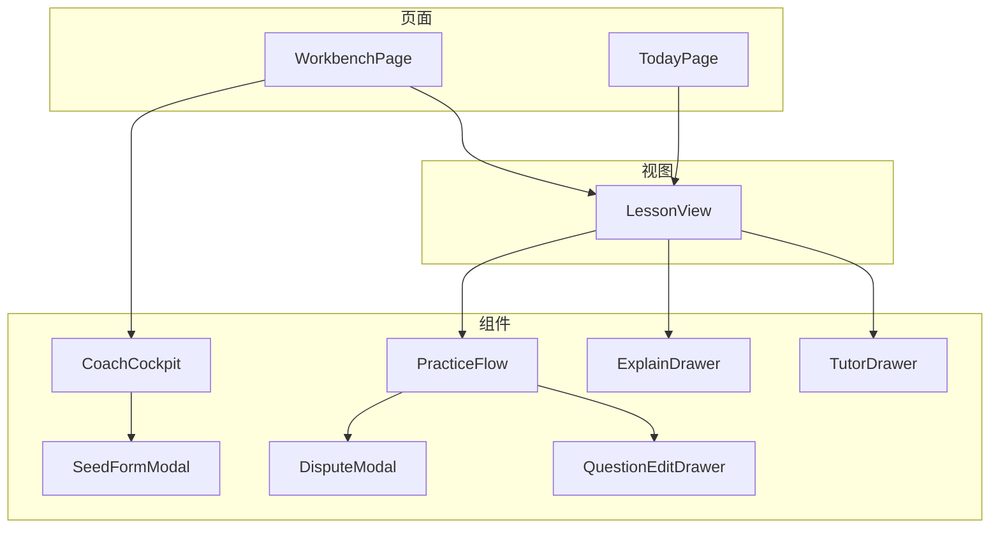
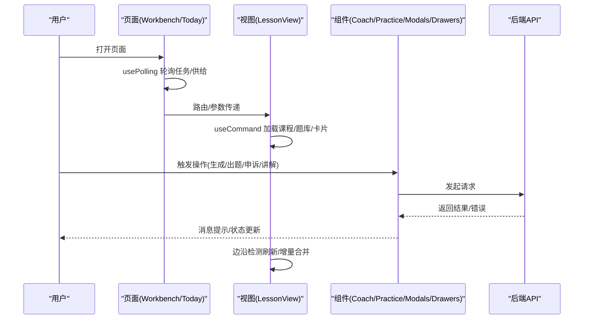
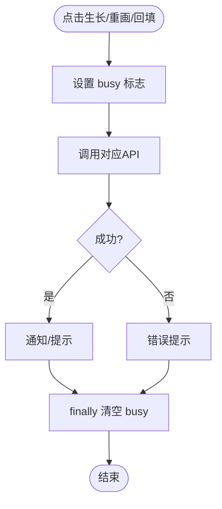
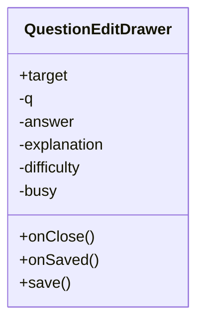
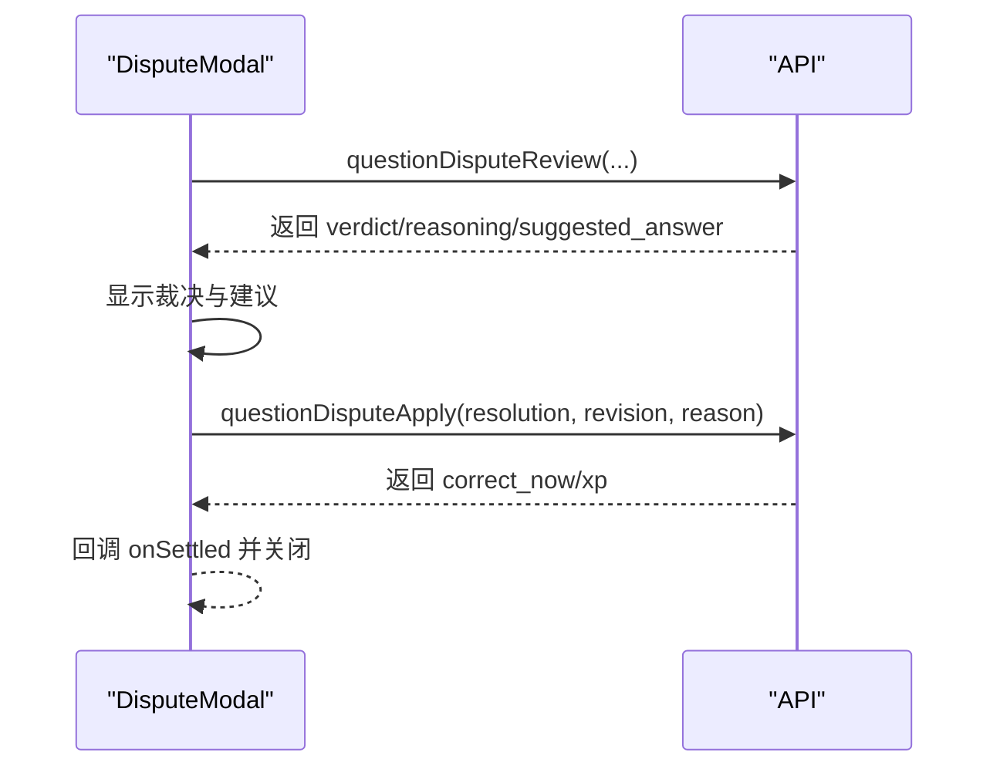
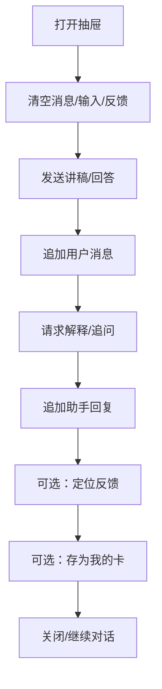
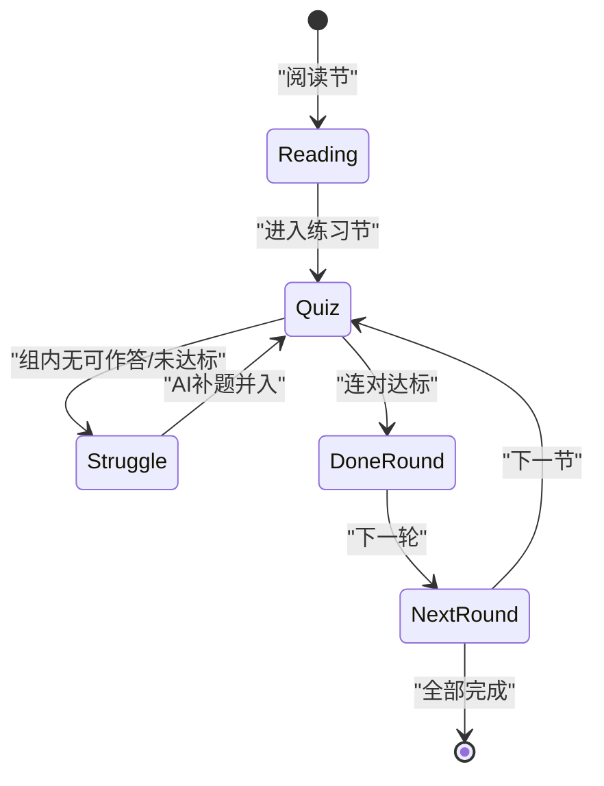
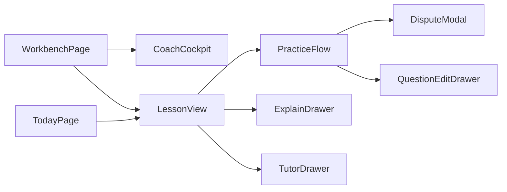

# 本地组件状态

<cite>
**本文引用的文件**
- [CoachCockpit.tsx](file://ui/src/components/CoachCockpit.tsx)
- [QuestionEditDrawer.tsx](file://ui/src/components/QuestionEditDrawer.tsx)
- [DisputeModal.tsx](file://ui/src/components/DisputeModal.tsx)
- [ExplainDrawer.tsx](file://ui/src/components/ExplainDrawer.tsx)
- [SeedFormModal.tsx](file://ui/src/components/SeedFormModal.tsx)
- [PracticeFlow.tsx](file://ui/src/components/PracticeFlow.tsx)
- [TutorDrawer.tsx](file://ui/src/components/TutorDrawer.tsx)
- [LessonView.tsx](file://ui/src/components/LessonView.tsx)
- [WorkbenchPage/index.tsx](file://ui/src/pages/WorkbenchPage/index.tsx)
- [TodayPage/index.tsx](file://ui/src/pages/TodayPage/index.tsx)
</cite>

## 目录
1. [简介](#简介)
2. [项目结构](#项目结构)
3. [核心组件与状态模式](#核心组件与状态模式)
4. [架构总览](#架构总览)
5. [详细组件分析](#详细组件分析)
6. [依赖关系分析](#依赖关系分析)
7. [性能考量](#性能考量)
8. [故障排查指南](#故障排查指南)
9. [结论](#结论)
10. [附录：最佳实践清单](#附录最佳实践清单)

## 简介
本文件聚焦 LearnHub 前端 UI 中的“本地组件状态管理”，系统性梳理 React useState 与 useRef 的使用模式，覆盖表单状态、模态框/抽屉面板的显隐与数据流、复杂多步骤流程（如教练台、练习会话）的状态组合策略。文档同时给出状态初始化、更新与清理机制说明，并提供状态提升原则、性能优化技巧与调试方法，辅以代码级图示帮助理解。

## 项目结构
LearnHub 的前端位于 ui/src，UI 组件集中在 ui/src/components，页面在 ui/src/pages。关键状态管理模式体现在以下文件：
- 表单与弹窗：SeedFormModal、DisputeModal、QuestionEditDrawer
- 抽屉面板：ExplainDrawer、TutorDrawer
- 复杂流程：PracticeFlow（多轮练习）、LessonView（学习视图编排）
- 页面级聚合：WorkbenchPage、TodayPage（轮询与任务状态聚合）

图表来源
- [WorkbenchPage/index.tsx:33-81](file://ui/src/pages/WorkbenchPage/index.tsx#L33-L81)
- [TodayPage/index.tsx:36-118](file://ui/src/pages/TodayPage/index.tsx#L36-L118)
- [LessonView.tsx:40-125](file://ui/src/components/LessonView.tsx#L40-L125)
- [CoachCockpit.tsx:142-250](file://ui/src/components/CoachCockpit.tsx#L142-L250)
- [PracticeFlow.tsx:58-146](file://ui/src/components/PracticeFlow.tsx#L58-L146)
- [DisputeModal.tsx:39-110](file://ui/src/components/DisputeModal.tsx#L39-L110)
- [ExplainDrawer.tsx:21-99](file://ui/src/components/ExplainDrawer.tsx#L21-L99)
- [TutorDrawer.tsx:50-86](file://ui/src/components/TutorDrawer.tsx#L50-L86)
- [QuestionEditDrawer.tsx:22-65](file://ui/src/components/QuestionEditDrawer.tsx#L22-L65)
- [SeedFormModal.tsx:12-39](file://ui/src/components/SeedFormModal.tsx#L12-L39)

章节来源
- [WorkbenchPage/index.tsx:33-81](file://ui/src/pages/WorkbenchPage/index.tsx#L33-L81)
- [TodayPage/index.tsx:36-118](file://ui/src/pages/TodayPage/index.tsx#L36-L118)

## 核心组件与状态模式
- 表单状态：使用 useState 维护输入值与提交态，结合 useEffect 同步外部 props 变化（如 SeedFormModal、QuestionEditDrawer）。
- 模态框/抽屉显隐：通过 visible/open 布尔状态控制；进入时重置内部状态，退出时卸载（unmountOnExit）避免残留。
- 复杂流程状态：使用多个 useState 组合表达阶段、进度、集合等；用 useRef 保存易失或跨渲染比较的值（如 runId、滚动位置、版本号）。
- 异步与轮询：usePolling 统一后台轮询；useCommand 封装命令式请求与重试；失败不翻转主数据，保持旧态稳定。
- 状态提升：父组件持有跨子组件共享的状态（如 TodayPage 的任务状态、LessonView 的作业轮询），子组件仅持有局部 UI 态。

章节来源
- [SeedFormModal.tsx:12-39](file://ui/src/components/SeedFormModal.tsx#L12-L39)
- [QuestionEditDrawer.tsx:22-65](file://ui/src/components/QuestionEditDrawer.tsx#L22-L65)
- [ExplainDrawer.tsx:21-99](file://ui/src/components/ExplainDrawer.tsx#L21-L99)
- [TutorDrawer.tsx:50-86](file://ui/src/components/TutorDrawer.tsx#L50-L86)
- [PracticeFlow.tsx:58-146](file://ui/src/components/PracticeFlow.tsx#L58-L146)
- [LessonView.tsx:40-125](file://ui/src/components/LessonView.tsx#L40-L125)
- [TodayPage/index.tsx:36-118](file://ui/src/pages/TodayPage/index.tsx#L36-L118)

## 架构总览
下图展示页面到组件的状态流向与职责边界：页面负责聚合与轮询，视图编排交互流程，组件专注局部状态与用户操作。

图表来源
- [WorkbenchPage/index.tsx:41-52](file://ui/src/pages/WorkbenchPage/index.tsx#L41-L52)
- [TodayPage/index.tsx:74-118](file://ui/src/pages/TodayPage/index.tsx#L74-L118)
- [LessonView.tsx:81-125](file://ui/src/components/LessonView.tsx#L81-L125)
- [CoachCockpit.tsx:149-201](file://ui/src/components/CoachCockpit.tsx#L149-L201)
- [PracticeFlow.tsx:114-146](file://ui/src/components/PracticeFlow.tsx#L114-L146)

## 详细组件分析

### 教练台（CoachCockpit）——多动作与任务条
- 状态设计
  - 表单可见性：seedForm（新建课程模态）
  - 操作忙态：busy（growth/compass/backfill）
  - 业务条件：noEndpoints（零终点禁用生长/重画）
- 生命周期
  - 挂载：无额外副作用
  - 卸载：无资源清理
- 更新与清理
  - 按钮点击设置 busy -> 调用 API -> finally 清空 busy
  - Modal.confirm 二次确认，避免误触
- 复杂组合
  - 任务条聚合 jobs，点击跳转生成队列
  - 就绪深度卡与复诊卡作为子组件，读入 coach 与 course 数据

图表来源
- [CoachCockpit.tsx:149-201](file://ui/src/components/CoachCockpit.tsx#L149-L201)

章节来源
- [CoachCockpit.tsx:142-250](file://ui/src/components/CoachCockpit.tsx#L142-L250)

### 题目编辑抽屉（QuestionEditDrawer）——表单与答案类型适配
- 状态设计
  - 表单字段：q、answer、explanation、difficulty
  - 提交忙态：busy
- 生命周期
  - 当 target 变化时，重置表单并填充初始值
- 更新与清理
  - 保存时根据题型构造 answer 格式，留空表示不修改
  - 成功后回调 onSaved，关闭由父控

图表来源
- [QuestionEditDrawer.tsx:22-65](file://ui/src/components/QuestionEditDrawer.tsx#L22-L65)

章节来源
- [QuestionEditDrawer.tsx:22-65](file://ui/src/components/QuestionEditDrawer.tsx#L22-L65)

### 瑕疵题申诉模态（DisputeModal）——异步复核与降级路径
- 状态设计
  - 理由 reason、复核中 reviewing、应用 applying、错误 reviewError、可降级 fallbackable
  - 复核结果 review、runIdRef（防竞态）
- 生命周期
  - 可见时自动运行复核，重置中间态
- 更新与清理
  - 应用时携带 targetTs、revision、reason，处理不同裁决分支
  - 失败时提供重试与跳过复核直接豁免的降级入口

图表来源
- [DisputeModal.tsx:53-110](file://ui/src/components/DisputeModal.tsx#L53-L110)

章节来源
- [DisputeModal.tsx:39-110](file://ui/src/components/DisputeModal.tsx#L39-L110)

### “讲给我听”抽屉（ExplainDrawer）——对话式学习与归档
- 状态设计
  - 消息列表 messages、输入 input、忙态 busy
  - 反馈 feedback、归档开关 archiveOpen/Kind/Text、归档忙态 archiveBusy
  - 滚动 ref listRef
- 生命周期
  - 可见时清空会话；每次消息/忙态/反馈变更自动滚动到底部
- 更新与清理
  - 发送消息追加用户内容，收到助手回复后追加
  - 定位反馈将完整对话转译后请求判词
  - 归档支持“再讲一遍/挖空重述”两种模式

图表来源
- [ExplainDrawer.tsx:21-99](file://ui/src/components/ExplainDrawer.tsx#L21-L99)

章节来源
- [ExplainDrawer.tsx:21-99](file://ui/src/components/ExplainDrawer.tsx#L21-L99)

### 建课表单（SeedFormModal）——最小化表单与创建流程
- 状态设计
  - name、busy
- 生命周期
  - 可见时预填 course（编辑场景）
- 更新与清理
  - 提交校验非空，调用创建接口，成功后回调 onCreated 并关闭

章节来源
- [SeedFormModal.tsx:12-39](file://ui/src/components/SeedFormModal.tsx#L12-L39)

### 练习会话（PracticeFlow）——多步骤流程与撤销/作废语义
- 状态设计
  - 轮次 roundIdx、当前题 qIdx、连对 streak、已问 asked、当前作答 answered
  - 已答题集合 answeredIds、每题对错 outcomes、作废集合 voidedIds、已完成轮 doneRounds、最远到达 maxReached
  - 困难态 struggling、直通卡 revealPending
- 生命周期
  - 题目集变化时进行签名对比，必要时回滚到未作答题，保持会话连续性
- 更新与清理
  - 前进/后退逻辑基于首未答定位与连对目标
  - 申诉结算后恢复会话内判罚（改判对/作废中性）
  - 定向补题任务化，完成后静默并入本轮

图表来源
- [PracticeFlow.tsx:79-146](file://ui/src/components/PracticeFlow.tsx#L79-L146)
- [PracticeFlow.tsx:167-243](file://ui/src/components/PracticeFlow.tsx#L167-L243)

章节来源
- [PracticeFlow.tsx:58-297](file://ui/src/components/PracticeFlow.tsx#L58-L297)

### 问 AI 老师（TutorDrawer）——轻量答疑与动作广播
- 状态设计
  - 消息 messages、输入 input、忙态 busy、滚动 ref
- 生命周期
  - 可见时清空会话；消息/忙态变更自动滚动
- 更新与清理
  - 解析教师答案中的 learnhub-teacher 动作块，通过 WidgetBus 广播到交互件

章节来源
- [TutorDrawer.tsx:50-86](file://ui/src/components/TutorDrawer.tsx#L50-L86)

### 学习视图（LessonView）——编排与轮询
- 状态设计
  - 作业 job、忙态 busy、会话通过 sessionPassed、工具抽屉开关、失败横幅隐藏 key
  - 版本 lastVersionRef、会话活跃 sessionActiveRef
- 生命周期
  - 轮询 generateStatus，边沿检测触发刷新或冻结提示
  - 失败横幅持久化至 localStorage（按任务 startedAt 粒度）
- 更新与清理
  - 生成/出题/重写/完成/跳过等操作均带忙态与错误处理
  - 增量合并新题，正文版本变化时冻结会话并在结束后生效

章节来源
- [LessonView.tsx:40-125](file://ui/src/components/LessonView.tsx#L40-L125)
- [LessonView.tsx:127-249](file://ui/src/components/LessonView.tsx#L127-L249)

### 工作台（WorkbenchPage）——分栏与任务聚合
- 状态设计
  - 分栏 wb、任务 allJobs
- 生命周期
  - 监听路由变化同步分栏；usePolling 统一轮询生成任务
- 更新与清理
  - 过滤 graph 相关任务供教练台展示

章节来源
- [WorkbenchPage/index.tsx:33-81](file://ui/src/pages/WorkbenchPage/index.tsx#L33-L81)

### 今日页（TodayPage）——供给/闸门/推荐流聚合
- 状态设计
  - 推荐 rec、XP xp、复习队列 reviewQ、会话 session、校准提示 calibrationHint
  - 笔记源抽屉 sourceDrawer、我的卡管理 cardMgrOpen、最近归档 recentArchived
  - 生成映射 genMap、供给 supply、待审提案 pendingProps、运行/排队任务 runningJobs/queuedJobs
- 生命周期
  - 统一轮询供给与提案，边沿检测触发推荐流刷新
  - 事件监听 learnhub:reload 触发全局刷新
- 更新与清理
  - 生成节点、跳过节点、挖掘错误卡、建议项直达复习等

章节来源
- [TodayPage/index.tsx:36-118](file://ui/src/pages/TodayPage/index.tsx#L36-L118)
- [TodayPage/index.tsx:120-199](file://ui/src/pages/TodayPage/index.tsx#L120-L199)
- [TodayPage/index.tsx:201-287](file://ui/src/pages/TodayPage/index.tsx#L201-L287)

## 依赖关系分析
- 页面依赖视图与组件：WorkbenchPage 依赖 CoachColumn/GraphScreen/GeneratePage/ProposalsPage/BankColumn；TodayPage 依赖 LessonView/ReviewSession/SupplyRow 等。
- 视图依赖组件：LessonView 依赖 PracticeFlow/TutorDrawer/ExplainDrawer/UnderstandingEntry。
- 组件间耦合：PracticeFlow 与 DisputeModal/QuestionEditDrawer 通过回调通信；ExplainDrawer/TutorDrawer 通过 WidgetBus 与交互件解耦。

图表来源
- [WorkbenchPage/index.tsx:74-81](file://ui/src/pages/WorkbenchPage/index.tsx#L74-L81)
- [LessonView.tsx:390-407](file://ui/src/components/LessonView.tsx#L390-L407)
- [PracticeFlow.tsx:245-297](file://ui/src/components/PracticeFlow.tsx#L245-L297)

章节来源
- [WorkbenchPage/index.tsx:74-81](file://ui/src/pages/WorkbenchPage/index.tsx#L74-L81)
- [LessonView.tsx:390-407](file://ui/src/components/LessonView.tsx#L390-L407)
- [PracticeFlow.tsx:245-297](file://ui/src/components/PracticeFlow.tsx#L245-L297)

## 性能考量
- 减少不必要重渲染
  - 使用 useMemo 计算派生数据（如 PracticeFlow 的 rounds/steps）
  - 使用 useRef 保存引用型比较（如 questionsSigRef、roundsSigRef、lastVersionRef）
- 合理拆分状态
  - 将表单、忙态、业务状态分离，避免单一巨型 state
  - 集合类状态使用 Set/Record 提高查找与更新效率
- 轮询节流与边沿检测
  - usePolling 自适应间隔（活动任务 3s，空闲 15s）
  - 边沿检测仅在状态变化时触发刷新，避免频繁全量拉取
- 失败不翻转主数据
  - useCommand 保证失败时保留旧数据，提升用户体验稳定性

[本节为通用指导，不直接分析具体文件]

## 故障排查指南
- 常见错误与处理
  - 网络错误：统一 errorMessage 提示，避免崩溃
  - 复核不可用：DisputeModal 提供“跳过复核直接豁免”降级
  - 正文版本冲突：LessonView 冻结会话并提示，课后重进生效
- 调试建议
  - 打印关键状态（messages、answeredIds、outcomes、voidedIds）
  - 检查轮询是否按预期触发（console.log poll 返回值）
  - 使用浏览器开发者工具观察 DOM 滚动行为（listRef）

章节来源
- [DisputeModal.tsx:53-110](file://ui/src/components/DisputeModal.tsx#L53-L110)
- [LessonView.tsx:117-125](file://ui/src/components/LessonView.tsx#L117-L125)
- [ExplainDrawer.tsx:39-47](file://ui/src/components/ExplainDrawer.tsx#L39-L47)

## 结论
LearnHub 前端的本地状态管理以 useState 为核心，配合 useRef 处理易失与比较场景，形成清晰的职责边界：页面负责聚合与轮询，视图编排流程，组件专注局部状态与交互。通过状态提升、边沿检测、失败不翻转主数据、降级路径等手段，保证了复杂流程的稳定性与可维护性。建议在新增功能时遵循本文的最佳实践，确保状态清晰、性能可控、易于调试。

[本节为总结，不直接分析具体文件]

## 附录：最佳实践清单
- 表单状态
  - 使用 useState 管理每个字段，统一提交函数处理校验与 API 调用
  - 通过 useEffect 同步外部 props 变化，避免脏数据
- 模态框/抽屉
  - 使用 visible/open 控制显隐，进入时重置内部状态，退出时卸载
  - 复杂表单拆分子组件，降低单组件复杂度
- 复杂流程
  - 将流程状态拆分为多个独立 state，避免耦合
  - 使用 useRef 保存跨渲染比较值（如 runId、版本、滚动位置）
- 状态提升
  - 跨组件共享状态提升到父组件或页面层
  - 子组件仅持有 UI 态，通过回调与父组件通信
- 性能优化
  - 使用 useMemo/useCallback 缓存计算与回调
  - 合理使用 Set/Record 提升集合操作效率
  - 轮询节流与边沿检测，避免频繁请求
- 调试方法
  - 统一错误提示与日志记录
  - 使用浏览器开发者工具观察状态变化与 DOM 行为
  - 针对关键路径编写单元测试（如 PracticeFlow 的轮次导航）

[本节为通用指导，不直接分析具体文件]