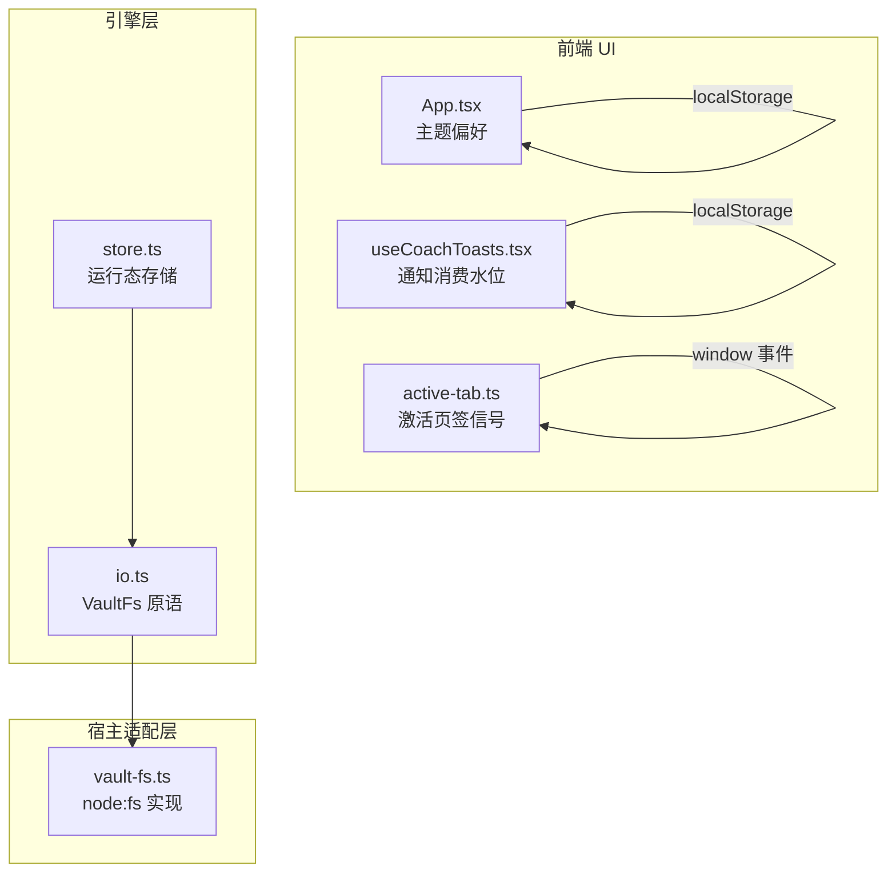
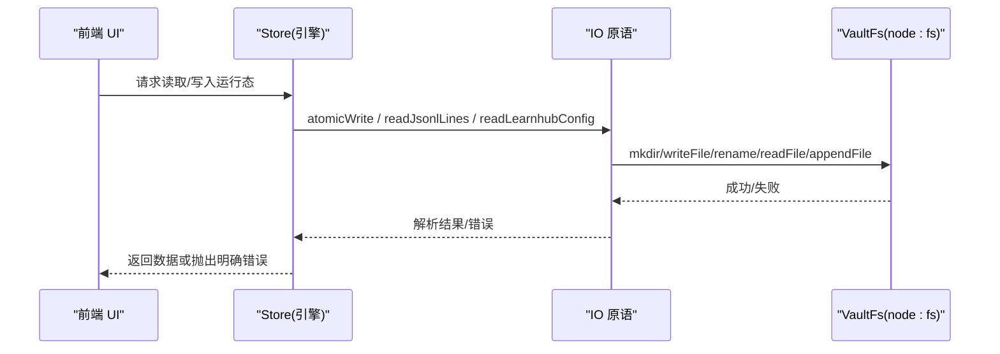
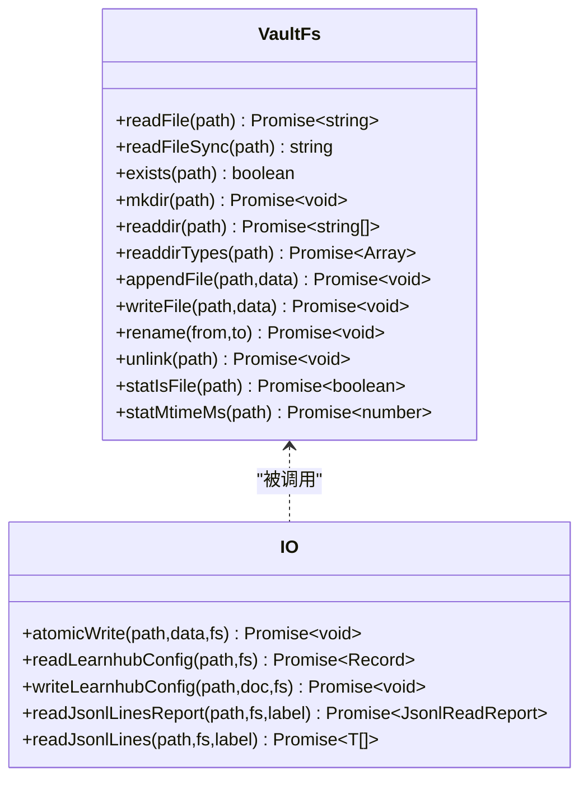
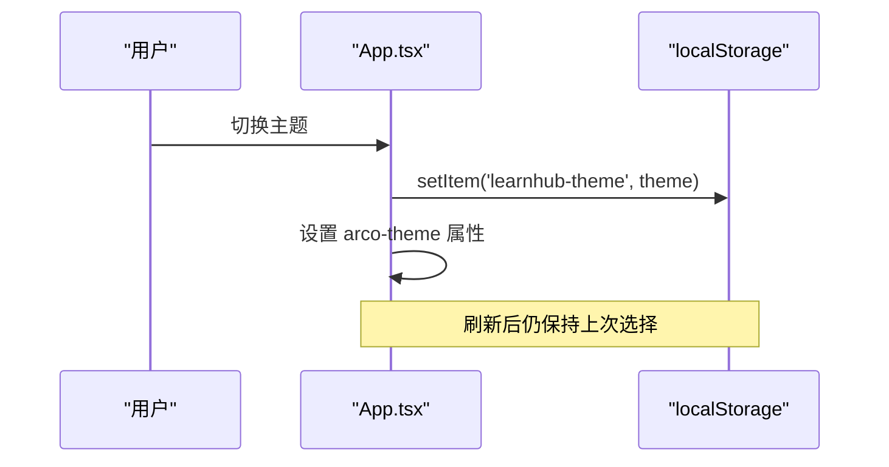
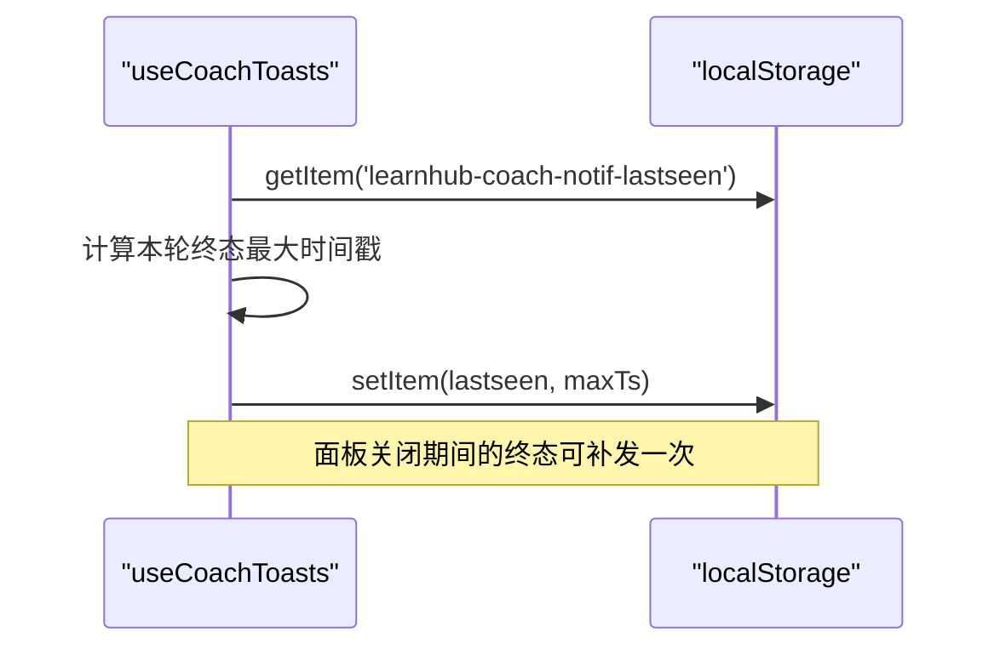
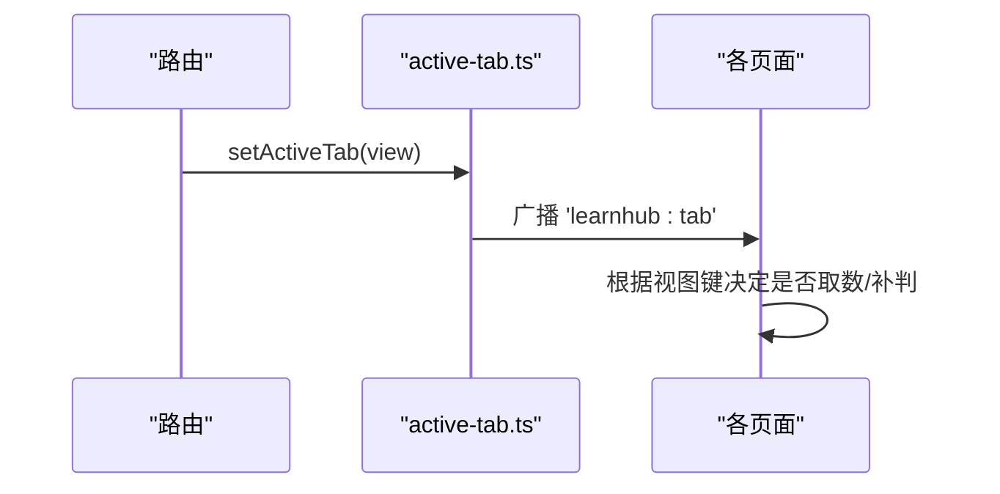

# 状态持久化

<cite>
**本文引用的文件**
- [store.ts](file://src/engine/store.ts)
- [io.ts](file://src/engine/io.ts)
- [vault-fs.ts](file://src/host/vault-fs.ts)
- [App.tsx](file://ui/src/App.tsx)
- [useCoachToasts.tsx](file://ui/src/useCoachToasts.tsx)
- [active-tab.ts](file://ui/src/active-tab.ts)
</cite>

## 目录
1. [简介](#简介)
2. [项目结构](#项目结构)
3. [核心组件](#核心组件)
4. [架构总览](#架构总览)
5. [详细组件分析](#详细组件分析)
6. [依赖关系分析](#依赖关系分析)
7. [性能考量](#性能考量)
8. [故障排除指南](#故障排除指南)
9. [结论](#结论)
10. [附录](#附录)

## 简介
本文件面向 LearnHub 的状态持久化方案，聚焦以下目标：
- 说明后端运行态与配置在 vault 中的持久化策略（JSONL 追加、原子写整档、缺失即空态）。
- 说明前端 localStorage 的使用策略（主题偏好、通知消费水位）以及会话级状态保持（激活页签信号）。
- 描述序列化/反序列化的数据契约、错误处理与“缺失/损坏”的容错语义。
- 给出迁移与清理策略建议（当数据结构变更时的升级与清理路径）。
- 提供最佳实践（存储优化、数据安全、性能影响）与常见问题排查。

## 项目结构
LearnHub 将“持久化”拆分为两层：
- 后端（engine + host）：通过 VaultFs 端口统一访问文件系统，使用 JSONL 追加日志与原子写整档配置/清单，保证崩溃安全与一致性。
- 前端（ui）：使用 localStorage 保存轻量用户偏好与会话水位；使用模块内全局状态与事件桥接实现标签页切换时的状态保持。



图表来源
- [store.ts:1-10](file://src/engine/store.ts#L1-L10)
- [io.ts:1-10](file://src/engine/io.ts#L1-L10)
- [vault-fs.ts:1-25](file://src/host/vault-fs.ts#L1-L25)
- [App.tsx:119-128](file://ui/src/App.tsx#L119-L128)
- [useCoachToasts.tsx:33-46](file://ui/src/useCoachToasts.tsx#L33-L46)
- [active-tab.ts:1-37](file://ui/src/active-tab.ts#L1-L37)

章节来源
- [store.ts:1-10](file://src/engine/store.ts#L1-L10)
- [io.ts:1-10](file://src/engine/io.ts#L1-L10)
- [vault-fs.ts:1-25](file://src/host/vault-fs.ts#L1-L25)
- [App.tsx:119-128](file://ui/src/App.tsx#L119-L128)
- [useCoachToasts.tsx:33-46](file://ui/src/useCoachToasts.tsx#L33-L46)
- [active-tab.ts:1-37](file://ui/src/active-tab.ts#L1-L37)

## 核心组件
- 后端存储抽象（VaultFs）：定义统一的读/写/列目录/统计等能力，屏蔽 node:fs 细节，便于测试与替换。
- 通用 IO 原语：原子写整档、learnhub.json 读写、JSONL 只读（含撕裂尾行豁免与 Broken 报错）。
- Store 类：封装 journal/practice/review-log/proposals/pins/experiments/receipts/habit-repeats/erratum 等所有运行态数据的读写。
- 前端偏好与水位：主题设置与通知消费水位写入 localStorage。
- 会话保持：激活页签信号通过 window 事件广播，配合路由桥接实现跨标签页的状态感知。

章节来源
- [io.ts:9-28](file://src/engine/io.ts#L9-L28)
- [io.ts:30-54](file://src/engine/io.ts#L30-L54)
- [io.ts:56-103](file://src/engine/io.ts#L56-L103)
- [store.ts:46-479](file://src/engine/store.ts#L46-L479)
- [App.tsx:119-128](file://ui/src/App.tsx#L119-L128)
- [useCoachToasts.tsx:33-46](file://ui/src/useCoachToasts.tsx#L33-L46)
- [active-tab.ts:1-37](file://ui/src/active-tab.ts#L1-L37)

## 架构总览
后端以“JSONL 追加日志 + 原子写整档配置/清单”的模式实现高可靠持久化；前端以 localStorage 承载轻量偏好与水位。两者通过清晰的边界解耦：engine 不直接依赖宿主，host 仅负责把 VaultFs 映射到 node:fs。



图表来源
- [store.ts:46-479](file://src/engine/store.ts#L46-L479)
- [io.ts:30-54](file://src/engine/io.ts#L30-L54)
- [io.ts:56-103](file://src/engine/io.ts#L56-L103)
- [vault-fs.ts:11-24](file://src/host/vault-fs.ts#L11-L24)

## 详细组件分析

### 后端运行态存储（Store）
- 日志型数据（journal/practice/review-log/receipts/habit-repeats/erratum/e-archive/band-log）：采用 JSONL 追加，单条记录独立成行，读侧对中段损坏抛错、对末行撕裂豁免。
- 清单型数据（proposals/pins/advice-dismiss/experiments）：整档 JSON 原子写，读侧对缺失返回空数组，对损坏抛错。
- 快照（snapshots）：按课程+版本号分片存储，支持增量归档与回溯。
- 提案联动守卫：pair 字段用于同源双提案同进同退，避免半生效导致的不一致。

```mermaid
flowchart TD
Start(["写入开始"]) --> Mode{"数据类型"}
Mode --> |日志(JSONL)| Append["appendFile('a') 追加一行"]
Mode --> |清单(JSON)| Atomic["atomicWrite(tmp→rename) 原子替换"]
Append --> End(["完成"])
Atomic --> End
```

图表来源
- [store.ts:51-64](file://src/engine/store.ts#L51-L64)
- [store.ts:100-116](file://src/engine/store.ts#L100-L116)
- [store.ts:125-149](file://src/engine/store.ts#L125-L149)
- [store.ts:168-206](file://src/engine/store.ts#L168-L206)
- [store.ts:291-293](file://src/engine/store.ts#L291-L293)
- [store.ts:299-321](file://src/engine/store.ts#L299-L321)
- [store.ts:325-348](file://src/engine/store.ts#L325-L348)
- [store.ts:386-420](file://src/engine/store.ts#L386-L420)
- [store.ts:424-471](file://src/engine/store.ts#L424-L471)

章节来源
- [store.ts:51-64](file://src/engine/store.ts#L51-L64)
- [store.ts:100-116](file://src/engine/store.ts#L100-L116)
- [store.ts:125-149](file://src/engine/store.ts#L125-L149)
- [store.ts:168-206](file://src/engine/store.ts#L168-L206)
- [store.ts:291-293](file://src/engine/store.ts#L291-L293)
- [store.ts:299-321](file://src/engine/store.ts#L299-L321)
- [store.ts:325-348](file://src/engine/store.ts#L325-L348)
- [store.ts:386-420](file://src/engine/store.ts#L386-L420)
- [store.ts:424-471](file://src/engine/store.ts#L424-L471)

### 通用 IO 原语（VaultFs 与原子写/JSONL）
- VaultFs 接口：统一 readFile/readFileSync/mkdir/readdir/appendFile/writeFile/rename/unlink/statIsFile/statMtimeMs。
- 原子写：先写临时文件再 rename 覆盖，避免部分写入导致的损坏。
- learnhub.json 读写：readLearnhubConfig 缺失/损坏回空对象；writeLearnhubConfig 保留未触及字段并原子写。
- JSONL 只读：readJsonlLinesReport 区分 Missing（空）、Broken（中段损坏抛错）、Torn Tail（末行撕裂豁免）。



图表来源
- [io.ts:9-28](file://src/engine/io.ts#L9-L28)
- [io.ts:30-54](file://src/engine/io.ts#L30-L54)
- [io.ts:56-103](file://src/engine/io.ts#L56-L103)
- [vault-fs.ts:11-24](file://src/host/vault-fs.ts#L11-L24)

章节来源
- [io.ts:9-28](file://src/engine/io.ts#L9-L28)
- [io.ts:30-54](file://src/engine/io.ts#L30-L54)
- [io.ts:56-103](file://src/engine/io.ts#L56-L103)
- [vault-fs.ts:11-24](file://src/host/vault-fs.ts#L11-L24)

### 前端 localStorage 策略（主题与通知水位）
- 主题设置：首次加载从 localStorage 读取，若无效则跟随系统偏好；切换时同步更新 DOM 属性并写回 localStorage。
- 通知消费水位：使用唯一键记录已展示终态的最大时间戳；面板打开首拍回放期间完成的终态，并在每轮推进水位，避免重复打扰。



图表来源
- [App.tsx:119-128](file://ui/src/App.tsx#L119-L128)



图表来源
- [useCoachToasts.tsx:33-46](file://ui/src/useCoachToasts.tsx#L33-L46)
- [useCoachToasts.tsx:148-161](file://ui/src/useCoachToasts.tsx#L148-L161)

章节来源
- [App.tsx:119-128](file://ui/src/App.tsx#L119-L128)
- [useCoachToasts.tsx:33-46](file://ui/src/useCoachToasts.tsx#L33-L46)
- [useCoachToasts.tsx:148-161](file://ui/src/useCoachToasts.tsx#L148-L161)

### 会话状态管理（标签页切换与应用恢复）
- 激活页签信号：模块内维护当前视图键，路由变化时镜像并广播自定义事件；各页面订阅该事件以实现“切回即取数/补判”。
- 应用恢复：初始值从路由解析，确保深链直达场景下首拍正确；隐藏视图的轮询据此跳过取数，减少不必要开销。



图表来源
- [active-tab.ts:1-37](file://ui/src/active-tab.ts#L1-L37)

章节来源
- [active-tab.ts:1-37](file://ui/src/active-tab.ts#L1-L37)

## 依赖关系分析
- engine 与 host 的边界：engine 仅依赖 io.ts 定义的 VaultFs 接口；host 在 vault-fs.ts 中实现该接口并注入到引擎构造参数中，形成单向依赖。
- 前端与后端交互：前端通过 API 调用触发后端 store 操作；本地偏好与水位由前端自行管理，不侵入后端。


图表来源
- [store.ts:1-10](file://src/engine/store.ts#L1-L10)
- [io.ts:1-10](file://src/engine/io.ts#L1-L10)
- [vault-fs.ts:1-25](file://src/host/vault-fs.ts#L1-L25)

章节来源
- [store.ts:1-10](file://src/engine/store.ts#L1-L10)
- [io.ts:1-10](file://src/engine/io.ts#L1-L10)
- [vault-fs.ts:1-25](file://src/host/vault-fs.ts#L1-L25)

## 性能考量
- JSONL 追加：适合高频小写（日志），顺序追加 I/O 成本低；读侧按需扫描，注意大文件下的内存占用。
- 原子写整档：适合中小规模清单（提案/实验/钉选），避免并发写入竞争；写前全量构建再一次性替换，降低碎片化。
- 缺失即空态：读侧对缺失文件返回空集合，避免启动阻塞；但需在上层做好默认行为设计。
- 撕裂尾行豁免：进程中断时末行可能不完整，读侧自动忽略，不影响历史数据完整性。
- 前端 localStorage：键名固定、体积小，读写开销极低；注意键冲突与过期策略（如通知水位无需清理）。

[本节为通用指导，不直接分析具体文件]

## 故障排除指南
- 清单文件损坏（proposals/pins/experiments）：读侧会抛出包含路径与位置信息的错误；修复或删除对应条目后重试。
- JSONL 中段损坏：读侧会抛出 Broken 错误并标注流标签与行号；定位并修复该行后可继续。
- JSONL 末行撕裂：属于进程中断残留，读侧自动豁免；如需规范化，可在写入端确保每次追加带换行。
- 主题不生效：检查 localStorage 是否被浏览器策略拦截；确认切换逻辑同时更新 DOM 属性与持久化。
- 通知未回放：确认 last-seen 键存在且数值递增；若面板长时间未打开，需确保服务端任务保留期足够。

章节来源
- [store.ts:168-206](file://src/engine/store.ts#L168-L206)
- [store.ts:299-321](file://src/engine/store.ts#L299-L321)
- [store.ts:386-420](file://src/engine/store.ts#L386-L420)
- [io.ts:56-103](file://src/engine/io.ts#L56-L103)
- [App.tsx:119-128](file://ui/src/App.tsx#L119-L128)
- [useCoachToasts.tsx:33-46](file://ui/src/useCoachToasts.tsx#L33-L46)

## 结论
LearnHub 的状态持久化方案以“后端 JSONL 日志 + 原子写清单”为核心，结合“缺失即空态、中段损坏抛错、末行撕裂豁免”的稳健读侧契约，保障数据一致性与可恢复性；前端通过 localStorage 管理轻量偏好与水位，并通过模块内事件机制维持标签页切换时的状态连贯。整体设计清晰分层、职责单一，具备良好的可扩展性与可维护性。

[本节为总结性内容，不直接分析具体文件]

## 附录

### 数据迁移与清理策略（建议）
- 数据结构变更：为新字段设置默认值；旧版字段逐步弃用并在读侧兼容；必要时提供一次性迁移脚本。
- 清单升级：采用“读侧宽容 + 写侧严格”的策略，允许历史数据存在但不写入新格式；在新版本中逐步淘汰旧字段。
- 日志清理：对超大 JSONL 文件实施归档与压缩；保留最近 N 天或总量上限，避免磁盘膨胀。
- 前端键清理：对不再使用的 localStorage 键进行清理或标记废弃，避免键空间污染。

[本节为通用建议，不直接分析具体文件]

### 关键实现示例（路径引用）
- 原子写整档：见 [store.ts:204-206](file://src/engine/store.ts#L204-L206)、[io.ts:30-39](file://src/engine/io.ts#L30-L39)
- JSONL 追加与读取：见 [store.ts:51-64](file://src/engine/store.ts#L51-L64)、[store.ts:100-116](file://src/engine/store.ts#L100-L116)、[io.ts:56-103](file://src/engine/io.ts#L56-L103)
- 主题设置：见 [App.tsx:119-128](file://ui/src/App.tsx#L119-L128)
- 通知水位：见 [useCoachToasts.tsx:33-46](file://ui/src/useCoachToasts.tsx#L33-L46)、[useCoachToasts.tsx:148-161](file://ui/src/useCoachToasts.tsx#L148-L161)
- 激活页签：见 [active-tab.ts:1-37](file://ui/src/active-tab.ts#L1-L37)