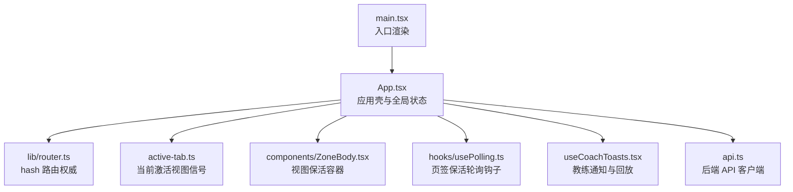
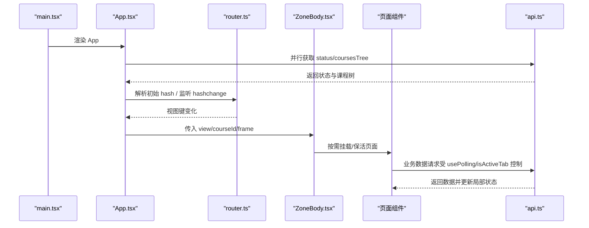
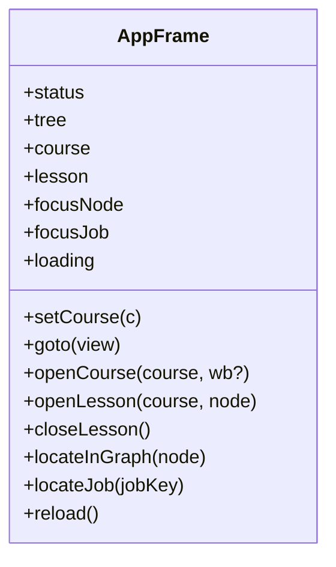
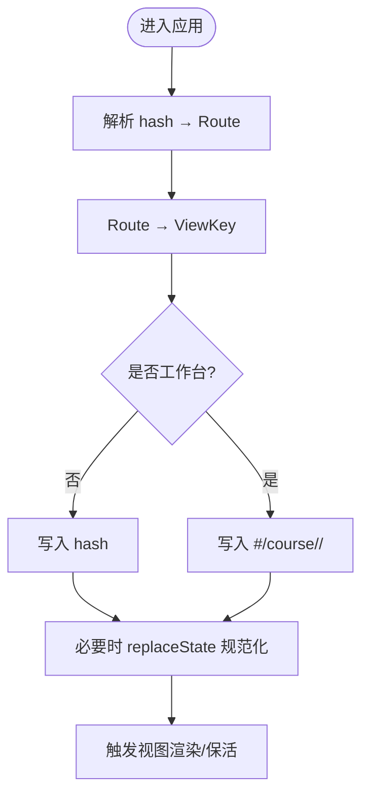
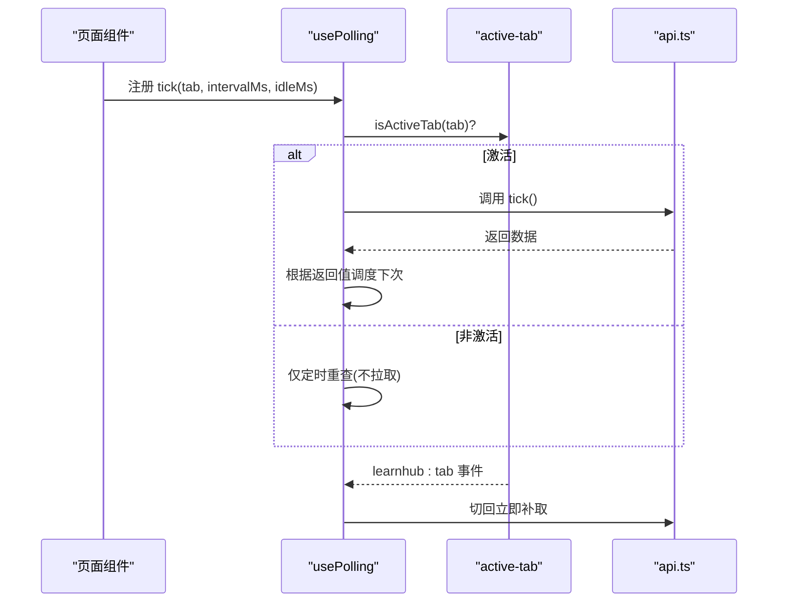
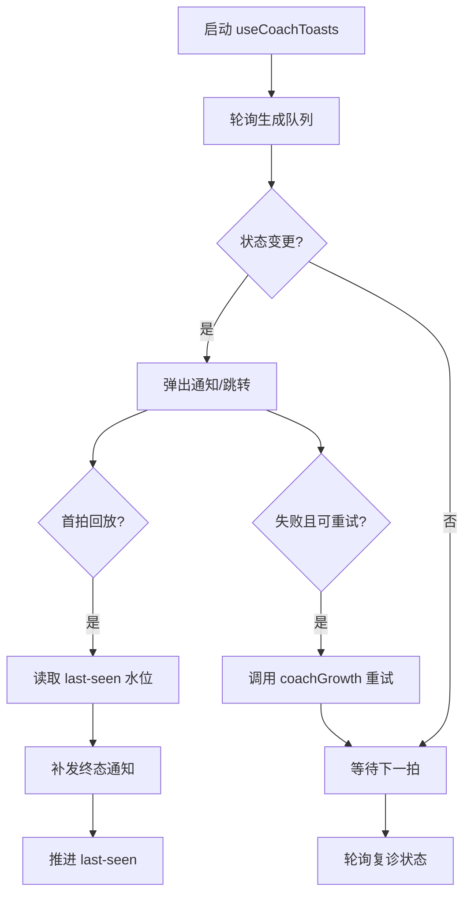
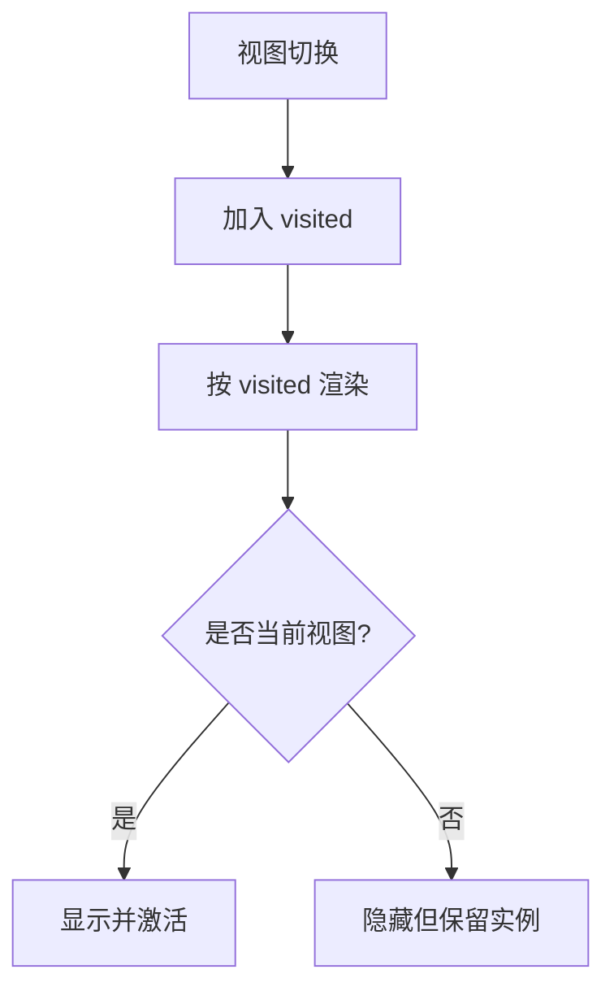
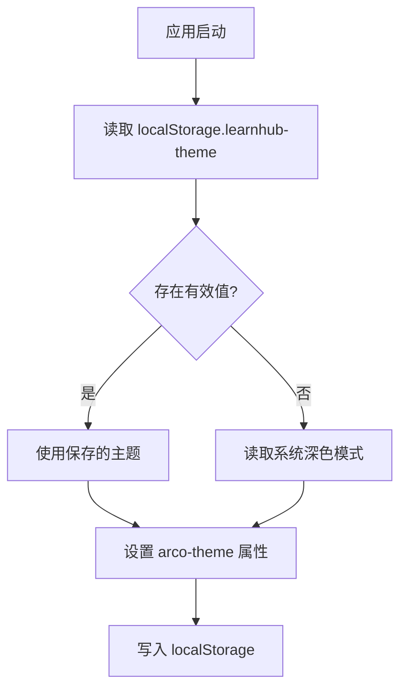
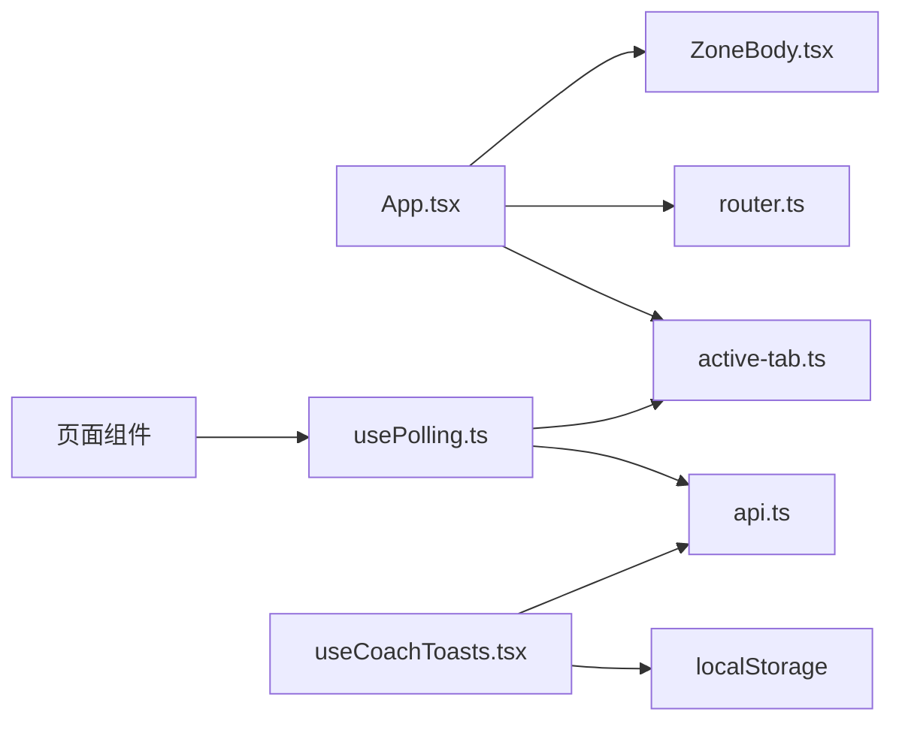

# 状态管理策略

<cite>
**本文引用的文件**
- [App.tsx](file://ui/src/App.tsx)
- [main.tsx](file://ui/src/main.tsx)
- [router.ts](file://ui/src/lib/router.ts)
- [active-tab.ts](file://ui/src/active-tab.ts)
- [api.ts](file://ui/src/api.ts)
- [useCoachToasts.tsx](file://ui/src/useCoachToasts.tsx)
- [usePolling.ts](file://ui/src/hooks/usePolling.ts)
- [ZoneBody.tsx](file://ui/src/components/ZoneBody.tsx)
</cite>

## 目录
1. [简介](#简介)
2. [项目结构](#项目结构)
3. [核心组件](#核心组件)
4. [架构总览](#架构总览)
5. [详细组件分析](#详细组件分析)
6. [依赖关系分析](#依赖关系分析)
7. [性能考量](#性能考量)
8. [故障排查指南](#故障排查指南)
9. [结论](#结论)
10. [附录](#附录)

## 简介
本文件面向 LearnHub 前端的状态管理策略，聚焦多层级状态设计：本地组件状态、应用级状态与全局状态。重点阐述 AppFrame 全局状态模型（课程信息、学习视图、焦点节点与任务状态）的统一管理；说明与后端的 API 同步机制（请求、轮询、错误处理）；解释状态持久化方案（主题设置等 localStorage 使用）；并给出状态更新模式、性能优化与调试技巧的最佳实践。

## 项目结构
LearnHub 前端采用 React + Vite 的单页应用，状态管理围绕以下层次组织：
- 路由层：基于 location.hash 的极简路由，提供解析、跳转与规范化能力，是导航权威来源。
- 应用壳层：App 组件维护应用级共享态（AppFrame），负责加载数据、主题切换、路由桥接与页面容器渲染。
- 保活与轮询：通过 active-tab 信号与 usePolling hook 实现“页签保活”和“隐藏时降频”的轮询策略。
- 通知与事件：useCoachToasts 提供教练通知与回放，结合 localStorage 消费水位避免错过结果。
- 页面容器：ZoneBody 按视图键懒挂载页面，保持已访问视图实例存活，减少重复初始化成本。

图表来源
- [main.tsx:1-16](file://ui/src/main.tsx#L1-L16)
- [App.tsx:47-179](file://ui/src/App.tsx#L47-L179)
- [router.ts:1-164](file://ui/src/lib/router.ts#L1-L164)
- [active-tab.ts:1-38](file://ui/src/active-tab.ts#L1-L38)
- [ZoneBody.tsx:1-43](file://ui/src/components/ZoneBody.tsx#L1-L43)
- [usePolling.ts:1-48](file://ui/src/hooks/usePolling.ts#L1-L48)
- [useCoachToasts.tsx:1-205](file://ui/src/useCoachToasts.tsx#L1-L205)
- [api.ts:1-370](file://ui/src/api.ts#L1-L370)

章节来源
- [main.tsx:1-16](file://ui/src/main.tsx#L1-L16)
- [App.tsx:47-179](file://ui/src/App.tsx#L47-L179)
- [router.ts:1-164](file://ui/src/lib/router.ts#L1-L164)
- [active-tab.ts:1-38](file://ui/src/active-tab.ts#L1-L38)
- [ZoneBody.tsx:1-43](file://ui/src/components/ZoneBody.tsx#L1-L43)
- [usePolling.ts:1-48](file://ui/src/hooks/usePolling.ts#L1-L48)
- [useCoachToasts.tsx:1-205](file://ui/src/useCoachToasts.tsx#L1-L205)
- [api.ts:1-370](file://ui/src/api.ts#L1-L370)

## 核心组件
- 应用壳 App：集中管理应用级状态（status、tree、course、lesson、focusNode、focusJob、loading、fatal）、主题切换、路由桥接与页面容器渲染。对外暴露 AppFrame 接口供各页面消费。
- 路由 lib/router：定义区键、视图键与工作台面分栏，提供 parseHash、navigate、navigateCourse、syncHash、onRouteChange 等函数，确保 URL 权威与程序化跳转一致。
- 激活信号 active-tab：维护当前激活视图键，广播 learnhub:tab 事件，供各页在 keep-alive 下感知切回时机。
- 轮询钩子 usePolling：封装 setInterval + isActiveTab 门 + 切回补取数，支持自定义间隔与空闲间隔，统一页签保活行为。
- 教练通知 useCoachToasts：轻轮询生成队列与复诊状态，diff 边沿弹条，localStorage 记录消费水位进行回放，失败生长批提供重试入口。
- 页面容器 ZoneBody：按视图键懒挂载页面，保留已访问视图实例，提升体验并降低重复初始化开销。
- API 客户端 api：统一 HTTP 封装、错误类型 ApiError、参数序列化与全部面板端点方法。

章节来源
- [App.tsx:17-38](file://ui/src/App.tsx#L17-L38)
- [App.tsx:47-179](file://ui/src/App.tsx#L47-L179)
- [router.ts:24-164](file://ui/src/lib/router.ts#L24-L164)
- [active-tab.ts:1-38](file://ui/src/active-tab.ts#L1-L38)
- [usePolling.ts:1-48](file://ui/src/hooks/usePolling.ts#L1-L48)
- [useCoachToasts.tsx:1-205](file://ui/src/useCoachToasts.tsx#L1-L205)
- [ZoneBody.tsx:1-43](file://ui/src/components/ZoneBody.tsx#L1-L43)
- [api.ts:1-370](file://ui/src/api.ts#L1-L370)

## 架构总览
下图展示从入口到页面渲染、路由与状态同步的整体流程，以及关键状态源与消费者之间的关系。

图表来源
- [main.tsx:11-15](file://ui/src/main.tsx#L11-L15)
- [App.tsx:62-81](file://ui/src/App.tsx#L62-L81)
- [App.tsx:105-117](file://ui/src/App.tsx#L105-L117)
- [ZoneBody.tsx:21-40](file://ui/src/components/ZoneBody.tsx#L21-L40)
- [api.ts:43-220](file://ui/src/api.ts#L43-L220)

## 详细组件分析

### AppFrame 全局状态模型
AppFrame 是应用级共享状态的核心契约，包含：
- 只读数据：status（系统状态+LLM配置）、tree（课程树）、course（当前课程）、lesson（单课学习视图定位）、focusNode（图页高亮目标）、focusJob（生成队列任务定位）。
- 动作方法：setCourse、goto、openCourse、openLesson、closeLesson、locateInGraph、locateJob、reload。
- 渲染辅助：loading（首次加载态）。

该模型将课程上下文、视图导航、学习视图与任务定位统一在一个对象中，便于跨组件传递与订阅。

图表来源
- [App.tsx:17-38](file://ui/src/App.tsx#L17-L38)
- [App.tsx:142-157](file://ui/src/App.tsx#L142-L157)

章节来源
- [App.tsx:17-38](file://ui/src/App.tsx#L17-L38)
- [App.tsx:142-157](file://ui/src/App.tsx#L142-L157)

### 路由与视图键管理
- 视图键（ViewKey）是保活与轮询的门控口径，覆盖五区与课程区三入口及工作台整体视图。
- 工作台面以参数段 #/course/<id>/ 表示，统一映射为 courses.course 视图键，内部分栏切换不改变视图键。
- 程序化跳转 navigate/navigateCourse 写 URL 权威；syncHash 仅在漂移时 replaceState 规范化；onRouteChange 订阅 hashchange 回灌渲染态。

图表来源
- [router.ts:72-164](file://ui/src/lib/router.ts#L72-L164)
- [App.tsx:105-117](file://ui/src/App.tsx#L105-L117)

章节来源
- [router.ts:24-164](file://ui/src/lib/router.ts#L24-L164)
- [App.tsx:105-117](file://ui/src/App.tsx#L105-L117)

### 页签保活与轮询策略
- active-tab 维护当前激活视图键，并在变化时广播 learnhub:tab 事件。
- usePolling 在每个页面内使用，依据 isActiveTab 决定是否拉取数据；非激活页仅保留节拍器，降低后台负载；切回时立即补取一次。
- 页面可自定义 tick 返回下一次延迟，实现“在途短间隔、空闲长间隔”的动态调度。

图表来源
- [active-tab.ts:15-38](file://ui/src/active-tab.ts#L15-L38)
- [usePolling.ts:15-48](file://ui/src/hooks/usePolling.ts#L15-L48)
- [api.ts:43-220](file://ui/src/api.ts#L43-L220)

章节来源
- [active-tab.ts:1-38](file://ui/src/active-tab.ts#L1-L38)
- [usePolling.ts:1-48](file://ui/src/hooks/usePolling.ts#L1-L48)

### 教练通知与回放
- 轻轮询 generateStatus 与 probation，diff 边沿弹出通知；产物类任务跳转提案收件箱，过程类跳转生成队列。
- 失败的生长批提供“重试”按钮，直接调用 coachGrowth 重新入队。
- 使用 localStorage 记录 last-seen 消费水位，面板打开首拍回放期间完成的任务（带“补发”前缀），避免错过结果。

图表来源
- [useCoachToasts.tsx:51-205](file://ui/src/useCoachToasts.tsx#L51-L205)
- [api.ts:317-340](file://ui/src/api.ts#L317-L340)

章节来源
- [useCoachToasts.tsx:1-205](file://ui/src/useCoachToasts.tsx#L1-L205)
- [api.ts:317-340](file://ui/src/api.ts#L317-L340)

### 视图保活容器 ZoneBody
- 维护 visited Set，首次访问后常驻，隐藏视图不卸载，从而保留练习会话等页内状态。
- 按 VIEW_KEYS 过滤渲染，当前视图添加 active 样式，便于样式与交互区分。
- 工作台整体共享 courses.course 视图键，分栏切换不改视图键，保证保活单位稳定。

图表来源
- [ZoneBody.tsx:21-40](file://ui/src/components/ZoneBody.tsx#L21-L40)
- [router.ts:49-58](file://ui/src/lib/router.ts#L49-L58)

章节来源
- [ZoneBody.tsx:1-43](file://ui/src/components/ZoneBody.tsx#L1-L43)
- [router.ts:49-58](file://ui/src/lib/router.ts#L49-L58)

### 主题与用户偏好持久化
- 主题在 App 中维护 light/dark 状态，初始值优先读取 localStorage，否则跟随系统偏好。
- 每次主题变化同步写入 arco-theme 属性与 localStorage，确保刷新后保持一致。

图表来源
- [App.tsx:119-128](file://ui/src/App.tsx#L119-L128)

章节来源
- [App.tsx:119-128](file://ui/src/App.tsx#L119-L128)

## 依赖关系分析
- App 依赖 router 进行导航与规范化，依赖 active-tab 进行页签保活信号广播，依赖 ZoneBody 进行视图保活渲染。
- 页面组件通过 usePolling 与 active-tab 协作，避免非激活页频繁请求。
- useCoachToasts 依赖 api 获取生成队列与复诊状态，并通过 localStorage 维护消费水位。
- api 统一封装所有后端接口，提供错误类型与响应解析。

图表来源
- [App.tsx:47-179](file://ui/src/App.tsx#L47-L179)
- [usePolling.ts:1-48](file://ui/src/hooks/usePolling.ts#L1-L48)
- [useCoachToasts.tsx:1-205](file://ui/src/useCoachToasts.tsx#L1-L205)
- [api.ts:1-370](file://ui/src/api.ts#L1-L370)

章节来源
- [App.tsx:47-179](file://ui/src/App.tsx#L47-L179)
- [usePolling.ts:1-48](file://ui/src/hooks/usePolling.ts#L1-L48)
- [useCoachToasts.tsx:1-205](file://ui/src/useCoachToasts.tsx#L1-L205)
- [api.ts:1-370](file://ui/src/api.ts#L1-L370)

## 性能考量
- 路由权威与规范化：通过 syncHash 仅在漂移时 replaceState，避免无意义历史条目与事件风暴。
- 视图保活：ZoneBody 保留已访问视图实例，减少重复初始化与数据重建成本。
- 轮询节流：usePolling 在非激活页仅保留节拍器，不发起网络请求；激活页可按任务状态动态调整间隔。
- 通知回放：useCoachToasts 使用 localStorage 水位，避免重复弹条与遗漏终态。
- 主题切换：最小 DOM 操作（body 属性）与一次性 localStorage 写入。

[本节为通用指导，无需特定文件引用]

## 故障排查指南
- 首次加载失败：App 在 loading 与 fatal 状态下分别展示 Spin 与 Result，并提供重试按钮；检查 api.status 与 api.coursesTree 的网络与权限。
- 路由漂移：若 URL 与视图不一致，检查 onRouteChange 与 syncHash 的调用顺序与条件；确认 navigate/navigateCourse 是否正确编码 courseId。
- 轮询不生效：确认 isActiveTab 与 learnhub:tab 事件是否正常；检查 usePolling 的 tab、intervalMs、idleMs 配置。
- 通知缺失：查看 last-seen 水位是否被正确推进；核对 isGenJobTerminal 判定与服务端状态字段；确认面板打开首拍回放逻辑。
- 主题异常：检查 localStorage.learnhub-theme 是否存在非法值；确认 body.arco-theme 属性同步。

章节来源
- [App.tsx:62-81](file://ui/src/App.tsx#L62-L81)
- [App.tsx:105-117](file://ui/src/App.tsx#L105-L117)
- [usePolling.ts:15-48](file://ui/src/hooks/usePolling.ts#L15-L48)
- [useCoachToasts.tsx:118-162](file://ui/src/useCoachToasts.tsx#L118-L162)
- [App.tsx:119-128](file://ui/src/App.tsx#L119-L128)

## 结论
LearnHub 前端通过“路由权威 + 应用壳共享态 + 页签保活 + 轻量轮询”的组合，实现了清晰的多层级状态管理。AppFrame 统一管理课程、视图与任务焦点；router 保障导航一致性；active-tab 与 usePolling 提供高效的保活与轮询策略；useCoachToasts 提供可靠的通知与回放；ZoneBody 提升用户体验与性能。配合 localStorage 的持久化与统一的 API 客户端，形成稳定、可扩展的前端状态体系。

[本节为总结性内容，无需特定文件引用]

## 附录
- 最佳实践建议
  - 状态更新模式：尽量通过 AppFrame 暴露的动作方法集中更新，避免散落 setState；对复杂状态变更使用组合动作（如 openCourse 同时更新 course、view 与 hash）。
  - 性能优化：合理使用 ZoneBody 保活；usePolling 的 idleMs 应大于 intervalMs；避免在高频 tick 中进行昂贵计算。
  - 调试技巧：利用浏览器开发者工具观察 hash 变化与 history；在 console 中打印 active-tab 的当前视图键；检查 localStorage 中的 learnhub-theme 与 learnhub-coach-notif-lastseen。
  - 错误处理：统一使用 ApiError 携带 status 与 message；在 UI 层提供重试入口与友好提示。

[本节为通用指导，无需特定文件引用]