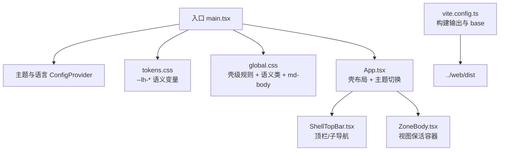
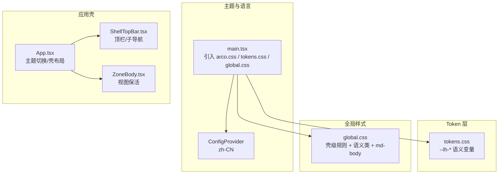
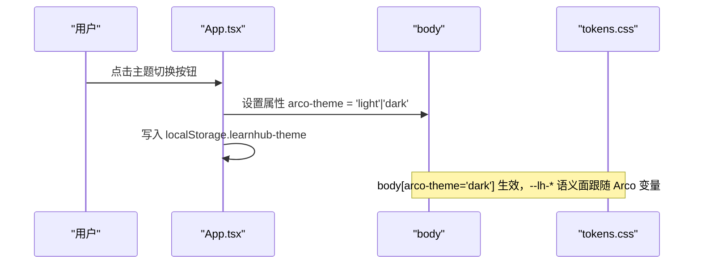
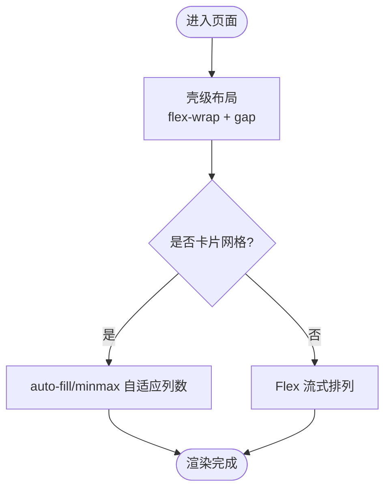
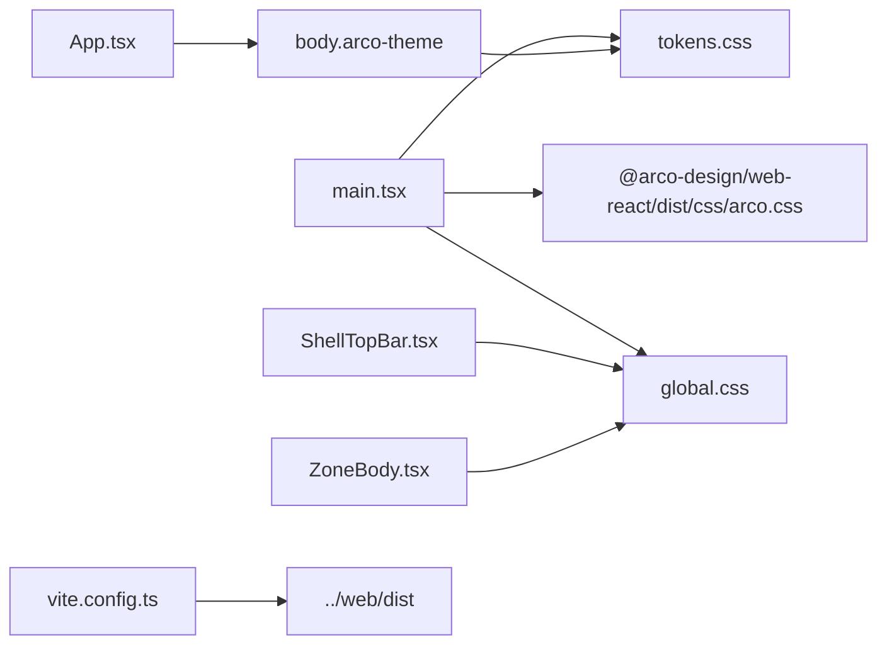

# 样式系统设计

<cite>
**本文引用的文件**
- [ui/src/main.tsx](file://ui/src/main.tsx)
- [ui/src/tokens.css](file://ui/src/tokens.css)
- [ui/src/global.css](file://ui/src/global.css)
- [ui/src/App.tsx](file://ui/src/App.tsx)
- [ui/src/components/ShellTopBar.tsx](file://ui/src/components/ShellTopBar.tsx)
- [ui/src/components/ZoneBody.tsx](file://ui/src/components/ZoneBody.tsx)
- [ui/vite.config.ts](file://ui/vite.config.ts)
- [ui/package.json](file://ui/package.json)
</cite>

## 目录
1. [简介](#简介)
2. [项目结构](#项目结构)
3. [核心组件](#核心组件)
4. [架构总览](#架构总览)
5. [详细组件分析](#详细组件分析)
6. [依赖关系分析](#依赖关系分析)
7. [性能考量](#性能考量)
8. [故障排查指南](#故障排查指南)
9. [结论](#结论)
10. [附录](#附录)

## 简介
本文件面向 LearnHub 前端样式系统，系统性说明全局样式、组件样式与页面样式的组织方式；阐述响应式设计与移动端适配策略；解释主题定制机制（颜色变量、字体规范、布局系统）；总结样式性能优化手段（模块化、按需加载、压缩）；提供开发规范（BEM 命名、CSS 变量使用、跨浏览器兼容）；并给出调试工具与测试方法。

## 项目结构
LearnHub 面板 UI 采用 Vite + React 工程，样式体系围绕“设计 Token 层 → 全局语义类层 → 组件/页面级样式”的三层模型构建：
- 入口与主题切换：main.tsx 引入 Arco 基础样式、tokens.css、global.css，并通过 ConfigProvider 注入中文语言包。
- 设计 Token 层：tokens.css 在 body 上声明 --lh-* 语义变量，统一间距、字号、圆角、动效与亮/暗主题面。
- 全局语义类层：global.css 提供壳级布局与通用语义类（如 lh-flex、lh-gap-*、lh-t-*），以及阅读排版（md-body）、卡片/调用块等常用 UI 原语。
- 组件与页面：App.tsx 负责壳结构与主题切换；ShellTopBar.tsx 实现顶栏与课程区子导航；ZoneBody.tsx 实现视图保活容器；各页面与组件复用 tokens 与语义类。
- 构建配置：vite.config.ts 将产物输出到 ../web/dist，base 为相对路径，便于宿主以 /learnhub/* 前缀托管。



**图示来源**
- [ui/src/main.tsx:1-16](file://ui/src/main.tsx#L1-L16)
- [ui/src/tokens.css:1-63](file://ui/src/tokens.css#L1-L63)
- [ui/src/global.css:1-398](file://ui/src/global.css#L1-L398)
- [ui/src/App.tsx:1-180](file://ui/src/App.tsx#L1-L180)
- [ui/src/components/ShellTopBar.tsx:1-64](file://ui/src/components/ShellTopBar.tsx#L1-L64)
- [ui/src/components/ZoneBody.tsx:1-43](file://ui/src/components/ZoneBody.tsx#L1-L43)
- [ui/vite.config.ts:1-15](file://ui/vite.config.ts#L1-L15)

**章节来源**
- [ui/src/main.tsx:1-16](file://ui/src/main.tsx#L1-L16)
- [ui/src/tokens.css:1-63](file://ui/src/tokens.css#L1-L63)
- [ui/src/global.css:1-398](file://ui/src/global.css#L1-L398)
- [ui/src/App.tsx:1-180](file://ui/src/App.tsx#L1-L180)
- [ui/src/components/ShellTopBar.tsx:1-64](file://ui/src/components/ShellTopBar.tsx#L1-L64)
- [ui/src/components/ZoneBody.tsx:1-43](file://ui/src/components/ZoneBody.tsx#L1-L43)
- [ui/vite.config.ts:1-15](file://ui/vite.config.ts#L1-L15)

## 核心组件
- 设计 Token 层（tokens.css）
  - 间距：基于 4px 基尺的 --lh-space-* 阶梯。
  - 字号：--lh-font-2xs ~ --lh-font-xl 的阶梯，正文阅读在 md-body 单独设定。
  - 圆角：--lh-radius-sm/md/lg/card，统一卡片观感。
  - 动效：--lh-motion-fast/--lh-motion 统一过渡时长与缓动。
  - 主题面：--lh-bg/surface/border/text/accent/shadow 等语义面，亮色通过 Arco 变量映射，暗色通过 body[arco-theme='dark'] 覆盖阴影等差异。
- 全局语义类层（global.css）
  - 壳级布局：app-shell、shell-topbar、shell-zones、shell-controls、shell-subnav 等。
  - 语义类：文本（lh-muted/lh-strong/lh-t-*）、布局与间距（lh-flex/lh-gap-*、lh-mt-*、lh-p-*）、尺寸与定位（lh-w-*、lh-h-*、lh-absolute/relative）、面/卡/图元（lh-card、lh-callout-*、lh-quote-*）。
  - 阅读排版：md-body 及其子元素排版规范，支持代码块、表格、公式、媒体自适应。
  - 动画与提示：生成任务高亮闪烁、浮动提示等。
- 壳与路由容器
  - App.tsx：管理主题切换（设置 body.arco-theme）、加载态/致命态、空课程提示、视图导航与保活信号。
  - ShellTopBar.tsx：五区页签与课程区三入口子导航，右侧控制区（通知占位、帮助、主题切换）。
  - ZoneBody.tsx：按访问历史渲染对应页面，隐藏视图保留状态，配合 active-tab 跳过轮询。

**章节来源**
- [ui/src/tokens.css:1-63](file://ui/src/tokens.css#L1-L63)
- [ui/src/global.css:1-398](file://ui/src/global.css#L1-L398)
- [ui/src/App.tsx:1-180](file://ui/src/App.tsx#L1-L180)
- [ui/src/components/ShellTopBar.tsx:1-64](file://ui/src/components/ShellTopBar.tsx#L1-L64)
- [ui/src/components/ZoneBody.tsx:1-43](file://ui/src/components/ZoneBody.tsx#L1-L43)

## 架构总览
样式架构遵循“Token → 语义类 → 组件/页面”的分层原则，确保视觉一致性、可维护性与主题可替换性。



**图示来源**
- [ui/src/main.tsx:1-16](file://ui/src/main.tsx#L1-L16)
- [ui/src/tokens.css:1-63](file://ui/src/tokens.css#L1-L63)
- [ui/src/global.css:1-398](file://ui/src/global.css#L1-L398)
- [ui/src/App.tsx:1-180](file://ui/src/App.tsx#L1-L180)
- [ui/src/components/ShellTopBar.tsx:1-64](file://ui/src/components/ShellTopBar.tsx#L1-L64)
- [ui/src/components/ZoneBody.tsx:1-43](file://ui/src/components/ZoneBody.tsx#L1-L43)

## 详细组件分析

### 主题定制机制
- 亮/暗主题切换
  - App.tsx 根据用户偏好或系统设置初始化主题，并将值写入 localStorage 与 body.arco-theme。
  - tokens.css 中 body[arco-theme='dark'] 仅补充暗色差异（如阴影），其余语义面通过 Arco 变量自动翻转。
- 颜色与字体
  - 所有颜色通过 --lh-* 语义别名消费，避免硬编码色值；字体大小通过 --lh-font-* 阶梯统一。
- 布局与动效
  - 间距与圆角通过 --lh-space-* 与 --lh-radius-* 统一；过渡时长通过 --lh-motion-* 统一。



**图示来源**
- [ui/src/App.tsx:119-128](file://ui/src/App.tsx#L119-L128)
- [ui/src/tokens.css:16-63](file://ui/src/tokens.css#L16-L63)

**章节来源**
- [ui/src/App.tsx:119-128](file://ui/src/App.tsx#L119-L128)
- [ui/src/tokens.css:16-63](file://ui/src/tokens.css#L16-L63)

### 响应式设计与移动端适配
- 流式布局与弹性换行
  - shell-topbar 使用 flex-wrap 与 wrap 能力，在小屏下自动折行；shell-subnav 使用 flex-basis: 100% 独占一行。
- 视口高度与内容区域
  - dag-wrap 使用 calc(100vh - 固定偏移) 保证图表画布高度稳定；app-body 使用 padding 与 overflow 适配滚动。
- 栅格与卡片网格
  - lh-grid-cards 使用 auto-fill + minmax 实现自适应列数；lh-grid-stats 使用 auto-fit 实现统计卡片自适应。
- 断点管理
  - 当前未定义显式 @media 断点，主要依赖 Flex/Grid 自适应与语义类组合；如需强断点行为，可在 global.css 中扩展。



**图示来源**
- [ui/src/global.css:21-44](file://ui/src/global.css#L21-L44)
- [ui/src/global.css:375-377](file://ui/src/global.css#L375-L377)

**章节来源**
- [ui/src/global.css:21-44](file://ui/src/global.css#L21-L44)
- [ui/src/global.css:375-377](file://ui/src/global.css#L375-L377)

### 组件样式与页面样式组织
- 组件样式
  - 组件内尽量复用 global.css 中的语义类（如 lh-flex、lh-gap-*、lh-card、lh-callout-*），避免重复定义。
  - ShellTopBar 使用壳级类名（shell-topbar、shell-zones、shell-controls、shell-subnav）保持壳级一致性。
- 页面样式
  - 页面级样式集中在 global.css 的语义类层，例如今日页头与供给行（today-head、today-supply-row）等。
- 阅读排版
  - md-body 统一正文阅读体验，限制最大宽度、标题层级、列表缩进、代码块与表格样式，并支持公式与媒体横向滚动。

```mermaid
classDiagram
class GlobalStyles {
"+壳级布局类"
"+语义类(lh-*)"
"+阅读排版(md-body)"
}
class ShellTopBar {
"+顶栏/子导航"
"+使用壳级类"
}
class ZoneBody {
"+视图保活容器"
"+条件渲染页面"
}
GlobalStyles <.. ShellTopBar : "消费"
GlobalStyles <.. ZoneBody : "消费"
```

**图示来源**
- [ui/src/global.css:1-398](file://ui/src/global.css#L1-L398)
- [ui/src/components/ShellTopBar.tsx:1-64](file://ui/src/components/ShellTopBar.tsx#L1-L64)
- [ui/src/components/ZoneBody.tsx:1-43](file://ui/src/components/ZoneBody.tsx#L1-L43)

**章节来源**
- [ui/src/global.css:1-398](file://ui/src/global.css#L1-L398)
- [ui/src/components/ShellTopBar.tsx:1-64](file://ui/src/components/ShellTopBar.tsx#L1-L64)
- [ui/src/components/ZoneBody.tsx:1-43](file://ui/src/components/ZoneBody.tsx#L1-L43)

### 样式开发规范
- BEM 命名约定
  - 壳级与组件类采用 BEM 风格：block（如 app-shell）、element（如 shell-topbar、shell-zones）、modifier（如 zone-view-active）。
- CSS 变量使用
  - 所有静态样式必须通过 --lh-* 语义变量表达；仅在必要处使用字面量兜底（如强调面背景 #fff）。
- 跨浏览器兼容性
  - 使用现代 CSS（Flex/Grid/Calc/Transition），对旧环境可通过 fallback 值保障降级；公式与媒体通过 overflow-x 处理溢出。
- 内联样式纪律
  - 静态样式一律走语义类；动态值（进度条宽度、数据驱动着色）才允许内联 style，由测试门约束。

**章节来源**
- [ui/src/global.css:196-398](file://ui/src/global.css#L196-L398)
- [ui/src/tokens.css:1-63](file://ui/src/tokens.css#L1-L63)

## 依赖关系分析
- 样式依赖链
  - main.tsx 依次引入 Arco 基础样式、tokens.css、global.css，确保变量与全局规则优先加载。
  - App.tsx 通过设置 body.arco-theme 触发 tokens.css 中暗色分支，影响全局语义面。
  - ShellTopBar 与 ZoneBody 作为壳级组件，消费 global.css 的壳级类与语义类。
- 构建与资源
  - vite.config.ts 将产物输出至 ../web/dist，base 为相对路径，资源引用不受根路径影响。
  - package.json 依赖 Arco 组件库，样式通过 dist/css/arco.css 引入。



**图示来源**
- [ui/src/main.tsx:1-16](file://ui/src/main.tsx#L1-L16)
- [ui/src/App.tsx:119-128](file://ui/src/App.tsx#L119-L128)
- [ui/src/tokens.css:16-63](file://ui/src/tokens.css#L16-L63)
- [ui/src/components/ShellTopBar.tsx:1-64](file://ui/src/components/ShellTopBar.tsx#L1-L64)
- [ui/src/components/ZoneBody.tsx:1-43](file://ui/src/components/ZoneBody.tsx#L1-L43)
- [ui/vite.config.ts:1-15](file://ui/vite.config.ts#L1-L15)
- [ui/package.json:12-18](file://ui/package.json#L12-L18)

**章节来源**
- [ui/src/main.tsx:1-16](file://ui/src/main.tsx#L1-L16)
- [ui/src/App.tsx:119-128](file://ui/src/App.tsx#L119-L128)
- [ui/src/tokens.css:16-63](file://ui/src/tokens.css#L16-L63)
- [ui/src/components/ShellTopBar.tsx:1-64](file://ui/src/components/ShellTopBar.tsx#L1-L64)
- [ui/src/components/ZoneBody.tsx:1-43](file://ui/src/components/ZoneBody.tsx#L1-L43)
- [ui/vite.config.ts:1-15](file://ui/vite.config.ts#L1-L15)
- [ui/package.json:12-18](file://ui/package.json#L12-L18)

## 性能考量
- 模块化与按需加载
  - 通过 Vite 与 React 插件进行 Tree-shaking；Arco 图标与组件按需导入，减少打包体积。
  - 样式分层清晰，避免重复定义，利于浏览器缓存与增量更新。
- 构建优化
  - chunkSizeWarningLimit 控制分包大小警告阈值；emptyOutDir 清理旧产物；base 为相对路径，减少资源解析开销。
- 运行时性能
  - 使用 CSS 变量与 transition 提升主题切换流畅度；隐藏视图通过 display:none 降低重排成本。
- 建议
  - 新增样式优先复用语义类；复杂交互考虑懒加载相关模块；定期审计 bundle 体积与样式覆盖率。

**章节来源**
- [ui/vite.config.ts:1-15](file://ui/vite.config.ts#L1-L15)
- [ui/package.json:29-43](file://ui/package.json#L29-L43)

## 故障排查指南
- 主题不生效
  - 检查 App.tsx 是否正确设置 body.arco-theme；确认 tokens.css 中暗色分支未被覆盖。
- 壳级样式异常
  - 检查 global.css 中壳级类是否被第三方样式覆盖；确认引入顺序（main.tsx 中先引入 tokens.css 再 global.css）。
- 图表高度塌陷
  - dag-wrap 需确保父容器高度确定；必要时调整 calc(100vh - 偏移) 的值。
- 阅读排版错乱
  - 检查 md-body 是否被额外样式干扰；确认公式与媒体容器具备横向滚动能力。
- 构建产物路径错误
  - 核对 vite.config.ts 的 outDir 与 base；确保宿主以 /learnhub/* 正确托管。

**章节来源**
- [ui/src/App.tsx:119-128](file://ui/src/App.tsx#L119-L128)
- [ui/src/global.css:126-132](file://ui/src/global.css#L126-L132)
- [ui/src/global.css:138-175](file://ui/src/global.css#L138-L175)
- [ui/vite.config.ts:4-13](file://ui/vite.config.ts#L4-L13)

## 结论
LearnHub 前端样式系统通过清晰的三层架构（Token → 语义类 → 组件/页面）实现了主题化、一致性与可维护性。借助 Arco 变量与自建 --lh-* 语义别名，亮/暗主题无缝切换；通过语义类与阅读排版规范，统一了界面语言与可读性；结合 Vite 构建优化与模块化实践，保障了性能与可扩展性。建议在后续迭代中继续收敛内联样式、完善断点策略，并持续进行样式审计与测试。

## 附录
- 调试工具
  - 浏览器开发者工具：检查 computed styles、CSS 变量值与主题切换效果。
  - 网络面板：验证样式资源加载顺序与缓存命中。
- 测试方法
  - 视觉回归：对比截图或像素级差异，确保主题与布局变更不影响关键页面。
  - 单元/集成测试：针对路由与视图保活逻辑，确保样式类名与 DOM 结构一致。
  - 预算门：遵循 tests/ui-budget.test.ts 的约束，限制内联样式与硬编码色值。