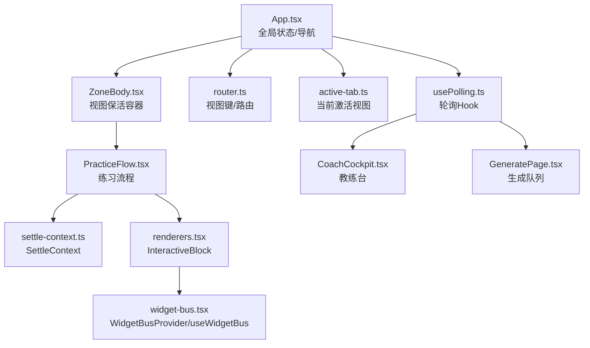
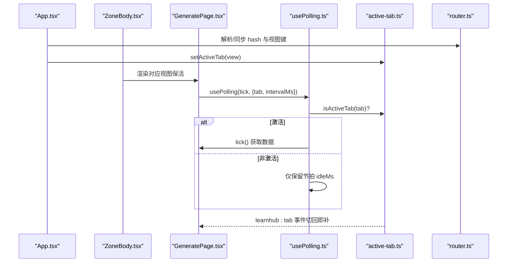
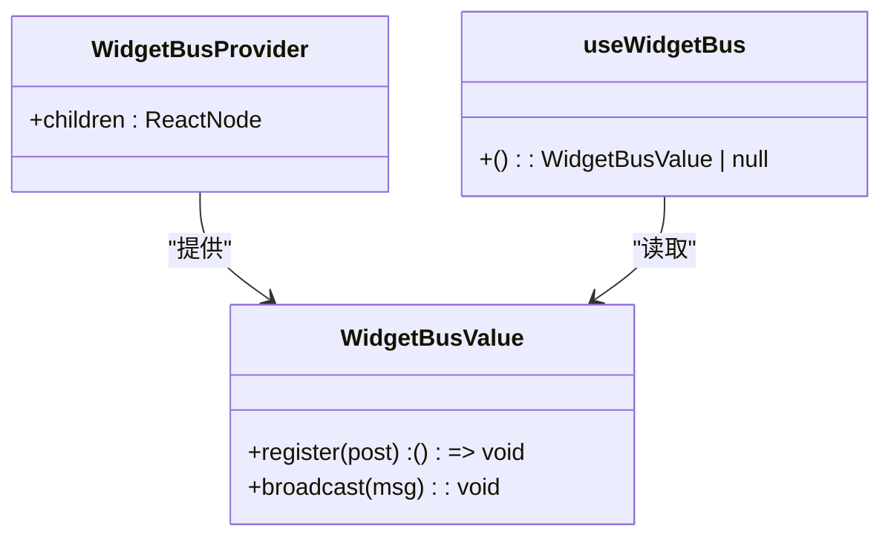
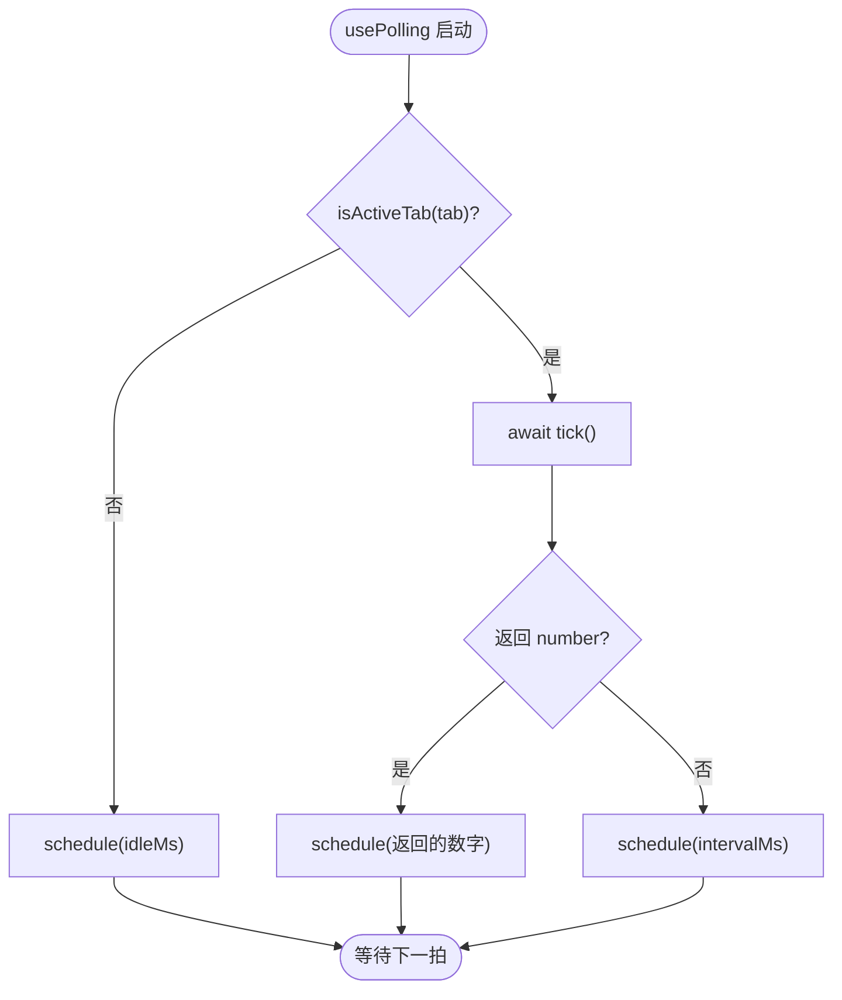
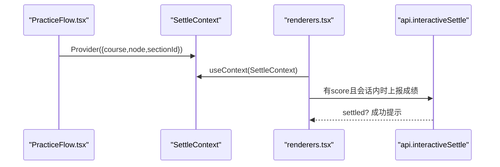
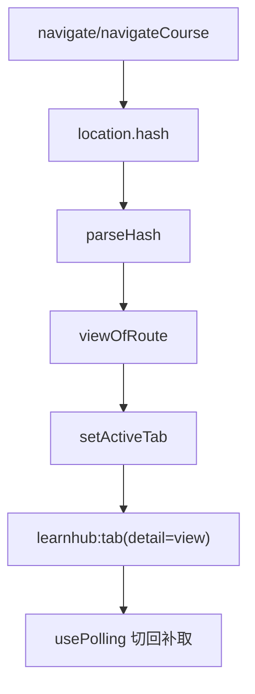
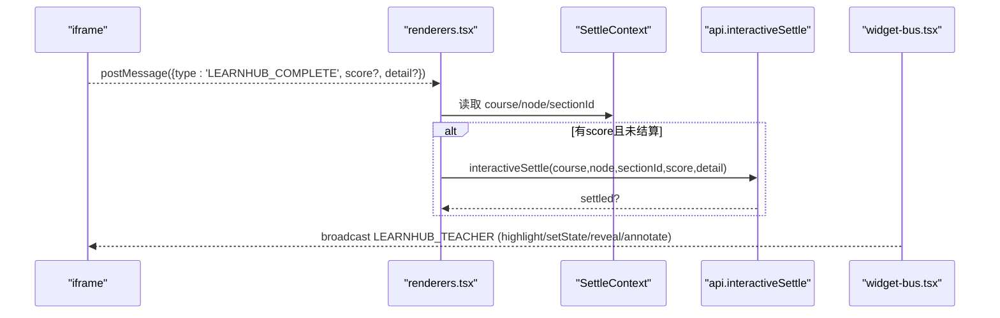
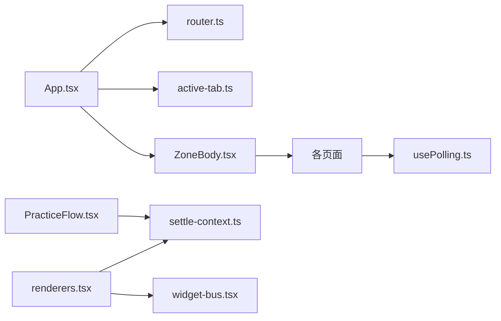

# 状态管理方案

<cite>
**本文引用的文件**
- [ui/src/components/widget-bus.tsx](file://ui/src/components/widget-bus.tsx)
- [ui/src/hooks/usePolling.ts](file://ui/src/hooks/usePolling.ts)
- [ui/src/lib/settle-context.ts](file://ui/src/lib/settle-context.ts)
- [ui/src/App.tsx](file://ui/src/App.tsx)
- [ui/src/main.tsx](file://ui/src/main.tsx)
- [ui/src/lib/router.ts](file://ui/src/lib/router.ts)
- [ui/src/active-tab.ts](file://ui/src/active-tab.ts)
- [ui/src/components/ZoneBody.tsx](file://ui/src/components/ZoneBody.tsx)
- [ui/src/components/PracticeFlow.tsx](file://ui/src/components/PracticeFlow.tsx)
- [ui/src/components/renderers.tsx](file://ui/src/components/renderers.tsx)
- [ui/src/components/CoachCockpit.tsx](file://ui/src/components/CoachCockpit.tsx)
- [ui/src/pages/GeneratePage.tsx](file://ui/src/pages/GeneratePage.tsx)
</cite>

## 目录
1. [简介](#简介)
2. [项目结构](#项目结构)
3. [核心组件](#核心组件)
4. [架构总览](#架构总览)
5. [详细组件分析](#详细组件分析)
6. [依赖关系分析](#依赖关系分析)
7. [性能考量](#性能考量)
8. [故障排查指南](#故障排查指南)
9. [结论](#结论)
10. [附录](#附录)

## 简介
本方案为 LearnHub 前端的状态管理提供统一模式：以 React Context 承载跨层级共享状态，配合自定义 Hook 封装通用行为（轮询、事件总线、上下文结算），并通过路由与页签保活机制协调多视图的更新策略。重点包括：
- widget-bus 组件总线：用于在 LessonView 范围内向交互件 iframe 广播“AI 老师”动作（高亮、设置状态、揭示、批注）。
- usePolling Hook：统一的页签保活轮询，支持激活/非激活态差异化调度与切回补取。
- settle-context：在复杂练习流中提供结算所需的课程/节点/小节信息，供交互件上报成绩时消费。
- 最佳实践：状态提升、局部状态优化、性能与错误处理策略。

## 项目结构
LearnHub 的前端位于 ui/src，围绕以下关键模块组织状态管理：
- 应用壳与全局状态：App.tsx 维护顶层导航、课程树、当前课程、学习视图等；main.tsx 注入国际化配置。
- 路由与页签保活：lib/router.ts 定义视图键与 hash 路由；active-tab.ts 维护当前激活视图并广播切回事件；ZoneBody.tsx 实现视图保活容器。
- 业务状态与上下文：PracticeFlow.tsx 使用 SettleContext 提供交互节结算上下文；renderers.tsx 中的 InteractiveBlock 消费该上下文并上报成绩。
- 组件总线：widget-bus.tsx 提供 WidgetBusProvider 与 useWidgetBus，用于向 iframe 广播 AI 老师动作。
- 轮询：usePolling.ts 被教练台、生成队列、提案收件箱等页面复用，实现统一的轮询语义。

图表来源
- [ui/src/App.tsx:47-117](file://ui/src/App.tsx#L47-L117)
- [ui/src/components/ZoneBody.tsx:1-43](file://ui/src/components/ZoneBody.tsx#L1-L43)
- [ui/src/components/PracticeFlow.tsx:336-352](file://ui/src/components/PracticeFlow.tsx#L336-L352)
- [ui/src/lib/settle-context.ts:1-9](file://ui/src/lib/settle-context.ts#L1-L9)
- [ui/src/components/renderers.tsx:66-114](file://ui/src/components/renderers.tsx#L66-L114)
- [ui/src/components/widget-bus.tsx:1-50](file://ui/src/components/widget-bus.tsx#L1-L50)
- [ui/src/lib/router.ts:1-164](file://ui/src/lib/router.ts#L1-L164)
- [ui/src/active-tab.ts:1-38](file://ui/src/active-tab.ts#L1-L38)
- [ui/src/hooks/usePolling.ts:1-48](file://ui/src/hooks/usePolling.ts#L1-L48)
- [ui/src/components/CoachCockpit.tsx:1-200](file://ui/src/components/CoachCockpit.tsx#L1-L200)
- [ui/src/pages/GeneratePage.tsx:1-200](file://ui/src/pages/GeneratePage.tsx#L1-L200)

章节来源
- [ui/src/App.tsx:47-117](file://ui/src/App.tsx#L47-L117)
- [ui/src/main.tsx:1-16](file://ui/src/main.tsx#L1-L16)
- [ui/src/lib/router.ts:1-164](file://ui/src/lib/router.ts#L1-L164)
- [ui/src/active-tab.ts:1-38](file://ui/src/active-tab.ts#L1-L38)
- [ui/src/components/ZoneBody.tsx:1-43](file://ui/src/components/ZoneBody.tsx#L1-L43)

## 核心组件
- 应用框架 App.tsx：集中管理状态（status、tree、course、lesson、focusNode/focusJob）、导航与主题切换；通过 ZoneBody 渲染各视图，并将 frame 对象作为 props 向下传递。
- 视图保活 ZoneBody.tsx：基于 visited 集合保留已访问视图，隐藏视图仅 CSS 隐藏，避免重挂载；结合 active-tab 与 usePolling 实现后台轮询节流。
- 路由 router.ts：定义区键、子路由、工作台分栏、视图键映射与程序化跳转；保证 URL 权威性与规范化。
- 页签保活 active-tab.ts：维护当前激活视图键，并在变化时广播 learnhub:tab 事件，供各页订阅切回逻辑。
- 轮询 Hook usePolling.ts：封装 setInterval + isActiveTab 门 + 切回补取；tick 返回数字可定制下次延迟，undefined 则使用默认间隔。
- 组件总线 widget-bus.tsx：提供 register/broadcast，使 LessonView 可向当前视图内所有交互件广播 LEARNHUB_TEACHER 动作。
- 结算上下文 settle-context.ts：提供 course/node/sectionId，供 InteractiveBlock 在交互节轮上报成绩时使用。
- 交互块 renderers.tsx：监听 iframe postMessage，完成时根据 SettleContext 决定是否上报 /interactive/settle；注册 widget-bus 发送器以接收 AI 老师动作。
- 教练台 CoachCockpit.tsx：使用 usePolling 低频轮询复诊数据，展示就绪深度与操作入口。
- 生成队列 GeneratePage.tsx：使用 usePolling 高频轮询任务注册表与队列，支持切片形态（单课工作台）与全局视图。

章节来源
- [ui/src/App.tsx:47-180](file://ui/src/App.tsx#L47-L180)
- [ui/src/components/ZoneBody.tsx:1-43](file://ui/src/components/ZoneBody.tsx#L1-L43)
- [ui/src/lib/router.ts:1-164](file://ui/src/lib/router.ts#L1-L164)
- [ui/src/active-tab.ts:1-38](file://ui/src/active-tab.ts#L1-L38)
- [ui/src/hooks/usePolling.ts:1-48](file://ui/src/hooks/usePolling.ts#L1-L48)
- [ui/src/components/widget-bus.tsx:1-50](file://ui/src/components/widget-bus.tsx#L1-L50)
- [ui/src/lib/settle-context.ts:1-9](file://ui/src/lib/settle-context.ts#L1-L9)
- [ui/src/components/renderers.tsx:66-114](file://ui/src/components/renderers.tsx#L66-L114)
- [ui/src/components/CoachCockpit.tsx:1-200](file://ui/src/components/CoachCockpit.tsx#L1-L200)
- [ui/src/pages/GeneratePage.tsx:1-200](file://ui/src/pages/GeneratePage.tsx#L1-L200)

## 架构总览
下图展示了从 App 到具体页面的状态流转与控制流：App 维护全局状态与导航，ZoneBody 负责视图保活；各页面通过 usePolling 进行数据刷新；PracticeFlow 提供 SettleContext 给交互块；widget-bus 提供跨组件通信通道。

图表来源
- [ui/src/App.tsx:102-117](file://ui/src/App.tsx#L102-L117)
- [ui/src/components/ZoneBody.tsx:21-43](file://ui/src/components/ZoneBody.tsx#L21-L43)
- [ui/src/pages/GeneratePage.tsx:75-109](file://ui/src/pages/GeneratePage.tsx#L75-L109)
- [ui/src/hooks/usePolling.ts:15-47](file://ui/src/hooks/usePolling.ts#L15-L47)
- [ui/src/active-tab.ts:15-27](file://ui/src/active-tab.ts#L15-L27)
- [ui/src/lib/router.ts:72-164](file://ui/src/lib/router.ts#L72-L164)

## 详细组件分析

### widget-bus 组件总线
设计目标：在 LessonView 范围内，向所有注册的交互件 iframe 广播“AI 老师”动作（highlight、setState、reveal、annotate）。Provider 挂在 LessonView；无 Provider 时 useWidgetBus 返回 null，交互件仍可渲染但无广播能力。

图表来源
- [ui/src/components/widget-bus.tsx:24-49](file://ui/src/components/widget-bus.tsx#L24-L49)

使用方式：
- 在 LessonView 或需要广播能力的父级包裹 WidgetBusProvider。
- 在交互块中通过 useWidgetBus().register 注册发送器，将消息转发至 iframe。
- 在面板侧调用 broadcast 发送 TeacherAction。

章节来源
- [ui/src/components/widget-bus.tsx:1-50](file://ui/src/components/widget-bus.tsx#L1-L50)
- [ui/src/components/renderers.tsx:110-114](file://ui/src/components/renderers.tsx#L110-L114)

### usePolling Hook
实现要点：
- 挂载即执行一次 tick（keep-alive 下仅在首次进入页签时挂载）。
- 激活页签：tick 后按返回值调度下一次（number=自定义延迟，undefined=默认 intervalMs）。
- 非激活页签：不取数，idleMs 后重查（仅保留节拍）。
- 监听 learnhub:tab 事件，命中本页签时立即补取。

图表来源
- [ui/src/hooks/usePolling.ts:15-47](file://ui/src/hooks/usePolling.ts#L15-L47)
- [ui/src/active-tab.ts:15-27](file://ui/src/active-tab.ts#L15-L27)

应用场景：
- 教练台：低频轮询复诊数据（30s）。
- 生成队列：高频轮询任务注册表与队列（5s）。
- 提案收件箱：中频轮询（8s）。
- 温控卡：低频轮询（60s）。

章节来源
- [ui/src/hooks/usePolling.ts:1-48](file://ui/src/hooks/usePolling.ts#L1-L48)
- [ui/src/components/CoachCockpit.tsx:91-91](file://ui/src/components/CoachCockpit.tsx#L91-L91)
- [ui/src/pages/GeneratePage.tsx:107-109](file://ui/src/pages/GeneratePage.tsx#L107-L109)
- [ui/src/pages/ProposalsPage.tsx:90-90](file://ui/src/pages/ProposalsPage.tsx#L90-L90)
- [ui/src/pages/WorkbenchPage/ThermostatCard.tsx:26-26](file://ui/src/pages/WorkbenchPage/ThermostatCard.tsx#L26-L26)

### settle-context 在复杂状态同步中的作用
作用：在 PracticeFlow 的交互节轮提供 course/node/sectionId，供 InteractiveBlock 在沙箱 iframe 上报 LEARNHUB_COMPLETE 且带 score 时调用 /interactive/settle，将成绩记入练习档案；自由阅读（无 Provider）只亮徽标不结算。

图表来源
- [ui/src/components/PracticeFlow.tsx:336-352](file://ui/src/components/PracticeFlow.tsx#L336-L352)
- [ui/src/lib/settle-context.ts:1-9](file://ui/src/lib/settle-context.ts#L1-L9)
- [ui/src/components/renderers.tsx:66-96](file://ui/src/components/renderers.tsx#L66-L96)

章节来源
- [ui/src/components/PracticeFlow.tsx:336-352](file://ui/src/components/PracticeFlow.tsx#L336-L352)
- [ui/src/lib/settle-context.ts:1-9](file://ui/src/lib/settle-context.ts#L1-L9)
- [ui/src/components/renderers.tsx:66-96](file://ui/src/components/renderers.tsx#L66-L96)

### 路由与视图保活
- 路由：viewOfRoute/routeOfView/syncHash/navigate/navigateCourse/onRouteChange 构成视图键与 hash 的双向映射；工作台视图键不可经 navigate 直达，需 navigateCourse。
- 视图保活：ZoneBody 维护 visited 集合，隐藏视图仅 CSS 隐藏；active-tab 维护当前激活视图键并广播 learnhub:tab 事件；usePolling 据此跳过非激活页签的取数。

图表来源
- [ui/src/lib/router.ts:106-164](file://ui/src/lib/router.ts#L106-L164)
- [ui/src/active-tab.ts:15-27](file://ui/src/active-tab.ts#L15-L27)
- [ui/src/hooks/usePolling.ts:34-46](file://ui/src/hooks/usePolling.ts#L34-L46)

章节来源
- [ui/src/lib/router.ts:1-164](file://ui/src/lib/router.ts#L1-L164)
- [ui/src/active-tab.ts:1-38](file://ui/src/active-tab.ts#L1-L38)
- [ui/src/components/ZoneBody.tsx:1-43](file://ui/src/components/ZoneBody.tsx#L1-L43)

### 交互块与成绩上报
- 交互块监听 iframe postMessage，收到 LEARNHUB_COMPLETE 时标记完成；若存在 SettleContext 且携带 score，则调用 api.interactiveSettle 上报成绩（防重复上报用 settledRef）。
- 同时注册 widget-bus 发送器，接收 AI 老师动作并转发至 iframe。

图表来源
- [ui/src/components/renderers.tsx:82-114](file://ui/src/components/renderers.tsx#L82-L114)
- [ui/src/components/widget-bus.tsx:32-44](file://ui/src/components/widget-bus.tsx#L32-L44)

章节来源
- [ui/src/components/renderers.tsx:66-114](file://ui/src/components/renderers.tsx#L66-L114)
- [ui/src/components/widget-bus.tsx:1-50](file://ui/src/components/widget-bus.tsx#L1-L50)

## 依赖关系分析
- App.tsx 依赖 router.ts 与 active-tab.ts 管理导航与视图保活；通过 ZoneBody 渲染页面。
- 各页面（CoachCockpit、GeneratePage、ProposalsPage、ThermostatCard）依赖 usePolling.ts 进行数据刷新。
- PracticeFlow.tsx 依赖 settle-context.ts 提供结算上下文；renderers.tsx 消费该上下文并调用 api。
- renderers.tsx 依赖 widget-bus.tsx 实现 AI 老师动作广播。

图表来源
- [ui/src/App.tsx:47-117](file://ui/src/App.tsx#L47-L117)
- [ui/src/components/ZoneBody.tsx:1-43](file://ui/src/components/ZoneBody.tsx#L1-L43)
- [ui/src/hooks/usePolling.ts:1-48](file://ui/src/hooks/usePolling.ts#L1-L48)
- [ui/src/components/PracticeFlow.tsx:336-352](file://ui/src/components/PracticeFlow.tsx#L336-L352)
- [ui/src/components/renderers.tsx:66-114](file://ui/src/components/renderers.tsx#L66-L114)
- [ui/src/components/widget-bus.tsx:1-50](file://ui/src/components/widget-bus.tsx#L1-L50)

章节来源
- [ui/src/App.tsx:47-117](file://ui/src/App.tsx#L47-L117)
- [ui/src/components/ZoneBody.tsx:1-43](file://ui/src/components/ZoneBody.tsx#L1-L43)
- [ui/src/hooks/usePolling.ts:1-48](file://ui/src/hooks/usePolling.ts#L1-L48)
- [ui/src/components/PracticeFlow.tsx:336-352](file://ui/src/components/PracticeFlow.tsx#L336-L352)
- [ui/src/components/renderers.tsx:66-114](file://ui/src/components/renderers.tsx#L66-L114)
- [ui/src/components/widget-bus.tsx:1-50](file://ui/src/components/widget-bus.tsx#L1-L50)

## 性能考量
- 视图保活：ZoneBody 使用 visited 集合与 CSS 隐藏，避免频繁卸载/挂载导致的重复请求与状态丢失。
- 轮询节流：usePolling 在非激活页签仅保留节拍，减少无效网络请求；支持自定义延迟以适应不同场景（如教练台 30s、生成队列 5s）。
- 最小化重渲染：App 将 frame 对象 memo 化并通过 props 传递；usePolling 将 tick 存入 ref，避免定时器重建。
- 防重复上报：InteractiveBlock 使用 settledRef 确保同一交互成绩只上报一次。
- 路由规范化：syncHash 仅在漂移时 replaceState，避免多余历史条目与事件风暴。

[本节为通用指导，无需特定文件引用]

## 故障排查指南
- 轮询不触发：检查 active-tab 是否正确设置当前视图键；确认 usePolling 的 tab 参数与当前视图一致；查看 learnhub:tab 事件是否派发。
- 成绩未记录：确认 PracticeFlow 是否提供 SettleContext；检查 InteractiveBlock 是否收到 LEARNHUB_COMPLETE 且携带 score；核对 api.interactiveSettle 调用是否成功。
- AI 老师动作无效：确认 WidgetBusProvider 是否包裹 LessonView；检查 useWidgetBus 是否返回非 null；验证 iframe 是否成功注册发送器。
- 路由异常：检查 parseHash 与 viewOfRoute 的映射；确认 navigate/navigateCourse 的使用是否符合视图键规范；观察 syncHash 是否修正了非法 hash。

章节来源
- [ui/src/hooks/usePolling.ts:15-47](file://ui/src/hooks/usePolling.ts#L15-L47)
- [ui/src/active-tab.ts:15-27](file://ui/src/active-tab.ts#L15-L27)
- [ui/src/components/renderers.tsx:82-96](file://ui/src/components/renderers.tsx#L82-L96)
- [ui/src/components/widget-bus.tsx:32-44](file://ui/src/components/widget-bus.tsx#L32-L44)
- [ui/src/lib/router.ts:72-164](file://ui/src/lib/router.ts#L72-L164)

## 结论
LearnHub 前端采用 React Context + 自定义 Hook 的组合，实现了清晰的状态分层与通用的行为抽象：
- widget-bus 提供跨组件的事件总线，解耦面板与交互件。
- usePolling 统一轮询语义，结合 active-tab 实现页签保活与资源节约。
- settle-context 在复杂练习流中提供必要的上下文，确保成绩结算的正确性。
- 路由与视图保活协同工作，保障多视图下的状态一致性与用户体验。

建议在实践中遵循状态提升、局部状态优化与性能调优原则，并结合错误处理策略提升系统健壮性。

[本节为总结，无需特定文件引用]

## 附录
- 最佳实践清单：
  - 状态提升：将跨组件共享状态上移至 App 或合适父级，通过 Context/props 传递。
  - 局部状态优化：使用 useState/useRef 管理组件内部状态，避免不必要的重渲染。
  - 性能考虑：合理使用 useMemo/useCallback；控制轮询频率；避免重复上报。
  - 错误处理：统一捕获并提示错误；对异步操作提供重试与降级路径。
  - 调试工具：利用浏览器事件监听 learnhub:tab；在开发环境打印路由与视图键；监控轮询触发次数。

[本节为通用指导，无需特定文件引用]